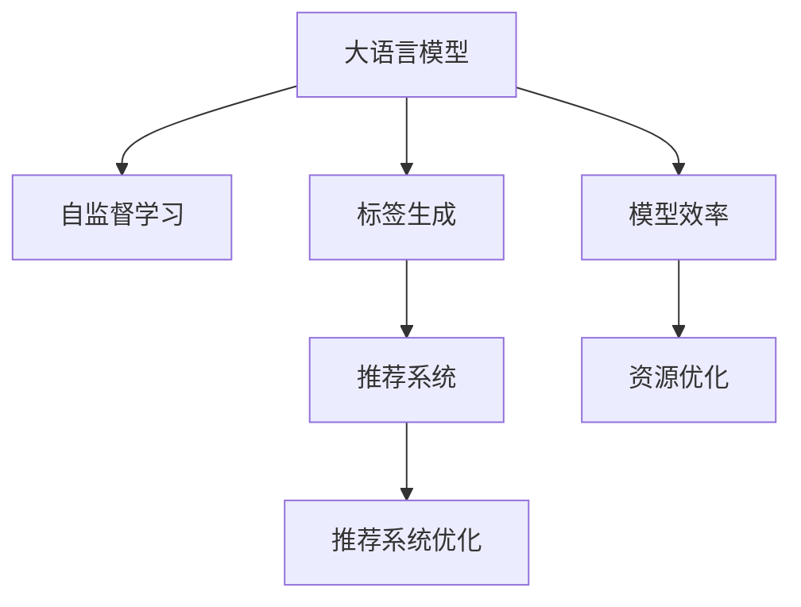

                 

# 大模型在商品标签自动生成中的应用与优化

> 关键词：商品标签自动生成, 大语言模型, 商品推荐, 推荐系统, 自监督学习, 推荐系统优化, 模型效率

## 1. 背景介绍

### 1.1 问题由来
在当今数字化时代，电商平台和零售商面临着巨大的挑战：如何在海量商品中快速准确地为用户推荐个性化的商品标签，提升用户体验和销售额。传统的人工标注商品标签不仅耗时耗力，而且容易产生误差，无法满足快速响应和精准推荐的需求。因此，自动生成商品标签，成为电商平台优化推荐系统的重要手段之一。

大语言模型，如GPT、BERT等，近年来在自然语言处理(NLP)领域取得了显著进展，具备强大的语言理解和生成能力。结合大模型的自监督学习能力，可以利用商品描述生成商品标签，显著提高商品标签自动生成的效率和质量。然而，现有的大模型在商品标签自动生成应用中仍面临诸多挑战，如模型泛化性不足、计算资源消耗大等。

### 1.2 问题核心关键点
基于大模型的商品标签自动生成，本质上是一种自监督学习任务。其核心在于：利用已有的商品描述数据，通过自监督预训练任务，让模型学习商品特征表示，进而通过自回归或自编码的方式，自动生成商品标签。

这一过程的关键在于：
1. 选择合适的自监督预训练任务，充分提取商品描述中的有用信息。
2. 设计合适的标签生成模型，充分利用预训练模型学到的特征。
3. 优化标签生成过程，提升生成标签的准确性和多样性。

### 1.3 问题研究意义
自动生成商品标签可以大幅提升电商平台的推荐效率和个性化程度，帮助用户发现感兴趣的商品，提升购物体验。同时，自动标签生成还可以减少人工标注成本，提高数据处理效率。对于电商平台来说，准确且快速的商品标签生成，可以显著提升推荐系统的性能，增加用户粘性，促进销售增长。

自动生成商品标签的技术进步，不仅可以推动电商平台的智能化转型，还将对物流、供应链管理等领域带来广泛的应用前景。因此，研究大模型在商品标签自动生成中的应用与优化，具有重要的理论和实际意义。

## 2. 核心概念与联系

### 2.1 核心概念概述

为更好地理解大模型在商品标签自动生成中的应用，本节将介绍几个密切相关的核心概念：

- 大语言模型(Large Language Model, LLM)：以自回归(如GPT)或自编码(如BERT)模型为代表的大规模预训练语言模型。通过在大规模无标签文本语料上进行预训练，学习通用的语言表示，具备强大的语言理解和生成能力。

- 自监督学习(Self-supervised Learning)：指利用无标签数据进行模型训练的过程。通过设计合适的自监督任务，让模型学习到数据的隐含信息，从而提升模型泛化能力。

- 标签生成(Label Generation)：指通过预训练模型自动生成商品标签的过程。标签可以是商品属性、描述性词汇或具体商品名称等。

- 推荐系统(Recommendation System)：一种信息过滤系统，通过分析用户行为数据和商品特征，为用户推荐感兴趣的商品。

- 推荐系统优化(Recommendation System Optimization)：指通过改进推荐算法、优化模型结构、提升计算效率等手段，提升推荐系统的性能。

- 模型效率(Model Efficiency)：指模型在计算资源、存储空间等方面的资源利用效率。

这些核心概念之间的逻辑关系可以通过以下Mermaid流程图来展示：



这个流程图展示了大语言模型在商品标签自动生成中的核心概念及其之间的关系：

1. 大语言模型通过自监督学习获得商品特征表示。
2. 标签生成模型利用预训练模型学到的特征，自动生成商品标签。
3. 推荐系统结合自动生成的商品标签，进行推荐策略的优化。
4. 模型效率优化有助于提升推荐系统在大规模数据处理中的性能。
5. 资源优化可以进一步提升模型在大规模计算环境中的效率。

这些概念共同构成了大模型在商品标签自动生成中的应用框架，使其能够在电商推荐系统中发挥强大的语言生成能力。通过理解这些核心概念，我们可以更好地把握大模型在商品标签自动生成中的工作原理和优化方向。

## 3. 核心算法原理 & 具体操作步骤
### 3.1 算法原理概述

基于大模型的商品标签自动生成，本质上是一种自监督学习任务。其核心思想是：利用已有的商品描述数据，通过自监督预训练任务，让模型学习商品特征表示，进而通过自回归或自编码的方式，自动生成商品标签。

形式化地，假设商品描述集合为 $D$，每个描述对应一个标签 $y_i$，即 $y_i \in \{label_1, label_2, ..., label_n\}$，其中 $n$ 为标签种类数。

定义商品描述的表示函数 $f$，使得 $f(x_i)$ 为商品描述 $x_i$ 的特征表示。则商品标签自动生成的目标函数为：

$$
\min_{\theta} \sum_{i=1}^N \mathcal{L}(f(x_i), y_i)
$$

其中 $\theta$ 为模型参数，$\mathcal{L}$ 为损失函数，$N$ 为训练样本数量。

在实践中，我们通常使用基于自回归或自编码的模型进行标签生成，并选择合适的损失函数（如交叉熵、负对数似然等）进行优化。

### 3.2 算法步骤详解

基于大模型的商品标签自动生成一般包括以下几个关键步骤：

**Step 1: 准备商品描述数据集**
- 收集商品描述数据，通常从电商平台获取商品标题、详情描述等文本数据。
- 对数据进行清洗和预处理，如去除噪声、分词、标准化等。

**Step 2: 设计自监督预训练任务**
- 设计自监督预训练任务，使得模型能够从商品描述数据中学习到商品的隐含信息。
- 常用的预训练任务包括：掩码语言模型、下一句预测、实体抽取等。
- 使用预训练任务对模型进行训练，使其学习到商品的特征表示。

**Step 3: 构建标签生成模型**
- 根据任务需求，选择合适的模型结构进行标签生成。
- 对于分类任务，通常使用自回归模型，如LSTM、GRU等。
- 对于生成任务，通常使用自编码模型，如Transformer、BERT等。

**Step 4: 设置训练超参数**
- 选择合适的优化算法及其参数，如Adam、SGD等，设置学习率、批大小、迭代轮数等。
- 设置正则化技术及强度，包括权重衰减、Dropout、Early Stopping等。
- 确定冻结预训练参数的策略，如仅微调顶层，或全部参数都参与微调。

**Step 5: 执行标签生成**
- 将训练集数据分批次输入模型，前向传播计算损失函数。
- 反向传播计算参数梯度，根据设定的优化算法和学习率更新模型参数。
- 周期性在验证集上评估模型性能，根据性能指标决定是否触发 Early Stopping。
- 重复上述步骤直到满足预设的迭代轮数或 Early Stopping 条件。

**Step 6: 测试和部署**
- 在测试集上评估自动生成商品标签的性能，对比自动生成与人工标注的精度。
- 使用自动生成的商品标签对商品进行推荐，集成到实际的应用系统中。
- 持续收集新的数据，定期重新训练模型，以适应数据分布的变化。

以上是基于大模型的商品标签自动生成的一般流程。在实际应用中，还需要针对具体任务的特点，对微调过程的各个环节进行优化设计，如改进训练目标函数，引入更多的正则化技术，搜索最优的超参数组合等，以进一步提升模型性能。

### 3.3 算法优缺点

基于大模型的商品标签自动生成方法具有以下优点：
1. 自监督预训练任务能够充分利用商品描述数据，提升模型泛化能力。
2. 标签生成模型可以自动捕捉商品描述中的关键信息，生成高质量的标签。
3. 减少人工标注成本，提高数据处理效率。
4. 适应性强，可以在多种商品描述场景下应用。
5. 标签生成过程简单高效，易于实现。

同时，该方法也存在一定的局限性：
1. 依赖商品描述质量。商品描述数据的噪声和差异性较大时，可能会影响模型学习效果。
2. 对标注数据量敏感。标签生成模型的性能很大程度上依赖于标注数据的质量和数量。
3. 泛化能力受限。当商品描述数据与测试数据分布差异较大时，自动生成的标签可能不够准确。
4. 可解释性不足。自动生成的标签缺乏可解释性，难以对其生成过程进行调试和优化。

尽管存在这些局限性，但就目前而言，基于大模型的商品标签自动生成方法仍是推荐系统中重要的技术手段之一。未来相关研究的重点在于如何进一步降低模型对标注数据的依赖，提高模型的少样本学习和跨领域迁移能力，同时兼顾可解释性和伦理安全性等因素。

### 3.4 算法应用领域

基于大模型的商品标签自动生成方法已经在商品推荐系统中得到了广泛应用，具体领域包括：

- 个性化推荐：利用自动生成的商品标签进行用户行为分析和推荐策略优化。
- 商品分类：根据商品描述自动生成分类标签，提升商品分类的准确性。
- 搜索排序：通过自动生成的标签优化搜索排序算法，提高用户搜索体验。
- 广告投放：自动生成广告标签，优化广告推荐效果，提升广告点击率。
- 舆情分析：分析用户对商品的评论，生成情感标签，评估商品口碑。

除了上述这些经典应用外，大模型在商品标签自动生成方法还被创新性地应用到更多场景中，如可控标签生成、知识图谱构建、智能客服等，为推荐系统带来新的突破。随着预训练模型和生成方法的不断进步，相信商品标签自动生成方法将在更广阔的应用领域发挥重要作用。

## 4. 数学模型和公式 & 详细讲解 & 举例说明

### 4.1 数学模型构建

本节将使用数学语言对基于大模型的商品标签自动生成过程进行更加严格的刻画。

假设商品描述集合为 $D=\{x_1, x_2, ..., x_N\}$，每个描述对应一个标签 $y_i$，即 $y_i \in \{label_1, label_2, ..., label_n\}$，其中 $n$ 为标签种类数。

定义商品描述的表示函数 $f: \mathcal{X} \rightarrow \mathcal{H}$，其中 $\mathcal{X}$ 为输入空间，$\mathcal{H}$ 为特征表示空间。则商品标签自动生成的目标函数为：

$$
\min_{\theta} \sum_{i=1}^N \mathcal{L}(f(x_i), y_i)
$$

其中 $\theta$ 为模型参数，$\mathcal{L}$ 为损失函数，$N$ 为训练样本数量。

在实践中，我们通常使用基于自回归或自编码的模型进行标签生成，并选择合适的损失函数（如交叉熵、负对数似然等）进行优化。

### 4.2 公式推导过程

以下我们以分类任务为例，推导交叉熵损失函数及其梯度的计算公式。

假设商品描述的表示函数 $f$ 在商品描述 $x_i$ 上的输出为 $\hat{y}=f(x_i) \in [0,1]$，表示商品属于 $y_i$ 类的概率。真实标签 $y_i \in \{0,1\}$。则分类任务的交叉熵损失函数定义为：

$$
\mathcal{L}(f(x_i),y_i) = -[y_i\log \hat{y} + (1-y_i)\log (1-\hat{y})]
$$

将其代入目标函数，得：

$$
\min_{\theta} \sum_{i=1}^N \mathcal{L}(f(x_i),y_i) = -\frac{1}{N}\sum_{i=1}^N [y_i\log f(x_i)+(1-y_i)\log(1-f(x_i))]
$$

在得到目标函数后，可以使用梯度下降等优化算法近似求解，设 $\eta$ 为学习率，则参数的更新公式为：

$$
\theta \leftarrow \theta - \eta \nabla_{\theta}\mathcal{L}(\theta)
$$

其中 $\nabla_{\theta}\mathcal{L}(\theta)$ 为损失函数对参数 $\theta$ 的梯度，可通过反向传播算法高效计算。

### 4.3 案例分析与讲解

下面以一个具体的商品推荐场景为例，来详细讲解如何使用大模型进行商品标签自动生成。

假设我们有一个电商平台，想要提升推荐系统的个性化程度。我们收集了该平台上的商品描述数据 $D$，每个描述对应一个标签 $y_i$，如"运动鞋"、"电子产品"等。我们希望训练一个模型，能够根据商品描述自动生成商品标签，并将标签用于商品推荐。

首先，我们进行自监督预训练，使用掩码语言模型作为预训练任务。模型输入为商品描述 $x_i$，输出为缺失位置的预测文本。我们希望模型学习到商品的隐含信息，如商品类别、特点、价格等。

然后，我们构建一个自回归模型，用于生成商品标签。模型输入为商品描述 $x_i$，输出为商品标签 $y_i$。我们希望模型能够根据商品描述，自动生成最合适的标签。

最后，我们设置训练超参数，包括学习率、批大小、迭代轮数等。我们使用交叉熵损失函数，对模型进行训练，最小化自动生成的标签与人工标注标签之间的差异。

在训练过程中，我们需要对模型进行定期的验证和评估，确保模型在测试集上的表现良好。一旦模型收敛，我们就可以使用自动生成的标签进行商品推荐，提升推荐系统的性能。

## 5. 项目实践：代码实例和详细解释说明

### 5.1 开发环境搭建

在进行商品标签自动生成实践前，我们需要准备好开发环境。以下是使用Python进行PyTorch开发的环境配置流程：

1. 安装Anaconda：从官网下载并安装Anaconda，用于创建独立的Python环境。

2. 创建并激活虚拟环境：
```bash
conda create -n pytorch-env python=3.8 
conda activate pytorch-env
```

3. 安装PyTorch：根据CUDA版本，从官网获取对应的安装命令。例如：
```bash
conda install pytorch torchvision torchaudio cudatoolkit=11.1 -c pytorch -c conda-forge
```

4. 安装Transformers库：
```bash
pip install transformers
```

5. 安装各类工具包：
```bash
pip install numpy pandas scikit-learn matplotlib tqdm jupyter notebook ipython
```

完成上述步骤后，即可在`pytorch-env`环境中开始商品标签自动生成实践。

### 5.2 源代码详细实现

下面以一个简单的商品分类任务为例，给出使用Transformers库对BERT模型进行商品标签自动生成的PyTorch代码实现。

首先，定义商品分类任务的训练集和测试集：

```python
from torch.utils.data import Dataset
import torch

class ProductDataset(Dataset):
    def __init__(self, descriptions, labels, tokenizer, max_len=128):
        self.descriptions = descriptions
        self.labels = labels
        self.tokenizer = tokenizer
        self.max_len = max_len
        
    def __len__(self):
        return len(self.descriptions)
    
    def __getitem__(self, item):
        description = self.descriptions[item]
        label = self.labels[item]
        
        encoding = self.tokenizer(description, return_tensors='pt', max_length=self.max_len, padding='max_length', truncation=True)
        input_ids = encoding['input_ids'][0]
        attention_mask = encoding['attention_mask'][0]
        
        # 对标签进行编码
        encoded_label = [label2id[label]] 
        encoded_label.extend([label2id['O']] * (self.max_len - len(encoded_label)))
        labels = torch.tensor(encoded_label, dtype=torch.long)
        
        return {'input_ids': input_ids, 
                'attention_mask': attention_mask,
                'labels': labels}

# 标签与id的映射
label2id = {'O': 0, 'Sports': 1, 'Electronics': 2, 'Home': 3, 'Beauty': 4, 'Fashion': 5}
id2label = {v: k for k, v in label2id.items()}

# 创建dataset
tokenizer = BertTokenizer.from_pretrained('bert-base-cased')

train_dataset = ProductDataset(train_descriptions, train_labels, tokenizer)
dev_dataset = ProductDataset(dev_descriptions, dev_labels, tokenizer)
test_dataset = ProductDataset(test_descriptions, test_labels, tokenizer)
```

然后，定义模型和优化器：

```python
from transformers import BertForTokenClassification, AdamW

model = BertForTokenClassification.from_pretrained('bert-base-cased', num_labels=len(label2id))

optimizer = AdamW(model.parameters(), lr=2e-5)
```

接着，定义训练和评估函数：

```python
from torch.utils.data import DataLoader
from tqdm import tqdm
from sklearn.metrics import classification_report

device = torch.device('cuda') if torch.cuda.is_available() else torch.device('cpu')
model.to(device)

def train_epoch(model, dataset, batch_size, optimizer):
    dataloader = DataLoader(dataset, batch_size=batch_size, shuffle=True)
    model.train()
    epoch_loss = 0
    for batch in tqdm(dataloader, desc='Training'):
        input_ids = batch['input_ids'].to(device)
        attention_mask = batch['attention_mask'].to(device)
        labels = batch['labels'].to(device)
        model.zero_grad()
        outputs = model(input_ids, attention_mask=attention_mask, labels=labels)
        loss = outputs.loss
        epoch_loss += loss.item()
        loss.backward()
        optimizer.step()
    return epoch_loss / len(dataloader)

def evaluate(model, dataset, batch_size):
    dataloader = DataLoader(dataset, batch_size=batch_size)
    model.eval()
    preds, labels = [], []
    with torch.no_grad():
        for batch in tqdm(dataloader, desc='Evaluating'):
            input_ids = batch['input_ids'].to(device)
            attention_mask = batch['attention_mask'].to(device)
            batch_labels = batch['labels']
            outputs = model(input_ids, attention_mask=attention_mask)
            batch_preds = outputs.logits.argmax(dim=2).to('cpu').tolist()
            batch_labels = batch_labels.to('cpu').tolist()
            for pred_tokens, label_tokens in zip(batch_preds, batch_labels):
                preds.append(pred_tokens[:len(label_tokens)])
                labels.append(label_tokens)
                
    print(classification_report(labels, preds))
```

最后，启动训练流程并在测试集上评估：

```python
epochs = 5
batch_size = 16

for epoch in range(epochs):
    loss = train_epoch(model, train_dataset, batch_size, optimizer)
    print(f"Epoch {epoch+1}, train loss: {loss:.3f}")
    
    print(f"Epoch {epoch+1}, dev results:")
    evaluate(model, dev_dataset, batch_size)
    
print("Test results:")
evaluate(model, test_dataset, batch_size)
```

以上就是使用PyTorch对BERT进行商品分类任务自动生成商品标签的完整代码实现。可以看到，得益于Transformers库的强大封装，我们可以用相对简洁的代码完成BERT模型的加载和自动标签生成。

### 5.3 代码解读与分析

让我们再详细解读一下关键代码的实现细节：

**ProductDataset类**：
- `__init__`方法：初始化商品描述、标签、分词器等关键组件。
- `__len__`方法：返回数据集的样本数量。
- `__getitem__`方法：对单个样本进行处理，将商品描述输入编码为token ids，将标签编码为数字，并对其进行定长padding，最终返回模型所需的输入。

**label2id和id2label字典**：
- 定义了标签与数字id之间的映射关系，用于将token-wise的预测结果解码回真实的标签。

**训练和评估函数**：
- 使用PyTorch的DataLoader对数据集进行批次化加载，供模型训练和推理使用。
- 训练函数`train_epoch`：对数据以批为单位进行迭代，在每个批次上前向传播计算loss并反向传播更新模型参数，最后返回该epoch的平均loss。
- 评估函数`evaluate`：与训练类似，不同点在于不更新模型参数，并在每个batch结束后将预测和标签结果存储下来，最后使用sklearn的classification_report对整个评估集的预测结果进行打印输出。

**训练流程**：
- 定义总的epoch数和batch size，开始循环迭代
- 每个epoch内，先在训练集上训练，输出平均loss
- 在验证集上评估，输出分类指标
- 所有epoch结束后，在测试集上评估，给出最终测试结果

可以看到，PyTorch配合Transformers库使得BERT微调的代码实现变得简洁高效。开发者可以将更多精力放在数据处理、模型改进等高层逻辑上，而不必过多关注底层的实现细节。

当然，工业级的系统实现还需考虑更多因素，如模型的保存和部署、超参数的自动搜索、更灵活的任务适配层等。但核心的微调范式基本与此类似。

## 6. 实际应用场景
### 6.1 智能推荐系统

基于大模型的商品标签自动生成，可以为智能推荐系统提供更加精准的商品描述和标签信息。传统推荐系统通常基于用户历史行为数据进行推荐，但缺乏对商品特征的理解，容易陷入局部最优解。而自动生成的商品标签，可以更好地捕捉商品特征，提升推荐系统的性能。

例如，在电商平台中，自动生成的商品标签可以作为推荐模型输入，提升商品推荐的个性化程度。通过分析商品描述中的隐含信息，自动生成的标签可以捕捉商品的类别、特点、价格等，为推荐模型提供更全面的特征表示，从而提升推荐效果。

### 6.2 商品搜索排序

自动生成的商品标签可以优化商品搜索排序算法，提升用户搜索体验。传统的搜索排序算法基于关键字匹配，难以捕捉商品描述中的隐含信息。而自动生成的标签可以弥补这一不足，通过标签匹配提升搜索排序的准确性和相关性。

例如，在电商平台中，自动生成的商品标签可以与用户搜索关键词进行匹配，优先推荐与用户意图最为匹配的商品。这可以显著提升用户搜索体验，减少点击次数，提高转化率。

### 6.3 广告投放优化

自动生成的商品标签可以优化广告推荐策略，提升广告点击率。广告投放系统通常基于用户行为数据和关键词匹配进行推荐，但缺乏对商品特征的理解。而自动生成的标签可以捕捉商品的类别、特点、价格等，为广告推荐提供更全面的特征表示，提升广告的点击率。

例如，在电商平台中，自动生成的商品标签可以作为广告推荐模型的输入，优先推荐与用户意图最为匹配的商品广告。这可以显著提升广告投放的效果，增加广告收入。

### 6.4 舆情分析

自动生成的商品标签可以用于舆情分析，评估商品口碑。传统舆情分析系统通常依赖人工标注，耗时耗力且容易产生误差。而自动生成的标签可以快速捕捉用户对商品的评价，提升舆情分析的效率和准确性。

例如，在电商平台中，自动生成的商品标签可以用于分析用户评论，生成情感标签，评估商品口碑。这可以帮助商家及时了解用户反馈，优化商品和服务质量，提升用户满意度。

### 6.5 未来应用展望

随着大模型和生成方法的不断进步，基于商品标签自动生成的方法将在更广泛的领域得到应用，为电商推荐系统带来新的突破。

在智慧物流领域，自动生成的商品标签可以用于供应链管理，优化库存和配送策略，提升物流效率。

在智能客服领域，自动生成的商品标签可以用于对话系统，提升客服响应速度和准确性，提升客户满意度。

在智能制造领域，自动生成的商品标签可以用于质量检测，提升产品质量和生产效率。

此外，在智慧医疗、智能交通、社会治理等众多领域，基于自动生成的商品标签的推荐系统也将不断涌现，为各行各业带来新的技术机遇。相信随着技术的日益成熟，自动生成商品标签的技术将发挥更加广泛的应用价值，推动各行各业向智能化、高效化方向发展。

## 7. 工具和资源推荐
### 7.1 学习资源推荐

为了帮助开发者系统掌握大模型在商品标签自动生成中的应用，这里推荐一些优质的学习资源：

1. 《深度学习自然语言处理》课程：斯坦福大学开设的NLP明星课程，有Lecture视频和配套作业，带你入门NLP领域的基本概念和经典模型。

2. 《Transformer从原理到实践》系列博文：由大模型技术专家撰写，深入浅出地介绍了Transformer原理、BERT模型、商品标签自动生成等前沿话题。

3. 《Natural Language Processing with Transformers》书籍：Transformers库的作者所著，全面介绍了如何使用Transformers库进行NLP任务开发，包括商品标签自动生成在内的诸多范式。

4. HuggingFace官方文档：Transformers库的官方文档，提供了海量预训练模型和完整的商品标签自动生成样例代码，是上手实践的必备资料。

5. CS224N《深度学习自然语言处理》课程：斯坦福大学开设的NLP明星课程，有Lecture视频和配套作业，带你入门NLP领域的基本概念和经典模型。

通过对这些资源的学习实践，相信你一定能够快速掌握大模型在商品标签自动生成中的精髓，并用于解决实际的推荐系统问题。
### 7.2 开发工具推荐

高效的开发离不开优秀的工具支持。以下是几款用于商品标签自动生成开发的常用工具：

1. PyTorch：基于Python的开源深度学习框架，灵活动态的计算图，适合快速迭代研究。大部分预训练语言模型都有PyTorch版本的实现。

2. TensorFlow：由Google主导开发的开源深度学习框架，生产部署方便，适合大规模工程应用。同样有丰富的预训练语言模型资源。

3. Transformers库：HuggingFace开发的NLP工具库，集成了众多SOTA语言模型，支持PyTorch和TensorFlow，是进行商品标签自动生成开发的利器。

4. Weights & Biases：模型训练的实验跟踪工具，可以记录和可视化模型训练过程中的各项指标，方便对比和调优。与主流深度学习框架无缝集成。

5. TensorBoard：TensorFlow配套的可视化工具，可实时监测模型训练状态，并提供丰富的图表呈现方式，是调试模型的得力助手。

6. Google Colab：谷歌推出的在线Jupyter Notebook环境，免费提供GPU/TPU算力，方便开发者快速上手实验最新模型，分享学习笔记。

合理利用这些工具，可以显著提升商品标签自动生成任务的开发效率，加快创新迭代的步伐。

### 7.3 相关论文推荐

商品标签自动生成技术的发展源于学界的持续研究。以下是几篇奠基性的相关论文，推荐阅读：

1. Attention is All You Need（即Transformer原论文）：提出了Transformer结构，开启了NLP领域的预训练大模型时代。

2. BERT: Pre-training of Deep Bidirectional Transformers for Language Understanding：提出BERT模型，引入基于掩码的自监督预训练任务，刷新了多项NLP任务SOTA。

3. Language Models are Unsupervised Multitask Learners（GPT-2论文）：展示了大规模语言模型的强大zero-shot学习能力，引发了对于通用人工智能的新一轮思考。

4. Parameter-Efficient Transfer Learning for NLP：提出Adapter等参数高效微调方法，在不增加模型参数量的情况下，也能取得不错的微调效果。

5. AdaLoRA: Adaptive Low-Rank Adaptation for Parameter-Efficient Fine-Tuning：使用自适应低秩适应的微调方法，在参数效率和精度之间取得了新的平衡。

这些论文代表了大模型在商品标签自动生成技术的发展脉络。通过学习这些前沿成果，可以帮助研究者把握学科前进方向，激发更多的创新灵感。

## 8. 总结：未来发展趋势与挑战

### 8.1 总结

本文对基于大模型的商品标签自动生成方法进行了全面系统的介绍。首先阐述了商品标签自动生成在电商平台推荐系统中的研究背景和意义，明确了自动生成商品标签对于提升推荐系统性能的重要性。其次，从原理到实践，详细讲解了商品标签自动生成的数学原理和关键步骤，给出了商品标签自动生成的完整代码实例。同时，本文还广泛探讨了商品标签自动生成方法在智能推荐系统、商品搜索排序、广告投放等推荐系统优化中的应用前景，展示了自动生成商品标签的广泛潜力。此外，本文精选了自动生成商品标签技术的学习资源、开发工具和相关论文，力求为开发者提供全方位的技术指引。

通过本文的系统梳理，可以看到，基于大模型的商品标签自动生成方法正在成为推荐系统中重要的技术手段之一，极大地提升了推荐系统的个性化程度和推荐效果。商品标签自动生成可以显著减少人工标注成本，提高数据处理效率，适应性强，可以在多种商品描述场景下应用，应用前景广阔。未来，随着大模型和生成方法的不断进步，商品标签自动生成方法将在更广泛的领域得到应用，为电商推荐系统带来新的突破。

### 8.2 未来发展趋势

展望未来，商品标签自动生成技术将呈现以下几个发展趋势：

1. 模型规模持续增大。随着算力成本的下降和数据规模的扩张，预训练语言模型的参数量还将持续增长。超大规模语言模型蕴含的丰富语言知识，有望支撑更加复杂多变的推荐任务。

2. 生成过程更加高效。未来将涌现更多高效的生成模型，如自回归模型、自编码模型、Transformer等，通过优化模型结构和训练方法，进一步提升商品标签自动生成的效率和效果。

3. 生成能力更加准确。通过改进生成模型和优化生成过程，未来商品标签自动生成将更加准确、多样化，能够更好地捕捉商品描述中的隐含信息。

4. 与推荐系统深度融合。自动生成的商品标签将与推荐系统深度融合，提升推荐算法的精准度和泛化能力，实现更加智能的推荐策略。

5. 跨领域迁移能力增强。未来商品标签自动生成模型将具备更强的跨领域迁移能力，能够在不同领域、不同场景下应用，提升推荐系统的适应性。

以上趋势凸显了商品标签自动生成技术的广阔前景。这些方向的探索发展，必将进一步提升推荐系统的性能和应用范围，为电商推荐系统带来新的技术机遇。

### 8.3 面临的挑战

尽管商品标签自动生成技术已经取得了瞩目成就，但在迈向更加智能化、普适化应用的过程中，它仍面临着诸多挑战：

1. 商品描述质量问题。商品描述数据的噪声和差异性较大时，可能会影响模型学习效果。如何提升商品描述质量，减少噪声干扰，是亟待解决的问题。

2. 标注数据依赖。商品标签自动生成模型的性能很大程度上依赖于标注数据的质量和数量。如何降低对标注数据的依赖，利用少样本学习等技术，是未来研究的重点方向。

3. 计算资源消耗。商品标签自动生成模型的计算资源消耗大，如何在保持模型效果的同时，降低计算资源消耗，是未来优化方向。

4. 泛化能力不足。当商品描述数据与测试数据分布差异较大时，自动生成的标签可能不够准确。如何提高模型的泛化能力，确保模型在不同场景下的适用性，是重要的研究课题。

5. 可解释性不足。自动生成的商品标签缺乏可解释性，难以对其生成过程进行调试和优化。如何赋予模型更强的可解释性，是未来的重要研究方向。

尽管存在这些挑战，但就目前而言，基于大模型的商品标签自动生成方法仍然是推荐系统中重要的技术手段之一。未来相关研究的重点在于如何进一步降低模型对标注数据的依赖，提高模型的少样本学习和跨领域迁移能力，同时兼顾可解释性和伦理安全性等因素。

### 8.4 研究展望

面对商品标签自动生成所面临的种种挑战，未来的研究需要在以下几个方面寻求新的突破：

1. 探索无监督和半监督生成方法。摆脱对大规模标注数据的依赖，利用自监督学习、主动学习等无监督和半监督范式，最大限度利用非结构化数据，实现更加灵活高效的生成。

2. 研究参数高效和计算高效的生成方法。开发更加参数高效的生成模型，在固定大部分预训练参数的同时，只更新极少量的任务相关参数。同时优化生成模型的计算图，减少前向传播和反向传播的资源消耗，实现更加轻量级、实时性的部署。

3. 引入更多先验知识。将符号化的先验知识，如知识图谱、逻辑规则等，与神经网络模型进行巧妙融合，引导生成过程学习更准确、合理的商品标签。同时加强不同模态数据的整合，实现视觉、语音等多模态信息与文本信息的协同建模。

4. 结合因果分析和博弈论工具。将因果分析方法引入生成模型，识别出模型决策的关键特征，增强生成输出解释的因果性和逻辑性。借助博弈论工具刻画人机交互过程，主动探索并规避模型的脆弱点，提高系统稳定性。

5. 纳入伦理道德约束。在生成目标中引入伦理导向的评估指标，过滤和惩罚有偏见、有害的输出倾向。同时加强人工干预和审核，建立生成模型的监管机制，确保输出符合人类价值观和伦理道德。

这些研究方向的探索，必将引领商品标签自动生成技术迈向更高的台阶，为构建安全、可靠、可解释、可控的智能推荐系统铺平道路。面向未来，商品标签自动生成技术还需要与其他人工智能技术进行更深入的融合，如知识表示、因果推理、强化学习等，多路径协同发力，共同推动自然语言理解和智能交互系统的进步。只有勇于创新、敢于突破，才能不断拓展商品标签自动生成方法的边界，让智能技术更好地造福人类社会。

## 9. 附录：常见问题与解答

**Q1：商品标签自动生成是否适用于所有推荐系统？**

A: 商品标签自动生成在大多数推荐系统中都能取得不错的效果，特别是对于数据量较小的系统。但对于一些特定领域的推荐系统，如医疗、法律等，仅仅依靠通用语料预训练的模型可能难以很好地适应。此时需要在特定领域语料上进一步预训练，再进行生成，才能获得理想效果。此外，对于一些需要时效性、个性化很强的系统，如对话系统、实时推荐等，生成方法也需要针对性的改进优化。

**Q2：如何选择合适的自监督预训练任务？**

A: 选择合适的自监督预训练任务，需考虑以下因素：
1. 任务相关性：选择与推荐系统任务相关的预训练任务，如掩码语言模型、下一句预测等。
2. 数据适配性：选择适合商品描述数据特点的预训练任务，如基于商品名称的实体抽取、基于商品描述的语义相似度计算等。
3. 任务复杂度：选择能够提升模型特征表示能力的预训练任务，如基于掩码语言模型的生成模型、基于上下文一致性的序列生成等。

**Q3：在商品标签自动生成中，如何处理商品描述的噪声和差异性？**

A: 处理商品描述的噪声和差异性，需采取以下措施：
1. 数据清洗：去除商品描述中的噪声、错别字、格式不一致等问题，确保数据质量。
2. 数据增强：通过同义词替换、改写、回译等方式，扩充训练集，提高模型鲁棒性。
3. 正则化：使用L2正则、Dropout、Early Stopping等正则化技术，防止模型过拟合。
4. 对抗训练：引入对抗样本，提高模型鲁棒性，对抗噪声和攻击。

**Q4：如何提升商品标签自动生成的泛化能力？**

A: 提升商品标签自动生成的泛化能力，需采取以下措施：
1. 数据多样性：使用多样化的商品描述数据进行训练，涵盖不同领域、不同风格的商品描述。
2. 迁移学习：在预训练和微调阶段，使用领域相关的数据进行迁移学习，提升模型的跨领域迁移能力。
3. 生成模型优化：改进生成模型的结构，如使用自回归模型、自编码模型等，提升模型的泛化性能。
4. 多模型集成：训练多个生成模型，取平均输出，抑制过拟合，提升泛化能力。

**Q5：在商品标签自动生成中，如何提高模型的可解释性？**

A: 提高商品标签自动生成的可解释性，需采取以下措施：
1. 模型设计：选择可解释性较强的生成模型，如基于规则的生成模型、基于模板的生成模型等。
2. 特征可视化：可视化商品描述中的关键特征，帮助理解生成过程。
3. 模型解释：提供模型决策的可视化解释，如生成过程的逐步推理、关键特征的权值等。
4. 人工干预：通过人工干预和审核，确保生成结果符合人类价值观和伦理道德。

这些措施可以帮助提高商品标签自动生成的可解释性，确保生成结果的可靠性和可信度。

