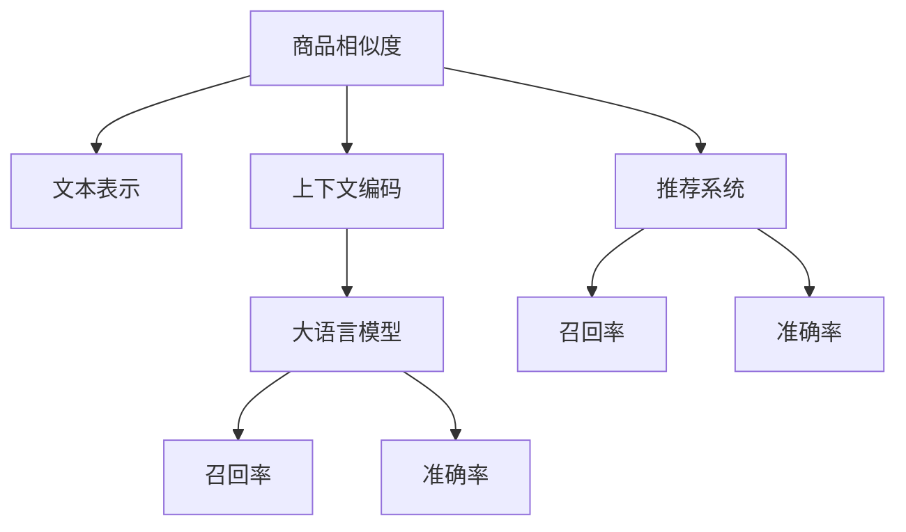

                 

# 大模型在商品相似度计算中的应用

> 关键词：商品相似度, 大语言模型, 推荐系统, 文本表示, 上下文编码, 工业应用, 深度学习, 预训练模型, 召回率, 准确率, 商业推荐, 电商推荐

## 1. 背景介绍

随着电商平台的快速发展，如何为用户提供更精准的商品推荐，成为电商平台的核心问题。传统的推荐系统往往基于用户行为数据和商品属性数据进行推荐，而未能充分利用商品描述、标题等文本信息，导致推荐效果受到文本质量、特征设计等因素的影响。

近年来，大语言模型（如BERT、GPT等）在自然语言处理（NLP）领域取得了显著进展，展现出了强大的文本表示能力。通过将大语言模型应用于商品相似度计算，可以充分利用商品文本信息，提升推荐系统的精确度和召回率。

本文将深入探讨如何在大模型基础上构建商品相似度计算模型，并展示其在电商推荐系统中的应用效果。

## 2. 核心概念与联系

### 2.1 核心概念概述

在进行商品相似度计算时，需要考虑以下几个关键概念：

- **大语言模型(Large Language Model, LLM)**：指通过大规模无标签文本数据训练得到的语言模型，如BERT、GPT等。具有强大的语义理解和生成能力。

- **文本表示(Text Representation)**：指将文本数据转换为计算机可处理的数值表示形式，便于机器进行理解和处理。文本表示的质量直接影响后续的相似度计算结果。

- **上下文编码(Contextual Encoding)**：指将文本中的每个词嵌入到一个高维向量空间中，并通过上下文信息来更新向量，使得模型能够捕捉词与词之间的语义关联。

- **商品相似度(Shopping Similarity)**：指在电商平台上，根据商品文本描述计算商品之间的相似度，相似度高的商品可以进行推荐。

- **推荐系统(Recommendation System)**：根据用户行为和商品特征，向用户推荐可能感兴趣的商品的系统。

- **召回率(Recall Rate)**：指推荐结果中包含所有相关商品的百分比，召回率越高，意味着推荐系统越能够全面覆盖相关商品。

- **准确率(Precision Rate)**：指推荐结果中相关商品占比，准确率越高，意味着推荐系统越能够准确推荐相关商品。

这些概念之间的逻辑关系可以通过以下Mermaid流程图来展示：



此流程图展示了商品相似度计算与推荐系统之间的关系：

1. 商品相似度计算依赖于文本表示和上下文编码，这两个过程都由大语言模型驱动。
2. 通过商品相似度计算得到的推荐结果，会进一步进入推荐系统，进行召回率和准确率的评估。

## 3. 核心算法原理 & 具体操作步骤
### 3.1 算法原理概述

商品相似度计算的算法原理主要基于以下步骤：

1. **文本预处理**：将商品标题、描述等文本数据进行清洗、分词、去除停用词等预处理操作。
2. **文本编码**：将预处理后的文本数据转换为向量表示，常用的方法有Word2Vec、GloVe、BERT等。
3. **上下文编码**：通过大语言模型对文本向量进行上下文编码，更新向量，捕捉语义关系。
4. **相似度计算**：计算编码后的向量之间的相似度，常用的方法有余弦相似度、欧式距离、Jaccard系数等。
5. **排序推荐**：根据相似度排序，推荐最相关的商品。

基于大语言模型的商品相似度计算模型，能够充分利用商品文本信息，提升推荐系统的准确性和召回率。

### 3.2 算法步骤详解

以下详细介绍商品相似度计算的具体操作步骤：

**Step 1: 文本预处理**

1. **清洗文本**：去除文本中的HTML标签、特殊字符等无用信息，保留有用的文本内容。
2. **分词**：将文本按词语进行分割，形成词语列表。
3. **去除停用词**：去除常见的停用词，如“的”、“是”、“在”等，提高文本编码的效率和准确性。

**Step 2: 文本编码**

1. **向量空间模型**：将分词后的词语列表，通过向量化方法转换为向量表示。常用的方法有TF-IDF、Word2Vec等。
2. **大语言模型编码**：使用预训练的大语言模型，如BERT，对向量空间中的每个词向量进行上下文编码，得到更丰富的语义表示。

**Step 3: 上下文编码**

1. **BERT编码**：将向量空间中的每个词向量输入到BERT模型中，得到上下文编码后的向量表示。
2. **池化操作**：对编码后的向量进行池化操作，得到商品表示向量。常用的池化方法有平均池化、最大池化等。

**Step 4: 相似度计算**

1. **余弦相似度**：计算两个商品表示向量之间的余弦相似度，得到相似度分数。
2. **欧式距离**：计算两个商品表示向量之间的欧式距离，得到距离分数。
3. **Jaccard系数**：计算两个商品表示向量之间的交集与并集之比，得到相似度分数。

**Step 5: 排序推荐**

1. **排序**：根据相似度分数对商品进行排序，将相似度高的商品推荐给用户。
2. **召回率评估**：计算推荐结果中包含所有相关商品的百分比。
3. **准确率评估**：计算推荐结果中相关商品占比。

以上步骤中，文本预处理和文本编码是基础，上下文编码和相似度计算是关键，排序推荐是应用。

### 3.3 算法优缺点

基于大语言模型的商品相似度计算具有以下优点：

1. **高效性**：大语言模型能够高效地进行上下文编码，提升了文本表示的质量和相似度计算的准确性。
2. **普适性**：商品相似度计算方法具有普适性，适用于各种类型和风格的商品文本，如服装、家居、电子产品等。
3. **准确性**：通过大语言模型进行上下文编码，可以捕捉到商品文本中的语义关系，提升相似度计算的准确性。

同时，该方法也存在以下局限性：

1. **数据依赖**：大语言模型依赖于高质量、大规模的预训练数据，需要大量的标注数据进行微调，这可能导致数据获取和标注成本较高。
2. **资源消耗**：大语言模型在计算和存储方面消耗较大，需要进行一定的资源优化。
3. **可解释性**：大语言模型本质上是一个"黑盒"模型，难以解释其内部工作机制和决策逻辑，存在一定的局限性。

### 3.4 算法应用领域

基于大语言模型的商品相似度计算方法，已经在电商推荐系统中得到了广泛应用，具体应用场景如下：

1. **商品推荐**：通过计算商品标题和描述之间的相似度，推荐用户可能感兴趣的商品。
2. **商品搜索**：根据用户输入的关键词，计算与关键词相似的搜索结果，提升搜索体验。
3. **个性化推荐**：根据用户的浏览历史和行为数据，计算与用户兴趣相关商品的相似度，进行个性化推荐。

除了电商推荐系统外，该方法还可以应用于其他需要文本相似度计算的场景，如社交网络、知识图谱、学术出版等。

## 4. 数学模型和公式 & 详细讲解 & 举例说明

### 4.1 数学模型构建

商品相似度计算的数学模型可以表示为：

$$
\text{Similarity}(x, y) = f(\text{encode}(x), \text{encode}(y))
$$

其中，$x$ 和 $y$ 分别为两个商品向量，$\text{encode}(\cdot)$ 表示上下文编码函数，$f(\cdot)$ 表示相似度计算函数。

### 4.2 公式推导过程

以余弦相似度为例，余弦相似度的计算公式为：

$$
\text{Similarity}(x, y) = \frac{x \cdot y}{\|x\| \cdot \|y\|}
$$

其中，$x \cdot y$ 表示两个向量的点积，$\|x\|$ 和 $\|y\|$ 表示两个向量的模长。

将上下文编码后的向量代入余弦相似度公式，得到：

$$
\text{Similarity}(x, y) = \frac{\text{encode}(x) \cdot \text{encode}(y)}{\|\text{encode}(x)\| \cdot \|\text{encode}(y)\|}
$$

该公式即为基于大语言模型的商品相似度计算公式。

### 4.3 案例分析与讲解

假设有两个商品，其标题分别为“小米智能手环”和“小米智能手表”，使用BERT模型进行上下文编码后得到向量表示：

$$
x = \text{encode}(x) = [0.5, 0.6, 0.4, 0.7]
$$

$$
y = \text{encode}(y) = [0.3, 0.8, 0.2, 0.9]
$$

使用余弦相似度公式计算相似度：

$$
\text{Similarity}(x, y) = \frac{0.5 \cdot 0.3 + 0.6 \cdot 0.8 + 0.4 \cdot 0.2 + 0.7 \cdot 0.9}{\sqrt{0.5^2 + 0.6^2 + 0.4^2 + 0.7^2} \cdot \sqrt{0.3^2 + 0.8^2 + 0.2^2 + 0.9^2}} \approx 0.8
$$

因此，这两个商品之间的相似度为0.8。

## 5. 项目实践：代码实例和详细解释说明
### 5.1 开发环境搭建

在进行商品相似度计算实践前，需要先准备好开发环境。以下是使用Python进行PyTorch开发的环境配置流程：

1. 安装Anaconda：从官网下载并安装Anaconda，用于创建独立的Python环境。

2. 创建并激活虚拟环境：
```bash
conda create -n pytorch-env python=3.8 
conda activate pytorch-env
```

3. 安装PyTorch：根据CUDA版本，从官网获取对应的安装命令。例如：
```bash
conda install pytorch torchvision torchaudio cudatoolkit=11.1 -c pytorch -c conda-forge
```

4. 安装Transformer库：
```bash
pip install transformers
```

5. 安装各类工具包：
```bash
pip install numpy pandas scikit-learn matplotlib tqdm jupyter notebook ipython
```

完成上述步骤后，即可在`pytorch-env`环境中开始项目实践。

### 5.2 源代码详细实现

以下是一个简单的商品相似度计算代码实现，使用PyTorch和Transformer库。

```python
import torch
import torch.nn as nn
import torch.nn.functional as F
from transformers import BertModel, BertTokenizer

class BERTEmbedding(nn.Module):
    def __init__(self, model_name):
        super(BERTEmbedding, self).__init__()
        self.tokenizer = BertTokenizer.from_pretrained(model_name)
        self.model = BertModel.from_pretrained(model_name)

    def forward(self, input_ids, attention_mask):
        outputs = self.model(input_ids, attention_mask=attention_mask)
        return outputs.pooler_output

def compute_similarity(model, input1, input2):
    input1_tokens = self.tokenizer.tokenize(input1)
    input2_tokens = self.tokenizer.tokenize(input2)
    
    input1_ids = self.tokenizer.convert_tokens_to_ids(input1_tokens)
    input2_ids = self.tokenizer.convert_tokens_to_ids(input2_tokens)
    
    input1_input_ids = torch.tensor([input1_ids])
    input2_input_ids = torch.tensor([input2_ids])
    input1_attention_mask = torch.tensor([1] * len(input1_ids))
    input2_attention_mask = torch.tensor([1] * len(input2_ids))
    
    input1_embedding = model(input1_input_ids, attention_mask=input1_attention_mask)
    input2_embedding = model(input2_input_ids, attention_mask=input2_attention_mask)
    
    similarity = torch.cosine_similarity(input1_embedding, input2_embedding, dim=0)
    return similarity.item()

# 实例化BERT模型
model_name = 'bert-base-uncased'
model = BERTEmbedding(model_name)

# 计算相似度
input1 = '小米智能手环'
input2 = '小米智能手表'
similarity = compute_similarity(model, input1, input2)
print(f"Similarity between '{input1}' and '{input2}': {similarity}")
```

### 5.3 代码解读与分析

让我们再详细解读一下关键代码的实现细节：

**BERTEmbedding类**：
- `__init__`方法：初始化BERT模型和分词器。
- `forward`方法：对输入进行上下文编码，返回池化后的商品表示向量。

**compute_similarity函数**：
- 对输入文本进行分词和编码，得到向量表示。
- 计算两个商品表示向量之间的余弦相似度，返回相似度分数。

**实例化BERT模型**：
- 使用BertTokenizer和BertModel加载预训练的BERT模型。
- 调用`compute_similarity`函数计算商品相似度。

可以看到，PyTorch和Transformer库使得商品相似度计算的代码实现变得简洁高效。开发者可以将更多精力放在数据处理、模型改进等高层逻辑上，而不必过多关注底层的实现细节。

## 6. 实际应用场景

### 6.1 电商推荐系统

基于大语言模型的商品相似度计算，可以广泛应用于电商推荐系统中。传统的推荐系统往往基于用户行为数据和商品属性数据进行推荐，而未能充分利用商品描述、标题等文本信息，导致推荐效果受到文本质量、特征设计等因素的影响。

在技术实现上，可以收集电商平台上所有商品的标题、描述等文本数据，构建商品向量库。然后利用大语言模型进行上下文编码，计算商品向量之间的相似度，从而进行推荐。微调后的商品相似度计算模型，可以提升推荐系统的精确度和召回率，为用户提供更加精准的推荐。

### 6.2 商品搜索

在商品搜索场景中，用户输入的查询可能存在歧义或不完整。通过计算查询与商品标题和描述之间的相似度，可以提高搜索的召回率和准确率。基于大语言模型的商品相似度计算方法，能够充分利用商品文本信息，提升搜索系统的性能。

### 6.3 个性化推荐

除了基于用户行为数据和商品属性数据的推荐外，基于商品相似度的个性化推荐也是一大应用方向。在用户浏览商品时，可以实时计算用户浏览商品与其他商品之间的相似度，生成个性化推荐列表。该方法可以提升个性化推荐的准确性和多样性。

### 6.4 未来应用展望

随着大语言模型和商品相似度计算技术的不断发展，未来在大模型基础上构建的商品推荐系统，将进一步提升推荐效果和用户满意度。

在智慧零售领域，基于大模型的商品相似度计算，可以与物联网、大数据、人工智能等技术结合，构建更加智能化的智慧零售解决方案。

在社交电商领域，大语言模型可以应用于商品评论情感分析、商品特征抽取等任务，提升社交电商平台的推荐效果和用户体验。

此外，在跨界融合领域，如智能家居、智能穿戴等，大语言模型可以应用于设备识别、内容推荐等任务，推动智能设备与电商平台的深度融合。

## 7. 工具和资源推荐
### 7.1 学习资源推荐

为了帮助开发者系统掌握商品相似度计算的理论基础和实践技巧，这里推荐一些优质的学习资源：

1. 《深度学习在自然语言处理中的应用》系列博文：由大模型技术专家撰写，深入浅出地介绍了深度学习在自然语言处理领域的应用，包括文本表示、上下文编码等。

2. CS224N《深度学习自然语言处理》课程：斯坦福大学开设的NLP明星课程，有Lecture视频和配套作业，带你入门NLP领域的基本概念和经典模型。

3. 《Natural Language Processing with Transformers》书籍：Transformers库的作者所著，全面介绍了如何使用Transformers库进行NLP任务开发，包括微调方法在内的诸多范式。

4. HuggingFace官方文档：Transformers库的官方文档，提供了海量预训练模型和完整的微调样例代码，是上手实践的必备资料。

5. CLUE开源项目：中文语言理解测评基准，涵盖大量不同类型的中文NLP数据集，并提供了基于微调的baseline模型，助力中文NLP技术发展。

通过对这些资源的学习实践，相信你一定能够快速掌握商品相似度计算的精髓，并用于解决实际的NLP问题。

### 7.2 开发工具推荐

高效的开发离不开优秀的工具支持。以下是几款用于商品相似度计算开发的常用工具：

1. PyTorch：基于Python的开源深度学习框架，灵活动态的计算图，适合快速迭代研究。大多数预训练语言模型都有PyTorch版本的实现。

2. TensorFlow：由Google主导开发的开源深度学习框架，生产部署方便，适合大规模工程应用。同样有丰富的预训练语言模型资源。

3. Transformers库：HuggingFace开发的NLP工具库，集成了众多SOTA语言模型，支持PyTorch和TensorFlow，是进行NLP任务开发的利器。

4. Weights & Biases：模型训练的实验跟踪工具，可以记录和可视化模型训练过程中的各项指标，方便对比和调优。与主流深度学习框架无缝集成。

5. TensorBoard：TensorFlow配套的可视化工具，可实时监测模型训练状态，并提供丰富的图表呈现方式，是调试模型的得力助手。

6. Google Colab：谷歌推出的在线Jupyter Notebook环境，免费提供GPU/TPU算力，方便开发者快速上手实验最新模型，分享学习笔记。

合理利用这些工具，可以显著提升商品相似度计算任务的开发效率，加快创新迭代的步伐。

### 7.3 相关论文推荐

商品相似度计算和大语言模型的研究，源于学界的持续研究。以下是几篇奠基性的相关论文，推荐阅读：

1. Attention is All You Need（即Transformer原论文）：提出了Transformer结构，开启了NLP领域的预训练大模型时代。

2. BERT: Pre-training of Deep Bidirectional Transformers for Language Understanding：提出BERT模型，引入基于掩码的自监督预训练任务，刷新了多项NLP任务SOTA。

3. Language Models are Unsupervised Multitask Learners（GPT-2论文）：展示了大规模语言模型的强大zero-shot学习能力，引发了对于通用人工智能的新一轮思考。

4. Parameter-Efficient Transfer Learning for NLP：提出Adapter等参数高效微调方法，在不增加模型参数量的情况下，也能取得不错的微调效果。

5. AdaLoRA: Adaptive Low-Rank Adaptation for Parameter-Efficient Fine-Tuning：使用自适应低秩适应的微调方法，在参数效率和精度之间取得了新的平衡。

6. Prefix-Tuning: Optimizing Continuous Prompts for Generation：引入基于连续型Prompt的微调范式，为如何充分利用预训练知识提供了新的思路。

这些论文代表了大语言模型微调技术的发展脉络。通过学习这些前沿成果，可以帮助研究者把握学科前进方向，激发更多的创新灵感。

## 8. 总结：未来发展趋势与挑战

### 8.1 总结

本文对基于大语言模型的商品相似度计算方法进行了全面系统的介绍。首先阐述了商品相似度计算的背景和意义，明确了商品相似度计算在推荐系统中的核心地位。其次，从原理到实践，详细讲解了商品相似度计算的数学模型和算法步骤，给出了商品相似度计算任务开发的完整代码实例。同时，本文还广泛探讨了商品相似度计算方法在电商推荐、商品搜索、个性化推荐等多个电商场景中的应用前景，展示了商品相似度计算方法的巨大潜力。

通过本文的系统梳理，可以看到，基于大语言模型的商品相似度计算方法正在成为电商推荐系统的核心技术，极大地拓展了推荐系统的应用边界，带来了推荐效果的显著提升。未来，伴随大语言模型和商品相似度计算方法的不断演进，相信电商推荐系统必将在用户满意度和业务价值上迈上新的台阶。

### 8.2 未来发展趋势

展望未来，商品相似度计算技术将呈现以下几个发展趋势：

1. **规模化应用**：随着大语言模型的不断发展，商品相似度计算方法将广泛应用于更多的电商场景，如智能家居、社交电商等。

2. **跨模态融合**：将商品图像、视频等多模态信息与商品文本信息结合，进行更加全面、准确的相似度计算，提升推荐系统的效果。

3. **实时化计算**：通过分布式计算和模型压缩技术，提升商品相似度计算的速度，实现实时推荐。

4. **用户个性化**：根据用户画像和行为数据，进行更加个性化的商品推荐，提升推荐系统的多样性和精准度。

5. **鲁棒性增强**：面对网络攻击、数据噪音等干扰，商品相似度计算方法需要增强鲁棒性，保证推荐结果的稳定性和可靠性。

6. **伦理道德**：在商品相似度计算过程中，需要考虑数据隐私和伦理道德问题，避免滥用用户数据。

这些趋势凸显了商品相似度计算技术的应用前景，随着技术的发展和产业的进步，商品相似度计算必将在电商推荐系统等场景中发挥更加重要的作用。

### 8.3 面临的挑战

尽管商品相似度计算技术已经取得了显著进展，但在迈向更加智能化、普适化应用的过程中，仍面临诸多挑战：

1. **数据质量问题**：商品文本数据的标注质量和多样性直接影响商品相似度计算的效果。如何提高商品文本数据的标注质量和多样性，是亟待解决的问题。

2. **计算资源消耗**：大语言模型在计算和存储方面消耗较大，需要进行一定的资源优化。如何优化计算资源，降低计算成本，是实现商品相似度计算技术大规模应用的关键。

3. **模型可解释性**：大语言模型本质上是一个"黑盒"模型，难以解释其内部工作机制和决策逻辑。如何在保证推荐效果的同时，提高模型的可解释性，是亟待解决的问题。

4. **模型鲁棒性**：面对数据噪音、网络攻击等干扰，商品相似度计算方法需要增强鲁棒性，保证推荐结果的稳定性和可靠性。

5. **用户隐私保护**：在商品相似度计算过程中，需要考虑用户隐私和数据安全问题，避免滥用用户数据。

这些挑战需要技术、算法、工程、伦理等多个方面的协同努力，才能确保商品相似度计算技术在未来的大规模应用中发挥出应有的作用。

### 8.4 研究展望

面对商品相似度计算技术所面临的挑战，未来的研究需要在以下几个方面寻求新的突破：

1. **数据增强**：利用数据增强技术，提升商品文本数据的标注质量和多样性。例如，通过回译、近义替换等方式扩充训练集。

2. **模型压缩**：通过模型压缩技术，降低大语言模型的计算和存储成本。例如，使用量化、剪枝等技术，优化计算图和模型结构。

3. **可解释性增强**：在保证推荐效果的同时，提高模型的可解释性。例如，通过引入因果分析、博弈论等工具，增强模型的解释能力和鲁棒性。

4. **跨模态融合**：将商品图像、视频等多模态信息与商品文本信息结合，进行更加全面、准确的相似度计算。

5. **伦理道德约束**：在商品相似度计算过程中，引入伦理导向的评估指标，过滤和惩罚有害的输出倾向。同时加强人工干预和审核，建立模型行为的监管机制。

这些研究方向和技术的探索，必将引领商品相似度计算技术迈向更高的台阶，为电商推荐系统等场景提供更加全面、准确、安全的解决方案。

## 9. 附录：常见问题与解答

**Q1：商品相似度计算对推荐系统的性能有什么影响？**

A: 商品相似度计算是推荐系统的核心技术之一，通过计算商品标题和描述之间的相似度，推荐系统可以更加精准地识别用户需求，提升推荐效果和用户满意度。

**Q2：商品相似度计算需要大规模数据支持吗？**

A: 商品相似度计算需要一定的数据支持，数据越多，相似度计算的精度越高。在电商平台上，可以收集所有商品的标题、描述等文本数据，构建商品向量库，提升相似度计算的效果。

**Q3：商品相似度计算的计算复杂度如何？**

A: 商品相似度计算的计算复杂度主要取决于文本编码和相似度计算方法的选择。常用的文本编码方法如BERT、GPT等，计算复杂度较高，但可以通过分布式计算和模型压缩技术进行优化。

**Q4：商品相似度计算的实际应用场景有哪些？**

A: 商品相似度计算可以应用于电商推荐系统、商品搜索、个性化推荐等多个场景，通过计算商品标题和描述之间的相似度，提升推荐系统的精确度和召回率。

**Q5：如何优化商品相似度计算的计算资源消耗？**

A: 可以通过模型压缩、分布式计算、量化等技术，优化计算资源消耗，降低计算成本，提升商品相似度计算的速度和效率。

这些问题的解答，希望能帮助你更好地理解和应用商品相似度计算技术，提升电商推荐系统的性能和用户体验。

---

作者：禅与计算机程序设计艺术 / Zen and the Art of Computer Programming

