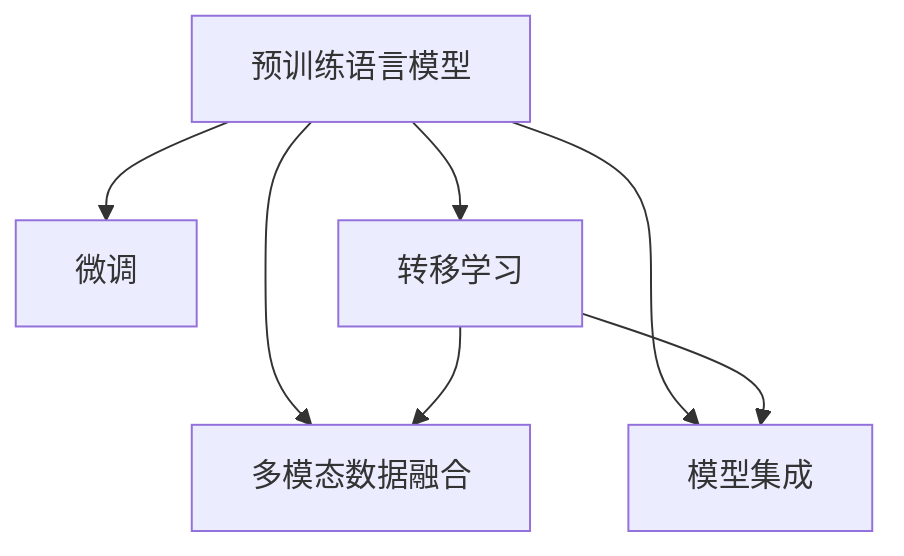

                 

# 大模型在商品趋势预测中的精确应用

## 1. 背景介绍

### 1.1 问题由来
随着电商行业的快速发展，商品趋势预测成为电商平台优化商品推荐、库存管理和销售策略的关键环节。传统的商品趋势预测方法基于时间序列分析、统计回归等模型，受限于数据量和特征维度，难以处理大规模复杂数据。而基于大模型，特别是预训练语言模型的方法，通过学习海量文本数据中的广泛知识，能够更好地捕捉商品趋势变化的复杂模式，提升预测精度。

### 1.2 问题核心关键点
大模型在商品趋势预测中的应用，主要基于以下核心技术：
1. 预训练语言模型的广泛知识提取能力。
2. 在特定领域数据上的微调，以适应商品数据的分布。
3. 利用上下文信息，捕捉商品间的关联。
4. 多模态数据融合，引入商品图片、评价、用户行为等数据。
5. 模型集成与优化，提升预测的鲁棒性和泛化能力。

这些技术手段的结合，使得大模型能够在商品趋势预测中发挥出独特优势，助力电商平台实现精准的趋势预测。

### 1.3 问题研究意义
商品趋势预测的精确性直接关系到电商平台的用户体验、运营效率和收益。基于大模型的预测方法，可以显著提高预测精度，减少库存和运营成本，增强市场竞争力。此外，大模型的应用还可以拓展到广告投放、营销策略等领域，为电商平台的全面智能化转型提供有力支持。

## 2. 核心概念与联系

### 2.1 核心概念概述

为更好地理解基于大模型的商品趋势预测方法，本节将介绍几个密切相关的核心概念：

- 预训练语言模型(Pre-trained Language Model)：如BERT、GPT等，通过在大规模无标签文本数据上进行自监督学习，学习通用的语言表示，具备强大的语言理解和生成能力。
- 微调(Fine-tuning)：在预训练模型的基础上，使用特定领域的数据进行有监督学习，优化模型在该领域上的性能。
- 转移学习(Transfer Learning)：将一个领域学习到的知识，迁移应用到另一个不同但相关的领域，以提升模型在新任务上的性能。
- 多模态数据融合(Multimodal Data Fusion)：结合商品图片、用户评价、用户行为等多种数据源，提升模型的综合预测能力。
- 模型集成(Ensemble Learning)：通过组合多个模型的预测结果，提高预测的稳定性和准确性。

这些核心概念之间的逻辑关系可以通过以下Mermaid流程图来展示：



这个流程图展示了大模型在商品趋势预测中的核心概念及其之间的关系：

1. 预训练语言模型通过在大规模无标签文本数据上进行自监督学习，学习通用的语言表示。
2. 微调通过特定领域的数据进行有监督学习，优化模型在该领域上的性能。
3. 转移学习将预训练模型知识迁移应用到商品数据领域，提升模型在该领域上的泛化能力。
4. 多模态数据融合结合多种数据源，提升模型的综合预测能力。
5. 模型集成通过组合多个模型的预测结果，提高预测的稳定性和准确性。

这些概念共同构成了大模型在商品趋势预测中的应用框架，使其能够在复杂的电商环境中发挥强大的预测能力。通过理解这些核心概念，我们可以更好地把握大模型的工作原理和优化方向。

## 3. 核心算法原理 & 具体操作步骤

### 3.1 算法原理概述

基于大模型的商品趋势预测方法，本质上是一个多任务的转移学习过程。其核心思想是：利用预训练语言模型在大规模无标签文本数据上提取广泛知识，再在特定领域的数据上通过微调，优化模型对商品趋势的预测能力。

形式化地，假设预训练模型为 $M_{\theta}$，其中 $\theta$ 为预训练得到的模型参数。给定商品趋势预测任务的标注数据集 $D=\{(x_i,y_i)\}_{i=1}^N$，其中 $x_i$ 为商品描述文本，$y_i$ 为商品趋势标签。微调的目标是找到新的模型参数 $\hat{\theta}$，使得模型在特定商品数据上预测趋势标签的准确性最大化。

通过梯度下降等优化算法，微调过程不断更新模型参数 $\theta$，最小化损失函数 $\mathcal{L}$，使得模型输出逼近真实标签。由于 $\theta$ 已经通过预训练获得了较好的初始化，因此即便在特定领域的数据集上微调，也能较快收敛到理想的模型参数 $\hat{\theta}$。

### 3.2 算法步骤详解

基于大模型的商品趋势预测方法一般包括以下几个关键步骤：

**Step 1: 准备预训练模型和数据集**
- 选择合适的预训练语言模型 $M_{\theta}$ 作为初始化参数，如 BERT、GPT 等。
- 准备商品趋势预测任务的标注数据集 $D$，划分为训练集、验证集和测试集。

**Step 2: 添加任务适配层**
- 根据商品趋势预测任务，设计合适的输出层和损失函数。
- 对于分类任务，通常在顶层添加线性分类器和交叉熵损失函数。
- 对于回归任务，通常使用均方误差损失函数。

**Step 3: 设置微调超参数**
- 选择合适的优化算法及其参数，如 Adam、SGD 等，设置学习率、批大小、迭代轮数等。
- 设置正则化技术及强度，包括权重衰减、Dropout、Early Stopping 等。
- 确定冻结预训练参数的策略，如仅微调顶层，或全部参数都参与微调。

**Step 4: 执行梯度训练**
- 将训练集数据分批次输入模型，前向传播计算损失函数。
- 反向传播计算参数梯度，根据设定的优化算法和学习率更新模型参数。
- 周期性在验证集上评估模型性能，根据性能指标决定是否触发 Early Stopping。
- 重复上述步骤直到满足预设的迭代轮数或 Early Stopping 条件。

**Step 5: 测试和部署**
- 在测试集上评估微调后模型 $M_{\hat{\theta}}$ 的性能，对比微调前后的预测精度提升。
- 使用微调后的模型对新商品进行趋势预测，集成到实际的商品推荐系统中。
- 持续收集新的商品数据，定期重新微调模型，以适应数据分布的变化。

以上是基于大模型的商品趋势预测的一般流程。在实际应用中，还需要针对具体商品数据的特征，对微调过程的各个环节进行优化设计，如改进训练目标函数，引入更多的正则化技术，搜索最优的超参数组合等，以进一步提升模型性能。

### 3.3 算法优缺点

基于大模型的商品趋势预测方法具有以下优点：
1. 数据泛化能力强。预训练模型学习到了广泛的知识，可以较好地泛化到商品趋势预测任务中。
2. 预测精度高。通过微调，模型能够精确捕捉商品趋势变化的复杂模式，预测精度显著提升。
3. 模型结构灵活。可以通过冻结部分预训练参数，减少微调过程中的参数更新量，提高计算效率。
4. 应用范围广。该方法可以应用于多种电商场景，如商品推荐、库存管理、广告投放等。

同时，该方法也存在一定的局限性：
1. 数据标注成本高。商品趋势预测任务的标注数据获取成本较高，标注质量影响模型效果。
2. 模型复杂度高。大模型的计算和存储需求较大，需要高性能的硬件设备支持。
3. 预训练知识可能过时。商品趋势受市场变化影响较大，预训练模型可能难以适应最新的市场趋势。
4. 模型可解释性不足。大模型往往是一个"黑盒"，难以解释其内部的预测机制。

尽管存在这些局限性，但就目前而言，基于大模型的商品趋势预测方法仍是大规模商品数据处理中的主流范式。未来相关研究的重点在于如何进一步降低数据标注成本，提高模型的泛化能力和可解释性，同时兼顾计算资源的使用效率。

### 3.4 算法应用领域

基于大模型的商品趋势预测方法在电商行业具有广泛的应用前景，包括：

- 商品推荐系统：预测商品趋势，优化商品推荐算法，提升用户体验。
- 库存管理：预测商品销售趋势，优化库存分配，减少库存成本。
- 广告投放：预测商品广告效果，优化广告投放策略，提高投资回报率。
- 市场分析：分析商品趋势变化，辅助市场决策，优化商品结构。

此外，在金融、健康、教育等众多领域，大模型的商品趋势预测方法也有着广阔的应用前景。

## 4. 数学模型和公式 & 详细讲解 & 举例说明

### 4.1 数学模型构建

本节将使用数学语言对基于大模型的商品趋势预测过程进行更加严格的刻画。

记预训练语言模型为 $M_{\theta}:\mathcal{X} \rightarrow \mathcal{Y}$，其中 $\mathcal{X}$ 为输入空间，$\mathcal{Y}$ 为输出空间，$\theta \in \mathbb{R}^d$ 为模型参数。假设商品趋势预测任务的训练集为 $D=\{(x_i,y_i)\}_{i=1}^N, x_i \in \mathcal{X}, y_i \in \mathcal{Y}$，其中 $x_i$ 为商品描述文本，$y_i$ 为商品趋势标签。

定义模型 $M_{\theta}$ 在输入 $x$ 上的输出为 $\hat{y}=M_{\theta}(x)$，则预测误差为：

$$
\ell(M_{\theta}(x),y) = \left\{
\begin{aligned}
& (y - \hat{y})^2 & & \text{if 回归任务} \\
& -y \log \hat{y} - (1-y) \log(1-\hat{y}) & & \text{if 二分类任务}
\end{aligned}
\right.
$$

其中，回归任务中 $\hat{y} \in \mathbb{R}$，二分类任务中 $\hat{y} \in (0,1)$。

则经验风险为：

$$
\mathcal{L}(\theta) = \frac{1}{N}\sum_{i=1}^N \ell(M_{\theta}(x_i),y_i)
$$

微调的优化目标是最小化经验风险，即找到最优参数：

$$
\theta^* = \mathop{\arg\min}_{\theta} \mathcal{L}(\theta)
$$

在实践中，我们通常使用基于梯度的优化算法（如Adam、SGD等）来近似求解上述最优化问题。设 $\eta$ 为学习率，$\lambda$ 为正则化系数，则参数的更新公式为：

$$
\theta \leftarrow \theta - \eta \nabla_{\theta}\mathcal{L}(\theta) - \eta\lambda\theta
$$

其中 $\nabla_{\theta}\mathcal{L}(\theta)$ 为损失函数对参数 $\theta$ 的梯度，可通过反向传播算法高效计算。

### 4.2 公式推导过程

以下我们以二分类任务为例，推导交叉熵损失函数及其梯度的计算公式。

假设模型 $M_{\theta}$ 在输入 $x$ 上的输出为 $\hat{y}=M_{\theta}(x) \in [0,1]$，表示商品趋势为正的概率。真实标签 $y \in \{0,1\}$。则二分类交叉熵损失函数定义为：

$$
\ell(M_{\theta}(x),y) = -[y\log \hat{y} + (1-y)\log(1-\hat{y})]
$$

将其代入经验风险公式，得：

$$
\mathcal{L}(\theta) = -\frac{1}{N}\sum_{i=1}^N [y_i\log M_{\theta}(x_i)+(1-y_i)\log(1-M_{\theta}(x_i))]
$$

根据链式法则，损失函数对参数 $\theta_k$ 的梯度为：

$$
\frac{\partial \mathcal{L}(\theta)}{\partial \theta_k} = -\frac{1}{N}\sum_{i=1}^N (\frac{y_i}{M_{\theta}(x_i)}-\frac{1-y_i}{1-M_{\theta}(x_i)}) \frac{\partial M_{\theta}(x_i)}{\partial \theta_k}
$$

其中 $\frac{\partial M_{\theta}(x_i)}{\partial \theta_k}$ 可进一步递归展开，利用自动微分技术完成计算。

在得到损失函数的梯度后，即可带入参数更新公式，完成模型的迭代优化。重复上述过程直至收敛，最终得到适应商品趋势预测任务的最优模型参数 $\theta^*$。

## 5. 项目实践：代码实例和详细解释说明

### 5.1 开发环境搭建

在进行商品趋势预测实践前，我们需要准备好开发环境。以下是使用Python进行PyTorch开发的环境配置流程：

1. 安装Anaconda：从官网下载并安装Anaconda，用于创建独立的Python环境。

2. 创建并激活虚拟环境：
```bash
conda create -n pytorch-env python=3.8 
conda activate pytorch-env
```

3. 安装PyTorch：根据CUDA版本，从官网获取对应的安装命令。例如：
```bash
conda install pytorch torchvision torchaudio cudatoolkit=11.1 -c pytorch -c conda-forge
```

4. 安装Transformers库：
```bash
pip install transformers
```

5. 安装各类工具包：
```bash
pip install numpy pandas scikit-learn matplotlib tqdm jupyter notebook ipython
```

完成上述步骤后，即可在`pytorch-env`环境中开始商品趋势预测实践。

### 5.2 源代码详细实现

下面我们以基于预训练BERT模型进行商品趋势预测的PyTorch代码实现为例。

首先，定义模型和优化器：

```python
from transformers import BertForSequenceClassification, AdamW
from transformers import BertTokenizer
import torch

# 加载预训练BERT模型和tokenizer
model = BertForSequenceClassification.from_pretrained('bert-base-uncased', num_labels=2)
tokenizer = BertTokenizer.from_pretrained('bert-base-uncased')

# 准备优化器和超参数
optimizer = AdamW(model.parameters(), lr=2e-5)
```

然后，定义训练和评估函数：

```python
from torch.utils.data import Dataset, DataLoader

class TrendDataset(Dataset):
    def __init__(self, data, tokenizer):
        self.data = data
        self.tokenizer = tokenizer
        
    def __len__(self):
        return len(self.data)
    
    def __getitem__(self, idx):
        text = self.data[idx]['text']
        label = self.data[idx]['label']
        
        encoding = self.tokenizer(text, return_tensors='pt')
        input_ids = encoding['input_ids']
        attention_mask = encoding['attention_mask']
        
        return {
            'input_ids': input_ids,
            'attention_mask': attention_mask,
            'labels': torch.tensor(label, dtype=torch.long)
        }

# 准备训练集和验证集
train_data = ...
dev_data = ...
test_data = ...

train_dataset = TrendDataset(train_data, tokenizer)
dev_dataset = TrendDataset(dev_data, tokenizer)
test_dataset = TrendDataset(test_data, tokenizer)

# 定义训练函数
def train_epoch(model, dataset, optimizer, device):
    model.train()
    dataloader = DataLoader(dataset, batch_size=16, shuffle=True)
    total_loss = 0
    
    for batch in dataloader:
        input_ids = batch['input_ids'].to(device)
        attention_mask = batch['attention_mask'].to(device)
        labels = batch['labels'].to(device)
        
        model.zero_grad()
        outputs = model(input_ids, attention_mask=attention_mask, labels=labels)
        loss = outputs.loss
        total_loss += loss.item()
        loss.backward()
        optimizer.step()
    
    return total_loss / len(dataloader)

# 定义评估函数
def evaluate(model, dataset, device):
    model.eval()
    total_preds = []
    total_labels = []
    
    with torch.no_grad():
        dataloader = DataLoader(dataset, batch_size=16)
        for batch in dataloader:
            input_ids = batch['input_ids'].to(device)
            attention_mask = batch['attention_mask'].to(device)
            labels = batch['labels'].to(device)
            outputs = model(input_ids, attention_mask=attention_mask)
            logits = outputs.logits
            total_preds += logits.argmax(dim=1).cpu().tolist()
            total_labels += labels.cpu().tolist()
    
    print(f'Accuracy: {accuracy_score(total_preds, total_labels):.4f}')
    
# 定义训练循环
epochs = 5
device = torch.device('cuda' if torch.cuda.is_available() else 'cpu')

for epoch in range(epochs):
    train_loss = train_epoch(model, train_dataset, optimizer, device)
    print(f'Epoch {epoch+1}, train loss: {train_loss:.4f}')
    
    evaluate(model, dev_dataset, device)
    
print('Test set results:')
evaluate(model, test_dataset, device)
```

以上是基于PyTorch和BERT模型的商品趋势预测代码实现。可以看到，利用Transformers库，我们可以非常便捷地加载预训练模型，并进行微调训练。

### 5.3 代码解读与分析

让我们再详细解读一下关键代码的实现细节：

**TrendDataset类**：
- `__init__`方法：初始化训练数据和tokenizer。
- `__len__`方法：返回数据集的大小。
- `__getitem__`方法：对单个样本进行处理，将文本输入编码为token ids，并将标签转换为模型接受的格式。

**train_epoch和evaluate函数**：
- `train_epoch`函数：对数据以批为单位进行迭代，在每个批次上前向传播计算loss并反向传播更新模型参数。
- `evaluate`函数：在模型评估阶段，只进行前向传播，计算预测结果并计算准确率。

**训练循环**：
- 定义总的epoch数和设备，开始循环迭代
- 每个epoch内，在训练集上训练，输出平均loss
- 在验证集上评估，输出准确率
- 所有epoch结束后，在测试集上评估，给出最终测试结果

可以看到，使用PyTorch和Transformers库，代码实现简洁高效，非常适合商品趋势预测任务。

当然，实际的工程实践中，还需要对代码进行适当的扩展和优化，如加入数据增强、正则化等手段，以进一步提升模型的泛化能力和鲁棒性。

## 6. 实际应用场景

### 6.1 智能库存管理

基于大模型的商品趋势预测方法，可以广泛应用于智能库存管理系统的构建。传统库存管理往往依赖经验或简单的统计方法，无法准确预测商品需求变化，导致库存积压或短缺。而使用商品趋势预测模型，可以实时预测商品未来销售趋势，优化库存分配，减少库存成本，提高库存管理效率。

在技术实现上，可以收集历史销售数据、市场变化数据等，构建商品趋势预测模型。模型训练完成后，定期将商品信息输入模型进行预测，根据预测结果调整库存量，实现库存的动态管理和优化。

### 6.2 精准营销

商品趋势预测还可以帮助电商平台进行精准营销。通过分析用户历史购买行为、浏览记录等数据，预测用户对特定商品的购买意愿，从而实现个性化推荐和定向广告投放。此外，平台还可以通过预测用户可能感兴趣的商品趋势，进行市场分析和趋势预测，优化商品结构，提升用户体验和满意度。

### 6.3 风险预警

商品趋势预测还可以应用于市场风险预警。通过对市场数据和商品数据的综合分析，预测未来商品价格的波动趋势，及时调整价格策略，防范市场风险。同时，通过预测商品销售趋势，及时调整销售计划，确保市场供需平衡，避免因供需失衡导致的市场波动。

### 6.4 未来应用展望

随着大模型和商品趋势预测方法的不断演进，未来将在更多领域得到广泛应用：

- 金融领域：预测股市、期货等金融商品价格走势，辅助金融决策。
- 健康领域：预测疾病流行趋势，优化医疗资源配置，提升公共卫生管理水平。
- 教育领域：分析学生学习行为趋势，优化教学内容和方式，提升教学质量。
- 旅游领域：预测旅游市场趋势，优化旅游产品设计和营销策略，提升用户体验。

## 7. 工具和资源推荐

### 7.1 学习资源推荐

为了帮助开发者系统掌握大模型在商品趋势预测中的应用，这里推荐一些优质的学习资源：

1. 《深度学习与自然语言处理》：该书详细介绍了深度学习在NLP领域的应用，包括预训练模型、微调等技术。
2. 《大模型在商品趋势预测中的应用》：一篇系统介绍大模型在商品趋势预测中的应用的博客文章，深入浅出地讲解了相关技术和实践细节。
3. CS231n《卷积神经网络》课程：斯坦福大学开设的计算机视觉经典课程，涵盖了图像识别、数据增强等技术，有助于理解多模态数据融合方法。
4. Kaggle商品趋势预测竞赛：参加Kaggle上的商品趋势预测竞赛，了解行业前沿技术和优秀实践。
5. GitHub上的商品趋势预测项目：可以在GitHub上搜索相关的开源项目，了解实际应用中的技术和细节。

通过对这些资源的学习实践，相信你一定能够快速掌握大模型在商品趋势预测中的应用，并用于解决实际的电商问题。

### 7.2 开发工具推荐

高效的开发离不开优秀的工具支持。以下是几款用于商品趋势预测开发的常用工具：

1. PyTorch：基于Python的开源深度学习框架，灵活动态的计算图，适合快速迭代研究。大多数预训练语言模型都有PyTorch版本的实现。
2. TensorFlow：由Google主导开发的开源深度学习框架，生产部署方便，适合大规模工程应用。同样有丰富的预训练语言模型资源。
3. Transformers库：HuggingFace开发的NLP工具库，集成了众多SOTA语言模型，支持PyTorch和TensorFlow，是进行商品趋势预测开发的利器。
4. Weights & Biases：模型训练的实验跟踪工具，可以记录和可视化模型训练过程中的各项指标，方便对比和调优。与主流深度学习框架无缝集成。
5. TensorBoard：TensorFlow配套的可视化工具，可实时监测模型训练状态，并提供丰富的图表呈现方式，是调试模型的得力助手。

合理利用这些工具，可以显著提升商品趋势预测任务的开发效率，加快创新迭代的步伐。

### 7.3 相关论文推荐

大模型和商品趋势预测技术的发展源于学界的持续研究。以下是几篇奠基性的相关论文，推荐阅读：

1. Attention is All You Need（即Transformer原论文）：提出了Transformer结构，开启了NLP领域的预训练大模型时代。
2. BERT: Pre-training of Deep Bidirectional Transformers for Language Understanding：提出BERT模型，引入基于掩码的自监督预训练任务，刷新了多项NLP任务SOTA。
3. Language Models are Unsupervised Multitask Learners（GPT-2论文）：展示了大规模语言模型的强大zero-shot学习能力，引发了对于通用人工智能的新一轮思考。
4. Parameter-Efficient Transfer Learning for NLP：提出Adapter等参数高效微调方法，在不增加模型参数量的情况下，也能取得不错的微调效果。
5. Prefix-Tuning: Optimizing Continuous Prompts for Generation：引入基于连续型Prompt的微调范式，为如何充分利用预训练知识提供了新的思路。
6. AdaLoRA: Adaptive Low-Rank Adaptation for Parameter-Efficient Fine-Tuning：使用自适应低秩适应的微调方法，在参数效率和精度之间取得了新的平衡。

这些论文代表了大模型和商品趋势预测技术的发展脉络。通过学习这些前沿成果，可以帮助研究者把握学科前进方向，激发更多的创新灵感。

## 8. 总结：未来发展趋势与挑战

### 8.1 总结

本文对基于大模型的商品趋势预测方法进行了全面系统的介绍。首先阐述了商品趋势预测的背景和研究意义，明确了预训练语言模型和微调技术在该任务中的独特优势。其次，从原理到实践，详细讲解了商品趋势预测的数学模型和关键步骤，给出了代码实现实例。同时，本文还探讨了商品趋势预测方法在电商行业及更多领域的应用前景，展示了其广阔的发展空间。

通过本文的系统梳理，可以看到，基于大模型的商品趋势预测方法正在成为电商行业的重要工具，显著提升了电商平台对市场变化的预测能力，优化了库存管理和营销策略，增强了平台的市场竞争力。未来，伴随大模型和微调技术的进一步演进，相信商品趋势预测将实现更高的精度和更广的应用范围，为电商平台的智能化转型提供坚实的基础。

### 8.2 未来发展趋势

展望未来，大模型在商品趋势预测中的应用将呈现以下几个发展趋势：

1. 模型规模不断增大。随着算力成本的下降和数据规模的扩张，预训练模型和微调模型将逐渐增大，学习更加丰富的商品知识。
2. 多模态数据融合技术更加成熟。商品趋势预测将更多地融合商品图片、用户评价、行为等多种数据源，提升预测的准确性。
3. 微调方法更加高效。开发更加参数高效的微调方法，如Adapter、LoRA等，在不增加模型参数量的情况下，也能取得不错的效果。
4. 预训练模型更加通用。预训练模型将更多地学习通用知识，适用于不同商品领域的微调任务。
5. 预测模型更加灵活。模型将能够处理不同时间尺度和不同粒度的商品趋势预测任务，提升预测的灵活性和适用性。

这些趋势凸显了大模型在商品趋势预测中的巨大潜力，为电商平台的智能化转型提供了强有力的技术支持。

### 8.3 面临的挑战

尽管大模型在商品趋势预测中展现了巨大的优势，但在实际应用中仍面临诸多挑战：

1. 数据标注成本高。获取高质量的商品趋势预测数据成本较高，标注质量和数量直接影响模型效果。
2. 模型复杂度高。大模型的计算和存储需求较大，需要高性能的硬件设备支持。
3. 模型泛化能力不足。大模型可能难以泛化到不同商品领域的预测任务中，需要更多的领域数据进行微调。
4. 模型可解释性不足。大模型往往是一个"黑盒"，难以解释其内部的预测机制。
5. 模型鲁棒性不足。大模型对噪声和异常数据的鲁棒性不足，容易受到市场波动的影响。

尽管存在这些挑战，但通过技术创新和持续优化，大模型在商品趋势预测中的应用前景依然广阔。相信随着相关研究的不断深入，这些挑战将逐步得到解决，大模型将更好地服务于电商平台的智能化转型。

### 8.4 研究展望

面对大模型在商品趋势预测中所面临的挑战，未来的研究需要在以下几个方面寻求新的突破：

1. 探索更高效的数据标注技术。开发自动化标注工具，降低数据标注成本，提高数据质量。
2. 优化模型结构，提升计算效率。通过模型压缩、剪枝等技术，降低模型复杂度，提升计算效率。
3. 引入更多先验知识。将知识图谱、逻辑规则等先验知识与神经网络模型进行融合，提升模型的泛化能力和可解释性。
4. 研究模型鲁棒性提升方法。引入噪声鲁棒性训练、对抗训练等技术，提高模型对噪声和异常数据的鲁棒性。
5. 加强模型可解释性研究。引入可解释性技术，如SHAP、LIME等，提高模型的可解释性，增强模型的可信度。

这些研究方向的探索，必将引领大模型在商品趋势预测中的应用走向更高台阶，为电商平台的智能化转型提供更坚实的基础。总之，未来大模型在商品趋势预测中的应用将更加精准、灵活、高效，为电商平台带来更大的商业价值和社会效益。

## 9. 附录：常见问题与解答

**Q1：大模型在商品趋势预测中的性能如何？**

A: 大模型在商品趋势预测中通常能够达到较高的精度，特别是在有足够标注数据的情况下。由于大模型在预训练阶段已经学习到了广泛的语义知识，因此在微调过程中可以更好地捕捉商品趋势的复杂模式，从而提升预测精度。然而，大模型也存在过拟合的风险，特别是在标注数据不足的情况下，需要通过数据增强、正则化等手段进行优化。

**Q2：大模型在商品趋势预测中的计算需求如何？**

A: 大模型在商品趋势预测中通常需要较大的计算资源，特别是在微调阶段。大模型的参数量较大，计算量和内存占用也相对较高。因此，在实际应用中，需要选择合适的硬件设备，如GPU、TPU等，以确保模型的训练和推理能够顺利进行。此外，还需要考虑模型压缩、剪枝等技术，降低模型复杂度，提升计算效率。

**Q3：如何缓解大模型在商品趋势预测中的过拟合问题？**

A: 大模型在商品趋势预测中面临过拟合问题，特别是当标注数据不足时。缓解过拟合的方法包括：
1. 数据增强：通过回译、近义替换等方式扩充训练集。
2. 正则化：使用L2正则、Dropout、Early Stopping等避免过拟合。
3. 对抗训练：引入对抗样本，提高模型鲁棒性。
4. 参数高效微调：只调整少量参数(如Adapter、LoRA等)，减小过拟合风险。
5. 模型集成：通过组合多个模型的预测结果，提高预测的稳定性和准确性。

这些策略往往需要根据具体任务和数据特点进行灵活组合，以最大限度地提升模型泛化能力。

**Q4：大模型在商品趋势预测中的模型集成如何实现？**

A: 模型集成是通过组合多个模型的预测结果，提高预测的稳定性和准确性。在商品趋势预测中，可以采用以下几种集成方法：
1. 投票法：通过多个模型的预测结果进行投票，选择得票最多的预测结果作为最终结果。
2. 加权平均法：根据每个模型的预测精度，给不同的模型分配不同的权重，进行加权平均。
3. 栈式法：通过构建一个集成模型，将多个模型的预测结果作为输入，进一步训练得到一个更强大的集成模型。

以上方法都需要在训练阶段确定各个模型的权重和组合方式，以获得最优的集成效果。

**Q5：大模型在商品趋势预测中的可解释性如何提升？**

A: 大模型在商品趋势预测中往往被视为"黑盒"系统，难以解释其内部的预测机制。为了提升可解释性，可以采用以下几种方法：
1. 特征重要性分析：通过分析模型在不同特征上的表现，确定模型预测的重要因素。
2. 可视化技术：通过可视化技术，如图像生成、热力图等，直观展示模型的预测过程。
3. 部分可解释模型：使用部分可解释模型，如决策树、规则模型等，结合深度模型进行预测。
4. 解释技术：引入可解释性技术，如SHAP、LIME等，解释模型的预测结果。

这些方法可以在一定程度上提升模型的可解释性，增强模型的可信度和应用价值。

---

作者：禅与计算机程序设计艺术 / Zen and the Art of Computer Programming

