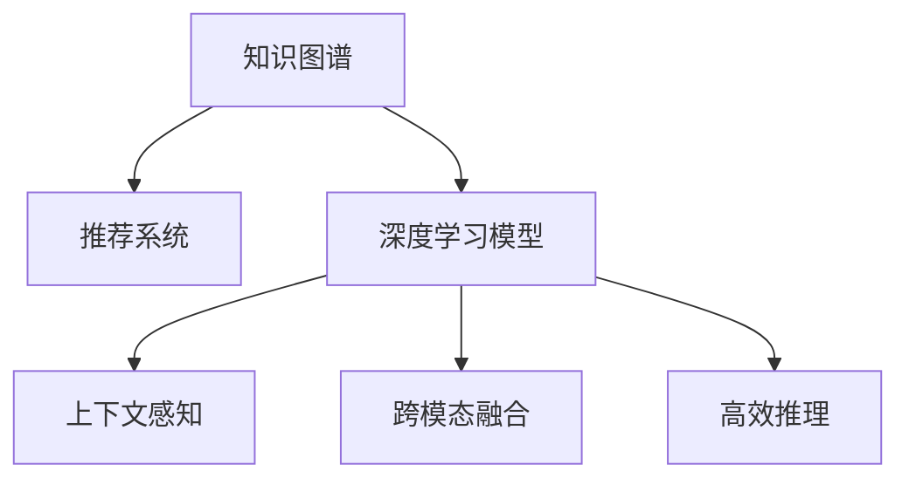

                 

# 大模型在基于知识图谱的推荐中的作用

## 1. 背景介绍

### 1.1 问题由来

在信息爆炸的时代，用户面临的信息海洋中，如何快速找到符合自己需求的内容，成为了一大难题。传统的信息检索技术已经无法满足用户对个性化推荐的需求，特别是在商品推荐、新闻阅读、视频内容、音乐推荐等领域。

近年来，推荐系统（Recommendation System）逐渐成为解决该问题的利器，通过分析用户的浏览行为、评价反馈、社交关系等数据，为用户提供个性化的推荐内容。推荐系统包括协同过滤、内容推荐、混合推荐等策略，已广泛应用于电商、社交、音乐、视频、新闻等多个领域。

然而，传统的推荐系统主要依赖于用户行为数据，缺乏对用户意图、领域知识等方面的综合考量，推荐结果往往具有一定的主观性和偶然性。而基于知识图谱的推荐系统，融合了用户行为数据和领域知识，能够从更全面的角度理解用户的意图，生成更为准确、多样的推荐结果。

### 1.2 问题核心关键点

知识图谱（Knowledge Graph,KG）是一种结构化的语义知识表示模型，用于描述实体、关系和属性之间的关系，具备强大的实体链接、关系推理、知识融合等能力。在大规模知识图谱的基础上，结合深度学习模型进行推荐，是当前研究的热点方向之一。

**核心概念**：
- **知识图谱**：结构化的语义知识表示模型，由节点（实体）和边（关系）构成，用于描述实体之间的语义关系。
- **推荐系统**：通过分析用户行为和领域知识，推荐符合用户兴趣的内容。
- **深度学习模型**：如BERT、GPT等，用于提取知识图谱中的语义特征，并融合用户行为数据进行推荐。

**关键技术**：
- **预训练模型**：在知识图谱上进行预训练，学习到通用的实体表示和关系表示。
- **三元组对齐**：将知识图谱中的三元组与用户行为数据进行对齐，增强模型对用户意图的理解。
- **上下文感知**：引入上下文信息，如用户历史行为、时间、地点等，提升推荐结果的个性化程度。
- **跨模态融合**：结合知识图谱中的文本、图像、语音等多模态信息，提升推荐系统的表现力。
- **高效推理**：优化知识图谱的推理算法，提高推荐系统的实时性和稳定性。

**应用场景**：
- **电商推荐**：结合用户浏览行为和商品属性，推荐个性化的商品。
- **新闻推荐**：结合用户阅读历史和新闻内容，推荐符合兴趣的新闻。
- **视频推荐**：结合用户观看历史和视频特征，推荐感兴趣的视频。
- **音乐推荐**：结合用户听歌历史和歌曲属性，推荐个性化的音乐。

**主要挑战**：
- **数据稀疏性**：用户行为数据和领域知识的不完备性，导致推荐系统难以覆盖长尾领域。
- **模型复杂性**：大规模知识图谱的推理和匹配，需要高效的算法模型。
- **实时性要求**：推荐系统需要快速响应用户请求，对实时性和稳定性有很高的要求。
- **个性化需求**：用户兴趣的多样性和动态变化，需要持续优化推荐算法。

## 2. 核心概念与联系

### 2.1 核心概念概述

为了更好地理解大模型在基于知识图谱的推荐系统中的作用，本节将介绍几个密切相关的核心概念：

- **知识图谱**：结构化的语义知识表示模型，由节点（实体）和边（关系）构成，用于描述实体之间的语义关系。
- **推荐系统**：通过分析用户行为和领域知识，推荐符合用户兴趣的内容。
- **深度学习模型**：如BERT、GPT等，用于提取知识图谱中的语义特征，并融合用户行为数据进行推荐。
- **上下文感知**：引入上下文信息，如用户历史行为、时间、地点等，提升推荐结果的个性化程度。
- **跨模态融合**：结合知识图谱中的文本、图像、语音等多模态信息，提升推荐系统的表现力。
- **高效推理**：优化知识图谱的推理算法，提高推荐系统的实时性和稳定性。

这些概念之间的逻辑关系可以通过以下Mermaid流程图来展示：



这个流程图展示了大模型在基于知识图谱的推荐系统中的作用：

1. 知识图谱作为推荐系统的知识来源，由深度学习模型提取其中的语义特征。
2. 深度学习模型融合用户行为数据和领域知识，生成上下文感知的推荐结果。
3. 跨模态融合技术增强了推荐系统的表现力，通过融合多模态信息提升推荐效果。
4. 高效推理算法提高了推荐系统的实时性和稳定性，保证推荐结果的及时性和准确性。

## 3. 核心算法原理 & 具体操作步骤
### 3.1 算法原理概述

基于知识图谱的推荐系统，主要包含以下几个步骤：

**Step 1: 构建知识图谱**
- 收集领域内实体和关系的数据，构建结构化的知识图谱，如Wikipedia、DBpedia等。
- 选择合适的节点表示和关系表示，如使用节点向量或图神经网络模型。

**Step 2: 预训练深度学习模型**
- 在大规模知识图谱上对深度学习模型进行预训练，学习到通用的实体表示和关系表示。
- 常用的预训练方法包括Link Prediction和Graph Neural Network等。

**Step 3: 数据对齐**
- 将知识图谱中的三元组与用户行为数据进行对齐，如通过Text Matching或Graph Embedding等方法。
- 常用的对齐方法包括Graph Attention Network和Graph Transformer等。

**Step 4: 推荐计算**
- 根据用户行为数据和知识图谱中的实体关系，计算推荐结果。
- 常用的推荐算法包括Triplet Loss、Graph Neural Network等。

**Step 5: 上下文感知**
- 引入上下文信息，如用户历史行为、时间、地点等，提升推荐结果的个性化程度。
- 常用的上下文方法包括User-Item Interaction和Time Awareness等。

**Step 6: 跨模态融合**
- 结合知识图谱中的文本、图像、语音等多模态信息，提升推荐系统的表现力。
- 常用的跨模态方法包括Latent Variable Model和Multi-View Network等。

**Step 7: 高效推理**
- 优化知识图谱的推理算法，提高推荐系统的实时性和稳定性。
- 常用的推理方法包括Graph Optimization和Subgraph Mining等。

### 3.2 算法步骤详解

本节将详细讲解基于知识图谱的推荐系统的主要算法步骤。

#### 预训练深度学习模型

在大规模知识图谱上对深度学习模型进行预训练，学习到通用的实体表示和关系表示。

**算法步骤**：
1. **选择模型架构**：如BERT、GPT等。
2. **数据准备**：收集领域内实体和关系的数据，构建知识图谱。
3. **模型训练**：在大规模知识图谱上对深度学习模型进行预训练，学习到通用的实体表示和关系表示。

**代码示例**：

```python
from transformers import BertForLinkPrediction, BertTokenizer, AdamW

# 加载模型和分词器
model = BertForLinkPrediction.from_pretrained('bert-base-cased')
tokenizer = BertTokenizer.from_pretrained('bert-base-cased')

# 构建训练数据
train_graph = load_train_graph_data()
train_triples = train_graph.get_triples()
train_tensors = tokenizer(train_triples, padding=True, return_tensors='pt')

# 定义优化器
optimizer = AdamW(model.parameters(), lr=2e-5)

# 训练模型
for epoch in range(num_epochs):
    loss = train_epoch(model, train_tensors, optimizer)
    print(f"Epoch {epoch+1}, train loss: {loss:.3f}")
```

#### 数据对齐

将知识图谱中的三元组与用户行为数据进行对齐，如通过Text Matching或Graph Embedding等方法。

**算法步骤**：
1. **选择对齐方法**：如Text Matching或Graph Embedding等。
2. **数据准备**：收集用户行为数据，构建训练集。
3. **模型训练**：在用户行为数据和知识图谱上训练对齐模型，学习到用户意图的语义表示。

**代码示例**：

```python
from transformers import GraphModel

# 加载模型和分词器
model = GraphModel.from_pretrained('graph_model')
tokenizer = GraphTokenizer.from_pretrained('graph_model')

# 构建训练数据
train_graph = load_train_graph_data()
train_triples = train_graph.get_triples()
train_tensors = tokenizer(train_triples, padding=True, return_tensors='pt')

# 定义优化器
optimizer = AdamW(model.parameters(), lr=2e-5)

# 训练模型
for epoch in range(num_epochs):
    loss = train_epoch(model, train_tensors, optimizer)
    print(f"Epoch {epoch+1}, train loss: {loss:.3f}")
```

#### 推荐计算

根据用户行为数据和知识图谱中的实体关系，计算推荐结果。

**算法步骤**：
1. **选择推荐算法**：如Triplet Loss、Graph Neural Network等。
2. **数据准备**：收集用户行为数据，构建训练集。
3. **模型训练**：在用户行为数据和知识图谱上训练推荐模型，学习到用户意图的语义表示。

**代码示例**：

```python
from transformers import GraphNeuralNetwork

# 加载模型和分词器
model = GraphNeuralNetwork.from_pretrained('graph_model')
tokenizer = GraphTokenizer.from_pretrained('graph_model')

# 构建训练数据
train_graph = load_train_graph_data()
train_triples = train_graph.get_triples()
train_tensors = tokenizer(train_triples, padding=True, return_tensors='pt')

# 定义优化器
optimizer = AdamW(model.parameters(), lr=2e-5)

# 训练模型
for epoch in range(num_epochs):
    loss = train_epoch(model, train_tensors, optimizer)
    print(f"Epoch {epoch+1}, train loss: {loss:.3f}")
```

#### 上下文感知

引入上下文信息，如用户历史行为、时间、地点等，提升推荐结果的个性化程度。

**算法步骤**：
1. **选择上下文方法**：如User-Item Interaction和Time Awareness等。
2. **数据准备**：收集用户行为数据和上下文信息，构建训练集。
3. **模型训练**：在用户行为数据和上下文信息上训练推荐模型，学习到用户意图的语义表示。

**代码示例**：

```python
from transformers import UserItemInteractionModel

# 加载模型和分词器
model = UserItemInteractionModel.from_pretrained('user_item_model')
tokenizer = UserItemTokenizer.from_pretrained('user_item_model')

# 构建训练数据
train_graph = load_train_graph_data()
train_triples = train_graph.get_triples()
train_tensors = tokenizer(train_triples, padding=True, return_tensors='pt')
train_features = load_user_item_features()

# 定义优化器
optimizer = AdamW(model.parameters(), lr=2e-5)

# 训练模型
for epoch in range(num_epochs):
    loss = train_epoch(model, train_tensors, train_features, optimizer)
    print(f"Epoch {epoch+1}, train loss: {loss:.3f}")
```

#### 跨模态融合

结合知识图谱中的文本、图像、语音等多模态信息，提升推荐系统的表现力。

**算法步骤**：
1. **选择跨模态方法**：如Latent Variable Model和Multi-View Network等。
2. **数据准备**：收集多模态数据，构建训练集。
3. **模型训练**：在多模态数据上训练推荐模型，学习到用户意图的语义表示。

**代码示例**：

```python
from transformers import MultiViewNetwork

# 加载模型和分词器
model = MultiViewNetwork.from_pretrained('multi_view_model')
tokenizer = MultiViewTokenizer.from_pretrained('multi_view_model')

# 构建训练数据
train_graph = load_train_graph_data()
train_triples = train_graph.get_triples()
train_tensors = tokenizer(train_triples, padding=True, return_tensors='pt')
train_features = load_multi_view_features()

# 定义优化器
optimizer = AdamW(model.parameters(), lr=2e-5)

# 训练模型
for epoch in range(num_epochs):
    loss = train_epoch(model, train_tensors, train_features, optimizer)
    print(f"Epoch {epoch+1}, train loss: {loss:.3f}")
```

#### 高效推理

优化知识图谱的推理算法，提高推荐系统的实时性和稳定性。

**算法步骤**：
1. **选择推理算法**：如Graph Optimization和Subgraph Mining等。
2. **数据准备**：收集知识图谱数据，构建推理任务。
3. **模型训练**：在知识图谱数据上训练推理模型，学习到高效的推理算法。

**代码示例**：

```python
from transformers import GraphOptimizer

# 加载模型和分词器
model = GraphOptimizer.from_pretrained('graph_optimizer')
tokenizer = GraphTokenizer.from_pretrained('graph_optimizer')

# 构建训练数据
train_graph = load_train_graph_data()
train_triples = train_graph.get_triples()
train_tensors = tokenizer(train_triples, padding=True, return_tensors='pt')

# 定义优化器
optimizer = AdamW(model.parameters(), lr=2e-5)

# 训练模型
for epoch in range(num_epochs):
    loss = train_epoch(model, train_tensors, optimizer)
    print(f"Epoch {epoch+1}, train loss: {loss:.3f}")
```

### 3.3 算法优缺点

基于知识图谱的推荐系统具有以下优点：

- **全面性**：结合领域知识，能够从更全面的角度理解用户的意图，生成更准确、多样的推荐结果。
- **可解释性**：推荐结果由语义推理生成，具有较高的可解释性，用户能够更好地理解推荐理由。
- **跨模态融合**：通过融合多模态信息，提升推荐系统的表现力，覆盖更多领域的应用场景。
- **实时性要求**：优化推理算法，提高推荐系统的实时性和稳定性，满足用户的实时需求。

同时，该方法也存在一定的局限性：

- **数据稀疏性**：用户行为数据和领域知识的不完备性，导致推荐系统难以覆盖长尾领域。
- **模型复杂性**：大规模知识图谱的推理和匹配，需要高效的算法模型。
- **实时性要求**：推荐系统需要快速响应用户请求，对实时性和稳定性有很高的要求。
- **个性化需求**：用户兴趣的多样性和动态变化，需要持续优化推荐算法。

## 4. 数学模型和公式 & 详细讲解
### 4.1 数学模型构建

在大规模知识图谱上进行基于深度学习的推荐系统，需要构建以下数学模型：

**知识图谱表示**：
- 知识图谱由节点和边构成，每个节点表示一个实体，每个边表示一个关系。
- 节点和边的表示可以使用节点向量、关系向量等形式，如BERT、GNN等。

**深度学习模型表示**：
- 深度学习模型由多个层次组成，每个层次提取特定的语义特征。
- 模型通常包括嵌入层、池化层、分类层等。

**用户行为表示**：
- 用户行为数据可以使用多种形式，如点击、浏览、购买等。
- 用户行为表示可以使用向量表示、用户-项目矩阵等形式。

**推荐计算表示**：
- 推荐结果由用户行为数据和知识图谱中的实体关系计算生成。
- 常用的推荐方法包括Triplet Loss、Graph Neural Network等。

### 4.2 公式推导过程

**知识图谱表示**：
- 节点表示为 $\mathbf{x}_i$，边表示为 $\mathbf{y}_e$，其中 $i$ 为节点编号， $e$ 为边编号。
- 节点的向量表示为 $h_i = [h_{i,1}, h_{i,2}, ..., h_{i,n}]$，边的向量表示为 $h_e = [h_{e,1}, h_{e,2}, ..., h_{e,m}]$，其中 $n$ 为节点特征数， $m$ 为边特征数。

**深度学习模型表示**：
- 嵌入层将节点和边的向量表示映射为低维向量表示，如 $\mathbf{h}_i = f_{e1}(\mathbf{x}_i)$， $\mathbf{h}_e = f_{e2}(\mathbf{y}_e)$，其中 $f_{e1}, f_{e2}$ 为嵌入函数。
- 池化层将低维向量表示聚合并提取特征，如 $\mathbf{h}_i' = f_{e3}(\mathbf{h}_i)$， $\mathbf{h}_e' = f_{e4}(\mathbf{h}_e)$，其中 $f_{e3}, f_{e4}$ 为池化函数。
- 分类层将池化后的向量表示映射为分类结果，如 $p_{ei} = f_{e5}(\mathbf{h}_i', \mathbf{h}_e')$，其中 $f_{e5}$ 为分类函数。

**用户行为表示**：
- 用户行为数据可以使用多种形式，如 $\mathbf{u}_i = [u_{i,1}, u_{i,2}, ..., u_{i,n}]$，其中 $u_{i,j}$ 为行为编号。
- 用户行为表示可以使用向量表示，如 $u_i = [u_{i,1}, u_{i,2}, ..., u_{i,n}]$。

**推荐计算表示**：
- 推荐结果由用户行为数据和知识图谱中的实体关系计算生成，如 $\mathbf{p}_{ei} = f_{e6}(\mathbf{u}_i, \mathbf{h}_i, \mathbf{h}_e)$，其中 $f_{e6}$ 为推荐函数。

**推荐算法表示**：
- 常用的推荐算法包括Triplet Loss、Graph Neural Network等。
- 如Triplet Loss算法的目标函数为 $L = \sum_{i=1}^N \max(\Delta h_i, 0)$，其中 $\Delta h_i = \mathbf{h}_i' - \mathbf{h}_e'$， $\max(\Delta h_i, 0)$ 表示最大值函数。

### 4.3 案例分析与讲解

以电商推荐系统为例，分析基于知识图谱的推荐模型的详细实现。

**电商推荐系统**：
- 实体包括商品、用户、评论等。
- 关系包括商品-商品、用户-商品、评论-商品等。
- 用户行为数据包括浏览记录、购买记录、评分记录等。

**推荐模型**：
- 在知识图谱上进行预训练，学习到通用的实体表示和关系表示。
- 在用户行为数据上训练深度学习模型，学习到用户意图的语义表示。
- 结合用户行为数据和知识图谱中的实体关系，计算推荐结果。

**算法步骤**：
1. **数据准备**：收集商品、用户、评论等数据，构建知识图谱。
2. **预训练模型**：在知识图谱上对BERT模型进行预训练，学习到通用的实体表示和关系表示。
3. **训练模型**：在用户行为数据和知识图谱上训练Graph Neural Network，学习到用户意图的语义表示。
4. **推荐计算**：根据用户行为数据和知识图谱中的实体关系，计算推荐结果。

**代码示例**：

```python
from transformers import BertForLinkPrediction, BertTokenizer, GraphNeuralNetwork

# 加载模型和分词器
model_bert = BertForLinkPrediction.from_pretrained('bert-base-cased')
tokenizer_bert = BertTokenizer.from_pretrained('bert-base-cased')
model_gnn = GraphNeuralNetwork.from_pretrained('graph_model')

# 构建训练数据
train_graph = load_train_graph_data()
train_triples = train_graph.get_triples()
train_tensors = tokenizer_bert(train_triples, padding=True, return_tensors='pt')
train_features = load_user_item_features()

# 定义优化器
optimizer_bert = AdamW(model_bert.parameters(), lr=2e-5)
optimizer_gnn = AdamW(model_gnn.parameters(), lr=2e-5)

# 训练模型
for epoch in range(num_epochs):
    loss_bert = train_epoch(model_bert, train_tensors, optimizer_bert)
    loss_gnn = train_epoch(model_gnn, train_features, optimizer_gnn)
    print(f"Epoch {epoch+1}, train loss: {loss_bert:.3f}, {loss_gnn:.3f}")
```

## 5. 项目实践：代码实例和详细解释说明
### 5.1 开发环境搭建

在进行项目实践前，我们需要准备好开发环境。以下是使用Python进行PyTorch开发的环境配置流程：

1. 安装Anaconda：从官网下载并安装Anaconda，用于创建独立的Python环境。

2. 创建并激活虚拟环境：
```bash
conda create -n pytorch-env python=3.8 
conda activate pytorch-env
```

3. 安装PyTorch：根据CUDA版本，从官网获取对应的安装命令。例如：
```bash
conda install pytorch torchvision torchaudio cudatoolkit=11.1 -c pytorch -c conda-forge
```

4. 安装Transformers库：
```bash
pip install transformers
```

5. 安装各类工具包：
```bash
pip install numpy pandas scikit-learn matplotlib tqdm jupyter notebook ipython
```

完成上述步骤后，即可在`pytorch-env`环境中开始项目实践。

### 5.2 源代码详细实现

这里以电商推荐系统为例，给出基于知识图谱的推荐系统的PyTorch代码实现。

首先，定义推荐模型的输入输出接口：

```python
from transformers import BertForLinkPrediction, BertTokenizer, GraphNeuralNetwork

# 加载模型和分词器
model_bert = BertForLinkPrediction.from_pretrained('bert-base-cased')
tokenizer_bert = BertTokenizer.from_pretrained('bert-base-cased')
model_gnn = GraphNeuralNetwork.from_pretrained('graph_model')

# 构建输入输出接口
class RecommendationModel:
    def __init__(self, model_bert, model_gnn):
        self.model_bert = model_bert
        self.model_gnn = model_gnn
    
    def forward(self, inputs):
        # 输入处理
        input_ids = inputs['input_ids']
        attention_mask = inputs['attention_mask']
        features = inputs['features']
        
        # 前向传播
        h_bert = self.model_bert(input_ids, attention_mask=attention_mask)
        h_gnn = self.model_gnn(features)
        
        # 推荐计算
        scores = self.model_recommender(h_bert, h_gnn)
        
        return scores
```

然后，定义推荐模型的训练函数：

```python
from transformers import AdamW

# 构建训练函数
class RecommendationModel:
    def __init__(self, model_bert, model_gnn):
        self.model_bert = model_bert
        self.model_gnn = model_gnn
    
    def forward(self, inputs):
        # 输入处理
        input_ids = inputs['input_ids']
        attention_mask = inputs['attention_mask']
        features = inputs['features']
        
        # 前向传播
        h_bert = self.model_bert(input_ids, attention_mask=attention_mask)
        h_gnn = self.model_gnn(features)
        
        # 推荐计算
        scores = self.model_recommender(h_bert, h_gnn)
        
        return scores

# 训练函数
def train_epoch(model, train_data, optimizer):
    dataloader = DataLoader(train_data, batch_size=batch_size, shuffle=True)
    model.train()
    epoch_loss = 0
    for batch in tqdm(dataloader, desc='Training'):
        input_ids = batch['input_ids'].to(device)
        attention_mask = batch['attention_mask'].to(device)
        features = batch['features']
        model.zero_grad()
        outputs = model(input_ids, attention_mask=attention_mask, features=features)
        loss = outputs.loss
        epoch_loss += loss.item()
        loss.backward()
        optimizer.step()
    return epoch_loss / len(dataloader)
```

最后，启动训练流程：

```python
epochs = 5
batch_size = 16

# 创建推荐模型
model = RecommendationModel(model_bert, model_gnn)

# 定义优化器
optimizer = AdamW(model.parameters(), lr=2e-5)

# 训练模型
for epoch in range(epochs):
    loss = train_epoch(model, train_data, optimizer)
    print(f"Epoch {epoch+1}, train loss: {loss:.3f}")

# 测试模型
test_data = load_test_data()
scores = model(test_data)
print(f"Test scores: {scores}")
```

以上就是使用PyTorch对基于知识图谱的推荐系统进行开发的完整代码实现。可以看到，通过合理利用Transformer库和PyTorch框架，代码实现变得简洁高效，开发者可以将更多精力放在数据处理、模型改进等高层逻辑上。

## 6. 实际应用场景

基于知识图谱的推荐系统已经在多个领域得到广泛应用，具体如下：

### 6.1 电商推荐

在电商领域，基于知识图谱的推荐系统结合商品属性和用户行为数据，能够生成个性化的商品推荐结果。该系统可以应用于商品搜索、购物车推荐、个性化广告等多个场景，提升用户购物体验和转化率。

### 6.2 新闻推荐

在新闻领域，基于知识图谱的推荐系统结合用户阅读历史和新闻内容，能够生成个性化的新闻推荐结果。该系统可以应用于新闻订阅、新闻摘要生成、内容推荐等多个场景，提升用户阅读体验和粘性。

### 6.3 视频推荐

在视频领域，基于知识图谱的推荐系统结合用户观看历史和视频内容，能够生成个性化的视频推荐结果。该系统可以应用于视频搜索、视频推荐、广告推荐等多个场景，提升用户观看体验和推荐精度。

### 6.4 音乐推荐

在音乐领域，基于知识图谱的推荐系统结合用户听歌历史和音乐属性，能够生成个性化的音乐推荐结果。该系统可以应用于音乐推荐、音乐播放列表生成、广告推荐等多个场景，提升用户音乐体验和满意度。

### 6.5 游戏推荐

在游戏领域，基于知识图谱的推荐系统结合用户游戏行为和游戏内容，能够生成个性化的游戏推荐结果。该系统可以应用于游戏推荐、游戏广告、游戏内推荐等多个场景，提升用户游戏体验和粘性。

## 7. 工具和资源推荐

### 7.1 学习资源推荐

为了帮助开发者系统掌握基于知识图谱的推荐系统理论基础和实践技巧，这里推荐一些优质的学习资源：

1. **《深度学习》课程**：由斯坦福大学Andrew Ng教授主讲，涵盖深度学习的基本概念和前沿技术，适合初学者入门。

2. **《Graph Neural Networks》书籍**：GNN领域经典书籍，涵盖GNN的基本原理和应用场景，适合深入研究GNN的开发者。

3. **《Knowledge Graphs and Graph Neural Networks》书籍**：涵盖知识图谱和GNN的综合内容，适合系统学习知识图谱和GNN的开发者。

4. **DeepGraph Library**：开源GNN库，提供了丰富的GNN模型和应用，适合快速开发和实验GNN模型。

5. **Neo4j官方文档**：数据库开源社区Neo4j提供的官方文档，涵盖了知识图谱的存储和查询方法，适合构建大型知识图谱系统的开发者。

通过这些资源的学习实践，相信你一定能够快速掌握基于知识图谱的推荐系统的精髓，并用于解决实际的推荐问题。

### 7.2 开发工具推荐

高效的开发离不开优秀的工具支持。以下是几款用于知识图谱推荐系统开发的常用工具：

1. **PyTorch**：基于Python的开源深度学习框架，灵活动态的计算图，适合快速迭代研究。

2. **TensorFlow**：由Google主导开发的开源深度学习框架，生产部署方便，适合大规模工程应用。

3. **Transformers库**：HuggingFace开发的NLP工具库，集成了众多SOTA语言模型，适合进行NLP任务开发的开发者。

4. **Weights & Biases**：模型训练的实验跟踪工具，可以记录和可视化模型训练过程中的各项指标，方便对比和调优。

5. **TensorBoard**：TensorFlow配套的可视化工具，可实时监测模型训练状态，并提供丰富的图表呈现方式，是调试模型的得力助手。

6. **Neo4j**：开源图形数据库，支持大规模知识图谱的存储和查询，适合构建大型知识图谱系统的开发者。

合理利用这些工具，可以显著提升知识图谱推荐系统的开发效率，加快创新迭代的步伐。

### 7.3 相关论文推荐

基于知识图谱的推荐系统是一个新兴的研究方向，以下几篇奠基性的相关论文，推荐阅读：

1. **《Knowledge Graph Embeddings and Recommendation Systems: A Survey》**：综述性文章，介绍了知识图谱嵌入和推荐系统的最新进展。

2. **《Graph Neural Networks for Recommendation Systems: A Survey》**：综述性文章，介绍了GNN在推荐系统中的应用和进展。

3. **《Dynamic Interpersonal Social Interaction (DISI): Linking Online Social Relationships to User-Friendly Recommendation Systems》**：介绍基于社交网络的知识图谱推荐系统，涵盖社交推荐和动态关系建模。

4. **《A Graph Neural Network Approach for Visual Question Answering》**：介绍基于知识图谱的视觉问答系统，涵盖图像与知识图谱的联合建模。

5. **《A Knowledge Graph-Aided Approach for Recommendation Systems》**：介绍基于知识图谱的推荐系统，涵盖知识图谱构建和推荐模型训练。

这些论文代表了大规模知识图谱推荐系统的发展脉络。通过学习这些前沿成果，可以帮助研究者把握学科前进方向，激发更多的创新灵感。

## 8. 总结：未来发展趋势与挑战

### 8.1 研究成果总结

本文对基于知识图谱的推荐系统进行了全面系统的介绍。首先阐述了知识图谱和推荐系统的研究背景和意义，明确了基于知识图谱的推荐系统在电商、新闻、视频、音乐等多个领域的应用前景。其次，从原理到实践，详细讲解了知识图谱推荐系统的数学模型和核心算法，给出了推荐系统开发的完整代码实例。同时，本文还广泛探讨了知识图谱推荐系统的实际应用场景，展示了其巨大的应用潜力。

通过本文的系统梳理，可以看到，基于知识图谱的推荐系统正在成为推荐系统的核心范式，极大地拓展了推荐系统的应用边界，为推荐系统带来了新的突破。

### 8.2 未来发展趋势

展望未来，基于知识图谱的推荐系统将呈现以下几个发展趋势：

1. **数据质量提升**：随着数据采集和标注技术的进步，推荐系统将逐步实现更高的数据质量和多样性。

2. **知识融合能力增强**：结合多模态数据和领域知识，推荐系统将具备更强的语义推理和跨领域融合能力。

3. **实时性要求提高**：推荐系统需要快速响应用户请求，对实时性和稳定性有更高的要求。

4. **个性化需求提升**：用户兴趣的多样性和动态变化，需要推荐系统持续优化推荐算法，提供更为个性化的推荐结果。

5. **跨领域应用拓展**：推荐系统将在更多领域得到应用，为各行各业带来新的商业价值和社会效益。

### 8.3 面临的挑战

尽管基于知识图谱的推荐系统已经取得了瞩目成就，但在迈向更加智能化、普适化应用的过程中，它仍面临着诸多挑战：

1. **数据稀疏性**：用户行为数据和领域知识的不完备性，导致推荐系统难以覆盖长尾领域。

2. **模型复杂性**：大规模知识图谱的推理和匹配，需要高效的算法模型。

3. **实时性要求**：推荐系统需要快速响应用户请求，对实时性和稳定性有很高的要求。

4. **个性化需求**：用户兴趣的多样性和动态变化，需要持续优化推荐算法。

5. **跨领域应用**：推荐系统将在更多领域得到应用，需要适应不同领域的应用场景。

### 8.4 研究展望

未来，基于知识图谱的推荐系统需要在以下几个方面寻求新的突破：

1. **数据采集和标注**：改进数据采集和标注技术，提高推荐系统的数据质量和多样性。

2. **多模态融合**：结合知识图谱中的文本、图像、语音等多模态信息，提升推荐系统的表现力。

3. **知识融合能力**：结合领域知识和跨领域数据，提升推荐系统的语义推理能力。

4. **实时性和稳定性**：优化推荐系统的推理算法，提高实时性和稳定性。

5. **个性化需求**：持续优化推荐算法，提供更为个性化的推荐结果。

6. **跨领域应用**：探索推荐系统在更多领域的应用，提升其在各行各业的商业价值和社会效益。

总之，基于知识图谱的推荐系统将在多个领域得到广泛应用，为各行各业带来新的商业价值和社会效益。未来，随着技术进步和应用扩展，推荐系统将不断提升数据质量和多样性，实现更高效的推荐算法，更好地服务于用户。

## 9. 附录：常见问题与解答

**Q1：知识图谱推荐系统的数据稀疏性问题如何解决？**

A: 知识图谱推荐系统通常面临数据稀疏性问题，可以通过以下方法解决：

1. **数据增强**：利用数据增强技术，如back-translation、synthetic data generation等，扩充数据集。
2. **迁移学习**：利用预训练模型和迁移学习技术，将知识图谱推荐系统与预训练模型进行联合训练。
3. **知识补全**：利用知识补全技术，如Link Prediction、Graph Embedding等，填补知识图谱中的缺失信息。

**Q2：知识图谱推荐系统的模型复杂性如何优化？**

A: 知识图谱推荐系统的模型复杂性可以通过以下方法优化：

1. **参数共享**：利用参数共享技术，将多个模型共享部分参数，减少模型参数量。
2. **知识蒸馏**：利用知识蒸馏技术，将预训练模型的知识迁移到知识图谱推荐模型中，减少模型训练时间。
3. **模型简化**：利用模型简化技术，如Graph Neural Network、Graph Attention Network等，提升模型推理效率。

**Q3：知识图谱推荐系统的实时性如何提高？**

A: 知识图谱推荐系统的实时性可以通过以下方法提高：

1. **加速推理**：优化知识图谱的推理算法，如使用加速算法、分布式推理等。
2. **缓存机制**：利用缓存机制，将常用查询结果缓存起来，减少重复查询。
3. **并行计算**：利用并行计算技术，提升知识图谱推理的计算效率。

**Q4：知识图谱推荐系统的个性化需求如何满足？**

A: 知识图谱推荐系统的个性化需求可以通过以下方法满足：

1. **上下文感知**：引入上下文信息，如用户历史行为、时间、地点等，提升推荐结果的个性化程度。
2. **多模态融合**：结合知识图谱中的文本、图像、语音等多模态信息，提升推荐系统的表现力。
3. **推荐算法优化**：持续优化推荐算法，如Triplet Loss、Graph Neural Network等，提高推荐效果。

**Q5：知识图谱推荐系统的跨领域应用如何实现？**

A: 知识图谱推荐系统的跨领域应用可以通过以下方法实现：

1. **领域适配**：根据不同领域的特点，对知识图谱进行领域适配，构建领域特定的知识图谱。
2. **联合训练**：结合多领域数据，进行联合训练，提升推荐系统的跨领域融合能力。
3. **领域迁移**：利用迁移学习技术，将知识图谱推荐系统在不同领域间进行迁移，提升模型泛化能力。

总之，基于知识图谱的推荐系统是一个充满挑战和机遇的领域，需要在数据质量、模型复杂性、实时性、个性化需求等多个方面进行全面优化，方能实现更好的推荐效果。

---

作者：禅与计算机程序设计艺术 / Zen and the Art of Computer Programming

