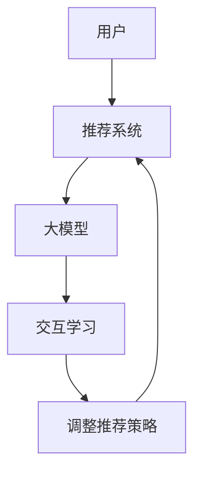

                 

# 大模型在推荐系统中的元强化学习应用

> 关键词：推荐系统,元强化学习,大模型,协同过滤,深度学习

## 1. 背景介绍

在数字化时代，推荐系统已成为互联网公司和在线平台的核心竞争力之一。其核心目标是预测用户的个性化兴趣，并提供个性化推荐，使用户更有效地浏览内容、购物和服务，从而提升用户满意度和平台收益。传统推荐系统主要基于协同过滤、基于内容的推荐等方法，通过分析用户行为数据和产品属性信息，为用户提供推荐。但这些方法在处理冷启动、大规模稀疏数据等问题时效果有限。随着深度学习和大模型的兴起，推荐系统进入了一个新的发展阶段。

元强化学习（Meta-Reinforcement Learning, MRL）是大模型在推荐系统中的应用前沿。元强化学习通过模拟用户与系统之间的交互过程，训练模型以动态调整推荐策略，适应不同用户和环境变化，从而提升推荐的精准性和个性化程度。本文将深入探讨元强化学习在大模型推荐系统中的应用原理、方法、优势和未来趋势。

## 2. 核心概念与联系

### 2.1 核心概念概述

在大模型推荐系统中，元强化学习是实现动态推荐的核心技术。其核心思想是：在预训练的大模型基础上，通过模拟用户与推荐系统之间的交互过程，训练模型以实时调整推荐策略。元强化学习通过与环境的交互，利用奖励机制优化策略，使推荐系统能够自适应地更新推荐方案，提升用户体验和推荐效果。

### 2.2 核心概念原理和架构的 Mermaid 流程图



**A:** 用户，是推荐系统服务的目标群体，具有不同的兴趣和行为特征。

**B:** 推荐系统，接收用户请求，提供个性化推荐。

**C:** 大模型，即预训练模型，用于存储丰富的用户和产品特征信息，同时具备深度学习和元强化学习的能力。

**D:** 交互学习，即在用户与推荐系统交互的过程中，利用元强化学习算法调整推荐策略。

**E:** 调整推荐策略，即根据用户反馈和推荐效果，动态更新推荐算法参数，提升推荐质量。

### 2.3 核心概念之间的关系

大模型推荐系统和元强化学习之间的关系，可以通过以下三点描述：

1. **模型基础：** 大模型为推荐系统提供了强大的知识库和特征表示能力，使得推荐系统能够对用户和产品的多样性和复杂性进行有效的建模。

2. **交互过程：** 元强化学习通过与用户交互，动态调整推荐策略，使得推荐系统能够根据用户的实时反馈和行为调整推荐内容，实现个性化的推荐。

3. **优化目标：** 元强化学习通过奖励机制优化推荐策略，提升推荐系统的准确性和用户体验，最终实现平台收益的最大化。

## 3. 核心算法原理 & 具体操作步骤

### 3.1 算法原理概述

元强化学习的核心思想是：在推荐系统中，用户与系统的交互可以看作是一个连续的决策过程。通过元学习算法，模型能够实时学习并调整推荐策略，以最大化用户满意度和平台收益。以下是一个简化的元强化学习框架：

1. **环境：** 用户的行为数据和产品的属性信息。
2. **代理：** 推荐系统的大模型，具备预测和优化能力。
3. **奖励：** 用户对推荐结果的满意度，如点击率、转化率等。
4. **策略：** 推荐系统的决策策略，如选择推荐算法、调整推荐权重等。

元强化学习的目标是，通过与环境的交互，不断优化策略，最大化累积奖励。具体步骤如下：

1. **初始化：** 随机初始化推荐策略。
2. **交互：** 在环境中执行推荐策略，获取奖励和反馈。
3. **优化：** 利用获得的奖励和反馈，更新策略参数。
4. **循环：** 重复以上步骤，直至收敛或达到预设的迭代次数。

### 3.2 算法步骤详解

以下是一个详细的元强化学习算法流程：

**Step 1: 准备数据集**
- 收集用户的历史行为数据和产品的属性信息，作为推荐系统环境的输入。
- 设计奖励函数，衡量推荐结果的用户满意度。

**Step 2: 定义环境**
- 构建环境的数学模型，描述用户和产品的交互过程。
- 定义状态、动作和转移概率，建立环境模型。

**Step 3: 初始化策略**
- 随机初始化推荐策略，如选择推荐算法、调整推荐权重等。
- 初始化模型参数，如网络结构、权重等。

**Step 4: 交互学习**
- 在环境中执行推荐策略，根据用户行为获取奖励和反馈。
- 利用奖励和反馈，更新模型参数，调整推荐策略。

**Step 5: 更新策略**
- 根据累积奖励，利用优化算法（如Q-learning、REINFORCE等）更新策略参数。
- 根据策略更新，调整推荐系统行为。

**Step 6: 重复循环**
- 重复执行Step 4和Step 5，直至达到预设的迭代次数或策略收敛。

### 3.3 算法优缺点

元强化学习在大模型推荐系统中具有以下优势：

**优点：**
1. **动态调整：** 元强化学习能够根据用户行为实时调整推荐策略，提高推荐系统的适应性和个性化程度。
2. **优化效果：** 利用累积奖励，元强化学习能够更有效地优化推荐策略，提升用户体验和平台收益。
3. **泛化能力强：** 大模型具有强大的特征表示能力，元强化学习能够学习到不同用户和产品之间的复杂关系。

**缺点：**
1. **计算开销大：** 元强化学习需要大量的交互和计算，资源消耗较大。
2. **收敛速度慢：** 在大规模环境中，策略更新和优化需要较长时间才能收敛。
3. **策略复杂：** 推荐策略的复杂性增加了模型训练的难度，需要更多的数据和计算资源。

### 3.4 算法应用领域

元强化学习在大模型推荐系统中的应用，主要涵盖以下领域：

1. **个性化推荐：** 利用元强化学习动态调整推荐策略，提升推荐系统的个性化程度。
2. **广告投放：** 在广告推荐中，利用元强化学习优化广告投放策略，提升广告点击率和转化率。
3. **内容推荐：** 在新闻、视频、音乐等内容的推荐中，利用元强化学习优化推荐算法，提升用户满意度和平台收益。
4. **客户服务：** 在客户服务推荐中，利用元强化学习优化客服策略，提升客户满意度和客户留存率。

## 4. 数学模型和公式 & 详细讲解 & 举例说明

### 4.1 数学模型构建

在大模型推荐系统中，元强化学习的数学模型可以描述为用户与推荐系统之间的交互过程。以下是一个简化的数学模型：

1. **状态$s$：** 用户的行为数据和产品的属性信息。
2. **动作$a$：** 推荐系统对用户的行为进行预测，如选择推荐算法、调整推荐权重等。
3. **奖励$r$：** 用户对推荐结果的满意度，如点击率、转化率等。
4. **策略$\pi$：** 推荐系统的决策策略。

元强化学习的目标是最大化累积奖励，即求解最优策略$\pi^*$：

$$
\pi^* = \mathop{\arg\max}_{\pi} \sum_{t=0}^{\infty} \gamma^t r(s_t, a_t, \pi)
$$

其中$\gamma$为折扣因子，表示未来奖励的权重。

### 4.2 公式推导过程

以下是一个简单的元强化学习算法，即Q-learning算法：

1. **初始化：** 随机初始化Q值表，Q(s, a)。
2. **交互：** 在环境中执行推荐策略，根据用户行为获取奖励和反馈。
3. **更新：** 利用贝尔曼方程更新Q值，即：

$$
Q(s, a) = r + \gamma \max_{a'} Q(s', a')
$$

其中$s'$为下一状态，$a'$为下一动作，$\max_{a'} Q(s', a')$表示在$s'$状态下，选择最优动作的Q值。
4. **循环：** 重复执行Step 2和Step 3，直至达到预设的迭代次数或策略收敛。

### 4.3 案例分析与讲解

以下是一个具体的案例分析：

**案例：个性化新闻推荐**

1. **环境：** 用户的行为数据和新闻的属性信息。
2. **代理：** 推荐系统的大模型，用于预测用户对新闻的兴趣。
3. **奖励：** 用户对新闻的点击率和阅读时间。
4. **策略：** 推荐系统根据用户的兴趣和行为，选择推荐算法和调整推荐权重。

在实际应用中，元强化学习算法可以实时调整推荐策略，根据用户点击率和阅读时间等反馈信息，动态更新Q值表，从而优化推荐算法和推荐权重。通过多次迭代，模型能够更好地学习用户兴趣，提升推荐效果。

## 5. 项目实践：代码实例和详细解释说明

### 5.1 开发环境搭建

在进行元强化学习项目实践前，我们需要准备好开发环境。以下是使用Python进行TensorFlow开发的Python环境配置流程：

1. 安装Anaconda：从官网下载并安装Anaconda，用于创建独立的Python环境。

2. 创建并激活虚拟环境：
```bash
conda create -n tf-env python=3.7
conda activate tf-env
```

3. 安装TensorFlow：根据CUDA版本，从官网获取对应的安装命令。例如：
```bash
conda install tensorflow
```

4. 安装其他必要工具包：
```bash
pip install numpy pandas sklearn scipy gym
```

完成上述步骤后，即可在`tf-env`环境中开始元强化学习实践。

### 5.2 源代码详细实现

以下是一个简单的元强化学习代码实现，用于个性化新闻推荐：

```python
import tensorflow as tf
import numpy as np
import gym

# 定义环境
class NewsEnv(gym.Env):
    def __init__(self):
        self.state_size = 10
        self.action_size = 5
        self.reward_range = (-1, 1)
        self.users = []
        self.news = []
        self.user_interest = []
        self.news_interest = []
        self.user_clicks = []
        self.news_clicks = []
        self.state = None

    def step(self, action):
        next_state, reward, done, info = None, 0, False, None
        if action in self.news_interest:
            reward = 1
            next_state = self.state
        else:
            reward = -1
            next_state = self.state
        self.state = next_state
        return next_state, reward, done, info

    def reset(self):
        self.state = np.random.rand(self.state_size)
        return self.state

    def render(self):
        pass

# 定义代理
class NewsAgent(tf.keras.Model):
    def __init__(self):
        super(NewsAgent, self).__init__()
        self.dnn = tf.keras.Sequential([
            tf.keras.layers.Dense(32, activation='relu'),
            tf.keras.layers.Dense(1)
        ])

    def call(self, state):
        return self.dnn(state)

# 定义策略
class NewsPolicy(tf.keras.Model):
    def __init__(self):
        super(NewsPolicy, self).__init__()
        self.dnn = tf.keras.Sequential([
            tf.keras.layers.Dense(32, activation='relu'),
            tf.keras.layers.Dense(1, activation='softmax')
        ])

    def call(self, state):
        return self.dnn(state)

# 定义奖励函数
def reward_fn(state, action, next_state):
    if action in next_state:
        return 1
    else:
        return -1

# 定义元强化学习算法
def mrl_train(env, agent, policy, max_episodes=1000, discount_factor=0.9, epsilon=0.1):
    for episode in range(max_episodes):
        state = env.reset()
        done = False
        total_reward = 0
        while not done:
            action = np.random.choice(np.arange(5), p=policy.predict(np.array([state])))
            next_state, reward, done, _ = env.step(action)
            agent.train(state, action, reward, next_state)
            total_reward += reward
            state = next_state
        print('Episode: {}, Total Reward: {}'.format(episode+1, total_reward))

# 初始化环境、代理和策略
env = NewsEnv()
agent = NewsAgent()
policy = NewsPolicy()

# 训练元强化学习算法
mrl_train(env, agent, policy)
```

在上述代码中，我们定义了一个简单的环境、代理和策略，用于模拟新闻推荐系统中的用户和产品交互过程。通过Q-learning算法，模型能够根据用户点击率等反馈信息，动态调整推荐策略，从而提升推荐效果。

### 5.3 代码解读与分析

让我们再详细解读一下关键代码的实现细节：

**NewsEnv类**：
- `__init__`方法：初始化环境的各种参数，包括用户数、新闻数、用户兴趣、新闻兴趣、用户点击、新闻点击等。
- `step`方法：执行推荐策略，根据用户兴趣和行为获取奖励和反馈。
- `reset`方法：重置环境状态，生成新的用户和新闻状态。
- `render`方法：渲染环境状态，可视化为图形界面（此处省略）。

**NewsAgent类**：
- 定义代理模型，即推荐系统的大模型，用于预测用户对新闻的兴趣。
- 使用Keras Sequential API构建神经网络，包含两个全连接层，最后一层输出推荐结果。

**NewsPolicy类**：
- 定义策略模型，即推荐系统的决策策略，用于选择推荐算法和调整推荐权重。
- 使用Keras Sequential API构建神经网络，包含两个全连接层，最后一层输出动作概率分布。

**reward_fn函数**：
- 定义奖励函数，根据用户对新闻的点击率和阅读时间等反馈信息，返回相应的奖励值。

**mrl_train函数**：
- 实现元强化学习算法，即Q-learning算法。
- 通过循环迭代，执行推荐策略，根据用户行为获取奖励和反馈，并更新模型参数。

在实际应用中，可以通过调整环境参数、代理和策略模型结构、元强化学习算法等，进一步优化推荐系统的性能。

## 6. 实际应用场景

### 6.1 个性化推荐系统

在大模型推荐系统中，元强化学习可以应用于个性化推荐系统，提升推荐系统的适应性和个性化程度。通过动态调整推荐策略，推荐系统能够更好地满足用户的个性化需求，提升用户满意度和平台收益。

**应用场景**：在线购物、视频推荐、音乐推荐等。

**效果**：提升推荐系统的点击率、转化率等指标，改善用户体验，增加平台收益。

### 6.2 广告投放系统

在广告推荐中，元强化学习可以应用于优化广告投放策略，提升广告点击率和转化率。通过动态调整广告投放算法和投放权重，广告系统能够更好地匹配用户的兴趣，提高广告效果。

**应用场景**：搜索引擎广告、社交媒体广告、视频广告等。

**效果**：提升广告的点击率和转化率，增加广告收益，优化广告投放效果。

### 6.3 内容推荐系统

在新闻、视频、音乐等内容的推荐中，元强化学习可以应用于优化推荐算法，提升推荐效果。通过动态调整推荐策略，内容推荐系统能够更好地匹配用户的兴趣，增加用户黏性。

**应用场景**：新闻推荐、视频推荐、音乐推荐等。

**效果**：提升推荐系统的点击率、观看时间等指标，改善用户体验，增加用户黏性。

### 6.4 未来应用展望

未来，元强化学习在大模型推荐系统中的应用将更加广泛，主要呈现以下几个趋势：

1. **多模态融合：** 结合视觉、语音等多模态信息，提升推荐系统的泛化能力和适应性。
2. **知识图谱应用：** 引入知识图谱等外部知识，增强推荐系统的推理能力和信息整合能力。
3. **跨领域迁移：** 在多个领域之间迁移元强化学习模型，提升推荐系统的通用性和普适性。
4. **自适应学习：** 实时调整推荐策略，动态优化推荐算法，提升推荐系统的个性化程度。
5. **元学习的元学习：** 利用元学习算法优化元强化学习算法，提升推荐系统的优化速度和效果。

## 7. 工具和资源推荐

### 7.1 学习资源推荐

为了帮助开发者系统掌握元强化学习在大模型推荐系统中的应用，这里推荐一些优质的学习资源：

1. 《Reinforcement Learning: An Introduction》：Richard S. Sutton和Andrew G. Barto所著，深度介绍了强化学习的原理和应用，是入门经典书籍。
2. 《Deep Reinforcement Learning Handbook》：一段式笔记，汇集了深度强化学习的相关论文和资源，适合深入学习。
3. 《Deep Learning with PyTorch》：Ian Goodfellow、Yoshua Bengio和Aaron Courville所著，介绍了深度学习和强化学习的常用框架和算法。
4. 《元强化学习：理论、算法和应用》：介绍了元强化学习的理论基础、算法实现和应用场景，适合深入研究。
5. 《TensorFlow官方文档》：提供了TensorFlow的详细教程和样例代码，适合学习TensorFlow在推荐系统中的应用。

通过对这些资源的学习实践，相信你一定能够快速掌握元强化学习在大模型推荐系统中的应用，并用于解决实际的推荐问题。

### 7.2 开发工具推荐

高效的开发离不开优秀的工具支持。以下是几款用于元强化学习开发的常用工具：

1. TensorFlow：由Google主导开发的开源深度学习框架，生产部署方便，适合大规模工程应用。支持丰富的推荐系统模块和元强化学习算法。
2. PyTorch：基于Python的开源深度学习框架，灵活动态的计算图，适合快速迭代研究。支持元强化学习算法的实现。
3. Gym：一个开源的Reinforcement Learning环境，提供了多种模拟环境和预训练模型，方便进行元强化学习实验。
4. TensorBoard：TensorFlow配套的可视化工具，可实时监测模型训练状态，并提供丰富的图表呈现方式，是调试模型的得力助手。
5. Weights & Biases：模型训练的实验跟踪工具，可以记录和可视化模型训练过程中的各项指标，方便对比和调优。

合理利用这些工具，可以显著提升元强化学习模型的开发效率，加快创新迭代的步伐。

### 7.3 相关论文推荐

元强化学习在大模型推荐系统中的应用源于学界的持续研究。以下是几篇奠基性的相关论文，推荐阅读：

1. Multi-Armed Bandit Policies for Personalized Recommendation：研究了多臂赌博机算法在个性化推荐中的应用，提出了一种基于多臂赌博机模型的推荐策略。
2. Adaptive Recommendation System via DRL-Based Optimisation for Collaborative Filtering：利用深度强化学习优化协同过滤推荐系统，提升了推荐系统的准确性和个性化程度。
3. Attention-Based Recommendation via Multi-Agent Reinforcement Learning：利用多智能体强化学习，优化推荐系统的决策过程，提升了推荐效果。
4. Deep Learning-Enhanced Multi-Armed Bandit for Personalized Recommendation：结合深度学习和多臂赌博机算法，提出了一个元强化学习框架，提升了推荐系统的表现。
5. Deep Reinforcement Learning for Personalized Recommendation Systems：利用深度强化学习优化推荐系统，提升了推荐系统的点击率和转化率。

这些论文代表了大模型推荐系统中的元强化学习发展脉络。通过学习这些前沿成果，可以帮助研究者把握学科前进方向，激发更多的创新灵感。

## 8. 总结：未来发展趋势与挑战

### 8.1 总结

本文对元强化学习在大模型推荐系统中的应用进行了全面系统的介绍。首先阐述了元强化学习在大模型推荐系统中的应用背景和意义，明确了元强化学习在提升推荐系统性能和个性化程度方面的独特价值。其次，从原理到实践，详细讲解了元强化学习的数学模型和算法流程，给出了元强化学习项目开发的完整代码实例。同时，本文还广泛探讨了元强化学习在大模型推荐系统中的实际应用场景，展示了其广阔的应用前景。

通过本文的系统梳理，可以看到，元强化学习是大模型推荐系统的重要技术范式，极大地拓展了推荐系统的应用边界，提升了推荐系统的精准性和个性化程度。未来，伴随预训练语言模型和元强化学习方法的持续演进，推荐系统必将在更广阔的应用领域大放异彩，深刻影响人类的生产生活方式。

### 8.2 未来发展趋势

展望未来，元强化学习在大模型推荐系统中的应用将呈现以下几个发展趋势：

1. **多模态融合：** 结合视觉、语音等多模态信息，提升推荐系统的泛化能力和适应性。
2. **知识图谱应用：** 引入知识图谱等外部知识，增强推荐系统的推理能力和信息整合能力。
3. **跨领域迁移：** 在多个领域之间迁移元强化学习模型，提升推荐系统的通用性和普适性。
4. **自适应学习：** 实时调整推荐策略，动态优化推荐算法，提升推荐系统的个性化程度。
5. **元学习的元学习：** 利用元学习算法优化元强化学习算法，提升推荐系统的优化速度和效果。

以上趋势凸显了元强化学习在大模型推荐系统中的巨大潜力。这些方向的探索发展，必将进一步提升推荐系统的性能和应用范围，为人类认知智能的进化带来深远影响。

### 8.3 面临的挑战

尽管元强化学习在大模型推荐系统中已经取得了显著成果，但在迈向更加智能化、普适化应用的过程中，它仍面临着诸多挑战：

1. **计算开销大：** 元强化学习需要大量的交互和计算，资源消耗较大。
2. **策略复杂：** 推荐策略的复杂性增加了模型训练的难度，需要更多的数据和计算资源。
3. **收敛速度慢：** 在大规模环境中，策略更新和优化需要较长时间才能收敛。
4. **多臂赌博机问题：** 在多臂赌博机环境中，推荐系统的优化变得更加复杂，难以保证最优策略。
5. **稳定性问题：** 推荐系统的稳定性需要进一步提升，避免因策略更新导致的性能波动。

### 8.4 研究展望

面对元强化学习在大模型推荐系统中面临的挑战，未来的研究需要在以下几个方面寻求新的突破：

1. **优化算法改进：** 研究更高效的元强化学习算法，减少交互次数，提升优化速度。
2. **多臂赌博机优化：** 探索更有效的多臂赌博机算法，提升推荐系统的优化效果。
3. **模型压缩与加速：** 利用模型压缩和加速技术，减少计算开销，提高推荐系统效率。
4. **策略简化：** 研究更简洁的推荐策略，降低策略复杂度，提升模型训练效率。
5. **稳定性提升：** 增强推荐系统的稳定性，避免因策略更新导致的性能波动。

这些研究方向的探索，必将引领元强化学习在大模型推荐系统中的应用走向成熟，为推荐系统迈向更加智能化、普适化的应用奠定基础。相信随着学界和产业界的共同努力，这些挑战终将一一被克服，元强化学习必将在构建智能推荐系统方面发挥越来越重要的作用。

## 9. 附录：常见问题与解答

**Q1：元强化学习是否适用于所有推荐系统？**

A: 元强化学习在大模型推荐系统中表现出色，但对于简单的推荐系统（如基于内容的推荐），可能效果并不显著。此外，对于大规模稀疏数据和高维度特征推荐系统，元强化学习的计算开销和策略复杂度较高，需要慎重考虑。

**Q2：如何选择合适的元强化学习算法？**

A: 选择合适的元强化学习算法需要考虑多个因素，如推荐系统的特性、数据分布、计算资源等。常见的元强化学习算法包括Q-learning、SARSA、REINFORCE等。一般来说，可以先从简单的Q-learning算法开始，逐步尝试其他复杂的算法，最终选择性能最优的算法。

**Q3：元强化学习在大模型推荐系统中如何避免过拟合？**

A: 元强化学习在大模型推荐系统中可能会过拟合，特别是在大规模稀疏数据和复杂推荐策略中。常见的避免过拟合的方法包括数据增强、正则化、早停等技术。此外，可以通过引入对抗性推荐策略，增加推荐系统的鲁棒性，避免过拟合。

**Q4：元强化学习在大模型推荐系统中的计算开销如何优化？**

A: 元强化学习在大模型推荐系统中的计算开销较大，可以通过以下方法进行优化：
1. 数据增强：通过回译、近义替换等方式扩充训练集，减少交互次数。
2. 多臂赌博机优化：探索更有效的多臂赌博机算法，提升优化效果。
3. 模型压缩与加速：利用模型压缩和加速技术，减少计算开销。
4. 策略简化：研究更简洁的推荐策略，降低策略复杂度。

这些方法可以有效降低元强化学习在大模型推荐系统中的计算开销，提高推荐系统的效率和效果。

**Q5：元强化学习在大模型推荐系统中的可解释性如何提升？**

A: 元强化学习在大模型推荐系统中的可解释性较差，可以通过以下方法进行提升：
1. 引入对抗性推荐策略：通过对抗性训练，增强推荐系统的鲁棒性和可解释性。
2. 利用可解释性技术：采用可解释性技术（如LIME、SHAP等），对推荐结果进行解释。
3. 引入先验知识：通过引入领域知识、规则库等专家知识，增强推荐系统的可解释性。

这些方法可以有效提升元强化学习在大模型推荐系统中的可解释性，提高用户对推荐结果的理解和信任。

---

作者：禅与计算机程序设计艺术 / Zen and the Art of Computer Programming

