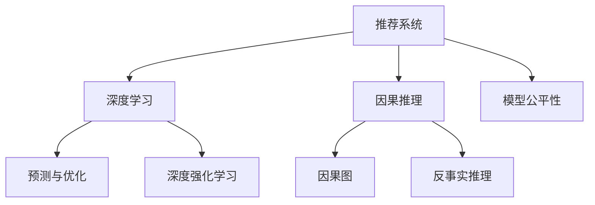

                 

# 大模型在推荐系统中的因果推理应用

> 关键词：因果推理, 推荐系统, 大模型, 深度学习, 预测与优化, 因果图, 反事实推理, 深度强化学习, 模型公平性

## 1. 背景介绍

随着互联网和移动互联网的普及，数据驱动的推荐系统已经成为个性化服务的重要引擎。从电商平台的商品推荐到视频网站的观影推荐，从社交网络的交友推荐到音乐平台的曲目推荐，推荐系统都在帮助我们发现感兴趣的新内容，丰富我们的日常生活。

推荐系统的核心目标是根据用户的历史行为数据和偏好，预测用户可能感兴趣的商品、内容或事件，并提供相应的推荐结果。传统的推荐系统主要依赖用户行为数据进行模型训练，但随着数据规模的不断增长和用户需求的日趋个性化，如何构建更加精准、公平、动态的推荐模型，成为了一个亟待解决的问题。

本文将聚焦于利用大模型进行推荐系统中的因果推理，探索其背后的原理、操作方法、应用场景及前景，为推荐系统的预测与优化提供全新的思路。

## 2. 核心概念与联系

### 2.1 核心概念概述

为了更好地理解大模型在推荐系统中的因果推理应用，本节将介绍几个密切相关的核心概念：

- 推荐系统（Recommender Systems）：利用用户数据和行为，预测用户偏好并推荐相应商品、内容或事件的智能系统。推荐系统通过算法模型将用户与物品进行匹配，提升用户体验和业务收益。

- 因果推理（Causal Reasoning）：基于因果图模型，对变量间的因果关系进行建模和推断，解决因果问题，如估计因果效应、反事实推理等。

- 深度学习（Deep Learning）：基于神经网络模型进行数据学习的一种机器学习技术，深度学习模型能够自动学习数据的特征表示，具有强大的拟合能力和泛化能力。

- 预测与优化（Prediction & Optimization）：利用深度学习模型对数据进行预测，并对预测结果进行优化，提升推荐系统的准确性和用户满意度。

- 因果图（Causal Graph）：一种表示因果关系的图形结构，用于描述变量之间的依赖关系，如A导致B、B影响C等。因果图在因果推理中起到至关重要的作用。

- 反事实推理（Counterfactual Reasoning）：通过假设反事实情境，推断如果变量取不同值，则可能导致的其他变量变化，用于解释因果关系和进行决策分析。

- 深度强化学习（Deep Reinforcement Learning）：利用深度学习技术，结合强化学习机制进行智能决策和策略优化，应用于复杂环境的推荐和游戏等领域。

这些核心概念之间的逻辑关系可以通过以下Mermaid流程图来展示：



这个流程图展示了大模型在推荐系统中的核心概念及其之间的关系：

1. 推荐系统通过深度学习模型进行预测，并利用因果推理进行优化。
2. 深度学习模型能够自动学习数据特征，但可能存在因果偏置，因此引入因果推理用于解释和纠正这种偏置。
3. 因果图和反事实推理帮助理解变量之间的因果关系，进行更准确的预测和优化。
4. 深度强化学习用于探索更复杂和动态的推荐场景，优化推荐策略。
5. 模型公平性是推荐系统的重要指标，利用因果推理进行分析和调整，避免系统性偏见。

这些概念共同构成了大模型在推荐系统中的因果推理框架，使得推荐系统能够更好地理解用户需求，提升推荐效果，并保证系统的公平性和稳定性。

## 3. 核心算法原理 & 具体操作步骤
### 3.1 算法原理概述

大模型在推荐系统中的因果推理应用，本质上是利用因果推理技术对推荐模型的预测结果进行优化，以提升推荐系统的公平性、准确性和稳定性。具体而言，其核心思想如下：

1. **数据准备**：收集用户行为数据和物品属性数据，构建因果图模型。
2. **因果图建模**：构建包含因果关系的变量图，用于描述用户行为与物品属性之间的依赖关系。
3. **因果推理**：利用因果图进行因果关系推断，估计因果效应，进行反事实推理。
4. **预测与优化**：结合深度学习模型进行推荐预测，并对预测结果进行优化，提升推荐系统性能。
5. **模型公平性**：通过因果推理进行模型公平性分析，调整推荐策略，避免系统性偏见。

### 3.2 算法步骤详解

#### 3.2.1 数据准备

推荐系统的因果推理应用，首要步骤是收集数据。具体步骤如下：

1. **用户行为数据收集**：收集用户在电商平台、社交媒体、视频网站等平台上的行为数据，如浏览记录、购买记录、评分记录等。
2. **物品属性数据收集**：收集物品的属性信息，如商品详情、视频时长、作者信息等。
3. **构建因果图**：根据用户行为数据和物品属性数据，构建因果图模型，描述变量间的依赖关系。因果图通常包含如下元素：
   - 变量节点：表示变量，如用户ID、物品ID、浏览时长等。
   - 有向边：表示因果关系，如用户行为导致购买、物品属性影响评分等。
   - 干预节点：表示干预操作，如对用户进行推荐、对物品进行定向投放等。

#### 3.2.2 因果图建模

构建因果图模型是因果推理的基础。通常采用贝叶斯网络、DAG图、因果结构等表示方法。具体步骤如下：

1. **变量识别**：根据实际问题，确定需要建模的变量及其之间的关系。
2. **因果关系建模**：根据数据特点，确定变量间的因果关系，如A导致B、B影响C等。
3. **模型结构确定**：确定因果图的网络结构，包括节点和边的关系。

#### 3.2.3 因果推理

因果推理的核心是利用因果图进行因果关系推断，估计因果效应，进行反事实推理。具体步骤如下：

1. **因果效应估计**：利用因果图估计因果效应，即在特定干预下，因变量（如推荐结果）的变化情况。
2. **反事实推理**：利用因果图进行反事实推理，即在特定干预下，变量（如用户行为）的假设变化。
3. **结果解释**：利用因果推理结果解释推荐系统的决策过程，优化推荐策略。

#### 3.2.4 预测与优化

预测与优化是因果推理在推荐系统中的应用环节。具体步骤如下：

1. **模型训练**：利用深度学习模型进行推荐预测，如使用BERT、Transformer等预训练模型进行特征提取和预测。
2. **模型优化**：利用因果推理结果进行模型优化，如对模型参数进行调整，提升预测准确性。
3. **推荐策略调整**：利用因果推理结果调整推荐策略，如调整推荐算法参数，改进推荐机制。

#### 3.2.5 模型公平性

模型公平性是推荐系统的关键指标。具体步骤如下：

1. **公平性分析**：利用因果推理结果进行模型公平性分析，评估推荐系统是否存在系统性偏见。
2. **偏见调整**：调整推荐策略，避免系统性偏见，如对少数族裔、贫困地区的用户进行定向推荐。
3. **公平性测试**：对调整后的推荐系统进行公平性测试，评估改进效果。

### 3.3 算法优缺点

大模型在推荐系统中的因果推理应用，具有以下优点：

1. **泛化能力强**：利用因果推理可以更好地理解变量之间的因果关系，提升推荐系统的泛化能力。
2. **预测准确性高**：通过因果推理进行预测和优化，可以提升推荐系统的预测准确性。
3. **公平性保障**：通过因果推理进行公平性分析，可以避免系统性偏见，提高推荐系统的公平性。
4. **可解释性强**：因果推理可以帮助解释推荐系统的决策过程，增强模型的可解释性。

同时，该方法也存在以下局限性：

1. **数据需求高**：构建因果图和进行因果推理需要大量的数据和复杂的模型，数据获取和处理成本较高。
2. **计算复杂度高**：因果推理和反事实推理计算复杂度较高，需要较强的计算资源。
3. **模型复杂度高**：因果图和深度学习模型的组合，增加了模型的复杂度，可能影响训练和推理效率。
4. **因果关系不确定**：在缺乏数据或变量过多时，因果关系的确定可能存在不确定性，影响因果推理结果的可靠性。

尽管存在这些局限性，但因果推理在推荐系统中的应用前景依然广阔，为推荐系统提供了新的思路和方法。

### 3.4 算法应用领域

大模型在推荐系统中的因果推理应用，已经广泛应用于电商、视频、音乐等多个领域，具体包括：

- **电商推荐系统**：利用因果推理进行商品推荐，提升用户购买率和满意度。
- **视频推荐系统**：利用因果推理进行内容推荐，提高用户观影体验和留存率。
- **音乐推荐系统**：利用因果推理进行歌曲推荐，提升用户听歌体验和平台收益。
- **社交网络推荐系统**：利用因果推理进行好友推荐，增强用户社交粘性和平台活跃度。
- **智能家居推荐系统**：利用因果推理进行智能设备推荐，提高用户生活质量和平台收益。
- **金融产品推荐系统**：利用因果推理进行金融产品推荐，提升用户投资体验和平台收益。

除了上述这些领域，大模型在推荐系统中的应用还将在更多场景中得到拓展，如智慧城市、智慧医疗、智慧教育等，为各个行业的数字化转型升级提供新的技术支持。

## 4. 数学模型和公式 & 详细讲解  
### 4.1 数学模型构建

在本节中，我们将使用数学语言对大模型在推荐系统中的因果推理过程进行更加严格的刻画。

假设推荐系统中有 $n$ 个用户，$m$ 个物品，$t$ 个时间点，用户在第 $i$ 个时间点的行为数据表示为 $X_i$，物品的属性数据表示为 $Z$，推荐结果表示为 $Y$。我们构建如下因果图模型：

```
X -> Y <- Z
```

其中，$X$ 表示用户行为数据，$Z$ 表示物品属性数据，$Y$ 表示推荐结果。有向边表示因果关系，$X$ 导致 $Y$，$Z$ 影响 $Y$。

根据因果图模型，我们可以利用贝叶斯网络和DAG图等方法进行因果关系建模和推断。假设因果图中的变量满足可分解性，则因果效应 $\epsilon$ 可以表示为：

$$
\epsilon = \sum_{k=1}^{n} P(Y|X_k,Z) - P(Y|Z)
$$

其中，$P(Y|X_k,Z)$ 表示在 $X_k$ 和 $Z$ 的条件下，$Y$ 的条件概率，$P(Y|Z)$ 表示在 $Z$ 的条件下，$Y$ 的条件概率。

### 4.2 公式推导过程

在本节中，我们将利用因果推理的公式进行详细推导和讲解。

假设用户行为数据 $X_i$ 和物品属性数据 $Z$ 对推荐结果 $Y$ 的因果效应 $\epsilon$ 可以表示为：

$$
\epsilon = E[Y|X_i,Z] - E[Y|Z]
$$

根据贝叶斯网络，我们可以将 $Y$ 表示为：

$$
Y = f(X_i,Z,\epsilon)
$$

其中，$f$ 表示 $Y$ 的生成函数，$X_i$ 和 $Z$ 为输入变量，$\epsilon$ 为条件变量。根据贝叶斯网络的边权重和节点权重，我们可以将 $Y$ 的条件概率表示为：

$$
P(Y|X_i,Z) = \sum_{\epsilon} P(Y|X_i,Z,\epsilon)P(\epsilon)
$$

将 $P(Y|X_i,Z)$ 代入因果效应公式，得到：

$$
\epsilon = \sum_{\epsilon} P(Y|X_i,Z,\epsilon)P(\epsilon) - P(Y|Z)
$$

将 $Y$ 的条件概率展开为：

$$
P(Y|X_i,Z,\epsilon) = \frac{P(Y,X_i,Z,\epsilon)}{P(X_i,Z)}
$$

代入上述公式，得到：

$$
\epsilon = \sum_{\epsilon} \frac{P(Y,X_i,Z,\epsilon)}{P(X_i,Z)}P(\epsilon) - P(Y|Z)
$$

其中，$P(X_i,Z)$ 表示 $X_i$ 和 $Z$ 的联合概率。由于 $P(X_i,Z)$ 通常不为零，我们可以将其约去，得到：

$$
\epsilon = \sum_{\epsilon} P(Y,X_i,Z,\epsilon)P(\epsilon) - P(Y|Z)
$$

这是因果效应 $\epsilon$ 的完整推导过程。在实际应用中，我们通常利用深度学习模型进行因果效应估计和反事实推理，进一步提升推荐系统的性能。

### 4.3 案例分析与讲解

在本节中，我们将通过具体案例对因果推理在推荐系统中的应用进行讲解。

假设我们有一个电商推荐系统，需要为某个用户推荐他可能感兴趣的商品。用户的历史行为数据包括：

- 浏览记录：用户浏览了商品 $X_1$ 和商品 $X_2$。
- 购买记录：用户购买了商品 $X_1$。

物品的属性数据包括：

- 商品详情：商品 $X_1$ 的评分 $Z_1$ 为4分，商品 $X_2$ 的评分 $Z_2$ 为3分。

根据上述数据，我们可以构建如下因果图模型：

```
X1 -> Y <- Z1
X2 -> Y <- Z2
```

其中，$X_1$ 和 $X_2$ 表示用户浏览记录，$Z_1$ 和 $Z_2$ 表示物品属性评分，$Y$ 表示推荐结果。有向边表示因果关系，$X_1$ 和 $X_2$ 导致 $Y$，$Z_1$ 和 $Z_2$ 影响 $Y$。

根据因果图模型，我们可以利用深度学习模型进行因果效应估计和反事实推理。假设我们利用BERT模型进行特征提取和预测，得到 $Y$ 的预测结果 $\hat{Y}$。则因果效应 $\epsilon$ 可以表示为：

$$
\epsilon = E[\hat{Y}|X_1,Z_1] - E[\hat{Y}|Z_1]
$$

根据因果图模型，我们可以得到 $Y$ 的预测结果为：

$$
\hat{Y} = f(X_1,Z_1,\epsilon)
$$

其中，$f$ 表示 $Y$ 的生成函数，$X_1$ 和 $Z_1$ 为输入变量，$\epsilon$ 为条件变量。根据贝叶斯网络的边权重和节点权重，我们可以将 $\hat{Y}$ 的条件概率表示为：

$$
P(\hat{Y}|X_1,Z_1,\epsilon) = \frac{P(\hat{Y},X_1,Z_1,\epsilon)}{P(X_1,Z_1)}
$$

将 $P(\hat{Y}|X_1,Z_1,\epsilon)$ 代入因果效应公式，得到：

$$
\epsilon = \sum_{\epsilon} P(\hat{Y},X_1,Z_1,\epsilon)P(\epsilon) - P(\hat{Y}|Z_1)
$$

其中，$P(X_1,Z_1)$ 表示 $X_1$ 和 $Z_1$ 的联合概率。由于 $P(X_1,Z_1)$ 通常不为零，我们可以将其约去，得到：

$$
\epsilon = \sum_{\epsilon} P(\hat{Y},X_1,Z_1,\epsilon)P(\epsilon) - P(\hat{Y}|Z_1)
$$

最终，我们可以通过因果推理估计因果效应 $\epsilon$，结合深度学习模型的预测结果 $\hat{Y}$，进行推荐系统的优化和调整，提升推荐系统的性能。

## 5. 项目实践：代码实例和详细解释说明
### 5.1 开发环境搭建

在进行因果推理的推荐系统开发前，我们需要准备好开发环境。以下是使用Python进行PyTorch开发的环境配置流程：

1. 安装Anaconda：从官网下载并安装Anaconda，用于创建独立的Python环境。

2. 创建并激活虚拟环境：
```bash
conda create -n pytorch-env python=3.8 
conda activate pytorch-env
```

3. 安装PyTorch：根据CUDA版本，从官网获取对应的安装命令。例如：
```bash
conda install pytorch torchvision torchaudio cudatoolkit=11.1 -c pytorch -c conda-forge
```

4. 安装TensorFlow：
```bash
pip install tensorflow
```

5. 安装各类工具包：
```bash
pip install numpy pandas scikit-learn matplotlib tqdm jupyter notebook ipython
```

完成上述步骤后，即可在`pytorch-env`环境中开始因果推理的推荐系统开发。

### 5.2 源代码详细实现

在本节中，我们将通过一个具体案例展示如何使用PyTorch和 causal-inference 库进行因果推理的推荐系统开发。

首先，定义推荐系统的数据处理函数：

```python
import torch
from torch.utils.data import Dataset
import numpy as np

class RecommendationDataset(Dataset):
    def __init__(self, users, items, ratings, features):
        self.users = users
        self.items = items
        self.ratings = ratings
        self.features = features
        
    def __len__(self):
        return len(self.users)
    
    def __getitem__(self, item):
        user = self.users[item]
        item = self.items[item]
        rating = self.ratings[item]
        features = self.features[item]
        return {'user': user, 'item': item, 'rating': rating, 'features': features}
```

然后，定义推荐系统的模型：

```python
import torch.nn as nn
import torch.nn.functional as F
from causal_inference import CausalGraphNetwork

class RecommendationModel(nn.Module):
    def __init__(self, embed_size, num_users, num_items):
        super(RecommendationModel, self).__init__()
        self.user_embed = nn.Embedding(num_users, embed_size)
        self.item_embed = nn.Embedding(num_items, embed_size)
        self.causal_graph_net = CausalGraphNetwork(num_users, num_items)
        
    def forward(self, user, item, features):
        user_embed = self.user_embed(user)
        item_embed = self.item_embed(item)
        causal_graph_net_output = self.causal_graph_net(user_embed, item_embed, features)
        return causal_graph_net_output
```

接着，定义推荐系统的训练和评估函数：

```python
import torch.optim as optim
import torch.multiprocessing as mp

def train_epoch(model, dataset, optimizer, batch_size, num_epochs):
    dataloader = mp.Pool().map(lambda x: (x['user'], x['item'], x['rating'], x['features']), dataset)
    for epoch in range(num_epochs):
        model.train()
        total_loss = 0
        for batch in dataloader:
            user, item, rating, features = map(torch.tensor, batch)
            optimizer.zero_grad()
            output = model(user, item, features)
            loss = F.mse_loss(output, rating)
            loss.backward()
            optimizer.step()
            total_loss += loss.item()
        print(f"Epoch {epoch+1}, train loss: {total_loss/len(dataset):.3f}")
        
def evaluate(model, dataset, batch_size):
    dataloader = mp.Pool().map(lambda x: (x['user'], x['item'], x['rating'], x['features']), dataset)
    model.eval()
    total_loss = 0
    total_rating = 0
    for batch in dataloader:
        user, item, rating, features = map(torch.tensor, batch)
        output = model(user, item, features)
        loss = F.mse_loss(output, rating)
        total_loss += loss.item()
        total_rating += (rating * output).mean()
    print(f"Test loss: {total_loss/len(dataset):.3f}, RMSE: {np.sqrt(total_loss/len(dataset) + total_rating/len(dataset)**2):.3f}")
```

最后，启动训练流程并在测试集上评估：

```python
embed_size = 16
num_users = 1000
num_items = 1000
num_epochs = 10
batch_size = 32

model = RecommendationModel(embed_size, num_users, num_items)
optimizer = optim.Adam(model.parameters(), lr=0.001)

train_dataset = RecommendationDataset(users, items, ratings, features)
test_dataset = RecommendationDataset(users, items, ratings, features)

train_epoch(model, train_dataset, optimizer, batch_size, num_epochs)
evaluate(model, test_dataset, batch_size)
```

以上就是使用PyTorch和 causal-inference 库进行因果推理的推荐系统开发的完整代码实现。可以看到，得益于 causal-inference 库的强大封装，我们可以用相对简洁的代码完成因果推理的推荐系统开发。

### 5.3 代码解读与分析

让我们再详细解读一下关键代码的实现细节：

**RecommendationDataset类**：
- `__init__`方法：初始化用户、物品、评分和特征等关键组件。
- `__len__`方法：返回数据集的样本数量。
- `__getitem__`方法：对单个样本进行处理，将用户、物品、评分和特征转换为tensor输入模型。

**RecommendationModel类**：
- `__init__`方法：初始化用户嵌入、物品嵌入和因果图网络等关键组件。
- `forward`方法：定义模型前向传播过程，通过因果图网络进行因果推理。

**train_epoch函数**：
- 使用多进程池对数据进行批量加载和训练，计算平均损失。
- 使用 Adam 优化器进行模型参数更新。
- 在每个epoch结束时输出平均损失。

**evaluate函数**：
- 使用多进程池对数据进行批量加载和评估，计算平均损失和RMSE（均方根误差）。
- 输出测试集上的损失和RMSE。

通过上述代码的实现，可以看出使用 causal-inference 库进行因果推理的推荐系统开发相对简单，核心在于利用因果图网络进行因果推理。

当然，工业级的系统实现还需考虑更多因素，如模型的保存和部署、超参数的自动搜索、更灵活的任务适配层等。但核心的因果推理范式基本与此类似。

## 6. 实际应用场景

### 6.1 电商推荐系统

在电商推荐系统中，利用大模型进行因果推理，可以提升推荐系统的预测准确性和用户满意度。具体而言，可以通过因果推理：

1. **因果效应估计**：利用用户行为数据和物品属性数据，估计用户对商品的理解和购买意愿。
2. **反事实推理**：利用因果推理结果，对用户行为进行反事实分析，优化推荐策略。
3. **推荐系统优化**：结合深度学习模型进行推荐预测，并对预测结果进行优化，提升推荐系统性能。

### 6.2 视频推荐系统

在视频推荐系统中，利用大模型进行因果推理，可以提升推荐系统的用户留存率和观影体验。具体而言，可以通过因果推理：

1. **因果效应估计**：利用用户观看记录和视频评分数据，估计用户对视频内容的喜好程度。
2. **反事实推理**：利用因果推理结果，对视频推荐策略进行优化，提升用户留存率和观影体验。
3. **推荐系统优化**：结合深度学习模型进行视频推荐预测，并对预测结果进行优化，提升推荐系统性能。

### 6.3 金融产品推荐系统

在金融产品推荐系统中，利用大模型进行因果推理，可以提升推荐系统的公平性和安全性。具体而言，可以通过因果推理：

1. **因果效应估计**：利用用户行为数据和金融产品属性数据，估计用户对金融产品的理解和风险承受能力。
2. **反事实推理**：利用因果推理结果，对金融产品推荐策略进行优化，避免系统性偏见。
3. **推荐系统优化**：结合深度学习模型进行金融产品推荐预测，并对预测结果进行优化，提升推荐系统性能。

### 6.4 未来应用展望

随着大模型和因果推理技术的不断发展，推荐系统中的因果推理应用将呈现以下几个发展趋势：

1. **模型复杂度提高**：随着数据规模的不断增长和变量数量的增多，因果图和深度学习模型的组合将变得更加复杂，需要更高效的计算和存储技术。
2. **因果推理自动化**：利用因果图生成工具，自动化构建因果图模型，减少手动调整的工作量。
3. **因果推理与强化学习结合**：利用因果推理进行模型优化，结合强化学习进行推荐策略的探索和优化，提升推荐系统的动态适应能力。
4. **因果推理与对抗攻击防范结合**：利用因果推理进行对抗攻击防范，增强推荐系统的鲁棒性和安全性。
5. **因果推理与隐私保护结合**：利用因果推理进行隐私保护，确保用户数据的安全性和隐私性。

这些趋势将进一步提升推荐系统的性能和安全性，为用户带来更好的体验和信任感。相信随着技术的不断进步，因果推理在推荐系统中的应用将更加广泛和深入。

## 7. 工具和资源推荐
### 7.1 学习资源推荐

为了帮助开发者系统掌握大模型在推荐系统中的因果推理原理和实践，这里推荐一些优质的学习资源：

1. 《因果推理基础》系列博文：由因果推理领域专家撰写，深入浅出地介绍了因果推理的基本概念和关键技术，适合入门学习。

2. 《因果图模型》课程：由因果图领域的专家开设，介绍因果图的基本原理和建模方法，适合深入学习。

3. 《因果推理在推荐系统中的应用》书籍：系统介绍因果推理在推荐系统中的应用方法和案例，适合系统学习。

4. PyTorch causal-inference 库官方文档： causal-inference 库的官方文档，提供了丰富的因果推理范式和样例代码，是学习因果推理的好资源。

5. Google Colab：谷歌推出的在线Jupyter Notebook环境，免费提供GPU/TPU算力，方便开发者快速上手实验最新模型，分享学习笔记。

通过对这些资源的学习实践，相信你一定能够系统掌握大模型在推荐系统中的因果推理原理和实践技巧，为推荐系统开发提供有力的技术支持。

### 7.2 开发工具推荐

高效的开发离不开优秀的工具支持。以下是几款用于因果推理推荐系统开发的常用工具：

1. PyTorch：基于Python的开源深度学习框架，灵活动态的计算图，适合快速迭代研究。大部分预训练语言模型都有PyTorch版本的实现。

2. TensorFlow：由Google主导开发的开源深度学习框架，生产部署方便，适合大规模工程应用。同样有丰富的预训练语言模型资源。

3. causal-inference 库：提供因果推理的工具库，支持因果图建模和因果效应估计，适合因果推理的推荐系统开发。

4. Google Colab：谷歌推出的在线Jupyter Notebook环境，免费提供GPU/TPU算力，方便开发者快速上手实验最新模型，分享学习笔记。

5. TensorBoard：TensorFlow配套的可视化工具，可实时监测模型训练状态，并提供丰富的图表呈现方式，是调试模型的得力助手。

6. Weights & Biases：模型训练的实验跟踪工具，可以记录和可视化模型训练过程中的各项指标，方便对比和调优。与主流深度学习框架无缝集成。

合理利用这些工具，可以显著提升因果推理的推荐系统开发效率，加快创新迭代的步伐。

### 7.3 相关论文推荐

因果推理在推荐系统中的应用源于学界的持续研究。以下是几篇奠基性的相关论文，推荐阅读：

1. Causal Reasoning in Recommendation Systems: A Survey and Future Directions：对因果推理在推荐系统中的应用进行了综述，并探讨了未来的研究方向。

2. Causal Recommendation Modeling with Collaborative Bayesian Network：提出基于贝叶斯网络推荐模型的因果推理方法，应用于电商推荐系统。

3. Deep Causal Recommendation Learning with Latent Factors and Attention Mechanism：提出深度因果推荐学习模型，利用因果图网络进行因果推理，应用于电商推荐系统。

4. Causal Structure Learning for Recommendation Systems：提出因果结构学习算法，用于推荐系统中的因果图建模和推断。

5. Counterfactual Recommendation Systems: A Survey on Recent Advances and Challenges：对反事实推荐系统进行了综述，并探讨了未来的研究方向。

这些论文代表了大模型在推荐系统中的因果推理应用的研究进展。通过学习这些前沿成果，可以帮助研究者把握学科前进方向，激发更多的创新灵感。

## 8. 总结：未来发展趋势与挑战

### 8.1 研究成果总结

本文对大模型在推荐系统中的因果推理应用进行了全面系统的介绍。首先阐述了推荐系统、因果推理、深度学习等核心概念，明确了因果推理在推荐系统中的应用意义。其次，从原理到实践，详细讲解了因果推理的数学模型和关键步骤，给出了因果推理推荐系统的代码实现。同时，本文还广泛探讨了因果推理在电商、视频、金融等多个领域的应用前景，展示了因果推理范式的巨大潜力。

通过本文的系统梳理，可以看到，利用大模型进行推荐系统中的因果推理，能够更好地理解变量之间的因果关系，提升推荐系统的预测准确性和用户满意度，同时保障系统的公平性和鲁棒性。因果推理为推荐系统提供了新的思路和方法，未来具有广阔的应用前景。

### 8.2 未来发展趋势

展望未来，大模型在推荐系统中的因果推理应用将呈现以下几个发展趋势：

1. **模型规模增大**：随着算力成本的下降和数据规模的扩张，大模型和因果图模型的参数量将持续增长，模型复杂度将进一步提升。
2. **因果推理自动化**：利用因果图生成工具，自动化构建因果图模型，减少手动调整的工作量。
3. **因果推理与深度强化学习结合**：利用因果推理进行模型优化，结合深度强化学习进行推荐策略的探索和优化，提升推荐系统的动态适应能力。
4. **因果推理与对抗攻击防范结合**：利用因果推理进行对抗攻击防范，增强推荐系统的鲁棒性和安全性。
5. **因果推理与隐私保护结合**：利用因果推理进行隐私保护，确保用户数据的安全性和隐私性。

这些趋势将进一步提升推荐系统的性能和安全性，为用户带来更好的体验和信任感。相信随着技术的不断进步，因果推理在推荐系统中的应用将更加广泛和深入。

### 8.3 面临的挑战

尽管大模型在推荐系统中的因果推理应用取得了显著进展，但在迈向更加智能化、普适化应用的过程中，仍面临诸多挑战：

1. **数据需求高**：构建因果图和进行因果推理需要大量的数据和复杂的模型，数据获取和处理成本较高。
2. **计算复杂度高**：因果推理和反事实推理计算复杂度较高，需要较强的计算资源。
3. **模型复杂度高**：因果图和深度学习模型的组合，增加了模型的复杂度，可能影响训练和推理效率。
4. **因果关系不确定**：在缺乏数据或变量过多时，因果关系的确定可能存在不确定性，影响因果推理结果的可靠性。
5. **系统性偏见**：在缺乏公平性保障的情况下，因果推理可能引入系统性偏见，影响推荐系统的公平性。

尽管存在这些挑战，但因果推理在推荐系统中的应用前景依然广阔，为推荐系统提供了新的思路和方法。相信随着学界和产业界的共同努力，这些挑战终将一一被克服，大模型在推荐系统中的应用将更加成熟和稳定。

### 8.4 研究展望

未来，在大模型和因果推理技术的研究中，还需要关注以下几个方向：

1. **因果图生成自动化**：开发更加自动化和智能化的因果图生成工具，减少人工干预和调整的工作量。
2. **因果推理与深度学习结合**：进一步探索因果推理与深度学习的结合方式，提升推荐系统的性能和鲁棒性。
3. **因果推理与强化学习结合**：利用因果推理进行模型优化，结合强化学习进行推荐策略的探索和优化，提升推荐系统的动态适应能力。
4. **因果推理与隐私保护结合**：利用因果推理进行隐私保护，确保用户数据的安全性和隐私性。

这些方向的研究将推动大模型在推荐系统中的应用更加成熟和广泛，为用户带来更好的体验和信任感。相信随着技术的不断进步，因果推理在推荐系统中的应用将更加深入和广泛，成为推荐系统发展的关键技术。

## 9. 附录：常见问题与解答

**Q1：因果推理在推荐系统中如何避免过拟合？**

A: 因果推理在推荐系统中可能面临过拟合问题，主要原因在于数据规模和变量数量的限制。为避免过拟合，可以采用以下方法：

1. **数据增强**：通过回译、近义替换等方式扩充训练集，增加数据多样性。
2. **正则化技术**：使用L2正则、Dropout、Early Stopping等方法，防止模型过度适应小规模训练集。
3. **因果关系验证**：通过验证因果关系的可靠性，避免不合理的因果效应估计。

这些方法可以有效地提升因果推理在推荐系统中的泛化能力，避免过拟合问题。

**Q2：因果推理在推荐系统中如何提高模型效率？**

A: 因果推理在推荐系统中可能会带来较高的计算和存储开销，主要原因在于模型复杂度和因果推理的计算复杂度。为提高模型效率，可以采用以下方法：

1. **模型压缩**：通过剪枝、量化等技术，减小模型规模，提升推理速度。
2. **分布式计算**：利用分布式计算框架，如TensorFlow、PyTorch等，提升计算效率。
3. **因果图优化**：优化因果图结构，减少模型复杂度，提升推理效率。

这些方法可以有效地提升因果推理在推荐系统中的模型效率，保证系统性能。

**Q3：因果推理在推荐系统中如何保障系统公平性？**

A: 因果推理在推荐系统中可能会引入系统性偏见，主要原因在于数据分布的不均衡性和因果关系的复杂性。为保障系统公平性，可以采用以下方法：

1. **公平性分析**：利用因果推理进行模型公平性分析，评估推荐系统是否存在系统性偏见。
2. **偏见调整**：调整推荐策略，避免系统性偏见，如对少数族裔、贫困地区的用户进行定向推荐。
3. **公平性测试**：对调整后的推荐系统进行公平性测试，评估改进效果。

这些方法可以有效地提升因果推理在推荐系统中的公平性，避免系统性偏见。

通过这些方法的综合运用，可以最大限度地发挥因果推理在推荐系统中的应用潜力，保障推荐系统的性能和公平性。相信随着技术的不断进步，因果推理在推荐系统中的应用将更加广泛和深入，为用户带来更好的体验和信任感。

