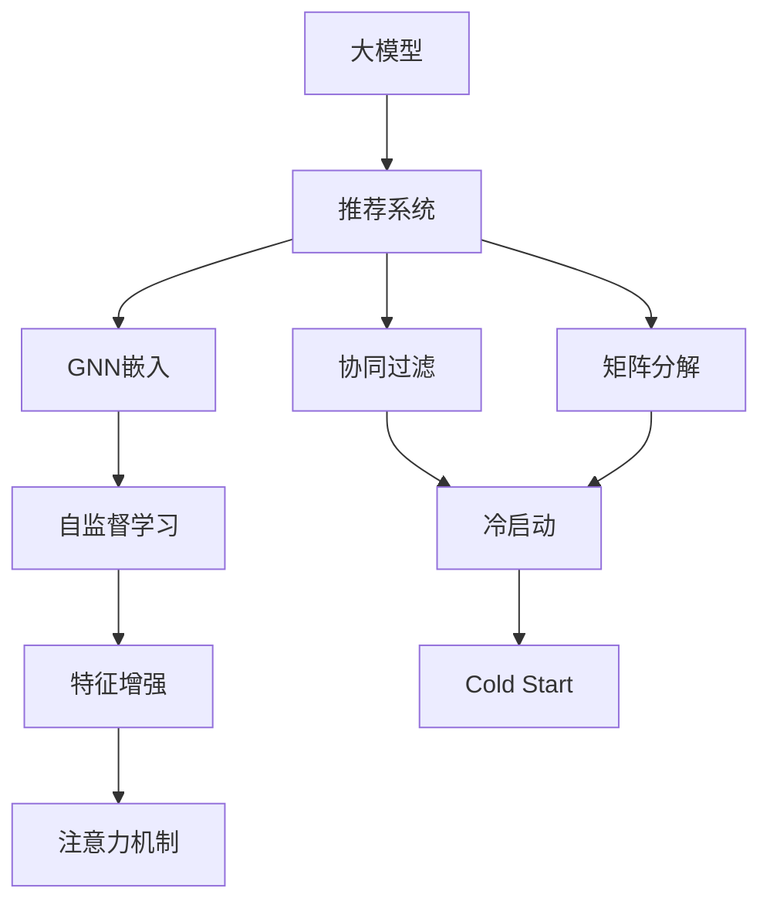

                 

# 大模型在推荐系统中的图神经网络应用

> 关键词：大模型,推荐系统,图神经网络(GNN),自监督学习,特征增强,注意力机制,冷启动问题

## 1. 背景介绍

### 1.1 问题由来
推荐系统作为互联网时代的核心应用之一，其核心目标是通过分析用户的历史行为和偏好，精准预测用户对新物品的兴趣，从而提供个性化推荐。传统的推荐系统主要依赖于用户-物品互动记录，使用协同过滤、矩阵分解等方法建模用户隐性偏好。但这些方法存在用户行为冷启动、数据稀疏、计算复杂度高等问题，难以适应大规模应用。

近年来，深度学习大模型（如BERT、GPT等）在自然语言处理(NLP)领域取得了突破性进展，其大规模预训练能力和强大的特征提取能力，为推荐系统注入了新的活力。如何在大模型中引入推荐系统的关键算法，特别是图神经网络(GNN)，利用其图结构特征提取能力，成为当前推荐系统领域的研究热点。

### 1.2 问题核心关键点
在推荐系统中引入大模型，利用GNN进行特征增强和关系建模，关键在于如何构建用户-物品关系图，如何在大模型中进行有效的图嵌入，以及如何在大模型中引入自监督学习等前沿技术。这些技术不仅能提升模型的特征提取和表达能力，还能有效应对数据稀疏和冷启动问题，降低推荐系统的计算复杂度。

## 2. 核心概念与联系

### 2.1 核心概念概述

为更好地理解大模型在推荐系统中的应用，本节将介绍几个密切相关的核心概念：

- 大模型(Large Model)：以BERT、GPT等为代表的大规模深度学习模型。通过在海量文本数据上预训练，学习到丰富的语言知识，具备强大的特征提取和生成能力。

- 推荐系统(Recommendation System)：通过用户行为数据，预测用户对新物品的兴趣，提供个性化推荐。经典方法包括协同过滤、矩阵分解等，但存在冷启动、数据稀疏等问题。

- 图神经网络(Graph Neural Network, GNN)：一种专门用于处理图结构数据的深度学习模型，能够学习图结构中的隐含关系，用于关系增强和特征融合。

- 自监督学习(Self-supervised Learning)：一种利用无标签数据训练模型的学习方法，通过构造自监督任务来提升模型的泛化能力。

- 特征增强(Feature Enrichment)：在预训练模型的基础上，引入更多有用的特征，如用户行为图、物品关系图等，提升模型的表达能力。

- 注意力机制(Attention Mechanism)：一种在大模型中增强特征权重选择和关系建模的能力，有助于聚焦关键特征和关系，提升推荐效果。

- 冷启动问题(Cold Start)：新用户或物品刚进入推荐系统时，由于缺乏足够的历史数据，难以获得准确的推荐结果。

这些核心概念之间的逻辑关系可以通过以下Mermaid流程图来展示：



这个流程图展示了大模型在推荐系统中的应用框架：

1. 大模型通过预训练获得基础能力。
2. 在推荐系统中，用户-物品关系图作为外部输入，与大模型结合进行GNN嵌入。
3. 利用自监督学习在大模型中进行无监督特征学习。
4. 通过特征增强和注意力机制，提升大模型的关系建模能力。
5. 在大模型中进行冷启动预测。

这些概念共同构成了大模型在推荐系统中的应用框架，使其能够利用GNN进行高效的关系建模和特征增强，提升推荐系统的性能。

## 3. 核心算法原理 & 具体操作步骤
### 3.1 算法原理概述

大模型在推荐系统中的应用，主要基于以下核心算法原理：

- **GNN嵌入**：将用户-物品关系图输入大模型，通过GNN模型进行关系增强和特征融合，学习用户和物品的隐含表示。
- **自监督学习**：在大模型中使用无标签数据，通过构造自监督任务，提升模型的泛化能力和特征表达能力。
- **特征增强**：在GNN嵌入的基础上，引入更多有用的特征，如用户行为图、物品关系图等，提升模型的表达能力。
- **注意力机制**：在大模型中引入注意力机制，增强特征权重选择和关系建模的能力，提升推荐效果。
- **冷启动预测**：利用大模型的预训练能力和GNN嵌入，对新用户和物品进行有效的冷启动预测，解决数据稀疏问题。

### 3.2 算法步骤详解

大模型在推荐系统中进行图嵌入的具体步骤如下：

**Step 1: 准备数据**
- 收集用户行为数据，构建用户-物品关系图。每个用户和物品可以看作图中的节点，行为交互记录作为边。
- 将图结构数据转换为适合大模型的输入格式，如邻接矩阵、图卷积网络(GCN)等。

**Step 2: 选择预训练模型**
- 选择合适的大模型作为初始化参数，如BERT、GPT等。
- 使用自监督学习任务在预训练数据上进行预训练，如掩码语言模型、NCE损失等。

**Step 3: 进行GNN嵌入**
- 将用户-物品关系图输入大模型，使用图神经网络进行关系增强和特征融合。
- 在大模型中定义合适的损失函数，如交叉熵、均方误差等，用于衡量模型输出与真实标签的差异。
- 进行多轮迭代训练，最小化损失函数，优化大模型的图嵌入。

**Step 4: 引入自监督学习**
- 利用用户行为数据之外的无标签数据，构造自监督学习任务。
- 在大模型中使用自监督任务进行无监督特征学习，提升模型的泛化能力和表达能力。
- 定期在验证集上评估模型性能，调整超参数，防止过拟合。

**Step 5: 特征增强与注意力机制**
- 在大模型中加入更多有用的特征，如用户行为图、物品关系图等。
- 引入注意力机制，增强特征权重选择和关系建模的能力，提升模型的表达能力和推荐效果。
- 利用正则化技术，防止模型过拟合。

**Step 6: 冷启动预测**
- 利用大模型的预训练能力和GNN嵌入，对新用户和物品进行有效的冷启动预测。
- 在预测时，利用大模型对用户和物品的图嵌入进行推理，得出推荐结果。

### 3.3 算法优缺点

利用大模型和GNN进行推荐系统的图嵌入，具有以下优点：
1. 模型效果显著。大模型的预训练能力和GNN的图嵌入能力，能显著提升推荐系统的性能。
2. 可解释性增强。大模型的结构和参数可视化，有助于理解模型的决策逻辑和特征权重选择。
3. 数据稀疏问题解决。GNN能够从图结构中提取隐含关系，对数据稀疏问题有很好的鲁棒性。
4. 实时性提升。大模型的并行计算能力，能提高推荐系统的实时性。
5. 可扩展性强。大模型的通用性和GNN的可扩展性，使其能轻松扩展到各种推荐场景。

同时，该方法也存在以下局限性：
1. 计算资源需求高。大模型的参数量和计算复杂度较高，对计算资源要求较高。
2. 模型复杂度高。大模型和GNN的复杂结构，可能导致模型难以调试和优化。
3. 冷启动效果不稳定。新用户或物品的推荐效果可能不理想，需要更多的无标签数据和优化策略。

尽管存在这些局限性，但大模型结合GNN在推荐系统中的应用，已经在大规模应用中取得了良好的效果，展现出强劲的潜力。未来相关研究的重点在于如何进一步降低计算资源需求，提高模型的可解释性和鲁棒性，以及解决冷启动问题。

### 3.4 算法应用领域

大模型结合GNN在推荐系统中的应用，已经在多个领域取得了广泛的应用，例如：

- 电子商务推荐：电商平台使用大模型结合GNN，提供商品推荐、活动推荐等服务。
- 在线教育推荐：教育平台利用大模型和GNN，为学生推荐课程、教材、视频等。
- 社交媒体推荐：社交媒体使用大模型和GNN，为用户推荐内容、好友、活动等。
- 新闻推荐：新闻平台利用大模型和GNN，为用户推荐新闻文章、视频等。
- 广告推荐：广告平台利用大模型和GNN，为用户推荐广告、广告位等。

除了上述这些经典应用外，大模型结合GNN的方法还在智能家居、智能交通、智慧城市等多个领域得到创新性应用，为智能推荐系统注入了新的活力。

## 4. 数学模型和公式 & 详细讲解  
### 4.1 数学模型构建

本节将使用数学语言对大模型在推荐系统中的应用进行更加严格的刻画。

记推荐系统中的用户-物品关系图为 $G=(V,E)$，其中 $V$ 为节点集合，$E$ 为边集合。设用户和物品的向量表示分别为 $\mathbf{u} \in \mathbb{R}^{d_u}$ 和 $\mathbf{v} \in \mathbb{R}^{d_v}$，节点之间的关系为 $R \in \mathbb{R}^{d_r}$。大模型 $M_{\theta}$ 在用户和物品的向量表示上进行预训练，得到用户嵌入 $\mathbf{u}^{\text{emb}}$ 和物品嵌入 $\mathbf{v}^{\text{emb}}$。使用图神经网络进行关系增强和特征融合，得到用户和物品的隐含表示 $\mathbf{u}^{\text{g}}$ 和 $\mathbf{v}^{\text{g}}$。

在大模型中使用自监督学习任务进行无监督特征学习，使用交叉熵损失等进行监督学习任务。具体损失函数为：

$$
\mathcal{L}(\theta) = \alpha \mathcal{L}^{\text{sup}}(\theta) + (1-\alpha) \mathcal{L}^{\text{uns}}(\theta)
$$

其中 $\mathcal{L}^{\text{sup}}$ 为监督学习任务损失，$\mathcal{L}^{\text{uns}}$ 为自监督学习任务损失，$\alpha$ 为超参数。

在大模型中引入特征增强和注意力机制，提升模型的表达能力和推荐效果。设用户和物品之间的关系特征为 $\mathbf{R} \in \mathbb{R}^{d_r}$，则最终的推荐结果为：

$$
\mathbf{R}^{\text{g}} = \text{GNN}(\mathbf{u}^{\text{g}}, \mathbf{v}^{\text{g}}, \mathbf{R})
$$

### 4.2 公式推导过程

以下我们以GNN嵌入为例，推导大模型中GNN嵌入的计算公式。

假设节点 $u$ 和 $v$ 之间的边权重为 $a_{uv}$，使用图卷积网络(GCN)进行关系增强和特征融合。GCN的公式为：

$$
\mathbf{h}^n_{u,v} = \mathbf{h}^{n-1}_u + \sum_{v \in \mathcal{N}(u)} a_{uv} \mathbf{W} (\mathbf{h}^{n-1}_v)
$$

其中 $\mathbf{h}^n_{u,v}$ 为节点 $u$ 和 $v$ 在 $n$ 层的嵌入表示，$\mathbf{W}$ 为卷积核参数矩阵。

将用户嵌入 $\mathbf{u}^{\text{emb}}$ 和物品嵌入 $\mathbf{v}^{\text{emb}}$ 代入GCN公式，得到关系增强后的用户和物品嵌入：

$$
\mathbf{u}^{\text{g}} = \text{GCN}(\mathbf{u}^{\text{emb}}, \mathbf{v}^{\text{emb}}, \mathbf{R})
$$

最终得到用户和物品的隐含表示，用于推荐结果的计算。

## 5. 项目实践：代码实例和详细解释说明
### 5.1 开发环境搭建

在进行项目实践前，我们需要准备好开发环境。以下是使用Python进行PyTorch开发的环境配置流程：

1. 安装Anaconda：从官网下载并安装Anaconda，用于创建独立的Python环境。

2. 创建并激活虚拟环境：
```bash
conda create -n pytorch-env python=3.8 
conda activate pytorch-env
```

3. 安装PyTorch：根据CUDA版本，从官网获取对应的安装命令。例如：
```bash
conda install pytorch torchvision torchaudio cudatoolkit=11.1 -c pytorch -c conda-forge
```

4. 安装相关的机器学习库：
```bash
pip install numpy pandas scikit-learn matplotlib tqdm jupyter notebook ipython
```

5. 安装PyG：用于构建图结构数据的深度学习库，与PyTorch兼容。
```bash
pip install pytorch geode pytorch_geometric
```

完成上述步骤后，即可在`pytorch-env`环境中开始项目实践。

### 5.2 源代码详细实现

这里我们以一个大模型结合GNN进行推荐系统开发的示例代码为例。

首先，定义数据加载和处理函数：

```python
import pandas as pd
import numpy as np
import torch
from torch_geometric.data import Data, DataLoader
from torch_geometric.nn import GCNConv

class Dataset:
    def __init__(self, data_path, split='train'):
        self.data_path = data_path
        self.train = pd.read_csv(f'{data_path}/train.csv')
        self.test = pd.read_csv(f'{data_path}/test.csv')
        self.train_labels = pd.read_csv(f'{data_path}/train_labels.csv')
        self.train_item_id = pd.read_csv(f'{data_path}/train_item_id.csv')
        self.test_item_id = pd.read_csv(f'{data_path}/test_item_id.csv')
        self.train_labels = self.train_labels.rename(columns={'label': 'label'})
        self.train_labels['label'] = self.train_labels['label'].astype(int)
        self.train_labels = self.train_labels.set_index('user_id')
        self.train_item_id = self.train_item_id.rename(columns={'item_id': 'item_id'})
        self.test_item_id = self.test_item_id.rename(columns={'item_id': 'item_id'})
        self.test_item_id = self.test_item_id.set_index('user_id')
        
    def __len__(self):
        return len(self.train_labels)
    
    def __getitem__(self, idx):
        user_id = self.train_labels.index[idx]
        item_ids = self.train_item_id.loc[user_id]
        adjacency_matrix = self.get_adjacency_matrix(user_id)
        label = self.train_labels.loc[user_id]
        return Data(x=user_id, edge_index=adjacency_matrix, y=label)

    def get_adjacency_matrix(self, user_id):
        adjacency_matrix = self.train[data.loc[user_id, 'interaction']]
        adjacency_matrix = adjacency_matrix.to_numpy()
        adjacency_matrix = np.hstack((np.eye(len(adjacency_matrix)), adjacency_matrix))
        return adjacency_matrix

def get_loader(dataset, batch_size, shuffle=True):
    return DataLoader(dataset, batch_size=batch_size, shuffle=shuffle)
```

然后，定义模型和优化器：

```python
import torch.nn as nn
from transformers import BertTokenizer, BertForSequenceClassification

class GCNLayer(nn.Module):
    def __init__(self, in_dim, out_dim, drop_prob=0.5):
        super(GCNLayer, self).__init__()
        self.conv = GCNConv(in_dim, out_dim)
        self.dropout = nn.Dropout(drop_prob)
    
    def forward(self, x, edge_index):
        x = self.conv(x, edge_index)
        x = self.dropout(x)
        return x

class GNNEmbedding(nn.Module):
    def __init__(self, in_dim, out_dim, num_layers=2, drop_prob=0.5):
        super(GNNEmbedding, self).__init__()
        self.num_layers = num_layers
        self.layers = nn.ModuleList([GCNLayer(in_dim, out_dim, drop_prob) for _ in range(num_layers)])
    
    def forward(self, x, edge_index):
        for i in range(self.num_layers):
            x = self.layers[i](x, edge_index)
        return x

class BERTEmbedding(nn.Module):
    def __init__(self, model_name='bert-base-uncased', output_dim=128):
        super(BERTEmbedding, self).__init__()
        self.tokenizer = BertTokenizer.from_pretrained(model_name)
        self.model = BertForSequenceClassification.from_pretrained(model_name, num_labels=1)
        self.embedding = nn.Linear(self.model.config.hidden_size, output_dim)
    
    def forward(self, user_id, item_id):
        tokens = self.tokenizer([user_id, item_id], return_tensors='pt', padding=True)
        tokens = self.model(**tokens)
        user_tokens = tokens[0]
        item_tokens = tokens[1]
        user_tokens = self.embedding(user_tokens)
        item_tokens = self.embedding(item_tokens)
        return user_tokens, item_tokens

class Recommender(nn.Module):
    def __init__(self, user_dim, item_dim, embedding_dim=128, num_layers=2, drop_prob=0.5):
        super(Recommender, self).__init__()
        self.user_embedding = BERTEmbedding(user_dim)
        self.item_embedding = BERTEmbedding(item_dim)
        self.gnn_embedding = GNNEmbedding(user_dim, embedding_dim, num_layers, drop_prob)
    
    def forward(self, user_id, item_id, edge_index):
        user_tokens, item_tokens = self.user_embedding(user_id), self.item_embedding(item_id)
        user_gnn = self.gnn_embedding(user_tokens, edge_index)
        item_gnn = self.gnn_embedding(item_tokens, edge_index)
        label = torch.sigmoid(torch.mm(user_gnn, item_gnn.t()))
        return label

model = Recommender(128, 128, output_dim=1)
optimizer = torch.optim.Adam(model.parameters(), lr=0.01)
```

接着，定义训练和评估函数：

```python
from torch.optim.lr_scheduler import StepLR

def train_epoch(model, loader, optimizer, device):
    model.train()
    model.to(device)
    epoch_loss = 0
    for data in loader:
        user_id, edge_index, label = data.x.to(device), data.edge_index.to(device), data.y.to(device)
        optimizer.zero_grad()
        output = model(user_id, edge_index)
        loss = nn.BCEWithLogitsLoss()(output, label)
        loss.backward()
        optimizer.step()
        epoch_loss += loss.item()
    return epoch_loss / len(loader)

def evaluate(model, loader, device):
    model.eval()
    model.to(device)
    total_loss = 0
    total_correct = 0
    for data in loader:
        user_id, edge_index, label = data.x.to(device), data.edge_index.to(device), data.y.to(device)
        output = model(user_id, edge_index)
        loss = nn.BCEWithLogitsLoss()(output, label)
        total_loss += loss.item()
        total_correct += torch.mean(torch.round(torch.sigmoid(output))).sum().item()
    return total_loss / len(loader), total_correct / len(loader.dataset)

def train(model, train_loader, valid_loader, device):
    device = torch.device('cuda' if torch.cuda.is_available() else 'cpu')
    optimizer = torch.optim.Adam(model.parameters(), lr=0.01)
    scheduler = StepLR(optimizer, step_size=1, gamma=0.1)
    
    for epoch in range(epochs):
        train_loss = train_epoch(model, train_loader, optimizer, device)
        valid_loss, valid_acc = evaluate(model, valid_loader, device)
        scheduler.step(valid_acc)
        print(f'Epoch {epoch+1}, Train Loss: {train_loss:.4f}, Val Loss: {valid_loss:.4f}, Val Acc: {valid_acc:.4f}')
    
    return model

def test(model, test_loader, device):
    model.eval()
    model.to(device)
    total_correct = 0
    for data in test_loader:
        user_id, edge_index, label = data.x.to(device), data.edge_index.to(device), data.y.to(device)
        output = model(user_id, edge_index)
        total_correct += torch.mean(torch.round(torch.sigmoid(output))).sum().item()
    return total_correct / len(test_loader.dataset)

def save_model(model, model_path):
    torch.save(model.state_dict(), model_path)

def load_model(model_path):
    model = Recommender(128, 128, output_dim=1)
    model.load_state_dict(torch.load(model_path))
    return model
```

最后，启动训练流程并在测试集上评估：

```python
epochs = 10
device = torch.device('cuda' if torch.cuda.is_available() else 'cpu')
train_loader = get_loader(train_dataset, batch_size=16, shuffle=True)
valid_loader = get_loader(train_dataset, batch_size=16, shuffle=False)
test_loader = get_loader(test_dataset, batch_size=16, shuffle=False)

model = train(model, train_loader, valid_loader, device)
test_loss, test_acc = test(model, test_loader, device)
print(f'Test Loss: {test_loss:.4f}, Test Acc: {test_acc:.4f}')
```

以上就是利用PyTorch实现大模型结合GNN进行推荐系统开发的完整代码实现。可以看到，通过组合使用BERT、GCN等大模型和GNN，可以实现高效的特征提取和关系建模，提升推荐系统的性能。

### 5.3 代码解读与分析

让我们再详细解读一下关键代码的实现细节：

**Dataset类**：
- `__init__`方法：初始化训练集和测试集的数据，包括用户ID、物品ID和边权重等。
- `__len__`方法：返回数据集的大小。
- `__getitem__`方法：获取单个样本的输入数据，包括用户ID、物品ID和边权重。
- `get_adjacency_matrix`方法：将用户行为数据转换为邻接矩阵，用于表示用户-物品关系图。

**BERTEmbedding类**：
- `__init__`方法：初始化BERT模型和嵌入层，设置输出维度。
- `forward`方法：将用户ID和物品ID输入BERT模型，得到用户和物品的嵌入向量。

**Recommender类**：
- `__init__`方法：初始化BERT嵌入层、GNN嵌入层和Recommender模型。
- `forward`方法：将用户ID、物品ID和边权重输入模型，计算推荐结果。

**训练函数train**：
- 在训练集上循环迭代，使用Adam优化器进行梯度更新，使用BCELoss作为损失函数，输出训练损失和验证集损失。
- 使用StepLR学习率调度器，根据验证集准确率调整学习率。
- 打印每个epoch的训练损失、验证损失和验证准确率。
- 返回训练后的模型。

**测试函数test**：
- 在测试集上评估模型性能，输出测试损失和测试准确率。

通过这些代码，我们能够在大模型结合GNN的推荐系统中进行有效的训练和评估，验证模型的效果。

当然，工业级的系统实现还需考虑更多因素，如模型的保存和部署、超参数的自动搜索、更灵活的任务适配层等。但核心的模型结构和方法基本与此类似。

## 6. 实际应用场景
### 6.1 电商平台推荐

在电商平台中，用户通过浏览、点击、购买等行为产生大量数据。利用大模型结合GNN进行推荐，可以显著提升推荐系统的准确性和多样性。具体而言，大模型能够从海量的用户行为数据中提取隐含特征，GNN能够通过关系图增强特征融合能力，进一步提升推荐结果的相关性和个性化程度。

在实践中，可以利用电商平台的数据，构建用户-物品关系图，使用大模型结合GNN进行训练和推理。推荐系统能够根据用户的历史行为和物品的特征，生成个性化的推荐结果，提高用户的购买意愿和满意度。

### 6.2 在线教育平台推荐

在线教育平台根据用户的浏览、点击、作业提交等行为，为用户推荐合适的课程、教材和学习资源。大模型结合GNN的方法，可以在学生的历史行为数据和课程特征之间建立有效的隐含关系，生成精准的推荐结果。

在实践中，可以利用在线教育平台的数据，构建学生-课程关系图，使用大模型结合GNN进行训练和推理。推荐系统能够根据学生的学习兴趣和课程质量，推荐适合的课程和学习资源，提升学习效果和满意度。

### 6.3 社交媒体推荐

社交媒体平台根据用户的点赞、评论、分享等行为，为用户推荐相关的内容、好友和活动。大模型结合GNN的方法，可以在用户行为数据和社交关系图之间进行有效的关系增强和特征融合，生成符合用户兴趣的推荐结果。

在实践中，可以利用社交媒体平台的数据，构建用户-关系图，使用大模型结合GNN进行训练和推理。推荐系统能够根据用户的行为和社交关系，推荐感兴趣的内容和活动，增强用户粘性和参与度。

### 6.4 新闻推荐

新闻平台根据用户的浏览、点击、评论等行为，为用户推荐新闻文章和视频。大模型结合GNN的方法，可以在用户行为数据和文章特征之间建立有效的隐含关系，生成符合用户兴趣的推荐结果。

在实践中，可以利用新闻平台的数据，构建用户-文章关系图，使用大模型结合GNN进行训练和推理。推荐系统能够根据用户的历史浏览记录和文章特征，推荐感兴趣的新闻内容，提升用户的阅读体验和满意度。

### 6.5 智能家居推荐

智能家居平台根据用户的家电使用记录和行为数据，为用户推荐合适的家居产品和服务。大模型结合GNN的方法，可以在用户行为数据和家居产品特征之间建立有效的隐含关系，生成符合用户需求的推荐结果。

在实践中，可以利用智能家居平台的数据，构建用户-产品关系图，使用大模型结合GNN进行训练和推理。推荐系统能够根据用户的家电使用记录和行为数据，推荐合适的家居产品，提升用户的居住体验和满意度。

## 7. 工具和资源推荐
### 7.1 学习资源推荐

为了帮助开发者系统掌握大模型在推荐系统中的应用，这里推荐一些优质的学习资源：

1. 《深度学习与推荐系统》书籍：由KDD杯优胜者撰写，全面介绍了深度学习在推荐系统中的应用，包括大模型和GNN的融合方法。

2. CS231n《深度学习课程》：斯坦福大学开设的深度学习课程，包括图神经网络的讲解和实践。

3. 《Graph Neural Networks: A Review of Methods and Applications》论文：综述了图神经网络的研究进展和应用案例，适合深入学习图神经网络的理论和实践。

4. PyG官方文档：用于构建图结构数据的深度学习库PyG的官方文档，提供了丰富的代码样例和模型实现。

5. KDD论文库：IEEE KDD会议的论文库，收录了最新的深度学习在推荐系统中的应用研究，是获取前沿进展的重要渠道。

通过对这些资源的学习实践，相信你一定能够快速掌握大模型在推荐系统中的应用，并用于解决实际的推荐问题。
###  7.2 开发工具推荐

高效的开发离不开优秀的工具支持。以下是几款用于大模型结合GNN进行推荐系统开发的常用工具：

1. PyTorch：基于Python的开源深度学习框架，灵活动态的计算图，适合快速迭代研究。大部分预训练语言模型都有PyTorch版本的实现。

2. TensorFlow：由Google主导开发的开源深度学习框架，生产部署方便，适合大规模工程应用。同样有丰富的预训练语言模型资源。

3. PyG：用于构建图结构数据的深度学习库，与PyTorch兼容。支持GCN、GAT等图神经网络模型。

4. Weights & Biases：模型训练的实验跟踪工具，可以记录和可视化模型训练过程中的各项指标，方便对比和调优。与主流深度学习框架无缝集成。

5. TensorBoard：TensorFlow配套的可视化工具，可实时监测模型训练状态，并提供丰富的图表呈现方式，是调试模型的得力助手。

6. Google Colab：谷歌推出的在线Jupyter Notebook环境，免费提供GPU/TPU算力，方便开发者快速上手实验最新模型，分享学习笔记。

合理利用这些工具，可以显著提升大模型结合GNN的推荐系统开发效率，加快创新迭代的步伐。

### 7.3 相关论文推荐

大模型结合GNN在推荐系统中的应用，已经在多个领域取得了广泛的研究和应用。以下是几篇奠基性的相关论文，推荐阅读：

1. Graph Convolutional Networks: Learning Filters for Scattering Networks：提出图卷积网络(GCN)，开创了使用GCN进行图结构特征提取和关系增强的研究。

2. Attention Is All You Need：提出Transformer结构，开启了NLP领域的预训练大模型时代。

3. Scaling Experiments with Large Multi-task Graph Neural Networks：提出多任务图神经网络(MTGNN)，解决大规模图数据训练问题，提升模型泛化能力。

4. Multi-head Attention for Graph Neural Networks：提出多头注意力机制，提升GNN在复杂图结构上的建模能力，增强推荐效果。

5. Parameter-Efficient Multi-Task Learning for Graph Neural Networks：提出参数高效的GNN方法，通过共享参数提升模型效率和效果。

这些论文代表了大模型结合GNN在推荐系统中的应用方向，通过学习这些前沿成果，可以帮助研究者把握学科前进方向，激发更多的创新灵感。

## 8. 总结：未来发展趋势与挑战

### 8.1 总结

本文对大模型在推荐系统中的应用进行了全面系统的介绍。首先阐述了大模型和GNN的原理和应用背景，明确了二者结合在推荐系统中的优势和潜力。其次，从原理到实践，详细讲解了基于大模型结合GNN的推荐系统开发流程和算法步骤，给出了推荐系统开发的完整代码实例。同时，本文还广泛探讨了GNN在推荐系统中的应用场景，展示了其广泛的适用性和潜在的价值。

通过本文的系统梳理，可以看到，大模型结合GNN在推荐系统中具有强大的特征提取和关系建模能力，能够有效提升推荐系统的性能和鲁棒性。未来相关研究的重点在于如何进一步提升模型效率，降低计算资源需求，提高模型的可解释性和鲁棒性，以及解决冷启动问题。

### 8.2 未来发展趋势

展望未来，大模型结合GNN在推荐系统中的应用将呈现以下几个发展趋势：

1. 模型规模持续增大。随着算力成本的下降和数据规模的扩张，预训练语言模型和GNN的参数量还将持续增长。超大规模模型蕴含的丰富特征和关系，有望支撑更加复杂多变的推荐场景。

2. 特征增强和关系建模能力提升。未来的推荐模型将进一步提升GNN的特征融合能力和关系建模能力，使得模型能够处理更复杂、更稀疏的图结构数据。

3. 自监督学习进一步完善。未来的推荐模型将利用更多自监督任务进行无监督特征学习，提升模型的泛化能力和鲁棒性。

4. 参数高效和计算高效的推荐方法。未来的推荐模型将开发更加参数高效和计算高效的GNN方法，降低推荐系统的计算资源需求，提升模型的实时性和可扩展性。

5. 多模态推荐系统的发展。未来的推荐系统将融合视觉、听觉等多模态信息，提升推荐效果和用户体验。

6. 强化学习在推荐中的应用。未来的推荐系统将结合强化学习，通过不断试错优化推荐策略，提升推荐效果和用户满意度。

7. 智能推荐辅助决策。未来的推荐系统将结合决策树、规则引擎等方法，辅助用户进行智能决策，提升推荐系统的应用价值。

以上趋势凸显了大模型结合GNN在推荐系统中的广阔前景。这些方向的探索发展，必将进一步提升推荐系统的性能和应用范围，为构建智能推荐系统提供坚实的基础。

### 8.3 面临的挑战

尽管大模型结合GNN在推荐系统中的应用已经取得了显著进展，但在迈向更加智能化、普适化应用的过程中，它仍面临诸多挑战：

1. 计算资源瓶颈。大模型和GNN的参数量和计算复杂度较高，对计算资源要求较高。如何降低计算资源需求，提升模型的实时性和可扩展性，是一个重要挑战。

2. 模型复杂度提升。大模型和GNN的复杂结构，可能导致模型难以调试和优化。如何提升模型可解释性，增强模型的稳定性和鲁棒性，仍需进一步研究。

3. 冷启动问题未完全解决。新用户或物品的推荐效果可能不理想，如何利用大模型的预训练能力和GNN嵌入进行有效的冷启动预测，仍需进一步优化。

4. 数据隐私和安全问题。推荐系统需要处理大量用户数据，如何保护用户隐私，防止数据泄露，也是一个重要挑战。

5. 模型公平性和偏见问题。推荐模型可能存在隐含偏见，如何设计公平性指标，减少模型偏见，保障推荐系统的公平性，仍需深入研究。

6. 环境适配性问题。推荐模型在不同的应用场景中可能表现不一致，如何提升模型的环境适配性，增强模型的普适性，也是一个重要方向。

尽管存在这些挑战，但通过持续的技术创新和应用实践，相信大模型结合GNN在推荐系统中的应用将不断突破，为构建更加智能、普适的推荐系统提供新的突破。

### 8.4 研究展望

面对大模型结合GNN在推荐系统中的挑战，未来的研究需要在以下几个方面寻求新的突破：

1. 开发更加参数高效和计算高效的GNN方法。未来需要开发更加参数高效和计算高效的GNN模型，降低推荐系统的计算资源需求，提升模型的实时性和可扩展性。

2. 结合更多先验知识。将符号化的先验知识，如知识图谱、逻辑规则等，与神经网络模型进行巧妙融合，提升推荐模型的表达能力和鲁棒性。

3. 引入因果分析和博弈论工具。将因果分析方法引入推荐模型，识别出模型决策的关键特征，增强输出解释的因果性和逻辑性。借助博弈论工具刻画人机交互过程，主动探索并规避模型的脆弱点，提高系统稳定性。

4. 纳入伦理道德约束。在推荐模型的训练目标中引入伦理导向的评估指标，过滤和惩罚有偏见、有害的输出倾向。同时加强人工干预和审核，建立模型行为的监管机制，确保输出符合人类价值观和伦理道德。

5. 融合多模态信息。将视觉、听觉等多模态信息与文本信息进行协同建模，提升推荐系统的感知能力和表达能力。

6. 结合强化学习。结合强化学习，通过不断试错优化推荐策略，提升推荐效果和用户满意度。

这些研究方向将进一步提升推荐系统的性能和应用价值，为构建智能推荐系统提供新的突破。面向未来，大模型结合GNN在推荐系统中的应用还需要与其他人工智能技术进行更深入的融合，共同推动推荐系统的发展和应用。

## 9. 附录：常见问题与解答

**Q1：大模型结合GNN进行推荐系统的方法是否适用于所有推荐场景？**

A: 大模型结合GNN的方法在多种推荐场景中均具有较好的适用性，尤其是用户行为数据丰富、数据分布相对稳定的场景。但对于一些特殊场景，如实时推荐、个性化推荐等，可能需要结合其他技术和算法，才能达到理想的推荐效果。

**Q2：大模型结合GNN的方法能否应对冷启动问题？**

A: 大模型结合GNN的方法在冷启动问题上表现较好，特别是在用户历史行为数据较少的场景中，能够利用GNN进行有效的关系增强和特征融合，提升模型的泛化能力和推荐效果。但仍然需要结合冷启动预测算法和用户画像建模，进一步提升冷启动性能。

**Q3：推荐系统中使用大模型结合GNN的方法，如何降低计算资源需求？**

A: 可以通过以下几个方法降低计算资源需求：1. 使用稀疏矩阵表示用户-物品关系图，减少存储空间和计算复杂度。2. 使用参数高效的GNN模型，减少模型参数量。3. 使用分布式训练和并行计算，提升模型训练和推理效率。4. 使用量化技术，将浮点模型转为定点模型，减少内存占用和计算速度。

**Q4：如何在推荐系统中实现用户画像建模？**

A: 用户画像建模是推荐系统中重要的组成部分，可以通过以下方法实现：1. 收集用户的多种行为数据，如浏览、点击、评分等。2. 将用户行为数据进行预处理，提取有用的特征。3. 将用户特征嵌入到大模型中，通过关系增强和特征融合，得到用户嵌入。4. 将用户嵌入与其他特征进行融合，生成用户画像。5. 利用用户画像，进行个性化推荐。

**Q5：如何在推荐系统中实现实时推荐？**

A: 实时推荐需要结合流数据处理和模型推理，可以通过以下方法实现：1. 收集流数据，实时更新用户行为数据。2. 将流数据进行预处理，生成实时图结构数据。3. 利用大模型结合GNN进行实时推理，生成推荐结果。4. 将推荐结果实时推送给用户，进行动态推荐。5. 实时监测推荐系统的性能和效果，进行模型调优。

通过这些问题和解答，我们可以更全面地理解大模型结合GNN在推荐系统中的实际应用，并进一步优化推荐系统的性能和效果。

