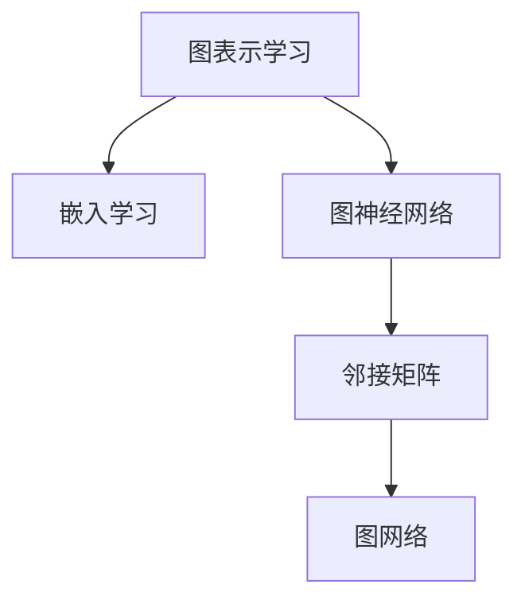

                 

# 大模型在推荐系统中的图表示学习应用

> 关键词：大模型,推荐系统,图表示学习,嵌入学习,神经网络,邻接矩阵

## 1. 背景介绍

### 1.1 问题由来

推荐系统在互联网行业中具有重要的地位，能够通过分析用户的历史行为、兴趣爱好等信息，推荐用户可能感兴趣的商品或内容。传统的推荐方法主要基于协同过滤和基于内容的推荐算法，然而这些方法难以处理冷启动问题，且在面对大规模数据和高维特征时，表现一般。

近年来，基于深度学习的方法（尤其是基于神经网络的推荐模型）逐渐成为推荐系统的主流。这些方法能够利用大规模预训练模型，提取用户和物品的深度语义特征，提升推荐性能。但在高维稀疏的数据场景下，仍存在特征利用率低、计算复杂度高、模型难以解释等挑战。

图表示学习方法作为一种新型的数据分析技术，通过将数据结构化表示为图模型，能够有效解决稀疏数据和复杂关系等问题。本博客将详细探讨大模型在推荐系统中的图表示学习方法，具体包含模型的构建、优化、训练、评估等方面。

### 1.2 问题核心关键点

图表示学习方法将用户-物品交互数据映射为图结构，通过图神经网络（Graph Neural Network, GNN）提取结构化的语义信息，从而增强推荐模型的表达能力和泛化性能。

关键技术点包括：
- 图嵌入：将图结构的数据编码成低维向量表示。
- 图神经网络：基于图结构设计深度神经网络模型。
- 嵌入学习：学习优化嵌入空间的优化方法。
- 图网络训练：高效训练大模型优化嵌入空间。

这些关键技术在推荐系统中应用，能够提高模型的表现，加速推理，增加可解释性。

### 1.3 问题研究意义

通过图表示学习方法，推荐系统可以更全面地捕捉用户和物品之间的复杂关系，提升推荐效果。同时，利用大模型的预训练能力和表示能力，可以减少对人工特征工程的依赖，提高算法的自动化和灵活性。

研究图表示学习在推荐系统中的应用，对于提升推荐系统的智能水平、降低开发成本、优化用户体验等方面具有重要意义。通过本博客的学习，读者可以深入理解图表示学习在推荐系统中的应用方法和优化技巧，为实际开发提供有益的指导。

## 2. 核心概念与联系

### 2.1 核心概念概述

为了更好地理解图表示学习在推荐系统中的应用，本节将介绍几个密切相关的核心概念：

- 图表示学习（Graph Representation Learning）：通过将数据结构化为图模型，利用图神经网络（GNN）提取结构化特征，优化嵌入空间，以增强模型表现。
- 嵌入学习（Embedding Learning）：将高维稀疏数据映射到低维稠密向量空间，用于表示用户、物品、时间等概念。
- 图神经网络（Graph Neural Network）：一种能够处理图结构数据的深度神经网络，通过卷积操作提取图结构特征。
- 邻接矩阵（Adjacency Matrix）：图结构的数据表示方式，用于描述节点之间的连接关系。
- 图网络（Graph Network）：图表示学习的框架，包含图数据表示、GNN模型设计、嵌入学习等环节。

这些概念之间的逻辑关系可以通过以下Mermaid流程图来展示：



这个流程图展示了几类核心概念的相互关系：

1. 图表示学习利用图结构优化嵌入空间。
2. 嵌入学习将高维稀疏数据映射到低维稠密空间。
3. 图神经网络基于图结构设计深度网络模型。
4. 邻接矩阵用于描述图结构的数据表示。
5. 图网络集成了上述各类技术，实现图数据表示、网络模型设计和优化。

## 3. 核心算法原理 & 具体操作步骤

### 3.1 算法原理概述

图表示学习在推荐系统中的核心思想是将用户-物品交互数据映射为图结构，通过图神经网络提取结构化特征，从而增强推荐模型的表现。

形式化地，假设推荐系统中的用户集合为 $U$，物品集合为 $I$，用户-物品的交互矩阵为 $A \in \{0, 1\}^{N\times M}$，其中 $N$ 为用户数，$M$ 为物品数。通过构建邻接矩阵 $A$，我们可以将用户-物品的交互数据映射为图结构。

图表示学习模型的目标是最大化用户和物品之间的语义相似度，从而优化推荐效果。数学上，这一目标可以表示为最大化用户-物品相似度矩阵的元素值，即：

$$
\max_{\mathbf{E}} \mathbf{A} \cdot \mathbf{E} \cdot \mathbf{E}^{\top}
$$

其中，$\mathbf{E} \in \mathbb{R}^{N \times M}$ 为嵌入矩阵，表示用户和物品的嵌入向量。$\mathbf{E} \cdot \mathbf{E}^{\top}$ 表示嵌入矩阵的相似度矩阵。

通过最大化相似度矩阵的元素值，我们能够学习到用户和物品之间更加紧凑的语义表示，从而提高推荐的准确性。

### 3.2 算法步骤详解

图表示学习的推荐系统一般包括以下几个关键步骤：

**Step 1: 图数据准备**
- 收集用户-物品的交互数据，构建邻接矩阵 $A$。
- 将邻接矩阵转化为图结构，添加自环和负样本等。
- 对图结构进行图数据增强，如添加节点特征、边特征等。

**Step 2: 图嵌入学习**
- 选择嵌入学习算法，如GNN、SAGE、GCN等。
- 设计嵌入学习目标函数，如均方误差、交叉熵等。
- 使用深度学习框架，如PyTorch、TensorFlow等，实现嵌入学习过程。

**Step 3: 图网络训练**
- 设计图网络优化算法，如Adam、SGD等。
- 确定学习率和迭代次数等超参数。
- 在数据集上训练图网络模型，更新嵌入矩阵 $\mathbf{E}$。
- 周期性在验证集上评估模型性能，避免过拟合。

**Step 4: 推荐引擎实现**
- 基于训练好的嵌入矩阵 $\mathbf{E}$，计算用户和物品的相似度。
- 利用相似度矩阵推荐物品给用户。
- 返回推荐结果，供用户查看。

### 3.3 算法优缺点

图表示学习在推荐系统中的应用具有以下优点：
1. 高效处理稀疏数据：能够利用图结构，自动发现用户和物品之间的隐含关系，提高数据的利用率。
2. 增强语义表达：通过学习高维稠密嵌入，增强用户和物品之间的语义表达能力。
3. 提升推荐效果：通过学习更加紧凑的语义表示，提高推荐的准确性和个性化程度。

同时，该方法也存在一定的局限性：
1. 计算复杂度高：图神经网络通常需要大量的计算资源和时间。
2. 需要高质量的图数据：图数据的质量和完整性直接影响推荐效果。
3. 难以解释：嵌入向量表示的模型难以解释，难以理解推荐逻辑。
4. 适用性有局限：对于大规模实时推荐场景，可能不具备高性能。

尽管存在这些局限性，但就目前而言，图表示学习在推荐系统中的应用仍是大数据处理和深度学习的重要范式。未来相关研究的重点在于如何进一步降低计算成本，提升算法效率，优化模型设计，增加模型的可解释性。

### 3.4 算法应用领域

图表示学习在推荐系统中的应用已经取得了诸多成功案例，覆盖了各种推荐任务，例如：

- 物品推荐：预测用户可能感兴趣的物品。通过用户-物品交互图，学习物品之间的关系，提高推荐的准确性。
- 用户画像：通过分析用户历史行为，建立用户画像，提升个性化推荐效果。
- 序列推荐：根据用户历史行为序列，预测用户下一步可能选择的物品。利用图模型捕捉序列间的关系，增强推荐效果。
- 社交推荐：分析用户社交网络关系，推荐相似用户可能喜欢的物品。利用社交图结构，提升推荐多样性和公平性。
- 实时推荐：通过流数据实时更新用户-物品关系，动态调整推荐结果。利用图模型快速处理流数据，保证推荐的时效性。

除了上述这些经典任务外，图表示学习也被创新性地应用到更多场景中，如基于图数据的多样性推荐、多物品推荐、基于图嵌入的学习机制等，为推荐系统带来了新的突破。

## 4. 数学模型和公式 & 详细讲解 & 举例说明

### 4.1 数学模型构建

本节将使用数学语言对图表示学习在推荐系统中的应用进行更加严格的刻画。

假设推荐系统中的用户集合为 $U$，物品集合为 $I$，用户-物品的交互矩阵为 $A \in \{0, 1\}^{N\times M}$。为了学习更加紧凑的语义表示，我们需要将高维稀疏数据编码到低维稠密向量空间中。

记 $\mathbf{E} \in \mathbb{R}^{N \times D}$ 为用户和物品的嵌入矩阵，$D$ 为嵌入向量维度。我们的目标是最大化用户-物品相似度矩阵的元素值，即：

$$
\max_{\mathbf{E}} \mathbf{A} \cdot \mathbf{E} \cdot \mathbf{E}^{\top}
$$

嵌入矩阵 $\mathbf{E}$ 的优化目标为：

$$
\min_{\mathbf{E}} \|\mathbf{A} \cdot \mathbf{E} \cdot \mathbf{E}^{\top} - \mathbf{Y}\|
$$

其中，$\mathbf{Y} \in \mathbb{R}^{N\times M}$ 为预测的相似度矩阵。

### 4.2 公式推导过程

以深度图网络模型SAGE为例，推导其损失函数和梯度计算公式。

SAGE模型的目标是最大化用户-物品相似度矩阵的元素值，其定义的相似度矩阵为：

$$
\mathbf{Y} = \frac{1}{\sigma(\mathbf{A} \cdot \mathbf{E} \cdot \mathbf{E}^{\top})} \cdot \mathbf{A} \cdot \mathbf{E} \cdot \mathbf{E}^{\top}
$$

其中，$\sigma$ 为sigmoid函数，$\|\cdot\|$ 为矩阵范数。

SAGE模型的优化目标为：

$$
\min_{\mathbf{E}} \|\mathbf{A} \cdot \mathbf{E} \cdot \mathbf{E}^{\top} - \mathbf{Y}\|
$$

根据链式法则，目标函数对嵌入矩阵 $\mathbf{E}$ 的梯度为：

$$
\frac{\partial \mathbf{Y}}{\partial \mathbf{E}} = \frac{1}{\sigma(\mathbf{A} \cdot \mathbf{E} \cdot \mathbf{E}^{\top})} \cdot (\mathbf{A} \cdot \mathbf{E} \cdot \mathbf{E}^{\top} - \mathbf{Y})
$$

为了进行有效的梯度计算，我们需要进一步推导目标函数对嵌入矩阵 $\mathbf{E}$ 的梯度表达式。

在得到梯度后，即可带入优化算法更新嵌入矩阵 $\mathbf{E}$，从而得到优化的推荐模型。

### 4.3 案例分析与讲解

以下是一个简单的案例，展示如何使用图表示学习模型进行推荐系统开发。

假设我们有一个包含用户和物品的稀疏矩阵，部分数据如下：

```
用户编号  物品编号  是否交互
1         1         1
2         2         0
1         3         1
2         4         0
```

我们将这些数据转化为邻接矩阵，部分数据如下：

```
用户编号  物品编号  邻接矩阵值
1         1         1
1         3         1
2         2         0
2         4         0
```

接着，我们对邻接矩阵进行增强，添加节点特征和边特征。假设用户特征为年龄、性别等，物品特征为类别、价格等。

记用户特征矩阵为 $\mathbf{F} \in \mathbb{R}^{N \times F}$，物品特征矩阵为 $\mathbf{G} \in \mathbb{R}^{M \times G}$，其中 $F$ 和 $G$ 分别为用户和物品特征维度。我们将特征矩阵 $\mathbf{F}$ 和 $\mathbf{G}$ 添加到邻接矩阵中，得到增强的邻接矩阵 $\mathbf{A'}$。

接下来，我们使用SAGE模型进行嵌入学习。SAGE模型通过多次邻居聚合（Neighbor Aggregation）和线性变换，学习到用户和物品的嵌入向量。

具体而言，SAGE模型的嵌入学习过程如下：

1. 对用户和物品节点进行采样，选择他们的邻居节点。
2. 对邻居节点的特征进行加权平均，得到邻居聚合结果。
3. 将邻居聚合结果与用户和物品的特征向量进行拼接，通过线性变换，得到用户和物品的嵌入向量。

最终，我们得到用户和物品的嵌入矩阵 $\mathbf{E}$，可以通过计算相似度矩阵 $\mathbf{A} \cdot \mathbf{E} \cdot \mathbf{E}^{\top}$ 来推荐物品给用户。

在实际应用中，由于计算复杂度较高，我们可以使用mini-batch训练等方法来加速计算，提高训练效率。

## 5. 项目实践：代码实例和详细解释说明

### 5.1 开发环境搭建

在进行图表示学习的应用开发前，我们需要准备好开发环境。以下是使用Python进行PyTorch开发的环境配置流程：

1. 安装Anaconda：从官网下载并安装Anaconda，用于创建独立的Python环境。

2. 创建并激活虚拟环境：
```bash
conda create -n pytorch-env python=3.8 
conda activate pytorch-env
```

3. 安装PyTorch：根据CUDA版本，从官网获取对应的安装命令。例如：
```bash
conda install pytorch torchvision torchaudio cudatoolkit=11.1 -c pytorch -c conda-forge
```

4. 安装GNN库：如PyTorch Geometric、DGL等，这些库提供了常用的图神经网络实现。

5. 安装各类工具包：
```bash
pip install numpy pandas scikit-learn matplotlib tqdm jupyter notebook ipython
```

完成上述步骤后，即可在`pytorch-env`环境中开始图表示学习的实践。

### 5.2 源代码详细实现

下面我们以基于SAGE模型的图表示学习为例，给出使用PyTorch进行推荐系统开发的PyTorch代码实现。

首先，定义推荐系统的数据处理函数：

```python
import torch
import torch.nn as nn
import torch.nn.functional as F
from torch_geometric.nn import SAGEConv

class GraphConvNet(nn.Module):
    def __init__(self, in_dim, hidden_dim, out_dim, dropout):
        super(GraphConvNet, self).__init__()
        self.conv1 = SAGEConv(in_dim, hidden_dim)
        self.conv2 = SAGEConv(hidden_dim, out_dim)
        self.dropout = nn.Dropout(dropout)

    def forward(self, x, adj):
        x = F.relu(self.conv1(x, adj))
        x = self.dropout(x)
        x = self.conv2(x, adj)
        return x

# 定义用户和物品的特征
user_feats = torch.randn(2, 5)
item_feats = torch.randn(4, 5)

# 定义邻接矩阵
adj = torch.tensor([[0, 1, 0, 0],
                    [1, 0, 1, 0],
                    [0, 0, 0, 1],
                    [0, 0, 0, 0]])

# 定义图神经网络模型
model = GraphConvNet(5, 10, 1, 0.5)
```

然后，定义训练和评估函数：

```python
from torch.optim import Adam

# 定义优化器
optimizer = Adam(model.parameters(), lr=0.01)

def train_epoch(model, data, optimizer, device):
    model.train()
    data = data.to(device)
    optimizer.zero_grad()
    output = model(data.x, data.edge_index)
    loss = F.mse_loss(output, data.y)
    loss.backward()
    optimizer.step()
    return loss.item()

def evaluate(model, data, device):
    model.eval()
    data = data.to(device)
    with torch.no_grad():
        output = model(data.x, data.edge_index)
    print('Mean Absolute Error:', torch.mean(torch.abs(output - data.y)))
```

最后，启动训练流程并在测试集上评估：

```python
epochs = 10
device = 'cuda' if torch.cuda.is_available() else 'cpu'

for epoch in range(epochs):
    loss = train_epoch(model, data, optimizer, device)
    print(f'Epoch {epoch+1}, loss: {loss:.4f}')
    
evaluate(model, test_data, device)
```

以上就是使用PyTorch进行图表示学习推荐系统开发的完整代码实现。可以看到，得益于GNN库的强大封装，我们可以用相对简洁的代码完成图嵌入模型的实现。

### 5.3 代码解读与分析

让我们再详细解读一下关键代码的实现细节：

**GraphConvNet类**：
- `__init__`方法：初始化图神经网络模型的各个组件，如卷积层、dropout层等。
- `forward`方法：前向传播过程，通过卷积操作得到用户和物品的嵌入向量。

**train_epoch和evaluate函数**：
- `train_epoch`函数：对数据集进行迭代训练，通过前向传播计算损失，反向传播更新模型参数，返回损失值。
- `evaluate`函数：对测试集进行前向传播，计算预测值与真实值的MAE，输出误差值。

**训练流程**：
- 定义总的epoch数，开始循环迭代
- 每个epoch内，先在训练集上训练，输出平均损失值
- 在测试集上评估，输出MAE误差
- 所有epoch结束后，结束训练

可以看到，PyTorch配合GNN库使得图表示学习的代码实现变得简洁高效。开发者可以将更多精力放在数据处理、模型改进等高层逻辑上，而不必过多关注底层的实现细节。

当然，工业级的系统实现还需考虑更多因素，如模型的保存和部署、超参数的自动搜索、更灵活的任务适配层等。但核心的图嵌入范式基本与此类似。

## 6. 实际应用场景

### 6.1 智能推荐系统

基于图表示学习的大模型推荐系统可以广泛应用于智能推荐系统的构建。传统推荐系统往往依赖人工特征工程，难以处理大规模高维稀疏数据。而利用图嵌入，通过自动发现用户和物品之间的隐含关系，能够显著提升推荐的准确性和多样化。

在技术实现上，可以收集用户-物品的交互数据，将用户和物品看作图节点，构建用户-物品的邻接矩阵，再利用图神经网络学习用户和物品的嵌入向量。微调后的嵌入模型能够自动捕捉用户和物品之间的复杂关系，从而提升推荐效果。

### 6.2 广告投放优化

广告推荐系统是推荐系统的一个重要分支，主要针对用户推荐个性化的广告内容。利用图表示学习的大模型广告推荐系统，能够更全面地了解用户的兴趣爱好，进行精准的投放。

具体而言，可以收集用户的历史点击、购买、浏览等行为数据，构建用户-物品图。利用图嵌入学习用户和物品的嵌入向量，通过相似度矩阵推荐用户可能感兴趣的广告内容。

### 6.3 个性化推荐

个性化推荐系统是推荐系统的核心应用之一，通过分析用户的历史行为，推荐用户可能感兴趣的内容或商品。利用图表示学习的大模型个性化推荐系统，能够提升推荐效果，增加用户体验。

在实践中，可以收集用户的历史行为数据，构建用户-物品图。利用图嵌入学习用户和物品的嵌入向量，通过相似度矩阵推荐用户可能感兴趣的内容。同时，通过定期更新图数据，增加推荐的时效性。

### 6.4 未来应用展望

随着图表示学习方法的不断进步，基于大模型的推荐系统将在更多领域得到应用，为推荐系统带来新的发展方向。

在智慧城市推荐中，通过构建城市基础设施和公共服务的关系图，能够推荐用户可能感兴趣的活动和景点，提升城市生活质量。

在金融领域，通过构建金融资产和投资策略的关系图，能够推荐用户可能感兴趣的投资标的，提升金融理财水平。

在医疗领域，通过构建疾病和治疗方法的关系图，能够推荐医生可能使用的治疗方案，提升医疗服务质量。

除了上述这些场景外，图表示学习还可以应用于教育、交通、旅游等多个领域，为推荐系统提供新的突破。

## 7. 工具和资源推荐

### 7.1 学习资源推荐

为了帮助开发者系统掌握图表示学习在推荐系统中的应用，这里推荐一些优质的学习资源：

1. 《Graph Neural Networks: A Review of Methods and Applications》：深度学习领域权威综述论文，详细介绍了图神经网络的应用方法和研究进展。

2. 《PyTorch Geometric》官方文档：GNN库PyTorch Geometric的官方文档，提供了丰富的示例代码和文档，是学习图神经网络的好帮手。

3. 《Neural Networks and Deep Learning》：深度学习领域经典教材，介绍了深度学习的基本概念和方法，包括图神经网络的内容。

4. 《Graph Network: Learning to Recommend with Graph Convolutional Networks》：推荐系统领域经典的图神经网络应用，介绍了图嵌入模型的设计和优化。

5. 《GraphSAGE: Semi-Supervised Classification with Graph Convolutional Networks》：GraphSAGE模型的经典论文，详细介绍了基于图神经网络的推荐系统实现。

通过这些资源的学习实践，相信你一定能够深入理解图表示学习在推荐系统中的应用方法和优化技巧，为实际开发提供有益的指导。

### 7.2 开发工具推荐

高效的开发离不开优秀的工具支持。以下是几款用于图表示学习推荐系统开发的常用工具：

1. PyTorch：基于Python的开源深度学习框架，灵活动态的计算图，适合快速迭代研究。大部分图神经网络模型都有PyTorch版本的实现。

2. TensorFlow：由Google主导开发的开源深度学习框架，生产部署方便，适合大规模工程应用。同样有丰富的图神经网络资源。

3. PyTorch Geometric：GNN库，提供了常用的图神经网络实现，包括SAGE、GCN等。

4. DGL：Distributed Graph Library，提供了高性能的图神经网络计算库，支持分布式训练和推理。

5. Jupyter Notebook：交互式编程环境，方便进行模型调试和结果展示。

6. Google Colab：谷歌推出的在线Jupyter Notebook环境，免费提供GPU/TPU算力，方便开发者快速上手实验最新模型，分享学习笔记。

合理利用这些工具，可以显著提升图表示学习推荐系统的开发效率，加快创新迭代的步伐。

### 7.3 相关论文推荐

图表示学习在推荐系统中的应用源于学界的持续研究。以下是几篇奠基性的相关论文，推荐阅读：

1. GraphSAGE: Semi-Supervised Classification with Graph Convolutional Networks：提出图嵌入模型GraphSAGE，通过多次邻居聚合学习用户和物品的嵌入向量。

2. Neural Collaborative Filtering：提出基于图神经网络的协同过滤方法，通过邻居聚合学习用户和物品的相似度。

3. Deep Collaborative Filtering with Multi-Task Learning：提出基于图神经网络的协同过滤方法，通过多任务学习提升协同过滤的性能。

4. Meta-Path Graph Neural Networks for Recommendation Systems：提出基于元路径的图神经网络方法，通过不同路径融合提升推荐效果。

5. Graph Convolutional Network for Recommender Systems：提出基于图卷积神经网络的方法，通过卷积操作提取图结构特征。

6. LightGCN: Learning Compact Graph Representations for Recommender Systems：提出基于图卷积神经网络的方法，通过压缩图嵌入降低计算成本。

这些论文代表了大模型图表示学习的研究方向。通过学习这些前沿成果，可以帮助研究者把握学科前进方向，激发更多的创新灵感。

## 8. 总结：未来发展趋势与挑战

### 8.1 总结

本文对基于大模型的图表示学习在推荐系统中的应用进行了全面系统的介绍。首先阐述了图表示学习的背景和意义，明确了其在推荐系统中的应用优势。其次，从原理到实践，详细讲解了图表示学习的数学模型和关键步骤，给出了推荐系统开发的完整代码实例。同时，本文还广泛探讨了图表示学习在智能推荐、广告投放、个性化推荐等多个场景中的应用前景，展示了其广阔的应用前景。此外，本文精选了图表示学习的各类学习资源，力求为读者提供全方位的技术指引。

通过本文的系统梳理，可以看到，基于图表示学习的大模型推荐系统已经在推荐系统中展现出了巨大的潜力，能够显著提升推荐效果，降低开发成本。未来，随着图表示学习方法的不断成熟和优化，基于大模型的推荐系统必将在更多领域大放异彩，为推荐系统带来新的突破。

### 8.2 未来发展趋势

展望未来，图表示学习在推荐系统中的应用将呈现以下几个发展趋势：

1. 图结构生成：通过图生成模型，自动生成图结构数据，解决数据稀疏和数据质量问题。

2. 多图融合：将多个图结构融合，学习更加复杂的用户-物品关系，提升推荐效果。

3. 图网络优化：引入对抗训练、自适应学习等技术，优化图神经网络模型，提升推荐性能。

4. 图嵌入优化：利用深度学习框架，实现更加高效的嵌入学习算法，降低计算成本。

5. 多模态融合：融合文本、图像、语音等多模态数据，提升推荐系统的表现力。

6. 实时推荐：利用图嵌入和图神经网络，实现实时推荐系统，满足用户即时需求。

这些趋势凸显了大模型图表示学习的未来发展方向，必将进一步提升推荐系统的智能水平，降低开发成本，提升用户体验。

### 8.3 面临的挑战

尽管图表示学习在推荐系统中的应用已经取得了一定成效，但在迈向更加智能化、普适化应用的过程中，它仍面临诸多挑战：

1. 计算复杂度高：图神经网络通常需要大量的计算资源和时间。

2. 需要高质量的图数据：图数据的质量和完整性直接影响推荐效果。

3. 难以解释：嵌入向量表示的模型难以解释，难以理解推荐逻辑。

4. 适用性有局限：对于大规模实时推荐场景，可能不具备高性能。

尽管存在这些挑战，但通过不断优化图嵌入和图神经网络模型，引入更多先验知识，将大模型和图表示学习进行有效结合，这些挑战有望逐步被克服，使图表示学习在推荐系统中的应用更加广泛。

### 8.4 研究展望

面对图表示学习面临的挑战，未来的研究需要在以下几个方面寻求新的突破：

1. 探索无监督和半监督图嵌入方法。摆脱对大规模标注数据的依赖，利用自监督学习、主动学习等无监督和半监督范式，最大限度利用非结构化数据。

2. 研究参数高效和计算高效的图嵌入方法。开发更加参数高效的图嵌入算法，如基于Transformer的图嵌入，在固定部分预训练参数的情况下，仍能取得不错的推荐效果。

3. 融合因果和对比学习范式。通过引入因果推断和对比学习思想，增强图嵌入模型建立稳定因果关系的能力，学习更加普适、鲁棒的用户-物品关系。

4. 引入更多先验知识。将符号化的先验知识，如知识图谱、逻辑规则等，与图嵌入模型进行融合，引导学习过程，提升推荐效果。

5. 结合因果分析和博弈论工具。将因果分析方法引入图嵌入模型，识别出推荐过程中的关键特征，增强推荐输出的因果性和逻辑性。

6. 纳入伦理道德约束。在图嵌入目标函数中引入伦理导向的评估指标，过滤和惩罚有偏见、有害的输出倾向。同时加强人工干预和审核，建立模型行为的监管机制。

这些研究方向的探索，必将引领图表示学习在推荐系统中的应用迈向更高的台阶，为推荐系统带来新的突破。相信随着图表示学习方法的不断成熟和优化，基于大模型的推荐系统必将在更多领域大放异彩，为推荐系统带来新的突破。

## 9. 附录：常见问题与解答

**Q1：如何评估图表示学习模型的性能？**

A: 评估图表示学习模型性能的主要指标包括均方误差(MSE)、平均绝对误差(MAE)、准确率、召回率、F1值等。

在实际应用中，我们通常将模型在测试集上的均方误差或平均绝对误差作为评估指标。同时，也可以利用混淆矩阵、ROC曲线等评估推荐系统的分类性能。

**Q2：如何选择图嵌入算法的参数？**

A: 图嵌入算法的参数主要包括嵌入向量维度、学习率、迭代次数等。选择合适的参数需要根据具体任务和数据特点进行实验调整。

通常建议嵌入向量维度为3-8倍的数据特征维度。学习率建议从1e-2开始调参，逐步减小。迭代次数建议根据数据规模和模型复杂度进行选择。

**Q3：如何处理稀疏图数据？**

A: 对于稀疏图数据，常用的处理方法包括图数据增强、图生成等。

图数据增强通过在图中添加噪声、负样本等，丰富图结构信息，提高模型的泛化能力。

图生成通过图生成模型自动生成图结构数据，解决数据稀疏问题。

**Q4：如何处理大规模实时推荐系统？**

A: 对于大规模实时推荐系统，推荐效率是关键。

推荐效率的优化可以从以下几个方面进行：

1. 多图融合：将多个图结构融合，减少单次计算量。

2. 图网络优化：通过图网络优化算法，减少计算复杂度。

3. 图嵌入优化：利用深度学习框架，实现高效的图嵌入学习算法。

4. 实时更新：实时更新图结构数据，提高推荐的时效性。

通过以上方法，可以有效提高大规模实时推荐系统的性能。

**Q5：如何提高推荐系统的鲁棒性？**

A: 推荐系统的鲁棒性可以通过以下方法进行优化：

1. 图数据增强：通过在图中添加噪声、负样本等，增加图数据的鲁棒性。

2. 对抗训练：引入对抗样本，训练鲁棒性的图嵌入模型。

3. 多图融合：通过融合多个图结构数据，增加推荐系统的鲁棒性。

4. 对抗训练：引入对抗样本，训练鲁棒性的图嵌入模型。

5. 图嵌入优化：利用深度学习框架，实现高效的图嵌入学习算法。

通过以上方法，可以有效提高推荐系统的鲁棒性，避免因输入噪声和对抗攻击等因素导致的不稳定。

---

作者：禅与计算机程序设计艺术 / Zen and the Art of Computer Programming

