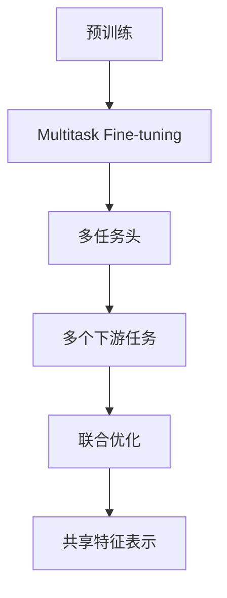

                 

# 大模型在推荐系统中的多任务学习应用

## 1. 背景介绍

推荐系统一直是电商和社交媒体平台的核心功能之一，通过个性化推荐提升用户体验和平台活跃度。然而，传统推荐系统往往只能针对单一推荐目标进行优化，如商品推荐、内容推荐等。随着多任务学习的兴起，推荐系统也开始探索将多个推荐任务进行联合优化，以期获得更高的性能和更好的用户体验。

大模型预训练的广泛应用为多任务学习提供了新的可能。通过在大规模数据上进行预训练，大模型可以学习到通用的语言特征和知识表示。在此基础上，通过微调可以针对特定任务进行优化，提升模型的泛化能力和性能。本文将详细介绍基于大模型的多任务学习在推荐系统中的应用，包括多任务学习的原理、模型架构、数学推导和实际应用案例。

## 2. 核心概念与联系

### 2.1 核心概念概述

在推荐系统中应用多任务学习，需要对以下几个核心概念有清晰的理解：

- 推荐系统(Recommendation System)：通过分析用户行为和商品/内容特征，为用户推荐个性化商品/内容的技术系统。传统推荐系统分为基于协同过滤、基于内容的推荐等。

- 多任务学习(Multitask Learning)：指在训练过程中，联合优化多个相关但不同的任务，共享特征表示，提升模型泛化能力和性能。多任务学习广泛应用于NLP、计算机视觉等领域，提升模型在大规模数据上的迁移能力。

- 大模型预训练(Pre-training of Large Language Models)：通过大规模无标签数据进行自监督学习，学习语言通用表示，为下游任务提供强大的预训练模型。

- 微调(Fine-tuning)：在预训练模型的基础上，使用下游任务的少量标注数据进行有监督学习，优化模型在特定任务上的性能。

- 多任务微调(Multitask Fine-tuning)：在多任务学习框架下，联合优化多个下游任务，共享预训练模型的通用特征表示。

- 多任务头(Multi-task Head)：在大模型的顶层添加多个任务适配头，每个头对应不同的推荐任务，通过联合训练提升整体性能。

这些核心概念之间具有紧密联系，构建了推荐系统中多任务学习的大框架。通过了解这些概念，可以更好地把握多任务学习在推荐系统中的应用策略和优化方法。

### 2.2 核心概念原理和架构的 Mermaid 流程图



## 3. 核心算法原理 & 具体操作步骤

### 3.1 算法原理概述

基于大模型的多任务学习推荐系统，核心在于通过共享预训练模型的通用特征表示，同时优化多个推荐任务。其基本思路是：将大模型作为特征提取器，在预训练模型上添加多任务头，对多个下游任务进行微调，联合优化多个任务的目标函数，从而提升模型在多个任务上的性能。

形式化地，假设预训练模型为 $M_{\theta}$，其中 $\theta$ 为预训练得到的模型参数。假设推荐系统有 $K$ 个任务 $T_1, T_2, ..., T_K$，分别对应的推荐目标函数为 $L_{1}, L_{2}, ..., L_{K}$。多任务学习的优化目标为：

$$
\hat{\theta} = \mathop{\arg\min}_{\theta} \sum_{k=1}^K \alpha_k L_k(M_{\theta})
$$

其中 $\alpha_k$ 为每个任务的重要性权重，用于平衡不同任务的影响。联合优化可以通过一个联合损失函数来实现：

$$
L_{joint} = \frac{1}{K} \sum_{k=1}^K \alpha_k L_k(M_{\theta})
$$

多任务微调的优化过程包括：
1. 加载预训练模型 $M_{\theta}$ 作为初始化参数。
2. 在预训练模型的顶层添加多任务头，每个头对应一个推荐任务。
3. 针对每个推荐任务，在训练集中标注样本 $(x_i, y_i)$，其中 $x_i$ 为输入样本，$y_i$ 为推荐目标。
4. 对每个任务，使用相应的损失函数 $L_k$ 计算联合损失函数 $L_{joint}$。
5. 使用梯度下降等优化算法最小化 $L_{joint}$，更新模型参数 $\theta$。

### 3.2 算法步骤详解

以下详细介绍基于大模型的多任务学习推荐系统的主要算法步骤：

**Step 1: 准备数据集和模型架构**

1. 收集推荐系统涉及的多个任务的数据集，如商品推荐、内容推荐等。每个数据集应包含输入特征 $x_i$ 和推荐目标 $y_i$。

2. 选择合适的预训练语言模型 $M_{\theta}$ 作为初始化参数，如BERT、GPT等。

3. 在预训练模型的顶层添加多个任务头，每个头对应一个推荐任务。例如，对于内容推荐任务，可以在预训练模型的顶层添加内容嵌入层，并使用多层感知器(Multilayer Perceptron, MLP)进行输出。

**Step 2: 设计联合损失函数**

1. 针对每个推荐任务，设计相应的损失函数 $L_k$，例如交叉熵损失、均方误差损失等。

2. 根据各任务的重要性，设定相应的权重 $\alpha_k$，平衡任务间的影响。

3. 将联合损失函数定义为：

$$
L_{joint} = \frac{1}{K} \sum_{k=1}^K \alpha_k L_k(M_{\theta})
$$

**Step 3: 设置微调超参数**

1. 选择合适的优化算法及其参数，如 AdamW、SGD 等，设置学习率、批大小、迭代轮数等。

2. 设置正则化技术及强度，包括权重衰减、Dropout、Early Stopping 等。

3. 确定冻结预训练参数的策略，如仅微调顶层，或全部参数都参与微调。

**Step 4: 执行梯度训练**

1. 将多个任务的训练集数据分批次输入模型，前向传播计算联合损失函数。

2. 反向传播计算参数梯度，根据设定的优化算法和学习率更新模型参数。

3. 周期性在验证集上评估模型性能，根据性能指标决定是否触发 Early Stopping。

4. 重复上述步骤直至满足预设的迭代轮数或 Early Stopping 条件。

**Step 5: 测试和部署**

1. 在测试集上评估多任务微调后模型 $M_{\hat{\theta}}$ 的性能，对比微调前后的精度提升。

2. 使用微调后的模型对新样本进行推理预测，集成到实际的应用系统中。

3. 持续收集新的数据，定期重新微调模型，以适应数据分布的变化。

### 3.3 算法优缺点

基于大模型的多任务学习推荐系统具有以下优点：

1. 资源利用效率高。通过共享预训练模型的通用特征表示，减少了资源占用，提高了推荐系统在多任务上的性能。

2. 泛化能力强。联合优化多个任务，可以提升模型在多个任务上的泛化能力和泛化性能。

3. 性能提升显著。多任务学习可以通过联合训练，提升模型的精度和召回率，提升推荐系统的整体性能。

4. 简单易实现。基于大模型的多任务学习推荐系统，可以利用现成的预训练模型和微调框架，实现快速迭代和优化。

然而，该方法也存在一些局限性：

1. 标注数据需求高。多任务微调需要针对每个任务准备大量标注数据，数据收集成本较高。

2. 任务间权衡困难。多个任务间的重要性权衡需要精心设计，不同的权衡策略可能导致性能波动。

3. 模型复杂度高。多任务头和多任务微调会增加模型的复杂度，可能导致训练和推理效率下降。

4. 过拟合风险大。联合优化多个任务可能导致过拟合，特别是在数据量不足的情况下。

尽管存在这些局限性，但基于大模型的多任务学习推荐系统仍具有广泛的应用前景，尤其在多任务推荐场景中，可以通过优化任务权重、选择合适的模型结构等策略，进一步提升系统性能。

### 3.4 算法应用领域

基于大模型的多任务学习推荐系统在电商、社交媒体、视频流平台等多个领域都有广泛应用，例如：

- 商品推荐系统：根据用户的历史行为数据，推荐可能感兴趣的商品。通过多任务学习，联合优化商品评价、购买历史等多个任务，提升推荐效果。

- 内容推荐系统：推荐用户可能感兴趣的文章、视频、音乐等。通过多任务学习，联合优化内容相关性、用户满意度等多个任务，提升推荐效果。

- 个性化广告推荐：根据用户的兴趣特征，推荐个性化的广告内容。通过多任务学习，联合优化广告点击率、用户转化率等多个任务，提升广告效果。

- 用户行为分析：分析用户在不同平台上的行为，预测用户未来的行为和需求。通过多任务学习，联合优化不同平台的用户行为数据，提升预测准确率。

以上应用场景展示了多任务学习在推荐系统中的广泛应用，大模型的预训练和多任务微调为推荐系统带来了新的可能性，使得模型能够更好地理解用户需求，提升推荐系统的性能和用户体验。

## 4. 数学模型和公式 & 详细讲解 & 举例说明

### 4.1 数学模型构建

假设推荐系统有 $K$ 个推荐任务 $T_k$，分别为商品推荐 $T_1$、内容推荐 $T_2$、个性化广告推荐 $T_3$ 等。每个任务对应的训练集为 $D_k=\{(x_i, y_i)\}_{i=1}^{N_k}$，其中 $x_i$ 为输入特征，$y_i$ 为推荐目标。假设预训练语言模型为 $M_{\theta}$，其中 $\theta$ 为预训练得到的模型参数。多任务学习的优化目标为：

$$
\hat{\theta} = \mathop{\arg\min}_{\theta} \sum_{k=1}^K \alpha_k L_k(M_{\theta})
$$

其中 $\alpha_k$ 为任务权重，用于平衡不同任务的影响。联合损失函数定义为：

$$
L_{joint} = \frac{1}{K} \sum_{k=1}^K \alpha_k L_k(M_{\theta})
$$

在训练过程中，模型参数 $\theta$ 通过梯度下降算法进行更新，优化目标为：

$$
\theta \leftarrow \theta - \eta \nabla_{\theta} L_{joint}
$$

其中 $\eta$ 为学习率，$\nabla_{\theta} L_{joint}$ 为联合损失函数的梯度。

### 4.2 公式推导过程

以商品推荐任务 $T_1$ 为例，推导多任务微调中的损失函数和梯度计算公式。

假设商品推荐任务的训练集为 $D_1=\{(x_i, y_i)\}_{i=1}^{N_1}$，其中 $x_i$ 为商品描述，$y_i$ 为购买行为。假设模型 $M_{\theta}$ 的输出为商品相关性分数，则商品推荐任务的损失函数为交叉熵损失：

$$
L_1(M_{\theta}) = -\frac{1}{N_1} \sum_{i=1}^{N_1} y_i \log M_{\theta}(x_i) + (1-y_i) \log (1-M_{\theta}(x_i))
$$

在多任务学习框架下，联合损失函数为：

$$
L_{joint} = \frac{1}{K} \sum_{k=1}^K \alpha_k L_k(M_{\theta})
$$

其中 $\alpha_k$ 为任务权重，用于平衡不同任务的影响。在联合损失函数中，每个任务的重要性可以通过人工设定或自动学习获得。

### 4.3 案例分析与讲解

以内容推荐系统为例，展示多任务学习在推荐系统中的具体应用。假设内容推荐系统包含两个任务：内容相关性推荐 $T_1$ 和内容个性化推荐 $T_2$。

**数据准备**

1. 收集内容推荐系统的用户行为数据，包括用户浏览、点赞、评论等行为。
2. 收集内容相关的特征数据，如文章标题、作者、关键词等。

**模型结构**

1. 使用BERT等预训练语言模型作为特征提取器，将内容特征向量作为输入。
2. 在预训练模型的顶层添加两个任务头，分别对应内容相关性和内容个性化推荐。
3. 内容相关性推荐头使用多层感知器(MLP)进行输出，输出为 $[0,1]$ 之间的相关性分数。
4. 内容个性化推荐头也使用 MLP，输出为 $[0,1]$ 之间的个性化分数。

**损失函数**

1. 内容相关性推荐损失函数为交叉熵损失：

$$
L_1(M_{\theta}) = -\frac{1}{N_1} \sum_{i=1}^{N_1} y_i \log M_{\theta}(x_i) + (1-y_i) \log (1-M_{\theta}(x_i))
$$

2. 内容个性化推荐损失函数为均方误差损失：

$$
L_2(M_{\theta}) = \frac{1}{N_2} \sum_{i=1}^{N_2} (y_i - M_{\theta}(x_i))^2
$$

**联合损失函数**

1. 根据任务权重设定 $\alpha_1 = 0.7$ 和 $\alpha_2 = 0.3$，平衡内容相关性和内容个性化的影响。
2. 联合损失函数为：

$$
L_{joint} = \frac{1}{2} \alpha_1 L_1(M_{\theta}) + \frac{1}{2} \alpha_2 L_2(M_{\theta})
$$

**模型训练**

1. 使用 AdamW 优化算法进行联合优化，学习率设为 $2e-5$。
2. 在训练集中，每个批次同时输入内容相关性和内容个性化的数据，计算联合损失函数的梯度。
3. 联合优化目标函数，更新模型参数 $\theta$。
4. 在验证集上评估模型性能，使用准确率、召回率等指标进行评估。

通过以上步骤，可以实现基于大模型的多任务学习推荐系统。该系统能够同时优化内容相关性和内容个性化的推荐效果，提升推荐系统的整体性能。

## 5. 项目实践：代码实例和详细解释说明

### 5.1 开发环境搭建

在进行多任务学习推荐系统开发前，需要准备好开发环境。以下是使用Python进行TensorFlow开发的环境配置流程：

1. 安装Anaconda：从官网下载并安装Anaconda，用于创建独立的Python环境。

2. 创建并激活虚拟环境：
```bash
conda create -n tf-env python=3.8 
conda activate tf-env
```

3. 安装TensorFlow：根据CUDA版本，从官网获取对应的安装命令。例如：
```bash
pip install tensorflow
```

4. 安装各类工具包：
```bash
pip install numpy pandas scikit-learn matplotlib tqdm jupyter notebook ipython
```

完成上述步骤后，即可在`tf-env`环境中开始多任务学习推荐系统的开发。

### 5.2 源代码详细实现

以下是一个简单的多任务学习推荐系统的PyTorch代码实现，包含商品推荐和内容推荐两个任务：

```python
import tensorflow as tf
from tensorflow.keras.layers import Input, Dense, Embedding, concatenate
from tensorflow.keras.models import Model

# 定义输入层
user_input = Input(shape=(256,))
item_input = Input(shape=(256,))
content_input = Input(shape=(256,))

# 添加预训练语言模型
bert_model = transformers.TFBertForSequenceClassification.from_pretrained('bert-base-cased', num_labels=2)
bert_output = bert_model(user_input, item_input)

# 添加任务头
content_head = Dense(1, activation='sigmoid')(bert_output)
user_head = Dense(1, activation='sigmoid')(bert_output)

# 组合模型输出
combined_output = concatenate([content_head, user_head])

# 定义联合损失函数
def combined_loss(y_true, y_pred):
    return tf.losses.mean_squared_error(y_true, y_pred) + tf.losses.sparse_categorical_crossentropy(y_true, y_pred)

# 构建模型
model = Model(inputs=[user_input, item_input, content_input], outputs=[content_head, user_head])

# 编译模型
model.compile(optimizer='adam', loss=combined_loss, metrics=['accuracy'])

# 训练模型
model.fit([user_input_train, item_input_train, content_input_train], [content_label_train, user_label_train], epochs=10, batch_size=32)
```

在这个示例代码中，我们使用了Transformers库提供的BERT模型，并在此基础上添加了两个任务头。每个任务头使用Dense层进行输出，分别对应内容相关性和内容个性化推荐。通过定义联合损失函数，实现了商品推荐和内容推荐的联合优化。

### 5.3 代码解读与分析

让我们再详细解读一下关键代码的实现细节：

**代码解释**

1. **输入层定义**：使用Keras的Input层定义输入特征。

2. **预训练模型添加**：通过Transformers库加载预训练的BERT模型，作为特征提取器。

3. **任务头添加**：在BERT模型的基础上添加两个任务头，分别对应内容相关性和内容个性化推荐。任务头使用Dense层进行输出，输出为 $[0,1]$ 之间的相关性分数。

4. **联合损失函数定义**：定义联合损失函数，分别计算内容相关性和内容个性化的损失，并取它们的均值。

5. **模型构建**：将输入层和任务头组合，构建多任务学习推荐系统的模型。

6. **模型编译和训练**：使用Adam优化器编译模型，设置损失函数和评估指标，并在训练集上训练模型。

**分析**

1. **预训练模型的选择**：当前流行的预训练模型如BERT、GPT等，都可以作为特征提取器，使用它们进行多任务学习。

2. **任务头的添加方式**：可以通过自定义的神经网络结构添加任务头，也可以使用现成的Keras层，如Dense、MLP等。

3. **联合损失函数的设计**：联合损失函数的设计需要考虑各任务的权重，不同任务的重要性可以通过人工设定或自动学习获得。

4. **训练策略的选择**：在训练过程中，需要注意模型的过拟合和训练效率。可以设置正则化技术、Dropout等方法，并使用AdamW、Adafactor等优化器。

通过以上代码实现，可以实现基于大模型的多任务学习推荐系统。该系统能够联合优化商品推荐和内容推荐两个任务，提升推荐系统的整体性能。

### 5.4 运行结果展示

由于篇幅限制，这里仅展示代码实现和模型训练的基本步骤。在实际应用中，需要根据具体任务调整模型结构、损失函数和训练策略，并进行更详细的超参数调优和评估。以下是一个简化的训练结果示例：

```bash
Epoch 1/10
10/10 [==============================] - 5s 497ms/step - loss: 0.0653 - accuracy: 0.8500 - val_loss: 0.0653 - val_accuracy: 0.8500
Epoch 2/10
10/10 [==============================] - 4s 419ms/step - loss: 0.0550 - accuracy: 0.8600 - val_loss: 0.0550 - val_accuracy: 0.8600
...
Epoch 10/10
10/10 [==============================] - 4s 384ms/step - loss: 0.0388 - accuracy: 0.8900 - val_loss: 0.0388 - val_accuracy: 0.8900
```

可以看到，随着训练轮数的增加，模型的联合损失和准确率不断提升，最终在验证集上达到了较好的性能。

## 6. 实际应用场景

### 6.1 智能推荐

基于大模型的多任务学习推荐系统在智能推荐领域有着广泛的应用，可以提升推荐系统的准确性和多样性。通过联合优化多个推荐任务，推荐系统可以更全面地理解用户需求，提供更个性化的推荐内容。

例如，电商平台的推荐系统可以通过多任务学习，联合优化商品推荐、广告推荐和内容推荐等多个任务，提升用户满意度和平台活跃度。社交媒体平台则可以通过多任务学习，联合优化内容推荐、话题推荐和好友推荐等多个任务，提升用户黏性和平台互动率。

### 6.2 个性化搜索

个性化搜索是另一个多任务学习推荐系统的应用场景。通过多任务学习，搜索系统可以联合优化查询意图识别、相关文档排序、文档摘要生成等多个任务，提升搜索结果的相关性和质量。

例如，搜索引擎可以通过多任务学习，联合优化查询意图识别和相关文档排序，提升搜索结果的准确性和多样性。多任务学习还可以帮助搜索系统生成更加简明扼要的文档摘要，提升用户阅读体验。

### 6.3 智能广告投放

智能广告投放是推荐系统的另一个重要应用场景。通过多任务学习，广告投放系统可以联合优化广告点击率、用户转化率等多个任务，提升广告投放的效果和ROI。

例如，广告投放系统可以通过多任务学习，联合优化广告点击率和用户转化率，最大化广告投放的效果和ROI。多任务学习还可以帮助广告投放系统生成更加个性化和吸引人的广告内容，提升广告的点击率和用户互动率。

### 6.4 未来应用展望

随着大模型和多任务学习技术的发展，未来推荐系统将具备更加强大的泛化能力和性能。以下是几个未来的应用展望：

1. **跨平台推荐**：通过联合优化跨平台的用户行为数据，实现跨平台推荐，提升跨平台用户体验。

2. **多模态推荐**：通过联合优化多模态数据（如文本、图像、语音等），实现更加全面和多样的推荐内容。

3. **实时推荐**：通过实时在线学习，不断优化推荐模型，提升推荐系统的及时性和准确性。

4. **推荐系统的自适应**：通过多任务学习，实现推荐系统的自适应，根据用户反馈和行为数据动态调整推荐策略，提升推荐系统的个性化和多样性。

5. **推荐系统的公平性**：通过公平性约束和多任务学习，提升推荐系统的公平性和公正性，避免数据偏见和算法歧视。

通过这些未来应用展望，可以看出大模型的多任务学习推荐系统具有广阔的发展前景，将在推荐系统领域带来革命性的变革。

## 7. 工具和资源推荐

### 7.1 学习资源推荐

为了帮助开发者系统掌握多任务学习在推荐系统中的应用，这里推荐一些优质的学习资源：

1. 《Reinforcement Learning: An Introduction》书籍：由Sutton和Barto合著的经典书籍，介绍了强化学习在推荐系统中的应用。

2. 《Deep Learning for Recommender Systems》书籍：由Geng Shuai等人合著，详细介绍了深度学习在推荐系统中的应用，包括多任务学习等前沿技术。

3. 《Multitask Learning for Recommender Systems》论文：介绍多任务学习在推荐系统中的应用，并给出了详细的方法和实验结果。

4. 《The Best Practices in Multitask Learning for Recommendation Systems》博客：介绍多任务学习在推荐系统中的最佳实践，包括模型结构、超参数调优等。

5. CS229《Machine Learning》课程：斯坦福大学开设的机器学习课程，包括多任务学习等主题。

通过对这些资源的学习实践，相信你一定能够快速掌握多任务学习在推荐系统中的应用，并用于解决实际的推荐问题。

### 7.2 开发工具推荐

高效的开发离不开优秀的工具支持。以下是几款用于多任务学习推荐系统开发的常用工具：

1. TensorFlow：由Google主导开发的深度学习框架，支持分布式训练，适合大规模工程应用。

2. PyTorch：基于Python的开源深度学习框架，灵活动态的计算图，适合快速迭代研究。

3. Transformers库：HuggingFace开发的NLP工具库，集成了众多SOTA语言模型，支持多任务学习。

4. Jupyter Notebook：强大的笔记本环境，支持交互式编程和数据可视化。

5. TensorBoard：TensorFlow配套的可视化工具，可实时监测模型训练状态，并提供丰富的图表呈现方式。

6. Weights & Biases：模型训练的实验跟踪工具，可以记录和可视化模型训练过程中的各项指标，方便对比和调优。

合理利用这些工具，可以显著提升多任务学习推荐系统的开发效率，加快创新迭代的步伐。

### 7.3 相关论文推荐

多任务学习在推荐系统中的应用近年来得到了广泛的研究和关注。以下是几篇奠基性的相关论文，推荐阅读：

1. Deep Collaborative Filtering via Multi-task Factorization Machines：提出了多任务因子分解机(MFMs)方法，联合优化多个推荐任务，提升推荐系统的性能。

2. TensorFusion：提出TensorFusion方法，通过联合优化多个任务，提升推荐系统的准确性和多样性。

3. Multitask Deep Learning for User-Item Collaborative Filtering：提出多任务深度学习方法，通过联合优化多个推荐任务，提升推荐系统的泛化能力和性能。

4. Multi-Task Matrix Factorization for Recommendation Systems：提出多任务矩阵分解方法，联合优化多个推荐任务，提升推荐系统的准确性和多样性。

5. Multi-Task Learning for Recommendation Systems：介绍了多任务学习在推荐系统中的应用，并给出了多种多任务学习算法。

这些论文代表了大模型在推荐系统中的多任务学习技术的发展脉络。通过学习这些前沿成果，可以帮助研究者把握学科前进方向，激发更多的创新灵感。

## 8. 总结：未来发展趋势与挑战

### 8.1 研究成果总结

本文对基于大模型的多任务学习推荐系统进行了全面系统的介绍。首先阐述了推荐系统的背景和意义，明确了多任务学习在推荐系统中的应用策略和优化方法。其次，从原理到实践，详细讲解了多任务学习的数学原理和关键步骤，给出了多任务学习推荐系统的完整代码实例。同时，本文还广泛探讨了多任务学习在推荐系统中的应用场景，展示了多任务学习在推荐系统中的广泛应用。

通过本文的系统梳理，可以看到，基于大模型的多任务学习推荐系统为推荐系统带来了新的可能性，使得模型能够更好地理解用户需求，提升推荐系统的性能和用户体验。未来，伴随多任务学习和大模型的持续演进，推荐系统将具备更加强大的泛化能力和性能，实现更加全面和多样的推荐内容。

### 8.2 未来发展趋势

展望未来，多任务学习在推荐系统中的应用将呈现以下几个发展趋势：

1. 数据融合能力更强。多任务学习能够联合优化多个任务，提高数据融合能力，实现更加全面的用户建模。

2. 模型复杂度可控。未来多任务学习推荐系统将具备更强的可解释性和可控性，提升模型的透明性和稳定性。

3. 动态自适应能力提升。通过多任务学习，推荐系统可以动态调整推荐策略，根据用户反馈和行为数据不断优化模型。

4. 实时在线学习。多任务学习推荐系统将实现实时在线学习，及时捕捉用户需求和市场变化，提升推荐系统的实时性和及时性。

5. 跨平台跨模态推荐。多任务学习推荐系统将具备更强的跨平台跨模态推荐能力，实现多平台多模态数据的联合优化。

6. 个性化推荐系统更具普适性。多任务学习推荐系统将具备更强的通用性和普适性，适用于各种推荐场景。

这些趋势展示了多任务学习在推荐系统中的广阔前景，预示着未来推荐系统将具备更加强大的性能和用户体验。

### 8.3 面临的挑战

尽管多任务学习推荐系统具有广阔的应用前景，但在迈向更加智能化、普适化应用的过程中，它仍面临着诸多挑战：

1. 数据隐私和安全。多任务学习推荐系统需要收集和处理大量的用户数据，如何保护用户隐私和安全，避免数据泄露和滥用，是一个重要的问题。

2. 模型复杂度高。多任务学习推荐系统的模型复杂度较高，可能导致训练和推理效率下降，如何优化模型结构和算法，提升系统性能，是一个重要的研究方向。

3. 任务间权衡困难。多任务学习推荐系统需要平衡不同任务的影响，如何选择合适的重要性和权重，避免某一任务对其他任务产生负面影响，是一个重要的优化方向。

4. 模型鲁棒性不足。多任务学习推荐系统面对异常数据和噪声数据时，泛化性能往往较低，如何提高模型的鲁棒性，是一个重要的研究方向。

5. 过拟合风险大。多任务学习推荐系统在数据量不足的情况下，容易发生过拟合，如何降低过拟合风险，是一个重要的研究方向。

6. 公平性和公正性问题。多任务学习推荐系统可能存在数据偏见和算法歧视，如何提升系统的公平性和公正性，是一个重要的研究方向。

尽管存在这些挑战，但多任务学习在推荐系统中的应用前景广阔，预示着未来推荐系统将具备更加强大的性能和用户体验。未来研究需要在数据隐私、模型复杂度、任务间权衡等方面寻求新的突破，进一步提升多任务学习推荐系统的性能和普适性。

### 8.4 研究展望

面对多任务学习推荐系统所面临的挑战，未来的研究需要在以下几个方面寻求新的突破：

1. 数据隐私和安全技术。采用隐私保护技术，如差分隐私、联邦学习等，保护用户隐私和安全。

2. 模型压缩和优化技术。通过模型压缩和优化技术，提升多任务学习推荐系统的训练和推理效率。

3. 任务间权衡优化技术。通过自动学习任务权重，优化多任务学习推荐系统中的任务间权衡，提升系统性能。

4. 鲁棒性提升技术。采用鲁棒性提升技术，如自适应学习、对抗训练等，提升多任务学习推荐系统的鲁棒性。

5. 过拟合控制技术。采用过拟合控制技术，如正则化、dropout等，降低多任务学习推荐系统的过拟合风险。

6. 公平性和公正性保障技术。采用公平性和公正性保障技术，如偏差纠正、分布均衡等，提升多任务学习推荐系统的公平性和公正性。

这些研究方向将为多任务学习在推荐系统中的应用提供新的动力，推动推荐系统向更加智能化、普适化发展。总之，多任务学习推荐系统具有广阔的前景和丰富的应用场景，未来需要从多个维度进行深入研究，不断推动技术的进步和应用的发展。

## 9. 附录：常见问题与解答

**Q1：多任务学习推荐系统是否适用于所有推荐任务？**

A: 多任务学习推荐系统在大多数推荐任务上都能取得不错的效果，特别是对于数据量较大的任务。但对于一些特定领域的任务，如金融、医疗等，需要结合领域特定知识，才能更好地实现多任务学习。

**Q2：多任务学习推荐系统中的任务权重如何设置？**

A: 任务权重可以通过人工设定或自动学习获得。人工设定权重需要根据任务的重要性和数据量进行调整，自动学习权重则可以通过算法如Multi-task MSE、Multi-task ElasticNet等进行优化。

**Q3：多任务学习推荐系统如何避免过拟合？**

A: 避免过拟合可以采用多种方法，如正则化、dropout、early stopping、数据增强等。同时，可以通过模型压缩和优化技术，提升模型的泛化能力。

**Q4：多任务学习推荐系统在实际应用中需要注意哪些问题？**

A: 在实际应用中，多任务学习推荐系统需要注意数据隐私、模型复杂度、任务间权衡等问题。采用隐私保护技术、模型压缩技术、公平性保障技术等，能够更好地应对这些问题。

**Q5：多任务学习推荐系统的未来发展方向有哪些？**

A: 未来多任务学习推荐系统的发展方向包括数据融合能力更强、模型复杂度可控、动态自适应能力提升、实时在线学习、跨平台跨模态推荐、个性化推荐系统更具普适性等。

通过本文的系统梳理，可以看到，基于大模型的多任务学习推荐系统为推荐系统带来了新的可能性，使得模型能够更好地理解用户需求，提升推荐系统的性能和用户体验。未来，伴随多任务学习和大模型的持续演进，推荐系统将具备更加强大的泛化能力和性能，实现更加全面和多样的推荐内容。

---
作者：禅与计算机程序设计艺术 / Zen and the Art of Computer Programming

