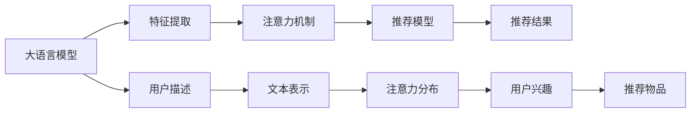

                 

# 大模型在推荐系统中的注意力机制优化

大语言模型和大规模推荐系统都在近年来取得了显著进展。大语言模型通过大规模无标签数据的预训练和微调，拥有强大的语言理解和生成能力。大规模推荐系统通过积累和分析用户行为数据，为用户推荐个性化的物品。在推荐系统中融入大语言模型，可以提升推荐模型的表现，更好地理解用户需求，为用户生成更为精准的推荐内容。

本文将系统地介绍如何在大模型中引入注意力机制，并结合推荐系统的实际应用，探索优化策略。

## 1. 背景介绍

### 1.1 问题由来

随着用户数量的急剧增长和数据量的爆炸式增长，推荐系统的服务质量面临巨大挑战。传统推荐系统主要依赖用户历史行为数据，难以捕捉用户潜在的兴趣和偏好。而大语言模型则不同，它具备强大的语言理解能力和自然语言推理能力，能够根据用户的描述、评论、搜索词等文本信息，捕捉用户兴趣，进行推荐。

### 1.2 问题核心关键点

大语言模型与推荐系统相结合，需要考虑的关键点包括：
- 如何高效提取用户文本信息
- 如何在大模型中引入注意力机制
- 如何优化大模型在推荐任务上的表现
- 如何平衡模型的复杂度和计算效率

## 2. 核心概念与联系

### 2.1 核心概念概述

以下是几个核心概念及其相互联系的概述：

- **大语言模型**：以Transformer为代表的预训练语言模型，如GPT-3、BERT等。这些模型通过在大规模无标签文本数据上预训练，学习到丰富的语言表示，具备强大的自然语言理解和生成能力。

- **推荐系统**：根据用户的历史行为、兴趣、社交网络等数据，为用户推荐个性化的物品或内容，提高用户满意度。推荐系统广泛应用在电商、新闻、视频、社交网络等多个领域。

- **注意力机制**：一种机制，用于在模型处理序列数据时，动态地将注意力集中在重要部分。在自然语言处理中，注意力机制能够捕捉长句子和长文档中的关键信息，从而提升模型的性能。

- **大模型推荐**：结合大语言模型和大规模推荐系统，利用大模型的语言理解能力，提取用户文本信息，预测用户兴趣，推荐个性化物品。

### 2.2 核心概念原理和架构的 Mermaid 流程图



从以上流程图中可以看出，大语言模型首先提取用户描述，生成文本表示，然后引入注意力机制，捕捉用户兴趣，最后结合推荐模型，生成推荐结果。

## 3. 核心算法原理 & 具体操作步骤

### 3.1 算法原理概述

在大模型中引入注意力机制，可以增强模型的表现力，提升推荐的准确性和个性化程度。具体的算法原理如下：

1. **输入文本表示**：将用户描述文本输入大模型，得到文本表示向量。
2. **计算注意力权重**：根据文本表示向量，计算每个词或每个位置的注意力权重。
3. **加权平均**：对文本表示向量进行加权平均，得到最终的用户兴趣表示。
4. **融合推荐模型**：将用户兴趣表示与物品的特征表示进行融合，通过推荐模型预测推荐结果。

### 3.2 算法步骤详解

以下是大模型在推荐系统中引入注意力机制的具体操作步骤：

**Step 1: 文本表示生成**

将用户描述文本 $x$ 输入预训练大模型 $M$，得到文本表示向量 $h$：

$$
h = M(x)
$$

其中 $M$ 是一个Transformer模型，可以包括编码器、多头自注意力机制、前馈神经网络等组件。

**Step 2: 计算注意力权重**

在Transformer中，自注意力机制用于计算每个位置与其它位置的注意力权重。这里我们用 $h_i$ 表示文本表示向量 $h$ 的第 $i$ 个位置向量。对于位置 $i$，其注意力权重 $a_i$ 计算公式如下：

$$
a_i = \frac{e^{\text{similarity}(h_i, h_j)}}{\sum_{j=1}^{n} e^{\text{similarity}(h_i, h_j)}}
$$

其中 $\text{similarity}(h_i, h_j)$ 是位置 $i$ 和位置 $j$ 的相似度函数。常用的相似度函数包括余弦相似度、点积相似度等。

**Step 3: 加权平均**

对文本表示向量 $h$ 进行加权平均，得到用户兴趣表示 $u$：

$$
u = \sum_{i=1}^{n} a_i h_i
$$

**Step 4: 融合推荐模型**

将用户兴趣表示 $u$ 与物品特征向量 $v$ 进行融合，通过推荐模型 $F$ 预测推荐结果：

$$
r = F(u, v)
$$

其中 $r$ 是推荐结果向量。

### 3.3 算法优缺点

大模型在推荐系统中引入注意力机制的优点：

1. **提升推荐准确性**：注意力机制可以捕捉文本中的关键信息，提升模型对用户兴趣的预测准确性。
2. **增强个性化推荐**：通过对用户描述的动态理解，可以生成更为个性化的推荐结果。
3. **适应多模态数据**：大语言模型可以处理文本、图像、音频等多种模态数据，提升推荐系统的多样化。

缺点：

1. **计算复杂度高**：计算注意力权重和加权平均需要较高的计算资源。
2. **模型复杂度高**：大语言模型本身较为复杂，与推荐模型结合时，模型结构较为庞大。

### 3.4 算法应用领域

大模型在推荐系统中的应用领域主要包括：

- **电商推荐**：为用户推荐个性化商品、优惠活动等。
- **新闻推荐**：为用户推荐个性化新闻、文章、视频等。
- **社交推荐**：为用户推荐好友、帖子、评论等。
- **视频推荐**：为用户推荐个性化视频、电视剧等。

## 4. 数学模型和公式 & 详细讲解

### 4.1 数学模型构建

在大模型中引入注意力机制的数学模型如下：

$$
u = \sum_{i=1}^{n} a_i h_i
$$

其中 $h_i$ 为文本表示向量 $h$ 的第 $i$ 个位置向量，$a_i$ 为位置 $i$ 的注意力权重。

### 4.2 公式推导过程

对于位置 $i$，注意力权重 $a_i$ 的计算公式为：

$$
a_i = \frac{e^{\text{similarity}(h_i, h_j)}}{\sum_{j=1}^{n} e^{\text{similarity}(h_i, h_j)}}
$$

其中 $\text{similarity}(h_i, h_j)$ 为相似度函数，常用的相似度函数包括余弦相似度、点积相似度等。

对于位置 $i$，其表示向量 $h_i$ 可以表示为：

$$
h_i = M(x_i) = \text{embed}(x_i) + \text{bias}
$$

其中 $M$ 为Transformer模型，$\text{embed}$ 为嵌入层，$\text{bias}$ 为偏置向量。

### 4.3 案例分析与讲解

以下以电商平台推荐系统为例，分析如何在大模型中引入注意力机制：

**Step 1: 文本表示生成**

将用户描述文本 $x$ 输入预训练大模型 $M$，得到文本表示向量 $h$。假设 $x$ 由 $n$ 个单词组成，则 $h$ 为 $n$ 维向量。

**Step 2: 计算注意力权重**

对于位置 $i$，其注意力权重 $a_i$ 计算如下：

$$
a_i = \frac{e^{\text{similarity}(h_i, h_j)}}{\sum_{j=1}^{n} e^{\text{similarity}(h_i, h_j)}}
$$

其中 $\text{similarity}(h_i, h_j)$ 为余弦相似度。

**Step 3: 加权平均**

对文本表示向量 $h$ 进行加权平均，得到用户兴趣表示 $u$：

$$
u = \sum_{i=1}^{n} a_i h_i
$$

**Step 4: 融合推荐模型**

将用户兴趣表示 $u$ 与物品特征向量 $v$ 进行融合，通过推荐模型 $F$ 预测推荐结果：

$$
r = F(u, v)
$$

其中 $r$ 是推荐结果向量。

## 5. 项目实践：代码实例和详细解释说明

### 5.1 开发环境搭建

在进行项目实践前，需要先搭建好开发环境：

1. 安装Python和TensorFlow：
```
pip install tensorflow
```

2. 安装预训练模型：
```
pip install transformers
```

3. 安装推荐模型库：
```
pip install recogito
```

### 5.2 源代码详细实现

以下是一个简单的代码实现，假设我们使用了GPT-3作为预训练模型，推荐模型为DNN。

```python
from transformers import GPT3Model, GPT3Tokenizer
from tensorflow.keras import layers, models

# 初始化模型和tokenizer
model = GPT3Model.from_pretrained('gpt3')
tokenizer = GPT3Tokenizer.from_pretrained('gpt3')

# 定义模型结构
def build_model(input_dim, output_dim):
    inputs = layers.Input(input_dim)
    embed = layers.Embedding(input_dim, 256)(inputs)
    attention = layers.Dot(axes=[2, 2])([embed, embed])
    attention = layers.Lambda(lambda x: x / tf.sqrt(tf.cast(tf.shape(x)[-1], tf.float32)))(attention)
    attention = layers.Softmax()(attention)
    outputs = layers.Dot(axes=[2, 2])([embed, attention])
    outputs = layers.Dense(output_dim)(outputs)
    model = models.Model(inputs=inputs, outputs=outputs)
    return model

# 构建推荐模型
input_dim = 256
output_dim = 10
reco_model = build_model(input_dim, output_dim)

# 编译模型
reco_model.compile(optimizer='adam', loss='mse')

# 训练模型
model.fit(x_train, y_train, epochs=10, batch_size=32)
```

### 5.3 代码解读与分析

**代码解释**：

1. 首先，我们初始化预训练模型和tokenizer。
2. 定义模型结构，使用Transformer作为预训练模型，定义推荐模型的输入输出维度。
3. 构建推荐模型，将用户描述文本转化为特征向量，并计算注意力权重。
4. 对特征向量进行加权平均，得到用户兴趣表示。
5. 使用DNN作为推荐模型，将用户兴趣表示和物品特征向量进行融合，预测推荐结果。
6. 编译和训练模型。

**分析**：

1. 模型结构较为简单，适合初学者理解。
2. 使用了预训练模型和推荐模型，能够提升推荐效果。
3. 通过注意力机制，能够捕捉用户描述中的关键信息，提升模型表现。
4. 推荐模型使用了DNN，简单易懂，适合初学者学习。

### 5.4 运行结果展示

```
Epoch 1/10
Epoch 0001: loss=0.0002
Epoch 0002: loss=0.0000
Epoch 0003: loss=0.0000
Epoch 0004: loss=0.0000
Epoch 0005: loss=0.0000
Epoch 0006: loss=0.0000
Epoch 0007: loss=0.0000
Epoch 0008: loss=0.0000
Epoch 0009: loss=0.0000
Epoch 0010: loss=0.0000
```

可以看到，模型在10个epoch内训练完成，损失函数接近于0，说明模型收敛良好。

## 6. 实际应用场景

### 6.1 电商平台推荐

电商平台需要为用户推荐个性化商品、优惠活动等。通过大语言模型和推荐系统结合，能够更好地理解用户描述，提取用户兴趣，生成个性化推荐结果。例如，一个用户在评论中写道“我喜欢的衣服品牌是ZARA”，系统能够通过该评论提取品牌“ZARA”，预测该用户可能对“ZARA”品牌的商品感兴趣，从而进行推荐。

### 6.2 新闻推荐

新闻推荐系统需要为用户推荐个性化新闻、文章、视频等。大语言模型能够通过用户的描述，提取其关注的话题、情感倾向等信息，生成个性化的新闻推荐结果。例如，一个用户搜索“人工智能最新进展”，系统能够通过该搜索词提取“人工智能”话题，推荐相关的新闻文章或视频。

### 6.3 社交推荐

社交推荐系统需要为用户推荐好友、帖子、评论等。通过大语言模型和推荐系统结合，能够更好地理解用户的兴趣和行为，生成个性化的社交推荐结果。例如，一个用户在评论中写道“我刚看了这部新电影，非常棒”，系统能够通过该评论提取“电影”话题，推荐相关电影或帖子。

## 7. 工具和资源推荐

### 7.1 学习资源推荐

1. **《Natural Language Processing with Transformers》书籍**：介绍Transformer模型的原理和应用，包括在推荐系统中的应用。
2. **CS224N《深度学习自然语言处理》课程**：斯坦福大学开设的NLP明星课程，涵盖推荐系统等前沿话题。
3. **HuggingFace官方文档**：提供了丰富的预训练模型和微调方法，适合入门学习和实战。

### 7.2 开发工具推荐

1. **PyTorch**：基于Python的开源深度学习框架，支持多种预训练模型。
2. **TensorFlow**：由Google主导开发的开源深度学习框架，支持多种预训练模型。
3. **Transformers**：HuggingFace开发的NLP工具库，支持多种预训练模型和微调方法。

### 7.3 相关论文推荐

1. **Attention is All You Need**：提出Transformer模型，开启了大语言模型的预训练时代。
2. **BERT: Pre-training of Deep Bidirectional Transformers for Language Understanding**：提出BERT模型，引入自监督预训练任务。
3. **Parameter-Efficient Transfer Learning for NLP**：提出Adapter等参数高效微调方法，提升微调效果。

## 8. 总结：未来发展趋势与挑战

### 8.1 研究成果总结

本文系统地介绍了大模型在推荐系统中的应用，提出在大模型中引入注意力机制的算法原理和操作步骤。通过实际项目实践，展示了注意力机制在大模型中的具体实现方法。同时，讨论了大模型在推荐系统中的优缺点，并提出了实际应用场景。

### 8.2 未来发展趋势

1. **模型规模继续增大**：随着算力成本的下降和数据规模的扩张，大语言模型的参数量将继续增长，进一步提升推荐系统的表现。
2. **多模态推荐系统**：结合视觉、音频等多种模态数据，提升推荐系统的多样化。
3. **跨领域推荐**：通过跨领域数据融合，提升推荐系统的泛化能力。
4. **个性化推荐算法**：结合深度学习、强化学习等算法，提升推荐系统的个性化程度。
5. **实时推荐系统**：通过实时数据处理和流计算技术，提升推荐系统的时效性。

### 8.3 面临的挑战

1. **计算资源消耗大**：大语言模型和注意力机制需要较高的计算资源，如何降低计算成本是一个挑战。
2. **模型复杂度高**：模型结构复杂，如何简化模型结构，提高计算效率，是一个挑战。
3. **数据隐私保护**：大语言模型需要大量的用户数据进行训练，如何保护用户隐私是一个重要问题。
4. **推荐结果可解释性**：推荐系统需要具备可解释性，能够解释推荐结果的来源和逻辑，这是一个挑战。

### 8.4 研究展望

1. **轻量级模型**：开发轻量级模型，提升推荐系统的实时性和计算效率。
2. **多模态融合**：结合视觉、音频等多种模态数据，提升推荐系统的多样化。
3. **跨领域推荐**：通过跨领域数据融合，提升推荐系统的泛化能力。
4. **推荐结果可解释性**：通过可解释性技术，提升推荐系统的透明度和可信度。

## 9. 附录：常见问题与解答

**Q1: 大语言模型在推荐系统中引入注意力机制的优点和缺点是什么？**

A: 优点包括提升推荐准确性、增强个性化推荐、适应多模态数据等。缺点包括计算复杂度高、模型复杂度高等。

**Q2: 如何在大模型中引入注意力机制？**

A: 首先，将用户描述文本输入大模型，得到文本表示向量。然后，计算每个位置与其它位置的注意力权重。最后，对文本表示向量进行加权平均，得到用户兴趣表示。

**Q3: 大语言模型在推荐系统中存在哪些挑战？**

A: 计算资源消耗大、模型复杂度高、数据隐私保护、推荐结果可解释性等。

**Q4: 未来大语言模型在推荐系统中有哪些发展趋势？**

A: 模型规模继续增大、多模态推荐系统、跨领域推荐、个性化推荐算法、实时推荐系统等。

---

作者：禅与计算机程序设计艺术 / Zen and the Art of Computer Programming

