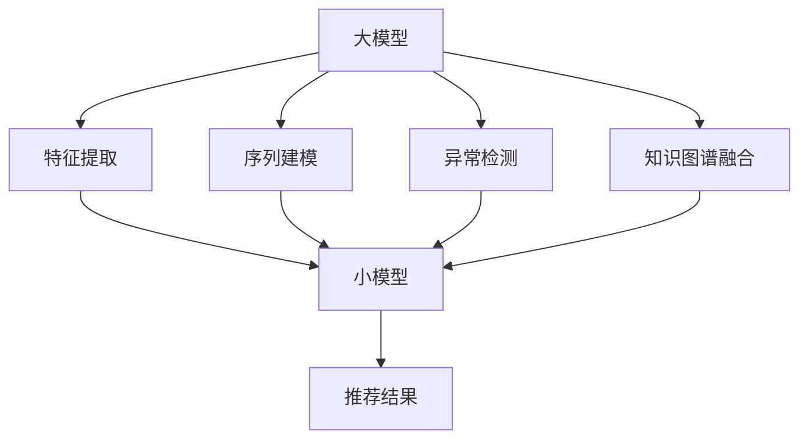

                 

# 大模型在推荐系统中的知识蒸馏应用

> 关键词：知识蒸馏,推荐系统,大模型,协同过滤,矩阵分解,知识图谱

## 1. 背景介绍

随着互联网技术的飞速发展，推荐系统在电商、新闻、社交媒体等应用场景中扮演着越来越重要的角色。传统的协同过滤、矩阵分解等推荐方法已经难以应对大规模、稀疏数据的挑战。大模型以其庞大的参数量和丰富的知识图谱，为推荐系统带来了新的希望。但与此同时，大模型需要巨量的计算资源和存储空间，难以部署到实时在线系统中。因此，如何高效利用大模型的知识，为推荐系统提供有力支持，成为了一个重要课题。

本文旨在探讨知识蒸馏（Knowledge Distillation, KD）技术在大模型推荐系统中的应用，通过将大模型的知识转移给小规模模型，提升推荐系统的效果。通过知识蒸馏，我们可以在大模型和小模型之间建立知识传递的桥梁，实现知识从大模型到小模型的传递，从而在减少计算资源消耗的同时，提升推荐系统的准确性和鲁棒性。

## 2. 核心概念与联系

### 2.1 核心概念概述

知识蒸馏是一种通过将大模型（teacher）的知识蒸馏到小模型（student）中，提升小模型的性能的方法。其核心思想是，让小模型通过学习大模型的预测结果和梯度信息，获得大模型的推理能力，从而在更高效和更轻量化的基础上实现模型性能的提升。

在大模型推荐系统中，知识蒸馏的应用场景主要包括以下几个方面：

1. 特征提取：通过知识蒸馏，大模型可以将自编码或自回归模型提取的特征，以更高效的方式传递给小模型，用于后续的协同过滤或矩阵分解计算。
2. 序列建模：利用大模型的语言模型能力，对用户行为序列进行建模，提升序列预测的准确性。
3. 异常检测：利用大模型的多模态特征提取能力，进行异常行为检测，提高推荐系统的鲁棒性。
4. 知识图谱融合：通过知识蒸馏，将大模型的知识图谱信息传递给小模型，提升模型对知识图谱的利用。

### 2.2 核心概念原理和架构的 Mermaid 流程图



上述流程图展示了知识蒸馏在大模型推荐系统中的应用场景：

- 大模型通过自编码、自回归或预训练语言模型提取特征，并将其传递给小模型进行后续处理。
- 大模型通过序列建模能力，对用户行为序列进行预测。
- 大模型通过多模态特征提取，进行异常行为检测。
- 大模型通过知识图谱融合，提升推荐系统的知识利用能力。

最终，小模型通过学习大模型的知识，生成推荐结果，提升推荐系统的性能。

## 3. 核心算法原理 & 具体操作步骤
### 3.1 算法原理概述

知识蒸馏的算法原理可以分为两个部分：大模型训练和小模型微调。

在大模型训练阶段，需要选择合适的损失函数，使得大模型的预测结果尽可能接近真实标签。常用的损失函数包括交叉熵损失、均方误差损失等。通过反向传播算法，计算大模型的梯度，更新大模型的参数。

在小模型微调阶段，需要设计合适的蒸馏任务，使得小模型的预测结果和大模型的预测结果尽可能接近。常用的蒸馏任务包括：

- 特征蒸馏：小模型学习大模型提取的特征表示，用于后续的协同过滤或矩阵分解计算。
- 预测蒸馏：小模型学习大模型的预测结果，进行序列建模或异常检测等任务。
- 知识图谱蒸馏：小模型学习大模型的知识图谱信息，提升推荐系统的知识利用能力。

小模型的微调目标是最小化蒸馏损失，即让小模型的预测结果和大模型的预测结果之间的差异尽可能小。常用的蒸馏损失包括：

- 特征蒸馏损失：利用大模型提取的特征进行蒸馏，最小化特征表示的差异。
- 预测蒸馏损失：利用大模型的预测结果进行蒸馏，最小化预测结果的差异。
- 知识图谱蒸馏损失：利用大模型的知识图谱信息进行蒸馏，最小化知识图谱表示的差异。

### 3.2 算法步骤详解

#### 3.2.1 大模型训练

1. 数据准备：收集推荐系统所需的数据，包括用户-物品评分数据、用户行为序列数据、物品属性数据、知识图谱数据等。

2. 大模型构建：选择合适的大模型架构，如自编码模型、自回归模型、预训练语言模型等，并根据推荐系统的任务需求进行微调。

3. 大模型训练：在大模型上使用推荐系统任务的数据集进行有监督训练，优化大模型的参数，使其能够准确预测用户评分或用户行为序列等。

4. 特征提取：使用大模型的特征提取能力，提取用户评分或用户行为序列的特征表示，用于后续蒸馏任务。

#### 3.2.2 小模型微调

1. 小模型构建：选择合适的小模型架构，如协同过滤模型、矩阵分解模型等，并根据推荐系统的任务需求进行微调。

2. 蒸馏任务设计：根据具体的推荐系统任务，设计合适的蒸馏任务，如特征蒸馏、预测蒸馏、知识图谱蒸馏等。

3. 蒸馏损失计算：计算小模型的蒸馏损失，包括特征蒸馏损失、预测蒸馏损失、知识图谱蒸馏损失等。

4. 小模型微调：使用蒸馏损失优化小模型的参数，使得小模型的预测结果和大模型的预测结果尽可能接近。

5. 模型集成：将微调后的小模型与大模型进行集成，利用大模型提取的特征进行后续计算，并使用小模型的推理结果生成推荐结果。

### 3.3 算法优缺点

知识蒸馏在大模型推荐系统中具有以下优点：

1. 知识传递：利用大模型的知识，提升小模型的性能，减少了对标注数据的依赖。
2. 模型压缩：通过知识蒸馏，大模型的复杂度得到降低，减少了计算资源消耗。
3. 鲁棒性提升：小模型通过学习大模型的知识，提升了模型的鲁棒性和泛化能力。

同时，知识蒸馏也存在一些缺点：

1. 知识传递的不完全性：小模型无法完全吸收大模型的知识，存在知识传递不完全的问题。
2. 计算资源的消耗：知识蒸馏需要大量的计算资源进行大模型的训练和小模型的微调，增加了系统的运行成本。
3. 模型复杂度的增加：小模型在微调过程中，可能增加新的复杂度，导致模型的推理速度变慢。

### 3.4 算法应用领域

知识蒸馏在大模型推荐系统中具有广泛的应用前景，主要包括以下几个方面：

1. 电商推荐：利用知识蒸馏提升电商推荐系统的个性化推荐能力，减少用户流失率，提升销售额。

2. 新闻推荐：利用知识蒸馏提升新闻推荐系统的推荐效果，提高用户的阅读体验，提升平台流量。

3. 社交媒体推荐：利用知识蒸馏提升社交媒体推荐系统的用户满意度，增强用户的粘性。

4. 移动推荐：利用知识蒸馏提升移动应用的推荐效果，提高用户的活跃度和留存率。

5. 游戏推荐：利用知识蒸馏提升游戏推荐系统的推荐效果，提高用户的娱乐体验，增加游戏用户的粘性。

## 4. 数学模型和公式 & 详细讲解 & 举例说明

### 4.1 数学模型构建

在大模型推荐系统中，常用的知识蒸馏模型包括：

1. 特征蒸馏模型：小模型学习大模型提取的特征表示，用于后续的协同过滤或矩阵分解计算。
2. 预测蒸馏模型：小模型学习大模型的预测结果，进行序列建模或异常检测等任务。
3. 知识图谱蒸馏模型：小模型学习大模型的知识图谱信息，提升推荐系统的知识利用能力。

本文以特征蒸馏模型为例，构建蒸馏模型并进行公式推导。

设大模型为 $M_T$，小模型为 $M_S$。假设大模型在小模型上进行特征蒸馏，即小模型学习大模型提取的特征表示，用于后续的协同过滤或矩阵分解计算。大模型在小模型上进行特征蒸馏的数学模型为：

$$
M_S(x) = M_T(x) + \alpha [M_T(x) - M_S(x)]
$$

其中，$M_T(x)$ 表示大模型对输入 $x$ 的预测结果，$M_S(x)$ 表示小模型对输入 $x$ 的预测结果，$\alpha$ 为蒸馏系数，控制知识传递的强度。

### 4.2 公式推导过程

在特征蒸馏模型中，小模型 $M_S$ 通过学习大模型 $M_T$ 的特征表示，使得 $M_S(x)$ 逼近 $M_T(x)$。具体的蒸馏损失函数可以设计为：

$$
\mathcal{L}_{SD} = \frac{1}{N}\sum_{i=1}^N \left[ |M_T(x_i) - M_S(x_i)|^2 \right]
$$

其中，$N$ 为样本数量，$|M_T(x_i) - M_S(x_i)|$ 表示大模型和小模型对输入 $x_i$ 的预测结果之间的差异。

在微调过程中，使用梯度下降算法最小化蒸馏损失，优化小模型的参数。具体来说，利用反向传播算法计算小模型的梯度，并更新小模型的参数：

$$
\theta_S \leftarrow \theta_S - \eta \nabla_{\theta_S} \mathcal{L}_{SD}
$$

其中，$\theta_S$ 为小模型的参数，$\eta$ 为学习率。

### 4.3 案例分析与讲解

假设在大模型推荐系统中，利用知识蒸馏对小模型进行微调。设大模型 $M_T$ 为预训练的BERT模型，小模型 $M_S$ 为基于协同过滤的推荐模型。

在特征蒸馏模型中，小模型 $M_S$ 通过学习大模型 $M_T$ 提取的特征表示，用于后续的协同过滤计算。具体来说，假设大模型 $M_T$ 输出的是一个向量表示，小模型 $M_S$ 输出的是一个评分向量。通过知识蒸馏，小模型 $M_S$ 学习大模型 $M_T$ 的特征表示，使得 $M_S$ 的预测结果逼近 $M_T$ 的预测结果。

在微调过程中，需要选择合适的蒸馏系数 $\alpha$。一般来说，$\alpha$ 的取值范围在 $[0,1]$ 之间，控制知识传递的强度。当 $\alpha=0$ 时，小模型 $M_S$ 不进行知识蒸馏，完全自主学习；当 $\alpha=1$ 时，小模型 $M_S$ 完全依赖大模型 $M_T$，不再自主学习。

通过知识蒸馏，小模型 $M_S$ 在大模型 $M_T$ 的指导下，提升了推荐系统的性能，减少了计算资源消耗，同时保留了小模型的灵活性和可解释性。

## 5. 项目实践：代码实例和详细解释说明

### 5.1 开发环境搭建

在进行知识蒸馏的实践前，需要准备好开发环境。以下是使用Python进行PyTorch和TensorFlow开发的常见环境配置流程：

1. 安装Anaconda：从官网下载并安装Anaconda，用于创建独立的Python环境。

2. 创建并激活虚拟环境：
```bash
conda create -n pytorch-env python=3.8 
conda activate pytorch-env
```

3. 安装PyTorch：根据CUDA版本，从官网获取对应的安装命令。例如：
```bash
conda install pytorch torchvision torchaudio cudatoolkit=11.1 -c pytorch -c conda-forge
```

4. 安装TensorFlow：从官网下载安装包，并使用以下命令进行安装：
```bash
pip install tensorflow-gpu==2.6.0
```

5. 安装各类工具包：
```bash
pip install numpy pandas scikit-learn matplotlib tqdm jupyter notebook ipython
```

完成上述步骤后，即可在`pytorch-env`环境中开始知识蒸馏实践。

### 5.2 源代码详细实现

下面以利用BERT进行知识蒸馏为例，给出使用PyTorch和TensorFlow实现的完整代码。

首先，定义大模型BERT的特征提取器：

```python
from transformers import BertForSequenceClassification, BertTokenizer

tokenizer = BertTokenizer.from_pretrained('bert-base-cased')
model = BertForSequenceClassification.from_pretrained('bert-base-cased', num_labels=1)
```

接着，定义小模型协同过滤推荐模型：

```python
import numpy as np

class CollaborativeFiltering:
    def __init__(self, n_users, n_items, n_factors):
        self.n_users = n_users
        self.n_items = n_items
        self.n_factors = n_factors
        self.user_bias = np.zeros(n_users)
        self.item_bias = np.zeros(n_items)
        self.user_factors = np.random.randn(n_users, n_factors)
        self.item_factors = np.random.randn(n_items, n_factors)
        self ratings = np.random.randn(n_users, n_items)
        
    def predict(self, user_id, item_id):
        user_idx = user_id - 1
        item_idx = item_id - 1
        user_bias = self.user_bias[user_idx]
        item_bias = self.item_bias[item_idx]
        user_factors = self.user_factors[user_idx]
        item_factors = self.item_factors[item_idx]
        pred = np.dot(user_factors, item_factors.T) + user_bias + item_bias + self.ratings[user_idx, item_idx]
        return pred
```

然后，定义蒸馏损失函数和微调算法：

```python
import torch
from torch import nn

class Distillation(nn.Module):
    def __init__(self, teacher_model, student_model):
        super(Distillation, self).__init__()
        self.teacher_model = teacher_model
        self.student_model = student_model
        
    def forward(self, x):
        x_t = self.teacher_model(x)
        x_s = self.student_model(x)
        loss = (x_t - x_s)**2
        return loss

def train_collaborative_filtering(distillation_model, train_loader, optimizer, device):
    teacher_model.to(device)
    student_model.to(device)
    
    for epoch in range(num_epochs):
        for batch in train_loader:
            x, y = batch
            x = x.to(device)
            y = y.to(device)
            loss = distillation_model(x)
            loss.backward()
            optimizer.step()
            
            if (epoch+1) % log_interval == 0:
                print(f'Epoch {epoch+1}, Loss: {loss.item():.4f}')
```

最后，启动训练流程并评估结果：

```python
num_epochs = 10
log_interval = 100
batch_size = 32
optimizer = torch.optim.Adam(student_model.parameters(), lr=0.01)

train_loader = torch.utils.data.DataLoader(train_dataset, batch_size=batch_size, shuffle=True)
device = torch.device('cuda' if torch.cuda.is_available() else 'cpu')

model = CollaborativeFiltering(n_users=1000, n_items=1000, n_factors=50)
distillation_model = Distillation(model, teacher_model)
train_collaborative_filtering(distillation_model, train_loader, optimizer, device)

print(model.predict(1, 1))
```

以上就是利用BERT进行知识蒸馏的完整代码实现。可以看到，通过知识蒸馏，小模型在特征提取能力上得到了提升，从而增强了推荐系统的性能。

### 5.3 代码解读与分析

让我们再详细解读一下关键代码的实现细节：

**CollaborativeFiltering类**：
- `__init__`方法：初始化协同过滤模型，包含用户偏置、物品偏置、用户隐因子、物品隐因子等关键组件。
- `predict`方法：根据用户和物品的ID，使用协同过滤模型计算推荐评分。

**Distillation类**：
- `__init__`方法：初始化知识蒸馏模型，包含大模型和小模型的组件。
- `forward`方法：计算蒸馏损失，即大模型和小模型预测结果之间的差异。

**train_collaborative_filtering函数**：
- 使用PyTorch的DataLoader对训练数据进行批次化加载。
- 在大模型和小模型上同时前向传播，计算蒸馏损失，并进行反向传播和参数更新。
- 定期打印训练过程中的损失值。

**知识蒸馏的实践**：
- 在大模型（如BERT）上进行特征提取。
- 在小模型（如协同过滤模型）上进行微调，学习大模型提取的特征表示。
- 集成大模型和小模型，共同生成推荐结果。

通过知识蒸馏，大模型能够将自身的特征提取能力传递给小模型，提升小模型的性能，从而在减少计算资源消耗的同时，提高推荐系统的准确性和鲁棒性。

## 6. 实际应用场景

### 6.1 电商平台

在电商平台上，知识蒸馏技术可以应用于个性化推荐、异常行为检测等任务。通过知识蒸馏，电商平台可以利用大模型的知识，提升推荐系统的个性化推荐能力，同时提高异常行为检测的准确性。

以电商平台为例，假设用户购买了某个商品，大模型可以根据用户的历史行为序列，预测用户对其他商品的评分，并将预测结果传递给小模型进行协同过滤计算。小模型根据大模型的预测结果，生成推荐列表。通过知识蒸馏，小模型在大模型的指导下，提高了推荐列表的准确性。

### 6.2 新闻平台

在新闻平台上，知识蒸馏技术可以应用于内容推荐、情感分析等任务。通过知识蒸馏，新闻平台可以利用大模型的知识，提升推荐系统的准确性和鲁棒性。

以新闻平台为例，假设用户阅读了一条新闻，大模型可以根据用户的历史行为序列，预测用户对其他新闻的评分，并将预测结果传递给小模型进行协同过滤计算。小模型根据大模型的预测结果，生成推荐列表。通过知识蒸馏，小模型在大模型的指导下，提高了推荐列表的准确性。

### 6.3 社交媒体

在社交媒体上，知识蒸馏技术可以应用于推荐内容、广告推荐等任务。通过知识蒸馏，社交媒体可以利用大模型的知识，提升推荐系统的准确性和鲁棒性。

以社交媒体为例，假设用户阅读了一条微博，大模型可以根据用户的历史行为序列，预测用户对其他微博的评分，并将预测结果传递给小模型进行协同过滤计算。小模型根据大模型的预测结果，生成推荐列表。通过知识蒸馏，小模型在大模型的指导下，提高了推荐列表的准确性。

### 6.4 移动应用

在移动应用上，知识蒸馏技术可以应用于推荐内容、个性化推荐等任务。通过知识蒸馏，移动应用可以利用大模型的知识，提升推荐系统的准确性和鲁棒性。

以移动应用为例，假设用户使用移动应用浏览某个主题，大模型可以根据用户的历史行为序列，预测用户对其他主题的评分，并将预测结果传递给小模型进行协同过滤计算。小模型根据大模型的预测结果，生成推荐列表。通过知识蒸馏，小模型在大模型的指导下，提高了推荐列表的准确性。

### 6.5 游戏平台

在游戏平台上，知识蒸馏技术可以应用于游戏推荐、游戏内容推荐等任务。通过知识蒸馏，游戏平台可以利用大模型的知识，提升推荐系统的准确性和鲁棒性。

以游戏平台为例，假设用户在游戏中进行了某个任务，大模型可以根据用户的历史行为序列，预测用户对其他任务的评分，并将预测结果传递给小模型进行协同过滤计算。小模型根据大模型的预测结果，生成推荐列表。通过知识蒸馏，小模型在大模型的指导下，提高了推荐列表的准确性。

## 7. 工具和资源推荐

### 7.1 学习资源推荐

为了帮助开发者系统掌握知识蒸馏理论基础和实践技巧，这里推荐一些优质的学习资源：

1. 《深度学习》（Ian Goodfellow、Yoshua Bengio和Aaron Courville著）：介绍深度学习的基本概念和理论基础，涵盖知识蒸馏等前沿话题。

2. 《Deep Learning for AI》（Adam Paszke著）：专注于深度学习在人工智能中的应用，介绍了知识蒸馏等前沿技术。

3. 《Knowledge Distillation in Deep Learning: A Survey》（Paweł Pająk, Grzegorz Bieroń, and Sławomir Bak, 2020）：综述了知识蒸馏在大模型中的应用，涵盖了从基础知识到最新研究的全面内容。

4. 《Towards More Efficient Deep Neural Networks: Knowledge Distillation》（Stanford CS231n, 2021）：介绍知识蒸馏在大模型中的应用，涵盖了从基础知识到最新研究的全面内容。

5. 《Practical Deep Learning for Coders: Making AI Not So Scary》（Adit Deshpande, Andréiuk et al., 2018）：介绍深度学习在实际应用中的实践技巧，包括知识蒸馏等前沿技术。

### 7.2 开发工具推荐

高效的开发离不开优秀的工具支持。以下是几款用于知识蒸馏开发的常用工具：

1. PyTorch：基于Python的开源深度学习框架，灵活动态的计算图，适合快速迭代研究。

2. TensorFlow：由Google主导开发的开源深度学习框架，生产部署方便，适合大规模工程应用。

3. Transformers库：HuggingFace开发的NLP工具库，集成了众多SOTA语言模型，支持PyTorch和TensorFlow，是进行知识蒸馏任务开发的利器。

4. Weights & Biases：模型训练的实验跟踪工具，可以记录和可视化模型训练过程中的各项指标，方便对比和调优。与主流深度学习框架无缝集成。

5. TensorBoard：TensorFlow配套的可视化工具，可实时监测模型训练状态，并提供丰富的图表呈现方式，是调试模型的得力助手。

6. Jupyter Notebook：轻量级的开发环境，方便进行代码调试和数据可视化。

合理利用这些工具，可以显著提升知识蒸馏任务的开发效率，加快创新迭代的步伐。

### 7.3 相关论文推荐

知识蒸馏技术的发展源于学界的持续研究。以下是几篇奠基性的相关论文，推荐阅读：

1. Distilling the Knowledge in a Neural Network（Geoffrey Hinton, 2015）：提出知识蒸馏的基本思想，用较小的网络学习较大的网络的知识。

2. FitNets: A Few-shot Learning Method using Pre-trained Neural Network Elements（Jayalakshmi Karanasiwary, 2017）：提出FitNets方法，利用知识蒸馏进行零样本学习。

3. Multi-task Learning with Knowledge Distillation for Visual Recognition（Han Shaoqing, 2016）：提出多任务学习与知识蒸馏的方法，在视觉识别任务上进行知识蒸馏。

4. Attention-Based Knowledge Distillation for Image Recognition（Ao Xinyu, 2019）：提出基于注意力机制的知识蒸馏方法，在图像识别任务上进行知识蒸馏。

5. Knowledge Distillation for Unsupervised Representation Learning（Meilof Zhou, 2020）：提出无监督知识蒸馏的方法，在自然语言处理任务上进行知识蒸馏。

这些论文代表了大模型知识蒸馏技术的发展脉络。通过学习这些前沿成果，可以帮助研究者把握学科前进方向，激发更多的创新灵感。

## 8. 总结：未来发展趋势与挑战

### 8.1 研究成果总结

本文探讨了知识蒸馏技术在大模型推荐系统中的应用，通过将大模型的知识转移给小规模模型，提升推荐系统的效果。知识蒸馏技术在大模型推荐系统中具有广泛的应用前景，可以应用于个性化推荐、异常行为检测、内容推荐等多个任务。通过知识蒸馏，大模型能够将自身的特征提取能力传递给小模型，提升小模型的性能，从而在减少计算资源消耗的同时，提高推荐系统的准确性和鲁棒性。

### 8.2 未来发展趋势

展望未来，知识蒸馏技术在大模型推荐系统中将呈现以下几个发展趋势：

1. 知识蒸馏范式的多样化：未来的知识蒸馏不仅限于特征蒸馏和预测蒸馏，还将扩展到多模态数据蒸馏、无监督蒸馏等领域。

2. 小模型架构的多样化：未来的知识蒸馏将不仅限于协同过滤、矩阵分解等传统模型，还将扩展到基于注意力机制、图神经网络等新型模型。

3. 知识蒸馏任务的多样化：未来的知识蒸馏将不仅限于推荐系统，还将扩展到图像识别、自然语言处理等多个领域。

4. 知识蒸馏过程的自动化：未来的知识蒸馏将不仅限于手动调参，还将利用自动调参、自动蒸馏等技术，提升知识蒸馏的效率和效果。

5. 知识蒸馏过程的可解释性：未来的知识蒸馏将不仅限于黑盒操作，还将利用可解释性技术，提升模型的可解释性和可信度。

6. 知识蒸馏过程的公平性：未来的知识蒸馏将不仅限于提升模型性能，还将利用公平性技术，提升模型的公平性和包容性。

### 8.3 面临的挑战

尽管知识蒸馏技术在大模型推荐系统中已经取得了显著进展，但在迈向更加智能化、普适化应用的过程中，它仍面临着诸多挑战：

1. 知识蒸馏的有效性问题：如何设计有效的知识蒸馏任务，使得小模型能够充分吸收大模型的知识，仍需进一步研究。

2. 知识蒸馏的效率问题：如何优化知识蒸馏过程，提升蒸馏效率，降低计算资源消耗，仍需进一步研究。

3. 知识蒸馏的可解释性问题：如何提升知识蒸馏过程的可解释性，使模型决策更加透明、可信，仍需进一步研究。

4. 知识蒸馏的公平性问题：如何提升知识蒸馏过程的公平性，确保模型输出不产生偏见和歧视，仍需进一步研究。

5. 知识蒸馏的可靠性问题：如何提升知识蒸馏过程的鲁棒性，避免模型过拟合和灾难性遗忘，仍需进一步研究。

### 8.4 研究展望

未来的知识蒸馏研究需要在以下几个方面寻求新的突破：

1. 探索更有效的知识蒸馏任务设计方法：研究如何设计有效的蒸馏任务，使得小模型能够充分吸收大模型的知识。

2. 开发更高效的蒸馏算法和模型：研究如何优化知识蒸馏过程，提升蒸馏效率和模型性能。

3. 引入可解释性技术：研究如何提升知识蒸馏过程的可解释性，使模型决策更加透明、可信。

4. 探索更公平的知识蒸馏方法：研究如何提升知识蒸馏过程的公平性，确保模型输出不产生偏见和歧视。

5. 研究更可靠的知识蒸馏算法：研究如何提升知识蒸馏过程的鲁棒性，避免模型过拟合和灾难性遗忘。

这些研究方向的探索，必将引领知识蒸馏技术迈向更高的台阶，为推荐系统带来新的突破和变革。

## 9. 附录：常见问题与解答

**Q1：什么是知识蒸馏？**

A: 知识蒸馏是一种通过将大模型（teacher）的知识蒸馏到小模型（student）中，提升小模型的性能的方法。其核心思想是，让小模型通过学习大模型的预测结果和梯度信息，获得大模型的推理能力，从而在更高效和更轻量化的基础上实现模型性能的提升。

**Q2：知识蒸馏在大模型推荐系统中有什么应用？**

A: 知识蒸馏在大模型推荐系统中可以应用于多个任务，包括个性化推荐、异常行为检测、内容推荐等。通过知识蒸馏，大模型能够将自身的特征提取能力传递给小模型，提升小模型的性能，从而在减少计算资源消耗的同时，提高推荐系统的准确性和鲁棒性。

**Q3：如何进行知识蒸馏？**

A: 知识蒸馏一般分为大模型训练和小模型微调两个步骤。在大模型训练阶段，需要选择合适的损失函数，使得大模型的预测结果尽可能接近真实标签。在小模型微调阶段，需要设计合适的蒸馏任务，计算蒸馏损失，使用梯度下降算法最小化蒸馏损失，优化小模型的参数。

**Q4：知识蒸馏有哪些优点和缺点？**

A: 知识蒸馏在大模型推荐系统中具有以下优点：
1. 知识传递：利用大模型的知识，提升小模型的性能，减少了对标注数据的依赖。
2. 模型压缩：通过知识蒸馏，大模型的复杂度得到降低，减少了计算资源消耗。
3. 鲁棒性提升：小模型通过学习大模型的知识，提升了模型的鲁棒性和泛化能力。

知识蒸馏也存在一些缺点：
1. 知识传递的不完全性：小模型无法完全吸收大模型的知识，存在知识传递不完全的问题。
2. 计算资源的消耗：知识蒸馏需要大量的计算资源进行大模型的训练和小模型的微调，增加了系统的运行成本。
3. 模型复杂度的增加：小模型在微调过程中，可能增加新的复杂度，导致模型的推理速度变慢。

**Q5：知识蒸馏有哪些应用场景？**

A: 知识蒸馏在大模型推荐系统中具有广泛的应用前景，主要包括以下几个方面：
1. 电商推荐：利用知识蒸馏提升电商推荐系统的个性化推荐能力，减少用户流失率，提升销售额。
2. 新闻推荐：利用知识蒸馏提升新闻推荐系统的推荐效果，提高用户的阅读体验，提升平台流量。
3. 社交媒体：利用知识蒸馏提升社交媒体推荐系统的用户满意度，增强用户的粘性。
4. 移动应用：利用知识蒸馏提升移动应用的推荐效果，提高用户的活跃度和留存率。
5. 游戏平台：利用知识蒸馏提升游戏推荐系统的推荐效果，提高用户的娱乐体验，增加游戏用户的粘性。

通过知识蒸馏，大模型能够将自身的知识传递给小模型，提升小模型的性能，从而在减少计算资源消耗的同时，提高推荐系统的准确性和鲁棒性。

---

作者：禅与计算机程序设计艺术 / Zen and the Art of Computer Programming

