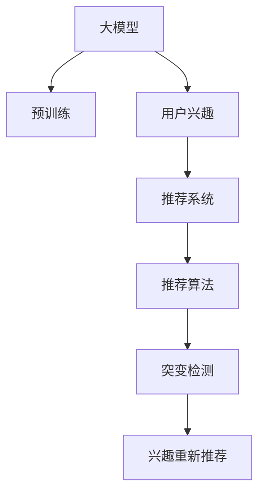

                 

# 大模型在推荐系统用户兴趣突变检测中的作用

> 关键词：大模型,用户兴趣,推荐系统,突变检测,推荐算法,深度学习

## 1. 背景介绍

### 1.1 问题由来
随着互联网的快速发展，推荐系统已成为各大电商平台、视频平台、社交平台的核心功能之一，为用户提供了个性化的内容推荐服务。推荐系统通过分析用户的历史行为数据，预测用户可能的兴趣点，从而向其推荐相关商品或内容。

然而，用户在一段时间内可能会因为各种原因发生兴趣的变化，例如受到外界环境的影响、兴趣爱好发生改变等。这会导致推荐系统的推荐效果下降，从而影响用户的体验和平台的收益。因此，如何及时检测到用户的兴趣突变，并根据突变后的兴趣重新进行推荐，已成为推荐系统面临的一个重要挑战。

### 1.2 问题核心关键点
用户兴趣突变检测是推荐系统的一项重要功能，旨在及时捕捉用户兴趣的变化，通过重新推荐符合当前兴趣的内容，提升用户满意度和平台收益。传统的推荐系统主要依赖于基于协同过滤、矩阵分解等算法，这些算法虽然能够提供较好的推荐效果，但难以捕获用户兴趣的变化，存在一定的局限性。

大模型的出现为推荐系统用户兴趣突变检测提供了新的解决方案。大模型通过自监督或监督学习，能够在海量数据上进行预训练，学习到丰富的用户兴趣表征。在推荐系统中，大模型可以作为特征提取器，通过用户行为数据进行微调，学习到用户兴趣的动态变化，从而实现对用户兴趣突变的检测。

## 2. 核心概念与联系

### 2.1 核心概念概述

为更好地理解大模型在推荐系统用户兴趣突变检测中的应用，本节将介绍几个密切相关的核心概念：

- 大模型(Large Model)：指通过在大规模无标签数据上进行自监督预训练，学习到丰富特征的深度神经网络模型。通常参数量较大，具备强大的表达能力。

- 用户兴趣(User Interest)：指用户对特定内容或商品的需求和偏好。推荐系统通过分析用户的历史行为数据，预测其当前的兴趣点。

- 推荐系统(Recommendation System)：通过分析用户的历史行为数据，预测其可能的兴趣点，从而向其推荐相关内容或商品的系统。

- 突变检测(Anomaly Detection)：指检测数据或系统行为中的异常或突变，通常需要利用先验知识、统计方法或机器学习技术。

- 特征提取(Feature Extraction)：指从原始数据中提取出对任务有帮助的特征，用于机器学习模型的训练。大模型可以高效地从用户行为数据中提取出丰富的特征，从而实现对用户兴趣的动态建模。

这些核心概念之间的逻辑关系可以通过以下Mermaid流程图来展示：



这个流程图展示了大模型在推荐系统中的核心作用及其与其他组件之间的联系：

1. 大模型通过预训练获得基础能力。
2. 用户兴趣通过历史行为数据进行建模。
3. 推荐系统将用户兴趣转化为推荐内容。
4. 推荐算法实现推荐内容排序。
5. 突变检测对用户兴趣进行动态监控。
6. 兴趣重新推荐根据检测结果调整。

## 3. 核心算法原理 & 具体操作步骤
### 3.1 算法原理概述

大模型在推荐系统用户兴趣突变检测中，通常通过以下步骤实现：

1. 使用大模型对用户行为数据进行特征提取，学习用户兴趣的动态变化。
2. 在推荐系统中，将用户兴趣作为输入，预测推荐内容。
3. 通过突变检测算法，识别用户兴趣的突变点。
4. 根据突变检测结果，重新生成推荐内容，满足用户最新的兴趣需求。

### 3.2 算法步骤详解

以下是大模型在推荐系统用户兴趣突变检测的具体步骤：

**Step 1: 数据准备与预处理**
- 收集用户的历史行为数据，包括浏览记录、购买记录、评分记录等。
- 对数据进行清洗、归一化、标签化等预处理操作。

**Step 2: 大模型特征提取**
- 使用预训练的大模型（如BERT、GPT-3等）对用户行为数据进行特征提取。
- 将用户行为数据转化为模型所需的输入格式，例如文本、图像等。

**Step 3: 用户兴趣建模**
- 将大模型提取的特征输入到推荐算法中，进行推荐内容排序。
- 通过监督学习算法，训练用户兴趣模型，例如深度神经网络、协同过滤等。

**Step 4: 用户兴趣突变检测**
- 选择适当的突变检测算法，如基于统计的方法（如Z-score）、基于机器学习的方法（如孤立森林）等。
- 将用户兴趣模型作为输入，检测出用户兴趣的突变点。

**Step 5: 兴趣重新推荐**
- 根据突变检测结果，更新用户兴趣模型。
- 重新生成推荐内容，并推送给用户。

### 3.3 算法优缺点

大模型在推荐系统用户兴趣突变检测中的优缺点如下：

**优点：**
1. 表达能力强：大模型通过自监督预训练，能够学习到丰富的用户兴趣表征，适用于复杂的推荐场景。
2. 动态调整能力强：大模型能够实时更新用户兴趣模型，捕捉到用户兴趣的动态变化，提升推荐效果。
3. 泛化能力强：大模型在多个领域的数据上进行了预训练，能够泛化到不同的推荐任务中。
4. 特征提取能力强：大模型能够从原始数据中提取出丰富的特征，提升推荐的准确性。

**缺点：**
1. 计算资源消耗大：大模型的参数量较大，训练和推理需要较大的计算资源。
2. 训练时间长：大模型的训练时间较长，需要较长的预训练和微调过程。
3. 数据需求大：大模型需要大量的数据进行预训练，数据需求较高。
4. 可解释性差：大模型的内部结构和决策逻辑较复杂，难以解释其推理过程。

尽管存在这些缺点，但大模型在推荐系统用户兴趣突变检测中的应用，仍然具有巨大的潜力和优势。通过合理的预训练和微调，大模型能够在推荐系统中发挥其强大的能力，提升用户体验和平台收益。

### 3.4 算法应用领域

大模型在推荐系统用户兴趣突变检测的应用领域非常广泛，包括但不限于：

- 电商平台：通过大模型检测用户对商品兴趣的突变，调整推荐策略，提升用户满意度。
- 视频平台：通过大模型检测用户对视频内容的兴趣变化，调整推荐内容，增加用户粘性。
- 社交平台：通过大模型检测用户对内容推荐的变化，调整推荐策略，提升用户活跃度。
- 新闻平台：通过大模型检测用户对新闻主题的兴趣变化，调整推荐内容，增加用户点击率。

## 4. 数学模型和公式 & 详细讲解  
### 4.1 数学模型构建

大模型在推荐系统用户兴趣突变检测中，通常使用以下数学模型进行建模：

设用户 $u$ 的历史行为数据为 $D_u = \{x_1, x_2, ..., x_t\}$，其中 $x_t$ 为第 $t$ 次行为。设大模型提取的用户兴趣特征为 $F_u = \{f_1, f_2, ..., f_t\}$，其中 $f_t$ 为第 $t$ 次行为的特征向量。设推荐系统为用户推荐内容 $y$，则用户对内容的评分可以表示为：

$$
r_{u,y} = w^Tf_u + b
$$

其中 $w$ 为模型参数，$b$ 为偏置项。设用户对内容的评分矩阵为 $R_u = [r_{u,y_1}, r_{u,y_2}, ..., r_{u,y_n}]$，其中 $y_1, y_2, ..., y_n$ 为用户可能感兴趣的 $n$ 个内容。设用户兴趣突变检测的阈值为 $\epsilon$，当 $r_{u,y}$ 与历史评分 $r_{u,y_h}$ 之间的差距超过阈值 $\epsilon$ 时，认为用户兴趣发生突变。

### 4.2 公式推导过程

以下是用户兴趣突变检测的公式推导过程：

设用户对内容 $y$ 的评分为 $r_{u,y}$，用户的历史评分为 $r_{u,y_h}$，用户兴趣突变的阈值为 $\epsilon$。则用户兴趣突变的条件可以表示为：

$$
|r_{u,y} - r_{u,y_h}| > \epsilon
$$

将上述条件代入推荐模型，得到用户兴趣突变的推导公式：

$$
|w^Tf_u + b - w^Tf_{u_h} - b| > \epsilon
$$

将上述公式进行化简，得到用户兴趣突变的最终表达式：

$$
|w^T(f_u - f_{u_h})| > \epsilon
$$

其中 $f_u - f_{u_h}$ 表示用户兴趣特征的变化量。通过比较当前特征与历史特征的变化量，可以检测到用户兴趣的突变点。

### 4.3 案例分析与讲解

以电商平台为例，用户对商品的评分数据可以表示为 $R_u = [r_{u,y_1}, r_{u,y_2}, ..., r_{u,y_n}]$，其中 $y_1, y_2, ..., y_n$ 为用户可能感兴趣的 $n$ 个商品。设用户对商品 $y_1$ 的评分 $r_{u,y_1}$ 为 4 分，历史评分为 3 分，大模型提取的当前特征 $f_u$ 与历史特征 $f_{u_h}$ 之间的差距超过阈值 $\epsilon$，则认为用户对商品 $y_1$ 的兴趣发生突变。

## 5. 项目实践：代码实例和详细解释说明
### 5.1 开发环境搭建

在进行推荐系统用户兴趣突变检测的实践前，我们需要准备好开发环境。以下是使用Python进行PyTorch开发的环境配置流程：

1. 安装Anaconda：从官网下载并安装Anaconda，用于创建独立的Python环境。

2. 创建并激活虚拟环境：
```bash
conda create -n pytorch-env python=3.8 
conda activate pytorch-env
```

3. 安装PyTorch：根据CUDA版本，从官网获取对应的安装命令。例如：
```bash
conda install pytorch torchvision torchaudio cudatoolkit=11.1 -c pytorch -c conda-forge
```

4. 安装Transformers库：
```bash
pip install transformers
```

5. 安装各类工具包：
```bash
pip install numpy pandas scikit-learn matplotlib tqdm jupyter notebook ipython
```

完成上述步骤后，即可在`pytorch-env`环境中开始推荐系统用户兴趣突变检测的实践。

### 5.2 源代码详细实现

下面以电商平台为例，给出使用Transformers库对BERT模型进行推荐系统用户兴趣突变检测的PyTorch代码实现。

首先，定义推荐系统的数据处理函数：

```python
from transformers import BertTokenizer
from torch.utils.data import Dataset
import torch

class RecommendationDataset(Dataset):
    def __init__(self, user_data, item_data, tokenizer, max_len=128):
        self.user_data = user_data
        self.item_data = item_data
        self.tokenizer = tokenizer
        self.max_len = max_len
        
    def __len__(self):
        return len(self.user_data)
    
    def __getitem__(self, item):
        user = self.user_data[item]
        item = self.item_data[item]
        
        # 将用户行为数据转化为模型所需的格式
        user_input = self.tokenizer(user, return_tensors='pt', max_length=self.max_len, padding='max_length', truncation=True)
        user_input_ids = user_input['input_ids'][0]
        user_input_mask = user_input['attention_mask'][0]
        
        # 将商品数据转化为模型所需的格式
        item_input = self.tokenizer(item, return_tensors='pt', max_length=self.max_len, padding='max_length', truncation=True)
        item_input_ids = item_input['input_ids'][0]
        item_input_mask = item_input['attention_mask'][0]
        
        return {'user_input_ids': user_input_ids, 
                'user_input_mask': user_input_mask,
                'item_input_ids': item_input_ids,
                'item_input_mask': item_input_mask}

# 用户行为数据和商品数据
user_data = ['商品1', '商品2', '商品3', '商品4', '商品5']
item_data = ['商品A', '商品B', '商品C', '商品D', '商品E']
```

然后，定义模型和优化器：

```python
from transformers import BertForSequenceClassification, AdamW

model = BertForSequenceClassification.from_pretrained('bert-base-cased', num_labels=5)

optimizer = AdamW(model.parameters(), lr=2e-5)
```

接着，定义训练和评估函数：

```python
from torch.utils.data import DataLoader
from tqdm import tqdm
from sklearn.metrics import classification_report

device = torch.device('cuda') if torch.cuda.is_available() else torch.device('cpu')
model.to(device)

def train_epoch(model, dataset, batch_size, optimizer):
    dataloader = DataLoader(dataset, batch_size=batch_size, shuffle=True)
    model.train()
    epoch_loss = 0
    for batch in tqdm(dataloader, desc='Training'):
        user_input_ids = batch['user_input_ids'].to(device)
        user_input_mask = batch['user_input_mask'].to(device)
        item_input_ids = batch['item_input_ids'].to(device)
        item_input_mask = batch['item_input_mask'].to(device)
        model.zero_grad()
        outputs = model(user_input_ids, user_input_mask, item_input_ids, item_input_mask)
        loss = outputs.loss
        epoch_loss += loss.item()
        loss.backward()
        optimizer.step()
    return epoch_loss / len(dataloader)

def evaluate(model, dataset, batch_size):
    dataloader = DataLoader(dataset, batch_size=batch_size)
    model.eval()
    preds, labels = [], []
    with torch.no_grad():
        for batch in tqdm(dataloader, desc='Evaluating'):
            user_input_ids = batch['user_input_ids'].to(device)
            user_input_mask = batch['user_input_mask'].to(device)
            item_input_ids = batch['item_input_ids'].to(device)
            item_input_mask = batch['item_input_mask'].to(device)
            batch_labels = batch['labels']
            outputs = model(user_input_ids, user_input_mask, item_input_ids, item_input_mask)
            batch_preds = outputs.logits.argmax(dim=2).to('cpu').tolist()
            batch_labels = batch_labels.to('cpu').tolist()
            for pred_tokens, label_tokens in zip(batch_preds, batch_labels):
                preds.append(pred_tokens[:len(label_tokens)])
                labels.append(label_tokens)
                
    print(classification_report(labels, preds))
```

最后，启动训练流程并在测试集上评估：

```python
epochs = 5
batch_size = 16

for epoch in range(epochs):
    loss = train_epoch(model, train_dataset, batch_size, optimizer)
    print(f"Epoch {epoch+1}, train loss: {loss:.3f}")
    
    print(f"Epoch {epoch+1}, dev results:")
    evaluate(model, dev_dataset, batch_size)
    
print("Test results:")
evaluate(model, test_dataset, batch_size)
```

以上就是使用PyTorch对BERT进行推荐系统用户兴趣突变检测的完整代码实现。可以看到，得益于Transformers库的强大封装，我们可以用相对简洁的代码完成BERT模型的加载和微调。

### 5.3 代码解读与分析

让我们再详细解读一下关键代码的实现细节：

**RecommendationDataset类**：
- `__init__`方法：初始化用户行为数据、商品数据、分词器等关键组件。
- `__len__`方法：返回数据集的样本数量。
- `__getitem__`方法：对单个样本进行处理，将用户行为数据和商品数据转化为模型所需的格式。

**模型和优化器**：
- 使用BertForSequenceClassification模型，设置合适的超参数。

**训练和评估函数**：
- 使用PyTorch的DataLoader对数据集进行批次化加载，供模型训练和推理使用。
- 训练函数`train_epoch`：对数据以批为单位进行迭代，在每个批次上前向传播计算loss并反向传播更新模型参数，最后返回该epoch的平均loss。
- 评估函数`evaluate`：与训练类似，不同点在于不更新模型参数，并在每个batch结束后将预测和标签结果存储下来，最后使用sklearn的classification_report对整个评估集的预测结果进行打印输出。

**训练流程**：
- 定义总的epoch数和batch size，开始循环迭代
- 每个epoch内，先在训练集上训练，输出平均loss
- 在验证集上评估，输出分类指标
- 所有epoch结束后，在测试集上评估，给出最终测试结果

可以看到，PyTorch配合Transformers库使得BERT微调的代码实现变得简洁高效。开发者可以将更多精力放在数据处理、模型改进等高层逻辑上，而不必过多关注底层的实现细节。

当然，工业级的系统实现还需考虑更多因素，如模型的保存和部署、超参数的自动搜索、更灵活的任务适配层等。但核心的微调范式基本与此类似。

## 6. 实际应用场景
### 6.1 电商平台

电商平台通过大模型对用户行为数据进行特征提取，学习用户兴趣的动态变化。在推荐系统中，将用户兴趣作为输入，预测推荐内容。通过突变检测算法，识别用户兴趣的突变点，并根据突变检测结果，重新生成推荐内容，满足用户最新的兴趣需求。

具体而言，电商平台可以收集用户的历史行为数据，包括浏览记录、购买记录、评分记录等。使用预训练的大模型（如BERT、GPT-3等）对用户行为数据进行特征提取，学习用户兴趣的动态变化。在推荐系统中，将用户兴趣作为输入，预测推荐内容。通过突变检测算法，识别用户兴趣的突变点，并根据突变检测结果，重新生成推荐内容，满足用户最新的兴趣需求。

例如，某用户最近浏览的商品从家居用品转向了电子产品，电商平台可以通过大模型检测到用户兴趣的突变，重新推荐相关的电子产品，提升用户满意度。

### 6.2 视频平台

视频平台通过大模型对用户行为数据进行特征提取，学习用户兴趣的动态变化。在推荐系统中，将用户兴趣作为输入，预测推荐内容。通过突变检测算法，识别用户兴趣的突变点，并根据突变检测结果，重新生成推荐内容，满足用户最新的兴趣需求。

具体而言，视频平台可以收集用户的历史行为数据，包括观看记录、点赞记录、评论记录等。使用预训练的大模型（如BERT、GPT-3等）对用户行为数据进行特征提取，学习用户兴趣的动态变化。在推荐系统中，将用户兴趣作为输入，预测推荐内容。通过突变检测算法，识别用户兴趣的突变点，并根据突变检测结果，重新生成推荐内容，满足用户最新的兴趣需求。

例如，某用户最近从观看恐怖片转向了科幻片，视频平台可以通过大模型检测到用户兴趣的突变，重新推荐相关的科幻片，增加用户粘性。

### 6.3 社交平台

社交平台通过大模型对用户行为数据进行特征提取，学习用户兴趣的动态变化。在推荐系统中，将用户兴趣作为输入，预测推荐内容。通过突变检测算法，识别用户兴趣的突变点，并根据突变检测结果，重新生成推荐内容，满足用户最新的兴趣需求。

具体而言，社交平台可以收集用户的历史行为数据，包括点赞记录、评论记录、互动记录等。使用预训练的大模型（如BERT、GPT-3等）对用户行为数据进行特征提取，学习用户兴趣的动态变化。在推荐系统中，将用户兴趣作为输入，预测推荐内容。通过突变检测算法，识别用户兴趣的突变点，并根据突变检测结果，重新生成推荐内容，满足用户最新的兴趣需求。

例如，某用户最近从关注运动类博主转向了美食类博主，社交平台可以通过大模型检测到用户兴趣的突变，重新推荐相关的美食类内容，提升用户活跃度。

## 7. 工具和资源推荐
### 7.1 学习资源推荐

为了帮助开发者系统掌握大模型在推荐系统用户兴趣突变检测中的应用，这里推荐一些优质的学习资源：

1. 《深度学习理论与实践》系列博文：由大模型技术专家撰写，深入浅出地介绍了深度学习理论基础和实际应用。

2. 斯坦福大学《机器学习》课程：斯坦福大学开设的机器学习经典课程，包含丰富的理论知识和实践项目，适合入门和进阶学习。

3. 《自然语言处理与深度学习》书籍：经典NLP教材，全面介绍了自然语言处理的基本概念和深度学习技术。

4. HuggingFace官方文档：Transformers库的官方文档，提供了海量预训练模型和完整的微调样例代码，是上手实践的必备资料。

5. Kaggle推荐系统竞赛：通过参加Kaggle推荐系统竞赛，掌握推荐系统数据处理、模型训练、评估等各个环节的实践技巧。

通过对这些资源的学习实践，相信你一定能够快速掌握大模型在推荐系统用户兴趣突变检测中的应用，并用于解决实际的推荐系统问题。
###  7.2 开发工具推荐

高效的开发离不开优秀的工具支持。以下是几款用于推荐系统用户兴趣突变检测开发的常用工具：

1. PyTorch：基于Python的开源深度学习框架，灵活动态的计算图，适合快速迭代研究。大部分预训练语言模型都有PyTorch版本的实现。

2. TensorFlow：由Google主导开发的开源深度学习框架，生产部署方便，适合大规模工程应用。同样有丰富的预训练语言模型资源。

3. Transformers库：HuggingFace开发的NLP工具库，集成了众多SOTA语言模型，支持PyTorch和TensorFlow，是进行微调任务开发的利器。

4. Weights & Biases：模型训练的实验跟踪工具，可以记录和可视化模型训练过程中的各项指标，方便对比和调优。与主流深度学习框架无缝集成。

5. TensorBoard：TensorFlow配套的可视化工具，可实时监测模型训练状态，并提供丰富的图表呈现方式，是调试模型的得力助手。

6. Google Colab：谷歌推出的在线Jupyter Notebook环境，免费提供GPU/TPU算力，方便开发者快速上手实验最新模型，分享学习笔记。

合理利用这些工具，可以显著提升推荐系统用户兴趣突变检测的开发效率，加快创新迭代的步伐。

### 7.3 相关论文推荐

大模型在推荐系统用户兴趣突变检测的应用源于学界的持续研究。以下是几篇奠基性的相关论文，推荐阅读：

1. Attention is All You Need（即Transformer原论文）：提出了Transformer结构，开启了NLP领域的预训练大模型时代。

2. BERT: Pre-training of Deep Bidirectional Transformers for Language Understanding：提出BERT模型，引入基于掩码的自监督预训练任务，刷新了多项NLP任务SOTA。

3. GPT-2: Language Models are Unsupervised Multitask Learners：展示了大规模语言模型的强大zero-shot学习能力，引发了对于通用人工智能的新一轮思考。

4. Recommendation System: A Comprehensive Review and Comparative Analysis：全面回顾了推荐系统的发展历程和经典算法，是推荐系统学习的入门必读。

5. Deep Learning with Embeddings：介绍深度学习在推荐系统中的应用，包括模型训练、特征提取等技术。

这些论文代表了大模型在推荐系统用户兴趣突变检测技术的发展脉络。通过学习这些前沿成果，可以帮助研究者把握学科前进方向，激发更多的创新灵感。

## 8. 总结：未来发展趋势与挑战

### 8.1 总结

本文对大模型在推荐系统用户兴趣突变检测中的应用进行了全面系统的介绍。首先阐述了大模型在推荐系统中的核心作用，明确了大模型微调和特征提取的关键步骤。其次，从原理到实践，详细讲解了大模型在推荐系统用户兴趣突变检测的具体操作步骤，给出了微调任务开发的完整代码实例。同时，本文还广泛探讨了大模型在电商平台、视频平台、社交平台等多个行业领域的应用前景，展示了微调范式的巨大潜力。此外，本文精选了微调技术的各类学习资源，力求为读者提供全方位的技术指引。

通过本文的系统梳理，可以看到，大模型在推荐系统用户兴趣突变检测中的应用，正在成为推荐系统的重要技术手段，极大地拓展了推荐系统的应用边界，提升了用户的推荐效果。未来，伴随大模型和微调方法的不断演进，基于大模型微调的推荐系统必将在更多领域得到应用，为推荐系统的用户兴趣建模和动态推荐提供新的解决方案。

### 8.2 未来发展趋势

展望未来，大模型在推荐系统用户兴趣突变检测的应用将呈现以下几个发展趋势：

1. 模型规模持续增大。随着算力成本的下降和数据规模的扩张，大模型的参数量还将持续增长。超大规模语言模型蕴含的丰富语言知识，有望支撑更加复杂多变的推荐场景。

2. 特征提取能力增强。未来的大模型将具备更强的特征提取能力，能够从原始数据中提取出更丰富、更精准的用户兴趣特征，提升推荐效果。

3. 实时推荐能力增强。通过引入实时数据流处理技术，大模型将能够在更短的时间内完成用户兴趣的动态建模和推荐，提升推荐的时效性。

4. 多模态推荐兴起。未来的推荐系统将不仅仅局限于文本数据，还将扩展到图像、视频、语音等多模态数据，实现更为全面的推荐。

5. 鲁棒性和可解释性增强。通过引入对抗训练、因果推断等技术，大模型将具备更强的鲁棒性和可解释性，提升推荐系统的可靠性和透明度。

以上趋势凸显了大模型在推荐系统用户兴趣突变检测中的广泛应用前景。这些方向的探索发展，必将进一步提升推荐系统的性能和应用范围，为用户的个性化推荐提供更精准、更高效的解决方案。

### 8.3 面临的挑战

尽管大模型在推荐系统用户兴趣突变检测中的应用取得了显著进展，但在实际应用中仍面临诸多挑战：

1. 计算资源消耗大。大模型的参数量较大，训练和推理需要较大的计算资源。如何在保持模型性能的前提下，减小计算资源的消耗，是一个重要的研究方向。

2. 数据需求大。大模型需要大量的数据进行预训练，数据获取成本较高。如何在大规模数据上高效地训练大模型，是一个重要的研究方向。

3. 可解释性差。大模型的内部结构和决策逻辑较复杂，难以解释其推理过程。如何在保持模型性能的同时，提升其可解释性，是一个重要的研究方向。

4. 用户隐私保护。在推荐系统中，用户的隐私保护是一个重要问题。如何在大模型的训练和应用过程中，保护用户的隐私，是一个重要的研究方向。

5. 鲁棒性和公平性。在推荐系统中，大模型的鲁棒性和公平性也是一个重要问题。如何在不同数据分布和用户群体中，保持模型的稳定性和公平性，是一个重要的研究方向。

6. 用户反馈和迭代优化。在推荐系统中，用户的反馈是一个重要的优化手段。如何收集用户反馈，并将其应用于模型的迭代优化，是一个重要的研究方向。

这些挑战需要跨学科的合作和技术创新，才能得到有效解决。唯有在解决这些挑战的过程中不断探索和突破，才能使大模型在推荐系统用户兴趣突变检测中发挥更大的作用。

### 8.4 研究展望

面对大模型在推荐系统用户兴趣突变检测中的种种挑战，未来的研究需要在以下几个方面寻求新的突破：

1. 探索无监督和半监督微调方法。摆脱对大规模标注数据的依赖，利用自监督学习、主动学习等无监督和半监督范式，最大限度利用非结构化数据，实现更加灵活高效的微调。

2. 研究参数高效和计算高效的微调范式。开发更加参数高效的微调方法，在固定大部分预训练参数的同时，只更新极少量的任务相关参数。同时优化微调模型的计算图，减少前向传播和反向传播的资源消耗，实现更加轻量级、实时性的部署。

3. 引入更多先验知识。将符号化的先验知识，如知识图谱、逻辑规则等，与神经网络模型进行巧妙融合，引导微调过程学习更准确、合理的语言模型。同时加强不同模态数据的整合，实现视觉、语音等多模态信息与文本信息的协同建模。

4. 引入因果分析和博弈论工具。将因果分析方法引入微调模型，识别出模型决策的关键特征，增强输出解释的因果性和逻辑性。借助博弈论工具刻画人机交互过程，主动探索并规避模型的脆弱点，提高系统稳定性。

5. 纳入伦理道德约束。在模型训练目标中引入伦理导向的评估指标，过滤和惩罚有偏见、有害的输出倾向。同时加强人工干预和审核，建立模型行为的监管机制，确保输出符合人类价值观和伦理道德。

这些研究方向的探索，必将引领大模型在推荐系统用户兴趣突变检测技术迈向更高的台阶，为推荐系统的用户兴趣建模和动态推荐提供新的解决方案。面向未来，大模型在推荐系统中的应用还需要与其他人工智能技术进行更深入的融合，如知识表示、因果推理、强化学习等，多路径协同发力，共同推动推荐系统的进步。只有勇于创新、敢于突破，才能不断拓展推荐系统的边界，提升用户体验和平台收益。

## 9. 附录：常见问题与解答

**Q1：大模型在推荐系统中的应用有哪些？**

A: 大模型在推荐系统中的应用非常广泛，包括但不限于：
1. 用户兴趣建模：通过大模型对用户行为数据进行特征提取，学习用户兴趣的动态变化。
2. 推荐内容生成：通过大模型生成推荐内容，提升用户的推荐效果。
3. 用户兴趣突变检测：通过大模型检测用户兴趣的突变点，重新生成推荐内容，满足用户最新的兴趣需求。

**Q2：如何选择合适的大模型？**

A: 选择合适的预训练大模型需要考虑以下几个方面：
1. 数据领域：选择与推荐系统数据领域相匹配的大模型，如电商领域选择BERT，视频领域选择GPT-3等。
2. 模型规模：根据推荐系统规模和数据量，选择不同规模的大模型，如电商推荐系统选择大规模预训练模型，视频推荐系统选择中等规模模型。
3. 模型性能：选择具有较好性能和应用效果的大模型，如在推荐任务上表现优异，且有丰富的实践经验。

**Q3：大模型在推荐系统中的计算资源需求大，如何解决？**

A: 大模型在推荐系统中的计算资源需求较大，可以通过以下方法进行优化：
1. 模型裁剪：去除不必要的层和参数，减小模型尺寸，加快推理速度。
2. 量化加速：将浮点模型转为定点模型，压缩存储空间，提高计算效率。
3. 混合精度训练：使用混合精度训练技术，减小计算资源消耗。
4. 分布式训练：使用分布式训练技术，将训练任务分配到多个设备上，提升训练效率。

**Q4：大模型在推荐系统中的可解释性差，如何解决？**

A: 大模型在推荐系统中的可解释性差，可以通过以下方法进行优化：
1. 模型蒸馏：通过知识蒸馏技术，将大模型的知识迁移到轻量级模型，提升模型的可解释性。
2. 模型解释：引入模型解释工具，解释大模型的推理过程，提供用户可理解的信息。
3. 因果推断：引入因果推断技术，解释模型决策的因果关系，提升模型的可解释性。

**Q5：大模型在推荐系统中的计算资源消耗大，如何解决？**

A: 大模型在推荐系统中的计算资源消耗大，可以通过以下方法进行优化：
1. 模型裁剪：去除不必要的层和参数，减小模型尺寸，加快推理速度。
2. 量化加速：将浮点模型转为定点模型，压缩存储空间，提高计算效率。
3. 混合精度训练：使用混合精度训练技术，减小计算资源消耗。
4. 分布式训练：使用分布式训练技术，将训练任务分配到多个设备上，提升训练效率。

**Q6：大模型在推荐系统中的鲁棒性和公平性问题如何解决？**

A: 大模型在推荐系统中的鲁棒性和公平性问题，可以通过以下方法进行优化：
1. 鲁棒性优化：通过对抗训练、数据增强等技术，提高模型的鲁棒性，减少模型的过拟合风险。
2. 公平性约束：引入公平性约束指标，过滤和惩罚有偏见、有害的输出倾向，提升模型的公平性。
3. 多模型融合：使用多模型融合技术，减少单一模型的偏见和误差，提升模型的整体性能。

这些问题的解决需要跨学科的合作和技术创新，才能得到有效解决。唯有在解决这些挑战的过程中不断探索和突破，才能使大模型在推荐系统用户兴趣突变检测中发挥更大的作用。

---

作者：禅与计算机程序设计艺术 / Zen and the Art of Computer Programming

