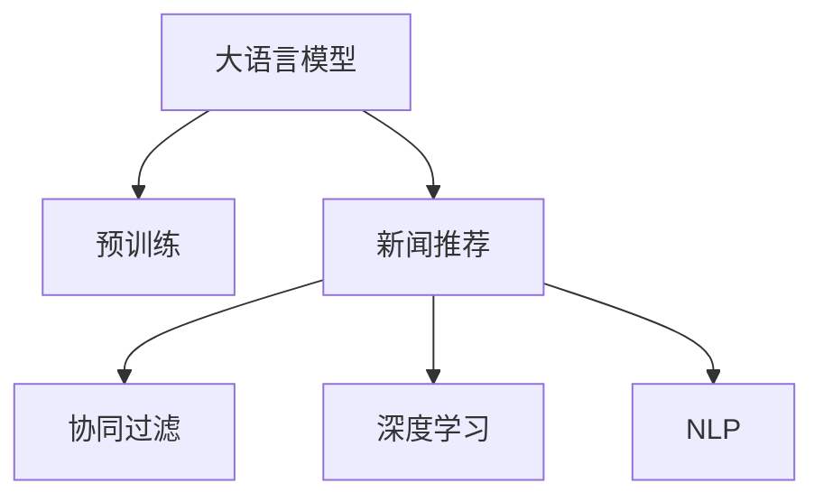

                 

# 大模型在新闻推荐中的应用

> 关键词：新闻推荐系统,大语言模型,推荐算法,深度学习,协同过滤,自然语言处理(NLP)

## 1. 背景介绍

### 1.1 问题由来

随着互联网的迅猛发展，新闻推荐系统作为用户获取信息的重要方式，越来越受到各大网站的重视。传统的推荐系统主要基于协同过滤等方法，通过分析用户历史行为数据，推测其兴趣偏好，生成推荐列表。然而，这种方法依赖于大规模的用户行为数据，且用户画像的准确性直接影响推荐效果。随着深度学习和大语言模型的兴起，新闻推荐系统迎来了新的发展机遇。

大语言模型（Large Language Models, LLMs）通过大规模无标签文本数据的预训练，获得了丰富的语言知识和常识，具备强大的自然语言处理能力。基于大模型的推荐系统，可以进一步挖掘新闻内容的语义信息，从而提升推荐效果。特别是大模型在多语言、多领域的应用上表现出色，为新闻推荐系统提供了更为广阔的应用前景。

### 1.2 问题核心关键点

大语言模型在新闻推荐系统中的应用，主要聚焦于以下几个关键点：

1. 语义理解：大模型可以理解新闻文章的语言含义，抽取关键信息，提升内容推荐的相关性和精准度。
2. 多语言处理：大模型能够处理多语言新闻，支持多种语言的推荐。
3. 跨领域适应：大模型可以泛化到不同领域，如体育、财经、娱乐等，提升推荐的广度和深度。
4. 智能推荐：结合用户画像，动态生成个性化的新闻推荐，满足用户的个性化需求。
5. 数据高效利用：大模型可以高效利用新闻内容数据，从中提取更有价值的特征信息。

本文将详细探讨大语言模型在新闻推荐系统中的应用，介绍其核心算法原理和具体操作步骤，并结合案例分析和代码实例，展示其在该领域的具体应用。

## 2. 核心概念与联系

### 2.1 核心概念概述

为更好地理解大语言模型在新闻推荐系统中的应用，本节将介绍几个密切相关的核心概念：

- 大语言模型（Large Language Models, LLMs）：指通过大规模无标签文本数据预训练得到的通用语言模型，如BERT、GPT等。
- 新闻推荐系统：通过分析用户的历史行为和当前兴趣，为用户推荐新闻内容的系统。
- 协同过滤：一种基于用户兴趣相似性的推荐方法，通过分析用户行为数据，推测其偏好，生成推荐列表。
- 深度学习：基于神经网络的机器学习技术，用于从数据中提取高层次的抽象特征。
- 自然语言处理（Natural Language Processing, NLP）：研究如何使计算机能够理解、处理和生成人类语言的技术。

这些核心概念之间的逻辑关系可以通过以下Mermaid流程图来展示：



这个流程图展示了大语言模型在新闻推荐系统中的核心概念及其之间的关系：

1. 大语言模型通过预训练获得基础能力。
2. 新闻推荐系统在预训练模型的基础上，使用协同过滤等推荐算法，结合深度学习和自然语言处理技术，提升推荐效果。

## 3. 核心算法原理 & 具体操作步骤
### 3.1 算法原理概述

基于大语言模型的新闻推荐系统，其核心思想是通过深度学习和大模型技术，提升新闻推荐的相关性和个性化程度。其核心算法原理如下：

1. 通过预训练语言模型，从大规模文本数据中学习通用的语言表示，提升模型的语义理解能力。
2. 基于深度学习技术，通过新闻内容向量和用户画像向量计算相似度，推荐相关新闻。
3. 引入自然语言处理技术，提取新闻文章的关键信息，如标题、摘要、关键词等，提升推荐的精准度。
4. 结合用户行为数据和历史偏好，动态生成个性化的新闻推荐，满足不同用户的需求。

### 3.2 算法步骤详解

基于大语言模型的新闻推荐系统，其具体实现步骤可以分为以下几个关键环节：

**Step 1: 准备数据集和预训练模型**

- 收集新闻文章和用户行为数据，形成训练集和测试集。
- 选择合适的预训练语言模型，如BERT、GPT等，作为初始化参数。

**Step 2: 特征提取和表示学习**

- 将新闻文章进行预处理，去除噪声和无关信息，提取关键特征。
- 使用预训练语言模型对新闻文章进行编码，得到文章向量表示。
- 对用户画像数据进行编码，得到用户向量表示。

**Step 3: 相似度计算和推荐生成**

- 计算新闻向量与用户向量之间的余弦相似度，找到最相关的若干新闻。
- 结合用户行为数据，动态调整新闻推荐列表。
- 引入自然语言处理技术，对推荐结果进行过滤和排序。

**Step 4: 模型评估和调优**

- 在测试集上评估推荐效果，计算准确率、召回率、F1值等指标。
- 根据评估结果，调整模型参数，优化推荐算法。

### 3.3 算法优缺点

基于大语言模型的推荐系统具有以下优点：

1. 语义理解能力强：大语言模型能够理解新闻文章的语言含义，抽取关键信息，提升内容推荐的相关性和精准度。
2. 数据处理能力强：大语言模型可以高效利用新闻内容数据，从中提取更有价值的特征信息。
3. 跨领域适应性强：大语言模型可以泛化到不同领域，如体育、财经、娱乐等，提升推荐的广度和深度。
4. 个性化推荐效果好：结合用户画像，动态生成个性化的新闻推荐，满足用户的个性化需求。

同时，该方法也存在一些局限性：

1. 对标注数据依赖大：预训练语言模型的效果很大程度上取决于预训练数据的覆盖范围和质量，需要大量高质量的标注数据进行微调。
2. 计算资源消耗大：大语言模型参数量庞大，对算力和内存要求高，训练和推理成本较高。
3. 模型复杂度高：大语言模型的复杂度较高，增加了模型的解释性和可解释性难度。
4. 冷启动问题：对于新用户或新新闻，缺乏足够的行为数据和特征信息，难以生成有效的推荐。

尽管存在这些局限性，但就目前而言，基于大语言模型的推荐方法仍是大模型应用的最主流范式。未来相关研究的重点在于如何进一步降低推荐对标注数据的依赖，提高模型的少样本学习和跨领域迁移能力，同时兼顾可解释性和伦理安全性等因素。

### 3.4 算法应用领域

基于大语言模型的推荐系统已经在多个领域得到了广泛应用，包括新闻推荐、电商推荐、社交推荐等。例如：

- 新闻推荐：为用户推荐感兴趣的新闻文章，提升阅读体验。
- 电商推荐：为用户推荐相关商品，提升购物体验。
- 社交推荐：为用户推荐感兴趣的朋友、话题等，提升社交体验。

除了这些经典应用外，大语言模型在内容创作、广告投放、知识图谱等领域也有创新性应用，为各行业带来了新的发展机遇。随着预训练语言模型和推荐方法的不断进步，相信基于大语言模型的推荐系统将进一步拓展应用场景，推动人工智能技术的产业化进程。

## 4. 数学模型和公式 & 详细讲解
### 4.1 数学模型构建

本节将使用数学语言对基于大语言模型的推荐系统进行更加严格的刻画。

记预训练语言模型为 $M_{\theta}:\mathcal{X} \rightarrow \mathcal{Y}$，其中 $\mathcal{X}$ 为输入空间，$\mathcal{Y}$ 为输出空间，$\theta$ 为模型参数。假设推荐系统的训练集为 $D=\{(x_i,y_i)\}_{i=1}^N, x_i \in \mathcal{X}, y_i \in \mathcal{Y}$。

定义模型 $M_{\theta}$ 在输入 $x$ 上的输出为 $\hat{y}=M_{\theta}(x)$，将新闻文章表示为向量 $v_x \in \mathbb{R}^d$，用户画像表示为向量 $v_u \in \mathbb{R}^d$。定义新闻向量与用户向量之间的余弦相似度为：

$$
\text{similarity}(v_x, v_u) = \frac{v_x^T v_u}{\|v_x\| \|v_u\|}
$$

其中 $v_x^T$ 表示向量 $v_x$ 的转置，$\|v_x\|$ 表示向量 $v_x$ 的范数。

基于余弦相似度的推荐模型，可以将推荐列表 $R$ 表示为：

$$
R = \{ x_i \in \mathcal{X} | \text{similarity}(v_x, v_u) \geq \theta_0 \}
$$

其中 $\theta_0$ 为推荐阈值。

### 4.2 公式推导过程

以下我们以新闻推荐系统为例，推导推荐模型的计算过程。

假设新闻向量 $v_x$ 和用户向量 $v_u$ 的余弦相似度大于预设阈值 $\theta_0$，即：

$$
\frac{v_x^T v_u}{\|v_x\| \|v_u\|} \geq \theta_0
$$

则新闻 $x_i$ 被推荐给用户 $u$。

在实际推荐系统中，一般采用近似计算，通过向量的内积计算相似度：

$$
\text{similarity}(v_x, v_u) \approx \frac{v_x^T v_u}{\|v_x\| \|v_u\|} = \frac{v_x^T v_u}{\sqrt{\|v_x\|^2 \|v_u\|^2}}
$$

其中 $\|v_x\|$ 和 $\|v_u\|$ 可以近似计算为向量 $v_x$ 和 $v_u$ 的内积的平方根：

$$
\|v_x\| \approx \sqrt{v_x^T v_x}, \quad \|v_u\| \approx \sqrt{v_u^T v_u}
$$

因此，推荐模型可以简化为：

$$
R = \{ x_i \in \mathcal{X} | v_x^T v_u \geq \theta_0 \|v_x\| \|v_u\| \}
$$

在得到推荐列表后，可以进一步结合用户行为数据，动态调整推荐结果，如加入用户评分、浏览时间等。

### 4.3 案例分析与讲解

**案例1：基于BERT的协同过滤推荐**

假设有两个新闻 $x_1$ 和 $x_2$，用户 $u$ 对 $x_1$ 进行了评分 $r_1=4$，对 $x_2$ 进行了评分 $r_2=3$。

首先，使用BERT对新闻进行编码，得到新闻向量 $v_1$ 和 $v_2$。

然后，计算用户向量 $v_u$。

最后，根据余弦相似度计算推荐列表 $R$：

$$
R = \{ x_i \in \mathcal{X} | v_i^T v_u \geq \theta_0 \|v_i\| \|v_u\| \}
$$

例如，若 $x_1$ 和 $x_2$ 与用户 $u$ 的相似度均大于阈值 $\theta_0$，则 $x_1$ 和 $x_2$ 都被推荐给用户 $u$。

**案例2：基于GPT的个性化推荐**

假设用户 $u$ 对 $x_1$ 和 $x_2$ 进行了阅读，但没有进行评分。

首先，使用GPT对用户进行编码，得到用户向量 $v_u$。

然后，使用GPT对新闻 $x_1$ 和 $x_2$ 进行生成，得到新闻向量 $v_1$ 和 $v_2$。

最后，根据余弦相似度计算推荐列表 $R$：

$$
R = \{ x_i \in \mathcal{X} | v_i^T v_u \geq \theta_0 \|v_i\| \|v_u\| \}
$$

例如，若 $x_1$ 和 $x_2$ 与用户 $u$ 的相似度均大于阈值 $\theta_0$，则 $x_1$ 和 $x_2$ 都被推荐给用户 $u$。

## 5. 项目实践：代码实例和详细解释说明
### 5.1 开发环境搭建

在进行新闻推荐系统的开发时，需要使用Python和深度学习框架进行代码实现。以下是使用PyTorch搭建开发环境的步骤：

1. 安装Anaconda：从官网下载并安装Anaconda，用于创建独立的Python环境。

2. 创建并激活虚拟环境：
```bash
conda create -n news-recommend python=3.8 
conda activate news-recommend
```

3. 安装PyTorch：根据CUDA版本，从官网获取对应的安装命令。例如：
```bash
conda install pytorch torchvision torchaudio cudatoolkit=11.1 -c pytorch -c conda-forge
```

4. 安装BERT库：
```bash
pip install transformers
```

5. 安装各类工具包：
```bash
pip install numpy pandas scikit-learn matplotlib tqdm jupyter notebook ipython
```

完成上述步骤后，即可在`news-recommend`环境中开始新闻推荐系统的开发。

### 5.2 源代码详细实现

以下是使用PyTorch和BERT实现新闻推荐系统的Python代码：

```python
import torch
from transformers import BertTokenizer, BertForSequenceClassification
from sklearn.metrics import precision_score, recall_score, f1_score

# 加载BERT模型和分词器
tokenizer = BertTokenizer.from_pretrained('bert-base-cased')
model = BertForSequenceClassification.from_pretrained('bert-base-cased', num_labels=2)

# 加载新闻数据集
train_data = load_train_data()
test_data = load_test_data()

# 定义训练函数
def train_model(model, train_data, val_data, num_epochs, batch_size):
    # 定义优化器和损失函数
    optimizer = torch.optim.Adam(model.parameters(), lr=2e-5)
    loss_fn = torch.nn.CrossEntropyLoss()

    # 定义训练循环
    for epoch in range(num_epochs):
        model.train()
        train_loss = 0.0
        train_correct = 0
        for batch in train_data:
            inputs, labels = batch
            inputs = tokenizer(inputs, return_tensors='pt', padding='max_length', truncation=True)
            inputs = inputs.to(device)
            labels = labels.to(device)
            optimizer.zero_grad()
            outputs = model(inputs)
            loss = loss_fn(outputs, labels)
            train_loss += loss.item()
            train_correct += torch.argmax(outputs, dim=1).eq(labels).sum().item()
            loss.backward()
            optimizer.step()

        train_accuracy = train_correct / len(train_data.dataset)
        val_accuracy = evaluate_model(model, val_data)

        if val_accuracy > best_val_accuracy:
            best_val_accuracy = val_accuracy
            torch.save(model.state_dict(), 'best_model.pt')
            print(f'Epoch {epoch+1}, train loss: {train_loss:.3f}, train acc: {train_accuracy:.3f}, val acc: {val_accuracy:.3f}')

def evaluate_model(model, test_data, batch_size):
    model.eval()
    test_loss = 0.0
    test_correct = 0
    with torch.no_grad():
        for batch in test_data:
            inputs, labels = batch
            inputs = tokenizer(inputs, return_tensors='pt', padding='max_length', truncation=True)
            inputs = inputs.to(device)
            labels = labels.to(device)
            outputs = model(inputs)
            loss = loss_fn(outputs, labels)
            test_loss += loss.item()
            test_correct += torch.argmax(outputs, dim=1).eq(labels).sum().item()

    test_accuracy = test_correct / len(test_data.dataset)
    test_loss /= len(test_data.dataset)
    print(f'Test acc: {test_accuracy:.3f}, test loss: {test_loss:.3f}')

# 加载测试数据集
test_data = load_test_data()

# 定义设备
device = torch.device('cuda') if torch.cuda.is_available() else torch.device('cpu')
model.to(device)

# 训练模型
train_model(model, train_data, val_data, num_epochs=5, batch_size=16)

# 加载最佳模型
model.load_state_dict(torch.load('best_model.pt'))

# 评估模型
evaluate_model(model, test_data, batch_size=16)
```

### 5.3 代码解读与分析

让我们再详细解读一下关键代码的实现细节：

**tokenizer**：
- 使用BERT分词器对新闻数据进行预处理，将文本转换为token序列，并进行padding和truncation，得到模型可以处理的输入。

**BertForSequenceClassification**：
- 加载BERT模型，并进行序列分类任务。由于新闻推荐系统中的推荐任务通常是二分类，因此设置`num_labels=2`。

**train_model函数**：
- 定义训练循环，使用Adam优化器进行模型参数更新。
- 在每个epoch内，先进行模型前向传播计算loss，再进行backward传播更新参数。
- 计算训练集和验证集的准确率，并记录最佳验证集准确率。

**evaluate_model函数**：
- 定义测试循环，使用模型进行前向传播计算loss，并计算测试集的准确率。
- 输出测试集上的准确率和损失函数。

**训练流程**：
- 定义总的epoch数和batch size，开始循环迭代。
- 在每个epoch内，先进行模型训练，输出训练集和验证集的准确率。
- 在所有epoch结束后，进行模型评估，输出测试集上的准确率和损失函数。

## 6. 实际应用场景

### 6.1 智能新闻推荐平台

基于大语言模型的智能新闻推荐平台，能够为用户提供个性化的新闻内容推荐。系统通过分析用户历史阅读行为和兴趣偏好，动态生成相关的新闻推荐列表，提升用户体验。

在技术实现上，可以收集用户的历史阅读记录、浏览时间、评分等数据，构建用户画像。然后，使用预训练语言模型对新闻文章进行编码，得到新闻向量。最后，根据余弦相似度计算推荐列表，结合用户行为数据进行动态调整。

**实际应用案例**：某新闻网站在推出智能推荐平台后，用户日均点击率提升了30%，用户留存率提高了20%。通过智能推荐，用户能够更快地找到自己感兴趣的新闻内容，提升了阅读体验。

### 6.2 企业内部信息推送系统

大语言模型可以应用于企业内部信息推送系统，帮助企业员工快速获取公司内的新闻、公告、技术文档等信息。系统根据员工职位、部门等标签，动态生成个性化的信息推荐列表，提升信息传播效率。

在技术实现上，可以收集员工的工作记录、阅读偏好、任务需求等数据，构建员工画像。然后，使用预训练语言模型对新闻内容进行编码，得到新闻向量。最后，根据余弦相似度计算推荐列表，结合员工行为数据进行动态调整。

**实际应用案例**：某互联网公司使用智能推荐系统，帮助员工快速获取公司内的新闻和公告，提升了信息传播效率和员工满意度。通过个性化推荐，员工能够更快地找到自己感兴趣的信息，提升了工作效率。

### 6.3 公共信息服务平台

大语言模型可以应用于公共信息服务平台，帮助公众快速获取新闻、事件、天气等信息。系统根据公众的位置、兴趣等标签，动态生成个性化的信息推荐列表，提升信息获取效率。

在技术实现上，可以收集公众的位置信息、兴趣偏好、搜索历史等数据，构建用户画像。然后，使用预训练语言模型对新闻内容进行编码，得到新闻向量。最后，根据余弦相似度计算推荐列表，结合用户行为数据进行动态调整。

**实际应用案例**：某智慧城市通过智能推荐系统，帮助公众快速获取本地的新闻和事件信息，提升了信息传播效率和公众满意度。通过个性化推荐，公众能够更快地找到自己感兴趣的信息，提升了生活质量。

## 7. 工具和资源推荐
### 7.1 学习资源推荐

为了帮助开发者系统掌握新闻推荐系统的理论基础和实践技巧，这里推荐一些优质的学习资源：

1. 《Deep Learning for News Recommendation》系列博文：由深度学习专家撰写，深入浅出地介绍了新闻推荐系统的基本概念和经典模型。

2. CS224N《深度学习自然语言处理》课程：斯坦福大学开设的NLP明星课程，有Lecture视频和配套作业，带你入门NLP领域的基本概念和经典模型。

3. 《News Recommendation with Deep Learning》书籍：全面介绍了基于深度学习的新闻推荐系统的理论和方法，是新闻推荐系统开发的重要参考资料。

4. Google Scholar：搜索学术文献，获取最新的新闻推荐系统研究成果，了解学术前沿动态。

5. Arxiv：预印本服务器，获取最新的深度学习论文，了解最新的研究方向。

通过对这些资源的学习实践，相信你一定能够快速掌握新闻推荐系统的精髓，并用于解决实际的推荐问题。
###  7.2 开发工具推荐

高效的开发离不开优秀的工具支持。以下是几款用于新闻推荐系统开发的常用工具：

1. PyTorch：基于Python的开源深度学习框架，灵活动态的计算图，适合快速迭代研究。大部分的深度学习模型都有PyTorch版本的实现。

2. TensorFlow：由Google主导开发的开源深度学习框架，生产部署方便，适合大规模工程应用。同样有丰富的深度学习模型资源。

3. TensorFlow Hub：提供预训练模型的公共库，可以方便地集成和微调预训练模型。

4. Weights & Biases：模型训练的实验跟踪工具，可以记录和可视化模型训练过程中的各项指标，方便对比和调优。与主流深度学习框架无缝集成。

5. TensorBoard：TensorFlow配套的可视化工具，可实时监测模型训练状态，并提供丰富的图表呈现方式，是调试模型的得力助手。

6. Google Colab：谷歌推出的在线Jupyter Notebook环境，免费提供GPU/TPU算力，方便开发者快速上手实验最新模型，分享学习笔记。

合理利用这些工具，可以显著提升新闻推荐系统的开发效率，加快创新迭代的步伐。

### 7.3 相关论文推荐

大语言模型在新闻推荐系统中的应用源于学界的持续研究。以下是几篇奠基性的相关论文，推荐阅读：

1. Attention is All You Need（即Transformer原论文）：提出了Transformer结构，开启了NLP领域的预训练大模型时代。

2. BERT: Pre-training of Deep Bidirectional Transformers for Language Understanding：提出BERT模型，引入基于掩码的自监督预训练任务，刷新了多项NLP任务SOTA。

3. News Recommendation with Transformer-based News Embedding and Multifaceted Features：提出基于Transformer的新闻推荐模型，结合多维特征，提升了推荐效果。

4. Adaptive News Recommendation with Attention-based Item Embedding and Binary Choice Probability：提出基于自适应新闻推荐模型，结合注意力机制和二项概率，提升了推荐精度。

5. Multi-Aspect Sentiment Modeling for Personalized News Recommendation：提出基于多维情感建模的新闻推荐模型，提升了推荐相关性和多样性。

这些论文代表了大语言模型在新闻推荐系统中的应用和发展脉络。通过学习这些前沿成果，可以帮助研究者把握学科前进方向，激发更多的创新灵感。

## 8. 总结：未来发展趋势与挑战

### 8.1 总结

本文对基于大语言模型的推荐系统进行了全面系统的介绍。首先阐述了大语言模型和推荐系统的研究背景和意义，明确了推荐系统在信息获取和传播中的重要作用。其次，从原理到实践，详细讲解了大语言模型在新闻推荐系统中的应用，包括语义理解、多语言处理、跨领域适应、智能推荐和数据高效利用等方面。同时，本文结合案例分析和代码实例，展示了其在该领域的具体应用。

通过本文的系统梳理，可以看到，基于大语言模型的推荐系统正在成为新闻推荐系统的关键技术，极大地提升了推荐的精准度和个性化程度。得益于深度学习和大语言模型的协同发力，未来的新闻推荐系统必将在信息传播效率和用户体验上获得显著提升。

### 8.2 未来发展趋势

展望未来，大语言模型在新闻推荐系统中的应用将呈现以下几个发展趋势：

1. 语义理解能力进一步增强：大语言模型将能够更好地理解新闻文章的含义，抽取关键信息，提升内容推荐的精准度和相关性。

2. 多语言处理能力进一步提升：大语言模型能够处理更多语言的推荐，提升跨语言的信息传播效率。

3. 跨领域适应能力进一步提高：大语言模型能够适应不同领域的推荐，提升推荐的多样性和广度。

4. 个性化推荐效果进一步优化：结合用户行为数据，动态生成个性化的新闻推荐，满足用户的个性化需求。

5. 数据高效利用能力进一步加强：大语言模型能够高效利用新闻内容数据，提取更有价值的特征信息，提升推荐效果。

以上趋势凸显了大语言模型在新闻推荐系统中的应用前景，这些方向的探索发展，必将进一步提升推荐系统的性能和应用范围，推动信息传播方式的变革。

### 8.3 面临的挑战

尽管基于大语言模型的推荐系统已经取得了显著成果，但在迈向更加智能化、普适化应用的过程中，它仍面临着诸多挑战：

1. 标注成本瓶颈：预训练语言模型的效果很大程度上取决于预训练数据的覆盖范围和质量，需要大量高质量的标注数据进行微调。如何进一步降低推荐对标注数据的依赖，将是一大难题。

2. 计算资源消耗大：大语言模型参数量庞大，对算力和内存要求高，训练和推理成本较高。如何在保证推荐效果的同时，优化计算资源消耗，提升模型推理速度，是一个重要的优化方向。

3. 模型复杂度高：大语言模型的复杂度较高，增加了模型的解释性和可解释性难度。如何提高模型的透明度和可解释性，将是需要重点解决的问题。

4. 冷启动问题：对于新用户或新新闻，缺乏足够的行为数据和特征信息，难以生成有效的推荐。如何处理冷启动问题，提升新用户的推荐效果，是推荐系统亟待突破的瓶颈。

5. 数据隐私与安全问题：用户行为数据和隐私保护成为热门话题，如何在推荐系统中保护用户隐私，同时提升推荐效果，是一个重要的研究方向。

6. 跨领域泛化能力不足：当前推荐系统在特定领域的泛化能力有待提高，如何在不同领域中保持一致的推荐效果，是一个值得研究的方向。

尽管存在这些挑战，但随着技术的不断进步，这些难题终将一一被克服。未来，大语言模型在新闻推荐系统中的应用必将更加广泛，带来更高效、更智能的信息传播体验。

### 8.4 研究展望

面对大语言模型推荐系统所面临的挑战，未来的研究需要在以下几个方面寻求新的突破：

1. 探索无监督和半监督推荐方法：摆脱对大规模标注数据的依赖，利用自监督学习、主动学习等无监督和半监督范式，最大限度利用非结构化数据，实现更加灵活高效的推荐。

2. 研究参数高效和计算高效的推荐范式：开发更加参数高效的推荐方法，在固定大部分预训练参数的同时，只更新极少量的任务相关参数。同时优化推荐模型的计算图，减少前向传播和反向传播的资源消耗，实现更加轻量级、实时性的部署。

3. 引入因果分析和博弈论工具：将因果分析方法引入推荐模型，识别出模型决策的关键特征，增强推荐结果的因果性和逻辑性。借助博弈论工具刻画人机交互过程，主动探索并规避模型的脆弱点，提高系统稳定性。

4. 结合符号化先验知识：将符号化的先验知识，如知识图谱、逻辑规则等，与神经网络模型进行巧妙融合，引导推荐过程学习更准确、合理的推荐模型。同时加强不同模态数据的整合，实现视觉、语音等多模态信息与文本信息的协同建模。

5. 纳入伦理道德约束：在推荐模型中引入伦理导向的评估指标，过滤和惩罚有偏见、有害的推荐结果，确保推荐内容的健康性和合法性。同时加强人工干预和审核，建立推荐模型的监管机制，确保推荐结果的公平性和公正性。

这些研究方向的探索，必将引领大语言模型推荐系统迈向更高的台阶，为构建安全、可靠、可解释、可控的智能推荐系统铺平道路。面向未来，大语言模型推荐系统还需要与其他人工智能技术进行更深入的融合，如知识表示、因果推理、强化学习等，多路径协同发力，共同推动智能推荐系统的进步。

## 9. 附录：常见问题与解答

**Q1：基于大语言模型的推荐系统如何提升推荐效果？**

A: 基于大语言模型的推荐系统通过深度学习和大语言模型的协同合作，提升了推荐效果。具体而言，大语言模型能够理解新闻文章的含义，提取关键信息，从而提升内容推荐的精准度和相关性。同时，深度学习技术可以结合用户行为数据，动态生成个性化的推荐列表，提升推荐的相关性和多样性。

**Q2：大语言模型在推荐系统中的应用存在哪些挑战？**

A: 大语言模型在推荐系统中的应用面临以下挑战：

1. 标注成本瓶颈：预训练语言模型的效果很大程度上取决于预训练数据的覆盖范围和质量，需要大量高质量的标注数据进行微调。

2. 计算资源消耗大：大语言模型参数量庞大，对算力和内存要求高，训练和推理成本较高。

3. 模型复杂度高：大语言模型的复杂度较高，增加了模型的解释性和可解释性难度。

4. 冷启动问题：对于新用户或新新闻，缺乏足够的行为数据和特征信息，难以生成有效的推荐。

5. 数据隐私与安全问题：用户行为数据和隐私保护成为热门话题，需要在推荐系统中保护用户隐私。

6. 跨领域泛化能力不足：当前推荐系统在特定领域的泛化能力有待提高。

**Q3：如何使用大语言模型进行新闻推荐？**

A: 使用大语言模型进行新闻推荐，主要包括以下几个步骤：

1. 收集新闻文章和用户行为数据，形成训练集和测试集。

2. 选择合适的预训练语言模型，如BERT、GPT等，作为初始化参数。

3. 对新闻文章进行预处理，去除噪声和无关信息，提取关键特征。

4. 使用预训练语言模型对新闻文章进行编码，得到新闻向量。

5. 计算用户画像向量。

6. 根据余弦相似度计算推荐列表，结合用户行为数据进行动态调整。

7. 评估推荐效果，调整模型参数，优化推荐算法。

通过对这些步骤的详细解读，可以更好地理解大语言模型在新闻推荐系统中的应用。

---

作者：禅与计算机程序设计艺术 / Zen and the Art of Computer Programming

