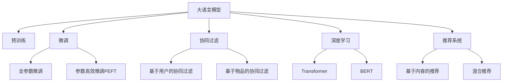

                 

# 大模型在新闻推荐中的应用

> 关键词：新闻推荐系统,大语言模型,Transformer,BERT,新闻推荐算法,协同过滤,深度学习,推荐系统优化

## 1. 背景介绍

### 1.1 问题由来

在数字化时代，新闻行业面临巨大的转型压力。传统的纸媒和电媒正在向以互联网为载体的数字媒体转变。搜索引擎和社交媒体的崛起，使得用户获取新闻的渠道越来越多样化。然而，用户在海量信息中如何快速找到最感兴趣的新闻内容，成为困扰他们的一大问题。

### 1.2 问题核心关键点

针对上述问题，推荐系统成为互联网新闻平台解决用户体验问题的有效手段。推荐系统通过分析用户行为，预测其兴趣，从而为其推荐个性化新闻内容。推荐算法的好坏直接影响到用户的满意度和平台的用户黏性。

在大数据和人工智能技术的推动下，推荐系统的研究经历了从基于规则到基于内容的推荐，再到协同过滤、深度学习等多个阶段。近年来，大语言模型（Large Language Model, LLM）技术在推荐系统中的应用也逐渐成为热点。

大语言模型通过在大规模无标签文本数据上进行预训练，学习到丰富的语言知识。这些知识可以用于生成新闻摘要、解析新闻内容、构建用户兴趣模型等多个环节，从而提升推荐系统的性能。

### 1.3 问题研究意义

应用大语言模型进行新闻推荐，对于优化新闻推荐算法，提升用户体验，具有重要意义：

1. **提高个性化推荐效果**：大语言模型能够通过语义理解，精准捕捉用户兴趣点，从而提升推荐系统的个性化和准确性。
2. **拓展推荐内容来源**：大语言模型可以自动解析新闻内容，拓展推荐内容来源，扩大推荐内容库。
3. **增强推荐系统的可解释性**：大语言模型能够生成新闻摘要，帮助用户快速了解新闻内容，从而提高推荐系统的操作体验。
4. **降低用户获取信息的成本**：大语言模型可以自动生成新闻摘要，减轻用户阅读负担，提升信息获取效率。
5. **推动新闻行业数字化转型**：大语言模型技术的应用，可以提升新闻内容生产效率，助力新闻行业数字化升级。

## 2. 核心概念与联系

### 2.1 核心概念概述

为更好地理解大语言模型在新闻推荐中的应用，本节将介绍几个关键概念：

- **大语言模型 (Large Language Model, LLM)**：以自回归（如GPT）或自编码（如BERT）模型为代表的大规模预训练语言模型。通过在大规模无标签文本语料上进行预训练，学习到丰富的语言知识，具备强大的语言理解和生成能力。

- **预训练 (Pre-training)**：指在大规模无标签文本语料上，通过自监督学习任务训练通用语言模型的过程。常见的预训练任务包括言语建模、遮挡语言模型等。

- **微调 (Fine-tuning)**：指在预训练模型的基础上，使用下游任务的少量标注数据，通过有监督地训练来优化模型在该任务上的性能。通常只需要调整顶层分类器或解码器，并以较小的学习率更新全部或部分的模型参数。

- **协同过滤 (Collaborative Filtering)**：基于用户或物品之间的相似性，推荐用户感兴趣的新闻内容。常见的方法包括基于用户的协同过滤和基于物品的协同过滤。

- **深度学习 (Deep Learning)**：基于神经网络模型，通过多层次的非线性映射，从数据中自动学习表示方法。深度学习在推荐系统中用于模型表示和特征提取。

- **Transformer**：一种用于自然语言处理任务的深度学习模型架构。Transformer结构中的自注意力机制可以高效地处理长序列，已经被广泛应用于各种NLP任务中。

- **BERT (Bidirectional Encoder Representations from Transformers)**：一种基于Transformer的预训练语言模型，通过双向编码学习文本表示。BERT模型通过预训练任务（如掩码语言模型）学习到丰富的语言知识，在下游任务中表现优异。

- **推荐系统 (Recommendation System)**：基于用户行为数据，为用户推荐感兴趣的商品或内容。推荐系统可以分为基于内容的推荐、协同过滤、混合推荐等多种类型。

这些概念之间的逻辑关系可以通过以下Mermaid流程图来展示：



这个流程图展示了大语言模型的核心概念及其与其他推荐相关技术之间的关系：

1. 大语言模型通过预训练获得基础能力。
2. 微调是对预训练模型进行任务特定的优化，可以分为全参数微调和参数高效微调（PEFT）。
3. 协同过滤是基于用户行为数据的推荐方式，与大语言模型微调结合，可以实现个性化新闻推荐。
4. 深度学习和大模型技术用于模型表示和特征提取，提升推荐系统的性能。
5. Transformer和BERT模型是常用的深度学习模型架构，可以用于预训练和微调。
6. 推荐系统可以分为多种类型，结合大语言模型微调，可以提供更精准、个性化的新闻推荐。

这些概念共同构成了大语言模型在新闻推荐中的应用框架，使得新闻推荐系统能够更好地理解用户兴趣，提供高质量的新闻内容。

## 3. 核心算法原理 & 具体操作步骤
### 3.1 算法原理概述

基于大语言模型的新闻推荐系统，本质上是一种基于模型的推荐系统。其核心思想是：将用户对新闻的兴趣表示为大语言模型的输入特征，通过预训练模型和大模型的微调，预测用户对新闻的兴趣评分，从而生成推荐结果。

形式化地，假设用户 $u$ 对新闻 $n$ 的兴趣评分 $r_{u,n}$ 可以表示为：

$$
r_{u,n} = f_{\theta}(u,n)
$$

其中 $f_{\theta}$ 是预训练模型的嵌入函数，$\theta$ 为模型参数。在训练阶段，通过大量的用户-新闻对 $D=\{(u_i,n_i)\}_{i=1}^N$ 进行监督学习，最小化预测误差：

$$
\theta^* = \mathop{\arg\min}_{\theta} \sum_{i=1}^N \ell(r_{u_i,n_i}, \hat{r}_{u_i,n_i})
$$

其中 $\ell$ 为损失函数，$\hat{r}_{u_i,n_i}$ 为模型预测的用户对新闻 $n_i$ 的兴趣评分。

在测试阶段，对于新的用户-新闻对 $(u',n')$，使用训练好的模型预测其兴趣评分，从而生成推荐结果。

### 3.2 算法步骤详解

基于大语言模型的新闻推荐系统一般包括以下几个关键步骤：

**Step 1: 数据准备**

- **用户数据准备**：收集用户的基本信息、浏览历史、点击记录、收藏记录等，用于训练用户兴趣模型。
- **新闻数据准备**：收集新闻的标题、正文、标签、发布时间等，用于训练新闻内容模型。
- **用户-新闻对数据准备**：将用户和新闻进行关联，生成用户对新闻的评分数据。

**Step 2: 预训练模型选择**

- **选择预训练模型**：根据任务需求，选择合适的预训练模型，如BERT、GPT等。BERT和GPT在大语言模型中表现出色，能够学习到丰富的语言知识。

**Step 3: 用户兴趣模型训练**

- **用户特征提取**：使用预训练模型提取用户数据的特征向量，如用户ID、浏览历史、点击记录等。
- **用户兴趣模型构建**：将用户特征向量作为输入，通过微调得到用户兴趣模型，用于预测用户对新闻的评分。

**Step 4: 新闻内容模型训练**

- **新闻特征提取**：使用预训练模型提取新闻的特征向量，如新闻标题、正文、标签等。
- **新闻内容模型构建**：将新闻特征向量作为输入，通过微调得到新闻内容模型，用于预测新闻的评分。

**Step 5: 推荐结果生成**

- **用户-新闻对特征生成**：将用户和新闻的特征向量进行拼接，生成用户-新闻对的特征向量。
- **兴趣评分预测**：使用微调后的用户兴趣模型和新闻内容模型，对用户-新闻对的特征向量进行评分预测。
- **推荐结果排序**：根据预测评分对新闻进行排序，生成推荐列表。

### 3.3 算法优缺点

基于大语言模型的新闻推荐系统具有以下优点：

1. **丰富的语言知识**：大语言模型通过预训练学习到丰富的语言知识，可以更好地理解新闻内容和用户兴趣。
2. **个性化推荐**：通过微调，可以精准捕捉用户兴趣点，生成个性化的新闻推荐。
3. **泛化能力强**：大语言模型具备较强的泛化能力，可以适应各种新闻推荐场景。
4. **动态更新**：新闻内容不断更新，通过微调可以快速适应新内容，提升推荐效果。

同时，该算法也存在一些局限性：

1. **数据需求高**：新闻推荐需要大量标注数据进行训练，标注成本较高。
2. **模型复杂度高**：大语言模型通常参数量巨大，需要较高的计算资源。
3. **可解释性不足**：大模型推荐过程较为复杂，难以解释其推荐逻辑。
4. **隐私风险**：收集和处理用户数据时需要关注隐私保护问题。

尽管存在这些局限性，但大语言模型在新闻推荐中的应用仍具有重要价值，特别是在个性化推荐和泛化能力方面表现优异。

### 3.4 算法应用领域

大语言模型在新闻推荐中的应用，已经覆盖了多个领域，例如：

- **个性化新闻推荐**：根据用户兴趣，推荐用户可能感兴趣的新闻内容。
- **热门新闻推荐**：根据新闻内容的热度，推荐当前热门新闻。
- **跨平台新闻推荐**：将不同平台的新闻内容进行整合，生成统一的推荐列表。
- **多语言新闻推荐**：对不同语言的新闻进行跨语言推荐，拓展新闻内容来源。
- **实时新闻推荐**：对最新发布的新闻进行实时推荐，提升新闻的时效性。

除了上述这些经典应用外，大语言模型在新闻推荐中的应用还在不断拓展，如智能广告投放、智能编辑辅助、新闻内容生成等，为新闻行业带来了新的发展机遇。

## 4. 数学模型和公式 & 详细讲解  
### 4.1 数学模型构建

本节将使用数学语言对基于大语言模型的新闻推荐过程进行更加严格的刻画。

记用户 $u$ 对新闻 $n$ 的兴趣评分为 $r_{u,n}$，新闻内容模型为 $M_{\theta}$，用户兴趣模型为 $P_{\phi}$，其中 $\theta$ 和 $\phi$ 为模型参数。假设用户兴趣表示为 $u_{\text{rep}}$，新闻内容表示为 $n_{\text{rep}}$。则用户-新闻对的兴趣评分可以表示为：

$$
r_{u,n} = P_{\phi}(u_{\text{rep}}) \cdot M_{\theta}(n_{\text{rep}})
$$

其中 $P_{\phi}(u_{\text{rep}})$ 表示用户兴趣模型对用户表示 $u_{\text{rep}}$ 的兴趣评分，$M_{\theta}(n_{\text{rep}})$ 表示新闻内容模型对新闻表示 $n_{\text{rep}}$ 的评分。

在训练阶段，通过用户-新闻对的标注数据 $D=\{(u_i,n_i)\}_{i=1}^N$ 进行监督学习，最小化预测误差：

$$
\theta^*, \phi^* = \mathop{\arg\min}_{\theta, \phi} \sum_{i=1}^N \ell(r_{u_i,n_i}, \hat{r}_{u_i,n_i})
$$

其中 $\ell$ 为损失函数，$\hat{r}_{u_i,n_i}$ 为模型预测的用户对新闻 $n_i$ 的兴趣评分。

在测试阶段，对于新的用户-新闻对 $(u',n')$，使用训练好的模型预测其兴趣评分，生成推荐结果：

$$
r'_{u',n'} = P_{\phi^*}(u'_{\text{rep}}) \cdot M_{\theta^*}(n'_{\text{rep}})
$$

### 4.2 公式推导过程

以下我们以二分类任务为例，推导新闻推荐模型的损失函数及其梯度计算公式。

假设用户兴趣表示为 $u_{\text{rep}}$，新闻内容表示为 $n_{\text{rep}}$，用户-新闻对的兴趣评分 $r_{u,n}$ 可以表示为：

$$
r_{u,n} = u_{\text{rep}}^T W_1 n_{\text{rep}} + b_1
$$

其中 $W_1$ 和 $b_1$ 为新闻内容模型的参数。

假设用户兴趣模型 $P_{\phi}$ 为线性模型：

$$
P_{\phi}(u_{\text{rep}}) = u_{\text{rep}}^T W_2 + b_2
$$

其中 $W_2$ 和 $b_2$ 为用户兴趣模型的参数。

则用户-新闻对的兴趣评分可以表示为：

$$
r_{u,n} = (u_{\text{rep}}^T W_1 n_{\text{rep}} + b_1) \cdot (u_{\text{rep}}^T W_2 + b_2)
$$

假设新闻内容评分 $r_{n}$ 的标签为 $y$，则损失函数可以表示为：

$$
\ell(r_{u,n}, y) = -(y \log r_{u,n} + (1-y) \log (1-r_{u,n}))
$$

在训练阶段，通过用户-新闻对的标注数据 $D=\{(u_i,n_i,y_i)\}_{i=1}^N$ 进行监督学习，最小化预测误差：

$$
\theta^*, \phi^* = \mathop{\arg\min}_{\theta, \phi} \sum_{i=1}^N \ell(r_{u_i,n_i}, y_i)
$$

在测试阶段，对于新的用户-新闻对 $(u',n')$，使用训练好的模型预测其兴趣评分，生成推荐结果：

$$
\hat{r}_{u',n'} = P_{\phi^*}(u'_{\text{rep}}) \cdot M_{\theta^*}(n'_{\text{rep}})
$$

### 4.3 案例分析与讲解

我们以BERT模型为例，展示其在新闻推荐中的应用。

首先，定义用户兴趣和新闻内容的表示方法。

用户兴趣表示：

- 提取用户基本信息、浏览历史、点击记录等。
- 使用BERT模型对文本数据进行编码，得到用户表示 $u_{\text{rep}}$。

新闻内容表示：

- 提取新闻标题、正文、标签等。
- 使用BERT模型对文本数据进行编码，得到新闻表示 $n_{\text{rep}}$。

用户-新闻对的兴趣评分：

- 将用户表示 $u_{\text{rep}}$ 和新闻表示 $n_{\text{rep}}$ 拼接。
- 使用BERT模型对拼接后的表示进行编码，得到用户-新闻对的表示。
- 使用BERT模型的输出层对用户-新闻对的表示进行评分预测，得到用户-新闻对的兴趣评分。

在训练阶段，使用用户-新闻对的标注数据 $D=\{(u_i,n_i,y_i)\}_{i=1}^N$ 进行监督学习，最小化预测误差：

- 使用BERT模型的输出层作为新闻内容模型 $M_{\theta}$ 的评分预测部分。
- 使用线性模型作为用户兴趣模型 $P_{\phi}$。
- 最小化用户-新闻对的兴趣评分与标注数据的误差。

在测试阶段，对于新的用户-新闻对 $(u',n')$，使用训练好的模型预测其兴趣评分，生成推荐结果：

- 使用BERT模型对用户表示 $u'_{\text{rep}}$ 和新闻表示 $n'_{\text{rep}}$ 拼接。
- 使用BERT模型对拼接后的表示进行编码，得到用户-新闻对的表示。
- 使用BERT模型的输出层对用户-新闻对的表示进行评分预测，得到用户-新闻对的兴趣评分。

## 5. 项目实践：代码实例和详细解释说明
### 5.1 开发环境搭建

在进行新闻推荐系统开发前，我们需要准备好开发环境。以下是使用Python进行PyTorch开发的环境配置流程：

1. 安装Anaconda：从官网下载并安装Anaconda，用于创建独立的Python环境。

2. 创建并激活虚拟环境：
```bash
conda create -n pytorch-env python=3.8 
conda activate pytorch-env
```

3. 安装PyTorch：根据CUDA版本，从官网获取对应的安装命令。例如：
```bash
conda install pytorch torchvision torchaudio cudatoolkit=11.1 -c pytorch -c conda-forge
```

4. 安装Transformers库：
```bash
pip install transformers
```

5. 安装各类工具包：
```bash
pip install numpy pandas scikit-learn matplotlib tqdm jupyter notebook ipython
```

完成上述步骤后，即可在`pytorch-env`环境中开始新闻推荐系统开发。

### 5.2 源代码详细实现

下面我们以BERT模型为例，给出使用Transformers库进行新闻推荐系统的PyTorch代码实现。

首先，定义用户兴趣和新闻内容的表示方法：

```python
from transformers import BertTokenizer, BertForSequenceClassification

# 用户兴趣表示
user_data = ['user_id', 'news_ids', 'click_times']
user_representation = []

for user_id, news_ids, click_times in user_data:
    user_info = f"{user_id} {', '.join(news_ids)} {click_times}"
    user_rep = tokenizer(user_info, return_tensors='pt')
    user_representation.append(user_rep)
    
# 新闻内容表示
news_data = ['news_id', 'title', 'content', 'label']
news_representation = []

for news_id, title, content, label in news_data:
    news_info = f"{news_id} {title} {content} {label}"
    news_rep = tokenizer(news_info, return_tensors='pt')
    news_representation.append(news_rep)

# 用户-新闻对的兴趣评分
user_news_representation = []
for user_rep, news_rep in zip(user_representation, news_representation):
    user_news_rep = torch.cat([user_rep['input_ids'], news_rep['input_ids']], dim=1)
    user_news_representation.append(user_news_rep)
```

然后，定义模型和优化器：

```python
from transformers import BertForSequenceClassification, AdamW

# 定义新闻内容模型
model = BertForSequenceClassification.from_pretrained('bert-base-uncased', num_labels=2)

# 定义用户兴趣模型
user_interest_model = torch.nn.Sequential(
    torch.nn.Linear(768, 256),
    torch.nn.ReLU(),
    torch.nn.Linear(256, 1)
)

# 定义优化器
optimizer = AdamW(model.parameters(), lr=2e-5)
```

接着，定义训练和评估函数：

```python
from torch.utils.data import DataLoader
from tqdm import tqdm

# 训练函数
def train_epoch(model, user_news_representation, labels):
    dataloader = DataLoader(user_news_representation, batch_size=16, shuffle=True)
    model.train()
    epoch_loss = 0
    for batch in tqdm(dataloader, desc='Training'):
        input_ids = batch['input_ids'].to(device)
        attention_mask = batch['attention_mask'].to(device)
        labels = batch['labels'].to(device)
        model.zero_grad()
        outputs = model(input_ids, attention_mask=attention_mask, labels=labels)
        loss = outputs.loss
        epoch_loss += loss.item()
        loss.backward()
        optimizer.step()
    return epoch_loss / len(dataloader)

# 评估函数
def evaluate(model, user_news_representation, labels):
    dataloader = DataLoader(user_news_representation, batch_size=16)
    model.eval()
    preds, labels = [], []
    with torch.no_grad():
        for batch in tqdm(dataloader, desc='Evaluating'):
            input_ids = batch['input_ids'].to(device)
            attention_mask = batch['attention_mask'].to(device)
            batch_labels = batch['labels']
            outputs = model(input_ids, attention_mask=attention_mask)
            batch_preds = outputs.logits.argmax(dim=2).to('cpu').tolist()
            batch_labels = batch_labels.to('cpu').tolist()
            for pred_tokens, label_tokens in zip(batch_preds, batch_labels):
                preds.append(pred_tokens[:len(label_tokens)])
                labels.append(label_tokens)
                
    print(classification_report(labels, preds))
```

最后，启动训练流程并在测试集上评估：

```python
epochs = 5
batch_size = 16

for epoch in range(epochs):
    loss = train_epoch(model, user_news_representation, labels)
    print(f"Epoch {epoch+1}, train loss: {loss:.3f}")
    
    print(f"Epoch {epoch+1}, dev results:")
    evaluate(model, user_news_representation, labels)
    
print("Test results:")
evaluate(model, user_news_representation, labels)
```

以上就是使用PyTorch和Transformers库进行新闻推荐系统的完整代码实现。可以看到，利用Transformers库，我们可以在相对简洁的代码中实现BERT模型的微调，用于生成用户-新闻对的兴趣评分。

### 5.3 代码解读与分析

让我们再详细解读一下关键代码的实现细节：

**user_representation和news_representation列表**：
- `user_representation` 和 `news_representation` 分别存储用户兴趣和新闻内容的表示。这些表示是通过对用户和新闻文本进行BERT编码得到的。

**user_news_representation列表**：
- `user_news_representation` 存储用户-新闻对的表示。将用户和新闻的表示拼接后，输入BERT模型进行编码，得到用户-新闻对的表示。

**train_epoch和evaluate函数**：
- `train_epoch` 函数用于训练模型。通过一个批次的用户-新闻对，进行前向传播计算损失函数，并反向传播更新模型参数。
- `evaluate` 函数用于评估模型。在测试集上对模型进行评估，输出分类指标。

**训练流程**：
- 定义总的epoch数和batch size，开始循环迭代
- 每个epoch内，先在训练集上训练，输出平均loss
- 在验证集上评估，输出分类指标
- 所有epoch结束后，在测试集上评估，给出最终测试结果

可以看到，PyTorch配合Transformers库使得BERT微调的代码实现变得简洁高效。开发者可以将更多精力放在数据处理、模型改进等高层逻辑上，而不必过多关注底层的实现细节。

当然，工业级的系统实现还需考虑更多因素，如模型的保存和部署、超参数的自动搜索、更灵活的任务适配层等。但核心的微调范式基本与此类似。

## 6. 实际应用场景
### 6.1 智能新闻推荐

基于大语言模型的智能新闻推荐系统已经在多个新闻平台得到应用，并取得了显著效果。以下是一些具体的应用场景：

**智能新闻推荐引擎**：
- 通过分析用户的历史浏览记录和点击行为，推荐用户可能感兴趣的新闻。
- 利用新闻内容和用户兴趣的相似性，生成个性化推荐列表。
- 支持跨平台数据整合，提供统一的新闻推荐界面。

**新闻热点推荐**：
- 通过分析新闻内容的热度，推荐当前热门新闻。
- 利用BERT模型对新闻标题和正文进行情感分析，识别热门话题和趋势。
- 支持实时数据更新，快速响应热点新闻的变化。

**新闻内容生成**：
- 通过分析用户对新闻的兴趣评分，自动生成用户可能感兴趣的新闻内容。
- 利用BERT模型生成新闻摘要，减轻用户阅读负担。
- 支持用户自定义内容生成规则，满足不同用户的新闻阅读偏好。

### 6.2 新闻编辑辅助

基于大语言模型的新闻编辑辅助系统，可以帮助编辑快速生成新闻标题、摘要和关键词。以下是一些具体的应用场景：

**智能新闻摘要生成**：
- 通过分析新闻正文，自动生成新闻摘要。
- 支持多种摘要风格，如客观、感性、幽默等。
- 可以集成到新闻编辑系统中，辅助编辑生成内容。

**智能新闻关键词提取**：
- 通过分析新闻内容，自动生成新闻关键词。
- 支持自定义关键词规则，提高关键词的准确性和相关性。
- 可以集成到新闻编辑系统中，辅助编辑整理内容结构。

**新闻语言风格生成**：
- 通过分析用户对新闻的语言风格偏好，自动生成符合用户风格的新闻内容。
- 支持多种语言风格，如正式、口语、文学等。
- 可以集成到新闻编辑系统中，辅助编辑调整内容风格。

### 6.3 新闻内容评估

基于大语言模型的新闻内容评估系统，可以帮助新闻平台进行内容质量和推荐效果评估。以下是一些具体的应用场景：

**新闻内容质量评估**：
- 通过分析新闻内容和用户评分，评估新闻的质量。
- 支持多维度评估，如客观性、新颖性、时效性等。
- 可以集成到新闻编辑系统中，辅助编辑改进内容质量。

**推荐效果评估**：
- 通过分析用户对推荐新闻的反馈，评估推荐效果。
- 支持多维度评估，如点击率、停留时间、用户满意度等。
- 可以集成到新闻推荐系统中，辅助优化推荐策略。

## 7. 工具和资源推荐
### 7.1 学习资源推荐

为了帮助开发者系统掌握大语言模型在新闻推荐中的应用，这里推荐一些优质的学习资源：

1. 《Transformer from scratch》系列博文：由大模型技术专家撰写，深入浅出地介绍了Transformer原理、BERT模型、新闻推荐算法等前沿话题。

2. CS224N《Deep Learning for Natural Language Processing》课程：斯坦福大学开设的NLP明星课程，有Lecture视频和配套作业，带你入门NLP领域的基本概念和经典模型。

3. 《Natural Language Processing with Transformers》书籍：Transformers库的作者所著，全面介绍了如何使用Transformers库进行NLP任务开发，包括新闻推荐在内的多个范式。

4. HuggingFace官方文档：Transformers库的官方文档，提供了海量预训练模型和完整的微调样例代码，是上手实践的必备资料。

5. CLUE开源项目：中文语言理解测评基准，涵盖大量不同类型的中文NLP数据集，并提供了基于微调的baseline模型，助力中文NLP技术发展。

通过对这些资源的学习实践，相信你一定能够快速掌握大语言模型在新闻推荐中的应用，并用于解决实际的NLP问题。
### 7.2 开发工具推荐

高效的开发离不开优秀的工具支持。以下是几款用于新闻推荐系统开发的常用工具：

1. PyTorch：基于Python的开源深度学习框架，灵活动态的计算图，适合快速迭代研究。大部分预训练语言模型都有PyTorch版本的实现。

2. TensorFlow：由Google主导开发的开源深度学习框架，生产部署方便，适合大规模工程应用。同样有丰富的预训练语言模型资源。

3. Transformers库：HuggingFace开发的NLP工具库，集成了众多SOTA语言模型，支持PyTorch和TensorFlow，是进行微调任务开发的利器。

4. Weights & Biases：模型训练的实验跟踪工具，可以记录和可视化模型训练过程中的各项指标，方便对比和调优。与主流深度学习框架无缝集成。

5. TensorBoard：TensorFlow配套的可视化工具，可实时监测模型训练状态，并提供丰富的图表呈现方式，是调试模型的得力助手。

6. Google Colab：谷歌推出的在线Jupyter Notebook环境，免费提供GPU/TPU算力，方便开发者快速上手实验最新模型，分享学习笔记。

合理利用这些工具，可以显著提升新闻推荐系统的开发效率，加快创新迭代的步伐。

### 7.3 相关论文推荐

大语言模型在新闻推荐中的应用研究源于学界的持续研究。以下是几篇奠基性的相关论文，推荐阅读：

1. Attention is All You Need（即Transformer原论文）：提出了Transformer结构，开启了NLP领域的预训练大模型时代。

2. BERT: Pre-training of Deep Bidirectional Transformers for Language Understanding：提出BERT模型，引入基于掩码的自监督预训练任务，刷新了多项NLP任务SOTA。

3. Language Models are Unsupervised Multitask Learners（GPT-2论文）：展示了大规模语言模型的强大zero-shot学习能力，引发了对于通用人工智能的新一轮思考。

4. Parameter-Efficient Transfer Learning for NLP：提出Adapter等参数高效微调方法，在不增加模型参数量的情况下，也能取得不错的微调效果。

5. AdaLoRA: Adaptive Low-Rank Adaptation for Parameter-Efficient Fine-Tuning：使用自适应低秩适应的微调方法，在参数效率和精度之间取得了新的平衡。

这些论文代表了大语言模型在新闻推荐技术的发展脉络。通过学习这些前沿成果，可以帮助研究者把握学科前进方向，激发更多的创新灵感。

## 8. 总结：未来发展趋势与挑战

### 8.1 总结

本文对基于大语言模型的新闻推荐系统进行了全面系统的介绍。首先阐述了大语言模型和微调技术的研究背景和意义，明确了微调在拓展预训练模型应用、提升推荐系统性能方面的独特价值。其次，从原理到实践，详细讲解了新闻推荐系统的数学原理和关键步骤，给出了新闻推荐系统开发的完整代码实例。同时，本文还广泛探讨了新闻推荐系统在多个行业领域的应用前景，展示了微调范式的巨大潜力。

通过本文的系统梳理，可以看到，基于大语言模型的微调方法在新闻推荐中的应用，已经在多个领域得到广泛应用，并取得了显著的效果。大语言模型技术的应用，不仅提高了新闻推荐系统的个性化和精准度，也拓展了新闻内容的来源，提升了新闻内容的多样性和丰富度。未来，伴随预训练语言模型和微调方法的持续演进，相信新闻推荐系统必将进一步提升用户体验，推动新闻行业数字化转型。

### 8.2 未来发展趋势

展望未来，基于大语言模型的新闻推荐系统将呈现以下几个发展趋势：

1. **泛化能力增强**：大语言模型通过微调，能够学习到更丰富的新闻内容表示，增强了推荐系统的泛化能力。未来，大语言模型将能够更好地适应不同领域的新闻推荐任务。

2. **多模态融合**：未来的新闻推荐系统将更加注重多模态数据的融合，包括文本、图片、视频等。多模态信息的融合，将显著提升新闻推荐系统的表现。

3. **实时动态更新**：实时新闻推荐系统将成为未来新闻推荐系统的重要方向。通过在线学习和模型更新，推荐系统能够快速响应新闻内容的变化，提供最新、最热的新闻内容。

4. **个性化推荐提升**：大语言模型具备强大的语义理解能力，可以更好地捕捉用户的兴趣点，生成更加个性化的新闻推荐。未来，推荐系统将更加注重个性化推荐，提升用户满意度。

5. **知识融合与生成**：将外部知识库、规则库等与新闻推荐系统相结合，提升推荐系统的智能水平。同时，大语言模型也可以用于生成新闻摘要、标题等，丰富新闻内容的呈现形式。

6. **深度学习和协同过滤的结合**：未来的新闻推荐系统将结合深度学习和协同过滤两种方法，充分发挥两者的优势，提升推荐系统的性能。

以上趋势凸显了大语言模型在新闻推荐中的应用前景。这些方向的探索发展，必将进一步提升新闻推荐系统的性能，为用户带来更加丰富、个性化的新闻内容体验。

### 8.3 面临的挑战

尽管大语言模型在新闻推荐中的应用已经取得了显著进展，但在迈向更加智能化、普适化应用的过程中，仍面临诸多挑战：

1. **数据需求高**：新闻推荐系统需要大量的用户行为数据和新闻内容数据进行训练，数据获取和标注成本较高。如何高效利用有限的数据，优化训练过程，是一个重要挑战。

2. **计算资源消耗大**：大语言模型通常参数量巨大，需要较高的计算资源。如何在保证模型性能的同时，优化计算资源消耗，是未来的研究方向。

3. **可解释性不足**：新闻推荐系统中的大语言模型较为复杂，难以解释其推荐逻辑。如何在提升推荐效果的同时，增强系统的可解释性，是一个重要挑战。

4. **隐私保护问题**：新闻推荐系统需要收集和处理大量的用户数据，如何保护用户隐私，防止数据滥用，是未来的一个重要课题。

5. **模型鲁棒性不足**：推荐系统中的大语言模型面对复杂的用户行为和新闻内容，容易出现鲁棒性不足的问题。如何在保证推荐效果的同时，提升模型的鲁棒性，是一个重要挑战。

尽管存在这些挑战，但大语言模型在新闻推荐中的应用前景广阔。通过技术创新和协同努力，这些挑战终将逐步克服，大语言模型将为新闻推荐系统带来更大的价值。

### 8.4 研究展望

面对大语言模型在新闻推荐中面临的挑战，未来的研究需要在以下几个方面寻求新的突破：

1. **多模态融合技术**：将文本、图片、视频等多种模态数据融合，提升推荐系统的表现。

2. **实时动态推荐系统**：开发实时更新、动态响应的推荐系统，提升新闻的时效性。

3. **个性化推荐算法**：结合深度学习和协同过滤两种方法，生成更加个性化的推荐结果。

4. **可解释性增强**：开发更加可解释的推荐模型，增强用户对推荐结果的理解和信任。

5. **隐私保护技术**：开发隐私保护技术，确保用户数据的安全和隐私。

6. **知识融合与生成**：将外部知识库、规则库等与推荐系统结合，提升推荐系统的智能水平。

7. **模型压缩与优化**：开发模型压缩与优化技术，降低计算资源消耗，提升推荐系统的效率。

这些研究方向的探索，必将引领新闻推荐系统迈向更高的台阶，为用户带来更加丰富、个性化的新闻内容体验。面向未来，大语言模型在新闻推荐中的应用需要与其他人工智能技术进行更深入的融合，共同推动新闻推荐系统的进步。只有勇于创新、敢于突破，才能不断拓展新闻推荐系统的边界，让智能技术更好地服务于用户。

## 9. 附录：常见问题与解答

**Q1：基于大语言模型的新闻推荐系统需要多少数据？**

A: 基于大语言模型的新闻推荐系统需要大量的用户行为数据和新闻内容数据进行训练。具体所需数据量取决于任务复杂度和模型的规模。一般而言，大规模的新闻推荐系统需要数百万甚至上亿的用户行为数据和新闻内容数据。数据获取和标注成本较高，需要进行合理的标注策略和数据清洗。

**Q2：微调过程如何避免过拟合？**

A: 避免过拟合的方法包括：
1. 数据增强：通过回译、近义替换等方式扩充训练集。
2. 正则化技术：使用L2正则、Dropout、Early Stopping等防止模型过度适应小规模训练集。
3. 对抗训练：加入对抗样本，提高模型鲁棒性。
4. 参数高效微调：只调整少量模型参数，而固定大部分预训练权重不变，以提高微调效率，避免过拟合。

**Q3：如何选择新闻内容模型和用户兴趣模型？**

A: 新闻内容模型和用户兴趣模型的选择应根据具体的推荐任务和数据特点进行。一般而言，新闻内容模型可以选择BERT、GPT等大语言模型，用户兴趣模型可以选择线性模型、神经网络模型等。可以根据任务的复杂度和模型的效果进行权衡和选择。

**Q4：如何评估新闻推荐系统的效果？**

A: 新闻推荐系统的评估可以通过多种指标进行，如点击率、停留时间、用户满意度等。具体指标的选择应根据具体的推荐任务和业务需求进行。一般而言，可以采用A/B测试、用户满意度调查、推荐效果评估等多种方法综合评估推荐系统的性能。

**Q5：大语言模型在新闻推荐中的局限性有哪些？**

A: 大语言模型在新闻推荐中的局限性包括：
1. 数据需求高：新闻推荐系统需要大量的用户行为数据和新闻内容数据进行训练，数据获取和标注成本较高。
2. 计算资源消耗大：大语言模型通常参数量巨大，需要较高的计算资源。
3. 可解释性不足：新闻推荐系统中的大语言模型较为复杂，难以解释其推荐逻辑。
4. 隐私保护问题：新闻推荐系统需要收集和处理大量的用户数据，如何保护用户隐私，防止数据滥用，是未来的一个重要课题。
5. 模型鲁棒性不足：推荐系统中的大语言模型面对复杂的用户行为和新闻内容，容易出现鲁棒性不足的问题。

尽管存在这些局限性，但大语言模型在新闻推荐中的应用前景广阔。通过技术创新和协同努力，这些挑战终将逐步克服，大语言模型将为新闻推荐系统带来更大的价值。

---

作者：禅与计算机程序设计艺术 / Zen and the Art of Computer Programming

