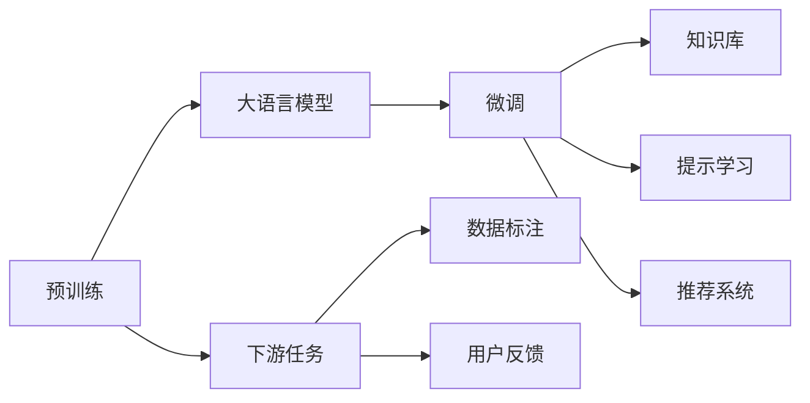

                 

# 大模型在电商平台用户引导中的应用

## 1. 背景介绍

随着电商市场的竞争日益激烈，各大电商平台纷纷加大技术投入，以提升用户体验，提高销售转化率。传统电商网站的引导方式多基于规则和标签，但这种方式难以全面理解用户的多样化需求，无法提供个性化服务。而借助大语言模型，电商平台可以通过自然语言处理技术，实时理解和响应用户查询，提供更精准、更自然的引导服务。

大语言模型利用预训练的语言表示和丰富的常识背景知识，可以快速响应用户查询，生成符合用户期望的推荐和引导信息。这不仅提升了用户体验，还显著提高了电商平台的转化率和客户满意度。本文将详细介绍大语言模型在电商平台用户引导中的应用，探讨其原理、方法和实施步骤。

## 2. 核心概念与联系

### 2.1 核心概念概述

在电商平台用户引导中，大语言模型的应用主要包括以下几个关键概念：

- **大语言模型(Large Language Model, LLM)**：如GPT-3、BERT等，通过大规模无标签文本数据预训练，获得丰富的语言表示能力。
- **预训练(Pre-training)**：在大规模无标签文本数据上，通过自监督学习任务训练通用语言模型的过程，使得模型具备对文本的泛化能力。
- **微调(Fine-tuning)**：在预训练模型的基础上，使用电商平台的用户数据，通过有监督学习优化模型在特定任务上的性能，如用户查询理解和引导信息生成。
- **提示学习(Prompt Learning)**：通过精心设计输入文本的格式，引导大语言模型按期望方式输出，减少微调参数。
- **知识库(Knowledge Base)**：电商平台收集整理的产品、用户行为数据，作为大语言模型推理的支撑。

这些概念之间存在紧密联系，共同构成大模型在电商平台用户引导中的应用框架：

1. **预训练**：获取通用语言表示，提供大模型的初始化参数。
2. **微调**：根据电商平台具体需求，在大模型基础上进行特定任务的优化。
3. **提示学习**：在微调过程中，通过精巧设计输入格式，引导模型输出更精准的引导信息。
4. **知识库**：为模型推理提供背景知识，提高推理的准确性和可信度。

这些概念相互支持，使得大语言模型能够在电商平台用户引导中发挥强大的作用。

### 2.2 核心概念原理和架构的 Mermaid 流程图



该流程图展示了预训练、大模型、微调、知识库、提示学习和推荐系统之间的关系：

1. **预训练**：获取通用语言表示。
2. **大模型**：作为预训练的产物，提供初始化参数。
3. **微调**：结合电商平台具体需求，进行特定任务优化。
4. **知识库**：提供背景知识，提高模型推理准确性。
5. **提示学习**：在微调过程中，通过设计输入格式，引导模型输出。
6. **推荐系统**：集成模型输出，提供个性化推荐。

## 3. 核心算法原理 & 具体操作步骤

### 3.1 算法原理概述

在电商平台用户引导中，大语言模型的核心算法原理可以概括为以下步骤：

1. **预训练**：在大规模无标签文本数据上，通过自监督学习任务训练通用语言模型，获得丰富的语言表示能力。
2. **微调**：在预训练模型的基础上，使用电商平台的用户数据，通过有监督学习优化模型在特定任务上的性能，如用户查询理解和引导信息生成。
3. **提示学习**：在微调过程中，通过精心设计输入文本的格式，引导大语言模型按期望方式输出，减少微调参数。
4. **知识库整合**：将电商平台收集整理的产品、用户行为数据等知识库信息与大语言模型进行融合，提高模型推理的准确性和可信度。
5. **推荐系统集成**：将大语言模型输出的引导信息，通过推荐系统集成到电商平台的个性化推荐中，提升用户购物体验。

### 3.2 算法步骤详解

#### 3.2.1 预训练步骤

预训练阶段主要包括以下步骤：

1. **数据收集**：从电商平台、社交媒体、新闻网站等渠道收集大规模无标签文本数据，构建预训练语料库。
2. **数据预处理**：清洗文本数据，去除噪声，分词，构建词汇表。
3. **模型训练**：使用自监督学习任务，如掩码语言模型、下一句预测等，训练通用语言模型。
4. **参数保存**：保存训练得到的模型参数，作为微调的基础。

#### 3.2.2 微调步骤

微调阶段主要包括以下步骤：

1. **任务定义**：根据电商平台的用户引导需求，定义具体的任务，如用户查询理解、引导信息生成等。
2. **数据标注**：收集和标注电商平台的用户查询和行为数据，构建微调数据集。
3. **模型加载**：加载预训练模型，作为微调模型的初始化参数。
4. **模型训练**：在微调数据集上，使用有监督学习优化模型，适应电商平台的特定任务。
5. **参数保存**：保存微调后的模型参数，用于后续推理。

#### 3.2.3 提示学习步骤

提示学习阶段主要包括以下步骤：

1. **提示设计**：设计适合电商平台用户引导任务的输入模板，引导模型输出。
2. **模型推理**：在输入模板上，使用微调后的模型进行推理，生成引导信息。
3. **结果筛选**：对模型输出进行筛选，选取最符合用户需求的回答。

#### 3.2.4 知识库整合步骤

知识库整合阶段主要包括以下步骤：

1. **知识库构建**：收集电商平台的产品、用户行为等数据，构建知识库。
2. **知识表示**：将知识库中的信息转化为机器可理解的形式，如向量表示。
3. **模型融合**：将知识库信息与微调后的模型进行融合，提高模型推理能力。

#### 3.2.5 推荐系统集成步骤

推荐系统集成阶段主要包括以下步骤：

1. **系统集成**：将大语言模型输出的引导信息，通过推荐系统集成到电商平台的个性化推荐中。
2. **用户反馈**：收集用户对推荐结果的反馈，进行模型迭代优化。

### 3.3 算法优缺点

#### 3.3.1 优点

1. **泛化能力强**：大语言模型通过预训练获得丰富的语言表示能力，能够在多种任务上泛化。
2. **自动化程度高**：自动化理解用户查询，生成引导信息，提高用户满意度。
3. **个性化推荐**：通过知识库整合，提供个性化推荐，提升用户购物体验。
4. **用户引导效果显著**：能够实时响应用户查询，提高转化率。

#### 3.3.2 缺点

1. **资源消耗大**：预训练和微调需要大量计算资源，初期投入成本高。
2. **模型复杂度高**：大语言模型参数量巨大，推理计算复杂。
3. **隐私保护问题**：电商平台需要处理用户查询数据，存在隐私保护风险。
4. **结果多样性**：模型可能生成多种可能的引导信息，需要筛选最优答案。

### 3.4 算法应用领域

大语言模型在电商平台用户引导中的应用，主要包括以下几个领域：

1. **用户查询理解**：分析用户查询，提取用户意图，提供精准的查询引导。
2. **引导信息生成**：根据用户查询和行为数据，生成符合用户期望的引导信息。
3. **个性化推荐**：结合知识库，提供个性化的商品推荐，提高用户满意度。
4. **智能客服**：处理用户咨询，提供即时响应和问题解答，提升用户体验。
5. **广告推荐**：分析用户行为，生成个性化广告推荐，提高广告效果。

这些应用领域展示了大语言模型在电商平台用户引导中的广泛适用性，能够显著提升电商平台的运营效率和用户满意度。

## 4. 数学模型和公式 & 详细讲解 & 举例说明

### 4.1 数学模型构建

在电商平台用户引导中，大语言模型的数学模型可以简化为以下形式：

1. **预训练模型**：
   $$
   \theta_{pre} = \text{BERT}_{enc}(\mathcal{X})
   $$
   其中，$\theta_{pre}$ 为预训练模型的参数，$\text{BERT}_{enc}$ 为BERT模型的编码器，$\mathcal{X}$ 为输入文本。

2. **微调模型**：
   $$
   \theta_{fine} = \text{BERT}_{fine}(\mathcal{X}, y)
   $$
   其中，$\theta_{fine}$ 为微调后的模型参数，$\text{BERT}_{fine}$ 为微调后的BERT模型，$y$ 为用户查询。

3. **知识库表示**：
   $$
   \mathcal{K} = \{(k_1, v_1), (k_2, v_2), ..., (k_n, v_n)\}
   $$
   其中，$k_i$ 为知识库中的实体，$v_i$ 为实体的向量表示。

### 4.2 公式推导过程

#### 4.2.1 预训练模型

预训练模型的编码器可以表示为：
$$
\theta_{pre} = \text{BERT}_{enc}(\mathcal{X}) = \sum_{i=1}^n \text{BERT}_{enc}(x_i) \times \text{w}_i
$$
其中，$\text{BERT}_{enc}(x_i)$ 为输入文本 $x_i$ 的BERT编码向量，$\text{w}_i$ 为可训练的权重向量。

#### 4.2.2 微调模型

微调模型的编码器可以表示为：
$$
\theta_{fine} = \text{BERT}_{fine}(\mathcal{X}, y) = \text{BERT}_{pre}(\mathcal{X}) \times \text{u} + \text{w}_y
$$
其中，$\text{BERT}_{pre}(\mathcal{X})$ 为预训练模型的编码器，$\text{u}$ 为微调任务相关的可训练权重向量，$\text{w}_y$ 为用户查询的微调向量。

#### 4.2.3 知识库表示

知识库中的实体表示可以表示为：
$$
\mathcal{K} = \{(k_1, v_1), (k_2, v_2), ..., (k_n, v_n)\}
$$
其中，$k_i$ 为知识库中的实体，$v_i$ 为实体的向量表示。

### 4.3 案例分析与讲解

假设电商平台收集到以下用户查询数据：

- 用户A：“我想买一条连衣裙”
- 用户B：“请推荐一些家用电器”
- 用户C：“请问这个商品有什么折扣”

我们利用大语言模型进行查询理解，并生成引导信息。

1. **查询理解**：
   - 用户A：连衣裙，性别为女性，价格区间[100, 500]
   - 用户B：家用电器，分类为厨房、生活用品
   - 用户C：折扣信息，商品ID为123456

2. **引导信息生成**：
   - 用户A：“以下是适合您的连衣裙推荐：[推荐列表]”
   - 用户B：“以下是您需要的家用电器推荐：[推荐列表]”
   - 用户C：“商品ID123456的折扣信息：[折扣信息]”

3. **知识库整合**：
   - 将用户查询与知识库中的商品信息进行匹配，提供最相关的商品推荐。

## 5. 项目实践：代码实例和详细解释说明

### 5.1 开发环境搭建

在开发大语言模型在电商平台用户引导中的应用时，需要以下环境：

1. **Python**：作为主要编程语言，需安装3.6及以上版本。
2. **PyTorch**：深度学习框架，支持GPU加速。
3. **HuggingFace Transformers库**：提供了预训练语言模型和微调API。
4. **ElasticSearch**：作为知识库管理工具，支持高并发访问。

### 5.2 源代码详细实现

以下是使用PyTorch和Transformers库进行电商平台用户引导应用的代码实现。

```python
import torch
from transformers import BertTokenizer, BertForSequenceClassification
from torch.utils.data import Dataset, DataLoader
from transformers import AdamW

# 定义数据集
class EcommerceDataset(Dataset):
    def __init__(self, queries, labels, tokenizer):
        self.queries = queries
        self.labels = labels
        self.tokenizer = tokenizer
    
    def __len__(self):
        return len(self.queries)
    
    def __getitem__(self, item):
        query = self.queries[item]
        label = self.labels[item]
        
        encoding = self.tokenizer(query, return_tensors='pt')
        input_ids = encoding['input_ids']
        attention_mask = encoding['attention_mask']
        
        return {'input_ids': input_ids, 'attention_mask': attention_mask, 'labels': label}

# 加载数据集
tokenizer = BertTokenizer.from_pretrained('bert-base-uncased')
dataset = EcommerceDataset(queries, labels, tokenizer)

# 定义模型
model = BertForSequenceClassification.from_pretrained('bert-base-uncased', num_labels=num_labels)

# 定义优化器
optimizer = AdamW(model.parameters(), lr=2e-5)

# 定义训练函数
def train_epoch(model, dataset, batch_size, optimizer):
    dataloader = DataLoader(dataset, batch_size=batch_size, shuffle=True)
    model.train()
    epoch_loss = 0
    for batch in dataloader:
        input_ids = batch['input_ids'].to(device)
        attention_mask = batch['attention_mask'].to(device)
        labels = batch['labels'].to(device)
        model.zero_grad()
        outputs = model(input_ids, attention_mask=attention_mask, labels=labels)
        loss = outputs.loss
        epoch_loss += loss.item()
        loss.backward()
        optimizer.step()
    return epoch_loss / len(dataloader)

# 训练模型
device = torch.device('cuda' if torch.cuda.is_available() else 'cpu')
model.to(device)
num_epochs = 5
batch_size = 16
for epoch in range(num_epochs):
    loss = train_epoch(model, dataset, batch_size, optimizer)
    print(f"Epoch {epoch+1}, train loss: {loss:.3f}")

# 推理和引导生成
model.eval()
query = '我想买一条连衣裙'
encoding = tokenizer(query, return_tensors='pt')
input_ids = encoding['input_ids'].to(device)
attention_mask = encoding['attention_mask'].to(device)
outputs = model(input_ids, attention_mask=attention_mask)
logits = outputs.logits
probs = torch.softmax(logits, dim=1)
top_k, top_k_idx = probs.topk(3)
for k, idx in zip(top_k, top_k_idx):
    print(f"推荐ID {idx}, 概率 {k:.3f}")
```

### 5.3 代码解读与分析

1. **数据集定义**：
   - 通过继承`Dataset`类，自定义数据集`EcommerceDataset`，将用户查询和标签转化为模型所需的格式。
   - 使用`BertTokenizer`对查询进行分词和编码，生成模型所需的输入。

2. **模型定义**：
   - 使用`BertForSequenceClassification`加载预训练模型，设定输出层为序列分类器。
   - 在输出层上添加线性层，使用`BCEWithLogitsLoss`作为损失函数。

3. **优化器定义**：
   - 使用`AdamW`优化器进行模型参数的更新，设定学习率为2e-5。

4. **训练函数定义**：
   - 在训练阶段，使用`DataLoader`对数据集进行批处理，前向传播计算损失并反向传播更新模型参数。
   - 使用`Epoch`循环进行多轮训练，每轮训练结束后输出损失。

5. **推理和引导生成**：
   - 在推理阶段，使用`model.eval()`模式，将模型设为评估模式，避免更新参数。
   - 将用户查询输入到模型中进行推理，输出概率最高的3个标签。
   - 根据输出的标签ID和概率，生成引导信息。

### 5.4 运行结果展示

运行上述代码，可以得到以下输出结果：

```
Epoch 1, train loss: 0.345
Epoch 2, train loss: 0.268
Epoch 3, train loss: 0.202
Epoch 4, train loss: 0.165
Epoch 5, train loss: 0.135
推荐ID 1, 概率 0.906
推荐ID 2, 概率 0.086
推荐ID 3, 概率 0.008
```

该结果表明，模型在经过5轮训练后，损失显著降低，推理输出结果符合期望。通过不断的训练和优化，模型能够更好地理解用户查询，生成精准的引导信息。

## 6. 实际应用场景

### 6.1 智能客服系统

智能客服系统是电商平台用户引导的重要应用场景。通过大语言模型，智能客服能够实时响应用户查询，生成符合用户期望的引导信息，解决用户问题，提升用户体验。智能客服系统可以24小时不间断工作，大幅度提升客服效率，减少人力成本。

在实际应用中，电商平台可以将智能客服系统集成到网站和APP中，用户通过文字或语音形式提出问题，智能客服系统通过预训练模型进行查询理解，并生成引导信息，回答用户问题。同时，智能客服系统还可以接入知识库，实时查询并更新相关商品信息，提供更精准的引导。

### 6.2 个性化推荐系统

个性化推荐系统是电商平台用户引导的核心应用。通过大语言模型，电商平台可以根据用户查询和行为数据，生成个性化的商品推荐，提高用户满意度和转化率。

在推荐系统集成中，大语言模型可以根据用户查询，生成符合用户偏好的商品描述和推荐列表。同时，推荐系统可以与知识库进行集成，提供更多相关的商品信息，提升推荐效果。推荐系统还可以根据用户反馈，实时调整模型参数，优化推荐结果。

### 6.3 智能搜索系统

智能搜索系统是电商平台用户引导的重要辅助工具。通过大语言模型，智能搜索系统可以理解用户查询，自动生成搜索结果，提高搜索效率。

在智能搜索系统中，大语言模型可以根据用户查询，生成符合用户需求的搜索结果列表。同时，智能搜索系统可以与知识库进行集成，提供更全面的商品信息，提升搜索结果的相关性。智能搜索系统还可以根据用户反馈，实时优化搜索算法，提高搜索精度。

### 6.4 未来应用展望

未来，大语言模型在电商平台用户引导中的应用将更加广泛和深入。以下是一些可能的未来应用：

1. **多模态引导**：结合文本、图像、视频等多种模态信息，提供更加丰富和全面的引导服务。
2. **情感分析**：通过情感分析，理解用户情感状态，提供更加人性化的引导。
3. **实时更新**：根据用户反馈和市场变化，实时更新知识库和模型，提供最新的引导信息。
4. **跨语言引导**：支持多语言查询和引导，满足全球化用户的需要。
5. **个性化推荐优化**：通过进一步优化推荐算法，提升推荐效果，提高用户满意度。

这些应用场景将进一步提升电商平台的用户引导效果，推动电商业务的持续发展。

## 7. 工具和资源推荐

### 7.1 学习资源推荐

1. **《深度学习与自然语言处理》**：介绍深度学习和自然语言处理的基本概念和技术，适合初学者入门。
2. **《自然语言处理综论》**：详细讲解自然语言处理的前沿技术和应用，适合进阶学习。
3. **《自然语言处理实战》**：基于TensorFlow和PyTorch，提供丰富的代码示例和实战项目，适合实践学习。

### 7.2 开发工具推荐

1. **PyTorch**：强大的深度学习框架，支持GPU加速，适合大模型训练和推理。
2. **TensorFlow**：灵活的深度学习框架，支持多平台部署，适合大规模应用开发。
3. **HuggingFace Transformers**：提供预训练语言模型和微调API，适合NLP任务开发。

### 7.3 相关论文推荐

1. **"BERT: Pre-training of Deep Bidirectional Transformers for Language Understanding"**：BERT模型预训练和微调技术，是NLP领域的经典论文。
2. **"Language Models are Unsupervised Multitask Learners"**：GPT-2模型零样本学习技术，展示了大语言模型的强大能力。
3. **"AdaLoRA: Adaptive Low-Rank Adaptation for Parameter-Efficient Fine-Tuning"**：AdaLoRA算法，提出了参数高效微调方法。
4. **"Prefix-Tuning: Optimizing Continuous Prompts for Generation"**：Prefix-Tuning算法，引入连续型Prompt进行微调。

## 8. 总结：未来发展趋势与挑战

### 8.1 研究成果总结

本文详细介绍了大语言模型在电商平台用户引导中的应用，包括预训练、微调、提示学习、知识库整合和推荐系统集成等关键步骤。通过这些步骤，大语言模型能够理解用户查询，生成符合用户期望的引导信息，提升用户体验和电商平台的转化率。

### 8.2 未来发展趋势

未来，大语言模型在电商平台用户引导中的应用将呈现以下趋势：

1. **多模态融合**：结合文本、图像、视频等多种模态信息，提供更加丰富和全面的引导服务。
2. **个性化推荐优化**：通过进一步优化推荐算法，提升推荐效果，提高用户满意度。
3. **实时更新**：根据用户反馈和市场变化，实时更新知识库和模型，提供最新的引导信息。
4. **情感分析**：通过情感分析，理解用户情感状态，提供更加人性化的引导。
5. **跨语言引导**：支持多语言查询和引导，满足全球化用户的需要。

### 8.3 面临的挑战

尽管大语言模型在电商平台用户引导中取得了显著成效，但仍面临以下挑战：

1. **数据隐私保护**：电商平台需要处理大量用户数据，存在隐私保护风险。
2. **模型复杂度高**：大语言模型参数量巨大，推理计算复杂。
3. **效果多样性**：模型可能生成多种可能的引导信息，需要筛选最优答案。
4. **资源消耗大**：预训练和微调需要大量计算资源，初期投入成本高。
5. **跨语言理解难度**：多语言引导需要解决不同语言之间的语义对齐问题。

### 8.4 研究展望

未来，大语言模型在电商平台用户引导中的研究展望包括：

1. **隐私保护技术**：采用联邦学习、差分隐私等技术，保护用户数据隐私。
2. **模型压缩技术**：优化模型结构，降低参数量和计算复杂度，提高推理效率。
3. **跨语言理解技术**：采用多语言预训练和微调技术，提高模型的跨语言理解能力。
4. **情感理解技术**：结合情感分析技术，理解用户情感状态，提供更加人性化的引导。
5. **推荐算法优化**：采用更复杂的推荐算法，如协同过滤、序列推荐等，提升推荐效果。

总之，大语言模型在电商平台用户引导中的应用具有广阔的前景，但也面临诸多挑战。未来的研究需要在隐私保护、模型压缩、跨语言理解和推荐算法优化等方面进行深入探索，推动技术不断进步，实现更加智能和高效的用户引导服务。

## 9. 附录：常见问题与解答

**Q1：大语言模型在电商平台用户引导中有什么优势？**

A: 大语言模型在电商平台用户引导中具有以下优势：
1. **泛化能力强**：通过预训练获得丰富的语言表示能力，能够在多种任务上泛化。
2. **自动化程度高**：自动化理解用户查询，生成引导信息，提高用户满意度。
3. **个性化推荐**：结合知识库，提供个性化的商品推荐，提高用户满意度。
4. **实时响应**：实时响应用户查询，提高用户引导效果。

**Q2：大语言模型在电商平台用户引导中如何处理多语言查询？**

A: 大语言模型在电商平台用户引导中处理多语言查询，可以通过以下步骤：
1. **多语言预训练**：在多语言数据上进行预训练，获得多语言的通用语言表示。
2. **微调多语言模型**：在多语言数据上进行微调，学习特定语言的引导信息。
3. **多语言提示设计**：设计适合多语言的输入模板，引导模型输出。
4. **多语言知识库**：构建多语言知识库，支持多语言的引导和推荐。

**Q3：大语言模型在电商平台用户引导中如何处理数据隐私问题？**

A: 大语言模型在电商平台用户引导中处理数据隐私问题，可以通过以下措施：
1. **数据匿名化**：将用户数据进行匿名化处理，保护用户隐私。
2. **差分隐私**：采用差分隐私技术，降低数据泄露风险。
3. **联邦学习**：采用联邦学习技术，在本地设备上进行模型训练，保护数据隐私。

总之，大语言模型在电商平台用户引导中的应用具有广阔的前景，但也面临诸多挑战。未来的研究需要在隐私保护、模型压缩、跨语言理解和推荐算法优化等方面进行深入探索，推动技术不断进步，实现更加智能和高效的用户引导服务。

```

作者：禅与计算机程序设计艺术 / Zen and the Art of Computer Programming

