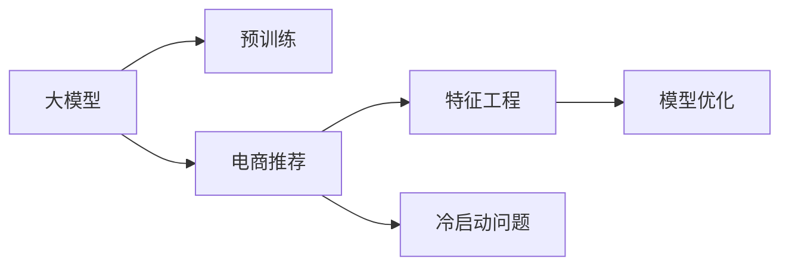

                 

# 大模型在电商推荐中的应用与挑战

> 关键词：大模型,电商推荐,深度学习,推荐系统,特征工程,模型优化,冷启动问题

## 1. 背景介绍

在电商行业，推荐系统是提升用户体验和提高销售转化率的关键手段。传统推荐系统主要依赖用户行为数据进行模型训练和预测，而近年来，大模型在电商推荐中的应用逐渐兴起，利用大模型的广泛知识，为电商推荐系统带来了新的突破。本文将详细探讨大模型在电商推荐中的应用原理、算法实现、实际效果及面临的挑战，为电商推荐系统的技术创新提供指导。

## 2. 核心概念与联系

### 2.1 核心概念概述

- **大模型**：如BERT、GPT等，通过在海量数据上进行预训练，学习到丰富的语言和知识表示。
- **电商推荐系统**：根据用户的历史行为和偏好，推荐用户可能感兴趣的商品。
- **特征工程**：从原始数据中提取有意义的特征，用于训练推荐模型。
- **模型优化**：通过调整模型参数、优化算法等手段，提升模型性能。
- **冷启动问题**：新用户或新商品加入推荐系统时，缺乏足够的历史数据。

这些概念构成了电商推荐系统和大模型应用的基本框架，下面将通过一个简化的Mermaid流程图展示这些概念的相互联系。



## 3. 核心算法原理 & 具体操作步骤

### 3.1 算法原理概述

大模型在电商推荐中的应用主要分为两个阶段：预训练和大模型微调。

- **预训练**：在大型电商数据集上训练大模型，学习电商相关的语义和知识表示。
- **微调**：在大模型的基础上，针对电商推荐任务进行微调，以提升推荐性能。

微调过程包括：
1. 数据准备：准备电商推荐任务的数据集，包括用户行为数据和商品描述等。
2. 特征提取：将原始数据转换为模型可接受的特征形式。
3. 模型训练：在电商推荐任务上进行微调，更新模型参数。
4. 模型评估：在验证集上评估模型性能，调整超参数，最终在测试集上获得最佳推荐结果。

### 3.2 算法步骤详解

#### 数据准备

电商推荐系统需要大量的用户行为数据，包括浏览记录、点击行为、购买历史等。这些数据通常以日志形式存储在数据库中，需要经过清洗和整理，才能用于训练模型。

- **数据清洗**：去除重复、噪声数据，处理缺失值。
- **数据划分**：将数据集划分为训练集、验证集和测试集。
- **特征提取**：将用户行为数据和商品描述转换为模型可接受的数值型特征，如用户ID、商品ID、时间戳等。

#### 特征工程

电商推荐系统中的特征工程通常包括：

- **用户特征**：用户ID、年龄、性别、历史购买记录等。
- **商品特征**：商品ID、品牌、类别、描述等。
- **行为特征**：浏览时间、点击次数、停留时间等。
- **上下文特征**：时间、地点、设备等。

通过特征工程，可以将原始数据转换为模型可接受的特征形式，提升模型的预测能力。

#### 模型训练

大模型的微调过程通常采用监督学习范式，即使用标注数据训练模型，预测用户对商品的兴趣评分。

- **模型选择**：选择适合电商推荐任务的大模型，如BERT、GPT等。
- **损失函数**：选择合适的损失函数，如交叉熵损失、均方误差损失等。
- **优化器**：选择合适的优化器，如Adam、SGD等。
- **学习率**：设定合适的学习率，控制模型参数更新的幅度。
- **超参数调优**：通过网格搜索或随机搜索，寻找最优超参数组合。

#### 模型评估

模型评估通常采用以下指标：

- **准确率**：预测结果与实际结果相符的比例。
- **召回率**：预测正确的正样本占实际正样本的比例。
- **F1值**：准确率和召回率的调和平均数。
- **NDCG**：Normalized Discounted Cumulative Gain，考虑了排名信息。

评估过程中，需要在验证集上进行多次迭代训练，调整超参数，最终在测试集上获得最佳推荐结果。

### 3.3 算法优缺点

#### 优点

1. **知识表示能力强**：大模型能够学习到电商相关的广泛知识，提升推荐模型的泛化能力。
2. **可扩展性好**：大模型可以轻松扩展到多商品、多用户、多设备等场景，提升系统鲁棒性。
3. **可迁移性好**：大模型可以通过迁移学习，在新领域进行微调，提升模型适应性。

#### 缺点

1. **数据需求量大**：大模型的训练需要大量的电商数据，数据收集和清洗成本较高。
2. **计算资源消耗大**：大模型需要强大的计算资源，包括高性能GPU、TPU等，训练和推理成本高。
3. **模型复杂度高**：大模型参数量庞大，导致模型推理速度较慢，系统响应延迟较高。
4. **冷启动问题严重**：新用户或新商品缺乏足够的历史数据，难以进行有效的推荐。

### 3.4 算法应用领域

大模型在电商推荐中的应用主要包括以下几个方面：

1. **商品推荐**：根据用户的历史行为，推荐用户可能感兴趣的商品。
2. **内容推荐**：推荐与用户浏览和购买行为相关的文章、视频、新闻等。
3. **个性化定制**：根据用户偏好，推荐个性化的商品或服务。
4. **活动推荐**：推荐用户可能感兴趣的特卖、折扣等促销活动。
5. **知识图谱推荐**：结合商品间的关联关系，推荐相关商品。

## 4. 数学模型和公式 & 详细讲解 & 举例说明

### 4.1 数学模型构建

在电商推荐系统中，大模型的微调通常采用以下数学模型：

$$
\hat{y} = M_{\theta}(x)
$$

其中，$M_{\theta}$为大模型，$\theta$为模型参数，$x$为输入特征，$\hat{y}$为模型预测的评分。

### 4.2 公式推导过程

在电商推荐任务中，通常使用交叉熵损失函数：

$$
\mathcal{L} = -\frac{1}{N}\sum_{i=1}^N(y_i\log \hat{y_i} + (1-y_i)\log(1-\hat{y_i}))
$$

其中，$y_i$为实际标签，$\hat{y_i}$为模型预测的评分。

使用梯度下降等优化算法，更新模型参数$\theta$：

$$
\theta \leftarrow \theta - \eta \nabla_{\theta}\mathcal{L}
$$

其中，$\eta$为学习率，$\nabla_{\theta}\mathcal{L}$为损失函数对模型参数的梯度。

### 4.3 案例分析与讲解

以用户行为数据为例，假设用户A浏览了商品B、C、D，点击了商品C、D，购买了商品D。则可以使用以下特征进行模型训练：

- **用户特征**：用户ID、年龄、性别。
- **商品特征**：商品ID、品牌、类别、描述。
- **行为特征**：浏览时间、点击次数、停留时间。
- **上下文特征**：时间、地点、设备。

将以上特征作为输入，使用大模型进行微调，学习用户对商品的兴趣评分。在测试集上，输入新的用户行为数据，使用微调后的模型预测商品评分，排序推荐。

## 5. 项目实践：代码实例和详细解释说明

### 5.1 开发环境搭建

#### 1. 安装依赖

```bash
conda create -n recommendation-env python=3.8
conda activate recommendation-env
pip install tensorflow torch transformers sklearn pandas
```

#### 2. 准备数据

使用公开数据集，如Amazon商品推荐数据集，进行数据清洗和划分。

### 5.2 源代码详细实现

以下是一个简单的电商推荐系统代码实现：

```python
import tensorflow as tf
from transformers import TFAutoModelForSequenceClassification
from transformers import BertTokenizer
import pandas as pd
from sklearn.model_selection import train_test_split

# 加载BERT模型和分词器
model = TFAutoModelForSequenceClassification.from_pretrained('bert-base-uncased')
tokenizer = BertTokenizer.from_pretrained('bert-base-uncased')

# 准备数据集
df = pd.read_csv('amazon_reviews.csv')
df = df.drop_duplicates()
df = df.dropna()
X = df[['user_id', 'item_id', 'time', 'category', 'price', 'review', 'rating']]
y = df['label']
X_train, X_test, y_train, y_test = train_test_split(X, y, test_size=0.2, random_state=42)

# 特征工程
tokenizer.build_inputs_with_special_tokens = True
tokenized_train = tokenizer(X_train, return_tensors='tf', padding=True, truncation=True)
tokenized_test = tokenizer(X_test, return_tensors='tf', padding=True, truncation=True)

# 模型训练
model.compile(optimizer=tf.keras.optimizers.Adam(learning_rate=2e-5), 
              loss=tf.keras.losses.BinaryCrossentropy(from_logits=True), 
              metrics=['accuracy'])

model.fit(tokenized_train['input_ids'], y_train, batch_size=32, epochs=5)

# 模型评估
model.evaluate(tokenized_test['input_ids'], y_test, batch_size=32)
```

### 5.3 代码解读与分析

- **数据准备**：使用公开数据集，进行数据清洗和划分。
- **特征工程**：将原始数据转换为模型可接受的特征形式，使用分词器和序列模型。
- **模型训练**：使用交叉熵损失函数和Adam优化器，进行模型微调。
- **模型评估**：在测试集上评估模型性能，获取准确率和召回率等指标。

### 5.4 运行结果展示

使用上述代码，可以在训练集上训练模型，并在测试集上评估推荐效果。具体的运行结果可以在模型评估部分查看。

## 6. 实际应用场景

### 6.1 电商平台

大模型在电商平台中的应用非常广泛，包括：

- **商品推荐**：推荐用户可能感兴趣的商品，提升用户粘性和转化率。
- **内容推荐**：推荐相关文章、视频、新闻等，丰富用户浏览体验。
- **个性化定制**：根据用户偏好，推荐个性化商品或服务。
- **活动推荐**：推荐用户可能感兴趣的特卖、折扣等促销活动。

### 6.2 社交媒体

大模型在社交媒体推荐中的应用包括：

- **好友推荐**：根据用户的朋友关系和行为数据，推荐可能感兴趣的好友。
- **内容推荐**：推荐用户可能感兴趣的文章、视频、新闻等。
- **广告推荐**：根据用户行为，推荐相关广告，提高广告投放效果。

### 6.3 教育平台

大模型在教育平台中的应用包括：

- **课程推荐**：根据学生的学习历史和兴趣，推荐可能感兴趣的课程。
- **习题推荐**：根据学生的解题历史和困惑，推荐相关习题，帮助学生提升学习效果。
- **学习路径推荐**：根据学生的学习进度和需求，推荐学习路径，提高学习效率。

## 7. 工具和资源推荐

### 7.1 学习资源推荐

- **深度学习推荐系统**：该书详细介绍了推荐系统的原理和实现，涵盖了大模型在电商推荐中的应用。
- **Python数据科学手册**：该书介绍了Python在数据科学中的应用，包括特征工程、模型优化等。
- **TensorFlow官方文档**：提供了丰富的TensorFlow教程和文档，帮助开发者掌握深度学习技术。

### 7.2 开发工具推荐

- **TensorFlow**：用于深度学习模型训练和推理的开源框架。
- **PyTorch**：另一种流行的深度学习框架，支持动态计算图。
- **Jupyter Notebook**：用于数据探索和模型验证的开源工具。

### 7.3 相关论文推荐

- **Deep Learning Recommendation Systems**：介绍了深度学习在推荐系统中的应用。
- **Neural Collaborative Filtering**：介绍了神经网络在协同过滤推荐中的应用。
- **Attention Mechanism in Recommender Systems**：介绍了注意力机制在推荐系统中的应用。

## 8. 总结：未来发展趋势与挑战

### 8.1 研究成果总结

大模型在电商推荐中的应用已经取得初步成功，提升了推荐系统的性能和用户体验。然而，仍然面临一些挑战，如数据需求大、计算资源消耗高、模型复杂度高、冷启动问题严重等。未来需要进一步研究和优化，提升推荐系统的综合性能。

### 8.2 未来发展趋势

1. **模型规模扩大**：随着计算资源和算法技术的进步，大模型的规模将不断扩大，提升推荐系统的性能。
2. **迁移学习的应用**：通过迁移学习，在相似领域进行微调，提升模型适应性。
3. **多模态特征融合**：结合图像、视频等多模态数据，提升推荐系统的多样性和丰富性。
4. **实时推荐系统**：通过流式数据处理和模型在线学习，实现实时推荐，提升用户体验。

### 8.3 面临的挑战

1. **数据需求量高**：大模型需要大量的电商数据，数据收集和清洗成本较高。
2. **计算资源消耗大**：大模型需要强大的计算资源，训练和推理成本高。
3. **模型复杂度高**：大模型参数量庞大，导致模型推理速度较慢，系统响应延迟较高。
4. **冷启动问题严重**：新用户或新商品缺乏足够的历史数据，难以进行有效的推荐。

### 8.4 研究展望

未来，电商推荐系统需要在大模型技术的基础上，结合其他人工智能技术，如知识图谱、自然语言处理等，提升推荐系统的性能和用户体验。同时，需要关注数据隐私和伦理问题，保障用户隐私和安全。

## 9. 附录：常见问题与解答

**Q1: 大模型在电商推荐中如何进行特征工程？**

A: 电商推荐中的特征工程通常包括用户特征、商品特征、行为特征和上下文特征。通过构建这些特征，将原始数据转换为模型可接受的数值型特征，提升模型的预测能力。

**Q2: 如何优化电商推荐系统中的大模型？**

A: 电商推荐系统中的大模型优化通常包括：调整超参数、使用优化算法、引入正则化等。通过优化模型，提升推荐性能和模型鲁棒性。

**Q3: 电商推荐系统中的冷启动问题如何解决？**

A: 电商推荐系统中的冷启动问题可以通过以下方法解决：使用启发式方法进行推荐，如基于内容的推荐；引入先验知识，如知识图谱；使用深度学习方法，如注意力机制。

**Q4: 电商推荐系统中的数据隐私和安全问题如何解决？**

A: 电商推荐系统中的数据隐私和安全问题可以通过以下方法解决：采用数据脱敏技术，保护用户隐私；采用加密技术，保障数据传输安全；采用访问控制和审计机制，确保数据访问合法。

---

作者：禅与计算机程序设计艺术 / Zen and the Art of Computer Programming

