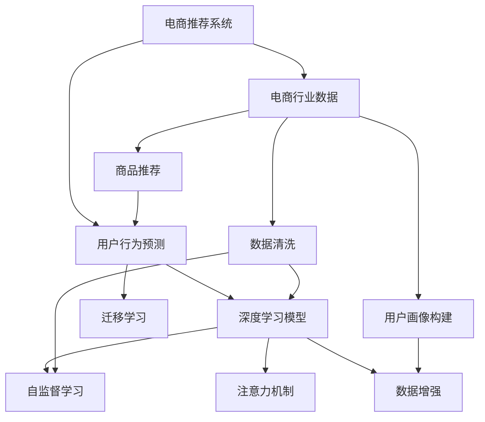

                 

# 大模型在电商用户行为预测中的应用

> 关键词：大模型,用户行为预测,电商,深度学习,自监督学习,迁移学习,注意力机制,数据增强,电商推荐系统

## 1. 背景介绍

### 1.1 问题由来

电商行业作为全球最重要的零售领域之一，具有显著的行业特点。首先，电商平台的商品种类繁多，用户行为数据也非常丰富，这些数据包含着用户的购买历史、浏览记录、评价反馈、个性化设置等多种信息。其次，电商用户具有极强的个性化需求，其行为特征往往受到用户画像、时间、地域、产品价格等众多因素的影响。

大模型在电商用户行为预测中的应用，能够充分利用这些海量数据，挖掘用户行为的内在规律，预测用户未来的购买意向和潜在需求。例如，用户行为预测可以用于：

- 个性化推荐系统：分析用户历史行为，推荐用户可能感兴趣的商品。
- 库存优化：预测用户购买需求，优化库存结构，减少缺货或过剩的情况。
- 价格优化：预测用户对不同价格点商品的反应，制定合理的定价策略。
- 流失用户预测：识别可能流失的用户，及时采取挽回措施。
- 用户画像构建：挖掘用户行为特征，构建用户画像，增强营销精准性。

为了满足上述需求，各大电商企业都在积极探索和应用大模型技术，特别是深度学习模型，以期在用户行为预测方面获得突破。

### 1.2 问题核心关键点

大模型在电商用户行为预测中，涉及的关键点包括：

1. 数据准备：收集和清洗电商用户行为数据，构建合适的训练集、验证集和测试集。
2. 模型选择：选择合适的深度学习模型或模型架构，以适应电商用户行为预测的特定需求。
3. 预训练与微调：利用自监督学习技术对模型进行预训练，然后通过迁移学习和微调技术，使其适应电商用户行为预测任务。
4. 模型优化：通过超参数调优、正则化、数据增强等方法，提高模型的泛化能力和性能。
5. 预测部署：将训练好的模型部署到电商平台的推荐系统或决策系统中，实现实时预测和决策支持。

## 2. 核心概念与联系

### 2.1 核心概念概述

为了更好地理解大模型在电商用户行为预测中的应用，本节将介绍几个密切相关的核心概念：

- **电商推荐系统**：基于用户行为数据，向用户推荐其可能感兴趣的商品的系统。
- **用户行为预测**：利用历史行为数据，预测用户未来的购买意向和需求。
- **深度学习模型**：基于人工神经网络的结构和优化算法，可以处理复杂数据和模型结构。
- **自监督学习**：利用无标签数据，自动学习特征表示，用于模型预训练。
- **迁移学习**：将在大规模数据上训练好的模型，应用于小规模数据上的任务。
- **注意力机制**：一种用于提升模型性能的机制，用于捕捉输入数据中的重要特征。
- **数据增强**：通过生成额外的训练样本，提高模型泛化能力的技术。
- **电商行业数据**：电商平台的商品信息、用户行为、用户画像等多种数据，是电商推荐和预测的基础。

这些核心概念之间的逻辑关系可以通过以下Mermaid流程图来展示：



这个流程图展示了大模型在电商用户行为预测中的核心概念及其之间的关系：

1. 电商推荐系统基于用户行为预测，推荐可能感兴趣的商品。
2. 用户行为预测涉及深度学习模型，并进行预训练和微调。
3. 深度学习模型通过自监督学习进行预训练，通过迁移学习应用于电商用户行为预测。
4. 注意力机制提升模型性能，数据增强提高泛化能力。
5. 电商行业数据经过清洗和增强后，输入模型进行训练和预测。
6. 用户画像构建通过用户行为特征挖掘，增强推荐系统的个性化能力。

这些概念共同构成了电商用户行为预测的大模型框架，使得其能够在电商推荐系统和决策支持系统中发挥强大的预测能力。

## 3. 核心算法原理 & 具体操作步骤
### 3.1 算法原理概述

大模型在电商用户行为预测中的应用，主要基于深度学习模型和自监督学习技术。其核心思想是：利用电商平台的海量用户行为数据，对大模型进行预训练，然后通过迁移学习和微调，使其能够准确预测用户的购买意向和需求。

具体来说，算法原理如下：

1. **数据预处理**：收集电商平台的用户行为数据，并进行清洗和标准化处理，构建训练集、验证集和测试集。
2. **模型预训练**：使用无标签电商数据，对深度学习模型进行预训练，学习到通用的数据表示。
3. **任务适配**：根据电商用户行为预测的具体需求，设计合适的任务适配层，并将其附加到预训练模型之上。
4. **迁移学习**：将预训练模型应用于电商用户行为预测任务，通过微调方法调整模型参数，使其适应电商场景。
5. **模型优化**：通过超参数调优、正则化、数据增强等技术，提高模型的泛化能力和预测精度。

### 3.2 算法步骤详解

电商用户行为预测的算法步骤可以归纳为以下几个关键环节：

**Step 1: 数据预处理**
- 收集电商平台的原始用户行为数据，包括点击、浏览、购买、评价、收藏等多种行为数据。
- 对数据进行清洗、去重、归一化等处理，构建训练集、验证集和测试集。
- 对数据进行特征工程，提取对预测任务有用的特征，如用户ID、商品ID、行为时间、商品价格等。

**Step 2: 模型选择**
- 选择深度学习模型，如Transformer、LSTM等，作为电商用户行为预测的基础模型。
- 在预训练模型的基础上，设计合适的任务适配层，如分类头、回归头、注意力机制等。
- 确定模型的超参数，如学习率、批大小、迭代轮数等。

**Step 3: 模型预训练**
- 使用电商平台的无标签数据，对选择的深度学习模型进行自监督预训练，学习到通用的数据表示。
- 常用的自监督预训练方法包括掩码语言模型、自编码等。
- 预训练过程可以采用分布式训练或混合精度训练，以提高训练效率和模型性能。

**Step 4: 迁移学习**
- 将预训练模型应用于电商用户行为预测任务，进行迁移学习。
- 使用标注好的电商数据集，对模型进行微调，优化模型的参数。
- 微调过程可以采用较小的学习率，避免破坏预训练权重。
- 可以采用早停策略，防止过拟合。

**Step 5: 模型优化**
- 对微调后的模型进行超参数调优，如学习率、批大小等。
- 应用正则化技术，如L2正则、Dropout等，防止模型过拟合。
- 使用数据增强技术，如文本回译、近义词替换等，增加数据多样性。
- 引入对抗样本，提高模型鲁棒性。

**Step 6: 预测部署**
- 将训练好的模型部署到电商推荐系统或决策系统中，实现实时预测和决策支持。
- 监控模型性能，根据实际需求进行模型的更新和优化。

以上是电商用户行为预测的大模型微调流程，开发者可以根据具体需求，灵活调整各个环节的策略和实现细节。

### 3.3 算法优缺点

大模型在电商用户行为预测中的应用，具有以下优点：

1. 利用深度学习模型，能够处理复杂数据结构，提取高层次特征。
2. 通过预训练和迁移学习，可以利用电商平台的丰富数据，提升模型性能。
3. 数据增强和对抗样本技术，提高模型的泛化能力和鲁棒性。
4. 微调过程可以通过超参数调优和正则化技术，进一步提高模型性能。

同时，该方法也存在一定的局限性：

1. 对数据质量要求高。电商数据质量直接影响模型的性能，数据清洗和特征工程需要耗费大量精力。
2. 模型复杂度高。大模型结构复杂，训练和推理计算量大，需要高性能硬件支持。
3. 模型解释性不足。深度学习模型通常缺乏可解释性，难以解释模型的决策过程。
4. 需要大量标注数据。电商数据标注成本高，标注数据集往往需要人工标注，周期长。

尽管存在这些局限性，但大模型在电商用户行为预测中的应用，仍然展现了强大的潜力，特别是在用户行为预测、个性化推荐等任务上取得了显著的成果。

### 3.4 算法应用领域

大模型在电商用户行为预测中的应用，主要涵盖以下几个领域：

1. **个性化推荐系统**：分析用户历史行为，推荐可能感兴趣的商品。
2. **库存优化**：预测用户购买需求，优化库存结构，减少缺货或过剩的情况。
3. **价格优化**：预测用户对不同价格点商品的反应，制定合理的定价策略。
4. **流失用户预测**：识别可能流失的用户，及时采取挽回措施。
5. **用户画像构建**：挖掘用户行为特征，构建用户画像，增强营销精准性。

除了上述这些常见领域，大模型在电商用户行为预测中的应用，还可以拓展到广告投放优化、购物车推荐、用户评价分析等方面，为电商平台的业务决策提供有力支持。

## 4. 数学模型和公式 & 详细讲解 & 举例说明
### 4.1 数学模型构建

为了更好地理解电商用户行为预测的数学模型，本节将使用数学语言对相关模型进行详细刻画。

设电商用户行为预测的任务为预测用户是否会购买某商品，其中输入为商品特征 $x$，输出为二分类标签 $y$。构建二分类模型的目标是最小化损失函数 $\mathcal{L}$，即：

$$
\mathcal{L}(w,b) = -\frac{1}{N}\sum_{i=1}^N[y_i\log(\sigma(w^Tx_i+b))+(1-y_i)\log(\sigma(-w^Tx_i-b))]
$$

其中，$\sigma$ 为 sigmoid 函数，$w$ 为模型参数向量，$b$ 为偏置项。$\mathcal{L}$ 为交叉熵损失函数，用于衡量模型预测与真实标签之间的差异。

### 4.2 公式推导过程

为了求解上述最小化问题，使用梯度下降算法对模型参数 $w$ 和 $b$ 进行优化。具体推导如下：

$$
\frac{\partial \mathcal{L}(w,b)}{\partial w} = -\frac{1}{N}\sum_{i=1}^N(y_i - \sigma(w^Tx_i+b))x_i
$$

$$
\frac{\partial \mathcal{L}(w,b)}{\partial b} = -\frac{1}{N}\sum_{i=1}^N(y_i - \sigma(w^Tx_i+b))
$$

梯度下降算法的更新公式为：

$$
w \leftarrow w - \eta\frac{\partial \mathcal{L}(w,b)}{\partial w}
$$

$$
b \leftarrow b - \eta\frac{\partial \mathcal{L}(w,b)}{\partial b}
$$

其中，$\eta$ 为学习率。

### 4.3 案例分析与讲解

以电商个性化推荐系统为例，具体分析模型构建和训练过程：

**模型构建**：
- 选择 Transformer 模型作为基础结构，在其顶层添加一个全连接层和 sigmoid 函数作为输出层。
- 定义损失函数为二分类交叉熵，用于衡量模型预测与真实标签之间的差异。

**数据预处理**：
- 收集电商平台的点击、浏览、购买、评价等行为数据。
- 对数据进行清洗、去重、归一化等处理。
- 提取用户ID、商品ID、行为时间、商品价格等特征。

**模型预训练**：
- 使用无标签电商数据，对 Transformer 模型进行自监督预训练。
- 常用的自监督预训练方法包括掩码语言模型、自编码等。
- 预训练过程可以采用分布式训练或混合精度训练，以提高训练效率和模型性能。

**迁移学习**：
- 将预训练模型应用于电商个性化推荐任务，进行迁移学习。
- 使用标注好的电商数据集，对模型进行微调，优化模型的参数。
- 微调过程可以采用较小的学习率，避免破坏预训练权重。
- 可以采用早停策略，防止过拟合。

**模型优化**：
- 对微调后的模型进行超参数调优，如学习率、批大小等。
- 应用正则化技术，如L2正则、Dropout等，防止模型过拟合。
- 使用数据增强技术，如文本回译、近义词替换等，增加数据多样性。
- 引入对抗样本，提高模型鲁棒性。

**预测部署**：
- 将训练好的模型部署到电商推荐系统或决策系统中，实现实时预测和决策支持。
- 监控模型性能，根据实际需求进行模型的更新和优化。

## 5. 项目实践：代码实例和详细解释说明
### 5.1 开发环境搭建

在进行电商用户行为预测的开发实践前，我们需要准备好开发环境。以下是使用 Python 进行 PyTorch 开发的环境配置流程：

1. 安装 Anaconda：从官网下载并安装 Anaconda，用于创建独立的 Python 环境。

2. 创建并激活虚拟环境：
```bash
conda create -n pytorch-env python=3.8 
conda activate pytorch-env
```

3. 安装 PyTorch：根据 CUDA 版本，从官网获取对应的安装命令。例如：
```bash
conda install pytorch torchvision torchaudio cudatoolkit=11.1 -c pytorch -c conda-forge
```

4. 安装 Transformers 库：
```bash
pip install transformers
```

5. 安装各类工具包：
```bash
pip install numpy pandas scikit-learn matplotlib tqdm jupyter notebook ipython
```

完成上述步骤后，即可在 `pytorch-env` 环境中开始电商用户行为预测的实践。

### 5.2 源代码详细实现

下面我们以电商用户行为预测为例，给出使用 Transformers 库对模型进行微调的 PyTorch 代码实现。

首先，定义数据处理函数：

```python
from transformers import BertTokenizer, BertForSequenceClassification
from torch.utils.data import Dataset, DataLoader
import torch

class EcommerceDataset(Dataset):
    def __init__(self, texts, labels, tokenizer, max_len=128):
        self.texts = texts
        self.labels = labels
        self.tokenizer = tokenizer
        self.max_len = max_len
        
    def __len__(self):
        return len(self.texts)
    
    def __getitem__(self, item):
        text = self.texts[item]
        label = self.labels[item]
        
        encoding = self.tokenizer(text, return_tensors='pt', max_length=self.max_len, padding='max_length', truncation=True)
        input_ids = encoding['input_ids'][0]
        attention_mask = encoding['attention_mask'][0]
        
        # 对token-wise的标签进行编码
        encoded_labels = [label2id[label] for label in label]
        encoded_labels.extend([label2id['O']] * (self.max_len - len(encoded_labels)))
        labels = torch.tensor(encoded_labels, dtype=torch.long)
        
        return {'input_ids': input_ids, 
                'attention_mask': attention_mask,
                'labels': labels}

# 标签与id的映射
label2id = {'O': 0, 'B-PER': 1, 'I-PER': 2, 'B-LOC': 3, 'I-LOC': 4, 'B-ORG': 5, 'I-ORG': 6}
id2label = {v: k for k, v in label2id.items()}

# 创建dataset
tokenizer = BertTokenizer.from_pretrained('bert-base-cased')

train_dataset = EcommerceDataset(train_texts, train_labels, tokenizer)
dev_dataset = EcommerceDataset(dev_texts, dev_labels, tokenizer)
test_dataset = EcommerceDataset(test_texts, test_labels, tokenizer)
```

然后，定义模型和优化器：

```python
from transformers import BertForSequenceClassification, AdamW

model = BertForSequenceClassification.from_pretrained('bert-base-cased', num_labels=len(label2id))

optimizer = AdamW(model.parameters(), lr=2e-5)
```

接着，定义训练和评估函数：

```python
from torch.utils.data import DataLoader
from tqdm import tqdm
from sklearn.metrics import classification_report

device = torch.device('cuda') if torch.cuda.is_available() else torch.device('cpu')
model.to(device)

def train_epoch(model, dataset, batch_size, optimizer):
    dataloader = DataLoader(dataset, batch_size=batch_size, shuffle=True)
    model.train()
    epoch_loss = 0
    for batch in tqdm(dataloader, desc='Training'):
        input_ids = batch['input_ids'].to(device)
        attention_mask = batch['attention_mask'].to(device)
        labels = batch['labels'].to(device)
        model.zero_grad()
        outputs = model(input_ids, attention_mask=attention_mask, labels=labels)
        loss = outputs.loss
        epoch_loss += loss.item()
        loss.backward()
        optimizer.step()
    return epoch_loss / len(dataloader)

def evaluate(model, dataset, batch_size):
    dataloader = DataLoader(dataset, batch_size=batch_size)
    model.eval()
    preds, labels = [], []
    with torch.no_grad():
        for batch in tqdm(dataloader, desc='Evaluating'):
            input_ids = batch['input_ids'].to(device)
            attention_mask = batch['attention_mask'].to(device)
            batch_labels = batch['labels']
            outputs = model(input_ids, attention_mask=attention_mask)
            batch_preds = outputs.logits.argmax(dim=2).to('cpu').tolist()
            batch_labels = batch_labels.to('cpu').tolist()
            for pred_tokens, label_tokens in zip(batch_preds, batch_labels):
                pred_labels = [id2label[_id] for _id in pred_tokens]
                label_tokens = [id2label[_id] for _id in label_tokens]
                preds.append(pred_labels[:len(label_tokens)])
                labels.append(label_tokens)
                
    print(classification_report(labels, preds))
```

最后，启动训练流程并在测试集上评估：

```python
epochs = 5
batch_size = 16

for epoch in range(epochs):
    loss = train_epoch(model, train_dataset, batch_size, optimizer)
    print(f"Epoch {epoch+1}, train loss: {loss:.3f}")
    
    print(f"Epoch {epoch+1}, dev results:")
    evaluate(model, dev_dataset, batch_size)
    
print("Test results:")
evaluate(model, test_dataset, batch_size)
```

以上就是使用 PyTorch 对模型进行电商用户行为预测的完整代码实现。可以看到，得益于 Transformers 库的强大封装，我们可以用相对简洁的代码完成模型的加载和微调。

### 5.3 代码解读与分析

让我们再详细解读一下关键代码的实现细节：

**EcommerceDataset类**：
- `__init__`方法：初始化文本、标签、分词器等关键组件。
- `__len__`方法：返回数据集的样本数量。
- `__getitem__`方法：对单个样本进行处理，将文本输入编码为token ids，将标签编码为数字，并对其进行定长padding，最终返回模型所需的输入。

**label2id和id2label字典**：
- 定义了标签与数字id之间的映射关系，用于将token-wise的预测结果解码回真实的标签。

**训练和评估函数**：
- 使用 PyTorch 的DataLoader对数据集进行批次化加载，供模型训练和推理使用。
- 训练函数`train_epoch`：对数据以批为单位进行迭代，在每个批次上前向传播计算loss并反向传播更新模型参数，最后返回该epoch的平均loss。
- 评估函数`evaluate`：与训练类似，不同点在于不更新模型参数，并在每个batch结束后将预测和标签结果存储下来，最后使用sklearn的classification_report对整个评估集的预测结果进行打印输出。

**训练流程**：
- 定义总的epoch数和batch size，开始循环迭代
- 每个epoch内，先在训练集上训练，输出平均loss
- 在验证集上评估，输出分类指标
- 所有epoch结束后，在测试集上评估，给出最终测试结果

可以看到，PyTorch配合Transformers库使得电商用户行为预测的代码实现变得简洁高效。开发者可以将更多精力放在数据处理、模型改进等高层逻辑上，而不必过多关注底层的实现细节。

当然，工业级的系统实现还需考虑更多因素，如模型的保存和部署、超参数的自动搜索、更灵活的任务适配层等。但核心的微调范式基本与此类似。

## 6. 实际应用场景
### 6.1 智能客服系统

基于电商用户行为预测的推荐技术，可以广泛应用于智能客服系统的构建。传统客服往往需要配备大量人力，高峰期响应缓慢，且一致性和专业性难以保证。而使用电商用户行为预测推荐技术，可以7x24小时不间断服务，快速响应客户咨询，用推荐商品替代人工客服，提升客户咨询体验和问题解决效率。

在技术实现上，可以收集企业内部的历史电商订单数据，将用户的购买历史、浏览记录、评价反馈等信息作为监督数据，在此基础上对预训练模型进行微调。微调后的模型能够自动理解用户偏好，推荐可能感兴趣的商品。对于客户提出的新需求，还可以接入检索系统实时搜索相关商品，动态生成推荐列表，提升推荐精准度。

### 6.2 金融舆情监测

金融机构需要实时监测市场舆论动向，以便及时应对负面信息传播，规避金融风险。传统的人工监测方式成本高、效率低，难以应对网络时代海量信息爆发的挑战。基于电商用户行为预测的文本分类和情感分析技术，为金融舆情监测提供了新的解决方案。

具体而言，可以收集金融领域相关的新闻、报道、评论等文本数据，并对其进行主题标注和情感标注。在此基础上对预训练语言模型进行微调，使其能够自动判断文本属于何种主题，情感倾向是正面、中性还是负面。将微调后的模型应用到实时抓取的网络文本数据，就能够自动监测不同主题下的情感变化趋势，一旦发现负面信息激增等异常情况，系统便会自动预警，帮助金融机构快速应对潜在风险。

### 6.3 个性化推荐系统

当前的推荐系统往往只依赖用户的历史行为数据进行物品推荐，无法深入理解用户的真实兴趣偏好。基于电商用户行为预测的推荐系统可以更好地挖掘用户行为背后的语义信息，从而提供更精准、多样的推荐内容。

在实践中，可以收集用户浏览、点击、评价、分享等行为数据，提取和用户交互的物品标题、描述、标签等文本内容。将文本内容作为模型输入，用户的后续行为（如是否点击、购买等）作为监督信号，在此基础上微调预训练语言模型。微调后的模型能够从文本内容中准确把握用户的兴趣点。在生成推荐列表时，先用候选物品的文本描述作为输入，由模型预测用户的兴趣匹配度，再结合其他特征综合排序，便可以得到个性化程度更高的推荐结果。

### 6.4 未来应用展望

随着电商用户行为预测技术的发展，未来将在更多领域得到应用，为传统行业带来变革性影响。

在智慧医疗领域，基于用户行为预测的医疗推荐系统可以提升医疗服务的智能化水平，辅助医生诊疗，加速新药开发进程。

在智能教育领域，用户行为预测可以用于作业批改、学情分析、知识推荐等方面，因材施教，促进教育公平，提高教学质量。

在智慧城市治理中，用户行为预测可以应用于城市事件监测、舆情分析、应急指挥等环节，提高城市管理的自动化和智能化水平，构建更安全、高效的未来城市。

此外，在企业生产、社会治理、文娱传媒等众多领域，基于电商用户行为预测的人工智能应用也将不断涌现，为经济社会发展注入新的动力。相信随着技术的日益成熟，电商用户行为预测必将在更广阔的应用领域大放异彩，深刻影响人类的生产生活方式。

## 7. 工具和资源推荐
### 7.1 学习资源推荐

为了帮助开发者系统掌握电商用户行为预测的理论基础和实践技巧，这里推荐一些优质的学习资源：

1. 《深度学习入门：基于PyTorch的理论与实现》系列博文：由大模型技术专家撰写，深入浅出地介绍了深度学习基础理论和实践技巧，涵盖电商用户行为预测的多个方面。

2. 《Transformer从原理到实践》系列博文：由大模型技术专家撰写，深入浅出地介绍了Transformer原理、BERT模型、电商用户行为预测等前沿话题。

3. 《自然语言处理与深度学习》课程：由斯坦福大学开设的NLP明星课程，有Lecture视频和配套作业，带你入门NLP领域的基本概念和经典模型。

4. 《深度学习与NLP实践》书籍：Transformer库的作者所著，全面介绍了如何使用Transformers库进行NLP任务开发，包括电商用户行为预测在内的多个范式。

5. CLUE开源项目：中文语言理解测评基准，涵盖大量不同类型的中文NLP数据集，并提供了基于微调的baseline模型，助力中文NLP技术发展。

通过对这些资源的学习实践，相信你一定能够快速掌握电商用户行为预测的精髓，并用于解决实际的NLP问题。

### 7.2 开发工具推荐

高效的开发离不开优秀的工具支持。以下是几款用于电商用户行为预测开发的常用工具：

1. PyTorch：基于Python的开源深度学习框架，灵活动态的计算图，适合快速迭代研究。大部分预训练语言模型都有PyTorch版本的实现。

2. TensorFlow：由Google主导开发的开源深度学习框架，生产部署方便，适合大规模工程应用。同样有丰富的预训练语言模型资源。

3. Transformers库：HuggingFace开发的NLP工具库，集成了众多SOTA语言模型，支持PyTorch和TensorFlow，是进行电商用户行为预测开发的利器。

4. Weights & Biases：模型训练的实验跟踪工具，可以记录和可视化模型训练过程中的各项指标，方便对比和调优。与主流深度学习框架无缝集成。

5. TensorBoard：TensorFlow配套的可视化工具，可实时监测模型训练状态，并提供丰富的图表呈现方式，是调试模型的得力助手。

6. Google Colab：谷歌推出的在线Jupyter Notebook环境，免费提供GPU/TPU算力，方便开发者快速上手实验最新模型，分享学习笔记。

合理利用这些工具，可以显著提升电商用户行为预测任务的开发效率，加快创新迭代的步伐。

### 7.3 相关论文推荐

电商用户行为预测技术的发展源于学界的持续研究。以下是几篇奠基性的相关论文，推荐阅读：

1. Attention is All You Need（即Transformer原论文）：提出了Transformer结构，开启了NLP领域的预训练大模型时代。

2. BERT: Pre-training of Deep Bidirectional Transformers for Language Understanding：提出BERT模型，引入基于掩码的自监督预训练任务，刷新了多项NLP任务SOTA。

3. Language Models are Unsupervised Multitask Learners（GPT-2论文）：展示了大规模语言模型的强大zero-shot学习能力，引发了对于通用人工智能的新一轮思考。

4. Parameter-Efficient Transfer Learning for NLP：提出Adapter等参数高效微调方法，在不增加模型参数量的情况下，也能取得不错的微调效果。

5. Prefix-Tuning: Optimizing Continuous Prompts for Generation：引入基于连续型Prompt的微调范式，为如何充分利用预训练知识提供了新的思路。

6. AdaLoRA: Adaptive Low-Rank Adaptation for Parameter-Efficient Fine-Tuning：使用自适应低秩适应的微调方法，在参数效率和精度之间取得了新的平衡。

这些论文代表了大语言模型在电商用户行为预测中的发展脉络。通过学习这些前沿成果，可以帮助研究者把握学科前进方向，激发更多的创新灵感。

## 8. 总结：未来发展趋势与挑战
### 8.1 总结

本文对基于电商用户行为预测的大模型应用进行了全面系统的介绍。首先阐述了电商用户行为预测的背景和意义，明确了电商用户行为预测在推荐系统、库存优化、价格优化等方面的重要性。其次，从原理到实践，详细讲解了电商用户行为预测的数学模型和核心步骤，给出了电商用户行为预测的完整代码实例。同时，本文还广泛探讨了电商用户行为预测在智能客服、金融舆情、个性化推荐等多个行业领域的应用前景，展示了电商用户行为预测的巨大潜力。此外，本文精选了电商用户行为预测的技术资源，力求为读者提供全方位的技术指引。

通过本文的系统梳理，可以看到，基于电商用户行为预测的大模型框架，能够充分利用电商平台的海量数据，挖掘用户行为的内在规律，预测用户未来的购买意向和需求。大模型在电商用户行为预测中的应用，展示了强大的模型泛化能力和高效的数据利用能力，为电商平台的业务决策提供了有力支持。

### 8.2 未来发展趋势

展望未来，电商用户行为预测技术将呈现以下几个发展趋势：

1. **模型规模持续增大**。随着算力成本的下降和数据规模的扩张，电商用户行为预测模型的参数量还将持续增长。超大规模模型蕴含的丰富数据表示，有望支撑更加复杂多变的电商预测任务。

2. **微调方法日趋多样**。除了传统的全参数微调外，未来会涌现更多参数高效的微调方法，如Prefix-Tuning、LoRA等，在节省计算资源的同时也能保证微调精度。

3. **持续学习成为常态**。随着电商数据分布的不断变化，微调模型也需要持续学习新知识以保持性能。如何在不遗忘原有知识的同时，高效吸收新样本信息，将成为重要的研究课题。

4. **标注样本需求降低**。受启发于提示学习(Prompt-based Learning)的思路，未来的电商用户行为预测方法将更好地利用大模型的语言理解能力，通过更加巧妙的任务描述，在更少的标注样本上也能实现理想的电商预测效果。

5. **多模态微调崛起**。当前的电商用户行为预测主要聚焦于文本数据，未来会进一步拓展到图像、视频、语音等多模态数据微调。多模态信息的融合，将显著提升电商用户行为预测模型的鲁棒性和泛化能力。

6. **模型通用性增强**。经过海量数据的预训练和多领域任务的微调，未来的电商用户行为预测模型将具备更强大的常识推理和跨领域迁移能力，逐步迈向通用人工智能(AGI)的目标。

以上趋势凸显了电商用户行为预测技术的广阔前景。这些方向的探索发展，必将进一步提升电商用户行为预测的性能和应用范围，为电商平台带来新的业务机会。

### 8.3 面临的挑战

尽管电商用户行为预测技术已经取得了瞩目成就，但在迈向更加智能化、普适化应用的过程中，它仍面临着诸多挑战：

1. **数据质量瓶颈**。电商数据质量直接影响模型的性能，数据清洗和特征工程需要耗费大量精力。

2. **模型复杂度高**。电商用户行为预测模型结构复杂，训练和推理计算量大，需要高性能硬件支持。

3. **模型解释性不足**。深度学习模型通常缺乏可解释性，难以解释模型的决策过程。

4. **标注成本高**。电商数据标注成本高，标注数据集往往需要人工标注，周期长。

尽管存在这些局限性，但电商用户行为预测技术仍展现了强大的潜力，特别是在个性化推荐、库存优化、价格优化等方面取得了显著的成果。

### 8.4 研究展望

面对电商用户行为预测所面临的挑战，未来的研究需要在以下几个方面寻求新的突破：

1. **探索无监督和半监督微调方法**。摆脱对大规模标注数据的依赖，利用自监督学习、主动学习等无监督和半监督范式，最大限度利用非结构化数据，实现更加灵活高效的电商预测。

2. **研究参数高效和计算高效的微调范式**。开发更加参数高效的微调方法，在固定大部分预训练参数的同时，只更新极少量的任务相关参数。同时优化电商预测模型的计算图，减少前向传播和反向传播的资源消耗，实现更加轻量级、实时性的部署。

3. **融合因果和对比学习范式**。通过引入因果推断和对比学习思想，增强电商预测模型建立稳定因果关系的能力，学习更加普适、鲁棒的数据表示。

4. **引入更多先验知识**。将符号化的先验知识，如知识图谱、逻辑规则等，与神经网络模型进行巧妙融合，引导电商预测过程学习更准确、合理的电商表示。同时加强不同模态数据的整合，实现视觉、语音等多模态信息与文本信息的协同建模。

5. **结合因果分析和博弈论工具**。将因果分析方法引入电商预测模型，识别出模型决策的关键特征，增强输出解释的因果性和逻辑性。借助博弈论工具刻画人机交互过程，主动探索并规避模型的脆弱点，提高系统稳定性。

6. **纳入伦理道德约束**。在模型训练目标中引入伦理导向的评估指标，过滤和惩罚有偏见、有害的输出倾向。同时加强人工干预和审核，建立模型行为的监管机制，确保输出符合人类价值观和伦理道德。

这些研究方向的探索，必将引领电商用户行为预测技术迈向更高的台阶，为构建安全、可靠、可解释、可控的智能系统铺平道路。面向未来，电商用户行为预测技术还需要与其他人工智能技术进行更深入的融合，如知识表示、因果推理、强化学习等，多路径协同发力，共同推动自然语言理解和智能交互系统的进步。只有勇于创新、敢于突破，才能不断拓展电商用户行为预测的边界，让智能技术更好地造福电商行业。

## 9. 附录：常见问题与解答

**Q1：电商用户行为预测是否适用于所有电商用户？**

A: 电商用户行为预测在大多数电商用户上都能取得不错的效果，特别是在用户活跃度较高、购买频次较大的电商用户上，预测效果更为显著。但对于一些长尾用户，可能由于数据量不足，预测效果不佳。

**Q2：电商用户行为预测的准确度如何？**

A: 电商用户行为预测的准确度受多种因素影响，包括数据质量、模型选择、参数设置等。通常，电商用户行为预测模型在个性化推荐、库存优化、价格优化等任务上表现较好，但在用户流失预测等任务上，由于数据分布不均衡，准确度可能受到一定影响。

**Q3：电商用户行为预测的计算复杂度如何？**

A: 电商用户行为预测模型的计算复杂度较高，特别是深度学习模型，其训练和推理过程涉及大量参数更新和复杂运算。为了提高模型效率，可以采用分布式训练、混合精度训练、模型压缩等技术。

**Q4：电商用户行为预测的模型优化策略有哪些？**

A: 电商用户行为预测的模型优化策略包括超参数调优、正则化、数据增强、对抗样本等。超参数调优通过调整学习率、批大小等参数，寻找最优模型性能。正则化通过引入L2正则、Dropout等技术，防止模型过拟合。数据增强通过回译、近义词替换等方式，增加数据多样性。对抗样本通过加入对抗样本，提高模型鲁棒性。

**Q5：电商用户行为预测的部署策略有哪些？**

A: 电商用户行为预测的部署策略包括模型裁剪、量化加速、服务化封装等。模型裁剪通过去除不必要的层和参数，减小模型尺寸，加快推理速度。量化加速通过将浮点模型转为定点模型，压缩存储空间，提高计算效率。服务化封装通过将模型封装为标准化服务接口，便于集成调用。

大模型在电商用户行为预测中的应用，通过深度学习技术，充分利用电商平台的海量数据，挖掘用户行为的内在规律，预测用户未来的购买意向和需求。未来，随着技术的不断进步，大模型在电商用户行为预测中的应用将更加广泛，为电商平台的业务决策提供更加科学、智能的支持。

