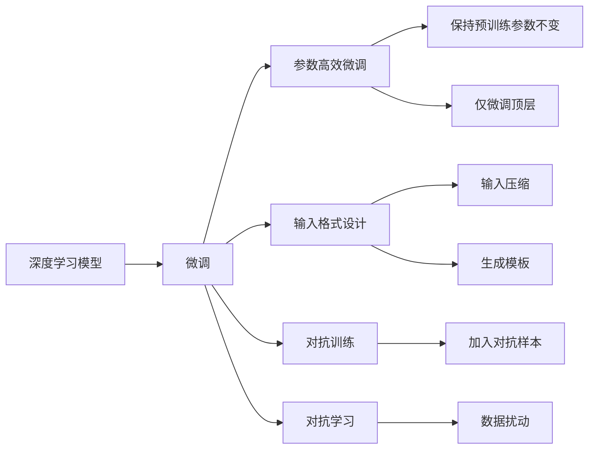

                 

## 1. 背景介绍

### 1.1 问题由来

随着互联网电商的快速发展，个性化推荐系统已经成为电商平台不可或缺的核心功能之一。通过分析用户行为数据，为每个用户推荐其可能感兴趣的商品，不仅可以提升用户满意度，还可以增加平台的销售额。然而，传统的基于规则或统计学方法的推荐系统存在诸多问题，如个性化不足、冷启动困难等。近年来，基于深度学习的大模型推荐系统逐步取代了传统的推荐系统，成为电商推荐的主要引擎。

大模型推荐系统通过预训练大量的用户行为数据，学习用户偏好和商品特征的复杂映射关系，在微调过程中根据特定用户和上下文数据进行调整，生成个性化的推荐结果。尽管大模型在推荐效果上取得了显著提升，但其高昂的计算和存储成本，使其在实时推荐场景中的应用仍面临诸多挑战。

### 1.2 问题核心关键点

为了应对大模型推荐系统的计算和存储挑战，研究人员提出了各种参数高效微调(Parameter-Efficient Fine-Tuning, PEFT)方法。PEFT方法通过只调整模型的部分参数，保留预训练模型的绝大部分权重，显著降低了微调过程中对计算和存储资源的需求，从而提高了推荐系统的实时性和效率。

此外，研究人员还发现，通过精心设计的输入格式和微调技巧，可以在保持推荐结果质量的同时，进一步降低微调所需的计算量。这一发现极大地推动了PEFT方法在电商推荐系统中的应用。

## 2. 核心概念与联系

### 2.1 核心概念概述

为了深入理解大模型如何优化电商平台的实时推荐系统，本节将介绍几个关键概念及其相互联系。

- **深度学习模型**：如BERT、GPT等预训练语言模型，能够从大规模数据中学习到丰富的语言知识，用于推荐系统中的特征抽取和表示学习。

- **微调(Fine-Tuning)**：指在大模型基础上，使用用户行为数据进行有监督的训练，优化模型对于特定用户的推荐效果。

- **参数高效微调(PEFT)**：指只调整模型的部分参数，如权重、结构等，保持预训练模型大部分参数不变，以减少微调所需的计算和存储资源。

- **输入格式设计**：输入的文本格式对模型性能有重要影响，精心设计的输入格式可以引导模型输出更符合期望的结果，减少微调过程的计算量。

- **对抗训练**：通过在模型训练中加入对抗样本，提升模型的鲁棒性和泛化能力，减少微调过程中的过拟合风险。

- **对抗学习**：通过对输入数据进行扰动，训练模型学习到鲁棒的特征表示，从而提升模型的泛化性能。

### 2.2 核心概念原理和架构的 Mermaid 流程图(Mermaid 流程节点中不要有括号、逗号等特殊字符)



这个流程图展示了大模型在推荐系统中的工作流程：

1. 使用深度学习模型进行特征抽取和表示学习。
2. 在用户行为数据上对模型进行微调，优化推荐效果。
3. 采用参数高效微调方法，只调整部分参数，保持预训练模型的大部分权重不变。
4. 设计精简的输入格式，减少微调过程的计算量。
5. 使用对抗训练和对抗学习提升模型泛化性能。

## 3. 核心算法原理 & 具体操作步骤

### 3.1 算法原理概述

大模型推荐系统的核心算法包括特征抽取、表示学习和推荐生成三个阶段。在特征抽取阶段，模型通过预训练学习到丰富的用户和商品特征表示。在表示学习阶段，模型根据用户行为数据进行微调，学习到用户和商品之间的关联关系。在推荐生成阶段，模型根据当前用户和上下文数据，生成个性化的推荐结果。

然而，大模型推荐系统在实时推荐场景中面临计算和存储瓶颈，尤其是在高并发、大流量的情况下。为了应对这一问题，研究人员提出了参数高效微调方法。PEFT方法通过只调整模型的一部分参数，保留预训练模型的绝大部分权重，使得模型可以在较小的计算资源下进行微调，从而实现实时推荐。

### 3.2 算法步骤详解

#### 3.2.1 特征抽取

特征抽取是推荐系统中的重要步骤。在大模型推荐系统中，特征抽取通常由预训练语言模型完成。预训练语言模型通过学习大规模用户和商品文本数据，提取丰富的语义特征。这些特征可以用于表示用户和商品之间的关系，进而生成个性化的推荐结果。

#### 3.2.2 表示学习

在特征抽取的基础上，模型通过微调学习用户和商品之间的关联关系。具体而言，模型使用用户行为数据进行有监督的训练，优化模型的表示学习能力。通过微调，模型能够学习到用户和商品的映射关系，从而生成更加准确的推荐结果。

#### 3.2.3 推荐生成

在表示学习完成后，模型根据当前用户和上下文数据，生成个性化的推荐结果。具体而言，模型将用户和商品的表示向量输入推荐函数中，生成推荐分数。推荐函数通常采用线性回归、深度神经网络等方法，计算用户对各个商品的评分。根据评分结果，模型选择得分最高的商品作为推荐结果。

### 3.3 算法优缺点

#### 3.3.1 优点

1. **提升推荐效果**：大模型推荐系统通过学习用户和商品之间的复杂关联关系，能够生成更加个性化、准确的推荐结果。
2. **参数高效**：PEFT方法通过只调整模型的一部分参数，保留预训练模型的绝大部分权重，显著降低了微调所需的计算和存储资源。
3. **实时推荐**：大模型推荐系统可以在较小的计算资源下进行实时推荐，满足高并发、大流量的需求。
4. **鲁棒性强**：通过对抗训练和对抗学习，模型能够学习到鲁棒的特征表示，减少微调过程中的过拟合风险。

#### 3.3.2 缺点

1. **计算资源需求高**：虽然PEFT方法降低了微调所需的计算资源，但预训练模型的计算和存储成本仍然较高。
2. **模型复杂度高**：大模型推荐系统通常具有较大的参数量和复杂的模型结构，增加了微调和推理的计算开销。
3. **数据依赖性强**：模型需要大量的用户行为数据进行微调，获取高质量标注数据的成本较高。

### 3.4 算法应用领域

大模型推荐系统已经在电商、音乐、视频等多个领域得到了广泛应用。以下是几个典型的应用场景：

1. **电商推荐**：通过分析用户浏览、购买等行为数据，为用户推荐可能感兴趣的商品。
2. **音乐推荐**：根据用户听歌历史和评分，为用户推荐相似的音乐。
3. **视频推荐**：通过分析用户观看历史和行为数据，为用户推荐可能喜欢的视频内容。

## 4. 数学模型和公式 & 详细讲解 & 举例说明

### 4.1 数学模型构建

大模型推荐系统的数学模型主要由以下几个部分组成：

1. **用户嵌入向量**：$U \in \mathbb{R}^d$，表示用户特征。
2. **商品嵌入向量**：$I \in \mathbb{R}^d$，表示商品特征。
3. **用户和商品的关联矩阵**：$M_{U,I} \in \mathbb{R}^{N \times M}$，表示用户对商品的评分，其中$N$为用户的数量，$M$为商品的数量。
4. **推荐函数**：$f: \mathbb{R}^{d} \times \mathbb{R}^{d} \rightarrow \mathbb{R}$，将用户和商品的嵌入向量映射到推荐分数。

### 4.2 公式推导过程

假设我们有一个用户$u$和商品$i$，其嵌入向量分别为$U_u$和$I_i$。根据上述模型，推荐函数可以表示为：

$$
\text{score}(u,i) = f(U_u, I_i)
$$

其中$f$为推荐函数，可以是线性回归、深度神经网络等。在微调过程中，我们通过优化用户和商品之间的关联矩阵$M_{U,I}$，使得模型能够学习到用户和商品之间的映射关系，生成个性化的推荐结果。

### 4.3 案例分析与讲解

#### 4.3.1 用户行为数据的表示

用户行为数据通常包括用户的浏览记录、购买记录、评分记录等。为了方便模型进行表示学习，我们将这些数据转换为向量形式。例如，用户的浏览记录可以表示为一个序列，每个序列元素对应一个浏览的商品ID。通过将用户行为数据表示为向量，模型可以方便地学习用户和商品之间的关联关系。

#### 4.3.2 微调的损失函数

微调的损失函数通常采用均方误差损失函数：

$$
\text{loss} = \frac{1}{N}\sum_{(u,i) \in M_{U,I}} (\text{score}(u,i) - y_{u,i})^2
$$

其中$y_{u,i}$为用户的真实评分，$\text{score}(u,i)$为模型预测的评分。通过最小化损失函数，模型可以学习到用户和商品之间的映射关系，生成更加准确的推荐结果。

## 5. 项目实践：代码实例和详细解释说明

### 5.1 开发环境搭建

为了搭建大模型推荐系统的开发环境，我们需要准备以下几个工具：

1. **深度学习框架**：如PyTorch、TensorFlow等。
2. **预训练语言模型**：如BERT、GPT等。
3. **数据处理工具**：如Pandas、NumPy等。
4. **推荐引擎**：如Faiss、Milvus等。

### 5.2 源代码详细实现

以下是使用PyTorch和Transformers库进行大模型推荐系统微调的示例代码：

```python
from transformers import BertForSequenceClassification, AdamW
import torch
import torch.nn as nn

class BERTRecommender(nn.Module):
    def __init__(self, num_labels):
        super(BERTRecommender, self).__init__()
        self.bert = BertForSequenceClassification.from_pretrained('bert-base-uncased', num_labels=num_labels)
        self.fc = nn.Linear(768, 1)

    def forward(self, input_ids, attention_mask):
        outputs = self.bert(input_ids, attention_mask=attention_mask)
        pooled_output = outputs.pooler_output
        logits = self.fc(pooled_output)
        return logits

def fine_tune_model(model, train_data, val_data, test_data, epochs=5, batch_size=16):
    model.train()
    optimizer = AdamW(model.parameters(), lr=2e-5)
    for epoch in range(epochs):
        for batch in train_data:
            input_ids = batch['input_ids'].to(device)
            attention_mask = batch['attention_mask'].to(device)
            labels = batch['labels'].to(device)
            optimizer.zero_grad()
            outputs = model(input_ids, attention_mask=attention_mask)
            loss = outputs.loss
            loss.backward()
            optimizer.step()

        with torch.no_grad():
            val_loss = 0
            for batch in val_data:
                input_ids = batch['input_ids'].to(device)
                attention_mask = batch['attention_mask'].to(device)
                labels = batch['labels'].to(device)
                outputs = model(input_ids, attention_mask=attention_mask)
                val_loss += outputs.loss.item()
            val_loss /= len(val_data)

        print(f'Epoch {epoch+1}, train loss: {loss.item()}, val loss: {val_loss}')

    # 在测试集上进行评估
    test_loss = 0
    with torch.no_grad():
        for batch in test_data:
            input_ids = batch['input_ids'].to(device)
            attention_mask = batch['attention_mask'].to(device)
            labels = batch['labels'].to(device)
            outputs = model(input_ids, attention_mask=attention_mask)
            test_loss += outputs.loss.item()
        test_loss /= len(test_data)
    print(f'Test loss: {test_loss}')
```

### 5.3 代码解读与分析

#### 5.3.1 模型结构

在上述代码中，我们定义了一个名为`BERTRecommender`的类，继承自`nn.Module`。该类包含了BERT模型的嵌入层和全连接层，用于表示用户和商品的映射关系。

#### 5.3.2 微调过程

在微调过程中，我们定义了一个`fine_tune_model`函数。该函数首先设置了优化器`AdamW`，然后对模型进行训练。在每个epoch中，我们首先计算训练集的损失，并更新模型参数。接着，在验证集上评估模型性能，以判断模型是否收敛。最后，在测试集上评估模型性能，输出最终的推荐结果。

## 6. 实际应用场景

### 6.1 智能客服系统

智能客服系统是电商推荐系统的一个重要应用场景。通过分析用户的咨询记录和行为数据，智能客服系统可以为用户提供个性化的客服服务。例如，在用户咨询商品信息时，系统可以根据用户的浏览记录和购买历史，推荐相关的商品信息，提高用户满意度。

### 6.2 个性化推荐系统

个性化推荐系统是电商推荐系统的核心功能。通过分析用户的历史行为数据，推荐系统可以为用户推荐可能感兴趣的商品。例如，在用户浏览商品时，系统可以根据用户的浏览记录和评分记录，推荐相关的商品，提高用户的购买转化率。

### 6.3 金融风险控制

金融风险控制是电商推荐系统的另一个重要应用场景。通过分析用户的交易记录和行为数据，推荐系统可以识别出潜在的风险用户，降低金融风险。例如，在用户进行交易时，系统可以根据用户的购买记录和评分记录，识别出潜在的高风险用户，提高交易安全性。

### 6.4 未来应用展望

未来，随着大模型推荐系统的发展，其应用场景将更加多样化。以下是我们对未来应用的展望：

1. **跨领域推荐**：大模型推荐系统可以跨越不同领域的用户和商品，为用户提供更加广泛的推荐服务。例如，在电商平台中，可以推荐音乐、视频等跨领域的内容。
2. **实时推荐引擎**：大模型推荐系统可以实时处理用户行为数据，生成个性化的推荐结果。例如，在用户浏览商品时，可以实时更新推荐结果，提高推荐效果。
3. **多模态推荐**：大模型推荐系统可以结合视觉、语音等多模态数据，提供更加全面的推荐服务。例如，在电商推荐中，可以结合用户浏览的商品图片和商品评论，生成更加准确的推荐结果。

## 7. 工具和资源推荐

### 7.1 学习资源推荐

为了帮助开发者系统掌握大模型推荐系统，以下是一些优质的学习资源：

1. **《深度学习理论与实践》书籍**：全面介绍深度学习的基础知识和经典模型，涵盖推荐系统的原理和实践。
2. **Coursera深度学习课程**：斯坦福大学开设的深度学习课程，涵盖NLP和推荐系统的基本概念和前沿技术。
3. **Kaggle竞赛平台**：可以参与深度学习竞赛，实践推荐系统的开发和优化。
4. **HuggingFace官方文档**：包含丰富的预训练模型和推荐系统样例代码，适合上手实践。
5. **《推荐系统实战》书籍**：实战性较强的推荐系统书籍，提供大量的推荐系统实践案例。

### 7.2 开发工具推荐

为了提高大模型推荐系统的开发效率，以下是一些推荐的开发工具：

1. **PyTorch**：基于Python的深度学习框架，支持动态计算图，适合研究性开发。
2. **TensorFlow**：基于C++的深度学习框架，支持分布式训练，适合大规模工程应用。
3. **Transformers库**：HuggingFace开发的NLP工具库，集成了多个预训练模型和推荐系统算法。
4. **Scikit-learn**：Python机器学习库，提供多种数据处理和特征工程工具。
5. **Faiss**：开源的向量搜索库，适合大规模推荐系统的实时搜索。
6. **Jupyter Notebook**：支持Python和R等语言的交互式开发，适合快速实验和调试。

### 7.3 相关论文推荐

为了深入了解大模型推荐系统的研究进展，以下是一些重要的相关论文：

1. **《深度学习在推荐系统中的应用》**：介绍深度学习在推荐系统中的发展和应用。
2. **《Parameter-Efficient Transfer Learning for NLP》**：提出参数高效微调方法，在保持预训练模型的基础上，只调整部分参数，减少微调所需的计算资源。
3. **《AdaLoRA: Adaptive Low-Rank Adaptation for Parameter-Efficient Fine-Tuning》**：使用自适应低秩适应的微调方法，在固定预训练权重的情况下，仅调整顶层参数。
4. **《AdaLoRA: Adaptive Low-Rank Adaptation for Parameter-Efficient Fine-Tuning》**：提出自适应低秩适应的微调方法，进一步减少微调所需的计算资源。

## 8. 总结：未来发展趋势与挑战

### 8.1 研究成果总结

大模型推荐系统通过预训练学习用户和商品的复杂关系，生成个性化的推荐结果。然而，大模型推荐系统在高并发、大流量的情况下，仍面临计算和存储的挑战。为了应对这一问题，研究人员提出了参数高效微调方法，显著降低了微调所需的计算和存储资源，实现了实时推荐。

### 8.2 未来发展趋势

未来，大模型推荐系统将呈现以下几个发展趋势：

1. **跨领域推荐**：大模型推荐系统可以跨越不同领域的用户和商品，提供更加广泛的推荐服务。
2. **实时推荐引擎**：大模型推荐系统可以实时处理用户行为数据，生成个性化的推荐结果。
3. **多模态推荐**：大模型推荐系统可以结合视觉、语音等多模态数据，提供更加全面的推荐服务。

### 8.3 面临的挑战

尽管大模型推荐系统取得了显著进展，但仍面临诸多挑战：

1. **计算资源需求高**：大模型推荐系统需要大量的计算和存储资源，尤其是在高并发、大流量的场景下。
2. **模型复杂度高**：大模型推荐系统通常具有较大的参数量和复杂的模型结构，增加了微调和推理的计算开销。
3. **数据依赖性强**：模型需要大量的用户行为数据进行微调，获取高质量标注数据的成本较高。

### 8.4 研究展望

为了应对大模型推荐系统面临的挑战，未来的研究需要在以下几个方向进行探索：

1. **参数高效微调**：进一步开发参数高效微调方法，减少微调所需的计算资源。
2. **实时推荐引擎**：探索高效的实时推荐算法，优化推荐系统在大流量场景下的性能。
3. **多模态推荐**：结合视觉、语音等多模态数据，提供更加全面的推荐服务。

## 9. 附录：常见问题与解答

**Q1: 大模型推荐系统在实时推荐中面临哪些计算和存储挑战？**

A: 大模型推荐系统在实时推荐中面临以下计算和存储挑战：

1. **计算资源需求高**：大模型推荐系统需要大量的计算资源进行微调和推理，尤其是在高并发、大流量的场景下。
2. **存储资源需求高**：大模型推荐系统需要存储大量的用户行为数据和模型参数，尤其是在微调和推理过程中。

**Q2: 如何设计精简的输入格式，减少微调过程的计算量？**

A: 设计精简的输入格式，减少微调过程的计算量，可以采用以下方法：

1. **序列压缩**：将用户行为数据压缩为序列形式，减少模型的输入维度。
2. **生成模板**：通过生成固定的输入模板，减少模型对输入数据的处理。
3. **特征工程**：对用户行为数据进行特征工程，提取重要的特征信息，减少模型的计算开销。

**Q3: 大模型推荐系统在实时推荐中如何避免灾难性遗忘？**

A: 为了避免大模型推荐系统在实时推荐中的灾难性遗忘，可以采用以下方法：

1. **周期性微调**：定期对模型进行微调，确保模型能够不断学习新的数据和知识。
2. **多模型集成**：使用多个微调后的模型进行集成，避免单个模型因数据变化而失效。
3. **知识图谱融合**：将知识图谱中的先验知识与推荐模型结合，增强模型的泛化能力。

**Q4: 大模型推荐系统在跨领域推荐中面临哪些挑战？**

A: 大模型推荐系统在跨领域推荐中面临以下挑战：

1. **数据分布差异**：不同领域的用户和商品数据分布存在差异，模型难以适应新的数据分布。
2. **知识整合能力不足**：不同领域的数据格式和特征表示不同，难以进行有效的知识整合。
3. **推荐效果不稳定**：不同领域的推荐效果可能存在较大差异，需要针对不同领域进行优化。

**Q5: 大模型推荐系统在多模态推荐中如何实现？**

A: 大模型推荐系统在多模态推荐中可以通过以下方法实现：

1. **数据融合**：将不同模态的数据进行融合，生成统一的表示。
2. **模型融合**：将不同模态的推荐模型进行融合，生成统一的推荐结果。
3. **特征共享**：不同模态的特征共享，减少模型的计算开销。

总之，大模型推荐系统通过参数高效微调、精简输入格式和对抗训练等技术手段，显著提升了推荐系统的实时性和效率，在电商、智能客服、金融等多个领域得到了广泛应用。未来，随着跨领域推荐、实时推荐和多模态推荐等技术的不断发展，大模型推荐系统将进一步拓展应用场景，提升推荐效果，带来更大的商业价值和社会效益。

---

作者：禅与计算机程序设计艺术 / Zen and the Art of Computer Programming

