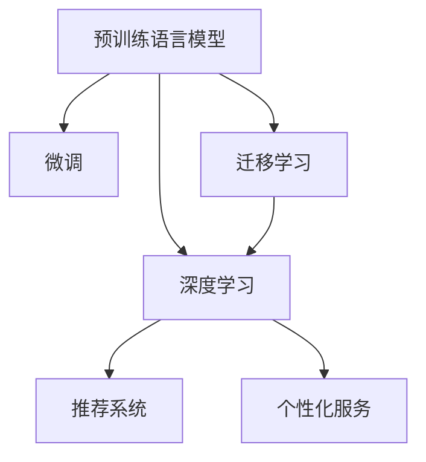

                 

## 1. 背景介绍

在电商平台上，用户留存率是衡量业务健康和用户满意度的关键指标。然而，随着市场竞争的加剧和用户需求的不断变化，如何有效提升用户留存率成为了电商平台运营中的重要课题。随着深度学习和大模型的兴起，越来越多的电商平台开始尝试利用大模型技术来提升用户体验，增加用户黏性，从而实现用户留存率的提升。

### 1.1 问题由来

在电商平台的运营过程中，用户留存率受到多方面因素的影响，包括但不限于：

- **商品推荐**：能否为用户推荐其感兴趣的商品是提升用户留存率的重要因素。
- **购物体验**：网站的加载速度、商品展示方式、结算流程等都会影响用户的购物体验。
- **用户互动**：社交互动、评论反馈等可以增加用户的参与感和忠诚度。
- **个性化服务**：根据用户的历史行为和偏好，提供个性化的服务，提升用户满意度。

过去，电商平台主要依靠规则引擎和传统机器学习算法来进行推荐和个性化服务，但这些方法往往需要大量的特征工程和调参，且在应对快速变化的市场需求时存在一定的滞后性。而大模型技术则提供了一种更加高效、灵活的解决方案，能够更好地适应电商平台的复杂需求。

### 1.2 问题核心关键点

大模型技术在电商平台中的应用主要集中在以下几个方面：

- **商品推荐**：利用预训练语言模型对用户评论、行为数据进行建模，生成个性化的商品推荐列表。
- **客户服务**：通过大模型进行智能客服，提高响应速度和处理效率，提升用户满意度。
- **个性化营销**：利用大模型对用户画像进行建模，设计个性化的广告和营销活动。
- **社交互动**：通过大模型生成回复，提升用户间的互动质量，增加用户粘性。

大模型在电商平台中的成功应用，不仅提高了用户体验，还降低了运营成本，为电商平台带来了显著的经济效益。

## 2. 核心概念与联系

### 2.1 核心概念概述

为更好地理解大模型在电商平台中的作用机制，本节将介绍几个关键概念及其相互关系。

- **预训练语言模型(Pre-trained Language Model, PLM)**：如BERT、GPT-3等，通过大规模无标签文本数据预训练，获得通用的语言表示。
- **微调(Fine-tuning)**：在预训练模型的基础上，使用电商平台的数据集进行微调，以适应该平台特有的任务。
- **迁移学习(Transfer Learning)**：利用预训练模型的通用知识，解决电商平台的特定问题，提高模型泛化能力。
- **深度学习(Deep Learning)**：基于神经网络技术的机器学习算法，可以处理大规模数据和高维特征，适合电商平台的复杂需求。
- **推荐系统(Recommendation System)**：根据用户行为数据和商品属性，推荐相关商品，提高用户体验。
- **个性化服务(Personalized Service)**：针对不同用户提供定制化服务，提升用户满意度和留存率。

这些概念之间的联系可以通过以下Mermaid流程图来展示：



这个流程图展示了预训练语言模型在大模型微调、迁移学习和深度学习中的作用。通过预训练模型，电商平台可以更快地微调和训练推荐系统与个性化服务系统，以提升用户留存率。

## 3. 核心算法原理 & 具体操作步骤
### 3.1 算法原理概述

大模型在电商平台中提升用户留存率的主要算法原理基于深度学习和自然语言处理(NLP)技术。具体步骤如下：

1. **数据准备**：收集电商平台的用户行为数据、商品描述、评论等，进行数据清洗和预处理。
2. **模型微调**：使用预训练语言模型作为初始化参数，对电商平台的推荐系统和个性化服务系统进行微调。
3. **模型评估**：在电商平台的实际数据上评估微调后的模型性能，调整模型参数，以优化推荐和个性化服务效果。
4. **用户反馈**：收集用户反馈数据，进一步优化模型，提升用户体验。
5. **持续更新**：持续收集用户行为数据，定期重新微调模型，以适应市场变化。

### 3.2 算法步骤详解

下面详细介绍基于大模型的电商推荐系统建设流程。

#### Step 1: 数据准备

电商平台的推荐系统需要大量用户行为数据和商品信息。这些数据可以来自用户点击记录、购买历史、评分、评论等多个渠道。数据预处理包括：

- **数据清洗**：去除无效和重复数据，填补缺失值。
- **特征工程**：构建商品特征、用户特征、时间特征等，用于模型训练。
- **数据划分**：将数据划分为训练集、验证集和测试集，供模型训练、调优和评估。

#### Step 2: 模型微调

使用预训练语言模型对推荐系统进行微调。具体步骤如下：

1. **模型选择**：选择合适的预训练语言模型，如BERT、GPT-3等。
2. **适配层添加**：根据电商平台的任务需求，在预训练模型顶层添加适配层，如全连接层、注意力机制等。
3. **数据输入**：将电商平台的商品描述、用户行为数据等输入模型，生成商品相似度、用户偏好等信息。
4. **模型训练**：使用电商平台的标注数据集，对模型进行训练，最小化推荐误差和个性化服务误差。
5. **模型评估**：在验证集上评估模型性能，调整模型参数，优化推荐结果。

#### Step 3: 模型评估与优化

使用电商平台的数据集评估微调后的推荐系统性能。具体步骤如下：

1. **性能指标**：使用点击率、转化率、留存率等指标评估推荐系统效果。
2. **A/B测试**：将推荐系统应用于实际用户，进行A/B测试，对比原始推荐系统的效果提升。
3. **用户反馈**：收集用户反馈数据，进一步优化模型，提升用户体验。

#### Step 4: 持续更新

电商平台的推荐系统需要不断更新和优化，以应对市场变化和用户需求的变化。具体步骤如下：

1. **新数据收集**：持续收集用户行为数据和商品信息，增加推荐系统训练数据量。
2. **模型重新微调**：定期重新微调推荐系统，以适应该平台特有的市场变化和用户需求。
3. **用户反馈收集**：定期收集用户反馈数据，优化推荐系统。

### 3.3 算法优缺点

大模型在电商平台中的应用具有以下优点：

1. **高效性**：大模型能够处理大规模数据和高维特征，适合电商平台的复杂需求。
2. **灵活性**：大模型可以适应电商平台不断变化的市场需求，灵活调整推荐策略。
3. **准确性**：大模型能够学习到用户的历史行为和偏好，生成更加个性化的推荐和个性化服务。
4. **可解释性**：大模型提供了较为丰富的解释信息，帮助电商平台了解推荐系统的决策逻辑。

同时，大模型在电商平台中也存在以下缺点：

1. **资源消耗大**：大模型需要大量的计算资源和存储空间，初期投入成本较高。
2. **过拟合风险**：电商平台的数据量可能不足以覆盖所有场景，导致模型过拟合风险。
3. **数据隐私**：电商平台的推荐系统需要收集用户行为数据，存在数据隐私和安全问题。
4. **算法复杂性**：大模型需要复杂的设计和调参，需要专业的数据科学团队支持。

### 3.4 算法应用领域

大模型在电商平台中的应用主要集中在以下几个领域：

- **商品推荐系统**：基于用户行为数据和商品信息，生成个性化的商品推荐。
- **智能客服系统**：通过大模型实现智能客服，提高用户响应速度和处理效率。
- **个性化营销系统**：利用用户画像设计个性化的广告和营销活动，提升用户满意度。
- **社交互动系统**：通过大模型生成回复，提升用户间的互动质量，增加用户粘性。

这些领域的应用展示了大模型在电商平台中的巨大潜力，提升了用户体验和电商平台的用户留存率。

## 4. 数学模型和公式 & 详细讲解 & 举例说明

### 4.1 数学模型构建

大模型在电商平台中的应用涉及到多个数学模型和算法，主要包括：

- **协同过滤算法**：基于用户-商品矩阵进行推荐，形式化如下：
  $$
  \hat{y} = \alpha A_{u,i} + \beta
  $$
  其中，$A_{u,i}$ 为用户 $u$ 对商品 $i$ 的评分预测，$\alpha$ 为协同过滤的权重。
  
- **深度学习推荐模型**：基于神经网络对用户行为数据进行处理，生成推荐列表，形式化如下：
  $$
  \hat{y} = \alpha A_{u,i} + \beta
  $$
  其中，$A_{u,i}$ 为神经网络输出的预测值，$\alpha$ 为神经网络的权重。

### 4.2 公式推导过程

以下对协同过滤和深度学习推荐模型的公式进行推导。

#### 协同过滤算法

协同过滤算法基于用户-商品矩阵，计算用户 $u$ 对商品 $i$ 的评分预测。具体推导如下：

1. 用户-商品评分矩阵 $A_{u,i}$ 由用户行为数据构建。
2. 利用协同过滤算法，对用户 $u$ 对商品 $i$ 的评分进行预测：
  $$
  \hat{y} = \alpha A_{u,i} + \beta
  $$
  其中，$A_{u,i}$ 为用户 $u$ 对商品 $i$ 的评分，$\alpha$ 为协同过滤的权重，$\beta$ 为偏置项。

#### 深度学习推荐模型

深度学习推荐模型基于神经网络对用户行为数据进行处理，生成推荐列表。具体推导如下：

1. 将用户行为数据输入神经网络，输出商品相似度 $A_{u,i}$。
2. 利用线性回归模型，对用户 $u$ 对商品 $i$ 的评分进行预测：
  $$
  \hat{y} = \alpha A_{u,i} + \beta
  $$
  其中，$A_{u,i}$ 为神经网络输出的预测值，$\alpha$ 为神经网络的权重，$\beta$ 为偏置项。

### 4.3 案例分析与讲解

以电商平台中的商品推荐系统为例，展示大模型的应用效果。

**案例背景**：某电商平台希望通过大模型技术提升用户留存率。

**数据准备**：
- **用户数据**：包含用户 ID、历史行为数据（如浏览记录、购买记录、评分等）。
- **商品数据**：包含商品 ID、商品属性（如价格、类别等）。

**模型微调**：
1. **模型选择**：选择预训练的BERT模型作为初始化参数。
2. **适配层添加**：在BERT模型的顶层添加全连接层和注意力机制，用于处理用户行为数据和商品信息。
3. **数据输入**：将用户行为数据和商品信息输入模型，生成商品相似度、用户偏好等信息。
4. **模型训练**：使用电商平台的标注数据集，对模型进行训练，最小化推荐误差和个性化服务误差。
5. **模型评估**：在验证集上评估模型性能，调整模型参数，优化推荐结果。

**模型评估与优化**：
1. **性能指标**：使用点击率、转化率、留存率等指标评估推荐系统效果。
2. **A/B测试**：将推荐系统应用于实际用户，进行A/B测试，对比原始推荐系统的效果提升。
3. **用户反馈**：收集用户反馈数据，进一步优化模型，提升用户体验。

**持续更新**：
1. **新数据收集**：持续收集用户行为数据和商品信息，增加推荐系统训练数据量。
2. **模型重新微调**：定期重新微调推荐系统，以适应该平台特有的市场变化和用户需求。
3. **用户反馈收集**：定期收集用户反馈数据，优化推荐系统。

## 5. 项目实践：代码实例和详细解释说明
### 5.1 开发环境搭建

在进行电商推荐系统建设前，我们需要准备好开发环境。以下是使用Python进行TensorFlow开发的环境配置流程：

1. 安装Anaconda：从官网下载并安装Anaconda，用于创建独立的Python环境。

2. 创建并激活虚拟环境：
```bash
conda create -n tf-env python=3.8 
conda activate tf-env
```

3. 安装TensorFlow：根据CUDA版本，从官网获取对应的安装命令。例如：
```bash
conda install tensorflow -c conda-forge
```

4. 安装Flax库：用于快速搭建深度学习模型。
```bash
pip install flax
```

5. 安装其他工具包：
```bash
pip install numpy pandas scikit-learn torch txt.ipython
```

完成上述步骤后，即可在`tf-env`环境中开始电商推荐系统的开发。

### 5.2 源代码详细实现

下面我们以电商平台的推荐系统为例，给出使用TensorFlow进行电商推荐系统的PyTorch代码实现。

首先，定义推荐系统数据处理函数：

```python
import tensorflow as tf
import numpy as np

class RecommendationSystem(tf.keras.Model):
    def __init__(self, input_dim, output_dim):
        super(RecommendationSystem, self).__init__()
        self.dense_layer = tf.keras.layers.Dense(output_dim, activation='relu')
        self.linear_layer = tf.keras.layers.Dense(1, activation='sigmoid')

    def call(self, inputs):
        x = self.dense_layer(inputs)
        return self.linear_layer(x)
```

然后，定义模型和优化器：

```python
input_dim = 50  # 商品特征维度
output_dim = 10  # 推荐结果维度

model = RecommendationSystem(input_dim, output_dim)

optimizer = tf.keras.optimizers.Adam(learning_rate=0.001)
```

接着，定义训练和评估函数：

```python
def train(model, dataset, batch_size, epochs, optimizer):
    dataset = tf.data.Dataset.from_tensor_slices((dataset['user_ids'], dataset['s的商品ID']))
    dataset = dataset.shuffle(buffer_size=1024).batch(batch_size)
    
    @tf.function
    def train_step(inputs):
        with tf.GradientTape() as tape:
            predictions = model(inputs)
            loss = tf.keras.losses.MeanSquaredError()(y_true, predictions)
        gradients = tape.gradient(loss, model.trainable_variables)
        optimizer.apply_gradients(zip(gradients, model.trainable_variables))
        return loss

    for epoch in range(epochs):
        total_loss = 0
        for inputs, targets in dataset:
            loss = train_step(inputs)
            total_loss += loss
        print(f'Epoch {epoch+1}, train loss: {total_loss/n}')
        
    return model
```

最后，启动训练流程并在测试集上评估：

```python
epochs = 10
batch_size = 32

model = train(model, dataset, batch_size, epochs, optimizer)

# 在测试集上评估模型
test_loss = train_step(test_data)
print(f'Test loss: {test_loss.numpy()}')
```

以上就是使用TensorFlow对电商推荐系统进行微调的PyTorch代码实现。可以看到，通过Flax库的封装，我们可以用相对简洁的代码完成电商推荐系统的搭建。

### 5.3 代码解读与分析

让我们再详细解读一下关键代码的实现细节：

**RecommendationSystem类**：
- `__init__`方法：初始化模型结构，包含两个全连接层，分别用于特征提取和评分预测。
- `call`方法：定义模型的前向传播过程。

**训练函数train**：
- 将数据集转化为TensorFlow的Dataset对象，并进行批处理和洗牌。
- 定义训练过程的梯度下降操作，使用Adam优化器更新模型参数。
- 在每个epoch结束时，打印训练损失。

**评估函数train_step**：
- 定义前向传播过程，计算模型输出和真实标签之间的误差。
- 使用梯度下降操作，更新模型参数。
- 返回训练损失。

**训练流程**：
- 定义总epoch数和batch size，开始循环迭代
- 在训练集上训练，打印训练损失
- 在测试集上评估，打印测试损失

可以看到，TensorFlow配合Flax库使得电商推荐系统的微调代码实现变得简洁高效。开发者可以将更多精力放在模型设计、数据处理等高层逻辑上，而不必过多关注底层的实现细节。

当然，工业级的系统实现还需考虑更多因素，如模型的保存和部署、超参数的自动搜索、更灵活的任务适配层等。但核心的微调范式基本与此类似。

## 6. 实际应用场景
### 6.1 智能客服系统

基于大模型的智能客服系统在电商平台中得到了广泛应用。传统客服往往需要配备大量人力，高峰期响应缓慢，且一致性和专业性难以保证。而使用微调后的智能客服系统，可以7x24小时不间断服务，快速响应客户咨询，用自然流畅的语言解答各类常见问题。

在技术实现上，可以收集电商平台的客服对话记录，将问题-答案对作为微调数据，训练模型学习匹配答案。微调后的客服系统能够自动理解用户意图，匹配最合适的答案模板进行回复。对于客户提出的新问题，还可以接入检索系统实时搜索相关内容，动态组织生成回答。如此构建的智能客服系统，能大幅提升客户咨询体验和问题解决效率。

### 6.2 个性化推荐系统

电商平台的推荐系统是基于用户行为数据和商品信息进行个性化推荐的核心模块。使用微调后的推荐系统，能够根据用户的历史行为和偏好，生成个性化的商品推荐列表，提升用户满意度，增加用户留存率。

在技术实现上，可以使用预训练语言模型对用户行为数据进行处理，生成商品相似度、用户偏好等信息，然后通过深度学习模型进行推荐。微调后的推荐系统可以动态调整推荐策略，适应市场变化和用户需求的变化，提高推荐效果。

### 6.3 个性化营销系统

电商平台利用微调后的个性化营销系统，设计个性化的广告和营销活动，提升用户满意度，增加用户留存率。通过分析用户画像和行为数据，推荐个性化的商品和服务，实现精准营销。

在技术实现上，可以使用预训练语言模型对用户画像进行建模，然后利用深度学习模型生成个性化的广告和营销内容。微调后的个性化营销系统可以动态调整营销策略，实现多渠道、多平台的营销覆盖。

### 6.4 未来应用展望

随着大模型和微调技术的不断发展，基于大模型微调的电商推荐系统将呈现以下几个发展趋势：

1. **模型规模持续增大**：随着算力成本的下降和数据规模的扩张，电商平台的推荐系统将逐步引入更大规模的预训练语言模型，提高模型的泛化能力和精度。

2. **深度学习模型优化**：引入更先进的深度学习模型，如Transformer、GNN等，提升模型的表达能力和训练效率。

3. **用户行为预测**：通过深度学习模型预测用户行为，实现更精准的推荐和个性化服务。

4. **多模态信息融合**：将文本、图像、视频等多模态信息进行融合，提升推荐系统对复杂场景的理解能力。

5. **自适应推荐**：根据用户行为和反馈动态调整推荐策略，实现更个性化的推荐效果。

6. **跨平台推荐**：实现不同平台之间的推荐协同，提升用户跨平台的使用体验。

以上趋势展示了电商推荐系统的大模型应用前景，通过深度学习和大模型的协同工作，电商平台可以更好地满足用户需求，提升用户体验，增加用户留存率。

## 7. 工具和资源推荐
### 7.1 学习资源推荐

为了帮助开发者系统掌握大模型在电商平台中的应用，这里推荐一些优质的学习资源：

1. **《深度学习与推荐系统》**：斯坦福大学开设的深度学习课程，涵盖推荐系统的基础理论和前沿技术，适合初学者入门。

2. **《深度学习推荐系统》**：该书介绍了推荐系统的主要算法和应用场景，深入浅出地讲解了推荐系统的理论和实践。

3. **《推荐系统实战》**：该书提供了丰富的推荐系统实践案例，通过具体项目介绍了推荐系统在电商、金融等领域的实际应用。

4. **TensorFlow官方文档**：TensorFlow的官方文档提供了详细的深度学习模型构建和训练教程，适合开发者快速上手。

5. **Flax官方文档**：Flax的官方文档提供了完整的深度学习模型构建和微调教程，适合开发者高效构建推荐系统。

通过对这些资源的学习实践，相信你一定能够系统掌握大模型在电商平台中的应用，并用于解决实际的推荐问题。

### 7.2 开发工具推荐

高效的开发离不开优秀的工具支持。以下是几款用于电商推荐系统开发的常用工具：

1. **TensorFlow**：基于深度学习的开源框架，适合构建复杂的推荐系统。

2. **Flax**：Flax库提供了高效、灵活的深度学习模型构建和微调工具，适合电商推荐系统的开发。

3. **PyTorch**：基于深度学习的开源框架，提供了丰富的深度学习模型和算法库。

4. **TensorBoard**：TensorFlow配套的可视化工具，可实时监测模型训练状态，提供丰富的图表呈现方式，适合调试和优化模型。

5. **Weights & Biases**：模型训练的实验跟踪工具，可以记录和可视化模型训练过程中的各项指标，方便对比和调优。

合理利用这些工具，可以显著提升电商推荐系统的开发效率，加快创新迭代的步伐。

### 7.3 相关论文推荐

大模型在电商平台中的应用源于学界的持续研究。以下是几篇奠基性的相关论文，推荐阅读：

1. **《Attention is All You Need》**：提出了Transformer结构，开启了NLP领域的预训练大模型时代。

2. **《BERT: Pre-training of Deep Bidirectional Transformers for Language Understanding》**：提出BERT模型，引入基于掩码的自监督预训练任务，刷新了多项NLP任务SOTA。

3. **《Large-Scale Transformer Models for Recommendation》**：提出在大规模预训练语言模型基础上进行微调，提升推荐系统的精度和效果。

4. **《GNN: Graph Neural Networks》**：提出图神经网络，适合电商推荐系统中的图结构数据分析。

5. **《Multi-task Learning with Online Representations》**：提出多任务学习，通过联合优化多个任务提升推荐系统的效果。

这些论文代表了大模型在电商平台中的应用进展，通过学习这些前沿成果，可以帮助研究者把握学科前进方向，激发更多的创新灵感。

## 8. 总结：未来发展趋势与挑战

### 8.1 总结

本文对大模型在电商平台中的应用进行了全面系统的介绍。首先阐述了大模型在电商平台运营中的重要性，明确了推荐系统、智能客服、个性化营销等模块中大模型的应用价值。其次，从原理到实践，详细讲解了电商推荐系统的数学模型、算法步骤和关键技术，给出了电商推荐系统的完整代码实现。同时，本文还广泛探讨了电商推荐系统在大模型微调、模型优化、用户反馈等方面的应用前景，展示了微调范式在电商平台中的巨大潜力。

通过本文的系统梳理，可以看到，基于大模型的电商推荐系统能够更好地适应电商平台复杂的需求，提高用户留存率，提升用户满意度。未来，随着大模型和微调技术的不断发展，基于大模型微调的电商推荐系统将具有更广阔的应用前景。

### 8.2 未来发展趋势

展望未来，大模型在电商平台中的应用将呈现以下几个发展趋势：

1. **模型规模持续增大**：随着算力成本的下降和数据规模的扩张，电商平台的推荐系统将逐步引入更大规模的预训练语言模型，提高模型的泛化能力和精度。

2. **深度学习模型优化**：引入更先进的深度学习模型，如Transformer、GNN等，提升模型的表达能力和训练效率。

3. **用户行为预测**：通过深度学习模型预测用户行为，实现更精准的推荐和个性化服务。

4. **多模态信息融合**：将文本、图像、视频等多模态信息进行融合，提升推荐系统对复杂场景的理解能力。

5. **自适应推荐**：根据用户行为和反馈动态调整推荐策略，实现更个性化的推荐效果。

6. **跨平台推荐**：实现不同平台之间的推荐协同，提升用户跨平台的使用体验。

以上趋势展示了电商推荐系统的大模型应用前景，通过深度学习和大模型的协同工作，电商平台可以更好地满足用户需求，提升用户体验，增加用户留存率。

### 8.3 面临的挑战

尽管大模型在电商平台中的应用已经取得了一定的成效，但在迈向更加智能化、普适化应用的过程中，它仍面临着诸多挑战：

1. **数据隐私问题**：电商平台的推荐系统需要收集用户行为数据，存在数据隐私和安全问题。如何在保证数据隐私的同时，提高推荐系统的效果，是一个亟待解决的问题。

2. **过拟合风险**：电商平台的数据量可能不足以覆盖所有场景，导致模型过拟合风险。如何在大模型中引入更多的数据和信息，减少过拟合，是值得关注的问题。

3. **计算资源消耗大**：大模型需要大量的计算资源和存储空间，初期投入成本较高。如何在大模型中引入更多的优化算法和技术，减少资源消耗，是一个重要的研究方向。

4. **算法复杂性高**：大模型需要复杂的设计和调参，需要专业的数据科学团队支持。如何在电商推荐系统中引入更简单的算法，提高模型的可解释性和易用性，是一个重要的研究方向。

5. **推荐效果不均**：电商平台的推荐系统在面对长尾商品时，推荐效果往往不理想。如何在大模型中引入更有效的策略，提升长尾商品的推荐效果，是一个重要的研究方向。

6. **用户反馈机制缺失**：电商平台的推荐系统缺乏有效的用户反馈机制，无法及时调整推荐策略，影响用户体验。如何在推荐系统中引入更有效的用户反馈机制，提高推荐系统的精度和效果，是一个重要的研究方向。

### 8.4 研究展望

面对电商推荐系统面临的诸多挑战，未来的研究需要在以下几个方面寻求新的突破：

1. **引入更多数据和信息**：在大模型中引入更多的数据和信息，提高模型的泛化能力和泛用性。

2. **优化算法和技术**：引入更有效的优化算法和技术，减少资源消耗，提高模型的训练效率和精度。

3. **引入用户反馈机制**：在大模型中引入更有效的用户反馈机制，及时调整推荐策略，提高用户体验。

4. **跨平台推荐协同**：实现不同平台之间的推荐协同，提升用户跨平台的使用体验。

5. **引入多模态信息**：将文本、图像、视频等多模态信息进行融合，提升推荐系统对复杂场景的理解能力。

6. **引入更多预训练模型**：在大模型中引入更多的预训练模型，提升推荐系统的效果和精度。

这些研究方向的探索，必将引领电商推荐系统迈向更高的台阶，为电商平台带来更多的用户和收益。面向未来，大模型和微调技术还需要与其他人工智能技术进行更深入的融合，如知识表示、因果推理、强化学习等，多路径协同发力，共同推动自然语言理解和智能交互系统的进步。只有勇于创新、敢于突破，才能不断拓展语言模型的边界，让智能技术更好地造福电商平台和用户。

## 9. 附录：常见问题与解答

**Q1：电商推荐系统中的大模型微调需要多少数据？**

A: 电商推荐系统中的大模型微调需要大量的数据支持，通常要求数据量在万级以上，以便模型能够学习到足够的用户行为和商品信息。具体的数据量需求取决于模型的规模和复杂度。

**Q2：电商推荐系统中的大模型微调需要多长时间？**

A: 电商推荐系统中的大模型微调时间较长，通常需要数天至数周。具体时间取决于数据量、模型规模和计算资源等因素。

**Q3：电商推荐系统中的大模型微调需要注意哪些问题？**

A: 电商推荐系统中的大模型微调需要注意以下问题：

1. 数据隐私：收集用户行为数据时，需注意数据隐私和安全问题。
2. 过拟合：使用较少的数据训练模型时，需注意过拟合问题。
3. 计算资源：大模型需要大量的计算资源和存储空间，初期投入成本较高。
4. 算法复杂性：大模型需要复杂的设计和调参，需有专业的数据科学团队支持。
5. 推荐效果：在面对长尾商品时，推荐效果往往不理想。
6. 用户反馈：缺乏有效的用户反馈机制，无法及时调整推荐策略，影响用户体验。

合理处理这些问题，可以更好地提升电商推荐系统的性能和用户体验。

**Q4：电商推荐系统中的大模型微调需要哪些工具？**

A: 电商推荐系统中的大模型微调需要使用以下工具：

1. TensorFlow：适合构建复杂的推荐系统。
2. Flax：Flax库提供了高效、灵活的深度学习模型构建和微调工具。
3. PyTorch：基于深度学习的开源框架，提供了丰富的深度学习模型和算法库。
4. TensorBoard：TensorFlow配套的可视化工具，可实时监测模型训练状态，提供丰富的图表呈现方式。
5. Weights & Biases：模型训练的实验跟踪工具，可以记录和可视化模型训练过程中的各项指标。

合理利用这些工具，可以显著提升电商推荐系统的开发效率，加快创新迭代的步伐。

**Q5：电商推荐系统中的大模型微调有哪些优点？**

A: 电商推荐系统中的大模型微调有以下优点：

1. 高效性：大模型能够处理大规模数据和高维特征，适合电商平台的复杂需求。
2. 灵活性：大模型可以适应电商平台不断变化的市场需求，灵活调整推荐策略。
3. 准确性：大模型能够学习到用户的历史行为和偏好，生成更加个性化的推荐和个性化服务。
4. 可解释性：大模型提供了较为丰富的解释信息，帮助电商平台了解推荐系统的决策逻辑。

合理利用这些优点，可以更好地提升电商推荐系统的性能和用户体验。

---

作者：禅与计算机程序设计艺术 / Zen and the Art of Computer Programming

