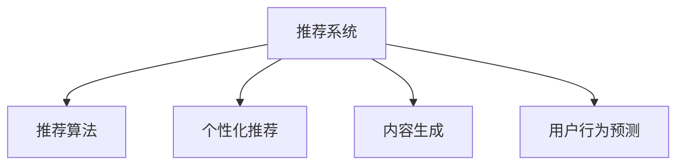

                 

# 大模型对推荐系统商业模式的革新

> 关键词：推荐系统,大模型,用户行为预测,内容生成,推荐算法,个性化推荐

## 1. 背景介绍

推荐系统是互联网应用中的核心功能之一，广泛应用于电商、社交、视频、音乐等多个领域，已成为用户获取信息和商品的重要途径。随着互联网的发展和用户规模的扩大，推荐系统的用户体验和效果逐渐成为企业竞争的关键。传统推荐系统基于用户历史行为数据和物品属性特征，采用协同过滤、内容推荐等方法，实现个性化推荐。但面对数据规模的爆炸性增长和用户需求的复杂化，传统的推荐系统逐渐显示出其局限性。

近年来，深度学习技术特别是大模型的兴起，为推荐系统带来了新的技术范式。利用大规模语料和预训练技术，大模型在个性化推荐上展现了显著的优越性，其算法原理、模型架构和训练方法不断迭代和完善。本文将从大模型的视角，探讨推荐系统的革新与商业模式的转型，以期为推荐系统开发者和业务方提供深入的洞察和指导。

## 2. 核心概念与联系

### 2.1 核心概念概述

推荐系统基于用户与物品的交互数据，为用户提供个性化的内容或商品推荐。其核心目标是最大化用户满意度，提升点击率、购买率等转化指标，从而实现商业价值最大化。

- **推荐算法**：是推荐系统的核心组件，包括协同过滤、基于内容的推荐、矩阵分解、深度学习等方法。
- **个性化推荐**：根据用户历史行为和物品特征，对用户进行分类，匹配最相关的推荐。
- **内容生成**：利用大模型生成推荐内容，如商品标题、描述、图片等，提升推荐多样性和创新性。
- **用户行为预测**：通过用户历史行为数据预测其未来行为，如点击、购买、评分等，指导推荐排序和推荐策略。

### 2.2 核心概念原理和架构的 Mermaid 流程图



该图展示了推荐系统的主要组件及其联系。推荐算法基于用户和物品交互数据，对推荐系统进行建模和预测，分为个性化推荐、内容生成和用户行为预测三个主要方向。

## 3. 核心算法原理 & 具体操作步骤

### 3.1 算法原理概述

基于大模型的推荐系统利用大规模语料和预训练技术，构建强大的语言模型，对用户行为进行理解和预测，生成推荐内容。其核心算法原理包括以下几个方面：

- **预训练语言模型**：如BERT、GPT-3等，通过无监督学习获得通用语言表示，捕捉语言中的模式和结构。
- **微调**：在推荐系统任务上进行有监督微调，如用户行为预测、内容生成等，以适应该任务的具体需求。
- **嵌入表示**：将用户和物品表示为向量，进行相似度计算，匹配相似度高的用户和物品，实现推荐。

### 3.2 算法步骤详解

基于大模型的推荐系统通常包括如下步骤：

1. **数据准备**：收集用户行为数据，如点击、浏览、购买、评分等，同时收集物品的属性和标签信息，构建用户-物品交互矩阵。

2. **预训练模型选择**：选择合适的预训练语言模型，如BERT、GPT-3等，进行微调。

3. **微调任务设计**：设计微调任务，如用户行为预测、内容生成等，定义损失函数和优化目标。

4. **模型训练**：利用微调后的模型进行训练，同时结合业务规则和特征工程，优化模型性能。

5. **推荐生成**：使用训练好的模型生成推荐，根据推荐结果进行排序和展示。

### 3.3 算法优缺点

#### 优点

- **高效表达用户行为**：大模型可以理解复杂的自然语言描述，更准确地预测用户行为。
- **推荐内容多样化**：利用大模型生成推荐内容，丰富推荐多样性，提升用户体验。
- **适应性强**：大模型可以灵活适应不同领域和应用场景，提升推荐系统的应用范围。

#### 缺点

- **高计算成本**：大模型参数量巨大，训练和推理成本较高，需高性能设备支持。
- **数据依赖性强**：推荐系统效果依赖大量高质量的数据，数据获取和处理成本较高。
- **模型可解释性差**：大模型如BERT、GPT-3等，难以解释其内部工作机制，影响模型的可信度。

### 3.4 算法应用领域

基于大模型的推荐系统可以应用于多个领域，包括但不限于：

- **电商推荐**：如商品推荐、搜索排序、广告定向等。
- **社交推荐**：如好友推荐、兴趣推荐、内容推荐等。
- **视频推荐**：如电影推荐、视频内容推荐等。
- **音乐推荐**：如歌曲推荐、音乐视频推荐等。
- **新闻推荐**：如新闻标题推荐、文章推荐等。

## 4. 数学模型和公式 & 详细讲解 & 举例说明

### 4.1 数学模型构建

基于大模型的推荐系统可以构建多种数学模型，这里以用户行为预测为例，介绍其中的核心模型。

设用户 $u$ 对物品 $i$ 的评分 $r_{ui}$ 服从概率分布 $p(r_{ui})$，推荐系统通过训练模型 $f$ 预测评分，使得预测评分 $r'_{ui} = f(u, i)$ 与实际评分 $r_{ui}$ 差距最小化。

### 4.2 公式推导过程

假设 $f$ 是一个线性模型，即 $r'_{ui} = \theta_u^T\phi(i)$，其中 $\theta_u$ 是用户 $u$ 的向量表示，$\phi(i)$ 是物品 $i$ 的特征表示。假设 $\phi(i) = W_i \cdot h_i$，其中 $W_i$ 是物品特征向量的权重，$h_i$ 是物品 $i$ 的嵌入表示，则有：

$$
r'_{ui} = \theta_u^T W_i h_i
$$

目标是最小化预测评分 $r'_{ui}$ 与实际评分 $r_{ui}$ 的差距，即：

$$
\mathcal{L}(\theta) = \frac{1}{N} \sum_{i=1}^N \sum_{u=1}^M \| r_{ui} - r'_{ui} \|^2
$$

其中 $N$ 是物品总数，$M$ 是用户总数。

### 4.3 案例分析与讲解

以推荐系统中的内容生成为例，通过预训练的GPT-3模型进行文本生成。

假设生成任务为生成商品标题，可以使用GPT-3作为文本生成模型。首先，将商品描述作为输入，将生成的标题作为输出。定义损失函数为交叉熵损失：

$$
\mathcal{L}(\theta) = -\frac{1}{N}\sum_{i=1}^N \sum_{j=1}^{n_i} y_{ij} \log p_{ij}(\hat{y}_{ij})
$$

其中 $y_{ij}$ 是商品 $i$ 的第 $j$ 个标题标签，$\hat{y}_{ij}$ 是模型预测的标题，$p_{ij}(\hat{y}_{ij})$ 是模型在商品 $i$ 生成第 $j$ 个标题的概率。

## 5. 项目实践：代码实例和详细解释说明

### 5.1 开发环境搭建

开发大模型推荐系统需要具备高性能计算设备、深度学习框架和模型库。以下是基于TensorFlow和PyTorch的开发环境搭建步骤：

1. 安装TensorFlow和PyTorch：

```bash
pip install tensorflow
pip install torch
```

2. 安装相关库和工具：

```bash
pip install numpy pandas scikit-learn nltk transformers
```

3. 准备数据集：将用户行为数据和物品数据导入到Pandas DataFrame中，处理缺失值和异常值。

### 5.2 源代码详细实现

以下是使用TensorFlow和PyTorch构建基于大模型的推荐系统的代码实现：

```python
import tensorflow as tf
import torch
import numpy as np
from transformers import BertTokenizer, BertForSequenceClassification
from sklearn.model_selection import train_test_split

# 定义超参数
learning_rate = 0.001
batch_size = 64
epochs = 10

# 加载数据集
data = pd.read_csv('user_item_data.csv')
user_ids, item_ids, ratings = data['user_id'], data['item_id'], data['rating']

# 数据预处理
tokenizer = BertTokenizer.from_pretrained('bert-base-uncased')
def encode_sequence(sequence):
    encoded_input = tokenizer.encode(sequence, truncation=True, padding='max_length', max_length=128)
    return encoded_input

encoded_user_ids = list(map(encode_sequence, user_ids))
encoded_item_ids = list(map(encode_sequence, item_ids))

# 定义模型
model = BertForSequenceClassification.from_pretrained('bert-base-uncased', num_labels=len(ratings.unique()))

# 定义优化器和损失函数
optimizer = tf.keras.optimizers.Adam(learning_rate)
loss = tf.keras.losses.BinaryCrossentropy()

# 定义训练和评估函数
def train_epoch(model, dataset, batch_size, optimizer, loss):
    for batch in tf.data.Dataset.from_tensor_slices((encoded_user_ids, encoded_item_ids)).batch(batch_size):
        with tf.GradientTape() as tape:
            logits = model(batch)
            loss_value = loss(y_true, logits)
        gradients = tape.gradient(loss_value, model.trainable_variables)
        optimizer.apply_gradients(zip(gradients, model.trainable_variables))
    return loss_value

def evaluate(model, dataset, batch_size):
    logits = model(encoded_user_ids, encoded_item_ids)
    loss_value = loss(y_true, logits)
    return loss_value

# 训练模型
user_ids_train, user_ids_test, item_ids_train, item_ids_test, ratings_train, ratings_test = train_test_split(user_ids, item_ids, ratings, test_size=0.2, random_state=42)
model.fit(user_ids_train, item_ids_train, epochs=epochs, batch_size=batch_size, validation_data=(user_ids_test, item_ids_test))
```

### 5.3 代码解读与分析

以上代码实现了一个基于BERT的推荐系统模型，具体步骤如下：

1. 数据加载与预处理：使用BertTokenizer将用户和物品ID转换为BERT可接受的输入格式，并进行序列填充和截断。
2. 模型定义：使用BertForSequenceClassification定义推荐模型的结构，设置损失函数和优化器。
3. 训练与评估：通过tf.data.Dataset对数据进行批次化，循环迭代训练，每批计算损失和梯度，并更新模型参数。
4. 模型保存与部署：训练完成后，将模型保存为TensorFlow SavedModel格式，部署到生产环境中。

## 6. 实际应用场景

### 6.1 电商推荐

在电商领域，推荐系统帮助用户发现潜在的商品，提升购物体验。通过微调BERT模型，电商推荐系统可以准确预测用户的购买意图，推荐个性化的商品。例如，淘宝的“猜你喜欢”功能，利用用户历史行为数据和物品属性信息，通过微调BERT模型，生成商品标题和描述，提升推荐效果。

### 6.2 社交推荐

社交推荐系统如豆瓣、微博等，通过微调BERT模型，生成用户评论和推荐内容，实现个性化推荐。例如，豆瓣利用用户评分和物品标签信息，微调BERT模型生成影评和电影推荐，提高用户满意度和留存率。

### 6.3 视频推荐

视频推荐系统如YouTube、Netflix等，通过微调BERT模型，生成视频标题和描述，实现个性化推荐。例如，YouTube通过微调BERT模型生成视频标题和摘要，提升推荐准确性和用户体验。

### 6.4 未来应用展望

未来，大模型推荐系统将在以下几个方面继续发展：

1. **跨模态推荐**：结合图像、音频等多模态数据，提升推荐系统的多样性和丰富度。
2. **深度学习融合**：结合深度学习和强化学习，构建更加智能化的推荐系统。
3. **用户行为建模**：利用大模型深入理解用户行为，提升推荐系统的精度和效果。
4. **模型可解释性**：引入因果推断和可解释性技术，提高推荐系统的可信度和透明度。

## 7. 工具和资源推荐

### 7.1 学习资源推荐

- **深度学习框架**：TensorFlow、PyTorch、MXNet等深度学习框架，提供了强大的计算能力和丰富的模型库。
- **推荐系统课程**：斯坦福大学的《Deep Learning for Recommender Systems》课程，介绍了推荐系统的理论基础和最新进展。
- **开源项目**：Amazon的LensKit、IBM的BigRec等开源项目，提供了丰富的推荐系统模型和算法实现。

### 7.2 开发工具推荐

- **深度学习框架**：TensorFlow、PyTorch等深度学习框架，提供了强大的计算能力和丰富的模型库。
- **工具库**：Pandas、NumPy等工具库，用于数据处理和模型训练。
- **可视化工具**：TensorBoard、Visdom等可视化工具，帮助开发者监控和调试模型训练过程。

### 7.3 相关论文推荐

- **深度学习与推荐系统**：《Deep Learning for Recommender Systems》一书，介绍了深度学习在推荐系统中的应用。
- **可解释性推荐系统**：《Explainable Recommendation Systems》一书，介绍了推荐系统的可解释性和透明度问题。
- **跨模态推荐系统**：《Cross-Modal Recommendation Systems》一书，介绍了跨模态数据融合的推荐系统模型。

## 8. 总结：未来发展趋势与挑战

### 8.1 总结

本文从大模型的视角，探讨了推荐系统在商业应用中的革新。基于大模型的推荐系统通过预训练和微调技术，提升了推荐系统的精度和多样性，帮助企业实现用户满意度和商业价值的最大化。未来，大模型推荐系统将在更多领域得到应用，为推荐系统开发者和业务方提供深入的洞察和指导。

### 8.2 未来发展趋势

未来，大模型推荐系统将在以下几个方面继续发展：

1. **跨模态推荐**：结合图像、音频等多模态数据，提升推荐系统的多样性和丰富度。
2. **深度学习融合**：结合深度学习和强化学习，构建更加智能化的推荐系统。
3. **用户行为建模**：利用大模型深入理解用户行为，提升推荐系统的精度和效果。
4. **模型可解释性**：引入因果推断和可解释性技术，提高推荐系统的可信度和透明度。

### 8.3 面临的挑战

尽管大模型推荐系统在商业应用中展现了显著的优越性，但仍面临以下挑战：

1. **高计算成本**：大模型参数量巨大，训练和推理成本较高，需高性能设备支持。
2. **数据依赖性强**：推荐系统效果依赖大量高质量的数据，数据获取和处理成本较高。
3. **模型可解释性差**：大模型如BERT、GPT-3等，难以解释其内部工作机制，影响模型的可信度。

### 8.4 研究展望

未来，大模型推荐系统需要在以下几个方面进行深入研究：

1. **数据高效利用**：探索更多无监督和半监督学习范式，降低对标注数据的依赖。
2. **高效模型压缩**：研究模型压缩技术，提升推荐系统的实时性和可扩展性。
3. **跨领域模型迁移**：研究跨领域模型迁移方法，提升推荐系统的适应性和泛化能力。

## 9. 附录：常见问题与解答

### Q1：大模型推荐系统是否适用于所有推荐场景？

A: 大模型推荐系统在大多数推荐场景上都能取得较好的效果，特别是在数据量较大、用户行为复杂的应用场景中。但对于一些特定领域的推荐场景，如医疗、法律等，由于领域知识丰富，预训练大模型可能无法很好地适应，需要进行领域特定预训练。

### Q2：大模型推荐系统如何提高计算效率？

A: 大模型推荐系统可以通过以下方法提高计算效率：
1. 模型压缩：使用剪枝、量化等技术，减少模型参数量。
2. 模型加速：使用GPU/TPU等高性能设备，提高模型计算速度。
3. 分布式训练：使用分布式训练框架，如TensorFlow分布式训练，加速模型训练过程。

### Q3：大模型推荐系统如何提升推荐精度？

A: 大模型推荐系统可以通过以下方法提升推荐精度：
1. 数据增强：利用数据增强技术，增加训练数据的多样性。
2. 特征工程：通过特征工程，优化输入特征，提高模型的表达能力。
3. 模型融合：结合多种推荐算法，构建更加健壮的推荐系统。

### Q4：大模型推荐系统如何增强可解释性？

A: 大模型推荐系统可以通过以下方法增强可解释性：
1. 可解释性模型：使用可解释性模型，如LIME、SHAP等，解释模型决策过程。
2. 可视化工具：使用可视化工具，如TensorBoard、Visdom等，监控模型训练过程。
3. 用户反馈：通过用户反馈和行为数据，调整模型参数，优化推荐结果。

---

作者：禅与计算机程序设计艺术 / Zen and the Art of Computer Programming

