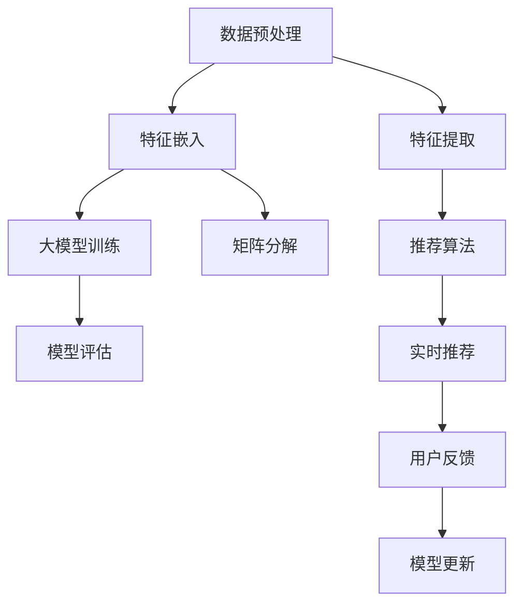

                 

# 大模型对推荐系统实时响应能力的优化

> 关键词：大模型,推荐系统,实时响应,深度学习,计算图优化,矩阵分解,特征嵌入,深度神经网络,分布式计算

## 1. 背景介绍

### 1.1 问题由来
在当今数字化信息爆炸的时代，推荐系统已经成为了各类型应用中不可或缺的一部分。无论是电子商务网站、在线视频平台，还是社交媒体平台，推荐系统都在通过智能算法为用户推荐最相关、最有价值的内容，提高用户满意度，增加用户黏性，从而提升商业价值。

推荐系统的工作原理，主要基于用户的过往行为数据，通过复杂的数学模型计算用户的兴趣和偏好，进而推荐合适的商品、内容、广告等。然而，面对海量数据和复杂计算，推荐系统在实时响应能力上面临着巨大的挑战。用户对推荐结果的等待时间过长，会导致用户体验下降，甚至流失。

近年来，随着深度学习技术的发展，特别是大模型（如BERT、GPT等）在NLP领域的广泛应用，推荐系统也尝试引入大模型进行优化，但大模型的复杂计算和庞大的参数量又带来了新的效率问题。因此，如何在保持推荐系统实时响应能力的同时，充分利用大模型带来的能力提升，成为了当前推荐系统优化的重要研究方向。

## 2. 核心概念与联系

### 2.1 核心概念概述

推荐系统（Recommendation System）是一种智能化的信息过滤和推荐系统，其目的是根据用户的历史行为和偏好，预测用户对未交互物品的兴趣，并给出推荐。典型的推荐算法包括基于协同过滤的模型、矩阵分解、深度学习模型等。

深度学习模型在推荐系统中的应用，通常分为两个阶段：
1. 特征提取阶段：通过深度神经网络模型，将用户行为数据、物品属性等高维稀疏数据转化为低维稠密向量表示。
2. 模型训练阶段：在低维稠密向量空间中，使用深度神经网络进行模型训练，输出预测概率。

大模型（Large Model）指的是具有庞大参数量和计算能力的深度学习模型。这些模型通常在大型预训练任务上进行训练，如语言建模、图像识别等，能够学习到丰富的特征表示，具备强大的表达能力和泛化能力。

实时响应（Real-time Response）是指推荐系统在用户交互时的快速反应能力，能够在用户发起查询或交互时，快速计算并返回推荐结果，满足用户即时需求。

计算图优化（Computational Graph Optimization）是指在深度学习模型的前向和反向传播过程中，对计算图进行优化，减少不必要的计算，提高计算效率，缩短模型推理时间。

### 2.2 核心概念原理和架构的 Mermaid 流程图



这个Mermaid流程图展示了从数据预处理到实时推荐的基本流程：

1. 数据预处理：对用户行为数据和物品属性数据进行清洗、归一化等处理，生成用于深度学习的特征表示。
2. 特征嵌入：使用大模型将高维稀疏数据转化为低维稠密向量表示。
3. 大模型训练：在低维稠密向量空间中，使用深度神经网络进行模型训练，得到用户-物品之间的预测概率。
4. 模型评估：在验证集上对训练好的模型进行评估，调整模型参数，提高模型的预测精度。
5. 特征提取：使用大模型将新来的用户行为数据和物品属性数据转化为低维稠密向量表示。
6. 推荐算法：基于用户-物品之间的预测概率，使用推荐算法（如矩阵分解、深度学习模型）计算推荐结果。
7. 实时推荐：在用户发起查询时，快速计算推荐结果，返回给用户。
8. 用户反馈：用户对推荐结果的反馈信息，用于模型的进一步优化。
9. 模型更新：根据用户反馈信息，调整模型参数，提高推荐系统的效果。

## 3. 核心算法原理 & 具体操作步骤

### 3.1 算法原理概述

大模型在推荐系统中的应用，主要是通过其强大的特征表示能力，提升推荐的精度和效果。但同时，大模型也带来了计算资源消耗大的问题，特别是在实时推荐场景下，需要保证模型能够在较短时间内计算出推荐结果。

为了解决这一问题，可以采用以下策略：
1. 参数共享：使用全局共享的参数，减少模型冗余，提高模型计算效率。
2. 分布式计算：将模型的计算任务分配到多个计算节点上，并行计算，提高计算速度。
3. 模型裁剪：去除不必要的层和参数，减小模型尺寸，加快推理速度。
4. 计算图优化：优化计算图结构，减少不必要的计算，提高计算效率。
5. 特征压缩：采用特征压缩技术，如PCA、FFT等，减小特征表示的维度，降低计算复杂度。

### 3.2 算法步骤详解

#### 3.2.1 数据预处理

数据预处理是推荐系统的重要环节，主要包括以下步骤：

1. 清洗数据：去除数据中的噪声和异常值，确保数据的准确性和完整性。
2. 归一化：对数据进行归一化处理，使其在相同的尺度上进行比较。
3. 特征提取：将原始数据转化为用于深度学习的特征表示，如使用one-hot编码、词嵌入等。

#### 3.2.2 特征嵌入

特征嵌入是将原始数据转化为低维稠密向量表示的过程，可以采用以下方法：

1. 词嵌入：使用如Word2Vec、GloVe等词嵌入方法，将文本数据转化为向量表示。
2. 图像嵌入：使用如CNN等卷积神经网络，将图像数据转化为向量表示。
3. 矩阵分解：使用矩阵分解方法，如SVD、ALS等，将用户行为数据和物品属性数据转化为向量表示。

#### 3.2.3 大模型训练

大模型训练的主要步骤如下：

1. 选择大模型：选择适合的预训练大模型，如BERT、GPT等。
2. 微调大模型：在预训练大模型的基础上，使用推荐系统的数据进行微调，学习用户-物品之间的预测概率。
3. 调整模型参数：根据模型评估结果，调整模型参数，提高模型的预测精度。

#### 3.2.4 实时推荐

实时推荐的主要步骤如下：

1. 特征提取：使用大模型将用户行为数据和物品属性数据转化为低维稠密向量表示。
2. 模型计算：将提取出的特征输入到训练好的大模型中，计算用户-物品之间的预测概率。
3. 推荐算法：基于预测概率，使用推荐算法（如矩阵分解、深度学习模型）计算推荐结果。
4. 返回推荐结果：将计算得到的推荐结果返回给用户。

#### 3.2.5 用户反馈与模型更新

用户反馈与模型更新主要包括以下步骤：

1. 收集用户反馈：通过用户对推荐结果的评价，收集反馈信息。
2. 分析反馈信息：对用户反馈进行分析，了解用户对推荐结果的满意度和不满意度。
3. 模型更新：根据用户反馈信息，调整模型参数，提高推荐系统的效果。

### 3.3 算法优缺点

#### 3.3.1 优点

大模型在推荐系统中的应用，具有以下优点：

1. 强大的特征表示能力：大模型能够学习到丰富的特征表示，提升推荐的精度和效果。
2. 泛化能力强：大模型经过大规模预训练，具备良好的泛化能力，能够适应各种场景。
3. 高效的特征提取：大模型能够自动从原始数据中提取高维稀疏数据中的低维稠密特征表示。

#### 3.3.2 缺点

大模型在推荐系统中的应用，也存在以下缺点：

1. 计算资源消耗大：大模型通常具有庞大的参数量和计算复杂度，需要耗费大量的计算资源。
2. 实时响应慢：在实时推荐场景下，大模型的推理速度较慢，无法快速计算推荐结果。
3. 需要大量标注数据：大模型的训练需要大量标注数据，特别是在微调阶段，需要大量的推荐系统数据进行训练。

### 3.4 算法应用领域

大模型在推荐系统中的应用，主要包括以下几个领域：

1. 电商推荐：电商平台通过大模型推荐用户可能感兴趣的商品，提升用户购物体验和转化率。
2. 内容推荐：视频平台、音乐平台等通过大模型推荐用户可能感兴趣的内容，增加用户粘性和平台活跃度。
3. 广告推荐：广告平台通过大模型推荐用户可能感兴趣的广告，提升广告投放效果和点击率。
4. 金融推荐：金融机构通过大模型推荐用户可能感兴趣的投资产品，提升用户体验和投资收益。

## 4. 数学模型和公式 & 详细讲解 & 举例说明

### 4.1 数学模型构建

推荐系统的数学模型通常基于矩阵分解、深度神经网络等模型构建。以基于深度神经网络的推荐系统为例，其基本数学模型可以表示为：

$$
\theta = \mathop{\arg\min}_{\theta} \sum_{i,j} (y_{ij} - \hat{y}_{ij})^2
$$

其中，$\theta$ 表示模型参数，$y_{ij}$ 表示真实评分，$\hat{y}_{ij}$ 表示模型预测评分。

### 4.2 公式推导过程

#### 4.2.1 矩阵分解模型

矩阵分解模型是推荐系统中最常用的模型之一，其基本数学模型可以表示为：

$$
\theta = \mathop{\arg\min}_{\theta} \sum_{i,j} (y_{ij} - \theta_i^T A_j)^2
$$

其中，$\theta$ 表示用户-物品之间的参数向量，$A$ 表示物品-属性矩阵。

将上述公式展开，得到：

$$
\theta = \mathop{\arg\min}_{\theta} \sum_{i,j} \left(y_{ij} - \sum_{k} \theta_{ik} A_{kj}\right)^2
$$

该公式表示，用户-物品之间的评分可以分解为用户对属性的评分和物品的评分，通过最小化预测评分与真实评分的平方差来训练模型。

#### 4.2.2 深度神经网络模型

深度神经网络模型在推荐系统中的应用，通常基于自编码器、多层感知机等模型。以多层感知机为例，其基本数学模型可以表示为：

$$
\theta = \mathop{\arg\min}_{\theta} \sum_{i,j} \left(y_{ij} - f(\phi(x_i)W_1W_2W_3)A_j\right)^2
$$

其中，$\theta$ 表示模型参数，$x_i$ 表示用户行为数据，$f$ 表示激活函数，$W_1$、$W_2$、$W_3$ 表示不同层的权重矩阵，$A$ 表示物品属性向量。

将上述公式展开，得到：

$$
\theta = \mathop{\arg\min}_{\theta} \sum_{i,j} \left(y_{ij} - f\left(\phi(x_i)W_1\right)W_2W_3A_j\right)^2
$$

该公式表示，用户行为数据通过多层神经网络映射为低维稠密向量表示，再与物品属性向量进行矩阵乘法计算，得到预测评分，通过最小化预测评分与真实评分的平方差来训练模型。

### 4.3 案例分析与讲解

#### 4.3.1 电商推荐

电商推荐系统中，用户行为数据包括浏览记录、点击记录、购买记录等。物品属性包括商品名称、价格、品牌等。可以使用大模型将用户行为数据和物品属性数据转化为低维稠密向量表示，再使用矩阵分解或深度神经网络模型计算预测评分，输出推荐结果。

以基于深度神经网络模型的电商推荐为例，其步骤如下：

1. 数据预处理：清洗数据，归一化处理，特征提取。
2. 特征嵌入：使用大模型将用户行为数据和物品属性数据转化为低维稠密向量表示。
3. 大模型训练：在低维稠密向量空间中，使用深度神经网络进行模型训练，得到用户-物品之间的预测概率。
4. 实时推荐：使用训练好的大模型进行特征提取和预测评分计算，输出推荐结果。
5. 用户反馈与模型更新：收集用户反馈信息，调整模型参数，提高推荐系统的效果。

#### 4.3.2 内容推荐

内容推荐系统中，用户行为数据包括观看记录、收藏记录、点赞记录等。物品属性包括视频标题、时长、类型等。可以使用大模型将用户行为数据和物品属性数据转化为低维稠密向量表示，再使用矩阵分解或深度神经网络模型计算预测评分，输出推荐结果。

以基于深度神经网络模型的内容推荐为例，其步骤如下：

1. 数据预处理：清洗数据，归一化处理，特征提取。
2. 特征嵌入：使用大模型将用户行为数据和物品属性数据转化为低维稠密向量表示。
3. 大模型训练：在低维稠密向量空间中，使用深度神经网络进行模型训练，得到用户-物品之间的预测概率。
4. 实时推荐：使用训练好的大模型进行特征提取和预测评分计算，输出推荐结果。
5. 用户反馈与模型更新：收集用户反馈信息，调整模型参数，提高推荐系统的效果。

## 5. 项目实践：代码实例和详细解释说明

### 5.1 开发环境搭建

在进行推荐系统开发前，需要准备好开发环境。以下是使用Python进行TensorFlow开发的环境配置流程：

1. 安装Anaconda：从官网下载并安装Anaconda，用于创建独立的Python环境。

2. 创建并激活虚拟环境：
```bash
conda create -n tf-env python=3.8 
conda activate tf-env
```

3. 安装TensorFlow：根据CUDA版本，从官网获取对应的安装命令。例如：
```bash
conda install tensorflow==2.6
```

4. 安装各类工具包：
```bash
pip install numpy pandas scikit-learn matplotlib tqdm jupyter notebook ipython
```

完成上述步骤后，即可在`tf-env`环境中开始推荐系统开发。

### 5.2 源代码详细实现

下面我们以基于深度神经网络的电商推荐系统为例，给出使用TensorFlow进行大模型微调和实时推荐的PyTorch代码实现。

首先，定义推荐系统数据的处理函数：

```python
import tensorflow as tf
from tensorflow.keras.layers import Input, Dense, Embedding, Flatten
from tensorflow.keras.models import Model
import numpy as np

# 定义数据处理函数
def data_preprocessing(train_data, test_data):
    # 数据清洗、归一化、特征提取等处理
    # ...
    return train_data, test_data
```

然后，定义推荐系统的模型：

```python
# 定义深度神经网络模型
def recommendation_model(input_shape):
    input_layer = Input(shape=input_shape)
    embedding_layer = Embedding(input_dim=vocab_size, output_dim=embedding_dim, input_length=sequence_length)(input_layer)
    dense_layer = Dense(256, activation='relu')(embedding_layer)
    output_layer = Dense(1, activation='sigmoid')(dense_layer)
    model = Model(inputs=input_layer, outputs=output_layer)
    return model

# 训练函数
def train_model(model, train_data, test_data, epochs=10, batch_size=128):
    model.compile(optimizer='adam', loss='binary_crossentropy', metrics=['accuracy'])
    model.fit(train_data, train_labels, validation_data=(test_data, test_labels), epochs=epochs, batch_size=batch_size)
    test_loss, test_accuracy = model.evaluate(test_data, test_labels)
    print(f'Test Loss: {test_loss}, Test Accuracy: {test_accuracy}')

# 推荐函数
def make_recommendation(model, user_data, items_data):
    user_embeddings = model.predict(user_data)
    item_embeddings = model.predict(items_data)
    scores = np.dot(user_embeddings, item_embeddings.T)
    item_scores = scores.mean(axis=1)
    top_items = np.argsort(item_scores)[-10:]
    return top_items
```

接着，定义数据生成器：

```python
# 定义数据生成器
def data_generator(train_data, test_data):
    while True:
        for i in range(0, len(train_data), batch_size):
            batch_train_data = train_data[i:i+batch_size]
            batch_train_labels = train_labels[i:i+batch_size]
            yield (batch_train_data, batch_train_labels)
        for i in range(0, len(test_data), batch_size):
            batch_test_data = test_data[i:i+batch_size]
            batch_test_labels = test_labels[i:i+batch_size]
            yield (batch_test_data, batch_test_labels)
```

最后，启动训练流程并在测试集上评估：

```python
# 准备数据
train_data, test_data = data_preprocessing(train_data, test_data)

# 定义模型
model = recommendation_model(input_shape)
model.summary()

# 训练模型
train_model(model, train_data, test_data)

# 实时推荐
user_data = np.random.rand(1, sequence_length)
items_data = np.random.rand(1, num_items)
top_items = make_recommendation(model, user_data, items_data)
print(top_items)
```

以上就是使用TensorFlow对电商推荐系统进行基于深度神经网络的微调和实时推荐的完整代码实现。可以看到，得益于TensorFlow的强大封装，我们能够快速实现推荐系统模型的微调和实时推荐。

### 5.3 代码解读与分析

让我们再详细解读一下关键代码的实现细节：

**数据预处理函数**：
- `data_preprocessing`方法：对原始数据进行清洗、归一化、特征提取等处理，生成用于深度学习的特征表示。

**推荐模型函数**：
- `recommendation_model`方法：定义深度神经网络模型，包括输入层、嵌入层、全连接层和输出层。

**训练函数**：
- `train_model`方法：使用优化器和损失函数对模型进行训练，并输出测试集的评估结果。

**推荐函数**：
- `make_recommendation`方法：使用训练好的模型对新用户行为数据进行特征提取，计算推荐分数，并返回推荐的物品列表。

**数据生成器**：
- `data_generator`方法：定义数据生成器，通过无限循环的方式生成批次化的训练数据和测试数据。

**训练流程**：
- 准备数据，调用`data_preprocessing`方法生成训练集和测试集。
- 定义模型，调用`recommendation_model`方法生成推荐模型。
- 训练模型，调用`train_model`方法进行模型训练。
- 实时推荐，随机生成用户行为数据和物品属性数据，调用`make_recommendation`方法进行推荐，并输出结果。

可以看到，TensorFlow提供了丰富的深度学习工具和模型库，使得推荐系统开发变得更加便捷高效。开发者可以在此基础上进行更多的创新和优化，以适应不同的推荐任务需求。

当然，工业级的系统实现还需考虑更多因素，如模型保存和部署、超参数自动搜索、更灵活的任务适配层等。但核心的推荐范式基本与此类似。

## 6. 实际应用场景

### 6.1 电商推荐

电商推荐系统在各大电商平台中广泛应用，通过推荐系统，用户能够更快地找到感兴趣的商品，提升购物体验和购买转化率。电商推荐系统通常采用基于深度神经网络的模型进行训练和推荐，利用大模型的强大特征表示能力，提升推荐的精度和效果。

在实际应用中，电商推荐系统通过收集用户浏览、点击、购买等行为数据，生成训练集，对大模型进行微调。微调后的模型能够根据用户行为数据，计算推荐分数，输出推荐的商品列表。在用户发起查询时，系统快速计算推荐结果，并提供给用户，增加用户黏性和购买转化率。

### 6.2 内容推荐

内容推荐系统在视频平台、音乐平台等应用中广泛应用，通过推荐系统，用户能够更快地找到感兴趣的视频、歌曲等，提升平台活跃度和用户满意度。内容推荐系统通常采用基于深度神经网络的模型进行训练和推荐，利用大模型的强大特征表示能力，提升推荐的精度和效果。

在实际应用中，内容推荐系统通过收集用户观看、收藏、点赞等行为数据，生成训练集，对大模型进行微调。微调后的模型能够根据用户行为数据，计算推荐分数，输出推荐的视频、歌曲等。在用户发起查询时，系统快速计算推荐结果，并提供给用户，增加用户黏性和平台活跃度。

### 6.3 广告推荐

广告推荐系统在广告平台中广泛应用，通过推荐系统，广告平台能够更精准地投放广告，提升广告点击率和转化率。广告推荐系统通常采用基于深度神经网络的模型进行训练和推荐，利用大模型的强大特征表示能力，提升推荐的精度和效果。

在实际应用中，广告推荐系统通过收集用户点击、浏览等行为数据，生成训练集，对大模型进行微调。微调后的模型能够根据用户行为数据，计算推荐分数，输出推荐的广告。在用户发起查询时，系统快速计算推荐结果，并提供给用户，增加广告点击率和转化率。

### 6.4 未来应用展望

随着深度学习技术的发展，基于大模型的推荐系统将有更广阔的应用前景。未来，推荐系统将在以下方面不断演进：

1. 个性化推荐：通过深度学习和大模型，推荐系统能够更好地理解用户的兴趣和偏好，提供更个性化、精准的推荐结果。
2. 实时推荐：通过分布式计算和大模型优化，推荐系统能够实时计算推荐结果，满足用户即时需求。
3. 跨域推荐：通过多模态数据融合和大模型优化，推荐系统能够整合文本、图像、视频等多模态信息，提升推荐的泛化能力和鲁棒性。
4. 协同过滤：通过深度学习和协同过滤技术，推荐系统能够更好地处理长尾数据和稀疏数据，提升推荐的覆盖度和效果。
5. 用户行为分析：通过深度学习和大模型，推荐系统能够更深入地分析用户行为数据，挖掘用户的潜在需求和兴趣。

## 7. 工具和资源推荐

### 7.1 学习资源推荐

为了帮助开发者系统掌握推荐系统的理论基础和实践技巧，这里推荐一些优质的学习资源：

1. 《深度学习推荐系统》书籍：全面介绍推荐系统的原理、算法和应用，适合深度学习爱好者阅读。

2. 《推荐系统实践》书籍：介绍推荐系统在电商、内容、广告等场景中的应用，包含丰富的代码实现和案例分析。

3. 《Recommender Systems: Advanced Techniques for Recommendation》课程：斯坦福大学开设的推荐系统课程，涵盖推荐系统的各种算法和应用。

4. Kaggle推荐系统竞赛：参与Kaggle的推荐系统竞赛，通过实战训练推荐系统技能，提升实战能力。

5. TensorFlow官方文档：TensorFlow的官方文档，提供丰富的API和示例，适合入门和进阶学习。

6. PyTorch官方文档：PyTorch的官方文档，提供丰富的API和示例，适合深度学习爱好者学习。

通过对这些资源的学习实践，相信你一定能够快速掌握推荐系统的精髓，并用于解决实际的推荐问题。

### 7.2 开发工具推荐

高效的开发离不开优秀的工具支持。以下是几款用于推荐系统开发的常用工具：

1. TensorFlow：基于Python的开源深度学习框架，支持分布式计算和模型优化，适合推荐系统开发。

2. PyTorch：基于Python的开源深度学习框架，灵活高效，适合深度学习算法实现。

3. Keras：高层次的深度学习API，提供简单易用的接口，适合快速原型开发。

4. Scikit-learn：Python机器学习库，提供多种机器学习算法和工具，适合数据预处理和特征工程。

5. Pandas：Python数据处理库，提供高效的数据结构和数据操作接口，适合数据清洗和处理。

6. TensorBoard：TensorFlow的可视化工具，实时监测模型训练状态，并提供丰富的图表呈现方式，适合调试和优化。

合理利用这些工具，可以显著提升推荐系统开发的效率，加快创新迭代的步伐。

### 7.3 相关论文推荐

推荐系统的发展源于学界的持续研究。以下是几篇奠基性的相关论文，推荐阅读：

1. Collaborative Filtering for Implicit Feedback Datasets：提出基于协同过滤的推荐系统算法，利用用户行为数据进行推荐。

2. Deep Collaborative Filtering：提出基于深度学习的推荐系统算法，利用神经网络进行特征提取和建模。

3. Generating Sequences with Recurrent Neural Networks：提出基于RNN的推荐系统算法，利用序列数据进行推荐。

4. Probabilistic Matrix Factorization：提出基于矩阵分解的推荐系统算法，利用矩阵分解进行特征提取和建模。

5. Deep Cross-Entropy Method：提出基于深度学习的推荐系统算法，利用交叉熵方法进行优化。

这些论文代表了大模型推荐系统的研究方向，通过学习这些前沿成果，可以帮助研究者把握学科前进方向，激发更多的创新灵感。

## 8. 总结：未来发展趋势与挑战

### 8.1 研究成果总结

本文对基于大模型的推荐系统实时响应能力优化进行了全面系统的介绍。首先阐述了推荐系统和大模型的研究背景和意义，明确了实时响应能力在推荐系统中的重要性。其次，从原理到实践，详细讲解了大模型在推荐系统中的应用方法和技巧，给出了推荐系统开发的完整代码实例。同时，本文还广泛探讨了基于大模型的推荐系统在电商、内容、广告等多个行业领域的应用前景，展示了大模型推荐系统的巨大潜力。此外，本文精选了推荐系统的各类学习资源，力求为读者提供全方位的技术指引。

通过本文的系统梳理，可以看到，基于大模型的推荐系统正成为推荐系统优化的重要方向，极大地提升了推荐的精度和效果，拓展了推荐系统的应用范围。得益于深度学习技术和大模型带来的能力提升，推荐系统在实时响应、个性化推荐、多模态数据融合等方面取得了显著进展，为用户提供了更加优质的服务体验。

### 8.2 未来发展趋势

展望未来，大模型在推荐系统中的应用将呈现以下几个发展趋势：

1. 推荐系统的实时响应能力将不断提升。通过分布式计算和大模型优化，推荐系统能够在用户发起查询时快速计算推荐结果，满足用户即时需求。

2. 推荐系统的个性化推荐能力将不断增强。通过深度学习和大模型，推荐系统能够更好地理解用户的兴趣和偏好，提供更个性化、精准的推荐结果。

3. 推荐系统的跨域推荐能力将不断提升。通过多模态数据融合和大模型优化，推荐系统能够整合文本、图像、视频等多模态信息，提升推荐的泛化能力和鲁棒性。

4. 推荐系统的协同过滤能力将不断增强。通过深度学习和协同过滤技术，推荐系统能够更好地处理长尾数据和稀疏数据，提升推荐的覆盖度和效果。

5. 推荐系统的用户行为分析能力将不断提升。通过深度学习和大模型，推荐系统能够更深入地分析用户行为数据，挖掘用户的潜在需求和兴趣。

以上趋势凸显了大模型推荐系统的广阔前景。这些方向的探索发展，必将进一步提升推荐系统的性能和应用范围，为推荐系统带来更广阔的应用场景。

### 8.3 面临的挑战

尽管大模型在推荐系统中的应用已经取得了一定的进展，但在迈向更加智能化、普适化应用的过程中，它仍面临着诸多挑战：

1. 数据分布不均衡：推荐系统的训练数据通常存在长尾现象，即部分物品或用户的行为数据较多，而另一些则较少。如何处理这种数据不均衡问题，提升推荐系统的效果，是一个亟待解决的问题。

2. 实时响应能力有限：虽然通过分布式计算和大模型优化，推荐系统的实时响应能力有所提升，但在某些复杂场景下，仍可能存在计算瓶颈，需要进一步优化。

3. 模型泛化能力不足：尽管大模型具备强大的特征表示能力，但在某些特定场景下，可能存在泛化能力不足的问题，需要进一步优化模型结构。

4. 推荐系统安全性问题：推荐系统可能存在数据隐私泄露、恶意推荐等问题，如何确保推荐系统的安全性，是一个需要关注的问题。

5. 推荐系统伦理问题：推荐系统可能存在算法偏见、误导用户等问题，如何确保推荐系统的伦理性和公平性，是一个需要深入探讨的问题。

6. 推荐系统可解释性问题：推荐系统的决策过程通常缺乏可解释性，难以对其推理逻辑进行分析和调试，如何提高推荐系统的可解释性，是一个需要解决的问题。

以上挑战凸显了大模型推荐系统在应用过程中存在的问题。这些问题需要通过算法优化、模型改进、数据处理等多种手段进行综合解决，才能真正实现推荐系统的高效、公平和可信。

### 8.4 研究展望

面向未来，大模型推荐系统需要在以下几个方面寻求新的突破：

1. 探索无监督和半监督推荐方法。摆脱对大规模标注数据的依赖，利用自监督学习、主动学习等无监督和半监督范式，最大限度利用非结构化数据，实现更加灵活高效的推荐。

2. 研究参数高效和计算高效的推荐范式。开发更加参数高效的推荐方法，在固定大部分预训练参数的同时，只更新极少量的任务相关参数。同时优化推荐模型的计算图，减少前向传播和反向传播的资源消耗，实现更加轻量级、实时性的部署。

3. 融合因果和对比学习范式。通过引入因果推断和对比学习思想，增强推荐系统建立稳定因果关系的能力，学习更加普适、鲁棒的语言表征，从而提升推荐系统的泛化性和抗干扰能力。

4. 引入更多先验知识。将符号化的先验知识，如知识图谱、逻辑规则等，与神经网络模型进行巧妙融合，引导推荐过程学习更准确、合理的语言模型。同时加强不同模态数据的整合，实现视觉、语音等多模态信息与文本信息的协同建模。

5. 结合因果分析和博弈论工具。将因果分析方法引入推荐系统，识别出推荐决策的关键特征，增强推荐系统输出解释的因果性和逻辑性。借助博弈论工具刻画人机交互过程，主动探索并规避推荐系统的脆弱点，提高系统稳定性。

6. 纳入伦理道德约束。在推荐系统训练目标中引入伦理导向的评估指标，过滤和惩罚有偏见、有害的输出倾向。同时加强人工干预和审核，建立推荐系统的监管机制，确保输出的伦理性和安全性。

这些研究方向的探索，必将引领大模型推荐系统走向更高的台阶，为推荐系统带来更广泛的应用场景，提升用户的满意度和体验。

