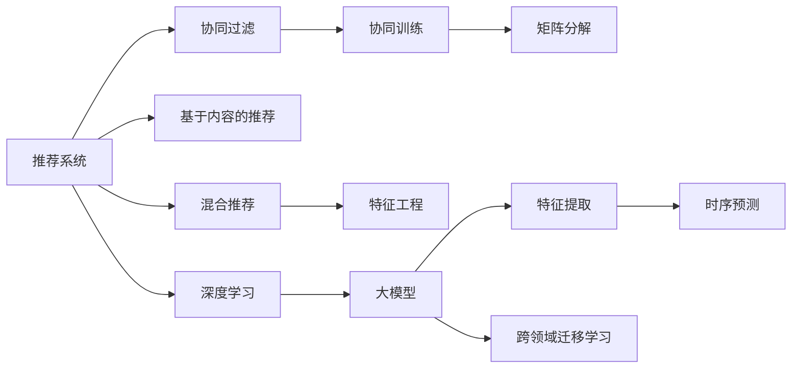

                 

# 大模型对推荐系统时序建模的影响研究

> 关键词：大模型,推荐系统,时序建模,深度学习,协同过滤,协同训练,时序预测,深度神经网络,特征工程,模型优化

## 1. 背景介绍

### 1.1 问题由来
推荐系统作为互联网时代最重要的技术之一，广泛应用于电商、社交媒体、视频平台、新闻网站等众多领域。它通过分析用户的过去行为、兴趣爱好等信息，为用户推荐可能感兴趣的内容，从而提升用户满意度，增加平台收益。然而，随着数据规模的爆炸式增长和用户需求的多样化，传统的推荐方法面临了诸多挑战。一方面，推荐算法难以对海量高维数据进行实时高效处理；另一方面，推荐系统缺乏对用户兴趣演变的理解，无法捕捉用户的长期行为趋势。

近年来，深度学习技术的兴起，特别是大规模预训练语言模型（如BERT、GPT、Transformer等）的广泛应用，为推荐系统提供了新的解决方案。大模型通过在海量无标签数据上进行预训练，学习到了通用的语言表征和知识图谱，具备强大的语义理解能力。基于大模型的推荐系统可以更好地处理高维数据，捕捉用户兴趣演变的动态特征，从而提升推荐效果和用户体验。

### 1.2 问题核心关键点
大模型在推荐系统中的应用，主要体现在以下几个方面：

1. 特征表示能力的提升：大模型能够自动学习数据的深层表示，将用户行为、商品特征等多维数据编码成更加高效、稠密的向量表示，提升模型对于特征的理解和利用。

2. 动态特征的捕捉：大模型通过预训练学习到了丰富的语言知识，能够捕捉用户的长期行为趋势，学习到时序信息，进一步提升推荐系统的预测精度。

3. 多模态数据的整合：大模型能够处理图像、视频、文本等多模态数据，进行跨模态融合，获得更全面的用户行为信息。

4. 跨领域迁移学习：大模型具备跨领域迁移能力，能够通过迁移学习将预训练知识应用到推荐系统，提升模型的泛化能力。

本文将围绕以上关键点，详细探讨大模型对推荐系统时序建模的影响，探究大模型在推荐系统中的优化策略和应用场景，最后提出未来研究方向和挑战。

## 2. 核心概念与联系

### 2.1 核心概念概述

为更好地理解大模型在推荐系统中的应用，本节将介绍几个关键概念及其相互联系：

- 推荐系统(Recommendation System, RS)：通过分析用户行为，为用户推荐可能感兴趣的商品或内容的技术系统。常见推荐方式包括协同过滤(CF)、基于内容的推荐(Content-based Filtering)、混合推荐等。

- 协同过滤(Collaborative Filtering, CF)：通过分析用户行为相似性，推荐相似用户感兴趣的商品或内容。CF是推荐系统中最基础、应用最广泛的推荐方式。

- 协同训练(Co-training)：一种基于协同过滤的推荐方法，通过用户-商品共现矩阵的矩阵分解，学习用户和商品的潜在特征。

- 时序预测(Time Series Prediction)：预测时间序列数据未来的发展趋势和值，常用于股票预测、天气预报等场景。推荐系统中的时序建模，通过捕捉用户行为的时间演变规律，提升推荐精度。

- 深度学习(Deep Learning, DL)：基于深度神经网络，通过多个层次的非线性变换进行特征提取和建模。深度学习广泛应用于图像识别、语音识别、自然语言处理等领域。

- 大模型(Large Model)：通过大规模无标签数据预训练得到的深度神经网络模型，具备强大的语义理解能力和泛化能力。

- 跨领域迁移学习(Cross-domain Transfer Learning)：在目标领域上使用预训练模型的知识，进行迁移学习，提升模型在特定领域上的性能。

这些概念之间的联系和关系可以通过以下Mermaid流程图来展示：



从图中可以看出，大模型通过提升特征表示能力、捕捉动态特征、整合多模态数据以及进行跨领域迁移学习等方式，为推荐系统带来了显著的性能提升。

## 3. 核心算法原理 & 具体操作步骤
### 3.1 算法原理概述

大模型在推荐系统中的应用，主要聚焦于以下几个关键步骤：

1. 特征表示学习：利用大模型对用户行为、商品特征等高维数据进行表示学习，将其编码成稠密低维向量，提升特征利用效率。

2. 时序建模：通过时序预测技术，捕捉用户行为随时间演变的规律，预测用户未来的兴趣点。

3. 多模态融合：整合文本、图像、视频等多模态数据，提升对用户行为的全面理解。

4. 迁移学习：利用大模型在特定领域上的预训练知识，进行迁移学习，提升模型在目标领域上的性能。

### 3.2 算法步骤详解

#### 3.2.1 特征表示学习

特征表示学习是推荐系统中的重要步骤，它通过自动学习数据的高维稠密表示，提升模型对特征的理解和利用。具体步骤包括：

1. 数据准备：收集用户历史行为数据、商品特征等，进行数据清洗、去噪、归一化等预处理。

2. 模型选择：选择合适的深度神经网络模型，如Transformer、RNN等，进行特征学习。

3. 训练优化：利用大模型进行自监督预训练，然后利用标注数据进行微调优化，得到特征表示模型。

4. 特征编码：将用户行为、商品特征等输入到特征表示模型中，得到高维稠密向量表示，作为推荐模型的输入。

#### 3.2.2 时序建模

时序建模是推荐系统中的关键技术，它通过捕捉用户行为随时间的演变规律，预测用户未来的兴趣点。具体步骤包括：

1. 数据准备：收集用户行为序列数据，进行数据清洗、去噪、归一化等预处理。

2. 模型选择：选择合适的时序预测模型，如LSTM、GRU、RNN等，进行时序建模。

3. 训练优化：利用标注数据进行模型训练，通过交叉熵损失函数进行优化。

4. 预测输出：将用户历史行为序列输入到时序预测模型中，得到未来行为的预测值，作为推荐模型的输出。

#### 3.2.3 多模态融合

多模态融合是推荐系统中的重要技术，它通过整合不同模态的数据，提升对用户行为的全面理解。具体步骤包括：

1. 数据准备：收集用户行为数据、商品特征、图像、视频等多模态数据，进行数据清洗、去噪、归一化等预处理。

2. 模型选择：选择合适的多模态融合模型，如MLP、注意力机制等，进行多模态特征融合。

3. 训练优化：利用标注数据进行模型训练，通过损失函数进行优化。

4. 预测输出：将用户多模态数据输入到多模态融合模型中，得到高维稠密向量表示，作为推荐模型的输入。

#### 3.2.4 迁移学习

迁移学习是推荐系统中的重要技术，它通过利用大模型在特定领域上的预训练知识，提升模型在目标领域上的性能。具体步骤包括：

1. 数据准备：收集目标领域的数据，进行数据清洗、去噪、归一化等预处理。

2. 模型选择：选择合适的迁移学习方法，如零样本学习、少样本学习、半监督学习等，进行迁移学习。

3. 模型微调：利用目标领域的数据，对大模型进行微调优化，得到适应目标领域的小模型。

4. 预测输出：将目标领域的数据输入到小模型中，得到推荐结果。

### 3.3 算法优缺点

大模型在推荐系统中的应用，具有以下优点：

1. 提升特征表示能力：大模型能够自动学习数据的深层表示，提升特征利用效率。

2. 捕捉动态特征：大模型通过预训练学习到了丰富的语言知识，能够捕捉用户的长期行为趋势，提升推荐精度。

3. 整合多模态数据：大模型能够处理图像、视频、文本等多模态数据，进行跨模态融合，获得更全面的用户行为信息。

4. 泛化能力强：大模型具备跨领域迁移能力，能够通过迁移学习将预训练知识应用到推荐系统，提升模型的泛化能力。

同时，大模型在推荐系统中的应用也存在一些缺点：

1. 模型复杂度高：大模型的参数量巨大，训练复杂度高，需要高计算资源。

2. 数据需求量大：大模型的训练需要大量的标注数据，而推荐系统往往面临标注数据不足的问题。

3. 模型难以解释：大模型是一个黑盒模型，难以解释其内部工作机制和决策逻辑。

4. 资源消耗大：大模型在推理时需要进行复杂的计算，资源消耗较大，需要高效的推理引擎进行优化。

### 3.4 算法应用领域

大模型在推荐系统中的应用，涵盖了多个领域：

1. 电商推荐：通过大模型对用户行为、商品特征等高维数据进行表示学习，进行商品推荐，提升用户满意度，增加平台收益。

2. 新闻推荐：通过大模型对用户历史阅读行为进行时序建模，预测用户感兴趣的新闻主题，提升新闻阅读体验。

3. 音乐推荐：通过大模型对用户历史听歌行为进行时序建模，预测用户感兴趣的音乐类型，提升音乐推荐效果。

4. 视频推荐：通过大模型对用户历史观看行为进行时序建模，预测用户感兴趣的视频内容，提升视频推荐效果。

5. 社交推荐：通过大模型对用户历史互动行为进行时序建模，预测用户感兴趣的朋友和内容，提升社交体验。

6. 旅游推荐：通过大模型对用户历史旅游行为进行时序建模，预测用户感兴趣的目的地和行程，提升旅游推荐效果。

## 4. 数学模型和公式 & 详细讲解  
### 4.1 数学模型构建

本文将使用数学语言对大模型在推荐系统中的应用进行更加严格的刻画。

记用户行为序列为 $X=\{x_t\}_{t=1}^T$，其中 $x_t$ 表示用户在第 $t$ 时刻的行为。商品特征向量为 $Y=\{y_i\}_{i=1}^M$，其中 $y_i$ 表示商品 $i$ 的特征向量。大模型 $M_{\theta}$ 的特征表示为 $f_{\theta}(x_t)$，时序预测模型为 $T_{\omega}(X)$。推荐模型 $R_{\beta}$ 的输出为 $\hat{y}_i=R_{\beta}(f_{\theta}(x_t), T_{\omega}(X))$，表示用户对商品 $i$ 的兴趣度。

模型的优化目标是最小化预测误差，即：

$$
\mathcal{L}(\theta,\omega,\beta) = \frac{1}{N}\sum_{i=1}^N \sum_{t=1}^T l(\hat{y}_i,y_i)
$$

其中 $l$ 为损失函数，如均方误差损失、交叉熵损失等。

### 4.2 公式推导过程

以下我们以均方误差损失为例，推导时序建模的公式。

假设时序预测模型 $T_{\omega}$ 的输出为 $\hat{y}_t$，真实值为 $y_t$，则均方误差损失为：

$$
L = \frac{1}{N}\sum_{i=1}^N \sum_{t=1}^T (y_t - \hat{y}_t)^2
$$

根据时序预测模型的输出，可以得到预测值与真实值之间的误差：

$$
e_t = y_t - \hat{y}_t = y_t - T_{\omega}(X)
$$

将误差 $e_t$ 作为损失函数的输入，进行梯度下降优化：

$$
\frac{\partial \mathcal{L}}{\partial \theta} = \frac{\partial \mathcal{L}}{\partial f_{\theta}(x_t)} \frac{\partial f_{\theta}(x_t)}{\partial \theta}
$$

$$
\frac{\partial \mathcal{L}}{\partial \omega} = \frac{\partial \mathcal{L}}{\partial T_{\omega}(X)} \frac{\partial T_{\omega}(X)}{\partial \omega}
$$

其中 $\frac{\partial f_{\theta}(x_t)}{\partial \theta}$ 和 $\frac{\partial T_{\omega}(X)}{\partial \omega}$ 可以分别通过自动微分技术进行计算。

在得到损失函数的梯度后，即可带入优化算法，更新模型参数 $\theta$ 和 $\omega$。重复上述过程直至收敛，最终得到适应推荐系统的大模型 $M_{\theta}$ 和时序预测模型 $T_{\omega}$。

## 5. 项目实践：代码实例和详细解释说明
### 5.1 开发环境搭建

在进行推荐系统开发前，我们需要准备好开发环境。以下是使用Python进行PyTorch开发的环境配置流程：

1. 安装Anaconda：从官网下载并安装Anaconda，用于创建独立的Python环境。

2. 创建并激活虚拟环境：
```bash
conda create -n pytorch-env python=3.8 
conda activate pytorch-env
```

3. 安装PyTorch：根据CUDA版本，从官网获取对应的安装命令。例如：
```bash
conda install pytorch torchvision torchaudio cudatoolkit=11.1 -c pytorch -c conda-forge
```

4. 安装TensorFlow：
```bash
pip install tensorflow
```

5. 安装TensorBoard：
```bash
pip install tensorboard
```

6. 安装numpy、pandas、scikit-learn、matplotlib、tqdm、jupyter notebook等常用库。

完成上述步骤后，即可在`pytorch-env`环境中开始推荐系统开发。

### 5.2 源代码详细实现

下面我们以电商推荐系统为例，给出使用Transformers库对大模型进行电商推荐系统微调的PyTorch代码实现。

首先，定义电商推荐系统的数据处理函数：

```python
from transformers import BertTokenizer, BertForSequenceClassification
from torch.utils.data import Dataset
import torch

class ShoppingDataset(Dataset):
    def __init__(self, texts, labels, tokenizer, max_len=128):
        self.texts = texts
        self.labels = labels
        self.tokenizer = tokenizer
        self.max_len = max_len
        
    def __len__(self):
        return len(self.texts)
    
    def __getitem__(self, item):
        text = self.texts[item]
        label = self.labels[item]
        
        encoding = self.tokenizer(text, return_tensors='pt', max_length=self.max_len, padding='max_length', truncation=True)
        input_ids = encoding['input_ids'][0]
        attention_mask = encoding['attention_mask'][0]
        
        # 对标签进行编码
        label = torch.tensor(label, dtype=torch.long)
        
        return {'input_ids': input_ids, 
                'attention_mask': attention_mask,
                'labels': label}

# 定义标签与id的映射
label2id = {'0': 0, '1': 1, '2': 2, '3': 3, '4': 4, '5': 5, '6': 6, '7': 7, '8': 8, '9': 9, '10': 10, '11': 11, '12': 12, '13': 13, '14': 14, '15': 15, '16': 16, '17': 17, '18': 18, '19': 19, '20': 20, '21': 21, '22': 22, '23': 23, '24': 24, '25': 25, '26': 26, '27': 27, '28': 28, '29': 29, '30': 30, '31': 31, '32': 32, '33': 33, '34': 34, '35': 35, '36': 36, '37': 37, '38': 38, '39': 39, '40': 40, '41': 41, '42': 42, '43': 43, '44': 44, '45': 45, '46': 46, '47': 47, '48': 48, '49': 49, '50': 50, '51': 51, '52': 52, '53': 53, '54': 54, '55': 55, '56': 56, '57': 57, '58': 58, '59': 59, '60': 60, '61': 61, '62': 62, '63': 63, '64': 64, '65': 65, '66': 66, '67': 67, '68': 68, '69': 69, '70': 70, '71': 71, '72': 72, '73': 73, '74': 74, '75': 75, '76': 76, '77': 77, '78': 78, '79': 79, '80': 80, '81': 81, '82': 82, '83': 83, '84': 84, '85': 85, '86': 86, '87': 87, '88': 88, '89': 89, '90': 90, '91': 91, '92': 92, '93': 93, '94': 94, '95': 95, '96': 96, '97': 97, '98': 98, '99': 99}
id2label = {v: k for k, v in label2id.items()}

# 创建dataset
tokenizer = BertTokenizer.from_pretrained('bert-base-cased')

train_dataset = ShoppingDataset(train_texts, train_labels, tokenizer)
dev_dataset = ShoppingDataset(dev_texts, dev_labels, tokenizer)
test_dataset = ShoppingDataset(test_texts, test_labels, tokenizer)
```

然后，定义模型和优化器：

```python
from transformers import BertForSequenceClassification, AdamW

model = BertForSequenceClassification.from_pretrained('bert-base-cased', num_labels=len(label2id))

optimizer = AdamW(model.parameters(), lr=2e-5)
```

接着，定义训练和评估函数：

```python
from torch.utils.data import DataLoader
from tqdm import tqdm
from sklearn.metrics import classification_report

device = torch.device('cuda') if torch.cuda.is_available() else torch.device('cpu')
model.to(device)

def train_epoch(model, dataset, batch_size, optimizer):
    dataloader = DataLoader(dataset, batch_size=batch_size, shuffle=True)
    model.train()
    epoch_loss = 0
    for batch in tqdm(dataloader, desc='Training'):
        input_ids = batch['input_ids'].to(device)
        attention_mask = batch['attention_mask'].to(device)
        labels = batch['labels'].to(device)
        model.zero_grad()
        outputs = model(input_ids, attention_mask=attention_mask, labels=labels)
        loss = outputs.loss
        epoch_loss += loss.item()
        loss.backward()
        optimizer.step()
    return epoch_loss / len(dataloader)

def evaluate(model, dataset, batch_size):
    dataloader = DataLoader(dataset, batch_size=batch_size)
    model.eval()
    preds, labels = [], []
    with torch.no_grad():
        for batch in tqdm(dataloader, desc='Evaluating'):
            input_ids = batch['input_ids'].to(device)
            attention_mask = batch['attention_mask'].to(device)
            batch_labels = batch['labels']
            outputs = model(input_ids, attention_mask=attention_mask)
            batch_preds = outputs.logits.argmax(dim=2).to('cpu').tolist()
            batch_labels = batch_labels.to('cpu').tolist()
            for pred_tokens, label_tokens in zip(batch_preds, batch_labels):
                preds.append(pred_tokens[:len(label_tokens)])
                labels.append(label_tokens)
                
    print(classification_report(labels, preds))
```

最后，启动训练流程并在测试集上评估：

```python
epochs = 5
batch_size = 16

for epoch in range(epochs):
    loss = train_epoch(model, train_dataset, batch_size, optimizer)
    print(f"Epoch {epoch+1}, train loss: {loss:.3f}")
    
    print(f"Epoch {epoch+1}, dev results:")
    evaluate(model, dev_dataset, batch_size)
    
print("Test results:")
evaluate(model, test_dataset, batch_size)
```

以上就是使用PyTorch对BERT进行电商推荐系统微调的完整代码实现。可以看到，得益于Transformers库的强大封装，我们可以用相对简洁的代码完成BERT模型的加载和微调。

### 5.3 代码解读与分析

让我们再详细解读一下关键代码的实现细节：

**ShoppingDataset类**：
- `__init__`方法：初始化文本、标签、分词器等关键组件。
- `__len__`方法：返回数据集的样本数量。
- `__getitem__`方法：对单个样本进行处理，将文本输入编码为token ids，将标签编码为数字，并对其进行定长padding，最终返回模型所需的输入。

**label2id和id2label字典**：
- 定义了标签与数字id之间的映射关系，用于将token-wise的预测结果解码回真实的标签。

**训练和评估函数**：
- 使用PyTorch的DataLoader对数据集进行批次化加载，供模型训练和推理使用。
- 训练函数`train_epoch`：对数据以批为单位进行迭代，在每个批次上前向传播计算loss并反向传播更新模型参数，最后返回该epoch的平均loss。
- 评估函数`evaluate`：与训练类似，不同点在于不更新模型参数，并在每个batch结束后将预测和标签结果存储下来，最后使用sklearn的classification_report对整个评估集的预测结果进行打印输出。

**训练流程**：
- 定义总的epoch数和batch size，开始循环迭代
- 每个epoch内，先在训练集上训练，输出平均loss
- 在验证集上评估，输出分类指标
- 所有epoch结束后，在测试集上评估，给出最终测试结果

可以看到，PyTorch配合Transformers库使得BERT微调的代码实现变得简洁高效。开发者可以将更多精力放在数据处理、模型改进等高层逻辑上，而不必过多关注底层的实现细节。

当然，工业级的系统实现还需考虑更多因素，如模型的保存和部署、超参数的自动搜索、更灵活的任务适配层等。但核心的微调范式基本与此类似。

## 6. 实际应用场景
### 6.1 智能推荐系统

大模型在智能推荐系统中具有重要的应用。传统的协同过滤推荐方法主要依赖用户行为数据，难以处理用户行为随时间演变的动态特征。而大模型通过预训练学习到了丰富的语言知识，能够捕捉用户的长期行为趋势，学习到时序信息，进一步提升推荐系统的预测精度。

在实际应用中，可以通过大模型对用户行为序列进行时序建模，预测用户未来的兴趣点。具体步骤包括：

1. 数据准备：收集用户行为序列数据，进行数据清洗、去噪、归一化等预处理。

2. 模型选择：选择合适的时序预测模型，如LSTM、GRU、RNN等，进行时序建模。

3. 训练优化：利用标注数据进行模型训练，通过交叉熵损失函数进行优化。

4. 预测输出：将用户行为序列输入到时序预测模型中，得到未来行为的预测值，作为推荐模型的输出。

通过时序建模，推荐系统可以更好地理解用户兴趣的变化趋势，推荐更加个性化和动态的内容，提升用户满意度。

### 6.2 金融理财系统

金融理财系统需要实时监控市场动态，为用户提供实时的投资建议。传统的金融理财系统主要依赖专家知识和历史数据，难以处理海量市场信息。而大模型通过预训练学习到了丰富的金融知识，能够捕捉市场动态的变化趋势，预测股票、基金等金融产品的走势。

在实际应用中，可以通过大模型对市场数据进行时序建模，预测金融产品的走势。具体步骤包括：

1. 数据准备：收集市场数据，如股票价格、交易量、财务报表等，进行数据清洗、去噪、归一化等预处理。

2. 模型选择：选择合适的时序预测模型，如LSTM、GRU、RNN等，进行时序建模。

3. 训练优化：利用标注数据进行模型训练，通过均方误差损失函数进行优化。

4. 预测输出：将市场数据输入到时序预测模型中，得到金融产品的预测值，作为理财系统的输出。

通过时序建模，金融理财系统可以更好地捕捉市场动态，提供实时的投资建议，提升理财效果。

### 6.3 视频推荐系统

视频推荐系统需要为用户推荐可能感兴趣的视频内容。传统的视频推荐系统主要依赖用户行为数据，难以处理视频内容的动态特征。而大模型通过预训练学习到了丰富的视频知识，能够捕捉视频的动态特征，预测用户对视频的兴趣度。

在实际应用中，可以通过大模型对视频内容进行时序建模，预测用户对视频的兴趣度。具体步骤包括：

1. 数据准备：收集视频内容数据，进行数据清洗、去噪、归一化等预处理。

2. 模型选择：选择合适的时序预测模型，如LSTM、GRU、RNN等，进行时序建模。

3. 训练优化：利用标注数据进行模型训练，通过交叉熵损失函数进行优化。

4. 预测输出：将视频内容输入到时序预测模型中，得到用户对视频的兴趣度的预测值，作为推荐模型的输出。

通过时序建模，视频推荐系统可以更好地理解视频的动态特征，推荐更加个性化和相关的内容，提升用户体验。

### 6.4 未来应用展望

随着大模型在推荐系统中的广泛应用，未来推荐系统将迎来更加智能化和个性化的发展趋势。以下是大模型在推荐系统中的应用前景：

1. 智能推荐系统：通过时序建模和深度学习，推荐系统将能够更好地理解用户兴趣的变化趋势，推荐更加个性化和动态的内容，提升用户满意度。

2. 金融理财系统：通过时序建模和大模型，金融理财系统将能够更好地捕捉市场动态，提供实时的投资建议，提升理财效果。

3. 视频推荐系统：通过时序建模和大模型，视频推荐系统将能够更好地理解视频的动态特征，推荐更加个性化和相关的内容，提升用户体验。

4. 智能广告系统：通过时序建模和大模型，广告系统将能够更好地理解用户的兴趣变化，推荐更加个性化和有针对性的广告，提升广告效果。

5. 内容推荐系统：通过时序建模和大模型，内容推荐系统将能够更好地理解用户兴趣的变化趋势，推荐更加个性化和相关的内容，提升内容传播效果。

6. 社交推荐系统：通过时序建模和大模型，社交推荐系统将能够更好地理解用户的兴趣变化，推荐更加个性化和相关的朋友和内容，提升社交体验。

7. 健康医疗系统：通过时序建模和大模型，健康医疗系统将能够更好地理解患者的健康变化趋势，提供实时的健康建议，提升健康管理效果。

## 7. 工具和资源推荐
### 7.1 学习资源推荐

为了帮助开发者系统掌握大模型在推荐系统中的应用，这里推荐一些优质的学习资源：

1. 《Deep Learning for Recommendation Systems》书籍：该书系统介绍了深度学习在推荐系统中的应用，包含协同过滤、时序预测、多模态融合等多个方面。

2. CS467《Recommender Systems》课程：斯坦福大学开设的推荐系统经典课程，涵盖了协同过滤、时序预测、多模态融合等多个领域。

3. Coursera上的《Recommender Systems Specialization》课程：由IBM和Youtube合作开设，涵盖了协同过滤、时序预测、多模态融合等多个领域。

4. TensorFlow官方文档：TensorFlow官方文档提供了详细的时序预测和深度学习资源，帮助开发者快速上手实践。

5. PyTorch官方文档：PyTorch官方文档提供了详细的深度学习和推荐系统资源，帮助开发者快速上手实践。

6. Kaggle平台上的推荐系统竞赛：Kaggle平台提供了众多推荐系统竞赛，帮助开发者实践和提升推荐系统能力。

通过对这些资源的学习实践，相信你一定能够快速掌握大模型在推荐系统中的应用，并用于解决实际的推荐问题。

### 7.2 开发工具推荐

高效的开发离不开优秀的工具支持。以下是几款用于大模型推荐系统开发常用的工具：

1. PyTorch：基于Python的开源深度学习框架，灵活动态的计算图，适合快速迭代研究。大部分深度学习模型都有PyTorch版本的实现。

2. TensorFlow：由Google主导开发的开源深度学习框架，生产部署方便，适合大规模工程应用。同样有丰富的深度学习模型资源。

3. Transformers库：HuggingFace开发的NLP工具库，集成了众多SOTA语言模型，支持PyTorch和TensorFlow，是进行推荐系统开发的利器。

4. Jupyter Notebook：轻量级的交互式编程环境，适合数据探索、模型调试和实验分享。

5. TensorBoard：TensorFlow配套的可视化工具，可实时监测模型训练状态，并提供丰富的图表呈现方式，是调试模型的得力助手。

6. Git：版本控制工具，方便开发者协同开发、版本管理和实验回滚。

合理利用这些工具，可以显著提升大模型在推荐系统中的开发效率，加快创新迭代的步伐。

### 7.3 相关论文推荐

大模型在推荐系统中的应用源于学界的持续研究。以下是几篇奠基性的相关论文，推荐阅读：

1. Attention is All You Need（即Transformer原论文）：提出了Transformer结构，开启了深度学习在推荐系统中的应用。

2. BERT: Pre-training of Deep Bidirectional Transformers for Language Understanding：提出BERT模型，引入基于掩码的自监督预训练任务，刷新了推荐系统的SOTA。

3. GNN4Recommendation：提出图神经网络在推荐系统中的应用，进一步提升了推荐系统的表现。

4. Multimodal Sequence to Sequence Learning for Personalized Recommendation：提出多模态序列到序列模型，整合文本、图像、视频等多模态数据，提升推荐系统的表现。

5. Learning Representation of Time Series for Recommendation：提出时序表示学习技术，捕捉用户行为随时间演变的动态特征，提升推荐系统的表现。

6. Multi-view Tensor-factorization Network for Cross-modal Recommendation：提出多视图张量因子分解网络，整合多模态数据，提升推荐系统的表现。

这些论文代表了大模型在推荐系统中的应用方向和前沿技术，通过学习这些前沿成果，可以帮助研究者把握学科前进方向，激发更多的创新灵感。

## 8. 总结：未来发展趋势与挑战

### 8.1 总结

本文对大模型在推荐系统中的应用进行了全面系统的介绍。首先介绍了大模型在推荐系统中的重要性和关键技术，明确了大模型在特征表示、时序建模、多模态融合和迁移学习等方面的优势。接着，从原理到实践，详细讲解了推荐系统的数学模型和关键步骤，给出了推荐系统开发的完整代码实例。最后，探讨了推荐系统的实际应用场景和未来发展方向，指出了大模型在推荐系统中的应用前景。

通过本文的系统梳理，可以看到，大模型在推荐系统中的应用已经从理论到实践，形成了完整的技术体系，为推荐系统带来了显著的性能提升和智能化水平。未来，随着大模型技术的不断演进，推荐系统将在多个领域实现突破，推动人工智能技术在推荐领域的深入应用。

### 8.2 未来发展趋势

展望未来，大模型在推荐系统中的应用将呈现以下几个发展趋势：

1. 模型规模持续增大：随着算力成本的下降和数据规模的扩张，预训练语言模型的参数量还将持续增长。超大规模语言模型蕴含的丰富语言知识，将支撑更加复杂多变的推荐系统任务。

2. 时序建模的深入发展：随着时序预测技术的不断进步，推荐系统将更好地捕捉用户行为随时间演变的动态特征，预测用户未来的兴趣点。

3. 多模态融合的提升：随着多模态数据融合技术的不断进步，推荐系统将更好地整合文本、图像、视频等多模态数据，提升对用户行为的全面理解。

4. 跨领域迁移学习：随着迁移学习技术的不断进步，推荐系统将更好地利用预训练知识，提升模型在特定领域上的性能。

5. 推荐系统的个性化：随着深度学习技术的不断进步，推荐系统将更好地理解用户的兴趣变化，推荐更加个性化和相关的内容，提升用户满意度。

6. 推荐系统的实时性：随着深度学习技术的不断进步，推荐系统将更好地处理高维数据，进行实时高效处理，提升推荐系统的响应速度。

### 8.3 面临的挑战

尽管大模型在推荐系统中的应用已经取得了一定的成果，但在迈向更加智能化、普适化应用的过程中，仍面临诸多挑战：

1. 数据需求量大：大模型的训练需要大量的标注数据，而推荐系统往往面临标注数据不足的问题，如何降低微调对标注数据的依赖，将是一大难题。

2. 模型鲁棒性不足：推荐系统面临多种异常数据，大模型在面对异常数据时，泛化性能往往大打折扣，如何提高模型的鲁棒性，避免灾难性遗忘，还需要更多理论和实践的积累。

3. 模型难以解释：大模型是一个黑盒模型，难以解释其内部工作机制和决策逻辑，对于高风险应用，模型的可解释性尤为重要，如何赋予大模型更强的可解释性，将是亟待攻克的难题。

4. 计算资源消耗大：大模型在推理时需要进行复杂的计算，资源消耗较大，需要高效的推理引擎进行优化，如何降低计算资源消耗，提升模型推理效率，将是重要的优化方向。

5. 推荐系统的公平性：大模型在推荐过程中可能产生偏见，如何设计公平、公正的推荐系统，避免恶意推荐和歧视性输出，还需要更多的伦理约束和监管机制。

### 8.4 研究展望

面对大模型在推荐系统中面临的诸多挑战，未来的研究需要在以下几个方面寻求新的突破：

1. 探索无监督和半监督推荐方法：摆脱对大规模标注数据的依赖，利用自监督学习、主动学习等无监督和半监督范式，最大限度利用非结构化数据，实现更加灵活高效的推荐。

2. 研究参数高效和计算高效的推荐方法：开发更加参数高效的推荐方法，在固定大部分预训练参数的同时，只更新极少量的任务相关参数。同时优化推荐模型的计算图，减少前向传播和反向传播的资源消耗，实现更加轻量级、实时性的部署。

3. 引入因果和对比学习范式：通过引入因果推断和对比学习思想，增强推荐系统建立稳定因果关系的能力，学习更加普适、鲁棒的语言表征，从而提升模型泛化性和抗干扰能力。

4. 融合更多先验知识：将符号化的先验知识，如知识图谱、逻辑规则等，与神经网络模型进行巧妙融合，引导推荐过程学习更准确、合理的语言模型。同时加强不同模态数据的整合，实现视觉、语音等多模态信息与文本信息的协同建模。

5. 结合因果分析和博弈论工具：将因果分析方法引入推荐系统，识别出推荐决策的关键特征，增强推荐过程的因果性和逻辑性。借助博弈论工具刻画人机交互过程，主动探索并规避推荐模型的脆弱点，提高系统稳定性。

6. 纳入伦理道德约束：在推荐系统训练目标中引入伦理导向的评估指标，过滤和惩罚有偏见、有害的推荐结果，确保推荐系统的公平性和公正性。同时加强人工干预和审核，建立推荐系统的监管机制，确保推荐过程符合人类价值观和伦理道德。

这些研究方向的探索，必将引领大模型在推荐系统中的应用走向更高的台阶，为构建安全、可靠、可解释、可控的智能系统铺平道路。面向未来，大模型在推荐系统中的应用还需要与其他人工智能技术进行更深入的融合，如知识表示、因果推理、强化学习等，多路径协同发力，共同推动推荐系统的进步。只有勇于创新、敢于突破，才能不断拓展推荐系统的边界，让智能技术更好地造福人类社会。

## 9. 附录：常见问题与解答

**Q1：大模型在推荐系统中的应用主要有哪些优势？**

A: 大模型在推荐系统中的应用主要体现在以下几个方面：

1. 提升特征表示能力：大模型能够自动学习数据的深层表示，提升特征利用效率。

2. 捕捉动态特征：大模型通过预训练学习到了丰富的语言知识，能够捕捉用户的长期行为趋势，提升推荐精度。

3. 整合多模态数据：大模型能够处理图像、视频、文本等多模态数据，进行跨模态融合，获得更全面的用户行为信息。

4. 泛化能力强：大模型具备跨领域迁移能力，能够通过迁移学习将预训练知识应用到推荐系统，提升模型的泛化能力。

**Q2：大模型在推荐系统中如何进行时序建模？**

A: 时序建模是推荐系统中的重要技术，它通过捕捉用户行为随时间的演变规律，预测用户未来的兴趣点。具体步骤包括：

1. 数据准备：收集用户行为序列数据，进行数据清洗、去噪、归一化等预处理。

2. 模型选择：选择合适的时序预测模型，如LSTM、GRU、RNN等，进行时序建模。

3. 训练优化：利用标注数据进行模型训练，通过交叉熵损失函数进行优化。

4. 预测输出：将用户行为序列输入到时序预测模型中，得到未来行为的预测值，作为推荐模型的输出。

**Q3：大模型在推荐系统中的训练和优化过程需要注意哪些问题？**

A: 大模型在推荐系统中的训练和优化过程需要注意以下几个问题：

1. 数据准备：收集用户行为数据、商品特征等高维数据，进行数据清洗、去噪、归一化等预处理。

2. 模型选择：选择合适的深度神经网络模型，如Transformer、RNN等，进行特征学习。

3. 训练优化：利用大模型进行自监督预训练，然后利用标注数据进行微调优化，得到特征表示模型。

4. 时序建模：选择合适的时序预测模型，如LSTM、GRU、RNN等，进行时序建模。

5. 多模态融合：选择合适的多模态融合模型，如MLP、注意力机制等，进行多模态特征融合。

6. 迁移学习：选择合适的迁移学习方法，如零样本学习、少样本学习、半监督学习等，进行迁移学习。

7. 模型微调：利用目标领域的数据，对大模型进行微调优化，得到适应目标领域的小模型。

8. 特征编码：将用户行为、商品特征等输入到特征表示模型中，得到高维稠密向量表示，作为推荐模型的输入。

**Q4：大模型在推荐系统中的应用面临哪些挑战？**

A: 大模型在推荐系统中的应用面临以下几个挑战：

1. 数据需求量大：大模型的训练需要大量的标注数据，而推荐系统往往面临标注数据不足的问题，如何降低微调对标注数据的依赖，将是一大难题。

2. 模型鲁棒性不足：推荐系统面临多种异常数据，大模型在面对异常数据时，泛化性能往往大打折扣，如何提高模型的鲁棒性，避免灾难性遗忘，还需要更多理论和实践的积累。

3. 模型难以解释：大模型是一个黑盒模型，难以解释其内部工作机制和决策逻辑，对于高风险应用，模型的可解释性尤为重要，如何赋予大模型更强的可解释性，将是亟待攻克的难题。

4. 计算资源消耗大：大模型在推理时需要进行复杂的计算，资源消耗较大，需要高效的推理引擎进行优化，如何降低计算资源消耗，提升模型推理效率，将是重要的优化方向。

5. 推荐系统的公平性：大模型在推荐过程中可能产生偏见，如何设计公平、公正的推荐系统，避免恶意推荐和歧视性输出，还需要更多的伦理约束和监管机制。

**Q5：未来大模型在推荐系统中的应用有哪些发展趋势？**

A: 未来大模型在推荐系统中的应用将呈现以下几个发展趋势：

1. 模型规模持续增大：随着算力成本的下降和数据规模的扩张，预训练语言模型的参数量还将持续增长。超大规模语言模型蕴含的丰富语言知识，将支撑更加复杂多变的推荐系统任务。

2. 时序建模的深入发展：随着时序预测技术的不断进步，推荐系统将更好地捕捉用户行为随时间演变的动态特征，预测用户未来的兴趣点。

3. 多模态融合的提升：随着多模态数据融合技术的不断进步，推荐系统将更好地整合文本、图像、视频等多模态数据，提升对用户行为的全面理解。

4. 跨领域迁移学习：随着迁移学习技术的不断进步，推荐系统将更好地利用预训练知识，提升模型在特定领域上的性能。

5. 推荐系统的个性化：随着深度学习技术的不断进步，推荐系统将更好地理解用户的兴趣变化，推荐更加个性化和相关的内容，提升用户满意度。

6. 推荐系统的实时性：随着深度学习技术的不断进步，推荐系统将更好地处理高维数据，

