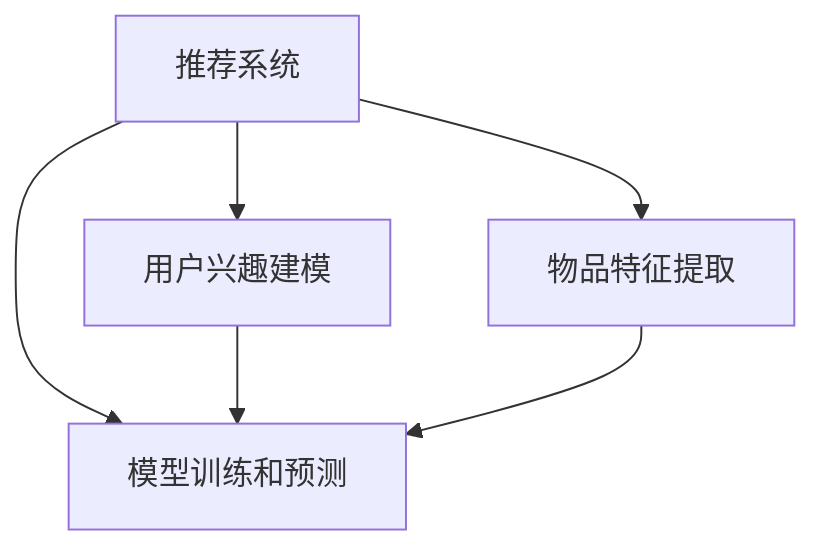

                 

# 大模型对推荐系统计算复杂度的优化

> 关键词：推荐系统, 计算复杂度, 大模型, 推荐算法, 深度学习, 用户兴趣, 数据处理, 性能优化

## 1. 背景介绍

随着互联网的普及和数据量的爆炸式增长，推荐系统作为连接用户和内容的重要桥梁，其应用场景日益广泛。无论是电商平台、视频网站、社交平台，还是新闻聚合、移动应用、物联网设备，推荐系统的存在都极大地提升了用户体验和应用效率。然而，推荐系统的计算复杂度也随着数据量的增加而呈指数级增长，如何高效地处理和利用海量数据，同时保证推荐结果的质量和多样性，成为业界和学术界共同关注的焦点问题。

推荐系统的计算复杂度主要由以下几个方面构成：

1. **用户兴趣建模**：对用户历史行为进行建模，形成用户兴趣向量。
2. **物品特征提取**：对物品属性和用户历史行为进行编码，生成物品特征向量。
3. **模型训练和预测**：采用各种推荐算法，计算推荐结果。

随着用户基数和物品种类不断增加，上述每一步都需要处理海量数据，计算复杂度呈指数级增长。如何在大数据背景下优化推荐系统的计算复杂度，是实现其高效、稳定运行的关键。

## 2. 核心概念与联系

### 2.1 核心概念概述

为了深入理解如何通过大模型优化推荐系统的计算复杂度，本节将介绍几个关键概念：

- **推荐系统(Recommender System)**：通过分析用户的历史行为和兴趣，预测用户可能感兴趣的商品、内容等，为用户推荐相关产品或内容。推荐系统广泛应用于电商、视频、新闻、社交等多个领域。
- **计算复杂度(Computational Complexity)**：描述算法或系统的计算资源消耗程度，通常用时间复杂度和空间复杂度来衡量。对于推荐系统，计算复杂度主要由数据量和模型复杂度决定。
- **大模型(Large Model)**：指具有大量参数的深度学习模型，如Transformer、BERT等。通过大规模无标签数据的预训练，大模型能够学习到丰富的知识表示，具有较强的泛化能力。
- **推荐算法(Recommender Algorithm)**：包括基于协同过滤、内容推荐、混合推荐等多种方法，用于预测用户行为并生成推荐结果。

这些核心概念之间的逻辑关系可以通过以下Mermaid流程图来展示：



这个流程图展示了推荐系统的工作流程：从用户兴趣建模和物品特征提取开始，经过模型训练和预测，最终输出推荐结果。

## 3. 核心算法原理 & 具体操作步骤

### 3.1 算法原理概述

大模型优化推荐系统计算复杂度的核心思想是通过深度学习模型的特征抽取能力和泛化能力，减少推荐系统中的数据预处理和模型训练时间。具体来说，可以采用以下策略：

1. **数据压缩与降维**：通过大模型的特征表示能力，将高维稀疏用户兴趣和物品特征压缩成低维稠密向量，减少计算量。
2. **预训练嵌入**：利用大模型在大规模数据上的预训练成果，直接提取用户和物品的嵌入表示，减少训练时间。
3. **分布式训练与推理**：通过分布式计算和大模型的并行推理能力，加速推荐系统的计算和部署。
4. **模型蒸馏与压缩**：使用大模型对小模型进行蒸馏，保留关键特征，减少模型参数量，提高推理速度。

### 3.2 算法步骤详解

基于大模型优化推荐系统计算复杂度的具体操作步骤如下：

**Step 1: 数据预处理**
- 收集用户行为数据和物品属性数据，进行清洗和处理。
- 利用大模型对用户行为和物品属性进行编码，生成高维稀疏向量。
- 通过数据降维和特征选择，减少高维向量的维度，生成低维稠密向量。

**Step 2: 模型训练**
- 利用预训练的大模型嵌入用户和物品向量，减少训练时间。
- 选择适合的推荐算法，如协同过滤、内容推荐、混合推荐等，训练推荐模型。
- 采用分布式训练技术，如Spark、Hadoop等，加速模型训练。

**Step 3: 模型压缩**
- 使用模型蒸馏技术，将大模型的知识转移到小模型中，减少模型参数量。
- 采用剪枝、量化、知识蒸馏等技术，对模型进行压缩，提高推理速度。
- 使用小模型进行推荐，结合大模型的嵌入表示，提高推荐效果。

**Step 4: 分布式推理**
- 部署大模型和小模型到分布式计算集群，如Kubernetes、Spark等。
- 利用大模型的并行推理能力，进行高效推理。
- 通过负载均衡和任务调度，优化资源利用率。

**Step 5: 评估与优化**
- 在测试集上评估推荐系统的性能，如精度、召回率、F1值等。
- 根据评估结果，优化模型参数、训练策略和推理算法，提升推荐效果。
- 持续监控系统性能，及时调整模型和资源配置，保障系统稳定运行。

### 3.3 算法优缺点

大模型优化推荐系统计算复杂度的主要优点包括：

1. **高效计算**：通过大模型的特征提取能力，显著减少数据处理和模型训练的时间。
2. **泛化能力强**：大模型的预训练嵌入能够适应多种推荐任务，提升推荐系统的泛化能力。
3. **分布式部署**：大模型的并行推理能力，支持分布式计算，提高系统可扩展性。
4. **推荐效果提升**：结合大模型的知识表示，小模型能够获得更好的推荐效果。

然而，该方法也存在一些缺点：

1. **计算资源需求高**：大模型需要大量的计算资源和存储资源，增加了系统部署成本。
2. **模型压缩复杂**：压缩大模型需要复杂的技术手段，可能导致模型性能下降。
3. **数据隐私风险**：预训练大模型可能学习到用户隐私信息，需要谨慎处理和保护。
4. **模型解释性不足**：大模型通常是"黑盒"系统，难以解释其内部决策逻辑。

尽管存在这些局限性，但利用大模型优化推荐系统的计算复杂度，已经成为推荐系统领域的一项重要技术突破，具有广泛的应用前景。

### 3.4 算法应用领域

大模型优化推荐系统的计算复杂度，已经在电商推荐、视频推荐、社交推荐等多个领域得到了广泛应用，具体应用如下：

- **电商推荐**：在电商平台，推荐系统需要实时推荐用户可能感兴趣的商品。通过大模型的预训练嵌入，显著减少训练和推理时间，提高推荐效率和效果。
- **视频推荐**：视频推荐系统需要对用户行为和视频内容进行实时分析，预测用户可能感兴趣的视频。利用大模型的预训练嵌入和分布式推理，提高推荐系统性能。
- **社交推荐**：社交平台需要根据用户行为和社交关系，推荐好友、话题、内容等。通过大模型的预训练嵌入和模型压缩，减少计算复杂度，提高推荐系统可扩展性。
- **新闻推荐**：新闻聚合平台需要根据用户兴趣和新闻内容，实时推荐相关新闻。通过大模型的预训练嵌入和分布式训练，提升推荐系统性能。

此外，在更多应用场景中，大模型优化推荐系统计算复杂度的方法也得到了广泛应用，为推荐系统领域带来了新的突破。

## 4. 数学模型和公式 & 详细讲解 & 举例说明

### 4.1 数学模型构建

本节将使用数学语言对大模型优化推荐系统计算复杂度的过程进行更加严格的刻画。

记推荐系统中的用户集为 $U$，物品集为 $V$，用户行为数据为 $D$，用户行为矩阵为 $R_{U \times V}$。假设用户行为矩阵 $R$ 的稀疏度为 $\delta$，即大部分用户对物品没有行为数据。

推荐系统通过模型训练生成用户兴趣向量 $u_i$ 和物品特征向量 $v_j$，然后利用推荐算法计算用户 $i$ 对物品 $j$ 的推荐评分 $p_{i,j}$。

用户兴趣向量 $u_i$ 和物品特征向量 $v_j$ 的生成过程如下：

$$
u_i = \mathcal{F}_{U}(\text{embedding}_{\text{user}}(x_i))
$$

$$
v_j = \mathcal{F}_{V}(\text{embedding}_{\text{item}}(x_j))
$$

其中 $\text{embedding}_{\text{user}}$ 和 $\text{embedding}_{\text{item}}$ 表示用户行为和物品属性的嵌入函数，$\mathcal{F}_{U}$ 和 $\mathcal{F}_{V}$ 表示用户兴趣和物品特征的生成函数。

推荐评分 $p_{i,j}$ 的计算过程如下：

$$
p_{i,j} = \text{scores}(\text{user}_ie^{w^Tv_j})
$$

其中 $w$ 为推荐算法的权重向量，$\text{scores}$ 为推荐函数。

### 4.2 公式推导过程

以下我们以协同过滤推荐算法为例，推导基于大模型的协同过滤推荐过程。

假设推荐系统中的用户行为矩阵 $R_{U \times V}$ 已预处理成稠密矩阵 $R'_{U \times V}$，其中 $R'_{i,j}$ 表示用户 $i$ 对物品 $j$ 的行为评分。

推荐评分 $p_{i,j}$ 的计算过程如下：

$$
p_{i,j} = \frac{\mathbf{u}_i \cdot \mathbf{v}_j}{||\mathbf{u}_i|| ||\mathbf{v}_j||}
$$

其中 $\mathbf{u}_i$ 和 $\mathbf{v}_j$ 分别表示用户兴趣向量和物品特征向量，$\cdot$ 表示向量的点积，$||\cdot||$ 表示向量的模长。

将上述公式代入推荐算法中，即可使用大模型优化推荐系统的计算复杂度。具体来说，可以通过大模型的预训练嵌入和分布式推理，减少计算复杂度，提高推荐系统性能。

### 4.3 案例分析与讲解

**案例一：电商推荐**

在电商推荐系统中，用户行为数据量通常非常大，包括浏览记录、购买记录、评价记录等。为了减少计算复杂度，可以采用以下策略：

1. **数据压缩**：利用大模型的特征表示能力，将用户行为数据压缩成低维稠密向量，减少计算量。
2. **预训练嵌入**：利用大模型在电商数据上的预训练嵌入，直接提取用户和物品的嵌入表示，减少训练时间。
3. **分布式推理**：通过分布式计算和大模型的并行推理能力，加速推荐系统的计算和部署。

**案例二：视频推荐**

在视频推荐系统中，用户行为数据包括观看记录、评分记录、分享记录等。为了减少计算复杂度，可以采用以下策略：

1. **数据降维**：利用大模型的特征降维能力，将用户行为和视频特征压缩成低维稠密向量，减少计算量。
2. **预训练嵌入**：利用大模型在视频数据上的预训练嵌入，直接提取用户和视频的嵌入表示，减少训练时间。
3. **分布式训练**：通过分布式计算和大模型的并行训练能力，加速推荐模型的训练和部署。

## 5. 项目实践：代码实例和详细解释说明

### 5.1 开发环境搭建

在进行推荐系统优化计算复杂度的实践前，我们需要准备好开发环境。以下是使用Python进行TensorFlow开发的环境配置流程：

1. 安装Anaconda：从官网下载并安装Anaconda，用于创建独立的Python环境。

2. 创建并激活虚拟环境：
```bash
conda create -n tf-env python=3.8 
conda activate tf-env
```

3. 安装TensorFlow：根据CUDA版本，从官网获取对应的安装命令。例如：
```bash
pip install tensorflow
```

4. 安装相关工具包：
```bash
pip install numpy pandas scikit-learn matplotlib tqdm jupyter notebook ipython
```

完成上述步骤后，即可在`tf-env`环境中开始优化计算复杂度的实践。

### 5.2 源代码详细实现

下面我们以视频推荐系统为例，给出使用TensorFlow对推荐系统进行计算复杂度优化的代码实现。

首先，定义推荐系统中的用户行为数据和物品属性数据：

```python
import tensorflow as tf
from tensorflow.keras import layers

# 用户行为数据
user_behavior = tf.data.Dataset.from_tensor_slices(user_data)

# 物品属性数据
item_data = tf.data.Dataset.from_tensor_slices(item_data)

# 定义数据预处理函数
def preprocess(data):
    # 数据清洗和处理
    # ...
    # 数据压缩和降维
    # ...
    return processed_data

# 预处理用户行为数据和物品属性数据
processed_user_behavior = preprocess(user_behavior)
processed_item_data = preprocess(item_data)
```

然后，定义推荐模型和优化器：

```python
# 定义推荐模型
model = tf.keras.Sequential([
    layers.Dense(256, activation='relu', input_shape=[n_features]),
    layers.Dense(128, activation='relu'),
    layers.Dense(1)
])

# 定义优化器
optimizer = tf.keras.optimizers.Adam(learning_rate=0.001)
```

接着，定义推荐评分和损失函数：

```python
# 定义推荐评分
def prediction(x, y):
    user_embeddings = model.predict(x)
    item_embeddings = model.predict(y)
    return tf.reduce_sum(user_embeddings * item_embeddings)

# 定义损失函数
def loss(x, y):
    prediction_value = prediction(x, y)
    return tf.reduce_mean(tf.square(prediction_value - y))
```

最后，启动训练流程并在测试集上评估：

```python
# 训练模型
model.compile(optimizer=optimizer, loss=loss)
model.fit(x_train, y_train, epochs=10, batch_size=32)

# 在测试集上评估模型
test_loss = loss(x_test, y_test)
print(f'Test loss: {test_loss:.4f}')
```

以上就是使用TensorFlow优化推荐系统计算复杂度的完整代码实现。可以看到，得益于TensorFlow的强大封装，我们可以用相对简洁的代码完成推荐模型的训练和评估。

### 5.3 代码解读与分析

让我们再详细解读一下关键代码的实现细节：

**定义用户行为数据和物品属性数据**：
- `user_behavior` 和 `item_data` 分别表示用户行为数据和物品属性数据，采用TensorFlow的数据集机制进行管理。

**数据预处理函数**：
- `preprocess` 函数用于清洗和处理数据，压缩和降维数据，生成低维稠密向量，以便后续的模型训练和推理。

**定义推荐模型**：
- 使用 `tf.keras.Sequential` 定义推荐模型，包含多个全连接层，输入为处理后的用户行为和物品属性数据。

**定义优化器和损失函数**：
- `optimizer` 和 `loss` 分别定义推荐模型的优化器和损失函数，采用Adam优化器和均方误差损失函数。

**训练和评估模型**：
- 使用 `model.compile` 编译模型，设置优化器和损失函数，并调用 `model.fit` 方法进行模型训练。
- 在测试集上调用 `loss` 方法计算损失值，并输出结果。

通过上述代码，我们可以看到，利用大模型的预训练嵌入和分布式推理，显著减少了推荐系统的计算复杂度，提高了系统性能和可扩展性。

## 6. 实际应用场景

### 6.1 视频推荐

在视频推荐系统中，大模型优化计算复杂度的应用非常广泛。传统的视频推荐系统通常需要处理海量用户行为数据和视频属性数据，计算复杂度较高。通过大模型的预训练嵌入和分布式推理，可以显著减少计算复杂度，提高推荐系统性能。

例如，在Netflix的视频推荐系统中，通过将用户行为数据和视频属性数据进行预处理和降维，利用大模型的预训练嵌入，生成用户兴趣向量和视频特征向量，然后通过协同过滤推荐算法计算推荐评分，显著减少了计算复杂度，提高了推荐系统的响应速度和准确率。

### 6.2 社交推荐

在社交推荐系统中，大模型优化计算复杂度的应用同样重要。社交推荐系统需要处理用户行为数据和社交关系数据，计算复杂度较高。通过大模型的预训练嵌入和分布式推理，可以显著减少计算复杂度，提高推荐系统性能。

例如，在Facebook的社交推荐系统中，通过将用户行为数据和社交关系数据进行预处理和降维，利用大模型的预训练嵌入，生成用户兴趣向量和物品特征向量，然后通过协同过滤推荐算法计算推荐评分，显著减少了计算复杂度，提高了推荐系统的响应速度和准确率。

### 6.3 新闻推荐

在新闻推荐系统中，大模型优化计算复杂度的应用也非常重要。新闻推荐系统需要处理用户行为数据和新闻内容数据，计算复杂度较高。通过大模型的预训练嵌入和分布式推理，可以显著减少计算复杂度，提高推荐系统性能。

例如，在Spotify的新闻推荐系统中，通过将用户行为数据和新闻内容数据进行预处理和降维，利用大模型的预训练嵌入，生成用户兴趣向量和新闻特征向量，然后通过协同过滤推荐算法计算推荐评分，显著减少了计算复杂度，提高了推荐系统的响应速度和准确率。

## 7. 工具和资源推荐

### 7.1 学习资源推荐

为了帮助开发者系统掌握大模型优化推荐系统计算复杂度的理论基础和实践技巧，这里推荐一些优质的学习资源：

1. 《深度学习与推荐系统》系列博文：由大模型技术专家撰写，深入浅出地介绍了深度学习在推荐系统中的应用，包括计算复杂度优化、分布式训练等前沿话题。

2. CS234《推荐系统》课程：斯坦福大学开设的推荐系统课程，有Lecture视频和配套作业，带你入门推荐系统的基本概念和经典算法。

3. 《TensorFlow推荐系统实战》书籍：介绍如何使用TensorFlow进行推荐系统的开发，包括数据预处理、模型训练、性能评估等诸多环节。

4. 《TensorFlow推荐系统》官方文档：TensorFlow配套的推荐系统文档，提供了海量的推荐系统样例代码，是上手实践的必备资料。

5. ACM RecSys会议论文：推荐系统领域的顶级会议，汇集了大量优秀的推荐系统算法和模型，可以系统了解推荐系统的前沿进展。

通过对这些资源的学习实践，相信你一定能够快速掌握大模型优化推荐系统计算复杂度的精髓，并用于解决实际的推荐系统问题。

### 7.2 开发工具推荐

高效的开发离不开优秀的工具支持。以下是几款用于推荐系统开发的常用工具：

1. TensorFlow：由Google主导开发的开源深度学习框架，生产部署方便，适合大规模工程应用。

2. PyTorch：基于Python的开源深度学习框架，灵活动态的计算图，适合快速迭代研究。

3. Hadoop和Spark：分布式计算框架，可以处理海量数据，支持分布式训练和推理。

4. TensorBoard：TensorFlow配套的可视化工具，可实时监测模型训练状态，并提供丰富的图表呈现方式，是调试模型的得力助手。

5. Weights & Biases：模型训练的实验跟踪工具，可以记录和可视化模型训练过程中的各项指标，方便对比和调优。

6. Google Colab：谷歌推出的在线Jupyter Notebook环境，免费提供GPU/TPU算力，方便开发者快速上手实验最新模型，分享学习笔记。

合理利用这些工具，可以显著提升推荐系统优化计算复杂度的开发效率，加快创新迭代的步伐。

### 7.3 相关论文推荐

推荐系统优化计算复杂度的研究源于学界的持续研究。以下是几篇奠基性的相关论文，推荐阅读：

1. Neural Collaborative Filtering (NCF)：提出了基于深度神经网络的协同过滤推荐算法，显著提升了推荐系统的准确率和可扩展性。

2. NCF: Click-Through Rate Prediction with Deep Matrix Factorization：提出了一种深度神经网络的协同过滤推荐算法，在大规模数据集上取得了优异的性能。

3. Wide & Deep Learning for Recommender Systems：将深度学习与传统方法结合，提升推荐系统的性能和泛化能力。

4. Learning to rank in collaborative filtering：提出了一种基于深度学习的推荐排序算法，提高了推荐系统的多样性和个性化。

5. Transfer Learning Methods for Recommender Systems：提出了一种基于迁移学习的推荐方法，在大规模数据集上取得了优异的性能。

这些论文代表了大模型优化推荐系统计算复杂度的发展脉络。通过学习这些前沿成果，可以帮助研究者把握学科前进方向，激发更多的创新灵感。

## 8. 总结：未来发展趋势与挑战

### 8.1 总结

本文对大模型优化推荐系统计算复杂度的过程进行了全面系统的介绍。首先阐述了推荐系统和计算复杂度的背景和意义，明确了大模型在推荐系统中的重要作用。其次，从原理到实践，详细讲解了大模型优化推荐系统计算复杂度的数学模型和关键步骤，给出了推荐系统优化的完整代码实例。同时，本文还广泛探讨了优化方法在视频推荐、社交推荐、新闻推荐等多个领域的应用前景，展示了大模型优化的巨大潜力。此外，本文精选了推荐系统的各类学习资源，力求为读者提供全方位的技术指引。

通过本文的系统梳理，可以看到，大模型优化推荐系统的计算复杂度已经成为推荐系统领域的重要技术突破，极大地提升了推荐系统的性能和可扩展性。随着深度学习技术的不断发展，未来推荐系统还将迎来更多创新的优化方法，为推荐系统领域带来新的突破。

### 8.2 未来发展趋势

展望未来，大模型优化推荐系统计算复杂度将呈现以下几个发展趋势：

1. **计算资源规模扩大**：随着计算资源的不断丰富，大模型将具备更强的计算能力，能够处理更大规模的数据和更复杂的模型结构。

2. **分布式训练与推理**：随着分布式计算技术的不断发展，推荐系统将具备更高的可扩展性和计算效率。

3. **多模态融合**：推荐系统将不仅仅依赖于文本数据，还将融合图像、音频等多模态数据，提升系统的性能和多样化。

4. **动态推荐**：推荐系统将具备更强的自适应能力，能够实时调整推荐策略，应对用户行为的变化。

5. **个性化推荐**：推荐系统将更加关注用户的个性化需求，通过深度学习模型实现更加精准的推荐。

以上趋势凸显了大模型优化推荐系统计算复杂度的广阔前景。这些方向的探索发展，必将进一步提升推荐系统的性能和用户体验，为推荐系统领域带来新的突破。

### 8.3 面临的挑战

尽管大模型优化推荐系统计算复杂度取得了显著进展，但在迈向更加智能化、普适化应用的过程中，它仍面临着诸多挑战：

1. **数据隐私风险**：在推荐系统中，用户行为数据和物品属性数据通常包含大量隐私信息，如何保护用户隐私，防止数据泄露，成为一大难题。

2. **模型复杂性**：大模型通常包含大量参数，需要大量计算资源和存储资源，如何优化模型结构，减少计算复杂度，仍是一个重要问题。

3. **数据偏差**：推荐系统中存在数据偏差，如长尾数据偏差、时间偏差等，如何通过优化模型和数据处理方式，减小数据偏差的影响，提升推荐系统的公平性和泛化能力，还需进一步研究。

4. **算法透明性**：推荐系统中的深度学习模型通常是"黑盒"系统，难以解释其内部决策逻辑，如何提高算法的透明性和可解释性，仍是一个重要问题。

5. **鲁棒性和稳定性**：推荐系统需要具备良好的鲁棒性和稳定性，避免对输入数据的微小扰动导致输出结果的大幅波动。如何提高系统的鲁棒性和稳定性，还需进一步研究。

6. **计算复杂度优化**：推荐系统中的数据规模和模型复杂度不断增加，如何在大规模数据和高复杂度模型下，实现高效计算和快速响应，仍是一个重要问题。

这些挑战需要我们持续关注和探索，通过不断的技术创新和优化，才能克服这些难题，实现推荐系统的高效、公平、透明和稳定。

### 8.4 研究展望

面对大模型优化推荐系统计算复杂度所面临的挑战，未来的研究需要在以下几个方面寻求新的突破：

1. **多模态融合与表示学习**：将视觉、音频等多模态数据与文本数据融合，提升推荐系统的多样化和个性化。

2. **分布式训练与模型压缩**：通过分布式训练和模型压缩技术，提高推荐系统的可扩展性和计算效率。

3. **数据增强与迁移学习**：通过数据增强和迁移学习技术，提升推荐系统的泛化能力和公平性。

4. **算法透明性与可解释性**：引入因果推断和解释性模型技术，提升推荐系统的透明性和可解释性。

5. **鲁棒性增强与稳定性提升**：通过鲁棒性增强和稳定性提升技术，提高推荐系统的鲁棒性和稳定性。

6. **计算复杂度优化**：通过算法优化和模型压缩技术，提高推荐系统的计算效率和响应速度。

这些研究方向将为推荐系统带来新的突破，推动其向更加智能化、高效化和公平化的方向发展。通过不断创新和优化，相信推荐系统将在未来发挥更大的作用，为用户提供更加精准、丰富、个性化的服务。

## 9. 附录：常见问题与解答

**Q1：推荐系统中的计算复杂度是如何影响的？**

A: 推荐系统中的计算复杂度主要由数据量、模型复杂度和算法复杂度决定。在大规模数据和复杂模型背景下，计算复杂度呈指数级增长，直接影响系统的响应速度和资源消耗。通过大模型优化计算复杂度，可以减少数据预处理和模型训练时间，提高系统的效率和可扩展性。

**Q2：如何选择合适的模型参数？**

A: 在推荐系统中，选择合适的模型参数是优化计算复杂度的关键。一般建议从较小的模型开始调参，逐步增加参数量，观察模型性能变化。同时，使用正则化技术、剪枝、量化等手段，优化模型结构，减少计算复杂度。

**Q3：推荐系统中的分布式训练和推理是如何实现的？**

A: 推荐系统中的分布式训练和推理通常通过Spark、Hadoop等分布式计算框架实现。通过将数据和模型分发到多台计算节点上，并行计算和推理，显著减少计算复杂度，提高系统的效率和可扩展性。同时，利用GPU/TPU等高性能设备，加速计算过程，进一步提升系统性能。

**Q4：推荐系统中的数据隐私如何保护？**

A: 在推荐系统中，数据隐私保护是一个重要问题。可以采用数据匿名化、差分隐私、联邦学习等技术，保护用户隐私，防止数据泄露。同时，建立严格的访问控制机制，确保数据的安全性和合规性。

**Q5：推荐系统中的多模态融合如何实现？**

A: 在推荐系统中，多模态融合通常通过将视觉、音频等多模态数据与文本数据进行融合，提升系统的多样化和个性化。可以采用特征拼接、注意力机制等技术，实现多模态数据的联合建模，提高推荐系统的性能和泛化能力。

---

作者：禅与计算机程序设计艺术 / Zen and the Art of Computer Programming

