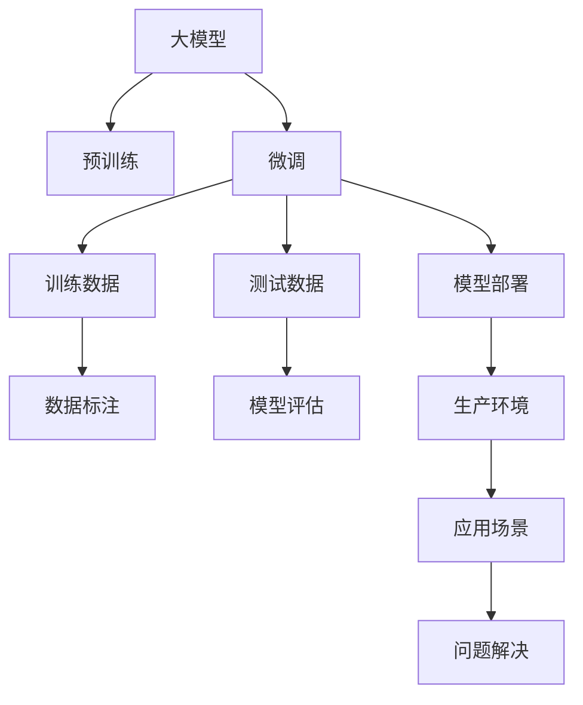

                 

# 大模型应用的关键：价格其次，AI解决实际问题的能力才是重点

> 关键词：大模型应用, 人工智能, AI解决实际问题, 软件架构, 计算机图灵奖

## 1. 背景介绍

### 1.1 问题由来

近年来，人工智能（AI）技术迅猛发展，各类大模型如雨后春笋般涌现。这些大模型以其强大的学习能力，在各个领域中展示出了巨大的应用潜力。然而，在实际应用过程中，价格的昂贵和大模型的落地困难，使得很多企业和开发者望而却步。那么，价格和AI解决实际问题的能力，哪一个更为关键？本节将探讨这一问题。

### 1.2 问题核心关键点

大模型应用的核心关键点在于其解决实际问题的能力。价格是次要的，主要原因如下：

1. **成本可以分摊**：对于一些大规模企业，大模型的价格并非高不可攀。通过在多个业务线或者多个部门之间分摊成本，可以显著降低每个部门的成本。

2. **回报高**：大模型在提高效率、降低人力成本、提升决策准确性等方面的回报远远高于其价格。例如，通过自然语言处理（NLP）技术，企业可以大幅提升客服系统的响应速度和准确性，减少客户流失率，从而带来可观的经济效益。

3. **技术壁垒**：大模型的技术壁垒较高，需要专业的技术团队和大量的研发投入。价格对于这些技术团队而言，是可以通过分摊和资源共享来平衡的。

4. **创新驱动**：AI技术的持续创新，带来了更多更高效、更精确的应用方案。例如，在医疗领域，基于大模型的疾病诊断系统可以大幅提升诊断准确率，减少误诊和漏诊。

综上所述，虽然价格是我们需要考虑的因素，但AI解决实际问题的能力才是真正影响应用的关键因素。

## 2. 核心概念与联系

### 2.1 核心概念概述

在进行大模型应用的讨论之前，我们先来概述几个核心概念：

- **大模型（Large Model）**：指具有巨大参数量的深度学习模型，如BERT、GPT等。通过在大规模无标签数据上进行预训练，大模型可以学习到丰富的语言知识。

- **人工智能（AI）**：指通过算法和计算让机器具备类似人类的智能，实现自主决策、自动执行等功能。

- **解决实际问题（Practical Problem Solving）**：指利用AI技术解决企业或者个人在实际工作或者生活中遇到的具体问题。例如，通过机器学习算法优化生产流程，提高生产效率；通过自然语言处理技术，提升客户服务体验。

### 2.2 核心概念原理和架构的 Mermaid 流程图



这个流程图展示了从大模型训练到实际应用的全过程。大模型通过在大规模数据上进行预训练，学习通用的语言知识。接着，通过微调来适配具体的应用场景，经过训练数据集和测试数据集的反复迭代，最后部署到生产环境中解决实际问题。

## 3. 核心算法原理 & 具体操作步骤

### 3.1 算法原理概述

大模型的核心算法原理是基于深度学习的机器学习技术。其核心在于通过大量的数据和强大的计算能力，学习到丰富的特征表示，从而解决各种实际问题。

### 3.2 算法步骤详解

1. **数据准备**：收集并标注相关领域的样本数据，用于模型的训练和验证。

2. **模型训练**：使用深度学习框架（如TensorFlow、PyTorch等）训练大模型。训练过程中，模型不断调整参数，以最小化损失函数。

3. **微调**：在大模型的基础上，针对具体的应用场景进行微调，以提高模型的性能。微调过程中，通常使用小规模标注数据。

4. **模型评估**：使用测试数据集对微调后的模型进行评估，计算各种性能指标，如准确率、召回率、F1值等。

5. **模型部署**：将评估后的模型部署到实际的生产环境中，实现自动化决策和执行。

### 3.3 算法优缺点

#### 优点

1. **高效**：大模型具有强大的特征提取和表达能力，能够在短时间内学习到大量数据中的复杂模式。

2. **泛化能力强**：大模型在各种不同的数据集上表现良好，具有较强的泛化能力。

3. **可解释性强**：大模型的决策过程可以借助可解释性技术（如特征可视化、梯度图等）进行解释，使得决策过程更加透明。

4. **可维护性高**：大模型结构固定，维护起来相对容易，同时可以通过微调进行参数更新。

#### 缺点

1. **计算资源需求高**：大模型参数量大，计算需求高，需要大量的计算资源。

2. **部署复杂**：大模型部署环境复杂，需要专业的技术团队进行配置和管理。

3. **数据依赖性强**：大模型的性能依赖于数据的质量和数量，数据集不足时，模型性能可能下降。

4. **黑盒模型**：大模型通常是一个黑盒模型，难以理解其内部的决策过程。

### 3.4 算法应用领域

大模型的应用领域非常广泛，涵盖了多个行业和领域：

- **医疗**：通过大模型进行疾病诊断、治疗方案推荐等，提升医疗服务的质量和效率。

- **金融**：利用大模型进行风险评估、信用评分、欺诈检测等，保护金融机构和客户的安全。

- **零售**：通过大模型进行商品推荐、库存管理等，提升客户购物体验和零售企业的运营效率。

- **交通**：利用大模型进行路线规划、自动驾驶等，提升交通系统的运行效率和安全性。

## 4. 数学模型和公式 & 详细讲解 & 举例说明

### 4.1 数学模型构建

在数学上，大模型的构建可以通过多层感知器（MLP）、卷积神经网络（CNN）、循环神经网络（RNN）等模型来实现。其中，Transformer模型是目前最常用的深度学习模型之一。

### 4.2 公式推导过程

以Transformer模型为例，其核心公式为：

$$
y = f(x; \theta)
$$

其中，$y$ 为模型的输出，$x$ 为输入数据，$\theta$ 为模型的参数。Transformer模型使用自注意力机制，可以高效地处理序列数据。

### 4.3 案例分析与讲解

以自然语言处理（NLP）中的文本分类任务为例，我们可以使用BERT模型进行微调。假设我们有一个二分类任务，输入为文本数据，输出为分类标签。具体步骤如下：

1. **数据准备**：收集并标注相关的文本数据。

2. **模型训练**：使用BERT模型进行预训练，得到一个预训练的模型。

3. **微调**：使用小规模标注数据对预训练模型进行微调，得到微调后的模型。

4. **模型评估**：使用测试数据集对微调后的模型进行评估，计算分类准确率。

5. **模型部署**：将微调后的模型部署到实际的应用中，实现文本分类功能。

## 5. 项目实践：代码实例和详细解释说明

### 5.1 开发环境搭建

在进行大模型应用的开发之前，需要先搭建好开发环境。以下是一个简单的Python开发环境搭建流程：

1. **安装Python**：选择并安装Python 3.8及以上版本。

2. **安装深度学习框架**：安装TensorFlow、PyTorch等深度学习框架。

3. **安装大模型**：安装预训练的大模型，如BERT、GPT等。

4. **安装其他依赖包**：安装必要的依赖包，如Numpy、Pandas、Scikit-learn等。

5. **配置环境**：配置好环境变量，方便后续的开发和部署。

### 5.2 源代码详细实现

以下是使用PyTorch对BERT模型进行微调的Python代码实现：

```python
import torch
import torch.nn as nn
import torch.optim as optim
from transformers import BertForSequenceClassification, BertTokenizer, AdamW

# 定义模型和优化器
model = BertForSequenceClassification.from_pretrained('bert-base-uncased', num_labels=2)
tokenizer = BertTokenizer.from_pretrained('bert-base-uncased')
optimizer = AdamW(model.parameters(), lr=2e-5)

# 定义训练函数
def train(model, optimizer, train_loader):
    model.train()
    for batch in train_loader:
        input_ids = batch['input_ids']
        attention_mask = batch['attention_mask']
        labels = batch['labels']
        outputs = model(input_ids, attention_mask=attention_mask, labels=labels)
        loss = outputs.loss
        optimizer.zero_grad()
        loss.backward()
        optimizer.step()

# 定义评估函数
def evaluate(model, test_loader):
    model.eval()
    total, correct = 0, 0
    for batch in test_loader:
        input_ids = batch['input_ids']
        attention_mask = batch['attention_mask']
        labels = batch['labels']
        with torch.no_grad():
            outputs = model(input_ids, attention_mask=attention_mask)
            logits = outputs.logits
            _, preds = torch.max(logits, dim=1)
            total += labels.size(0)
            correct += (preds == labels).sum().item()
    return correct / total

# 训练和评估
train_loader = torch.utils.data.DataLoader(train_dataset, batch_size=16, shuffle=True)
test_loader = torch.utils.data.DataLoader(test_dataset, batch_size=16, shuffle=False)

for epoch in range(10):
    train(model, optimizer, train_loader)
    acc = evaluate(model, test_loader)
    print(f'Epoch {epoch+1}, accuracy: {acc:.2f}')
```

### 5.3 代码解读与分析

以上代码展示了BERT模型在文本分类任务中的微调过程。具体解读如下：

- `BertForSequenceClassification`：定义了用于文本分类的BERT模型。
- `BertTokenizer`：定义了用于分词和编码的BERT分词器。
- `AdamW`：定义了优化器，使用AdamW算法。
- `train`函数：定义了模型的训练过程，包括前向传播、计算损失、反向传播和参数更新。
- `evaluate`函数：定义了模型的评估过程，计算准确率。
- 循环训练和评估模型，直到达到预设的迭代次数或者停止条件。

## 6. 实际应用场景

### 6.1 智能客服系统

智能客服系统通过大模型的自然语言处理能力，能够自动理解用户意图，提供自动化的响应和解决方案。这大大提高了客服系统的效率和客户满意度。例如，使用BERT模型进行微调，可以提升智能客服系统的准确性和覆盖面。

### 6.2 金融舆情监测

金融舆情监测需要实时监测和分析大量的新闻和社交媒体信息，以评估市场情绪和风险。大模型的自然语言处理能力可以自动分析文本，生成舆情报告，帮助金融机构快速决策。

### 6.3 个性化推荐系统

个性化推荐系统通过大模型的自然语言处理能力，可以分析用户的文本评论和反馈，从而生成个性化的推荐结果。这不仅提升了用户体验，还增加了企业的销售额。

### 6.4 未来应用展望

未来，大模型的应用将更加广泛和深入。通过不断的技术创新和应用实践，大模型将在医疗、金融、教育、交通等多个领域发挥更大的作用。同时，随着AI技术的普及，大模型将变得更加易于获取和使用。

## 7. 工具和资源推荐

### 7.1 学习资源推荐

1. **《深度学习》**：Ian Goodfellow、Yoshua Bengio和Aaron Courville合著的深度学习经典教材，涵盖了深度学习的基本理论和实践。

2. **Coursera深度学习课程**：由Andrew Ng教授主讲的深度学习课程，包含视频、讲义和作业，适合初学者入门。

3. **PyTorch官方文档**：PyTorch的官方文档，包含了丰富的示例代码和教程，适合学习PyTorch的使用。

4. **Transformers官方文档**：HuggingFace开发的Transformer库官方文档，包含了丰富的预训练模型和微调样例。

5. **Kaggle竞赛平台**：提供了大量的数据集和竞赛，可以帮助用户快速实践和提升技能。

### 7.2 开发工具推荐

1. **PyTorch**：由Facebook开发的深度学习框架，易于使用，支持动态计算图。

2. **TensorFlow**：由Google开发的深度学习框架，支持静态和动态计算图，适合大规模工程应用。

3. **Jupyter Notebook**：用于编写和运行Python代码的交互式开发环境，支持代码块、注释和图像输出。

4. **TensorBoard**：TensorFlow的可视化工具，可以实时监测模型的训练状态和性能指标。

5. **Weights & Biases**：用于跟踪和分析模型训练的实验平台，适合记录和比较不同模型的性能。

### 7.3 相关论文推荐

1. **《Attention is All You Need》**：提出Transformer模型，开启了NLP领域的预训练大模型时代。

2. **《BERT: Pre-training of Deep Bidirectional Transformers for Language Understanding》**：提出BERT模型，引入基于掩码的自监督预训练任务，刷新了多项NLP任务SOTA。

3. **《Towards More Powerful AI: Addressing AI Bias》**：讨论了AI模型的偏见问题，提出了一些解决思路和建议。

4. **《Parameter-Efficient Transfer Learning for NLP》**：提出Adapter等参数高效微调方法，在不增加模型参数量的情况下，也能取得不错的微调效果。

5. **《A Survey on Deep Sequence Prediction Models》**：综述了深度学习在序列预测任务中的应用，包括自然语言处理、语音识别等。

## 8. 总结：未来发展趋势与挑战

### 8.1 研究成果总结

大模型的应用已经取得了显著的进展，展示了其强大的解决问题的能力。未来，随着技术的发展和应用的推广，大模型的应用将更加广泛和深入。

### 8.2 未来发展趋势

1. **深度强化学习**：深度强化学习与大模型的结合，将带来更加智能和自适应的决策系统。

2. **跨模态学习**：大模型将越来越多地应用于跨模态数据，如图像、语音、文本等，提升信息整合能力。

3. **联邦学习**：通过联邦学习技术，将多个终端设备上的数据分布式训练，保护隐私同时提升模型性能。

4. **实时计算**：大模型将越来越多地应用于实时计算场景，如图像处理、自然语言处理等。

5. **隐私保护**：大模型在数据隐私保护方面将得到更多的关注，通过差分隐私、加密等技术，保护用户隐私。

### 8.3 面临的挑战

尽管大模型的应用前景广阔，但在实际应用过程中仍面临一些挑战：

1. **数据隐私和安全**：大模型的训练和应用过程中，数据隐私和安全问题是一个重要的挑战。

2. **计算资源限制**：大模型的计算资源需求高，需要高性能的计算平台和设备支持。

3. **模型解释性**：大模型的黑盒特性使得其决策过程难以解释和理解。

4. **泛化能力不足**：大模型在特定场景下的泛化能力需要进一步提升。

### 8.4 研究展望

未来的研究需要在以下几个方面寻求新的突破：

1. **隐私保护技术**：开发更加安全的隐私保护技术，保护用户数据隐私。

2. **模型压缩和优化**：通过模型压缩和优化技术，降低计算资源需求，提升模型效率。

3. **可解释性技术**：开发更加可解释的模型和工具，使得模型决策过程更加透明和可理解。

4. **跨模态融合技术**：研究跨模态融合技术，提升大模型在多模态数据上的性能。

5. **实时计算技术**：开发实时计算技术，支持大模型在实时场景中的应用。

## 9. 附录：常见问题与解答

### 问题1：大模型在应用中为什么会过拟合？

**回答**：大模型在训练过程中，由于参数量巨大，容易导致过拟合。解决过拟合的方法包括正则化、数据增强、早停等。

### 问题2：大模型在应用中为什么需要微调？

**回答**：大模型虽然在大规模数据上预训练可以获得良好的初始化，但在特定任务上仍需要进行微调，以适配任务需求，提升模型性能。

### 问题3：大模型在应用中需要注意哪些问题？

**回答**：大模型在应用中需要注意计算资源、数据隐私、模型解释性等问题。

### 问题4：大模型在应用中如何提高效率？

**回答**：可以通过模型压缩、优化算法、分布式训练等技术提高大模型在应用中的效率。

### 问题5：大模型在应用中如何解决过拟合问题？

**回答**：可以通过正则化、数据增强、早停等方法解决大模型在应用中的过拟合问题。

---

作者：禅与计算机程序设计艺术 / Zen and the Art of Computer Programming

