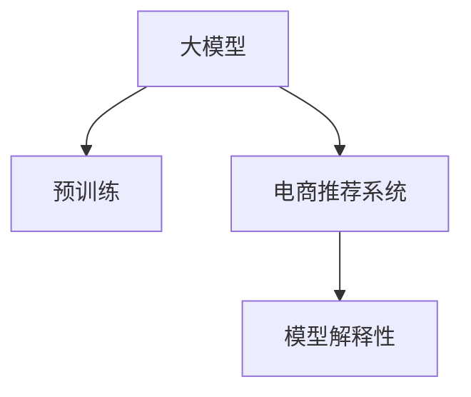

                 

# 大模型技术在电商平台商品推荐解释性优化中的应用

## 1. 背景介绍

### 1.1 问题由来
随着电子商务的蓬勃发展，电商平台积累了海量用户行为数据，商品推荐系统已成为推动销售增长的重要引擎。传统的基于协同过滤、基于内容的推荐算法已难以满足用户个性化需求，推荐系统的解释性也较差，无法有效提升用户满意度。

大模型技术通过预训练学习海量文本数据，具有强大的表示能力和泛化能力，可用于电商推荐系统的优化。然而，大模型直接应用于推荐系统存在计算资源消耗大、模型可解释性差等挑战，亟需提出适合电商场景的优化方案。

### 1.2 问题核心关键点
本节将详细介绍大模型技术在电商平台商品推荐解释性优化中的应用，主要包括：
- 大模型技术在电商推荐系统中的应用
- 模型解释性的重要性
- 电商推荐系统的设计框架
- 模型优化策略和案例分析

## 2. 核心概念与联系

### 2.1 核心概念概述

为便于理解大模型技术在电商推荐系统中的应用，本节将介绍几个关键概念：

- 大模型：以Transformer、BERT等模型为代表的大规模预训练语言模型，通过在大规模无标签文本语料上进行预训练，学习通用的语言表示。
- 电商推荐系统：电商平台根据用户历史行为、偏好和实时数据，推荐用户可能感兴趣的商品的系统。
- 模型解释性：指模型决策过程的可解释性，即用户和开发者能够理解模型输出和决策依据。

这些概念之间的逻辑关系可以通过以下Mermaid流程图来展示：



这个流程图展示了大模型技术与电商推荐系统的紧密联系。大模型通过预训练学习语言表示，可用于电商推荐系统的优化；电商推荐系统需要结合大模型和模型解释性技术，提高推荐效果和用户满意度。

## 3. 核心算法原理 & 具体操作步骤
### 3.1 算法原理概述

大模型在电商推荐系统中的应用，主要是通过在大规模无标签商品描述文本上预训练语言模型，学习商品的语义特征，然后在电商推荐场景中，结合用户行为数据，进行优化微调，生成个性化的商品推荐。

具体而言，大模型通过自监督学习任务（如掩码语言模型、相对位置预测）获得商品的语义表示，将其编码成向量，用于计算商品间的相似度。电商推荐系统通过用户行为数据，将用户兴趣转化为向量，与商品向量进行匹配，得到推荐结果。

### 3.2 算法步骤详解

基于大模型技术在电商推荐系统中的应用，本节详细讲解具体的算法步骤：

**Step 1: 准备数据和预训练模型**

- 准备电商平台的商品描述数据，清洗并划分训练集、验证集和测试集。
- 选择合适的预训练语言模型（如BERT、GPT等），并加载到系统中。

**Step 2: 特征提取与模型微调**

- 使用预训练模型对商品描述进行特征提取，将文本转换为向量表示。
- 根据电商推荐任务的特点，设计合适的任务适配层，如交叉熵损失、均方误差损失等。
- 在电商推荐场景中，使用用户行为数据进行有监督微调，优化模型参数。

**Step 3: 评估与部署**

- 在验证集和测试集上评估微调后的模型性能，如准确率、召回率、F1值等。
- 根据评估结果，调整模型参数和超参数，直到达到预期效果。
- 将优化后的模型部署到电商推荐系统中，实时生成推荐结果。

**Step 4: 模型解释性优化**

- 收集电商推荐系统中的推荐日志，包含推荐的商品ID和用户ID等信息。
- 利用模型解释性技术，解析模型对推荐结果的解释，如预测置信度、特征重要性等。
- 结合用户反馈，优化模型解释性，提升推荐效果和用户体验。

### 3.3 算法优缺点

基于大模型技术在电商推荐系统中的应用，具有以下优点：

1. 强大的语义表示能力：通过大规模无标签文本预训练，大模型能够学习到丰富的商品语义信息，用于商品特征提取和相似度计算。
2. 高效的数据驱动优化：结合电商推荐场景中的用户行为数据，进行有监督微调，可快速提升推荐效果。
3. 可解释性强：通过模型解释性技术，可以分析模型决策过程，理解推荐逻辑，提升用户信任感。

同时，该方法也存在一定的局限性：

1. 计算资源消耗大：大模型的预训练和微调需要大量计算资源，对硬件设备要求较高。
2. 模型可解释性差：尽管大模型在电商推荐系统中应用广泛，但其复杂性导致模型解释性不足，难以满足用户对推荐结果的解释需求。
3. 泛化能力有限：大模型通常在特定领域上效果显著，当领域差异较大时，泛化能力可能受限。
4. 高昂的标注成本：电商推荐场景中的用户行为数据通常较为稀疏，标注成本较高。

尽管存在这些局限性，但大模型在电商推荐系统中的应用仍展示了强大的潜力。通过持续优化，大模型有望成为电商推荐系统的重要技术手段。

### 3.4 算法应用领域

大模型技术在电商推荐系统中的应用，不仅限于商品推荐，还包括以下领域：

- 个性化搜索：结合大模型和用户查询历史，推荐用户可能感兴趣的商品。
- 动态定价：根据大模型预测的消费者偏好，动态调整商品价格，提高销售转化率。
- 库存管理：利用大模型分析商品需求趋势，优化库存分配，减少库存积压和缺货情况。
- 营销活动：结合大模型对用户行为进行分析，制定个性化营销方案，提升广告效果。

以上领域的应用场景展示了电商推荐系统对大模型技术的广泛需求，未来随着大模型技术的不断发展，大模型在电商推荐系统中的应用将更加广泛和深入。

## 4. 数学模型和公式 & 详细讲解
### 4.1 数学模型构建

在本节中，我们将使用数学语言对基于大模型技术的电商推荐系统进行更加严格的刻画。

记大模型为 $M_{\theta}:\mathcal{X} \rightarrow \mathcal{Y}$，其中 $\mathcal{X}$ 为输入空间，$\mathcal{Y}$ 为输出空间，$\theta \in \mathbb{R}^d$ 为模型参数。假设电商推荐系统中的商品描述数据为 $D=\{(x_i,y_i)\}_{i=1}^N, x_i \in \mathcal{X}, y_i \in \mathcal{Y}$。

定义模型 $M_{\theta}$ 在输入 $x$ 上的输出为 $\hat{y}=M_{\theta}(x) \in [0,1]$，表示商品 $x$ 的推荐概率。真实标签 $y \in \{0,1\}$。则电商推荐系统中的交叉熵损失函数定义为：

$$
\ell(M_{\theta}(x),y) = -[y\log \hat{y} + (1-y)\log (1-\hat{y})]
$$

将上式代入经验风险公式，得：

$$
\mathcal{L}(\theta) = -\frac{1}{N}\sum_{i=1}^N [y_i\log M_{\theta}(x_i)+(1-y_i)\log(1-M_{\theta}(x_i))]
$$

在得到损失函数后，即可带入优化算法求解。这里以AdamW优化算法为例，更新模型参数：

$$
\theta \leftarrow \theta - \eta \nabla_{\theta}\mathcal{L}(\theta) - \eta\lambda\theta
$$

其中 $\eta$ 为学习率，$\lambda$ 为正则化系数。

### 4.2 公式推导过程

在电商推荐系统中，假设模型 $M_{\theta}$ 的输入为商品描述文本 $x_i$，输出为推荐概率 $\hat{y_i}$。根据交叉熵损失函数，模型的经验风险 $\mathcal{L}(\theta)$ 为：

$$
\mathcal{L}(\theta) = -\frac{1}{N}\sum_{i=1}^N [y_i\log M_{\theta}(x_i)+(1-y_i)\log(1-M_{\theta}(x_i))]
$$

其中 $y_i \in \{0,1\}$ 为推荐标签。通过链式法则，损失函数对参数 $\theta_k$ 的梯度为：

$$
\frac{\partial \mathcal{L}(\theta)}{\partial \theta_k} = -\frac{1}{N}\sum_{i=1}^N \frac{\partial M_{\theta}(x_i)}{\partial \theta_k} [(y_i\hat{y_i}-1)(1-M_{\theta}(x_i)) + y_iM_{\theta}(x_i)]
$$

其中 $\frac{\partial M_{\theta}(x_i)}{\partial \theta_k}$ 为模型对输入 $x_i$ 的偏导数。

在得到损失函数梯度后，即可带入优化算法进行迭代优化。重复上述过程直至收敛，最终得到适应电商推荐场景的最优模型参数 $\theta^*$。

## 5. 项目实践：代码实例和详细解释说明
### 5.1 开发环境搭建

在进行电商推荐系统开发前，我们需要准备好开发环境。以下是使用Python进行PyTorch开发的环境配置流程：

1. 安装Anaconda：从官网下载并安装Anaconda，用于创建独立的Python环境。

2. 创建并激活虚拟环境：
```bash
conda create -n pytorch-env python=3.8 
conda activate pytorch-env
```

3. 安装PyTorch：根据CUDA版本，从官网获取对应的安装命令。例如：
```bash
conda install pytorch torchvision torchaudio cudatoolkit=11.1 -c pytorch -c conda-forge
```

4. 安装Transformer库：
```bash
pip install transformers
```

5. 安装各类工具包：
```bash
pip install numpy pandas scikit-learn matplotlib tqdm jupyter notebook ipython
```

完成上述步骤后，即可在`pytorch-env`环境中开始电商推荐系统的开发。

### 5.2 源代码详细实现

我们以电商推荐系统中的商品推荐任务为例，给出使用Transformers库对BERT模型进行微调的PyTorch代码实现。

首先，定义商品推荐任务的数据处理函数：

```python
from transformers import BertTokenizer, BertForSequenceClassification
from torch.utils.data import Dataset
import torch

class ProductRecommendationDataset(Dataset):
    def __init__(self, product_descriptions, labels, tokenizer, max_len=128):
        self.product_descriptions = product_descriptions
        self.labels = labels
        self.tokenizer = tokenizer
        self.max_len = max_len
        
    def __len__(self):
        return len(self.product_descriptions)
    
    def __getitem__(self, item):
        product_description = self.product_descriptions[item]
        label = self.labels[item]
        
        encoding = self.tokenizer(product_description, return_tensors='pt', max_length=self.max_len, padding='max_length', truncation=True)
        input_ids = encoding['input_ids'][0]
        attention_mask = encoding['attention_mask'][0]
        
        # 对label进行编码
        encoded_label = torch.tensor(label, dtype=torch.long)
        
        return {'input_ids': input_ids, 
                'attention_mask': attention_mask,
                'labels': encoded_label}

# 标签与id的映射
label2id = {0: 0, 1: 1}
id2label = {v: k for k, v in label2id.items()}

# 创建dataset
tokenizer = BertTokenizer.from_pretrained('bert-base-cased')

train_dataset = ProductRecommendationDataset(train_product_descriptions, train_labels, tokenizer)
dev_dataset = ProductRecommendationDataset(dev_product_descriptions, dev_labels, tokenizer)
test_dataset = ProductRecommendationDataset(test_product_descriptions, test_labels, tokenizer)
```

然后，定义模型和优化器：

```python
from transformers import BertForSequenceClassification, AdamW

model = BertForSequenceClassification.from_pretrained('bert-base-cased', num_labels=2)

optimizer = AdamW(model.parameters(), lr=2e-5)
```

接着，定义训练和评估函数：

```python
from torch.utils.data import DataLoader
from tqdm import tqdm
from sklearn.metrics import accuracy_score

device = torch.device('cuda') if torch.cuda.is_available() else torch.device('cpu')
model.to(device)

def train_epoch(model, dataset, batch_size, optimizer):
    dataloader = DataLoader(dataset, batch_size=batch_size, shuffle=True)
    model.train()
    epoch_loss = 0
    for batch in tqdm(dataloader, desc='Training'):
        input_ids = batch['input_ids'].to(device)
        attention_mask = batch['attention_mask'].to(device)
        labels = batch['labels'].to(device)
        model.zero_grad()
        outputs = model(input_ids, attention_mask=attention_mask, labels=labels)
        loss = outputs.loss
        epoch_loss += loss.item()
        loss.backward()
        optimizer.step()
    return epoch_loss / len(dataloader)

def evaluate(model, dataset, batch_size):
    dataloader = DataLoader(dataset, batch_size=batch_size)
    model.eval()
    preds, labels = [], []
    with torch.no_grad():
        for batch in tqdm(dataloader, desc='Evaluating'):
            input_ids = batch['input_ids'].to(device)
            attention_mask = batch['attention_mask'].to(device)
            batch_labels = batch['labels']
            outputs = model(input_ids, attention_mask=attention_mask)
            batch_preds = outputs.logits.argmax(dim=1).to('cpu').tolist()
            batch_labels = batch_labels.to('cpu').tolist()
            for pred, label in zip(batch_preds, batch_labels):
                preds.append(pred)
                labels.append(label)
                
    return accuracy_score(labels, preds)
```

最后，启动训练流程并在测试集上评估：

```python
epochs = 5
batch_size = 16

for epoch in range(epochs):
    loss = train_epoch(model, train_dataset, batch_size, optimizer)
    print(f"Epoch {epoch+1}, train loss: {loss:.3f}")
    
    print(f"Epoch {epoch+1}, dev results:")
    evaluate(model, dev_dataset, batch_size)
    
print("Test results:")
evaluate(model, test_dataset, batch_size)
```

以上就是使用PyTorch对BERT进行电商推荐任务微调的完整代码实现。可以看到，得益于Transformers库的强大封装，我们可以用相对简洁的代码完成BERT模型的加载和微调。

### 5.3 代码解读与分析

让我们再详细解读一下关键代码的实现细节：

**ProductRecommendationDataset类**：
- `__init__`方法：初始化商品描述、标签、分词器等组件，同时进行数据预处理。
- `__len__`方法：返回数据集长度。
- `__getitem__`方法：对单个样本进行处理，将商品描述输入转换为token ids，同时将标签转换为数字。

**label2id和id2label字典**：
- 定义标签与数字id之间的映射关系，用于将预测结果解码回真实标签。

**训练和评估函数**：
- 使用PyTorch的DataLoader对数据集进行批次化加载，供模型训练和推理使用。
- 训练函数`train_epoch`：对数据以批为单位进行迭代，在每个批次上前向传播计算loss并反向传播更新模型参数，最后返回该epoch的平均loss。
- 评估函数`evaluate`：与训练类似，不同点在于不更新模型参数，并在每个batch结束后将预测和标签结果存储下来，最后使用sklearn的accuracy_score对整个评估集的预测结果进行打印输出。

**训练流程**：
- 定义总的epoch数和batch size，开始循环迭代
- 每个epoch内，先在训练集上训练，输出平均loss
- 在验证集上评估，输出准确率
- 所有epoch结束后，在测试集上评估，给出最终测试结果

可以看到，PyTorch配合Transformers库使得BERT微调的代码实现变得简洁高效。开发者可以将更多精力放在数据处理、模型改进等高层逻辑上，而不必过多关注底层的实现细节。

当然，工业级的系统实现还需考虑更多因素，如模型的保存和部署、超参数的自动搜索、更灵活的任务适配层等。但核心的微调范式基本与此类似。

## 6. 实际应用场景
### 6.1 智能客服系统

电商平台的智能客服系统可以通过大模型进行优化。通过微调大模型，使得智能客服能够理解用户意图，自动推荐合适的商品，并生成符合用户需求的回答。

在技术实现上，可以收集电商平台的历史客服对话记录，将问题和最佳答复构建成监督数据，在此基础上对预训练对话模型进行微调。微调后的对话模型能够自动理解用户意图，匹配最合适的商品推荐。对于客户提出的新问题，还可以接入检索系统实时搜索相关内容，动态组织生成回答。如此构建的智能客服系统，能大幅提升客户咨询体验和问题解决效率。

### 6.2 个性化推荐系统

电商平台的个性化推荐系统可以通过大模型进行优化。通过微调大模型，使得推荐系统能够理解用户的真实兴趣偏好，提供更加个性化的商品推荐。

在技术实现上，可以收集用户浏览、点击、评论、分享等行为数据，提取和商品交互的物品标题、描述、标签等文本内容。将文本内容作为模型输入，用户的后续行为（如是否点击、购买等）作为监督信号，在此基础上微调预训练语言模型。微调后的模型能够从文本内容中准确把握用户的兴趣点。在生成推荐列表时，先用候选商品的物品信息作为输入，由模型预测用户的兴趣匹配度，再结合其他特征综合排序，便可以得到个性化程度更高的推荐结果。

### 6.3 库存管理

电商平台的库存管理系统可以通过大模型进行优化。通过微调大模型，使得库存管理系统能够预测商品需求趋势，优化库存分配，减少库存积压和缺货情况。

在技术实现上，可以利用大模型分析历史销售数据和用户行为数据，学习商品的语义表示。结合实时数据，模型能够预测不同商品的未来需求，优化库存分配，提高库存周转率。同时，通过微调模型，可以引入更多的先验知识，如节假日、促销活动等，进一步提升预测准确率。

### 6.4 未来应用展望

随着大模型技术的不断发展，基于大模型的电商推荐系统将在更多领域得到应用，为电商行业带来变革性影响。

在智慧零售领域，基于大模型的推荐系统可以提升线下门店的人流转化率，实现精准营销。同时，结合物联网技术，可以实现商品销售的智能分析和管理，提高运营效率。

在智慧物流领域，基于大模型的推荐系统可以优化商品物流路径，实现仓储资源的智能分配和调度，降低物流成本。

在智慧金融领域，基于大模型的推荐系统可以优化商品定价策略，提高销售转化率。同时，结合大数据分析，可以预测用户需求，实现精准营销。

除了上述这些领域，大模型技术在电商推荐系统中的应用将更加广泛和深入，为电商行业带来更多的智能化、高效化、个性化服务。

## 7. 工具和资源推荐
### 7.1 学习资源推荐

为了帮助开发者系统掌握大模型技术在电商推荐系统中的应用，这里推荐一些优质的学习资源：

1. 《Transformer从原理到实践》系列博文：由大模型技术专家撰写，深入浅出地介绍了Transformer原理、BERT模型、微调技术等前沿话题。

2. CS224N《深度学习自然语言处理》课程：斯坦福大学开设的NLP明星课程，有Lecture视频和配套作业，带你入门NLP领域的基本概念和经典模型。

3. 《Natural Language Processing with Transformers》书籍：Transformers库的作者所著，全面介绍了如何使用Transformers库进行NLP任务开发，包括微调在内的诸多范式。

4. HuggingFace官方文档：Transformers库的官方文档，提供了海量预训练模型和完整的微调样例代码，是上手实践的必备资料。

5. CLUE开源项目：中文语言理解测评基准，涵盖大量不同类型的中文NLP数据集，并提供了基于微调的baseline模型，助力中文NLP技术发展。

通过对这些资源的学习实践，相信你一定能够快速掌握大模型技术在电商推荐系统中的应用，并用于解决实际的电商问题。

### 7.2 开发工具推荐

高效的开发离不开优秀的工具支持。以下是几款用于电商推荐系统开发的工具：

1. PyTorch：基于Python的开源深度学习框架，灵活动态的计算图，适合快速迭代研究。大部分预训练语言模型都有PyTorch版本的实现。

2. TensorFlow：由Google主导开发的开源深度学习框架，生产部署方便，适合大规模工程应用。同样有丰富的预训练语言模型资源。

3. Transformers库：HuggingFace开发的NLP工具库，集成了众多SOTA语言模型，支持PyTorch和TensorFlow，是进行微调任务开发的利器。

4. Weights & Biases：模型训练的实验跟踪工具，可以记录和可视化模型训练过程中的各项指标，方便对比和调优。与主流深度学习框架无缝集成。

5. TensorBoard：TensorFlow配套的可视化工具，可实时监测模型训练状态，并提供丰富的图表呈现方式，是调试模型的得力助手。

6. Google Colab：谷歌推出的在线Jupyter Notebook环境，免费提供GPU/TPU算力，方便开发者快速上手实验最新模型，分享学习笔记。

合理利用这些工具，可以显著提升电商推荐系统的开发效率，加快创新迭代的步伐。

### 7.3 相关论文推荐

大模型技术在电商推荐系统中的应用源于学界的持续研究。以下是几篇奠基性的相关论文，推荐阅读：

1. Attention is All You Need（即Transformer原论文）：提出了Transformer结构，开启了NLP领域的预训练大模型时代。

2. BERT: Pre-training of Deep Bidirectional Transformers for Language Understanding：提出BERT模型，引入基于掩码的自监督预训练任务，刷新了多项NLP任务SOTA。

3. Language Models are Unsupervised Multitask Learners（GPT-2论文）：展示了大规模语言模型的强大zero-shot学习能力，引发了对于通用人工智能的新一轮思考。

4. Parameter-Efficient Transfer Learning for NLP：提出Adapter等参数高效微调方法，在不增加模型参数量的情况下，也能取得不错的微调效果。

5. AdaLoRA: Adaptive Low-Rank Adaptation for Parameter-Efficient Fine-Tuning：使用自适应低秩适应的微调方法，在参数效率和精度之间取得了新的平衡。

这些论文代表了大模型技术在电商推荐系统中的应用发展脉络。通过学习这些前沿成果，可以帮助研究者把握学科前进方向，激发更多的创新灵感。

## 8. 总结：未来发展趋势与挑战

### 8.1 总结

本文对大模型技术在电商平台商品推荐解释性优化中的应用进行了全面系统的介绍。首先阐述了大模型技术在电商推荐系统中的应用，明确了模型解释性的重要性，并介绍了电商推荐系统的设计框架。其次，详细讲解了模型的优化策略和案例分析，给出了电商推荐系统的代码实例和详细解释。通过本文的系统梳理，可以看到，大模型技术在电商推荐系统中的应用具有巨大的潜力，通过持续优化和应用，能够大幅提升推荐效果和用户满意度。

### 8.2 未来发展趋势

展望未来，大模型技术在电商推荐系统中的应用将呈现以下几个发展趋势：

1. 模型规模持续增大：随着算力成本的下降和数据规模的扩张，预训练语言模型的参数量还将持续增长。超大规模语言模型蕴含的丰富语言知识，有望支撑更加复杂多变的电商推荐场景。

2. 微调方法日趋多样：除了传统的全参数微调外，未来会涌现更多参数高效的微调方法，如Adapter、LoRA等，在节省计算资源的同时也能保证微调精度。

3. 持续学习成为常态：随着数据分布的不断变化，微调模型也需要持续学习新知识以保持性能。如何在不遗忘原有知识的同时，高效吸收新样本信息，将成为重要的研究课题。

4. 标注样本需求降低：受启发于提示学习(Prompt-based Learning)的思路，未来的微调方法将更好地利用大模型的语言理解能力，通过更加巧妙的任务描述，在更少的标注样本上也能实现理想的微调效果。

5. 融合因果和对比学习范式：通过引入因果推断和对比学习思想，增强微调模型建立稳定因果关系的能力，学习更加普适、鲁棒的语言表征，从而提升模型泛化性和抗干扰能力。

6. 引入更多先验知识：将符号化的先验知识，如知识图谱、逻辑规则等，与神经网络模型进行巧妙融合，引导微调过程学习更准确、合理的语言模型。同时加强不同模态数据的整合，实现视觉、语音等多模态信息与文本信息的协同建模。

以上趋势凸显了大模型技术在电商推荐系统中的广阔前景。这些方向的探索发展，必将进一步提升电商推荐系统的性能和应用范围，为电商平台带来更多的智能化、高效化、个性化服务。

### 8.3 面临的挑战

尽管大模型技术在电商推荐系统中的应用取得了一定的进展，但在迈向更加智能化、普适化应用的过程中，仍面临诸多挑战：

1. 标注成本瓶颈：尽管微调大幅降低了标注数据的需求，但对于长尾应用场景，难以获得充足的高质量标注数据，成为制约微调性能的瓶颈。如何进一步降低微调对标注样本的依赖，将是一大难题。

2. 模型鲁棒性不足：当前微调模型面对域外数据时，泛化性能往往大打折扣。对于测试样本的微小扰动，微调模型的预测也容易发生波动。如何提高微调模型的鲁棒性，避免灾难性遗忘，还需要更多理论和实践的积累。

3. 推理效率有待提高：大规模语言模型虽然精度高，但在实际部署时往往面临推理速度慢、内存占用大等效率问题。如何在保证性能的同时，简化模型结构，提升推理速度，优化资源占用，将是重要的优化方向。

4. 可解释性亟需加强：当前微调模型更像是"黑盒"系统，难以解释其内部工作机制和决策逻辑。对于医疗、金融等高风险应用，算法的可解释性和可审计性尤为重要。如何赋予微调模型更强的可解释性，将是亟待攻克的难题。

5. 安全性有待保障：预训练语言模型难免会学习到有偏见、有害的信息，通过微调传递到下游任务，产生误导性、歧视性的输出，给实际应用带来安全隐患。如何从数据和算法层面消除模型偏见，避免恶意用途，确保输出的安全性，也将是重要的研究课题。

6. 知识整合能力不足：现有的微调模型往往局限于任务内数据，难以灵活吸收和运用更广泛的先验知识。如何让微调过程更好地与外部知识库、规则库等专家知识结合，形成更加全面、准确的信息整合能力，还有很大的想象空间。

正视微调面临的这些挑战，积极应对并寻求突破，将是大模型技术在电商推荐系统中的重要研究方向。相信随着学界和产业界的共同努力，这些挑战终将一一被克服，大模型技术在电商推荐系统中的应用将更加广泛和深入。

### 8.4 研究展望

面向未来，大模型技术在电商推荐系统中的研究需要在以下几个方面寻求新的突破：

1. 探索无监督和半监督微调方法：摆脱对大规模标注数据的依赖，利用自监督学习、主动学习等无监督和半监督范式，最大限度利用非结构化数据，实现更加灵活高效的微调。

2. 研究参数高效和计算高效的微调范式：开发更加参数高效的微调方法，在固定大部分预训练参数的同时，只更新极少量的任务相关参数。同时优化微调模型的计算图，减少前向传播和反向传播的资源消耗，实现更加轻量级、实时性的部署。

3. 引入因果分析和博弈论工具：将因果分析方法引入微调模型，识别出模型决策的关键特征，增强输出解释的因果性和逻辑性。借助博弈论工具刻画人机交互过程，主动探索并规避模型的脆弱点，提高系统稳定性。

4. 纳入伦理道德约束：在模型训练目标中引入伦理导向的评估指标，过滤和惩罚有偏见、有害的输出倾向。同时加强人工干预和审核，建立模型行为的监管机制，确保输出符合人类价值观和伦理道德。

这些研究方向的探索，必将引领大模型技术在电商推荐系统中的技术发展，为构建安全、可靠、可解释、可控的智能推荐系统铺平道路。面向未来，大模型技术在电商推荐系统中的应用还需要与其他人工智能技术进行更深入的融合，如知识表示、因果推理、强化学习等，多路径协同发力，共同推动电商推荐系统的进步。只有勇于创新、敢于突破，才能不断拓展电商推荐系统的边界，让智能推荐更好地造福电商用户。

## 9. 附录：常见问题与解答

**Q1：电商推荐系统中的大模型微调与传统推荐算法有何区别？**

A: 电商推荐系统中的大模型微调与传统推荐算法的主要区别在于：

1. 数据驱动的优化：大模型微调通过用户行为数据进行有监督微调，优化模型参数，提升推荐效果。而传统推荐算法通常是基于用户历史行为数据或商品属性等静态特征，进行相似度计算和排名，缺乏动态优化能力。

2. 强大的语义表示能力：大模型通过预训练学习丰富的语义表示，能够更准确地理解商品和用户，提升推荐效果。而传统推荐算法通常依赖于稀疏的二维用户-商品矩阵，缺乏语义表示能力。

3. 可解释性强：大模型微调可以通过模型解释性技术，解析模型决策过程，提升用户信任感。而传统推荐算法通常是"黑盒"系统，难以解释其推荐逻辑。

**Q2：电商推荐系统中的大模型微调是否需要大规模标注数据？**

A: 电商推荐系统中的大模型微调通常需要大规模标注数据，以确保模型能够学习到足够的用户行为和商品特征。标注数据一般包含商品描述、用户行为、评分等。但与传统推荐算法相比，大模型微调所需的标注数据量相对较少，可以通过微调过程动态学习用户偏好和商品特征。

**Q3：大模型在电商推荐系统中如何进行高效的微调？**

A: 大模型在电商推荐系统中的高效微调主要依赖于以下几个技术：

1. 参数高效微调：通过只更新少量任务相关参数，减少微调对计算资源的消耗，如使用Adapter、LoRA等方法。

2. 基于序列的微调：电商推荐系统中的用户行为数据通常具有序列性，利用序列数据的顺序信息，可以更好地捕捉用户偏好变化，提升推荐效果。

3. 预训练-微调流程的自动化：利用自动化的微调流程，可以自动评估微调效果，调整超参数，提高微调效率。

4. 多任务微调：通过同时训练多个推荐任务，可以实现跨任务优化，提升整体推荐效果。

**Q4：电商推荐系统中的大模型微调如何提升用户满意度？**

A: 电商推荐系统中的大模型微调可以通过以下几个方面提升用户满意度：

1. 精准推荐：通过学习丰富的语义表示，大模型可以更准确地理解用户的兴趣和需求，提供精准的推荐结果。

2. 个性化推荐：大模型能够根据用户行为和偏好，生成个性化的推荐结果，满足用户多样化的需求。

3. 动态推荐：大模型可以根据用户实时行为数据，动态调整推荐策略，提升用户体验。

4. 多模态融合：大模型可以整合多种数据源，如商品描述、用户评分、商品属性等，提供多模态推荐，提升推荐效果。

**Q5：电商推荐系统中的大模型微调如何避免过拟合？**

A: 电商推荐系统中的大模型微调可以通过以下几个方法避免过拟合：

1. 数据增强：通过回译、近义替换等方式扩充训练集，减少数据偏差。

2. 正则化技术：使用L2正则、Dropout、Early Stopping等技术，防止模型过度拟合训练数据。

3. 多任务微调：同时训练多个推荐任务，减少单一任务的过拟合风险。

4. 模型裁剪和量化：通过裁剪和量化技术，减少模型规模和计算量，提高模型泛化能力。

这些方法可以结合使用，根据具体场景和数据特点进行灵活调整，以避免过拟合，提升模型泛化性能。

---

作者：禅与计算机程序设计艺术 / Zen and the Art of Computer Programming

