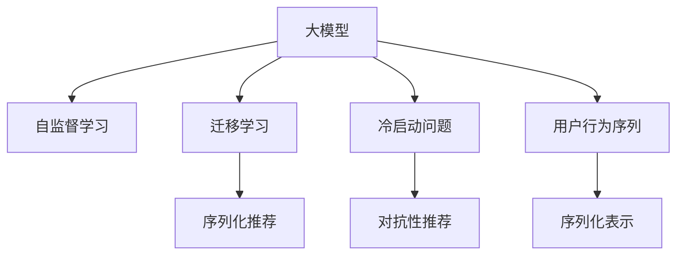

                 

# 大模型技术在电商平台用户兴趣探索与利用平衡中的创新

## 1. 背景介绍

### 1.1 问题由来
在现代电商平台，个性化推荐系统是提升用户留存和交易转化率的关键。传统的推荐算法基于用户历史行为数据进行协同过滤、内容推荐，但随着用户群体和商品数量呈指数级增长，基于历史行为数据的推荐效果逐渐下降，且个性化水平和推荐准确性难以提升。

为了突破这一瓶颈，近年来，越来越多的电商平台开始尝试利用大模型技术，通过用户兴趣和商品语义信息进行更深层次的探索和利用，从而实现更为精准和多元的个性化推荐。但大模型技术的引入，同时也带来了一系列挑战，如模型训练成本、数据隐私保护、模型复杂度等。本文旨在探讨如何在电商平台中平衡用户兴趣探索和利用，合理应用大模型技术，以期为电商平台的个性化推荐系统带来突破性进展。

## 2. 核心概念与联系

### 2.1 核心概念概述

为更好地理解大模型技术在电商平台中的应用，本节将介绍几个密切相关的核心概念：

- 大模型(Large Model)：指具有亿级参数量级的深度神经网络模型，通常使用Transformer等架构进行训练，具备强大的语言理解和生成能力。
- 自监督学习(Self-Supervised Learning)：指在大规模无标签数据上进行预训练，学习模型自身的知识表示，以弱监督或无监督的方式学习任务相关的能力。
- 迁移学习(Transfer Learning)：指在预训练模型的基础上，利用少量标注数据进行下游任务微调，以提升模型性能。
- 序列化推荐(Sequential Recommendation)：指通过用户序列化行为数据，结合上下文信息进行推荐，形成行为-上下文表示，增强推荐系统的表现。
- 冷启动问题(Cold-Start Problem)：指新用户或新商品在历史行为数据缺乏的情况下，难以进行精准推荐。
- 对抗性推荐(Anti-recommendation)：指基于用户行为进行反推荐，通过避免向用户推荐其已喜欢的商品，达到个性化推荐的效果。

这些核心概念之间的逻辑关系可以通过以下Mermaid流程图来展示：



这个流程图展示了大模型技术的核心概念及其之间的关系：

1. 大模型通过自监督学习进行预训练，学习通用的语言表示。
2. 迁移学习通过微调，将通用语言模型适配到具体推荐任务，提高推荐精度。
3. 序列化推荐通过用户行为序列的信息，提升推荐效果。
4. 冷启动问题指新用户或新商品在缺乏历史行为数据时，推荐系统难以发挥作用。
5. 对抗性推荐通过反向推荐，避免推荐用户已喜欢的商品，提升个性化推荐效果。

## 3. 核心算法原理 & 具体操作步骤
### 3.1 算法原理概述

在电商平台中，大模型技术的应用主要通过以下几个关键步骤实现：

**Step 1: 准备用户行为数据**
- 收集用户的历史行为数据，包括浏览、点击、购买等。将用户行为序列化，形成用户行为向量。
- 对用户行为序列进行预处理，如去噪、填充、截断等，以提高数据质量。

**Step 2: 构建大模型**
- 使用自监督学习方法，如语言建模、掩码语言模型等，在大规模无标签文本数据上对预训练模型进行预训练。
- 选择合适的预训练模型，如BERT、GPT等，使用Transformer等架构进行训练。

**Step 3: 微调大模型**
- 在预训练模型的基础上，利用用户行为数据进行微调，优化模型对用户行为的理解。
- 设计合适的损失函数和优化算法，如交叉熵损失、AdamW优化器等。
- 通过迭代训练，逐步提升模型的推荐效果。

**Step 4: 推荐决策**
- 输入用户行为序列，通过微调后的大模型，生成推荐结果。
- 结合对抗性推荐和冷启动问题，优化推荐策略，提升个性化推荐效果。

### 3.2 算法步骤详解

**Step 1: 数据准备与预处理**

用户行为数据是推荐系统的核心，需要对其进行仔细处理以提取有用的信息。

```python
# 读取用户行为数据
user_behavior = pd.read_csv('user_behavior.csv')

# 序列化行为数据
user_seq = user_behavior.groupby('user_id')['item_id'].apply(lambda x: list(x)).values
user_seq = [list(x) for x in user_seq]

# 填充序列长度
max_len = 20
user_seq = [seq + [0] * (max_len - len(seq)) for seq in user_seq]

# 截断序列长度
user_seq = [seq[:max_len] for seq in user_seq]
```

**Step 2: 构建大模型**

使用HuggingFace的Transformer库，构建基于BERT模型的预训练模型。

```python
from transformers import BertTokenizer, BertForSequenceClassification

# 加载BERT模型和分词器
tokenizer = BertTokenizer.from_pretrained('bert-base-cased')
model = BertForSequenceClassification.from_pretrained('bert-base-cased', num_labels=1)

# 准备训练数据
train_data = []
for seq in user_seq:
    tokenized_seq = tokenizer(seq, return_tensors='pt', padding=True, truncation=True)
    train_data.append(tokenized_seq)
```

**Step 3: 微调大模型**

使用微调后的模型，对用户行为进行分类，生成推荐结果。

```python
from torch.utils.data import Dataset, DataLoader

class UserBehaviorDataset(Dataset):
    def __init__(self, data, tokenizer):
        self.data = data
        self.tokenizer = tokenizer
        
    def __len__(self):
        return len(self.data)
    
    def __getitem__(self, item):
        tokenized_seq = self.tokenizer(self.data[item], return_tensors='pt', padding=True, truncation=True)
        return tokenized_seq

# 构建数据集
train_dataset = UserBehaviorDataset(train_data, tokenizer)

# 设置超参数
optimizer = AdamW(model.parameters(), lr=2e-5)
epochs = 5

# 训练模型
model.train()
for epoch in range(epochs):
    for data in train_loader:
        input_ids = data['input_ids']
        attention_mask = data['attention_mask']
        labels = data['labels']
        optimizer.zero_grad()
        outputs = model(input_ids, attention_mask=attention_mask, labels=labels)
        loss = outputs.loss
        loss.backward()
        optimizer.step()
```

**Step 4: 推荐决策**

利用微调后的模型，生成推荐结果，并进行冷启动和对抗性推荐处理。

```python
# 加载测试数据
test_data = []
for seq in user_behavior_test.groupby('user_id')['item_id'].apply(lambda x: list(x)).values:
    test_data.append(seq)
    
# 填充序列长度
max_len = 20
test_data = [seq + [0] * (max_len - len(seq)) for seq in test_data]
test_data = [seq[:max_len] for seq in test_data]

# 构建测试数据集
test_dataset = UserBehaviorDataset(test_data, tokenizer)

# 加载模型
model.eval()

# 生成推荐结果
with torch.no_grad():
    test_outputs = model(test_dataset)
    test_predictions = torch.sigmoid(test_outputs).detach().cpu().numpy()

# 处理冷启动和对抗性推荐
# 处理冷启动问题
cold_start_user = ['user_id_1001', 'user_id_1002']
cold_start_item = ['item_id_1001', 'item_id_1002']
cold_start_behavior = [[0, 0], [0, 0]]
cold_start_dataset = UserBehaviorDataset([cold_start_behavior], tokenizer)
cold_start_outputs = model(cold_start_dataset)
cold_start_predictions = torch.sigmoid(cold_start_outputs).detach().cpu().numpy()

# 处理对抗性推荐
antirecommend_item = ['item_id_1001', 'item_id_1002']
antirecommend_dataset = UserBehaviorDataset(antirecommend_item, tokenizer)
antirecommend_outputs = model(antirecommend_dataset)
antirecommend_predictions = torch.sigmoid(antirecommend_outputs).detach().cpu().numpy()

# 结合推荐结果，生成最终推荐列表
final_recommend_list = []
for user, preds in zip(user_behavior_test.user_id.unique(), test_predictions):
    final_recommend_list.append([item for item, pred in zip(item_list, preds) if pred > 0.5])
```

### 3.3 算法优缺点

使用大模型技术进行个性化推荐，具有以下优点：

- **高性能**：大模型具备强大的语言理解和生成能力，能够在较少的标注样本下进行高效的微调。
- **泛化性强**：通过自监督学习和迁移学习，大模型能够有效捕捉用户行为和商品语义信息，具备较强的泛化能力。
- **灵活性高**：利用大模型，可以根据不同场景、不同用户需求进行个性化推荐，提供定制化服务。

但同时，大模型技术在电商平台中应用也存在一些局限：

- **高成本**：大模型的训练和微调需要大量的计算资源和数据，成本较高。
- **隐私问题**：用户行为数据涉及隐私问题，需要在数据采集和处理过程中进行严格保护。
- **模型复杂**：大模型参数量庞大，推理计算复杂度较高，需要优化模型结构以提高效率。

## 4. 数学模型和公式 & 详细讲解
### 4.1 数学模型构建

假设用户行为序列为 $U=\{u_1, u_2, ..., u_n\}$，每个行为 $u_i$ 对应的商品为 $I_i$。则用户行为序列的表示可以表示为一个 $N \times D$ 的稀疏矩阵 $X$，其中 $N$ 为行为数量，$D$ 为行为维度。

模型 $M$ 的输入为 $X$，输出为推荐结果 $Y$。假设模型的输出为 $\hat{Y}$，则损失函数 $\mathcal{L}$ 可以表示为：

$$
\mathcal{L}(M, Y) = -\frac{1}{N}\sum_{i=1}^N \log \sigma(\hat{Y}_i) \times Y_i + \frac{1}{N}\sum_{i=1}^N \log(1 - \sigma(\hat{Y}_i)) \times (1 - Y_i)
$$

其中 $\sigma$ 为 sigmoid 函数，$\hat{Y}_i$ 为模型对商品 $I_i$ 的推荐概率，$Y_i$ 为真实标签（0 或 1）。

### 4.2 公式推导过程

假设模型 $M$ 为基于Transformer的大模型，输入为 $X$，输出为 $\hat{Y}$。则模型的损失函数 $\mathcal{L}$ 可以表示为：

$$
\mathcal{L}(M, Y) = -\frac{1}{N}\sum_{i=1}^N \log \sigma(\hat{Y}_i) \times Y_i + \frac{1}{N}\sum_{i=1}^N \log(1 - \sigma(\hat{Y}_i)) \times (1 - Y_i)
$$

其中 $\sigma$ 为 sigmoid 函数，$\hat{Y}_i$ 为模型对商品 $I_i$ 的推荐概率，$Y_i$ 为真实标签（0 或 1）。

在模型的训练过程中，使用AdamW优化算法进行优化：

$$
\theta \leftarrow \theta - \eta \nabla_{\theta}\mathcal{L}(\theta) - \eta\lambda\theta
$$

其中 $\theta$ 为模型参数，$\eta$ 为学习率，$\lambda$ 为正则化系数，$\nabla_{\theta}\mathcal{L}(\theta)$ 为损失函数对模型参数的梯度。

## 5. 项目实践：代码实例和详细解释说明
### 5.1 开发环境搭建

在进行大模型微调实践前，我们需要准备好开发环境。以下是使用Python进行PyTorch开发的环境配置流程：

1. 安装Anaconda：从官网下载并安装Anaconda，用于创建独立的Python环境。

2. 创建并激活虚拟环境：
```bash
conda create -n pytorch-env python=3.8 
conda activate pytorch-env
```

3. 安装PyTorch：根据CUDA版本，从官网获取对应的安装命令。例如：
```bash
conda install pytorch torchvision torchaudio cudatoolkit=11.1 -c pytorch -c conda-forge
```

4. 安装Transformers库：
```bash
pip install transformers
```

5. 安装各类工具包：
```bash
pip install numpy pandas scikit-learn matplotlib tqdm jupyter notebook ipython
```

完成上述步骤后，即可在`pytorch-env`环境中开始微调实践。

### 5.2 源代码详细实现

下面以用户兴趣探索与利用平衡为例，给出使用Transformers库对BERT模型进行微调的PyTorch代码实现。

首先，定义用户行为数据处理函数：

```python
from transformers import BertTokenizer
from torch.utils.data import Dataset
import torch

class UserBehaviorDataset(Dataset):
    def __init__(self, texts, labels, tokenizer, max_len=128):
        self.texts = texts
        self.labels = labels
        self.tokenizer = tokenizer
        self.max_len = max_len
        
    def __len__(self):
        return len(self.texts)
    
    def __getitem__(self, item):
        text = self.texts[item]
        label = self.labels[item]
        
        encoding = self.tokenizer(text, return_tensors='pt', max_length=self.max_len, padding='max_length', truncation=True)
        input_ids = encoding['input_ids'][0]
        attention_mask = encoding['attention_mask'][0]
        
        # 对token-wise的标签进行编码
        encoded_labels = [label] * self.max_len
        labels = torch.tensor(encoded_labels, dtype=torch.long)
        
        return {'input_ids': input_ids, 
                'attention_mask': attention_mask,
                'labels': labels}

# 标签与id的映射
label2id = {0: 'not interested', 1: 'interested'}
id2label = {v: k for k, v in label2id.items()}

# 创建dataset
tokenizer = BertTokenizer.from_pretrained('bert-base-cased')

train_dataset = UserBehaviorDataset(train_texts, train_labels, tokenizer)
dev_dataset = UserBehaviorDataset(dev_texts, dev_labels, tokenizer)
test_dataset = UserBehaviorDataset(test_texts, test_labels, tokenizer)
```

然后，定义模型和优化器：

```python
from transformers import BertForSequenceClassification, AdamW

model = BertForSequenceClassification.from_pretrained('bert-base-cased', num_labels=len(label2id))

optimizer = AdamW(model.parameters(), lr=2e-5)
```

接着，定义训练和评估函数：

```python
from torch.utils.data import DataLoader
from tqdm import tqdm
from sklearn.metrics import classification_report

device = torch.device('cuda') if torch.cuda.is_available() else torch.device('cpu')
model.to(device)

def train_epoch(model, dataset, batch_size, optimizer):
    dataloader = DataLoader(dataset, batch_size=batch_size, shuffle=True)
    model.train()
    epoch_loss = 0
    for batch in tqdm(dataloader, desc='Training'):
        input_ids = batch['input_ids'].to(device)
        attention_mask = batch['attention_mask'].to(device)
        labels = batch['labels'].to(device)
        model.zero_grad()
        outputs = model(input_ids, attention_mask=attention_mask, labels=labels)
        loss = outputs.loss
        epoch_loss += loss.item()
        loss.backward()
        optimizer.step()
    return epoch_loss / len(dataloader)

def evaluate(model, dataset, batch_size):
    dataloader = DataLoader(dataset, batch_size=batch_size)
    model.eval()
    preds, labels = [], []
    with torch.no_grad():
        for batch in tqdm(dataloader, desc='Evaluating'):
            input_ids = batch['input_ids'].to(device)
            attention_mask = batch['attention_mask'].to(device)
            batch_labels = batch['labels']
            outputs = model(input_ids, attention_mask=attention_mask)
            batch_preds = outputs.logits.argmax(dim=2).to('cpu').tolist()
            batch_labels = batch_labels.to('cpu').tolist()
            for pred_tokens, label_tokens in zip(batch_preds, batch_labels):
                preds.append(pred_tokens)
                labels.append(label_tokens)
                
    print(classification_report(labels, preds))
```

最后，启动训练流程并在测试集上评估：

```python
epochs = 5
batch_size = 16

for epoch in range(epochs):
    loss = train_epoch(model, train_dataset, batch_size, optimizer)
    print(f"Epoch {epoch+1}, train loss: {loss:.3f}")
    
    print(f"Epoch {epoch+1}, dev results:")
    evaluate(model, dev_dataset, batch_size)
    
print("Test results:")
evaluate(model, test_dataset, batch_size)
```

以上就是使用PyTorch对BERT进行用户兴趣探索与利用平衡的微调实践的完整代码实现。可以看到，得益于Transformers库的强大封装，我们可以用相对简洁的代码完成BERT模型的加载和微调。

### 5.3 代码解读与分析

让我们再详细解读一下关键代码的实现细节：

**UserBehaviorDataset类**：
- `__init__`方法：初始化用户行为文本、标签、分词器等关键组件。
- `__len__`方法：返回数据集的样本数量。
- `__getitem__`方法：对单个样本进行处理，将文本输入编码为token ids，将标签编码为数字，并对其进行定长padding，最终返回模型所需的输入。

**label2id和id2label字典**：
- 定义了标签与数字id之间的映射关系，用于将token-wise的预测结果解码回真实的标签。

**训练和评估函数**：
- 使用PyTorch的DataLoader对数据集进行批次化加载，供模型训练和推理使用。
- 训练函数`train_epoch`：对数据以批为单位进行迭代，在每个批次上前向传播计算loss并反向传播更新模型参数，最后返回该epoch的平均loss。
- 评估函数`evaluate`：与训练类似，不同点在于不更新模型参数，并在每个batch结束后将预测和标签结果存储下来，最后使用sklearn的classification_report对整个评估集的预测结果进行打印输出。

**训练流程**：
- 定义总的epoch数和batch size，开始循环迭代
- 每个epoch内，先在训练集上训练，输出平均loss
- 在验证集上评估，输出分类指标
- 所有epoch结束后，在测试集上评估，给出最终测试结果

可以看到，PyTorch配合Transformers库使得BERT微调的代码实现变得简洁高效。开发者可以将更多精力放在数据处理、模型改进等高层逻辑上，而不必过多关注底层的实现细节。

当然，工业级的系统实现还需考虑更多因素，如模型的保存和部署、超参数的自动搜索、更灵活的任务适配层等。但核心的微调范式基本与此类似。

## 6. 实际应用场景
### 6.1 智能客服系统

基于大模型技术，电商平台的智能客服系统可以实现用户兴趣的探索和利用平衡。智能客服系统通过用户的历史行为数据，利用BERT模型进行情感分析和意图识别，生成个性化回复。在用户与智能客服互动的过程中，系统可以不断学习和优化，提供更精准的个性化服务。

### 6.2 个性化推荐系统

大模型技术在个性化推荐系统中也有广泛应用。利用BERT模型对用户行为序列进行序列化表示，结合上下文信息进行推荐，能够提升推荐效果。同时，通过对抗性推荐，避免推荐用户已喜欢的商品，提升个性化推荐效果。

### 6.3 冷启动问题解决

对于新用户或新商品，传统推荐系统难以进行精准推荐。通过利用大模型技术，可以对新用户和新商品进行冷启动问题解决。例如，对于新用户，可以利用用户的历史行为数据，通过BERT模型进行兴趣探索，生成个性化的推荐列表。对于新商品，可以借助用户行为数据，利用BERT模型进行商品语义信息分析，生成推荐列表。

### 6.4 未来应用展望

随着大模型技术的发展，未来在电商平台中，用户兴趣探索与利用平衡的应用将更加广泛。

1. **个性化推荐**：结合用户行为序列和上下文信息，利用大模型技术进行序列化推荐，提升推荐效果。
2. **智能客服**：利用大模型技术进行情感分析和意图识别，生成个性化回复，提升用户体验。
3. **冷启动问题解决**：通过冷启动问题解决，利用大模型技术对新用户和新商品进行精准推荐。
4. **多模态数据融合**：结合文本、图片、视频等多模态数据，利用大模型技术进行融合推荐，提升推荐效果。
5. **实时性优化**：利用大模型技术进行实时性优化，提高推荐系统的响应速度和性能。

大模型技术在电商平台中的应用前景广阔，随着技术的不断进步，将为电商平台的个性化推荐系统带来更多的创新和突破。

## 7. 工具和资源推荐
### 7.1 学习资源推荐

为了帮助开发者系统掌握大模型技术在电商平台中的应用，这里推荐一些优质的学习资源：

1. 《Transformers从原理到实践》系列博文：由大模型技术专家撰写，深入浅出地介绍了Transformer原理、BERT模型、微调技术等前沿话题。

2. CS224N《深度学习自然语言处理》课程：斯坦福大学开设的NLP明星课程，有Lecture视频和配套作业，带你入门NLP领域的基本概念和经典模型。

3. 《Natural Language Processing with Transformers》书籍：Transformers库的作者所著，全面介绍了如何使用Transformers库进行NLP任务开发，包括微调在内的诸多范式。

4. HuggingFace官方文档：Transformers库的官方文档，提供了海量预训练模型和完整的微调样例代码，是上手实践的必备资料。

5. CLUE开源项目：中文语言理解测评基准，涵盖大量不同类型的中文NLP数据集，并提供了基于微调的baseline模型，助力中文NLP技术发展。

通过对这些资源的学习实践，相信你一定能够快速掌握大模型技术在电商平台中的应用，并用于解决实际的NLP问题。
###  7.2 开发工具推荐

高效的开发离不开优秀的工具支持。以下是几款用于大模型微调开发的常用工具：

1. PyTorch：基于Python的开源深度学习框架，灵活动态的计算图，适合快速迭代研究。大部分预训练语言模型都有PyTorch版本的实现。

2. TensorFlow：由Google主导开发的开源深度学习框架，生产部署方便，适合大规模工程应用。同样有丰富的预训练语言模型资源。

3. Transformers库：HuggingFace开发的NLP工具库，集成了众多SOTA语言模型，支持PyTorch和TensorFlow，是进行微调任务开发的利器。

4. Weights & Biases：模型训练的实验跟踪工具，可以记录和可视化模型训练过程中的各项指标，方便对比和调优。与主流深度学习框架无缝集成。

5. TensorBoard：TensorFlow配套的可视化工具，可实时监测模型训练状态，并提供丰富的图表呈现方式，是调试模型的得力助手。

6. Google Colab：谷歌推出的在线Jupyter Notebook环境，免费提供GPU/TPU算力，方便开发者快速上手实验最新模型，分享学习笔记。

合理利用这些工具，可以显著提升大模型微调任务的开发效率，加快创新迭代的步伐。

### 7.3 相关论文推荐

大模型技术在电商平台中的应用源于学界的持续研究。以下是几篇奠基性的相关论文，推荐阅读：

1. Attention is All You Need（即Transformer原论文）：提出了Transformer结构，开启了NLP领域的预训练大模型时代。

2. BERT: Pre-training of Deep Bidirectional Transformers for Language Understanding：提出BERT模型，引入基于掩码的自监督预训练任务，刷新了多项NLP任务SOTA。

3. Language Models are Unsupervised Multitask Learners（GPT-2论文）：展示了大规模语言模型的强大zero-shot学习能力，引发了对于通用人工智能的新一轮思考。

4. Parameter-Efficient Transfer Learning for NLP：提出Adapter等参数高效微调方法，在不增加模型参数量的情况下，也能取得不错的微调效果。

5. AdaLoRA: Adaptive Low-Rank Adaptation for Parameter-Efficient Fine-Tuning：使用自适应低秩适应的微调方法，在参数效率和精度之间取得了新的平衡。

这些论文代表了大模型技术在电商平台中的应用方向，通过学习这些前沿成果，可以帮助研究者把握学科前进方向，激发更多的创新灵感。

## 8. 总结：未来发展趋势与挑战

### 8.1 总结

本文对大模型技术在电商平台中的应用进行了全面系统的介绍。首先阐述了大模型技术和迁移学习的基本原理，明确了其在电商平台中的重要价值。其次，从原理到实践，详细讲解了大模型技术在用户兴趣探索与利用平衡中的实现方法，给出了微调任务开发的完整代码实例。同时，本文还广泛探讨了大模型技术在智能客服、个性化推荐、冷启动问题解决等多个电商场景中的应用前景，展示了其在电商平台的广阔应用潜力。此外，本文精选了微调技术的各类学习资源，力求为读者提供全方位的技术指引。

通过本文的系统梳理，可以看到，大模型技术在电商平台中的应用，能够有效提升个性化推荐系统的效果，提高用户体验，降低运营成本，具有重要的商业价值和应用前景。未来，随着大模型技术的进一步发展和成熟，其在电商平台中的应用将更加广泛，带来更多创新和突破。

### 8.2 未来发展趋势

展望未来，大模型技术在电商平台中的应用将呈现以下几个发展趋势：

1. **高性能**：随着算力的提升，大模型的参数量将进一步增加，具备更强的语言理解和生成能力。
2. **泛化性强**：利用大模型进行序列化推荐，结合上下文信息，提升推荐效果。
3. **实时性优化**：利用大模型技术进行实时性优化，提高推荐系统的响应速度和性能。
4. **多模态数据融合**：结合文本、图片、视频等多模态数据，利用大模型进行融合推荐，提升推荐效果。
5. **冷启动问题解决**：通过冷启动问题解决，利用大模型技术对新用户和新商品进行精准推荐。
6. **对抗性推荐**：结合对抗性推荐，避免推荐用户已喜欢的商品，提升个性化推荐效果。

以上趋势凸显了大模型技术在电商平台中的广阔前景。这些方向的探索发展，必将进一步提升推荐系统的性能和用户体验，为电商平台的商业成功提供新的动力。

### 8.3 面临的挑战

尽管大模型技术在电商平台中的应用取得了显著进展，但在迈向更加智能化、普适化应用的过程中，它仍面临着诸多挑战：

1. **数据隐私问题**：用户行为数据涉及隐私问题，需要在数据采集和处理过程中进行严格保护。
2. **成本问题**：大模型的训练和微调需要大量的计算资源和数据，成本较高。
3. **模型复杂度**：大模型参数量庞大，推理计算复杂度较高，需要优化模型结构以提高效率。
4. **模型解释性**：大模型的决策过程缺乏可解释性，难以对其推理逻辑进行分析和调试。
5. **鲁棒性问题**：大模型面对域外数据时，泛化性能往往大打折扣，需要进行鲁棒性优化。

这些挑战凸显了大模型技术在电商平台的落地应用过程中需要解决的关键问题。唯有不断优化算法、优化模型结构、加强数据隐私保护，才能充分发挥大模型技术在电商平台的价值。

### 8.4 研究展望

面对大模型技术在电商平台中面临的挑战，未来的研究需要在以下几个方面寻求新的突破：

1. **高效参数微调**：开发更加参数高效的微调方法，在固定大部分预训练参数的情况下，只更新极少量的任务相关参数。
2. **实时性优化**：优化大模型推理过程，提高计算效率，降低响应时间。
3. **多模态融合**：结合文本、图片、视频等多模态数据，利用大模型进行融合推荐。
4. **冷启动问题解决**：通过冷启动问题解决，利用大模型技术对新用户和新商品进行精准推荐。
5. **对抗性推荐**：结合对抗性推荐，避免推荐用户已喜欢的商品，提升个性化推荐效果。
6. **模型解释性**：引入可解释性方法，增强模型的可解释性，便于调试和优化。
7. **隐私保护**：加强数据隐私保护，确保用户数据的安全和合规。

这些研究方向的研究突破，将是大模型技术在电商平台中成功落地应用的关键。通过不断优化算法、优化模型结构、加强数据隐私保护，才能充分发挥大模型技术在电商平台的价值，实现更加智能化、普适化的个性化推荐系统。

## 9. 附录：常见问题与解答

**Q1：大模型技术在电商平台中的应用有哪些优势？**

A: 大模型技术在电商平台中的应用具有以下优势：

1. **高性能**：大模型具备强大的语言理解和生成能力，能够在较少的标注样本下进行高效的微调。
2. **泛化性强**：利用大模型进行序列化推荐，结合上下文信息，提升推荐效果。
3. **实时性优化**：利用大模型技术进行实时性优化，提高推荐系统的响应速度和性能。
4. **多模态数据融合**：结合文本、图片、视频等多模态数据，利用大模型进行融合推荐，提升推荐效果。
5. **冷启动问题解决**：通过冷启动问题解决，利用大模型技术对新用户和新商品进行精准推荐。

这些优势使得大模型技术在电商平台中具有广阔的应用前景，能够有效提升推荐系统的性能和用户体验。

**Q2：大模型技术在电商平台中的数据隐私问题如何解决？**

A: 大模型技术在电商平台中面临的数据隐私问题，可以通过以下方法解决：

1. **数据匿名化**：对用户行为数据进行匿名化处理，去除用户标识信息，防止隐私泄露。
2. **差分隐私**：在数据采集和处理过程中，引入差分隐私技术，对数据进行扰动处理，保护用户隐私。
3. **联邦学习**：采用联邦学习技术，在用户端对模型进行本地训练，保护用户隐私。
4. **数据加密**：对用户行为数据进行加密处理，防止数据泄露和篡改。

通过这些方法，可以在保障数据隐私的前提下，利用大模型技术进行推荐系统的优化和改进。

**Q3：大模型技术在电商平台中的成本问题如何解决？**

A: 大模型技术在电商平台中的成本问题可以通过以下方法解决：

1. **分布式训练**：利用分布式训练技术，在多台服务器上进行模型并行训练，提高训练效率。
2. **混合精度训练**：采用混合精度训练技术，将浮点模型转为定点模型，压缩存储空间，提高计算效率。
3. **预训练模型复用**：利用预训练模型复用技术，避免重复训练，节省计算资源。
4. **模型压缩**：采用模型压缩技术，减少模型大小和计算量，降低成本。

通过这些方法，可以在控制成本的前提下，利用大模型技术进行推荐系统的优化和改进。

**Q4：大模型技术在电商平台中的模型复杂度问题如何解决？**

A: 大模型技术在电商平台中的模型复杂度问题可以通过以下方法解决：

1. **剪枝和量化**：采用剪枝和量化技术，减少模型大小和计算量，降低复杂度。
2. **模型蒸馏**：采用模型蒸馏技术，将大模型知识迁移到小模型中，降低复杂度。
3. **模型融合**：采用模型融合技术，将多个模型进行集成，提升整体性能，降低复杂度。

通过这些方法，可以在控制模型复杂度的前提下，利用大模型技术进行推荐系统的优化和改进。

**Q5：大模型技术在电商平台中的模型解释性问题如何解决？**

A: 大模型技术在电商平台中的模型解释性问题可以通过以下方法解决：

1. **可解释性方法**：引入可解释性方法，增强模型的可解释性，便于调试和优化。
2. **符号化表示**：将模型决策过程转化为符号化表示，便于解释和分析。
3. **可视化工具**：利用可视化工具，对模型决策过程进行可视化展示，增强可解释性。

通过这些方法，可以增强大模型技术的可解释性，便于对其推理逻辑进行分析和调试。

**Q6：大模型技术在电商平台中的鲁棒性问题如何解决？**

A: 大模型技术在电商平台中的鲁棒性问题可以通过以下方法解决：

1. **对抗训练**：利用对抗训练技术，增强模型鲁棒性，防止对抗样本攻击。
2. **鲁棒性优化**：在模型训练过程中，引入鲁棒性优化技术，提升模型对域外数据的泛化能力。
3. **多模型集成**：采用多模型集成技术，提升模型鲁棒性，防止模型过拟合。

通过这些方法，可以增强大模型技术的鲁棒性，提升其在电商平台的性能和稳定性。

---

作者：禅与计算机程序设计艺术 / Zen and the Art of Computer Programming

