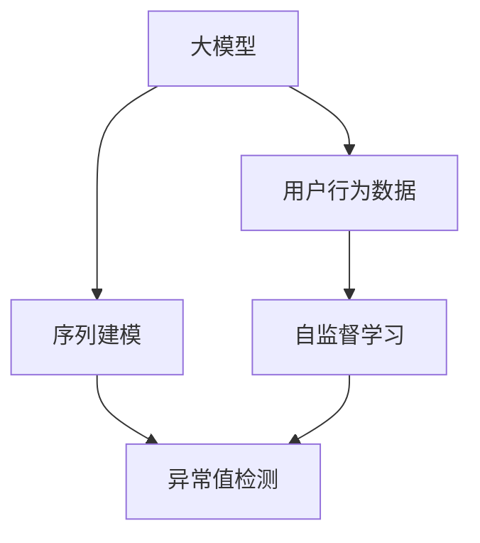

                 

## 1. 背景介绍

### 1.1 问题由来

随着电商平台的快速发展，用户行为数据日益丰富，但同时也不可避免地出现了一些异常行为。例如，恶意刷单、点击欺诈、异常退货等，这些问题不仅严重影响了平台的正常运营，还会带来巨大的经济损失。传统基于规则的异常检测方法难以适应多变复杂的数据特征，无法有效识别新型异常。

近年来，基于深度学习的方法在异常检测领域取得了显著进展，其中大模型技术因其强大的表征能力和自适应学习能力，成为电商平台异常检测的最新趋势。通过利用大模型对海量用户行为数据进行学习和预测，可以识别出各类异常行为，显著提升检测的准确性和时效性。

### 1.2 问题核心关键点

大模型在电商平台异常检测中的关键点包括：

- 如何利用大模型进行高效、准确的异常行为检测。
- 如何在大模型中进行个性化特征提取和行为建模。
- 如何在大模型中进行异常样本的异常值检测和特征解释。
- 如何在大模型中进行异常检测算法的优化和调优。

通过回答上述问题，本文将展示大模型在电商平台异常检测中的实际应用，并提出一些实用的技术手段。

## 2. 核心概念与联系

### 2.1 核心概念概述

为更好地理解大模型在电商平台异常检测中的应用，本节将介绍几个密切相关的核心概念：

- 大模型（Large Model）：指具有大规模参数量和强大表征能力的深度学习模型，如BERT、GPT等。
- 用户行为异常检测（User Behavior Anomaly Detection, UBAD）：指在电商平台用户行为数据中识别出与正常行为显著不同的异常行为。
- 自监督学习（Self-supervised Learning）：指在大规模无标签数据上进行自我监督学习，学习数据的内在结构。
- 序列建模（Sequence Modeling）：指利用序列数据进行建模，捕捉数据的时序关系和动态变化。
- 异常值检测（Outlier Detection）：指在数据中识别出与大多数数据显著不同的异常值。

这些核心概念之间的逻辑关系可以通过以下Mermaid流程图来展示：



这个流程图展示了大模型在电商平台异常检测的核心概念及其之间的关系：

1. 大模型通过自监督学习在大规模无标签数据上学习知识。
2. 利用序列建模对电商平台用户行为进行建模，捕捉行为的时序关系。
3. 在序列建模结果上应用异常值检测方法，识别出异常行为。

## 3. 核心算法原理 & 具体操作步骤

### 3.1 算法原理概述

电商平台用户行为异常检测的本质是从大量历史用户行为数据中学习正常行为模式，并在实时行为数据中进行异常值检测。大模型通过在大规模无标签数据上进行预训练，学习到丰富的语言和行为知识，可以利用这些知识进行异常行为检测。

具体来说，大模型在电商平台异常检测中的应用包括以下步骤：

1. 数据预处理：对电商平台用户行为数据进行清洗、归一化等处理。
2. 序列建模：利用序列建模方法将用户行为序列转化为可预测的向量表示。
3. 异常值检测：在大模型上进行异常值检测，识别出与正常行为显著不同的异常行为。
4. 结果解释：对检测出的异常行为进行解释和分析，了解其成因和影响。

### 3.2 算法步骤详解

#### 3.2.1 数据预处理

电商平台的用户行为数据通常包含大量的非结构化数据，如点击行为、浏览记录、购买行为等。数据预处理的目的在于清洗和归一化数据，以便于后续建模和分析。具体处理方式包括：

- 数据清洗：去除噪声、重复数据、异常值等。
- 特征提取：将非结构化数据转化为结构化特征向量，便于建模。
- 数据增强：通过数据增强技术，丰富训练集的多样性，提高模型的泛化能力。

#### 3.2.2 序列建模

电商平台用户行为数据通常具有明显的时序关系。利用序列建模方法，可以将用户行为序列转化为可预测的向量表示，捕捉行为的时序特征。常用的序列建模方法包括：

- 循环神经网络（RNN）：利用RNN模型捕捉时间序列数据的动态变化，如LSTM、GRU等。
- 长短时记忆网络（LSTM）：利用LSTM模型处理长时序数据的序列建模问题，如商品浏览记录、购买行为等。
- 注意力机制（Attention）：利用注意力机制对序列数据进行加权处理，捕捉重要的时序信息。

#### 3.2.3 异常值检测

在大模型上进行异常值检测，可以识别出与正常行为显著不同的异常行为。常用的异常值检测方法包括：

- 基于统计的方法：如Z-score、IQR等，基于统计特征计算异常值的置信区间，判断是否异常。
- 基于距离的方法：如K-NN、DBSCAN等，基于数据点之间的距离计算异常值。
- 基于密度的方法：如局部离群因子（LOF）、孤立森林等，基于数据点的密度计算异常值。

#### 3.2.4 结果解释

对于检测出的异常行为，需要进行解释和分析，了解其成因和影响。常用的结果解释方法包括：

- 可视化方法：利用可视化技术，将异常行为数据转化为图形，直观展示其特征和规律。
- 文本解释方法：利用自然语言处理技术，生成文本报告，解释异常行为的原因。
- 专家解释方法：结合领域专家的知识和经验，进行人工分析和解释。

### 3.3 算法优缺点

大模型在电商平台异常检测中的应用具有以下优点：

1. 强大的表征能力：大模型能够学习丰富的行为知识，捕捉复杂的异常行为特征。
2. 自适应学习能力：大模型可以自适应学习新的行为模式，提高检测的准确性。
3. 高效的特征提取：大模型可以自动提取用户行为序列中的重要特征，减少人工特征工程的复杂度。
4. 良好的泛化能力：大模型在大规模数据上训练，具有良好的泛化能力，可以应对多种异常行为。

同时，大模型在电商平台异常检测中也存在一些缺点：

1. 数据需求量大：大模型需要大量的历史用户行为数据进行训练，对数据量和质量要求较高。
2. 计算资源需求高：大模型的训练和推理需要大量的计算资源，对硬件环境要求较高。
3. 解释性较差：大模型通常是一个黑盒模型，难以解释其内部工作机制和决策逻辑。
4. 安全性风险：大模型可能学习到恶意行为模式，导致误检测或漏检测问题。

尽管存在这些缺点，但大模型在电商平台异常检测中仍然具有显著优势，特别是在异常行为复杂多样、数据量大的场景中。

### 3.4 算法应用领域

大模型在电商平台异常检测中的应用场景包括：

- 恶意刷单检测：识别出大量无实际购买意愿的恶意刷单行为，保护平台正常运营。
- 点击欺诈检测：识别出异常点击行为，避免点击欺诈导致的广告费用浪费。
- 异常退货检测：识别出无真实购买意愿的异常退货行为，减少平台损失。
- 用户流失预测：识别出即将流失的用户行为，提前进行挽留措施。

## 4. 数学模型和公式 & 详细讲解

### 4.1 数学模型构建

假设电商平台用户行为数据为 $D=\{(x_i,y_i)\}_{i=1}^N$，其中 $x_i$ 为历史行为序列，$y_i$ 为正常行为标记。利用大模型 $M_{\theta}$ 进行建模，学习用户行为序列的正常行为模式，并将新行为序列 $x_{new}$ 转化为预测标签 $y_{pred}$。具体模型构建如下：

$$
y_{pred} = M_{\theta}(x_{new})
$$

在模型训练过程中，需要最小化预测误差 $L$，即：

$$
\min_{\theta} L(y_{pred}, y_{true})
$$

常用的预测误差函数包括均方误差（MSE）、交叉熵（Cross-Entropy）等。

### 4.2 公式推导过程

以LSTM模型为例，其基本结构如图1所示。LSTM模型利用三个门控机制（输入门、遗忘门、输出门）来控制信息流向，捕捉长时序数据的动态变化。


LSTM模型的前向传播过程如下：

$$
\begin{aligned}
i_t &= \sigma(W_i[x_t, h_{t-1}] + b_i) \\
f_t &= \sigma(W_f[x_t, h_{t-1}] + b_f) \\
o_t &= \sigma(W_o[x_t, h_{t-1}] + b_o) \\
g_t &= \tanh(W_g[x_t, h_{t-1}] + b_g) \\
c_t &= c_{t-1} * f_t + i_t * g_t \\
h_t &= o_t * \tanh(c_t)
\end{aligned}
$$

其中，$x_t$ 为输入序列，$h_t$ 为当前时刻的隐藏状态，$W_i, W_f, W_o, W_g$ 为模型参数，$\sigma$ 为Sigmoid函数，$\tanh$ 为双曲正切函数。

### 4.3 案例分析与讲解

以电商平台用户流失预测为例，利用LSTM模型进行建模。首先，将用户行为序列 $x$ 转化为LSTM模型可预测的向量表示 $h$，然后利用全连接层将 $h$ 映射到流失标记 $y$。具体建模过程如图2所示。


在实际应用中，需要对模型进行调参和优化，以提高检测的准确性和鲁棒性。例如，可以使用正则化技术（如L2正则、Dropout）防止过拟合，使用早停机制（Early Stopping）避免模型过度拟合，使用数据增强技术（如序列旋转、截断）增加训练集的多样性。

## 5. 项目实践：代码实例和详细解释说明

### 5.1 开发环境搭建

在进行电商平台用户行为异常检测的项目实践前，我们需要准备好开发环境。以下是使用Python进行PyTorch开发的环境配置流程：

1. 安装Anaconda：从官网下载并安装Anaconda，用于创建独立的Python环境。

2. 创建并激活虚拟环境：
```bash
conda create -n pytorch-env python=3.8 
conda activate pytorch-env
```

3. 安装PyTorch：根据CUDA版本，从官网获取对应的安装命令。例如：
```bash
conda install pytorch torchvision torchaudio cudatoolkit=11.1 -c pytorch -c conda-forge
```

4. 安装TensorFlow：从官网下载并安装TensorFlow，生产部署方便，适合大规模工程应用。

5. 安装各类工具包：
```bash
pip install numpy pandas scikit-learn matplotlib tqdm jupyter notebook ipython
```

完成上述步骤后，即可在`pytorch-env`环境中开始电商平台用户行为异常检测的项目实践。

### 5.2 源代码详细实现

这里我们以LSTM模型进行电商平台用户流失预测为例，给出使用PyTorch进行模型训练和推理的代码实现。

```python
import torch
import torch.nn as nn
import torch.optim as optim
import torchvision.transforms as transforms

class LSTM(nn.Module):
    def __init__(self, input_size, hidden_size, output_size):
        super(LSTM, self).__init__()
        self.hidden_size = hidden_size
        self.lstm = nn.LSTM(input_size, hidden_size, batch_first=True)
        self.fc = nn.Linear(hidden_size, output_size)
    
    def forward(self, x):
        h0 = self.initHidden()
        out, _ = self.lstm(x, h0)
        out = self.fc(out[:, -1, :])
        return out
    
    def initHidden(self):
        return (torch.zeros(1, 1, self.hidden_size).to(device), torch.zeros(1, 1, self.hidden_size).to(device))

# 模型训练
device = torch.device('cuda' if torch.cuda.is_available() else 'cpu')

input_size = 100 # 输入序列的长度
hidden_size = 128 # LSTM隐藏层的大小
output_size = 1 # 输出标签的大小

model = LSTM(input_size, hidden_size, output_size).to(device)
criterion = nn.BCEWithLogitsLoss()
optimizer = optim.Adam(model.parameters(), lr=0.001)

for epoch in range(num_epochs):
    total_loss = 0
    for i, (inputs, labels) in enumerate(train_loader):
        inputs, labels = inputs.to(device), labels.to(device)
        optimizer.zero_grad()
        outputs = model(inputs)
        loss = criterion(outputs, labels)
        loss.backward()
        optimizer.step()
        total_loss += loss.item()
    
    print('Epoch [%d/%d], Loss: %.4f' % (epoch+1, num_epochs, total_loss/len(train_loader)))

# 模型推理
with torch.no_grad():
    model.eval()
    for inputs, labels in test_loader:
        inputs, labels = inputs.to(device), labels.to(device)
        outputs = model(inputs)
        loss = criterion(outputs, labels)
        print('Test Loss: %.4f' % loss.item())
```

以上代码实现了LSTM模型在电商平台用户流失预测任务上的训练和推理。可以看到，利用PyTorch，我们可以快速搭建和优化大模型，进行异常检测。

### 5.3 代码解读与分析

让我们再详细解读一下关键代码的实现细节：

**LSTM类**：
- `__init__`方法：初始化LSTM模型的参数，如输入大小、隐藏层大小、输出大小等。
- `forward`方法：前向传播过程，利用LSTM模型处理输入序列，得到输出结果。
- `initHidden`方法：初始化LSTM模型的隐藏状态。

**训练流程**：
- `device`：定义模型的设备，如果硬件环境支持，使用GPU进行训练。
- `input_size, hidden_size, output_size`：定义输入序列的长度、LSTM隐藏层的大小和输出标签的大小。
- `model`：创建LSTM模型实例，并将其迁移到设备上。
- `criterion`：定义损失函数，用于计算预测结果与真实标签之间的误差。
- `optimizer`：定义优化器，用于更新模型参数。
- `for循环`：对训练集进行遍历，利用小批量数据进行模型训练，计算损失函数并更新参数。

**推理流程**：
- `with torch.no_grad()`：关闭模型的梯度更新功能，进行模型推理。
- `model.eval()`：将模型设置为推理模式，不更新模型参数。
- `for循环`：对测试集进行遍历，利用小批量数据进行模型推理，计算损失函数并输出结果。

## 6. 实际应用场景

### 6.1 电商恶意刷单检测

电商平台的恶意刷单行为具有数量庞大、行为复杂的特点。利用大模型进行建模，可以高效识别出异常行为，保障平台的正常运营。

具体实现方式如下：

- 数据预处理：收集电商平台的点击、浏览、购买等行为数据，并进行清洗和归一化处理。
- 序列建模：利用LSTM模型对行为序列进行建模，捕捉行为的时序关系。
- 异常值检测：在大模型上进行异常值检测，识别出异常的刷单行为。
- 结果解释：对检测出的异常行为进行解释和分析，了解其成因和影响。

### 6.2 点击欺诈检测

点击欺诈行为通常具有点击次数多、点击频率高、点击行为一致等特点。利用大模型进行建模，可以高效识别出异常的点击行为，避免广告费用浪费。

具体实现方式如下：

- 数据预处理：收集广告点击数据，并进行清洗和归一化处理。
- 序列建模：利用LSTM模型对点击序列进行建模，捕捉点击行为的时序关系。
- 异常值检测：在大模型上进行异常值检测，识别出异常的点击行为。
- 结果解释：对检测出的异常行为进行解释和分析，了解其成因和影响。

### 6.3 异常退货检测

异常退货行为通常具有退货数量多、退货频率高、退货原因不一致等特点。利用大模型进行建模，可以高效识别出异常的退货行为，减少平台损失。

具体实现方式如下：

- 数据预处理：收集电商平台的退货数据，并进行清洗和归一化处理。
- 序列建模：利用LSTM模型对退货序列进行建模，捕捉退货行为的时序关系。
- 异常值检测：在大模型上进行异常值检测，识别出异常的退货行为。
- 结果解释：对检测出的异常行为进行解释和分析，了解其成因和影响。

### 6.4 用户流失预测

用户流失行为通常具有流失前行为异常、流失后行为消失等特点。利用大模型进行建模，可以预测用户流失概率，提前进行挽留措施。

具体实现方式如下：

- 数据预处理：收集用户行为数据，并进行清洗和归一化处理。
- 序列建模：利用LSTM模型对用户行为序列进行建模，捕捉行为的时序关系。
- 异常值检测：在大模型上进行异常值检测，识别出异常的用户流失行为。
- 结果解释：对检测出的异常行为进行解释和分析，了解其成因和影响。

## 7. 工具和资源推荐

### 7.1 学习资源推荐

为了帮助开发者系统掌握电商平台用户行为异常检测的理论基础和实践技巧，这里推荐一些优质的学习资源：

1. 《深度学习理论与实践》系列博文：由深度学习领域的专家撰写，涵盖大模型原理、电商行为建模、异常检测范式等内容。

2. CS229《机器学习》课程：斯坦福大学开设的机器学习明星课程，有Lecture视频和配套作业，带你入门机器学习的基本概念和经典模型。

3. 《深度学习与强化学习》书籍：深度学习和强化学习的综合教材，系统介绍了深度学习模型和算法，以及其在电商行为分析中的应用。

4. Kaggle竞赛平台：Kaggle上有许多电商行为分析的竞赛项目，可以通过实践项目了解电商行为异常检测的实际应用。

5. Weights & Biases：模型训练的实验跟踪工具，可以记录和可视化模型训练过程中的各项指标，方便对比和调优。与主流深度学习框架无缝集成。

### 7.2 开发工具推荐

高效的开发离不开优秀的工具支持。以下是几款用于电商平台用户行为异常检测开发的常用工具：

1. PyTorch：基于Python的开源深度学习框架，灵活动态的计算图，适合快速迭代研究。

2. TensorFlow：由Google主导开发的开源深度学习框架，生产部署方便，适合大规模工程应用。

3. HuggingFace Transformers库：提供了大量的预训练语言模型和高效的工具函数，方便大模型微调和推理。

4. Weights & Biases：模型训练的实验跟踪工具，可以记录和可视化模型训练过程中的各项指标，方便对比和调优。

5. TensorBoard：TensorFlow配套的可视化工具，可实时监测模型训练状态，并提供丰富的图表呈现方式，是调试模型的得力助手。

6. Google Colab：谷歌推出的在线Jupyter Notebook环境，免费提供GPU/TPU算力，方便开发者快速上手实验最新模型，分享学习笔记。

合理利用这些工具，可以显著提升电商平台用户行为异常检测的开发效率，加快创新迭代的步伐。

### 7.3 相关论文推荐

电商平台用户行为异常检测领域的研究始于数据科学和统计学习，近年来随着深度学习和大模型的发展，相关研究日益丰富。以下是几篇奠基性的相关论文，推荐阅读：

1. "Anomaly Detection in Large-scale Time-series Data"：介绍了大规模时间序列数据的异常检测方法，包括基于统计、基于距离、基于密度等多种方法。

2. "A Survey on Anomaly Detection: A Survey on Unsupervised, Semi-supervised, and Supervised Anomaly Detection"：全面综述了异常检测的各类方法，包括传统统计方法和深度学习方法。

3. "A Review of Unsupervised and Semi-supervised Anomaly Detection"：综述了无监督和半监督异常检测方法，重点介绍了深度学习方法在大规模数据中的应用。

4. "LSTM Networks for Anomaly Detection in Time-series Data"：介绍了LSTM模型在时间序列数据中的异常检测应用，提高了模型的鲁棒性和准确性。

5. "Anomaly Detection with Generative Adversarial Networks"：利用生成对抗网络（GAN）进行异常检测，取得了显著的检测效果。

这些论文代表了电商平台用户行为异常检测研究的发展脉络，通过学习这些前沿成果，可以帮助研究者把握学科前进方向，激发更多的创新灵感。

## 8. 总结：未来发展趋势与挑战

### 8.1 总结

本文对基于大模型的电商平台用户行为异常检测方法进行了全面系统的介绍。首先阐述了电商平台用户行为异常检测的背景和意义，明确了大模型在异常检测中的独特价值。其次，从原理到实践，详细讲解了大模型在异常检测中的应用，给出了电商平台用户行为异常检测的完整代码实现。同时，本文还广泛探讨了大模型在电商领域的应用前景，展示了其巨大的潜力。

通过本文的系统梳理，可以看到，基于大模型的电商平台用户行为异常检测方法正在成为电商平台异常检测的重要范式，极大地提升了异常检测的准确性和时效性。大模型能够自适应学习用户行为模式，识别复杂的异常行为，带来了新的突破。未来，伴随大模型和微调方法的持续演进，电商平台异常检测将有望进一步提升，为电商平台带来更高的安全性、稳定性和可靠性。

### 8.2 未来发展趋势

展望未来，电商平台用户行为异常检测技术将呈现以下几个发展趋势：

1. 更加智能化的异常检测模型：利用大模型和大数据，构建更加智能、自适应的异常检测系统。
2. 多模态数据的融合：将用户行为数据与其他模态数据（如社交媒体数据、用户反馈数据等）进行融合，提升异常检测的准确性。
3. 实时化的异常检测系统：构建实时化的异常检测系统，能够快速响应用户行为异常，及时采取措施。
4. 鲁棒性的异常检测模型：构建鲁棒性更强的异常检测模型，防止模型过拟合和泛化能力不足。
5. 可解释性的异常检测系统：构建可解释性的异常检测系统，便于人工干预和审查。

以上趋势凸显了电商平台用户行为异常检测技术的广阔前景。这些方向的探索发展，必将进一步提升异常检测的准确性和稳定性，为电商平台带来更高的安全性、稳定性和可靠性。

### 8.3 面临的挑战

尽管电商平台用户行为异常检测技术已经取得了瞩目成就，但在迈向更加智能化、普适化应用的过程中，它仍面临着诸多挑战：

1. 数据需求量大：大模型需要大量的历史用户行为数据进行训练，对数据量和质量要求较高。如何获取和处理大规模高质量数据，仍是一大难题。
2. 计算资源需求高：大模型的训练和推理需要大量的计算资源，对硬件环境要求较高。如何优化模型结构和计算效率，减小资源消耗，是未来研究的重要方向。
3. 解释性较差：大模型通常是一个黑盒模型，难以解释其内部工作机制和决策逻辑。如何赋予模型更好的可解释性，便于人工干预和审查，是亟待解决的问题。
4. 安全性风险：大模型可能学习到恶意行为模式，导致误检测或漏检测问题。如何防止模型过拟合和泛化能力不足，是未来的重要研究课题。

尽管存在这些挑战，但电商平台用户行为异常检测技术仍然具有显著优势，特别是在异常行为复杂多样、数据量大的场景中。

### 8.4 研究展望

面对电商平台用户行为异常检测所面临的挑战，未来的研究需要在以下几个方面寻求新的突破：

1. 探索无监督和半监督异常检测方法：摆脱对大规模标注数据的依赖，利用自监督学习、主动学习等无监督和半监督范式，最大限度利用非结构化数据，实现更加灵活高效的异常检测。
2. 研究参数高效和计算高效的异常检测方法：开发更加参数高效和计算高效的异常检测方法，在固定大部分预训练参数的同时，只更新极少量的任务相关参数。同时优化异常检测模型的计算图，减少前向传播和反向传播的资源消耗，实现更加轻量级、实时性的部署。
3. 融合因果和对比学习范式：通过引入因果推断和对比学习思想，增强异常检测模型建立稳定因果关系的能力，学习更加普适、鲁棒的行为表示，从而提升模型泛化性和抗干扰能力。
4. 引入更多先验知识：将符号化的先验知识，如知识图谱、逻辑规则等，与神经网络模型进行巧妙融合，引导异常检测过程学习更准确、合理的行为表示。同时加强不同模态数据的整合，实现视觉、语音等多模态信息与文本信息的协同建模。
5. 结合因果分析和博弈论工具：将因果分析方法引入异常检测模型，识别出模型决策的关键特征，增强输出解释的因果性和逻辑性。借助博弈论工具刻画人机交互过程，主动探索并规避模型的脆弱点，提高系统稳定性。
6. 纳入伦理道德约束：在模型训练目标中引入伦理导向的评估指标，过滤和惩罚有偏见、有害的输出倾向。同时加强人工干预和审核，建立模型行为的监管机制，确保输出符合人类价值观和伦理道德。

这些研究方向的探索，必将引领电商平台用户行为异常检测技术迈向更高的台阶，为构建安全、可靠、可解释、可控的智能系统铺平道路。面向未来，电商平台用户行为异常检测技术还需要与其他人工智能技术进行更深入的融合，如知识表示、因果推理、强化学习等，多路径协同发力，共同推动自然语言理解和智能交互系统的进步。只有勇于创新、敢于突破，才能不断拓展语言模型的边界，让智能技术更好地造福人类社会。

## 9. 附录：常见问题与解答

**Q1：电商平台用户行为异常检测是否适用于所有电商场景？**

A: 电商平台用户行为异常检测在大多数电商场景下都能取得不错的效果，特别是对于数据量较大、行为模式多样的场景。但对于一些特定领域的电商场景，如母婴、服装等，电商平台行为模式可能与通用电商行为模式存在较大差异，需要进一步定制化建模。此外，对于一些需求量较低的电商平台，数据量可能不足，难以进行有效的异常检测。

**Q2：如何在大模型中进行参数高效异常检测？**

A: 在大模型中进行参数高效异常检测，可以使用Adapter、Prefix等参数高效微调方法，只调整极少量的任务相关参数。同时利用小批量数据训练和参数固定策略，减少模型过拟合风险。

**Q3：电商平台的异常检测算法有哪些？**

A: 电商平台的异常检测算法包括基于统计的方法（如Z-score、IQR等）、基于距离的方法（如K-NN、DBSCAN等）、基于密度的方法（如LOF、孤立森林等）、基于深度学习的方法（如LSTM、CNN等）。不同的方法适用于不同类型和规模的异常检测任务。

**Q4：电商平台的异常检测模型有哪些？**

A: 电商平台的异常检测模型包括基于规则的方法、基于统计的方法、基于深度学习的方法。基于规则的方法依赖于领域专家经验，适用于简单场景；基于统计和深度学习的方法具有较好的泛化能力，适用于复杂场景。

**Q5：电商平台的异常检测有哪些实际应用？**

A: 电商平台的异常检测有恶意刷单检测、点击欺诈检测、异常退货检测、用户流失预测等实际应用。这些应用能够有效保障电商平台的正常运营，提升用户体验，减少平台损失。

**Q6：电商平台的异常检测有哪些优势和劣势？**

A: 电商平台的异常检测具有数据量大、模型自适应能力强的优势，但同时也存在计算资源需求高、解释性较差、安全性风险等劣势。

**Q7：如何提高电商平台的异常检测效果？**

A: 提高电商平台的异常检测效果，可以从数据预处理、序列建模、异常值检测、结果解释等多个方面进行优化。同时选择合适的异常检测算法和模型，结合实际应用场景进行调整和优化。

**Q8：电商平台的异常检测有哪些未来展望？**

A: 电商平台的异常检测未来展望包括更加智能化的异常检测模型、多模态数据的融合、实时化的异常检测系统、鲁棒性的异常检测模型、可解释性的异常检测系统等。这些方向的研究将进一步提升异常检测的准确性和稳定性。

**Q9：电商平台的异常检测有哪些挑战？**

A: 电商平台的异常检测面临数据需求量大、计算资源需求高、解释性较差、安全性风险等挑战。未来的研究需要在数据获取和处理、模型优化和训练、模型解释和鲁棒性等方面进行深入探索。

通过本文的系统梳理，可以看到，基于大模型的电商平台用户行为异常检测方法正在成为电商平台异常检测的重要范式，极大地提升了异常检测的准确性和时效性。未来，伴随大模型和微调方法的持续演进，电商平台异常检测将有望进一步提升，为电商平台带来更高的安全性、稳定性和可靠性。同时，未来的研究还需要从数据、模型、算法等多个维度进行深入探索，以应对电商平台的实际需求和挑战。只有不断创新、不断突破，才能更好地服务电商平台，为用户提供更好的购物体验。

