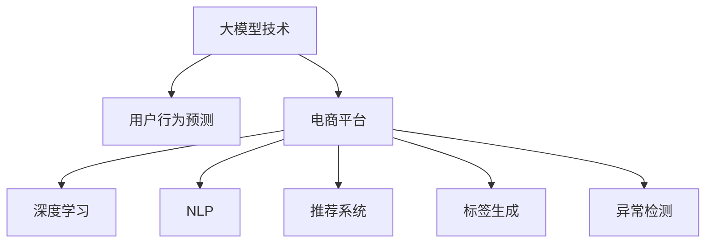

                 

# 大模型技术在电商平台用户行为预测中的应用

> 关键词：大模型技术,用户行为预测,电商平台,深度学习,自然语言处理(NLP),推荐系统,标签生成,异常检测

## 1. 背景介绍

### 1.1 问题由来
随着电子商务的蓬勃发展，电商平台面临着越来越激烈的竞争。如何更好地理解用户需求，提高用户满意度，增加销售额，成为各大电商平台亟需解决的问题。传统的电商数据分析依赖于规则和统计模型，难以深入挖掘用户行为中的隐含模式和动态变化。而大模型技术，特别是基于深度学习的预训练模型，能够利用大规模无标签数据进行自监督学习，自动提取并学习复杂的语义表示，并在下游任务上进行微调，从而显著提升模型预测的准确性和泛化能力。

### 1.2 问题核心关键点
电商平台用户行为预测的核心任务在于：利用用户历史数据和行为数据，构建模型预测用户未来可能购买的产品、访问的页面、评价的星级等信息，实现个性化推荐、页面流量预测、异常行为检测等功能。与传统的统计模型相比，大模型技术具有以下优势：
- 自动特征学习：大模型可以自动提取并学习文本、图像、行为等多种类型的数据特征，无需手工设计特征工程。
- 高效泛化能力：预训练模型具备强大的泛化能力，能在不同场景下稳定输出，不受小样本数据分布偏差的影响。
- 实时迭代优化：大模型通过微调能够持续优化模型参数，适应数据分布的动态变化。

大模型技术在电商平台用户行为预测中的应用，可以带来以下好处：
- 提升个性化推荐精准度：准确预测用户行为，实现更精准的产品推荐。
- 优化流量分配策略：预测页面访问量，实现有效的流量分配，提升用户粘性和转化率。
- 防范风险用户行为：识别异常用户行为，及时预警风险事件，保障平台安全。

本文将系统介绍大模型技术在电商平台用户行为预测中的应用，涵盖从模型构建、微调策略到实际部署的完整过程，并结合具体案例分析其优势和挑战。

## 2. 核心概念与联系

### 2.1 核心概念概述

为更好地理解大模型技术在电商平台用户行为预测中的应用，本节将介绍几个密切相关的核心概念：

- 大模型技术(Large Model Technology)：指通过自监督学习任务预训练的深度学习模型，通常包含数十亿甚至数百亿个参数。大模型能够从大规模无标签数据中学习到丰富的语义表示，具备强大的泛化能力。
- 用户行为预测(User Behavior Prediction)：预测用户未来的行为，如购买产品、访问页面、评价星级等。目标是根据用户的历史行为数据，准确预测用户可能采取的下一步动作。
- 电商平台(Online Platform)：指通过互联网提供商品、服务或交易的虚拟空间。电商平台需要了解用户行为，以实现精准推荐、流量分配、风险防控等业务目标。
- 深度学习(Deep Learning)：一类基于神经网络的机器学习技术，能够处理大规模数据和复杂模式，广泛应用于计算机视觉、自然语言处理等领域。
- 自然语言处理(Natural Language Processing, NLP)：研究如何让计算机理解和生成自然语言的技术，包括文本分类、情感分析、机器翻译等子领域。
- 推荐系统(Recommendation System)：通过用户行为数据和商品特征数据，预测用户对商品的偏好，实现个性化推荐的技术。
- 标签生成(Label Generation)：将用户行为数据转化为预测标签的过程。标签生成是预测任务的核心环节，标签的好坏直接影响模型的性能。
- 异常检测(Anomaly Detection)：识别和预测与正常行为不同的异常行为，如欺诈行为、异常点击行为等，保障平台安全性。

这些核心概念之间的逻辑关系可以通过以下Mermaid流程图来展示：



这个流程图展示了大模型技术在电商平台用户行为预测中的应用流程：

1. 大模型技术通过预训练学习大规模语义表示。
2. 电商平台利用预训练模型，构建用户行为预测系统。
3. 深度学习和大模型技术，提供模型和特征学习的基础。
4. NLP技术帮助模型理解自然语言输入，如文本评论、聊天记录等。
5. 推荐系统通过预测标签，生成个性化推荐。
6. 标签生成是预测任务的核心，标签质量直接影响模型性能。
7. 异常检测识别和预测异常行为，保障平台安全。

这些概念共同构成了电商平台用户行为预测的完整框架，通过理解这些概念，可以更好地把握技术实现的逻辑和关键点。

## 3. 核心算法原理 & 具体操作步骤
### 3.1 算法原理概述

电商平台用户行为预测的核心算法是基于深度学习的预训练-微调框架。其核心思想是：使用大模型技术预训练一个通用的语言表示，然后在具体任务上微调模型，使其能够准确预测用户行为。

具体而言，假设预训练模型为 $M_{\theta}$，其中 $\theta$ 为预训练得到的模型参数。给定用户行为数据集 $D=\{(x_i,y_i)\}_{i=1}^N$，其中 $x_i$ 为用户的历史行为数据，$y_i$ 为用户可能的未来行为标签。微调的目标是找到新的模型参数 $\hat{\theta}$，使得模型在新的数据集 $D'$ 上能够准确预测用户行为：

$$
\hat{\theta}=\mathop{\arg\min}_{\theta} \mathcal{L}(M_{\theta},D')
$$

其中 $\mathcal{L}$ 为针对任务 $T$ 设计的损失函数，用于衡量模型预测输出与真实标签之间的差异。常见的损失函数包括交叉熵损失、均方误差损失等。

通过梯度下降等优化算法，微调过程不断更新模型参数 $\theta$，最小化损失函数 $\mathcal{L}$，使得模型输出逼近真实标签。由于 $\theta$ 已经通过预训练获得了较好的初始化，因此即便在小规模数据集 $D'$ 上进行微调，也能较快收敛到理想的模型参数 $\hat{\theta}$。

### 3.2 算法步骤详解

基于深度学习的预训练-微调框架，电商平台用户行为预测一般包括以下几个关键步骤：

**Step 1: 准备预训练模型和数据集**
- 选择合适的预训练语言模型 $M_{\theta}$ 作为初始化参数，如BERT、GPT等。
- 准备用户行为数据集 $D$，划分为训练集、验证集和测试集。一般要求用户行为数据与预训练数据的分布不要差异过大。

**Step 2: 添加任务适配层**
- 根据任务类型，在预训练模型顶层设计合适的输出层和损失函数。
- 对于分类任务，通常在顶层添加线性分类器和交叉熵损失函数。
- 对于生成任务，通常使用语言模型的解码器输出概率分布，并以负对数似然为损失函数。

**Step 3: 设置微调超参数**
- 选择合适的优化算法及其参数，如 AdamW、SGD 等，设置学习率、批大小、迭代轮数等。
- 设置正则化技术及强度，包括权重衰减、Dropout、Early Stopping等。
- 确定冻结预训练参数的策略，如仅微调顶层，或全部参数都参与微调。

**Step 4: 执行梯度训练**
- 将训练集数据分批次输入模型，前向传播计算损失函数。
- 反向传播计算参数梯度，根据设定的优化算法和学习率更新模型参数。
- 周期性在验证集上评估模型性能，根据性能指标决定是否触发 Early Stopping。
- 重复上述步骤直到满足预设的迭代轮数或 Early Stopping 条件。

**Step 5: 测试和部署**
- 在测试集上评估微调后模型 $M_{\hat{\theta}}$ 的性能，对比微调前后的精度提升。
- 使用微调后的模型对新用户行为进行预测，集成到实际的应用系统中。
- 持续收集新的用户行为数据，定期重新微调模型，以适应数据分布的变化。

以上是基于深度学习的预训练-微调框架的一般流程。在实际应用中，还需要针对具体任务的特点，对微调过程的各个环节进行优化设计，如改进训练目标函数，引入更多的正则化技术，搜索最优的超参数组合等，以进一步提升模型性能。

### 3.3 算法优缺点

基于深度学习的预训练-微调框架在电商平台用户行为预测中的应用，具有以下优点：
1. 数据需求降低。大模型能够自动提取和利用大规模无标签数据，减轻标注数据的获取和处理负担。
2. 特征学习能力强。预训练模型通过自监督学习任务学习到丰富的特征表示，无需手工设计特征工程。
3. 模型泛化性能好。预训练模型具备良好的泛化能力，能够应对不同场景和数据分布的变化。
4. 实时迭代优化。通过微调，模型可以持续学习新数据，适应数据分布的动态变化。

同时，该方法也存在一定的局限性：
1. 依赖高质量数据。虽然大模型能够自动提取特征，但对用户行为数据的采集和处理仍有一定要求。
2. 模型计算成本高。大模型的参数量巨大，微调需要高性能计算资源。
3. 可解释性不足。模型决策过程难以解释，可能影响信任度和应用范围。
4. 可能引入偏见。预训练模型中可能存在的偏见和有害信息，可能通过微调传递到下游任务，产生负面影响。

尽管存在这些局限性，但就目前而言，基于深度学习的预训练-微调框架仍是大模型在电商平台用户行为预测中应用的主流范式。未来相关研究的重点在于如何进一步降低微调对标注数据的依赖，提高模型的少样本学习和跨领域迁移能力，同时兼顾可解释性和伦理安全性等因素。

### 3.4 算法应用领域

基于深度学习的预训练-微调框架在电商平台用户行为预测中的应用，已经在个性化推荐、流量预测、风险检测等多个领域得到了广泛的应用，成为电商数据分析的重要手段。

- 个性化推荐：通过微调模型，根据用户历史行为数据，预测用户可能感兴趣的商品，实现精准推荐。
- 流量预测：预测页面访问量，实现有效的流量分配，提升用户粘性和转化率。
- 风险检测：识别和预测异常用户行为，如欺诈行为、恶意点击行为等，保障平台安全。
- 情感分析：通过微调模型，分析用户评论，预测用户对商品的情感倾向，优化商品描述和评价策略。

除了上述这些经典任务外，基于预训练-微调框架的模型还在智能客服、知识图谱、用户画像等多个方向上不断拓展，为电商平台带来了全新的应用场景和创新机会。

## 4. 数学模型和公式 & 详细讲解  
### 4.1 数学模型构建

本节将使用数学语言对电商平台用户行为预测的预训练-微调框架进行更加严格的刻画。

记预训练语言模型为 $M_{\theta}$，其中 $\theta$ 为预训练得到的模型参数。假设用户行为预测任务的目标是分类，给定用户行为数据集 $D=\{(x_i,y_i)\}_{i=1}^N$，其中 $x_i$ 为用户的行为数据，$y_i$ 为用户可能的未来行为标签。微调的目标是找到新的模型参数 $\hat{\theta}$，使得模型在新的数据集 $D'$ 上能够准确预测用户行为：

$$
\hat{\theta}=\mathop{\arg\min}_{\theta} \mathcal{L}(M_{\theta},D')
$$

其中 $\mathcal{L}$ 为针对任务 $T$ 设计的损失函数，用于衡量模型预测输出与真实标签之间的差异。常见的损失函数包括交叉熵损失、均方误差损失等。

在实践中，我们通常使用基于梯度的优化算法（如SGD、Adam等）来近似求解上述最优化问题。设 $\eta$ 为学习率，$\lambda$ 为正则化系数，则参数的更新公式为：

$$
\theta \leftarrow \theta - \eta \nabla_{\theta}\mathcal{L}(\theta) - \eta\lambda\theta
$$

其中 $\nabla_{\theta}\mathcal{L}(\theta)$ 为损失函数对参数 $\theta$ 的梯度，可通过反向传播算法高效计算。

### 4.2 公式推导过程

以下我们以二分类任务为例，推导交叉熵损失函数及其梯度的计算公式。

假设模型 $M_{\theta}$ 在输入 $x$ 上的输出为 $\hat{y}=M_{\theta}(x) \in [0,1]$，表示样本属于正类的概率。真实标签 $y \in \{0,1\}$。则二分类交叉熵损失函数定义为：

$$
\ell(M_{\theta}(x),y) = -[y\log \hat{y} + (1-y)\log (1-\hat{y})]
$$

将其代入经验风险公式，得：

$$
\mathcal{L}(\theta) = -\frac{1}{N}\sum_{i=1}^N [y_i\log M_{\theta}(x_i)+(1-y_i)\log(1-M_{\theta}(x_i))]
$$

根据链式法则，损失函数对参数 $\theta_k$ 的梯度为：

$$
\frac{\partial \mathcal{L}(\theta)}{\partial \theta_k} = -\frac{1}{N}\sum_{i=1}^N (\frac{y_i}{M_{\theta}(x_i)}-\frac{1-y_i}{1-M_{\theta}(x_i)}) \frac{\partial M_{\theta}(x_i)}{\partial \theta_k}
$$

其中 $\frac{\partial M_{\theta}(x_i)}{\partial \theta_k}$ 可进一步递归展开，利用自动微分技术完成计算。

在得到损失函数的梯度后，即可带入参数更新公式，完成模型的迭代优化。重复上述过程直至收敛，最终得到适应用户行为预测的最优模型参数 $\theta^*$。

## 5. 项目实践：代码实例和详细解释说明
### 5.1 开发环境搭建

在进行用户行为预测实践前，我们需要准备好开发环境。以下是使用Python进行PyTorch开发的环境配置流程：

1. 安装Anaconda：从官网下载并安装Anaconda，用于创建独立的Python环境。

2. 创建并激活虚拟环境：
```bash
conda create -n pytorch-env python=3.8 
conda activate pytorch-env
```

3. 安装PyTorch：根据CUDA版本，从官网获取对应的安装命令。例如：
```bash
conda install pytorch torchvision torchaudio cudatoolkit=11.1 -c pytorch -c conda-forge
```

4. 安装Transformers库：
```bash
pip install transformers
```

5. 安装各类工具包：
```bash
pip install numpy pandas scikit-learn matplotlib tqdm jupyter notebook ipython
```

完成上述步骤后，即可在`pytorch-env`环境中开始用户行为预测实践。

### 5.2 源代码详细实现

下面我以用户行为预测中的二分类任务为例，给出使用Transformers库对BERT模型进行微调的PyTorch代码实现。

首先，定义用户行为预测任务的DataLoader：

```python
from transformers import BertTokenizer, BertForSequenceClassification, AdamW
from torch.utils.data import Dataset, DataLoader
import torch

class UserBehaviorDataset(Dataset):
    def __init__(self, user_behaviors, labels, tokenizer, max_len=128):
        self.user_behaviors = user_behaviors
        self.labels = labels
        self.tokenizer = tokenizer
        self.max_len = max_len
        
    def __len__(self):
        return len(self.user_behaviors)
    
    def __getitem__(self, item):
        user_behavior = self.user_behaviors[item]
        label = self.labels[item]
        
        encoding = self.tokenizer(user_behavior, return_tensors='pt', max_length=self.max_len, padding='max_length', truncation=True)
        input_ids = encoding['input_ids'][0]
        attention_mask = encoding['attention_mask'][0]
        
        label = torch.tensor([label], dtype=torch.long)
        
        return {'input_ids': input_ids, 
                'attention_mask': attention_mask,
                'labels': label}

# 标签与id的映射
label2id = {'Positive': 1, 'Negative': 0}
id2label = {v: k for k, v in label2id.items()}

# 创建dataset
tokenizer = BertTokenizer.from_pretrained('bert-base-cased')

train_dataset = UserBehaviorDataset(train_user_behaviors, train_labels, tokenizer)
dev_dataset = UserBehaviorDataset(dev_user_behaviors, dev_labels, tokenizer)
test_dataset = UserBehaviorDataset(test_user_behaviors, test_labels, tokenizer)
```

然后，定义模型和优化器：

```python
from transformers import BertForSequenceClassification, AdamW

model = BertForSequenceClassification.from_pretrained('bert-base-cased', num_labels=2)

optimizer = AdamW(model.parameters(), lr=2e-5)
```

接着，定义训练和评估函数：

```python
from tqdm import tqdm

device = torch.device('cuda') if torch.cuda.is_available() else torch.device('cpu')
model.to(device)

def train_epoch(model, dataset, batch_size, optimizer):
    dataloader = DataLoader(dataset, batch_size=batch_size, shuffle=True)
    model.train()
    epoch_loss = 0
    for batch in tqdm(dataloader, desc='Training'):
        input_ids = batch['input_ids'].to(device)
        attention_mask = batch['attention_mask'].to(device)
        labels = batch['labels'].to(device)
        model.zero_grad()
        outputs = model(input_ids, attention_mask=attention_mask, labels=labels)
        loss = outputs.loss
        epoch_loss += loss.item()
        loss.backward()
        optimizer.step()
    return epoch_loss / len(dataloader)

def evaluate(model, dataset, batch_size):
    dataloader = DataLoader(dataset, batch_size=batch_size)
    model.eval()
    preds, labels = [], []
    with torch.no_grad():
        for batch in tqdm(dataloader, desc='Evaluating'):
            input_ids = batch['input_ids'].to(device)
            attention_mask = batch['attention_mask'].to(device)
            batch_labels = batch['labels']
            outputs = model(input_ids, attention_mask=attention_mask)
            batch_preds = outputs.logits.argmax(dim=1).to('cpu').tolist()
            batch_labels = batch_labels.to('cpu').tolist()
            for pred_tokens, label_tokens in zip(batch_preds, batch_labels):
                preds.append(pred_tokens)
                labels.append(label_tokens)
                
    print(classification_report(labels, preds))
```

最后，启动训练流程并在测试集上评估：

```python
epochs = 5
batch_size = 16

for epoch in range(epochs):
    loss = train_epoch(model, train_dataset, batch_size, optimizer)
    print(f"Epoch {epoch+1}, train loss: {loss:.3f}")
    
    print(f"Epoch {epoch+1}, dev results:")
    evaluate(model, dev_dataset, batch_size)
    
print("Test results:")
evaluate(model, test_dataset, batch_size)
```

以上就是使用PyTorch对BERT进行用户行为预测微调的完整代码实现。可以看到，得益于Transformers库的强大封装，我们可以用相对简洁的代码完成BERT模型的加载和微调。

### 5.3 代码解读与分析

让我们再详细解读一下关键代码的实现细节：

**UserBehaviorDataset类**：
- `__init__`方法：初始化用户行为、标签、分词器等关键组件。
- `__len__`方法：返回数据集的样本数量。
- `__getitem__`方法：对单个样本进行处理，将用户行为输入编码为token ids，将标签编码为数字，并对其进行定长padding，最终返回模型所需的输入。

**label2id和id2label字典**：
- 定义了标签与数字id之间的映射关系，用于将预测结果解码回真实的标签。

**训练和评估函数**：
- 使用PyTorch的DataLoader对数据集进行批次化加载，供模型训练和推理使用。
- 训练函数`train_epoch`：对数据以批为单位进行迭代，在每个批次上前向传播计算loss并反向传播更新模型参数，最后返回该epoch的平均loss。
- 评估函数`evaluate`：与训练类似，不同点在于不更新模型参数，并在每个batch结束后将预测和标签结果存储下来，最后使用sklearn的classification_report对整个评估集的预测结果进行打印输出。

**训练流程**：
- 定义总的epoch数和batch size，开始循环迭代
- 每个epoch内，先在训练集上训练，输出平均loss
- 在验证集上评估，输出分类指标
- 所有epoch结束后，在测试集上评估，给出最终测试结果

可以看到，PyTorch配合Transformers库使得BERT微调的代码实现变得简洁高效。开发者可以将更多精力放在数据处理、模型改进等高层逻辑上，而不必过多关注底层的实现细节。

当然，工业级的系统实现还需考虑更多因素，如模型的保存和部署、超参数的自动搜索、更灵活的任务适配层等。但核心的微调范式基本与此类似。

## 6. 实际应用场景
### 6.1 个性化推荐

个性化推荐是电商平台用户行为预测的一个重要应用场景。通过微调模型，可以准确预测用户可能感兴趣的商品，实现精准推荐。

具体而言，可以收集用户历史浏览、点击、购买等行为数据，构建用户行为序列。将行为序列作为输入，模型的预测结果作为推荐结果。通过微调模型，使其能够学习到用户行为序列中的隐含模式和动态变化，从而实现个性化推荐。

### 6.2 流量预测

流量预测是电商平台预测页面访问量的关键任务，能够实现有效的流量分配，提升用户粘性和转化率。

通过微调模型，可以预测未来用户访问某一页面的概率，从而调整页面权重和流量分配策略。例如，对于热门商品页面，可以分配更多流量以提高曝光率；对于冷门商品页面，可以分配较少流量以减少无效流量。

### 6.3 风险检测

电商平台面临多种风险，如欺诈行为、恶意点击行为等。通过微调模型，可以识别和预测异常行为，及时预警风险事件，保障平台安全。

具体而言，可以收集用户行为数据，包括点击频率、购买频率、行为时间等。通过微调模型，识别出异常用户行为，如高点击率但低购买率的点击行为，及时预警可能存在的欺诈风险。

### 6.4 情感分析

情感分析是电商平台对用户评论进行情感倾向预测的重要应用。通过微调模型，可以分析用户评论，预测用户对商品的情感倾向，优化商品描述和评价策略。

具体而言，可以收集用户评论文本数据，将其作为模型输入，模型的预测结果作为情感倾向标签。通过微调模型，使其能够学习到用户评论中的情感表达，从而准确预测用户的情感倾向。

## 7. 工具和资源推荐
### 7.1 学习资源推荐

为了帮助开发者系统掌握大模型技术在电商平台用户行为预测中的应用，这里推荐一些优质的学习资源：

1. 《深度学习入门》系列博文：由大模型技术专家撰写，深入浅出地介绍了深度学习的基本概念和算法原理，适合入门学习。

2. 《Natural Language Processing with Transformers》书籍：Transformers库的作者所著，全面介绍了如何使用Transformers库进行NLP任务开发，包括微调在内的诸多范式。

3. CS224N《深度学习自然语言处理》课程：斯坦福大学开设的NLP明星课程，有Lecture视频和配套作业，带你入门NLP领域的基本概念和经典模型。

4. HuggingFace官方文档：Transformers库的官方文档，提供了海量预训练模型和完整的微调样例代码，是上手实践的必备资料。

5. PyTorch官方文档：PyTorch的官方文档，介绍了PyTorch的基本用法和高级特性，适合深入学习和实践。

通过对这些资源的学习实践，相信你一定能够快速掌握大模型技术在电商平台用户行为预测中的核心原理和实践技巧，并用于解决实际的NLP问题。
###  7.2 开发工具推荐

高效的开发离不开优秀的工具支持。以下是几款用于大模型技术在电商平台用户行为预测开发的常用工具：

1. PyTorch：基于Python的开源深度学习框架，灵活动态的计算图，适合快速迭代研究。大部分预训练语言模型都有PyTorch版本的实现。

2. TensorFlow：由Google主导开发的开源深度学习框架，生产部署方便，适合大规模工程应用。同样有丰富的预训练语言模型资源。

3. Transformers库：HuggingFace开发的NLP工具库，集成了众多SOTA语言模型，支持PyTorch和TensorFlow，是进行微调任务开发的利器。

4. Weights & Biases：模型训练的实验跟踪工具，可以记录和可视化模型训练过程中的各项指标，方便对比和调优。与主流深度学习框架无缝集成。

5. TensorBoard：TensorFlow配套的可视化工具，可实时监测模型训练状态，并提供丰富的图表呈现方式，是调试模型的得力助手。

6. Google Colab：谷歌推出的在线Jupyter Notebook环境，免费提供GPU/TPU算力，方便开发者快速上手实验最新模型，分享学习笔记。

合理利用这些工具，可以显著提升大模型技术在电商平台用户行为预测任务的开发效率，加快创新迭代的步伐。

### 7.3 相关论文推荐

大模型技术在电商平台用户行为预测的应用源于学界的持续研究。以下是几篇奠基性的相关论文，推荐阅读：

1. Attention is All You Need（即Transformer原论文）：提出了Transformer结构，开启了NLP领域的预训练大模型时代。

2. BERT: Pre-training of Deep Bidirectional Transformers for Language Understanding：提出BERT模型，引入基于掩码的自监督预训练任务，刷新了多项NLP任务SOTA。

3. Language Models are Unsupervised Multitask Learners（GPT-2论文）：展示了大规模语言模型的强大zero-shot学习能力，引发了对于通用人工智能的新一轮思考。

4. Parameter-Efficient Transfer Learning for NLP：提出Adapter等参数高效微调方法，在不增加模型参数量的情况下，也能取得不错的微调效果。

5. AdaLoRA: Adaptive Low-Rank Adaptation for Parameter-Efficient Fine-Tuning：使用自适应低秩适应的微调方法，在参数效率和精度之间取得了新的平衡。

这些论文代表了大模型技术在电商平台用户行为预测的应用进展，通过学习这些前沿成果，可以帮助研究者把握学科前进方向，激发更多的创新灵感。

## 8. 总结：未来发展趋势与挑战

### 8.1 总结

本文对大模型技术在电商平台用户行为预测中的应用进行了全面系统的介绍。首先阐述了大模型技术和用户行为预测的研究背景和意义，明确了预训练-微调框架在电商平台用户行为预测中的应用价值。其次，从原理到实践，详细讲解了基于深度学习的预训练-微调框架的数学模型和算法步骤，给出了微调任务开发的完整代码实例。同时，本文还广泛探讨了预训练-微调框架在个性化推荐、流量预测、风险检测等多个领域的应用前景，展示了预训练-微调框架的强大能力。此外，本文精选了预训练-微调框架的学习资源，力求为读者提供全方位的技术指引。

通过本文的系统梳理，可以看到，基于深度学习的预训练-微调框架在电商平台用户行为预测中的应用前景广阔，能够实现精准推荐、流量优化、风险预警、情感分析等功能。预训练-微调框架的强大数据处理能力和模型泛化性能，使其成为电商数据分析的重要工具。未来，随着大模型技术的持续演进，预训练-微调框架必将在更多电商场景中得到应用，为电商平台带来新的创新机会。

### 8.2 未来发展趋势

展望未来，大模型技术在电商平台用户行为预测的应用将呈现以下几个发展趋势：

1. 模型规模持续增大。随着算力成本的下降和数据规模的扩张，预训练语言模型的参数量还将持续增长。超大模型能够学习到更丰富的语义表示，有望提升预测精度。

2. 微调方法日趋多样。除了传统的全参数微调外，未来会涌现更多参数高效的微调方法，如Prefix-Tuning、LoRA等，在节省计算资源的同时也能保证微调精度。

3. 持续学习成为常态。随着用户行为数据的多样化和动态变化，预训练模型需要持续学习新数据，以保持性能。如何在不遗忘原有知识的同时，高效吸收新样本信息，将成为重要的研究课题。

4. 标注样本需求降低。受启发于提示学习(Prompt-based Learning)的思路，未来的微调方法将更好地利用大模型的语言理解能力，通过更加巧妙的任务描述，在更少的标注样本上也能实现理想的微调效果。

5. 模型通用性增强。经过海量数据的预训练和多领域任务的微调，未来的预训练模型将具备更强大的常识推理和跨领域迁移能力，逐步迈向通用人工智能(AGI)的目标。

以上趋势凸显了大模型技术在电商平台用户行为预测中的广阔前景。这些方向的探索发展，必将进一步提升电商平台的用户体验和运营效率，为电商数据分析带来新的突破。

### 8.3 面临的挑战

尽管大模型技术在电商平台用户行为预测中已经取得了瞩目成就，但在迈向更加智能化、普适化应用的过程中，它仍面临着诸多挑战：

1. 标注成本瓶颈。虽然大模型能够自动提取特征，但对用户行为数据的采集和处理仍有一定要求。高质量标注数据的获取成本较高，成为制约微调性能的瓶颈。

2. 模型鲁棒性不足。当前预训练模型面对域外数据时，泛化性能往往大打折扣。对于测试样本的微小扰动，模型容易发生波动，模型鲁棒性有待提升。

3. 计算成本高。大模型的参数量巨大，微调需要高性能计算资源，算力成本较高。

4. 可解释性不足。预训练模型决策过程难以解释，可能影响信任度和应用范围。

5. 可能引入偏见。预训练模型中可能存在的偏见和有害信息，可能通过微调传递到下游任务，产生负面影响。

尽管存在这些局限性，但就目前而言，基于深度学习的预训练-微调框架仍是大模型在电商平台用户行为预测中应用的主流范式。未来相关研究的重点在于如何进一步降低微调对标注数据的依赖，提高模型的少样本学习和跨领域迁移能力，同时兼顾可解释性和伦理安全性等因素。

### 8.4 未来突破

面对大模型技术在电商平台用户行为预测所面临的挑战，未来的研究需要在以下几个方面寻求新的突破：

1. 探索无监督和半监督微调方法。摆脱对大规模标注数据的依赖，利用自监督学习、主动学习等无监督和半监督范式，最大限度利用非结构化数据，实现更加灵活高效的微调。

2. 研究参数高效和计算高效的微调范式。开发更加参数高效的微调方法，在固定大部分预训练参数的同时，只更新极少量的任务相关参数。同时优化微调模型的计算图，减少前向传播和反向传播的资源消耗，实现更加轻量级、实时性的部署。

3. 融合因果和对比学习范式。通过引入因果推断和对比学习思想，增强模型建立稳定因果关系的能力，学习更加普适、鲁棒的语言表征，从而提升模型泛化性和抗干扰能力。

4. 引入更多先验知识。将符号化的先验知识，如知识图谱、逻辑规则等，与神经网络模型进行巧妙融合，引导微调过程学习更准确、合理的语言模型。同时加强不同模态数据的整合，实现视觉、语音等多模态信息与文本信息的协同建模。

5. 结合因果分析和博弈论工具。将因果分析方法引入微调模型，识别出模型决策的关键特征，增强输出解释的因果性和逻辑性。借助博弈论工具刻画人机交互过程，主动探索并规避模型的脆弱点，提高系统稳定性。

6. 纳入伦理道德约束。在模型训练目标中引入伦理导向的评估指标，过滤和惩罚有偏见、有害的输出倾向。同时加强人工干预和审核，建立模型行为的监管机制，确保输出符合人类价值观和伦理道德。

这些研究方向的探索，必将引领大模型技术在电商平台用户行为预测走向更高的台阶，为构建安全、可靠、可解释、可控的智能系统铺平道路。面向未来，大模型技术需要在与其他人工智能技术的融合中不断演进，如知识表示、因果推理、强化学习等，多路径协同发力，共同推动自然语言理解和智能交互系统的进步。只有勇于创新、敢于突破，才能不断拓展语言模型的边界，让智能技术更好地造福人类社会。

## 9. 附录：常见问题与解答

**Q1：预训练模型和微调模型有什么区别？**

A: 预训练模型和微调模型是深度学习中的两个重要概念。预训练模型是通过大规模无标签数据进行自监督学习，学习到通用的语言表示，具有较强的泛化能力。微调模型是在预训练模型的基础上，使用下游任务的少量标注数据进行有监督学习，对模型进行适应性优化，使其能够解决特定任务。预训练模型和微调模型通常结合使用，先使用预训练模型学习通用表示，再通过微调模型适应具体任务。

**Q2：预训练模型对数据质量的要求有多高？**

A: 预训练模型的效果很大程度上取决于训练数据的数量和质量。数据量越大，模型学习到的表示越丰富。同时，数据质量也直接影响模型的泛化性能。如果数据存在噪声、偏差或标注错误，模型的训练过程可能受到干扰，导致输出质量下降。因此，在预训练模型的训练过程中，需要确保数据的多样性、干净性和代表性。

**Q3：预训练-微调框架如何提升预测精度？**

A: 预训练-微调框架通过两个步骤提升预测精度：
1. 预训练阶段：使用大规模无标签数据进行自监督学习，学习到丰富的语义表示。
2. 微调阶段：使用下游任务的少量标注数据进行有监督学习，对模型进行适应性优化，使其能够解决特定任务。
通过这两个步骤，模型能够充分利用大规模数据进行预训练，学习到通用的语言表示；再通过微调，对特定任务进行优化，从而获得更高的预测精度。

**Q4：预训练模型和微调模型在电商应用中的作用是什么？**

A: 在电商应用中，预训练模型和微调模型分别扮演不同的角色：
1. 预训练模型：通过大规模无标签数据进行自监督学习，学习到丰富的语义表示，为电商数据分析提供基础。
2. 微调模型：在预训练模型的基础上，使用电商任务的数据进行有监督学习，对模型进行适应性优化，使其能够解决电商具体任务，如个性化推荐、流量预测、风险检测等。
预训练模型和微调模型结合使用，可以充分利用大规模数据进行预训练，学习到通用的语言表示；再通过微调，对电商任务进行优化，从而实现精准推荐、流量优化、风险预警等功能。

**Q5：如何评估预训练模型的效果？**

A: 评估预训练模型的效果通常需要考虑以下几个指标：
1. 预测准确率：模型预测结果与真实标签的匹配程度。
2. 召回率：模型预测到的正样本与真实正样本的比例。
3. F1 Score：准确率和召回率的调和平均值，综合考虑模型的查全率和查准率。
4. AUC Score：接收者操作特征曲线下的面积，衡量模型在不同阈值下的分类效果。
5. 偏差和公平性：模型在不同数据集上的表现是否均衡，是否存在偏差。
通过对这些指标的评估，可以全面了解模型的性能和鲁棒性，发现并解决潜在问题。

---

作者：禅与计算机程序设计艺术 / Zen and the Art of Computer Programming

