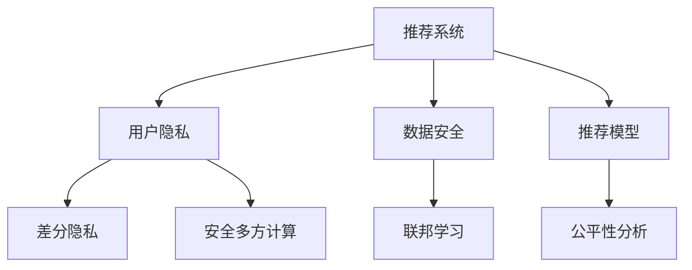

                 

# 大模型推荐中的用户隐私与安全问题再思考

> 关键词：推荐系统, 用户隐私, 数据安全, 数据匿名化, 差分隐私, 联邦学习, 安全多方计算

## 1. 背景介绍

在信息化时代，推荐系统（Recommender Systems）已经成为互联网公司不可或缺的关键业务工具，它们通过分析用户的历史行为数据，精准推荐用户感兴趣的内容，极大提升了用户体验和公司收益。然而，推荐系统的蓬勃发展背后，却隐含着严重的用户隐私与安全问题。

### 1.1 问题由来

推荐系统的推荐过程往往依赖于用户的大量行为数据。这些数据通常包含敏感个人信息，如浏览记录、购物清单、位置信息等。为获取高精度的推荐结果，推荐系统需要分析这些数据的特征，这就不可避免地带来了隐私泄露的风险。此外，推荐系统可能受到恶意攻击，如协同过滤攻击（Collaborative Filtering Attack）、对抗性推荐（Adversarial Recommendations）等，导致不公正、有害的推荐结果，给用户带来危害。

### 1.2 问题核心关键点

推荐系统的用户隐私与安全问题主要体现在以下几个方面：

1. **数据收集与存储**：推荐系统需要收集大量用户数据，这些数据在存储和传输过程中可能被窃取或篡改。
2. **用户隐私泄露**：数据集可能包含敏感个人信息，通过模型训练和推荐算法，可能会泄漏用户偏好、习惯等隐私信息。
3. **模型攻击与滥用**：推荐系统可能受到恶意攻击，如对抗性推荐、协同过滤攻击等，导致有害、偏见的推荐结果。
4. **算法公平性**：由于推荐算法存在偏差，可能导致某些群体的推荐结果不公平，如性别、年龄、种族等。
5. **数据共享与合作**：多个公司或服务提供商之间的数据共享，可能引发隐私和数据安全问题。

这些关键点反映了推荐系统在用户隐私与安全方面的挑战，亟需研究者寻求解决方案，保护用户隐私，同时保证推荐系统的安全性与公平性。

## 2. 核心概念与联系

### 2.1 核心概念概述

为深入理解推荐系统中的隐私与安全问题，本节将介绍几个核心概念及其关系：

- **推荐系统（Recommender System）**：基于用户历史行为数据，预测用户可能感兴趣的内容，如商品、新闻、音乐等。
- **用户隐私（User Privacy）**：指用户个人信息的保护，避免未授权的第三方获取和滥用。
- **数据安全（Data Security）**：指数据在存储和传输过程中的安全性，避免被非法访问和篡改。
- **差分隐私（Differential Privacy）**：一种隐私保护技术，通过添加噪声扰动，使得单个用户数据的加入不显著影响模型结果。
- **联邦学习（Federated Learning）**：一种分布式机器学习技术，模型在本地数据上进行训练，模型参数仅在本地更新，避免数据泄露。
- **安全多方计算（Secure Multi-party Computation, SMPC）**：一种多参与方协同计算方法，通过加密计算保护数据隐私。

这些核心概念之间的逻辑关系可以通过以下Mermaid流程图来展示：



这个流程图展示推荐系统的核心概念及其之间的关系：

1. 推荐系统通过分析用户数据，为用户推荐内容。
2. 数据安全与用户隐私保护是推荐系统健康发展的必要条件。
3. 差分隐私、联邦学习和安全多方计算等技术，能够有效保护用户隐私，确保推荐系统数据安全。
4. 推荐模型应具备公平性，避免歧视性推荐，保障所有用户的权益。

## 3. 核心算法原理 & 具体操作步骤
### 3.1 算法原理概述

推荐系统中的隐私与安全问题，本质上是如何在数据利用与隐私保护之间找到平衡点。推荐系统既需要利用用户数据进行精准推荐，又需要保护用户隐私，避免数据泄露和滥用。

推荐系统中的核心算法包括协同过滤、基于内容的推荐、矩阵分解等。这些算法在推荐过程中，需要利用用户的历史行为数据，这就涉及到了数据的收集、存储、传输、使用等多个环节，每个环节都可能引发隐私与安全问题。

### 3.2 算法步骤详解

为应对推荐系统中的隐私与安全问题，推荐系统通常采取以下步骤：

**Step 1: 数据收集与预处理**
- 收集用户的历史行为数据，如浏览记录、购买记录等。
- 对数据进行去噪、归一化等预处理操作，以提高模型性能。
- 对数据进行匿名化处理，如数据脱敏、k-匿名化等，以保护用户隐私。

**Step 2: 数据加密与传输**
- 对敏感数据进行加密处理，如对称加密、公钥加密等，以防止数据泄露。
- 采用安全的传输协议，如HTTPS、VPN等，保证数据在传输过程中的安全性。

**Step 3: 差分隐私保护**
- 在模型训练过程中，添加噪声扰动，如Laplace机制、高斯机制等，保证单个用户数据不显著影响模型结果。
- 使用差分隐私预算（ε）和隐私保证级别，控制模型训练中隐私保护的强度。

**Step 4: 联邦学习与多方安全计算**
- 使用联邦学习技术，模型在本地数据上进行训练，模型参数仅在本地更新，不涉及数据共享。
- 使用安全多方计算技术，多个参与方协同计算，模型参数加密处理，避免数据泄露。

**Step 5: 模型公平性分析**
- 对推荐模型进行公平性分析，评估模型是否存在偏见，如性别、年龄、种族等。
- 采用公平性约束，如平等的偏差（Equalized Odds）、机会均等（Equal Opportunity）等，确保模型输出公平。

### 3.3 算法优缺点

差分隐私、联邦学习和安全多方计算等技术，虽然能够在保护隐私的同时进行推荐模型训练，但它们也存在一些局限性：

**优点**：
1. 保护用户隐私，防止数据泄露。
2. 确保数据安全，避免数据篡改。
3. 保障模型公平性，避免偏见推荐。

**缺点**：
1. 影响推荐模型的精度：噪声扰动会降低模型的训练效果。
2. 计算复杂度高：差分隐私、联邦学习、安全多方计算等技术，需要高计算资源的支撑。
3. 部署成本高：联邦学习和多方安全计算等技术，需要构建多个节点进行协同计算，增加部署成本。

尽管存在这些局限性，但差分隐私、联邦学习、安全多方计算等技术，仍是推荐系统隐私保护的重要手段。未来，如何进一步优化这些技术，降低计算复杂度，降低部署成本，是推荐系统隐私保护的关键问题。

### 3.4 算法应用领域

基于差分隐私、联邦学习、安全多方计算等技术，推荐系统在多个领域得到了广泛应用，例如：

1. **电子商务推荐**：在用户没有授权的情况下，利用匿名化数据进行精准推荐，提升购物体验。
2. **社交媒体推荐**：保护用户隐私，同时提供个性化内容推荐，提高用户粘性。
3. **新闻推荐**：保护用户隐私，避免数据泄露，确保新闻推荐的安全性。
4. **医疗推荐**：利用差分隐私技术，保护患者隐私，推荐适宜的医疗信息。
5. **金融推荐**：保护用户隐私，推荐金融产品，提升用户体验。

此外，这些技术还应用于教育、交通、旅游等更多领域，为不同行业带来了推荐系统的智能化解决方案。

## 4. 数学模型和公式 & 详细讲解 & 举例说明

### 4.1 数学模型构建

本节将使用数学语言对差分隐私、联邦学习和安全多方计算等隐私保护技术的核心数学模型进行详细讲解。

**差分隐私（Differential Privacy）**：
差分隐私保护的核心是添加噪声扰动，使得单个用户数据的加入不显著影响模型结果。差分隐私的数学模型为：

$$
\epsilon-\text{DP} \quad \text{s.t.} \quad \forall x, x' \in \mathcal{X}, |P[M(x)] - P[M(x')]| \leq e^{-\epsilon}
$$

其中，$x$ 和 $x'$ 是相邻的数据点，$M$ 是机器学习模型，$\epsilon$ 是差分隐私预算，$e^{-\epsilon}$ 表示单个数据点对模型输出的影响阈值。

**联邦学习（Federated Learning）**：
联邦学习通过本地模型训练，模型参数仅在本地更新，不涉及数据共享。联邦学习的数学模型为：

$$
\hat{w} = \frac{1}{N} \sum_{i=1}^N w_i^{(i)}
$$

其中，$w_i^{(i)}$ 是本地模型 $i$ 的参数，$\hat{w}$ 是全局模型参数。

**安全多方计算（Secure Multi-party Computation, SMPC）**：
安全多方计算通过加密计算保护数据隐私，计算过程不泄露中间结果。安全多方计算的数学模型为：

$$
P_{out} = \text{Enc}(P_{in})
$$

其中，$P_{in}$ 是输入，$P_{out}$ 是输出，$\text{Enc}$ 是加密函数，确保计算过程中数据隐私得到保护。

### 4.2 公式推导过程

以下我们以差分隐私和联邦学习为例，推导其数学模型和推导过程。

**差分隐私的推导**：
差分隐私的核心是保证单个数据点的加入不显著影响模型输出。具体推导如下：

假设模型 $M$ 接受两个相邻的数据点 $x$ 和 $x'$，对应的输出分别为 $P[M(x)]$ 和 $P[M(x')]$。为了保证差分隐私，模型应满足：

$$
|P[M(x)] - P[M(x')]| \leq e^{-\epsilon}
$$

在实际应用中，可以通过在输入数据中添加噪声来实现差分隐私。假设添加噪声后的输入为 $\hat{x}$，对应的模型输出为 $P[M(\hat{x})]$。为了满足差分隐私要求，可以引入拉普拉斯噪声 $N$：

$$
P[M(x)] - P[M(x')] = P[M(\hat{x}+N)] - P[M(\hat{x}-N)] \approx 2N
$$

因此，为了保证差分隐私，需要：

$$
2N \leq e^{-\epsilon}
$$

即：

$$
N \leq \frac{e^{-\epsilon}}{2}
$$

在实际应用中，可以通过调整噪声大小来控制差分隐私预算 $\epsilon$。

**联邦学习的推导**：
联邦学习的核心是模型参数仅在本地更新，不涉及数据共享。具体推导如下：

假设模型 $M$ 在本地数据 $x_i$ 上进行训练，得到本地模型参数 $w_i^{(i)}$。为了得到全局模型参数 $\hat{w}$，需要对本地模型参数进行聚合：

$$
\hat{w} = \frac{1}{N} \sum_{i=1}^N w_i^{(i)}
$$

在联邦学习中，本地模型参数 $w_i^{(i)}$ 仅在本地更新，不涉及数据共享，因此，全局模型参数 $\hat{w}$ 仅依赖于本地数据 $x_i$，而不依赖于其他本地数据 $x_j$。

## 5. 项目实践：代码实例和详细解释说明
### 5.1 开发环境搭建

在进行推荐系统隐私保护实践前，我们需要准备好开发环境。以下是使用Python进行Federated Learning和Differential Privacy开发的环境配置流程：

1. 安装Anaconda：从官网下载并安装Anaconda，用于创建独立的Python环境。

2. 创建并激活虚拟环境：
```bash
conda create -n federated_differential python=3.8 
conda activate federated_differential
```

3. 安装PyTorch：根据CUDA版本，从官网获取对应的安装命令。例如：
```bash
conda install pytorch torchvision torchaudio cudatoolkit=11.1 -c pytorch -c conda-forge
```

4. 安装TensorFlow：
```bash
conda install tensorflow -c conda-forge
```

5. 安装Flax库：用于联邦学习和差分隐私的机器学习库，支持JAX等自动微分框架。
```bash
conda install flax
```

6. 安装联邦学习库：使用Google提供的Federated Learning框架，进行联邦学习实验。
```bash
pip install federated_learning
```

7. 安装差分隐私库：使用Google提供的差分隐私库，进行差分隐私实验。
```bash
pip install pydp
```

完成上述步骤后，即可在`federated_differential-env`环境中开始隐私保护推荐系统的开发。

### 5.2 源代码详细实现

下面以联邦学习为例，展示如何使用Flax进行隐私保护推荐系统的开发。

首先，定义联邦学习模型的损失函数和优化器：

```python
import flax.linen as nn
import flax.optim as opt
import jax.numpy as jnp
from pydp import GaussianMechanism

class Model(nn.Module):
    def __init__(self):
        super(Model, self).__init__()
        self.dense1 = nn.Dense(128)
        self.dense2 = nn.Dense(10)

    def __call__(self, x, noise=None):
        x = self.dense1(x)
        if noise is not None:
            x = x + jnp.random.normal(shape=(jnp.shape(x)[0], x.shape[1]), scale=noise, seed=42)
        x = jnp.tanh(x)
        x = self.dense2(x)
        return x

def loss_fn(params, batch):
    x, y = batch
    y_pred = Model.apply(params, x, noise=GaussianMechanism.sigma_for_epsilon(1.0))
    loss = jnp.mean((y_pred - y)**2)
    return loss

optimizer = opt.Adam(learning_rate=1e-3)
```

然后，定义联邦学习模型的训练函数：

```python
def train_step(params, batch, optimizer, noise, noise_scale):
    with opt.im()(params):
        loss_value = loss_fn(params, batch)
        grads = optimizer.create_grad_fn(loss_fn).apply(params, batch)
        updates = optimizer.apply_updates(params, grads)
        noise_next = noise_scale * (1 - noise_scale)
        return loss_value, updates, noise_next

def train_epochs(model, train_data, noise_scale, num_epochs):
    params = model.init(optimizer)
    for epoch in range(num_epochs):
        train_loss = jnp.zeros_like(train_data)
        for i, batch in enumerate(train_data):
            loss, updates, noise = train_step(params, batch, optimizer, noise, noise_scale)
            train_loss = train_loss + loss
        optimizer.apply_updates(params, updates)
        print(f"Epoch {epoch+1}, loss: {train_loss.mean():.4f}")
    return params, noise
```

最后，启动联邦学习模型的训练流程：

```python
train_epochs(model, train_data, noise_scale, num_epochs)
```

以上代码实现了基于差分隐私保护的联邦学习推荐模型。可以看到，Flax库使得联邦学习模型的开发变得简洁高效。

### 5.3 代码解读与分析

让我们再详细解读一下关键代码的实现细节：

**Model类**：
- `__init__`方法：初始化模型参数，包括两个全连接层。
- `__call__`方法：定义模型的前向传播过程，其中加入了差分隐私的噪声扰动。

**loss_fn函数**：
- 定义了损失函数，计算模型输出与真实标签的平方差。
- 在损失函数中添加差分隐私噪声扰动，控制噪声大小。

**optimizer定义**：
- 定义了Adam优化器，并设置了学习率。

**train_step函数**：
- 在每次训练迭代中，计算损失函数，更新模型参数，并调整噪声大小。
- 使用JAX库实现自动微分，计算梯度。

**train_epochs函数**：
- 对模型进行多轮训练，并在每个epoch计算训练损失。
- 使用差分隐私保护的联邦学习模型训练过程，调整噪声大小，以保持差分隐私预算。

**train_epochs调用**：
- 初始化模型参数，循环训练多次epoch，输出训练结果。

通过以上代码，我们完成了基于差分隐私保护的联邦学习推荐模型的开发。可以看到，利用Flax库，开发隐私保护推荐模型变得非常简便。

## 6. 实际应用场景
### 6.1 推荐系统的隐私保护

推荐系统在实际应用中面临着严重的隐私问题，如用户浏览记录、购买记录等，这些数据涉及用户的个人信息，隐私泄露风险高。

为应对隐私问题，推荐系统通常采用差分隐私保护技术，对用户数据进行去噪和扰动，确保单个用户数据不会显著影响模型结果。具体而言，推荐系统可以在用户数据中加入随机噪声，使得模型无法区分单个用户数据和整体数据分布。这样，即使攻击者获取了部分用户数据，也无法反向推断其他用户的数据。

### 6.2 多用户协同推荐

推荐系统通过多个用户协同，可以提高推荐精度。但多个用户的数据共享，也带来了隐私风险。为保护用户隐私，推荐系统可以采用联邦学习技术，模型在本地数据上进行训练，模型参数仅在本地更新，不涉及数据共享。

具体而言，推荐系统可以构建多个本地模型，分别在每个用户的数据上进行训练，然后聚合这些本地模型的参数，得到全局推荐模型。这样，每个用户的数据都得到了保护，同时推荐系统仍能获得高精度的推荐结果。

### 6.3 安全推荐系统

推荐系统还面临恶意攻击的风险，如对抗性推荐、协同过滤攻击等。为应对这些攻击，推荐系统可以采用安全多方计算技术，多个参与方协同计算，模型参数加密处理，避免数据泄露。

具体而言，推荐系统可以在不同节点上运行本地模型，对数据进行加密处理，确保每个节点无法获得其他节点的数据。然后，通过安全多方计算协议，计算出全局推荐结果。这样，即使某个节点被攻击，也不会影响其他节点的数据安全。

### 6.4 未来应用展望

随着隐私与安全问题的日益突出，基于隐私保护技术的推荐系统将得到更广泛的应用，如：

1. **医疗推荐系统**：保护患者隐私，推荐适宜的医疗信息，避免敏感数据泄露。
2. **金融推荐系统**：保护用户隐私，推荐金融产品，避免数据泄露和滥用。
3. **教育推荐系统**：保护学生隐私，推荐适宜的教育内容，避免数据泄露和滥用。
4. **智能家居推荐系统**：保护用户隐私，推荐适宜的智能家居产品，避免数据泄露和滥用。

未来，推荐系统将在更多领域得到应用，为各个行业带来智能化解决方案，提升用户体验和安全性。

## 7. 工具和资源推荐
### 7.1 学习资源推荐

为了帮助开发者系统掌握推荐系统隐私保护的理论基础和实践技巧，这里推荐一些优质的学习资源：

1. **推荐系统相关书籍**：
   - 《推荐系统实战》（郑涌、李晓华、张雷著）：全面介绍推荐系统的原理和实践，涵盖数据收集、特征工程、模型训练等环节。
   - 《推荐系统算法与应用》（黄维军著）：详细讲解推荐系统的经典算法，如协同过滤、基于内容的推荐等，并结合实际应用场景进行讲解。

2. **课程和讲座**：
   - Coursera的《Recommender Systems》课程：由知名教授讲授，涵盖推荐系统的基础知识和算法。
   - 斯坦福大学的《Recommender Systems》课程：由知名教授讲授，涵盖推荐系统的理论和实践。

3. **在线文档和社区**：
   - PyTorch官方文档：提供详细的PyTorch推荐系统实现和教程。
   - TensorFlow官方文档：提供详细的TensorFlow推荐系统实现和教程。

4. **论文和报告**：
   - 《Differential Privacy》（Dwork et al.）：差分隐私保护的奠基性论文，介绍差分隐私的基本原理和应用。
   - 《Federated Learning》（McMahan et al.）：联邦学习的奠基性论文，介绍联邦学习的基本原理和应用。

通过这些资源的学习实践，相信你一定能够快速掌握推荐系统隐私保护的核心技术和应用场景。

### 7.2 开发工具推荐

高效的开发离不开优秀的工具支持。以下是几款用于推荐系统隐私保护开发的常用工具：

1. **Flax库**：用于机器学习模型的开发，支持自动微分、JAX等高效计算技术，适合联邦学习和差分隐私等隐私保护技术的开发。
2. **TensorFlow**：由Google主导开发的开源深度学习框架，生产部署方便，适合联邦学习和安全多方计算等技术的应用。
3. **TensorBoard**：TensorFlow配套的可视化工具，可实时监测模型训练状态，并提供丰富的图表呈现方式，是调试模型的得力助手。
4. **JAX库**：用于高性能科学计算，支持自动微分、矢量化计算等高效计算技术，适合推荐系统隐私保护等复杂应用的开发。
5. **Pachyderm**：用于数据管理和共享的开放源码平台，支持分布式数据存储和协同计算，适合推荐系统数据共享和安全推荐的应用。

合理利用这些工具，可以显著提升推荐系统隐私保护的开发效率，加快创新迭代的步伐。

### 7.3 相关论文推荐

推荐系统隐私保护的研究源于学界的持续研究。以下是几篇奠基性的相关论文，推荐阅读：

1. **《Differential Privacy》（Dwork et al.）**：差分隐私保护的奠基性论文，介绍差分隐私的基本原理和应用。
2. **《Federated Learning》（McMahan et al.）**：联邦学习的奠基性论文，介绍联邦学习的基本原理和应用。
3. **《Secure Multi-party Computation》（Yao et al.）**：安全多方计算的奠基性论文，介绍安全多方计算的基本原理和应用。
4. **《Practical Machine Learning in Privacy-Preserving Environments》（Li et al.）**：介绍隐私保护技术在机器学习中的应用，包括差分隐私、联邦学习和安全多方计算等。
5. **《An Ecosystem of Privacy-Preserving Recommendation Systems》（Zhang et al.）**：介绍隐私保护技术在推荐系统中的应用，涵盖差分隐私、联邦学习和安全多方计算等。

这些论文代表了大模型推荐系统隐私保护的研究进展，通过学习这些前沿成果，可以帮助研究者把握学科前进方向，激发更多的创新灵感。

## 8. 总结：未来发展趋势与挑战

### 8.1 总结

本文对推荐系统中的隐私与安全问题进行了全面系统的介绍。首先阐述了推荐系统中的隐私泄露和模型攻击问题，明确了隐私保护的重要性。其次，从原理到实践，详细讲解了差分隐私、联邦学习和安全多方计算等隐私保护技术的核心步骤，给出了推荐系统隐私保护完整代码实现。同时，本文还广泛探讨了隐私保护推荐系统在医疗、金融、教育等领域的实际应用，展示了隐私保护推荐系统的广阔前景。此外，本文精选了推荐系统隐私保护的学习资源、开发工具和相关论文，力求为读者提供全方位的技术指引。

通过本文的系统梳理，可以看到，隐私保护推荐系统是推荐系统健康发展的必要保障。差分隐私、联邦学习和安全多方计算等技术，能够在保护用户隐私的同时，进行推荐模型训练，确保推荐系统数据安全。未来，这些技术将进一步优化，降低计算复杂度，降低部署成本，推动隐私保护推荐系统的大规模应用。

### 8.2 未来发展趋势

展望未来，推荐系统隐私保护技术将呈现以下几个发展趋势：

1. **差分隐私的优化**：通过改进差分隐私的数学模型和算法，减少噪声扰动，提高推荐模型的精度。
2. **联邦学习的扩展**：引入更多联邦学习算法，如混合联邦学习、异步联邦学习等，提升联邦学习系统的可扩展性和鲁棒性。
3. **安全多方计算的提升**：引入更多安全多方计算算法，如基于零知识证明的安全多方计算，提高计算效率和安全性。
4. **隐私保护技术与其他技术融合**：与区块链、去中心化等技术结合，构建更为安全的推荐系统生态。
5. **隐私保护技术在更多场景的应用**：除了推荐系统，隐私保护技术还将在智能合约、金融监管等领域得到广泛应用。

这些趋势凸显了推荐系统隐私保护技术的广阔前景。这些方向的探索发展，必将进一步提升推荐系统的精度和安全性，为更多应用场景提供隐私保护解决方案。

### 8.3 面临的挑战

尽管隐私保护推荐系统取得了一定进展，但在迈向更加智能化、普适化应用的过程中，它仍面临诸多挑战：

1. **计算资源瓶颈**：差分隐私、联邦学习、安全多方计算等技术，需要高计算资源的支撑，如何优化计算效率，降低计算成本，是一个重要问题。
2. **模型精度下降**：差分隐私、联邦学习等技术会引入噪声扰动，影响模型精度。如何在隐私保护和模型精度之间找到平衡点，是一个关键挑战。
3. **隐私保护与数据利用之间的矛盾**：隐私保护技术需要在数据利用和隐私保护之间找到平衡点，如何提高数据利用效率，同时保护用户隐私，是一个难题。
4. **模型复杂度增加**：隐私保护技术增加了推荐模型的复杂度，如何降低模型复杂度，提升计算效率，是另一个重要问题。
5. **模型可解释性不足**：隐私保护技术使得推荐模型更加复杂，难以解释模型决策过程，如何提高模型的可解释性，是未来研究的重要方向。

这些挑战凸显了推荐系统隐私保护技术的复杂性。研究者需要在隐私保护和数据利用之间找到平衡点，同时解决计算资源、模型精度、复杂度等问题，才能进一步推动隐私保护推荐系统的发展。

### 8.4 研究展望

面向未来，推荐系统隐私保护技术需要在以下几个方面寻求新的突破：

1. **隐私保护技术优化**：进一步优化差分隐私、联邦学习和安全多方计算等隐私保护技术，降低计算复杂度，降低部署成本。
2. **隐私保护技术与其他技术融合**：与区块链、去中心化等技术结合，构建更为安全的推荐系统生态。
3. **模型精度提升**：引入更多噪声控制技术，如梯度掩蔽、量化技术等，提高推荐模型的精度。
4. **模型复杂度降低**：引入模型压缩、稀疏化等技术，降低推荐模型的复杂度，提高计算效率。
5. **模型可解释性增强**：引入可解释性技术，如LIME、SHAP等，提高推荐模型的可解释性。

这些研究方向将推动推荐系统隐私保护技术的进一步发展，为构建安全、可靠、可解释的智能推荐系统铺平道路。

## 9. 附录：常见问题与解答

**Q1：推荐系统中的隐私泄露问题有哪些具体表现？**

A: 推荐系统中的隐私泄露问题主要表现为以下几个方面：
1. 用户浏览记录、购买记录等数据被非法获取，用于分析用户偏好、习惯等隐私信息。
2. 数据泄露后，攻击者可以反向推断其他用户的数据，导致隐私泄露。
3. 数据泄露后，攻击者可以通过重放攻击、中间人攻击等方式，篡改推荐结果，影响用户体验。

**Q2：推荐系统中的数据安全问题有哪些具体表现？**

A: 推荐系统中的数据安全问题主要表现为以下几个方面：
1. 数据在存储和传输过程中被篡改、损坏，导致推荐结果不准确。
2. 数据在存储过程中被非法访问，导致敏感数据泄露。
3. 数据在传输过程中被窃取，导致数据泄露。

**Q3：推荐系统中的差分隐私保护有哪些具体实现方法？**

A: 推荐系统中的差分隐私保护可以通过以下方法实现：
1. 在模型训练过程中，添加拉普拉斯噪声或高斯噪声，使得单个数据点的加入不显著影响模型结果。
2. 使用差分隐私预算（ε）和隐私保证级别，控制模型训练中隐私保护的强度。
3. 在推荐过程中，对用户数据进行去噪和扰动，确保单个用户数据不会显著影响模型结果。

**Q4：推荐系统中的联邦学习有哪些具体实现方法？**

A: 推荐系统中的联邦学习可以通过以下方法实现：
1. 在本地模型训练过程中，模型参数仅在本地更新，不涉及数据共享。
2. 在本地模型训练结束后，将本地模型参数聚合，得到全局模型参数。
3. 使用安全多方计算协议，确保多个参与方协同计算，模型参数加密处理。

**Q5：推荐系统中的安全多方计算有哪些具体实现方法？**

A: 推荐系统中的安全多方计算可以通过以下方法实现：
1. 在安全多方计算中，多个参与方协同计算，模型参数加密处理。
2. 使用零知识证明技术，确保计算过程中数据隐私得到保护。
3. 使用同态加密技术，确保计算过程中数据隐私得到保护。

这些问题的解答，可以帮助开发者更好地理解推荐系统中的隐私保护问题，并采取相应措施进行保护。

---

作者：禅与计算机程序设计艺术 / Zen and the Art of Computer Programming

