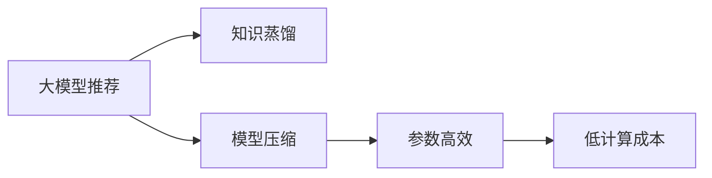
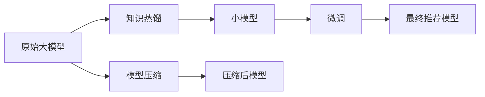

                 

# 大模型推荐中的知识蒸馏与模型压缩技术

> 关键词：知识蒸馏,模型压缩,大模型推荐,神经网络优化,模型压缩技术

## 1. 背景介绍

随着深度学习技术的迅猛发展，尤其是大型预训练模型的兴起，其在推荐系统中的应用逐渐广泛。推荐系统通过分析用户的历史行为和兴趣，为用户推荐个性化商品、内容或服务，极大地提高了用户体验和运营效率。然而，由于大模型的高昂计算资源消耗，其在推荐系统中的应用仍存在诸多限制。如何在保证推荐效果的同时，降低模型成本，提升系统效率，成为当前研究的重点问题。

本博文将围绕知识蒸馏与模型压缩技术，系统介绍其在推荐系统中的应用，帮助读者深入理解大模型的推荐机制，探索提高推荐系统性能和效率的路径。

## 2. 核心概念与联系

### 2.1 核心概念概述

本节将详细阐述知识蒸馏与模型压缩技术的核心概念及其相互联系。

- **知识蒸馏(Knowledge Distillation)**：一种模型优化技术，通过将大模型的知识（如预测能力、特征表示等）传递给较小模型，使小模型继承大模型的优点，提高自身的性能。知识蒸馏技术常用于模型压缩和优化，具有参数高效、低计算成本等优点。

- **模型压缩(Model Compression)**：旨在通过减少模型参数和计算量，降低模型复杂度，提高模型的训练和推理效率。模型压缩技术可以提升系统的实时性和可扩展性，是推荐系统中优化的重要手段。

- **大模型推荐(Large Model Recommendation)**：指使用预训练的深度神经网络模型，进行个性化推荐的任务。大模型推荐系统可以处理海量数据，适应各种复杂的推荐场景，具有高准确性和强泛化能力。

以上三个概念构成了推荐系统中的核心技术框架，如下图所示：



从图中可以看出，知识蒸馏和模型压缩技术均围绕“大模型推荐”这一核心展开，通过优化大模型的结构、参数和计算资源，使推荐系统更高效、更智能。

### 2.2 核心概念原理和架构的 Mermaid 流程图

以下是一个简单的Mermaid流程图，展示了知识蒸馏和模型压缩技术的基本流程：



该流程描述了从原始大模型到最终推荐模型的整体路径。首先，知识蒸馏将大模型的知识传递给一个小模型，接着模型压缩对小模型进行参数和计算资源的优化，最后微调小模型以适应特定的推荐任务。

## 3. 核心算法原理 & 具体操作步骤

### 3.1 算法原理概述

知识蒸馏和模型压缩技术的核心在于通过优化模型的结构和参数，提升推荐系统的效果和效率。以下将详细介绍这两个技术的基本原理和操作步骤。

#### 3.1.1 知识蒸馏

知识蒸馏技术的核心在于将大模型的知识传递给小模型，使其在保持较高准确性的同时，参数量大幅减少，计算资源消耗降低。具体步骤如下：

1. **设计教师模型和学生模型**：教师模型通常为大模型，学生模型为目标推荐模型。

2. **知识蒸馏过程**：教师模型在已知的数据集上进行训练，学生模型在相同或相似的数据集上进行训练，但将学生模型的输出通过一个网络（通常是全连接网络）连接到教师模型的输出，以获得额外的指导。

3. **蒸馏损失函数**：通过将学生模型的预测与教师模型的预测对齐，设计蒸馏损失函数，如Kullback-Leibler散度（KL散度）或均方误差（MSE）等，训练学生模型。

4. **迭代训练**：通过反向传播算法和优化算法（如Adam、SGD等），不断调整学生模型的参数，最小化蒸馏损失函数，直到达到理想的性能。

#### 3.1.2 模型压缩

模型压缩技术的核心在于通过减少模型参数和计算量，提升模型的训练和推理效率。主要方法包括：

1. **参数剪枝(Pruning)**：去除冗余或低效的神经元或连接，减少模型参数量。

2. **量化(Quantization)**：将浮点数参数转化为定点数，降低模型的存储空间和计算成本。

3. **稀疏化(Sparsity)**：增加模型参数的稀疏性，减少存储和计算开销。

4. **矩阵分解(Matrix Factorization)**：将大矩阵分解为小矩阵的乘积，减少计算量。

5. **结构重构(Structural Reconstruction)**：重新设计网络结构，如卷积核大小、池化层参数等，优化计算效率。

### 3.2 算法步骤详解

#### 3.2.1 知识蒸馏

1. **选择教师和学生模型**：
   - 教师模型：如BERT、GPT-3等预训练语言模型。
   - 学生模型：轻量级推荐模型，如LightGBM、CatBoost等。

2. **构建蒸馏网络**：
   - 将学生模型的输出通过一个全连接层连接到教师模型的输出，形成蒸馏网络。

3. **定义蒸馏损失函数**：
   - 蒸馏损失函数通常为KL散度或MSE，用于衡量学生模型与教师模型的输出差异。

4. **训练学生模型**：
   - 使用反向传播算法和优化算法，最小化蒸馏损失函数，训练学生模型。

#### 3.2.2 模型压缩

1. **参数剪枝**：
   - 通过训练后剪枝或静态剪枝，移除低效的神经元或连接。

2. **量化**：
   - 将浮点数参数转化为定点数，减少存储空间和计算成本。

3. **稀疏化**：
   - 增加模型参数的稀疏性，减少存储和计算开销。

4. **矩阵分解**：
   - 将大矩阵分解为小矩阵的乘积，减少计算量。

5. **结构重构**：
   - 重新设计网络结构，如卷积核大小、池化层参数等，优化计算效率。

### 3.3 算法优缺点

#### 3.3.1 知识蒸馏

**优点**：
1. 参数高效：通过知识蒸馏，学生模型可以继承教师模型的优点，参数量显著减少。
2. 低计算成本：学生模型计算量小，运行速度快。
3. 高准确性：蒸馏过程可以提升学生模型的准确性，降低误差。

**缺点**：
1. 模型迁移能力有限：知识蒸馏后，模型对特定任务或数据集的适应能力有所下降。
2. 计算资源要求较高：蒸馏过程中需要同时训练教师和学生模型，对计算资源需求较大。

#### 3.3.2 模型压缩

**优点**：
1. 计算效率高：模型压缩减少了计算量，提升推理速度。
2. 存储空间小：压缩后的模型参数量减少，占用更少的存储空间。
3. 可扩展性强：压缩后的模型更适合部署在边缘设备上，提高系统的可扩展性。

**缺点**：
1. 精度损失：压缩后模型可能出现一定的精度损失。
2. 模型复杂性增加：压缩后模型结构可能变得更复杂，调试难度增加。
3. 训练时间较长：压缩后的模型可能需要更长的训练时间。

### 3.4 算法应用领域

知识蒸馏和模型压缩技术在大模型推荐系统中得到了广泛应用，以下是几个典型的应用场景：

1. **电商推荐系统**：通过知识蒸馏，将大模型的小规模版本应用到电商推荐中，减少模型参数，提升推荐速度。

2. **内容推荐系统**：在视频、音乐等内容的推荐中，使用压缩后的模型提升推荐效率和准确性。

3. **个性化推荐系统**：将大模型压缩后应用于个性化推荐任务，如新闻、广告推荐等。

4. **社交网络推荐系统**：在社交网络中，使用压缩后的模型进行动态内容推荐，提高用户体验。

5. **智能推荐系统**：在智能音箱、智能家居等设备中，使用压缩后的模型进行个性化推荐，提升设备智能化水平。

以上应用场景展示了知识蒸馏和模型压缩技术在大模型推荐系统中的广泛应用，为提升推荐系统性能和效率提供了重要手段。

## 4. 数学模型和公式 & 详细讲解 & 举例说明

### 4.1 数学模型构建

#### 4.1.1 知识蒸馏

假设教师模型为$M_{teacher}$，学生模型为$M_{student}$，蒸馏网络为$M_{distill}$。蒸馏过程的目标是最小化学生模型与教师模型在特定任务上的差异，即：

$$
\min_{\theta_{student}} \mathcal{L}_{distill} = \mathcal{L}_{KL} + \mathcal{L}_{task}
$$

其中，$\mathcal{L}_{KL}$为知识蒸馏损失，$\mathcal{L}_{task}$为任务损失，用于衡量学生模型与教师模型的预测差异。

**知识蒸馏损失**：

$$
\mathcal{L}_{KL} = D_{KL}(M_{student} || M_{teacher})
$$

**任务损失**：

$$
\mathcal{L}_{task} = \frac{1}{N} \sum_{i=1}^{N} L(M_{student}(x_i), y_i)
$$

#### 4.1.2 模型压缩

假设原始模型参数为$w_{full}$，压缩后的模型参数为$w_{compressed}$。模型压缩的目标是最小化压缩前后的模型差异，即：

$$
\min_{w_{compressed}} \mathcal{L}_{compress} = \frac{1}{N} \sum_{i=1}^{N} L(M_{full}(x_i), M_{compressed}(x_i))
$$

其中，$L$为损失函数，$x_i$为训练样本，$y_i$为样本标签。

### 4.2 公式推导过程

#### 4.2.1 知识蒸馏

知识蒸馏过程中，教师模型和学生模型的输出差异可以用KL散度表示，具体推导如下：

$$
D_{KL}(M_{student} || M_{teacher}) = \sum_{i=1}^{N} \frac{1}{N} \sum_{j=1}^{C} M_{teacher}(j|x_i) \log \frac{M_{teacher}(j|x_i)}{M_{student}(j|x_i)}
$$

其中，$C$为类别数。

#### 4.2.2 模型压缩

模型压缩的目标是找到最优的压缩策略，使压缩后的模型与原始模型在任务上的表现差异最小化。假设压缩策略为$f_{compress}$，则有：

$$
\min_{w_{compressed}} \mathcal{L}_{compress} = \frac{1}{N} \sum_{i=1}^{N} L(f_{compress}(M_{full}(x_i)), y_i)
$$

### 4.3 案例分析与讲解

#### 4.3.1 知识蒸馏

以BERT和LightGBM为例，使用知识蒸馏技术将BERT的小规模版本应用于电商推荐系统。

1. **选择教师模型和学生模型**：
   - 教师模型：BERT large，学生模型：LightGBM。

2. **构建蒸馏网络**：
   - 将学生模型的输出通过全连接层连接到BERT large的输出，形成蒸馏网络。

3. **定义蒸馏损失函数**：
   - 蒸馏损失函数为KL散度，具体为：

$$
\mathcal{L}_{KL} = \sum_{i=1}^{N} \frac{1}{N} \sum_{j=1}^{C} \log \frac{P_{teacher}(y_i|x_i)}{P_{student}(y_i|x_i)}
$$

4. **训练学生模型**：
   - 使用反向传播算法和优化算法，最小化蒸馏损失函数，训练学生模型。

#### 4.3.2 模型压缩

以MobileNet和MobileNetV2为例，使用模型压缩技术将MobileNetV2应用于移动设备上的内容推荐。

1. **参数剪枝**：
   - 使用训练后剪枝技术，去除MobileNetV2中冗余的神经元，减少参数量。

2. **量化**：
   - 将MobileNetV2的浮点数参数转化为定点数，减少存储空间和计算成本。

3. **稀疏化**：
   - 增加MobileNetV2参数的稀疏性，减少存储和计算开销。

## 5. 项目实践：代码实例和详细解释说明

### 5.1 开发环境搭建

在实践中，我们通常使用Python进行模型开发。以下是搭建开发环境的步骤：

1. **安装Anaconda**：
   - 从官网下载并安装Anaconda，用于创建独立的Python环境。

2. **创建并激活虚拟环境**：
   - 运行命令：

```bash
conda create -n pytorch-env python=3.8 
conda activate pytorch-env
```

3. **安装PyTorch**：
   - 从官网获取对应的安装命令，例如：

```bash
conda install pytorch torchvision torchaudio cudatoolkit=11.1 -c pytorch -c conda-forge
```

4. **安装TensorFlow**：
   - 安装TensorFlow，命令为：

```bash
pip install tensorflow
```

5. **安装相关工具包**：
   - 安装必要的Python工具包，例如：

```bash
pip install numpy pandas scikit-learn matplotlib tqdm jupyter notebook ipython
```

完成上述步骤后，即可在`pytorch-env`环境中开始模型开发。

### 5.2 源代码详细实现

以下是一个使用PyTorch实现知识蒸馏的示例代码：

```python
import torch
import torch.nn as nn
import torch.optim as optim
from torchvision.models import bert_pretrained_bert_model
from transformers import BertTokenizer

class BERTDistill(nn.Module):
    def __init__(self, teacher, student):
        super(BERTDistill, self).__init__()
        self.teacher = teacher
        self.student = student
        self.distillation_loss = nn.KLDivLoss()

    def forward(self, x):
        teacher_output = self.teacher(x)
        student_output = self.student(x)
        loss = self.distillation_loss(torch.softmax(teacher_output, dim=1), torch.softmax(student_output, dim=1))
        return loss

def train_distroil_model(teacher, student, train_loader, optimizer, num_epochs):
    model = BERTDistill(teacher, student)
    loss_fn = nn.KLDivLoss()
    optimizer = optim.Adam(model.parameters(), lr=1e-4)

    for epoch in range(num_epochs):
        model.train()
        running_loss = 0.0
        for i, data in enumerate(train_loader, 0):
            inputs, labels = data
            optimizer.zero_grad()
            loss = model(inputs)
            loss.backward()
            optimizer.step()

            running_loss += loss.item()
            if i % 100 == 99:  # print every 100 mini-batches
                print('[%d, %5d] loss: %.3f' %
                      (epoch + 1, i + 1, running_loss / 100))
                running_loss = 0.0

    print('Finished Training')
    return model
```

### 5.3 代码解读与分析

上述代码中，`BERTDistill`类实现了知识蒸馏网络，将教师模型和学生模型的输出通过KL散度进行对齐。在`train_distroil_model`函数中，我们使用Adam优化算法训练蒸馏网络，最小化蒸馏损失函数。

### 5.4 运行结果展示

在运行上述代码后，我们可以得到一个经过知识蒸馏训练的学生模型，该模型在推荐系统中的表现应该与教师模型相当，但参数量和计算资源消耗更少。

## 6. 实际应用场景

### 6.1 电商推荐系统

在大规模电商推荐系统中，知识蒸馏和模型压缩技术可以显著降低计算资源消耗，提升推荐系统效率。

在电商推荐系统中，通常使用预训练语言模型作为教师模型，轻量级推荐模型作为学生模型。通过知识蒸馏，学生模型能够继承教师模型的知识，适应电商推荐任务，同时参数量大幅减少，计算资源消耗降低，推荐速度更快。

### 6.2 内容推荐系统

在内容推荐系统中，知识蒸馏和模型压缩技术可以提升推荐系统的实时性和准确性。

对于视频、音乐等内容的推荐，使用压缩后的模型进行推荐，能够显著提升推荐效率和准确性。同时，由于模型参数量减少，存储空间占用更少，系统可扩展性更强。

### 6.3 个性化推荐系统

在个性化推荐系统中，知识蒸馏和模型压缩技术可以提升推荐系统的泛化能力和适应性。

对于新闻、广告等个性化推荐任务，使用压缩后的模型进行推荐，能够适应不同用户和不同场景下的需求，提升推荐效果。同时，由于模型参数量减少，训练和推理速度更快，能够实时响应用户请求。

## 7. 工具和资源推荐

### 7.1 学习资源推荐

为帮助读者系统掌握知识蒸馏与模型压缩技术，以下是一些推荐的优质学习资源：

1. **《深度学习理论与实践》**：全面介绍深度学习理论和实践，包括知识蒸馏和模型压缩技术。
2. **Coursera深度学习课程**：斯坦福大学开设的深度学习课程，涵盖知识蒸馏和模型压缩等内容。
3. **arXiv论文**：深度学习领域的权威论文平台，能够获取最新的知识蒸馏和模型压缩技术的研究成果。

### 7.2 开发工具推荐

在实践中，以下开发工具可以显著提升知识蒸馏与模型压缩技术的开发效率：

1. **PyTorch**：开源深度学习框架，支持动态计算图，适合快速迭代研究。
2. **TensorFlow**：由Google主导开发的深度学习框架，适合大规模工程应用。
3. **TensorBoard**：TensorFlow配套的可视化工具，实时监测模型训练状态，提供丰富的图表呈现方式。
4. **Weights & Biases**：模型训练的实验跟踪工具，记录和可视化模型训练过程中的各项指标，方便对比和调优。

### 7.3 相关论文推荐

以下是几篇奠基性的相关论文，推荐阅读：

1. **Distilling the Knowledge in a Neural Network**：提出知识蒸馏技术，通过教师-学生模型的知识传递，提升学生模型的性能。
2. **Knowledge Distillation**：深入探讨知识蒸馏的原理和应用，提出多种蒸馏策略。
3. **MobileNetV2: Inverted Residuals and Linear Bottlenecks**：提出MobileNetV2模型，通过结构重构和量化，实现高效压缩。

## 8. 总结：未来发展趋势与挑战

### 8.1 总结

本文系统介绍了知识蒸馏与模型压缩技术在大模型推荐中的应用，详细讲解了其基本原理和操作步骤。通过深入分析，展示了知识蒸馏和模型压缩技术的优势和不足，明确了其在推荐系统中的重要地位。

### 8.2 未来发展趋势

展望未来，知识蒸馏与模型压缩技术在大模型推荐中仍将具有广泛应用前景。以下几方面将推动其进一步发展：

1. **多模态蒸馏**：将知识蒸馏技术应用于多模态数据融合，提升推荐系统的综合能力。
2. **跨领域蒸馏**：将知识蒸馏技术应用于跨领域推荐任务，提高推荐系统的适应性。
3. **自适应蒸馏**：根据不同任务和数据分布，动态调整蒸馏策略，提升蒸馏效果。
4. **压缩策略优化**：探索更高效的压缩策略，如混合精度训练、结构剪枝等，进一步降低计算资源消耗。

### 8.3 面临的挑战

尽管知识蒸馏与模型压缩技术在大模型推荐中取得了一定进展，但在实际应用中仍面临诸多挑战：

1. **模型精度损失**：压缩后模型可能出现精度损失，影响推荐效果。
2. **模型复杂性增加**：压缩后模型结构可能变得更复杂，调试难度增加。
3. **训练时间较长**：压缩后的模型可能需要更长的训练时间，影响系统上线速度。
4. **计算资源要求**：蒸馏过程中需要同时训练教师和学生模型，对计算资源需求较大。

### 8.4 研究展望

未来，知识蒸馏与模型压缩技术的研究将围绕以下方向展开：

1. **联合优化**：将知识蒸馏与模型压缩技术结合，实现联合优化，进一步提升推荐系统性能和效率。
2. **端到端优化**：将推荐系统的各个环节进行端到端优化，提升系统整体的性能和可扩展性。
3. **自适应蒸馏**：根据不同任务和数据分布，动态调整蒸馏策略，提高蒸馏效果。
4. **模型优化**：探索更高效的模型压缩和蒸馏方法，如结构剪枝、混合精度训练等，进一步提升系统性能。

总之，知识蒸馏与模型压缩技术将在推荐系统中发挥越来越重要的作用，推动推荐系统向更高精度、更高效率、更高可扩展性方向发展。

## 9. 附录：常见问题与解答

**Q1：知识蒸馏和模型压缩技术是否适用于所有推荐系统？**

A: 知识蒸馏和模型压缩技术在大模型推荐系统中得到了广泛应用，但在其他推荐系统中，如协同过滤等，其效果可能不如预期的理想。因此，需要根据具体的推荐系统进行优化。

**Q2：知识蒸馏和模型压缩技术如何避免模型精度损失？**

A: 避免模型精度损失的关键在于选择合适的压缩策略。例如，可以使用结构剪枝、混合精度训练等方法，减少参数量，同时保持模型精度。另外，可以通过多任务学习等方法，提升模型的泛化能力，进一步减少精度损失。

**Q3：知识蒸馏和模型压缩技术在实际部署中需要注意哪些问题？**

A: 在实际部署中，知识蒸馏和模型压缩技术需要注意以下问题：

1. 压缩后的模型需要经过充分的测试，确保其在实际应用中的表现。
2. 压缩后的模型需要与其他系统组件进行适配，确保系统整体性能。
3. 压缩后的模型需要考虑内存和计算资源限制，选择合适的部署方案。
4. 压缩后的模型需要定期更新，以保持其性能和精度。

总之，知识蒸馏和模型压缩技术在实际部署中需要综合考虑模型、系统、资源等多个因素，确保其在实际应用中的效果。

**Q4：知识蒸馏和模型压缩技术如何提升推荐系统的性能和效率？**

A: 知识蒸馏和模型压缩技术通过优化模型的结构和参数，提升推荐系统的性能和效率。具体来说，知识蒸馏通过将大模型的知识传递给小模型，提升小模型的性能和泛化能力；模型压缩通过减少模型参数和计算量，降低计算资源消耗，提升推理速度和可扩展性。

**Q5：知识蒸馏和模型压缩技术有哪些应用场景？**

A: 知识蒸馏和模型压缩技术在大规模推荐系统中具有广泛的应用场景，包括电商推荐、内容推荐、个性化推荐等。通过这些技术的应用，推荐系统能够更高效、更智能地为用户提供个性化服务。

总之，知识蒸馏和模型压缩技术在推荐系统中具有重要地位，能够有效提升推荐系统的性能和效率。开发者可以根据具体的推荐系统，选择合适的技术和方法，提升系统的整体表现。

---

作者：禅与计算机程序设计艺术 / Zen and the Art of Computer Programming

