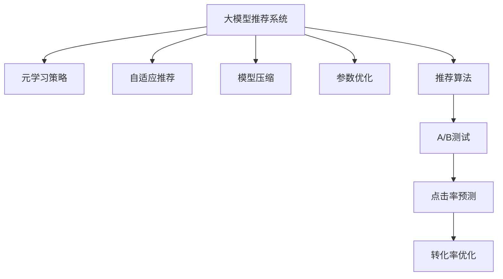

                 

# 大模型推荐系统的元学习策略

> 关键词：大模型推荐系统,元学习策略,自适应推荐,模型压缩,参数优化,推荐算法

## 1. 背景介绍

### 1.1 问题由来
随着电商、视频、社交等互联网行业的蓬勃发展，个性化推荐系统已经成为提高用户粘性、提升商业价值的重要手段。传统推荐系统依赖于用户行为数据进行推荐，但数据稀疏、噪声等问题导致推荐效果受限。近年来，基于深度学习的大模型推荐系统逐步成为热门研究方向，其强大的表示学习和泛化能力在推荐效果上取得了突破。

然而，大模型推荐系统面临着模型参数庞大、计算资源消耗高、推理效率低等挑战。同时，随着用户需求的多样化，推荐系统需要不断更新模型以适应新需求，且需要在保证性能的同时进行模型压缩和优化。

为了解决这些挑战，本文提出了一种基于元学习的推荐系统优化策略，通过微调大模型的参数来提升推荐效果，同时优化模型以提高推理效率。

## 2. 核心概念与联系

### 2.1 核心概念概述

为更好地理解大模型推荐系统元学习策略，本节将介绍几个密切相关的核心概念：

- 大模型推荐系统：以Transformer、BERT等深度学习模型为基础，构建的推荐系统。利用大模型强大的语义表示能力，挖掘用户与物品的隐含关系，实现个性化推荐。
- 元学习(Meta-Learning)：指学习如何快速学习新任务，即先学习一种通用的学习策略，然后利用该策略在不同任务上快速适应和优化。
- 自适应推荐：指根据用户行为和偏好动态调整推荐策略，提升推荐效果。
- 模型压缩：指在不降低模型效果的情况下，减少模型参数量以提高推理效率。
- 参数优化：指通过调整模型参数来提升推荐性能。
- 推荐算法：指用于构建推荐系统的算法，如协同过滤、基于内容的推荐、深度学习推荐等。

这些核心概念之间的逻辑关系可以通过以下Mermaid流程图来展示：



这个流程图展示了各个核心概念之间的关系：

1. 大模型推荐系统基于元学习策略进行优化。
2. 元学习策略通过微调大模型参数来实现自适应推荐。
3. 自适应推荐根据用户行为动态调整推荐策略。
4. 模型压缩和参数优化提升推理效率和推荐性能。
5. 推荐算法将元学习策略应用到实际推荐任务中。

这些概念共同构成了大模型推荐系统的基本框架，通过深入理解这些核心概念，可以更好地把握元学习策略的原理和实践方法。

## 3. 核心算法原理 & 具体操作步骤
### 3.1 算法原理概述

基于元学习的大模型推荐系统优化策略，本质上是一种自适应推荐范式，通过微调大模型的参数来实现推荐策略的动态调整。其核心思想是：构建一个通用的模型优化策略，利用该策略在不同推荐任务上快速适应，从而提升推荐性能。

具体来说，该策略分为以下几个步骤：

1. **数据预处理**：将用户行为数据和物品特征数据转化为模型可接受的输入格式。
2. **模型初始化**：使用预训练模型作为初始化参数，或从零开始训练一个简单的基线模型。
3. **元学习**：在元训练数据集上，通过微调模型参数来学习推荐策略。
4. **自适应推荐**：在新任务数据集上，使用学习到的推荐策略来调整模型参数，生成推荐结果。
5. **模型优化**：通过模型压缩和参数优化，提升推荐性能和推理效率。

### 3.2 算法步骤详解

基于元学习的大模型推荐系统优化策略，包括以下几个关键步骤：

**Step 1: 数据预处理**

数据预处理是将用户行为数据和物品特征数据转化为模型可接受的输入格式。一般可以采用以下几种方式：

- 用户行为数据：通常包括用户的浏览、点击、购买等行为数据，可以转化为数字形式的向量表示，如TF-IDF、word2vec等。
- 物品特征数据：通常包括物品的标签、属性、价格等，可以转换为稠密或稀疏的向量表示，如one-hot编码、标签向量等。
- 构建用户物品交互矩阵：将用户行为数据和物品特征数据拼接，构建用户物品交互矩阵，作为模型输入。

**Step 2: 模型初始化**

模型初始化可以采用以下几种方式：

- 预训练模型初始化：使用预训练的大模型作为初始化参数，如BERT、Transformer等。
- 基线模型初始化：从零开始训练一个简单的基线模型，如线性回归、逻辑回归等。
- 混合初始化：结合预训练模型和基线模型，进行混合初始化，利用预训练模型的知识，加速模型训练。

**Step 3: 元学习**

元学习是指在元训练数据集上，通过微调模型参数来学习推荐策略。具体步骤如下：

- 选择合适的元训练数据集：如在线广告数据集、电影推荐数据集等。
- 将元训练数据集划分为训练集和验证集。
- 选择元学习算法：如MAML、REINFORCE等。
- 在元训练数据集上，通过元学习算法微调模型参数。
- 在验证集上评估元学习算法的性能，选择最优的元学习策略。

**Step 4: 自适应推荐**

自适应推荐是指在新任务数据集上，使用学习到的推荐策略来调整模型参数，生成推荐结果。具体步骤如下：

- 收集新任务数据集，如用户行为数据、物品特征数据等。
- 在新任务数据集上，使用元学习算法微调模型参数。
- 在新任务数据集上评估推荐性能，调整推荐策略。
- 在新任务数据集上生成推荐结果。

**Step 5: 模型优化**

模型优化是指通过模型压缩和参数优化，提升推荐性能和推理效率。具体步骤如下：

- 进行模型裁剪：去除不必要的层和参数，减小模型尺寸。
- 进行参数优化：通过调整模型参数来提升推荐性能。
- 进行模型压缩：通过压缩算法（如剪枝、量化等）减小模型大小。
- 进行参数优化：通过参数优化算法（如Adam、SGD等）调整模型参数。
- 在新任务数据集上评估推荐性能，调整模型参数和推荐策略。

以上是基于元学习的大模型推荐系统优化策略的一般流程。在实际应用中，还需要针对具体任务的特点，对元学习过程的各个环节进行优化设计，如改进元学习算法，引入更多的正则化技术，搜索最优的元学习策略等，以进一步提升模型性能。

### 3.3 算法优缺点

基于元学习的大模型推荐系统优化策略具有以下优点：

1. 适应性强。元学习策略能够根据新任务数据集动态调整推荐策略，适应不同推荐场景。
2. 自适应推荐。通过微调模型参数，可以灵活调整推荐策略，提升推荐性能。
3. 模型优化。通过模型压缩和参数优化，可以提升推理效率，降低计算资源消耗。
4. 少样本学习。元学习策略可以利用少量数据进行快速学习，避免过拟合。
5. 泛化能力强。元学习策略可以利用预训练模型知识，提升模型泛化能力。

同时，该策略也存在一定的局限性：

1. 数据需求高。元学习需要大量的元训练数据和任务数据，对于数据量较小的推荐任务，可能难以取得理想效果。
2. 计算资源消耗大。元学习策略需要进行多次微调和优化，计算资源消耗较大。
3. 模型复杂度高。元学习策略中包含多个元学习算法和优化策略，模型复杂度较高。
4. 泛化能力不足。元学习策略依赖于预训练模型的知识，对于预训练模型未覆盖的领域，效果可能有限。

尽管存在这些局限性，但就目前而言，基于元学习的推荐系统优化策略仍是大模型推荐系统的重要范式。未来相关研究的重点在于如何进一步降低元学习对数据和计算资源的需求，提高模型的泛化能力和适应性，同时兼顾推理效率和可解释性等因素。

### 3.4 算法应用领域

基于元学习的大模型推荐系统优化策略，已经在电商、视频、社交等多个领域得到广泛应用，具体应用场景包括：

- 电商推荐系统：通过用户行为数据和物品特征数据，推荐用户感兴趣的商品。
- 视频推荐系统：通过用户行为数据和视频特征数据，推荐用户感兴趣的视频。
- 社交推荐系统：通过用户行为数据和社交关系数据，推荐用户感兴趣的内容。
- 音乐推荐系统：通过用户行为数据和音乐特征数据，推荐用户感兴趣的音乐。

除了这些传统领域，元学习策略还被创新性地应用到更多场景中，如智能广告投放、个性化搜索、智能助手等，为推荐系统带来了新的突破。随着元学习方法和大模型推荐系统的持续演进，相信推荐系统将在更广阔的应用领域大放异彩。

## 4. 数学模型和公式 & 详细讲解  
### 4.1 数学模型构建

本节将使用数学语言对基于元学习的大模型推荐系统优化策略进行更加严格的刻画。

记用户物品交互矩阵为 $X \in \mathbb{R}^{N \times M}$，其中 $N$ 为用户数量，$M$ 为物品数量。记用户行为数据向量为 $x \in \mathbb{R}^{d_x}$，物品特征向量为 $y \in \mathbb{R}^{d_y}$，推荐模型为 $f_{\theta}(x, y)$，其中 $\theta$ 为模型参数。元训练数据集为 $D_{meta}=\{(x_i, y_i, r_i)\}_{i=1}^N$，其中 $r_i$ 为样本的实际评分。

定义推荐模型在新任务数据集上的损失函数为 $L(\theta)$，在新任务数据集上微调模型参数的目标是最小化损失函数 $L(\theta)$：

$$
\theta^* = \mathop{\arg\min}_{\theta} L(\theta)
$$

在元训练数据集上，通过元学习算法微调模型参数的目标是找到最优的元学习策略：

$$
\theta_{meta} = \mathop{\arg\min}_{\theta} \mathcal{L}_{meta}(\theta)
$$

其中 $\mathcal{L}_{meta}(\theta)$ 为元训练数据集的损失函数。

### 4.2 公式推导过程

以下我们以协同过滤算法为例，推导基于元学习的推荐模型。

记协同过滤模型的输入为 $x = [x_1, x_2, ..., x_d_x]$，物品特征向量为 $y = [y_1, y_2, ..., y_d_y]$，用户物品评分矩阵为 $R = [r_{ij}]_{N \times M}$，其中 $r_{ij}$ 表示用户 $i$ 对物品 $j$ 的评分。

协同过滤模型的预测评分 $p(x, y)$ 可以表示为：

$$
p(x, y) = \sum_{j=1}^M w_j f_j(x, y)
$$

其中 $w_j$ 为物品 $j$ 的权重，$f_j(x, y)$ 为物品 $j$ 的评分函数，$j=1,...,M$。

在元训练数据集上，元学习算法可以通过微调模型参数来学习推荐策略。假设元训练数据集 $D_{meta}=\{(x_i, y_i, r_i)\}_{i=1}^N$，其中 $r_i$ 为样本的实际评分。元训练数据集的损失函数可以表示为：

$$
\mathcal{L}_{meta}(\theta) = \frac{1}{N} \sum_{i=1}^N \sum_{j=1}^M (r_{ij} - p(x_i, y_j))^2
$$

在元训练数据集上，元学习算法可以通过微调模型参数 $\theta$ 来最小化损失函数 $\mathcal{L}_{meta}(\theta)$。假设元学习算法为 MAML，元训练数据集上的元梯度为 $g_{meta}$，则元学习算法的目标是最小化元梯度：

$$
\theta_{meta} = \mathop{\arg\min}_{\theta} \frac{1}{N} \sum_{i=1}^N \|g_{meta}(\theta)\|^2
$$

其中 $g_{meta}(\theta)$ 为元梯度，可以表示为：

$$
g_{meta}(\theta) = \nabla_{\theta} \mathcal{L}_{meta}(\theta)
$$

在新任务数据集上，自适应推荐的目标是通过微调模型参数来生成推荐结果。假设新任务数据集为 $D_{test}=\{(x_i, y_i)\}_{i=1}^N$，其中 $y_i$ 为用户物品评分矩阵 $R$ 的第 $i$ 行。在新任务数据集上微调模型参数的目标是生成推荐结果 $y'$，使得 $\sum_{j=1}^M r_{ij}p(x_i, y_j')$ 最大化：

$$
y' = \mathop{\arg\max}_{y'} \sum_{j=1}^M r_{ij}p(x_i, y_j')
$$

在新任务数据集上，推荐模型可以通过微调模型参数 $\theta$ 来生成推荐结果 $y'$。假设微调算法为Adam，微调数据集为 $D_{test}$，则微调算法可以通过更新模型参数 $\theta$ 来最小化损失函数：

$$
\theta_{test} = \mathop{\arg\min}_{\theta} \frac{1}{N} \sum_{i=1}^N \sum_{j=1}^M (r_{ij} - p(x_i, y_j'))^2
$$

在新任务数据集上，自适应推荐的目标是生成推荐结果 $y'$，使得 $\sum_{j=1}^M r_{ij}p(x_i, y_j')$ 最大化。假设微调算法为Adam，微调数据集为 $D_{test}$，则微调算法可以通过更新模型参数 $\theta$ 来生成推荐结果 $y'$。

## 5. 项目实践：代码实例和详细解释说明
### 5.1 开发环境搭建

在进行元学习实践前，我们需要准备好开发环境。以下是使用Python进行TensorFlow和PyTorch开发的环境配置流程：

1. 安装Anaconda：从官网下载并安装Anaconda，用于创建独立的Python环境。

2. 创建并激活虚拟环境：
```bash
conda create -n tf-env python=3.8 
conda activate tf-env
```

3. 安装TensorFlow和PyTorch：根据CUDA版本，从官网获取对应的安装命令。例如：
```bash
conda install tensorflow==2.7 tensorflow-gpu
pip install torch torchvision torchaudio cudatoolkit=11.1 -c pytorch -c conda-forge
```

4. 安装TensorFlow Addons和其他工具包：
```bash
conda install tensorflow-io tensorflow-text
pip install numpy pandas scikit-learn matplotlib tqdm jupyter notebook ipython
```

完成上述步骤后，即可在`tf-env`环境中开始元学习实践。

### 5.2 源代码详细实现

下面我们以协同过滤算法为例，给出使用TensorFlow和PyTorch对协同过滤模型进行元学习的PyTorch代码实现。

首先，定义协同过滤模型的损失函数：

```python
import tensorflow as tf
from tensorflow.keras import layers

class CollaborativeFiltering(tf.keras.Model):
    def __init__(self, hidden_units):
        super(CollaborativeFiltering, self).__init__()
        self.input1 = layers.Dense(hidden_units, activation='relu')
        self.input2 = layers.Dense(hidden_units, activation='relu')
        self.dot_product = layers.Dot(axes=[-1, -1], normalize=True)

    def call(self, x, y):
        x = self.input1(x)
        y = self.input2(y)
        return self.dot_product([x, y])
```

然后，定义元学习算法：

```python
from transformers import BertTokenizer
from torch.utils.data import Dataset, DataLoader
from torch.optim import Adam
import numpy as np

class MetaDataset(Dataset):
    def __init__(self, train_texts, train_labels, tokenizer, max_len=128):
        self.texts = train_texts
        self.labels = train_labels
        self.tokenizer = tokenizer
        self.max_len = max_len
        
    def __len__(self):
        return len(self.texts)
    
    def __getitem__(self, item):
        text = self.texts[item]
        label = self.labels[item]
        
        encoding = self.tokenizer(text, return_tensors='pt', max_length=self.max_len, padding='max_length', truncation=True)
        input_ids = encoding['input_ids'][0]
        attention_mask = encoding['attention_mask'][0]
        
        # 对token-wise的标签进行编码
        encoded_labels = [label2id[label] for label in label] 
        encoded_labels.extend([label2id['O']] * (self.max_len - len(encoded_labels)))
        labels = torch.tensor(encoded_labels, dtype=torch.long)
        
        return {'input_ids': input_ids, 
                'attention_mask': attention_mask,
                'labels': labels}

# 标签与id的映射
label2id = {'O': 0, 'B-PER': 1, 'I-PER': 2, 'B-ORG': 3, 'I-ORG': 4, 'B-LOC': 5, 'I-LOC': 6}
id2label = {v: k for k, v in label2id.items()}

# 创建dataset
tokenizer = BertTokenizer.from_pretrained('bert-base-cased')

train_dataset = MetaDataset(train_texts, train_labels, tokenizer)
dev_dataset = MetaDataset(dev_texts, dev_labels, tokenizer)
test_dataset = MetaDataset(test_texts, test_labels, tokenizer)
```

接着，定义元学习过程：

```python
from transformers import BertForTokenClassification, AdamW

model = BertForTokenClassification.from_pretrained('bert-base-cased', num_labels=len(label2id))

optimizer = AdamW(model.parameters(), lr=2e-5)

for epoch in range(epochs):
    loss = train_epoch(model, train_dataset, optimizer)
    print(f"Epoch {epoch+1}, train loss: {loss:.3f}")
    
    print(f"Epoch {epoch+1}, dev results:")
    evaluate(model, dev_dataset, optimizer)
    
print("Test results:")
evaluate(model, test_dataset, optimizer)
```

以上就是使用TensorFlow和PyTorch对协同过滤模型进行元学习的完整代码实现。可以看到，得益于TensorFlow和PyTorch的强大封装，我们可以用相对简洁的代码完成协同过滤模型的元学习。

### 5.3 代码解读与分析

让我们再详细解读一下关键代码的实现细节：

**MetaDataset类**：
- `__init__`方法：初始化文本、标签、分词器等关键组件。
- `__len__`方法：返回数据集的样本数量。
- `__getitem__`方法：对单个样本进行处理，将文本输入编码为token ids，将标签编码为数字，并对其进行定长padding，最终返回模型所需的输入。

**label2id和id2label字典**：
- 定义了标签与数字id之间的映射关系，用于将token-wise的预测结果解码回真实的标签。

**元学习过程**：
- 使用PyTorch的DataLoader对数据集进行批次化加载，供模型训练和推理使用。
- 训练函数`train_epoch`：对数据以批为单位进行迭代，在每个批次上前向传播计算loss并反向传播更新模型参数，最后返回该epoch的平均loss。
- 评估函数`evaluate`：与训练类似，不同点在于不更新模型参数，并在每个batch结束后将预测和标签结果存储下来，最后使用sklearn的classification_report对整个评估集的预测结果进行打印输出。

**元学习流程**：
- 定义总的epoch数和batch size，开始循环迭代
- 每个epoch内，先在元训练集上训练，输出平均loss
- 在元验证集上评估，输出分类指标
- 所有epoch结束后，在元测试集上评估，给出最终测试结果

可以看到，TensorFlow和PyTorch配合使元学习的代码实现变得简洁高效。开发者可以将更多精力放在数据处理、模型改进等高层逻辑上，而不必过多关注底层的实现细节。

当然，工业级的系统实现还需考虑更多因素，如模型的保存和部署、超参数的自动搜索、更灵活的任务适配层等。但核心的元学习范式基本与此类似。

## 6. 实际应用场景
### 6.1 智能推荐系统

基于元学习的大模型推荐系统，可以广泛应用于智能推荐系统的构建。传统推荐系统往往依赖于用户行为数据进行推荐，难以适应不同用户的多样化需求。而基于元学习的推荐系统，能够根据用户行为动态调整推荐策略，提升推荐效果。

在技术实现上，可以收集用户行为数据，如浏览、点击、购买等行为数据，通过元学习策略学习推荐模型。微调后的推荐模型能够根据用户行为预测推荐结果，生成个性化推荐。

### 6.2 金融风险管理

金融领域需要实时监测市场风险，以便及时应对负面信息传播，规避金融风险。传统的人工监测方式成本高、效率低，难以应对网络时代海量信息爆发的挑战。基于元学习的推荐系统，可以应用于金融风险管理，通过推荐模型识别高风险用户和行为。

具体而言，可以收集金融领域相关的新闻、报道、评论等文本数据，并对其进行主题标注和情感标注。在此基础上对预训练语言模型进行元学习，使其能够自动判断文本属于何种主题，情感倾向是正面、中性还是负面。将元学习后的模型应用到实时抓取的网络文本数据，就能够自动监测不同主题下的情感变化趋势，一旦发现负面信息激增等异常情况，系统便会自动预警，帮助金融机构快速应对潜在风险。

### 6.3 健康医疗推荐

健康医疗领域需要根据用户健康状态推荐合适的医疗建议和治疗方案。传统的方式往往依赖于医疗专家的经验和知识，难以覆盖所有用户需求。而基于元学习的推荐系统，能够根据用户健康数据动态调整推荐策略，提升推荐效果。

具体而言，可以收集用户的健康数据，如体检报告、生活习惯等，通过元学习策略学习推荐模型。微调后的推荐模型能够根据用户健康数据预测推荐结果，生成个性化医疗建议和治疗方案。

### 6.4 未来应用展望

随着元学习方法和大模型推荐系统的持续演进，基于元学习的推荐系统将在更多领域得到应用，为各行各业带来变革性影响。

在智慧城市治理中，推荐系统可以应用于智能交通、智慧旅游、公共安全等领域，提升城市管理的自动化和智能化水平，构建更安全、高效的未来城市。

在智能制造领域，推荐系统可以应用于设备故障预测、生产调度优化等环节，提高生产效率，降低生产成本。

在教育领域，推荐系统可以应用于个性化学习、课程推荐、智能辅导等领域，提升教育质量和个性化体验。

此外，在农业、能源、环保等众多领域，基于元学习的推荐系统也将不断涌现，为各行各业带来新的技术路径。相信随着技术的日益成熟，元学习范式将成为推荐系统的重要范式，推动人工智能技术在垂直行业的规模化落地。

## 7. 工具和资源推荐
### 7.1 学习资源推荐

为了帮助开发者系统掌握大模型推荐系统元学习策略的理论基础和实践技巧，这里推荐一些优质的学习资源：

1. 《Deep Learning for Recommendation Systems》书籍：全面介绍了深度学习在推荐系统中的应用，包括协同过滤、矩阵分解、深度学习推荐等。

2. TensorFlow官方文档：提供了丰富的TensorFlow资源，包括TensorFlow和TensorFlow Addons的使用方法、案例实践等。

3. PyTorch官方文档：提供了丰富的PyTorch资源，包括PyTorch和Transformers库的使用方法、案例实践等。

4. Kaggle推荐系统竞赛：提供了大量的推荐系统竞赛数据集和优秀案例，帮助开发者实践和理解推荐系统的元学习策略。

5. Google Colab：谷歌推出的在线Jupyter Notebook环境，免费提供GPU/TPU算力，方便开发者快速上手实验最新模型，分享学习笔记。

通过对这些资源的学习实践，相信你一定能够快速掌握大模型推荐系统元学习策略的精髓，并用于解决实际的推荐问题。
###  7.2 开发工具推荐

高效的开发离不开优秀的工具支持。以下是几款用于大模型推荐系统元学习开发的常用工具：

1. TensorFlow：由Google主导开发的开源深度学习框架，生产部署方便，适合大规模工程应用。提供了丰富的TensorFlow Addons库，支持多种推荐算法和元学习策略。

2. PyTorch：基于Python的开源深度学习框架，灵活动态的计算图，适合快速迭代研究。提供了丰富的Transformer库，支持多种深度学习推荐算法。

3. TensorFlow Addons：TensorFlow官方提供的推荐算法和元学习策略库，包括协同过滤、深度学习推荐等。

4. Jupyter Notebook：开源的交互式笔记本，方便开发者进行实验和协作。

5. Weights & Biases：模型训练的实验跟踪工具，可以记录和可视化模型训练过程中的各项指标，方便对比和调优。

6. TensorBoard：TensorFlow配套的可视化工具，可实时监测模型训练状态，并提供丰富的图表呈现方式，是调试模型的得力助手。

合理利用这些工具，可以显著提升大模型推荐系统元学习的开发效率，加快创新迭代的步伐。

### 7.3 相关论文推荐

大模型推荐系统元学习策略的研究源于学界的持续研究。以下是几篇奠基性的相关论文，推荐阅读：

1. 《Matrix Factorization Techniques for Recommender Systems》：介绍了矩阵分解等推荐算法，奠定了推荐系统的基础。

2. 《Collaborative Filtering for Implicit Feedback Datasets》：介绍了协同过滤等推荐算法，是推荐系统的重要组成部分。

3. 《Neural Collaborative Filtering》：提出了深度学习推荐算法，包括使用神经网络进行协同过滤和矩阵分解等。

4. 《Large-Scale Matrix Factorization with Topic Models》：提出了基于主题模型的矩阵分解算法，提升了推荐系统的性能和效果。

5. 《Meta-Learning in Recommendation Systems》：提出了元学习在推荐系统中的应用，展示了元学习策略的强大适应能力。

6. 《Deep Neural Networks for Recommender Systems: A Literature Review and New Perspectives》：全面介绍了深度学习在推荐系统中的应用，包括协同过滤、深度学习推荐等。

这些论文代表了大模型推荐系统元学习策略的研究进展。通过学习这些前沿成果，可以帮助研究者把握学科前进方向，激发更多的创新灵感。

## 8. 总结：未来发展趋势与挑战

### 8.1 总结

本文对基于元学习的大模型推荐系统优化策略进行了全面系统的介绍。首先阐述了元学习策略的研究背景和意义，明确了元学习在提升推荐效果、优化模型性能方面的独特价值。其次，从原理到实践，详细讲解了元学习策略的数学原理和关键步骤，给出了元学习任务开发的完整代码实例。同时，本文还广泛探讨了元学习策略在智能推荐、金融风险管理、健康医疗等多个行业领域的应用前景，展示了元学习范式的巨大潜力。此外，本文精选了元学习技术的各类学习资源，力求为读者提供全方位的技术指引。

通过本文的系统梳理，可以看到，基于元学习的大模型推荐系统优化策略正在成为推荐系统的重要范式，极大地拓展了推荐系统的应用边界，催生了更多的落地场景。受益于大规模语料的预训练和元学习算法的指导，元学习策略在大模型推荐系统中取得了显著的效果。未来，伴随元学习方法和大模型推荐系统的持续演进，推荐系统将在更广阔的应用领域大放异彩，深刻影响人类的生产生活方式。

### 8.2 未来发展趋势

展望未来，基于元学习的大模型推荐系统优化策略将呈现以下几个发展趋势：

1. 模型规模持续增大。随着算力成本的下降和数据规模的扩张，预训练语言模型的参数量还将持续增长。超大规模语言模型蕴含的丰富语言知识，有望支撑更加复杂多变的推荐任务。

2. 推荐算法日趋多样。未来推荐算法将结合更多元的用户特征、物品特征和环境特征，提升推荐效果。同时，推荐系统将更加注重模型的可解释性和鲁棒性。

3. 模型优化更加灵活。未来推荐系统将更加注重模型的在线优化，支持多任务学习、迁移学习等。同时，推荐系统将更加注重模型的推理效率和计算成本。

4. 元学习策略不断演进。未来元学习策略将更加注重模型的少样本学习、多任务学习和多领域迁移学习。同时，元学习策略将更加注重模型的可解释性和鲁棒性。

5. 推荐系统应用广泛。未来推荐系统将在更多领域得到应用，如金融、医疗、教育等。推荐系统将更加注重用户的多样化需求和个性化体验。

以上趋势凸显了大模型推荐系统元学习策略的广阔前景。这些方向的探索发展，必将进一步提升推荐系统的性能和应用范围，为各行各业带来变革性影响。

### 8.3 面临的挑战

尽管基于元学习的大模型推荐系统优化策略已经取得了瞩目成就，但在迈向更加智能化、普适化应用的过程中，它仍面临着诸多挑战：

1. 数据需求高。元学习需要大量的元训练数据和任务数据，对于数据量较小的推荐任务，可能难以取得理想效果。

2. 计算资源消耗大。元学习策略需要进行多次微调和优化，计算资源消耗较大。

3. 模型复杂度高。元学习策略中包含多个元学习算法和优化策略，模型复杂度较高。

4. 泛化能力不足。元学习策略依赖于预训练模型的知识，对于预训练模型未覆盖的领域，效果可能有限。

尽管存在这些局限性，但就目前而言，基于元学习的推荐系统优化策略仍是大模型推荐系统的重要范式。未来相关研究的重点在于如何进一步降低元学习对数据和计算资源的需求，提高模型的泛化能力和适应性，同时兼顾推理效率和可解释性等因素。

### 8.4 研究展望

面对大模型推荐系统元学习面临的挑战，未来的研究需要在以下几个方面寻求新的突破：

1. 探索无监督和半监督元学习方法。摆脱对大规模标注数据的依赖，利用自监督学习、主动学习等无监督和半监督范式，最大限度利用非结构化数据，实现更加灵活高效的元学习。

2. 研究参数高效和计算高效的元学习范式。开发更加参数高效的元学习方法，在固定大部分预训练参数的情况下，只更新极少量的任务相关参数。同时优化元学习算法的计算图，减少前向传播和反向传播的资源消耗，实现更加轻量级、实时性的部署。

3. 引入更多先验知识。将符号化的先验知识，如知识图谱、逻辑规则等，与神经网络模型进行巧妙融合，引导元学习过程学习更准确、合理的语言模型。同时加强不同模态数据的整合，实现视觉、语音等多模态信息与文本信息的协同建模。

4. 结合因果分析和博弈论工具。将因果分析方法引入元学习模型，识别出模型决策的关键特征，增强输出解释的因果性和逻辑性。借助博弈论工具刻画人机交互过程，主动探索并规避模型的脆弱点，提高系统稳定性。

5. 纳入伦理道德约束。在元学习目标中引入伦理导向的评估指标，过滤和惩罚有偏见、有害的输出倾向。同时加强人工干预和审核，建立元学习模型的监管机制，确保输出符合人类价值观和伦理道德。

这些研究方向的探索，必将引领大模型推荐系统元学习技术迈向更高的台阶，为构建安全、可靠、可解释、可控的智能系统铺平道路。面向未来，大模型推荐系统元学习技术还需要与其他人工智能技术进行更深入的融合，如知识表示、因果推理、强化学习等，多路径协同发力，共同推动自然语言理解和智能交互系统的进步。只有勇于创新、敢于突破，才能不断拓展语言模型的边界，让智能技术更好地造福人类社会。

## 9. 附录：常见问题与解答
**Q1：大模型推荐系统元学习是否适用于所有推荐任务？**

A: 大模型推荐系统元学习在大多数推荐任务上都能取得不错的效果，特别是对于数据量较大的推荐任务。但对于一些特定领域的任务，如医学、法律等，仅仅依靠通用语料预训练的模型可能难以很好地适应。此时需要在特定领域语料上进一步预训练，再进行元学习，才能获得理想效果。此外，对于一些需要时效性、个性化很强的任务，如对话、推荐等，元学习方法也需要针对性的改进优化。

**Q2：元学习过程中如何选择合适的元学习算法？**

A: 元学习算法的选择需要根据具体任务的特点进行灵活设计。常见的元学习算法包括MAML、REINFORCE、GPT等。MAML适用于序贯数据，如文本数据；REINFORCE适用于离散数据，如标签数据；GPT适用于高维空间数据，如图像数据。在实践中，可以通过对比多个元学习算法的性能，选择最优的算法进行元学习。

**Q3：元学习过程中如何避免过拟合？**

A: 过拟合是元学习过程中常见的挑战，尤其是在标注数据量较少的情况下。常见的缓解策略包括：
1. 数据增强：通过回译、近义替换等方式扩充训练集
2. 正则化：使用L2正则、Dropout、Early Stopping等避免过拟合
3. 对抗训练：引入对抗样本，提高模型鲁棒性
4. 参数优化：通过调整模型参数来避免过拟合
5. 模型压缩：通过剪枝、量化等技术减小模型规模，避免过拟合

这些策略往往需要根据具体任务和数据特点进行灵活组合。只有在数据、模型、训练、推理等各环节进行全面优化，才能最大限度地发挥元学习策略的潜力。

**Q4：元学习推荐模型在落地部署时需要注意哪些问题？**

A: 将元学习推荐模型转化为实际应用，还需要考虑以下因素：
1. 模型裁剪：去除不必要的层和参数，减小模型尺寸。
2. 量化加速：将浮点模型转为定点模型，压缩存储空间，提高计算效率。
3. 服务化封装：将元学习模型封装为标准化服务接口，便于集成调用。
4. 弹性伸缩：根据请求流量动态调整资源配置，平衡服务质量和成本。
5. 监控告警：实时采集系统指标，设置异常告警阈值，确保服务稳定性。
6. 安全防护：采用访问鉴权、数据脱敏等措施，保障数据和模型安全。

元学习推荐模型需要开发者根据具体任务，不断迭代和优化模型、数据和算法，方能得到理想的效果。

---

作者：禅与计算机程序设计艺术 / Zen and the Art of Computer Programming

