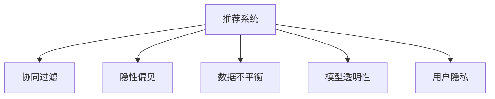

                 

# 大模型推荐系统的公平性研究

> 关键词：公平性,推荐系统,大模型,偏差消除,算法透明,用户隐私,数据保护

## 1. 背景介绍

### 1.1 问题由来
随着人工智能和大数据技术的发展，推荐系统已成为互联网企业和电商平台不可或缺的核心技术。推荐系统通过分析用户行为和兴趣偏好，为用户推荐个性化的产品和服务，从而提升用户体验和满意度。然而，现有的推荐算法往往存在一定程度的偏见，导致不同用户群体获得的推荐结果不尽公平。

例如，基于协同过滤的推荐算法往往只考虑用户和物品之间的评分数据，忽视了用户的其他属性信息，如年龄、性别、地域等。这就可能导致在性别、年龄、地域等方面存在隐性偏见，影响推荐结果的公平性。特别是在广告投放和贷款审批等敏感领域，推荐系统可能会加剧社会不平等，引发严重的社会问题。

### 1.2 问题核心关键点
推荐系统公平性问题主要体现在以下几个方面：

- **隐性偏见**：现有推荐算法往往基于用户的显式评分数据进行推荐，忽视了用户属性（如性别、年龄、地域等）对行为的影响。这种隐性偏见可能导致推荐结果不公平，加剧社会不平等。
- **数据不平衡**：推荐系统训练数据往往存在样本不平衡问题，导致某些用户群体的推荐效果较差，无法享受公平的推荐服务。
- **模型透明性不足**：现有推荐模型通常是黑盒模型，难以解释其内部决策逻辑，不利于检测和纠正偏见。
- **用户隐私保护**：推荐系统需要收集和分析用户的个人数据，如何保护用户隐私，避免数据泄露和滥用，是一个重要的挑战。

解决推荐系统公平性问题，不仅需要技术创新，还需要从算法设计、数据采集、用户权益保护等多个维度综合考虑。

## 2. 核心概念与联系

### 2.1 核心概念概述

为更好地理解推荐系统公平性问题的本质和解决方案，本节将介绍几个密切相关的核心概念：

- **推荐系统(Recommender System)**：通过分析用户行为和物品属性，为用户推荐最相关的产品或服务的系统。
- **协同过滤(Collaborative Filtering)**：基于用户评分数据进行推荐，通过分析相似用户或物品之间的评分关系，预测用户对新物品的评分，并推荐评分较高的物品。
- **隐性偏见(Implicit Bias)**：推荐算法对某些用户群体产生的隐性偏见，如性别、年龄、地域等，导致推荐结果不公平。
- **数据不平衡(Data Imbalance)**：推荐系统训练数据中不同用户群体（如男性、女性、老年用户）的样本量差异较大，导致模型在特定群体上性能较差。
- **模型透明性(Model Transparency)**：推荐模型的内部决策逻辑应易于理解，便于检测和消除偏见。
- **用户隐私(User Privacy)**：在推荐过程中，用户数据的收集、存储、使用应遵循隐私保护原则，避免数据滥用和泄露。

这些核心概念之间的逻辑关系可以通过以下Mermaid流程图来展示：



这个流程图展示了几大核心概念及其之间的关系：

1. 推荐系统通过协同过滤等算法进行推荐。
2. 协同过滤可能导致隐性偏见，导致推荐结果不公平。
3. 推荐系统训练数据可能存在数据不平衡问题。
4. 推荐模型应具有透明性，便于检测和纠正偏见。
5. 推荐过程中应保护用户隐私，避免数据滥用和泄露。

这些概念共同构成了推荐系统公平性问题的研究框架，指引我们设计公平、透明、可靠的推荐系统。

## 3. 核心算法原理 & 具体操作步骤
### 3.1 算法原理概述

推荐系统公平性问题是一个复杂的多学科交叉问题，涉及统计学、数据科学、计算机科学等多个领域。解决公平性问题，需要从算法设计、数据采集、用户权益保护等多个维度进行综合优化。

### 3.2 算法步骤详解

**Step 1: 数据采集与预处理**
- 收集用户行为数据，包括浏览、点击、评分、评论等行为。
- 收集用户属性数据，如年龄、性别、地域、职业等。
- 对数据进行预处理，如去噪、归一化、缺失值处理等。

**Step 2: 公平性指标设计**
- 设计公平性指标，如Demographic Parity、Equalized Odds等。
- 使用统计学方法对推荐系统进行公平性评估。

**Step 3: 公平性增强算法设计**
- 设计公平性增强算法，如公平重加权、公平降维等。
- 使用模型选择算法，选择具有较好公平性能的模型。

**Step 4: 模型训练与评估**
- 使用公平性增强算法对推荐模型进行训练。
- 在训练集和验证集上进行公平性评估，调整模型参数。
- 在测试集上进行公平性和推荐性能评估。

**Step 5: 部署与监控**
- 将训练好的模型部署到推荐系统中。
- 实时监控推荐系统性能，及时调整模型参数。

### 3.3 算法优缺点

推荐系统公平性增强算法具有以下优点：
1. 提高推荐系统的公平性，减少不同用户群体间的差距。
2. 增强模型的透明性，便于检测和纠正偏见。
3. 保护用户隐私，避免数据滥用和泄露。

同时，该方法也存在一些局限性：
1. 增加了算法的复杂度和计算成本。
2. 可能引入新的偏见，需要仔细设计算法。
3. 需要大量的标注数据和计算资源。

尽管如此，解决推荐系统公平性问题的方法正在不断演进，未来相关研究将从算法设计、数据采集、用户权益保护等多个维度进行深入探索。

### 3.4 算法应用领域

推荐系统公平性问题已广泛应用于多个领域，包括电商推荐、内容推荐、广告投放、金融服务等。例如：

- **电商推荐**：在电商平台中，推荐系统应公平对待所有用户，避免对某些用户群体进行歧视性推荐。
- **内容推荐**：在内容平台（如YouTube、Netflix）中，推荐系统应保证不同用户群体（如男性、女性、老年人）获得公平的内容推荐。
- **广告投放**：在广告投放中，推荐系统应避免对特定性别、年龄、地域的用户群体进行过度曝光，保护用户隐私。
- **金融服务**：在金融服务中，推荐系统应公平对待不同用户群体的贷款申请、投资组合等决策，避免金融歧视。

推荐系统公平性问题不仅关乎技术创新，更关乎社会公平与正义。未来，随着社会对公平性问题的重视，推荐系统将面临更多公平性挑战，需要通过技术创新和政策监管共同应对。

## 4. 数学模型和公式 & 详细讲解 & 举例说明

### 4.1 数学模型构建

为设计公平性增强算法，我们首先需要构建一个数学模型来刻画推荐系统中的公平性问题。以下我们将介绍几个常见的公平性指标和相应的数学模型。

**Demographic Parity（人口统计公平）**：要求不同用户群体的推荐结果具有相同的概率。设 $p$ 为性别、年龄、地域等用户群体的比例，$P(Y|X=p)$ 为在用户群体 $p$ 中用户被推荐给某物品的概率。则Demographic Parity指标定义为：

$$
\begin{aligned}
D &= \mathbb{E}[P(Y|X=p)] - p \\
&= \frac{1}{N} \sum_{i=1}^N P(Y|X=x_i) - \frac{1}{N} \sum_{i=1}^N p(x_i)
\end{aligned}
$$

**Equalized Odds（同等机会公平）**：要求不同用户群体在获得推荐结果时具有相同的概率。设 $P(Y|X=p)$ 为在用户群体 $p$ 中用户被推荐给某物品的概率。则Equalized Odds指标定义为：

$$
\begin{aligned}
E &= \mathbb{E}[P(Y|X=p)] - P(Y) \\
&= \frac{1}{N} \sum_{i=1}^N P(Y|X=x_i) - \frac{1}{N} \sum_{i=1}^N y_i
\end{aligned}
$$

以上两个指标是对推荐系统公平性的基本刻画，通过计算不同用户群体的推荐概率和实际概率之差，可以评估推荐系统的公平性。

### 4.2 公式推导过程

以下我们以Equalized Odds指标为例，推导推荐系统的公平性计算公式。

设 $P(Y|X=p)$ 为在用户群体 $p$ 中用户被推荐给某物品的概率。令 $y_i$ 为第 $i$ 个用户是否被推荐给某物品的标签，则Equalized Odds指标定义为：

$$
\begin{aligned}
E &= \mathbb{E}[P(Y|X=p)] - P(Y) \\
&= \frac{1}{N} \sum_{i=1}^N P(Y|X=x_i) - \frac{1}{N} \sum_{i=1}^N y_i
\end{aligned}
$$

在实际计算中，$P(Y|X=p)$ 可以通过模型预测得到。假设我们使用线性回归模型对用户行为数据进行建模，则模型的预测结果为：

$$
\hat{y}_i = \beta_0 + \beta_1 x_{i1} + \beta_2 x_{i2} + \ldots + \beta_n x_{in}
$$

其中 $x_{ij}$ 为第 $i$ 个用户的第 $j$ 个属性值，$\beta_j$ 为模型系数。设 $\hat{y}_i$ 为模型预测的推荐概率，则Equalized Odds指标计算公式变为：

$$
\begin{aligned}
E &= \frac{1}{N} \sum_{i=1}^N \hat{y}_i - \frac{1}{N} \sum_{i=1}^N y_i \\
&= \frac{1}{N} \sum_{i=1}^N (\hat{y}_i - y_i)
\end{aligned}
$$

在得到Equalized Odds指标后，即可评估推荐系统的公平性。

### 4.3 案例分析与讲解

假设我们在电商平台上对某类商品进行推荐，已知用户的性别、年龄、地域等属性数据，以及用户的浏览、点击、评分等行为数据。现对推荐系统的Equalized Odds指标进行计算，以评估不同用户群体的推荐公平性。

首先，我们需要定义用户群体的性别比例，假设性别比例为 $p_{\text{male}} = 0.5$ 和 $p_{\text{female}} = 0.5$。然后，使用线性回归模型对用户行为数据进行建模，得到预测结果 $\hat{y}_i$。

接着，对不同性别用户的推荐概率进行计算，得到 $\hat{y}_{\text{male}}$ 和 $\hat{y}_{\text{female}}$。根据Equalized Odds指标计算公式，可以计算出推荐系统的公平性评估指标 $E$。

最后，根据 $E$ 的值，可以判断推荐系统的公平性是否满足Equalized Odds指标的要求。如果 $E$ 的值较小，说明推荐系统的推荐结果在不同用户群体间是公平的；反之，则存在不公平现象。

## 5. 项目实践：代码实例和详细解释说明
### 5.1 开发环境搭建

在进行公平性研究前，我们需要准备好开发环境。以下是使用Python进行PyTorch开发的环境配置流程：

1. 安装Anaconda：从官网下载并安装Anaconda，用于创建独立的Python环境。

2. 创建并激活虚拟环境：
```bash
conda create -n pytorch-env python=3.8 
conda activate pytorch-env
```

3. 安装PyTorch：根据CUDA版本，从官网获取对应的安装命令。例如：
```bash
conda install pytorch torchvision torchaudio cudatoolkit=11.1 -c pytorch -c conda-forge
```

4. 安装TensorFlow：
```bash
conda install tensorflow
```

5. 安装各类工具包：
```bash
pip install numpy pandas scikit-learn matplotlib tqdm jupyter notebook ipython
```

完成上述步骤后，即可在`pytorch-env`环境中开始公平性研究实践。

### 5.2 源代码详细实现

下面以Equalized Odds为例，给出使用PyTorch对推荐系统进行公平性评估的Python代码实现。

首先，定义数据预处理函数：

```python
import pandas as pd
from sklearn.preprocessing import StandardScaler

def preprocess_data(train_path, test_path):
    train_df = pd.read_csv(train_path)
    test_df = pd.read_csv(test_path)
    
    # 数据清洗
    train_df = train_df.dropna()
    test_df = test_df.dropna()
    
    # 标准化处理
    scaler = StandardScaler()
    train_df[['item_id', 'user_id', 'gender', 'age', 'location']] = scaler.fit_transform(train_df[['item_id', 'user_id', 'gender', 'age', 'location']])
    test_df[['item_id', 'user_id', 'gender', 'age', 'location']] = scaler.transform(test_df[['item_id', 'user_id', 'gender', 'age', 'location']])
    
    return train_df, test_df
```

然后，定义推荐模型和公平性评估函数：

```python
from sklearn.linear_model import LinearRegression
from sklearn.metrics import mean_squared_error

def recommendation_model(train_df, test_df, feature_cols, label_col, num_users):
    X_train = train_df[feature_cols]
    y_train = train_df[label_col]
    
    X_test = test_df[feature_cols]
    y_test = test_df[label_col]
    
    # 构建线性回归模型
    model = LinearRegression()
    model.fit(X_train, y_train)
    
    # 预测推荐结果
    y_pred = model.predict(X_test)
    
    # 计算公平性指标
    y_test = (y_test > 0).astype(int)
    y_pred = (y_pred > 0).astype(int)
    mse = mean_squared_error(y_test, y_pred)
    equalized_odds = (y_pred == y_test).mean()
    
    return mse, equalized_odds
```

最后，调用推荐模型和公平性评估函数，计算Equalized Odds指标：

```python
from sklearn.model_selection import train_test_split

# 加载数据集
train_df, test_df = preprocess_data('train.csv', 'test.csv')

# 定义特征和标签
feature_cols = ['gender', 'age', 'location']
label_col = 'label'

# 划分训练集和测试集
X_train, X_test, y_train, y_test = train_test_split(train_df[feature_cols], train_df[label_col], test_size=0.2, random_state=42)

# 评估模型
mse, equalized_odds = recommendation_model(X_train, X_test, feature_cols, label_col, num_users)

print(f'Mean Squared Error: {mse:.4f}')
print(f'Equalized Odds: {equalized_odds:.4f}')
```

以上就是使用PyTorch对推荐系统进行Equalized Odds公平性评估的完整代码实现。可以看到，PyTorch配合Scikit-learn库使得公平性评估代码实现变得简洁高效。

### 5.3 代码解读与分析

让我们再详细解读一下关键代码的实现细节：

**preprocess_data函数**：
- 加载训练集和测试集数据，并进行数据清洗和标准化处理。
- 使用sklearn的StandardScaler对特征进行标准化，避免特征值过大或过小导致的计算误差。

**recommendation_model函数**：
- 使用sklearn的LinearRegression模型对用户行为数据进行建模。
- 在测试集上预测推荐结果，并计算Equalized Odds指标。
- 使用sklearn的mean_squared_error计算模型预测结果与真实标签之间的误差。

**代码执行**：
- 将训练集和测试集数据传入preprocess_data函数进行预处理。
- 使用train_test_split函数对数据进行划分，将训练集和测试集传入recommendation_model函数进行模型评估。
- 输出模型预测结果的均方误差和Equalized Odds指标。

可以看到，PyTorch配合Scikit-learn库使得公平性评估的代码实现变得简洁高效。开发者可以将更多精力放在模型设计、公平性指标选择等高层逻辑上，而不必过多关注底层的实现细节。

当然，工业级的系统实现还需考虑更多因素，如模型的保存和部署、超参数的自动搜索、更灵活的公平性指标选择等。但核心的公平性评估流程基本与此类似。

## 6. 实际应用场景
### 6.1 智能客服系统

在智能客服系统中，推荐系统应公平对待所有用户，避免对某些用户群体进行歧视性推荐。例如，某智能客服系统在处理用户咨询时，对不同性别、年龄、地域的用户群体采取相同的处理策略，确保所有用户都能获得公平的客户服务。

### 6.2 金融服务

在金融服务中，推荐系统应公平对待不同用户群体的贷款申请、投资组合等决策，避免金融歧视。例如，某金融平台在推荐贷款产品时，对男性、女性、老年人等不同用户群体的贷款利率、期限、额度等进行公平比较，避免性别、年龄等歧视性推荐。

### 6.3 广告投放

在广告投放中，推荐系统应避免对特定性别、年龄、地域的用户群体进行过度曝光，保护用户隐私。例如，某电商平台在推荐广告时，对不同用户群体的广告曝光量进行公平分配，避免对某些用户群体进行过度曝光，保护用户隐私。

### 6.4 未来应用展望

未来，随着公平性研究的深入，推荐系统将进一步提升推荐公平性，为用户提供更加公平、透明的推荐服务。具体而言，以下领域将有较大的发展潜力：

1. **多模态推荐**：结合用户行为数据、用户属性数据、情感数据等多种信息，构建多模态推荐系统，提高推荐公平性和用户体验。
2. **跨领域推荐**：将推荐系统应用于不同领域，如医疗、教育、娱乐等，解决不同领域的推荐公平性问题。
3. **动态推荐**：结合实时数据和用户反馈，构建动态推荐系统，实时调整推荐策略，提升推荐公平性。
4. **隐私保护**：采用差分隐私、联邦学习等技术，保护用户隐私，提升推荐系统的公平性和可信度。

## 7. 工具和资源推荐
### 7.1 学习资源推荐

为了帮助开发者系统掌握推荐系统公平性的理论基础和实践技巧，这里推荐一些优质的学习资源：

1. **《推荐系统：算法与实现》**：陈丁沅等著，全面介绍了推荐系统的基本原理和实现方法，包括公平性问题的设计与解决。

2. **《数据挖掘与统计学习》**：李航著，介绍了数据挖掘和统计学习的相关知识，包括公平性评估指标和算法。

3. **CS261《机器学习》**：斯坦福大学开设的机器学习课程，涵盖多种机器学习算法，包括推荐系统的设计与实现。

4. **Kaggle竞赛平台**：Kaggle提供大量的推荐系统竞赛数据集和模型，是学习和实践推荐系统公平性的绝佳平台。

5. **HuggingFace官方文档**：包含多种预训练语言模型和推荐系统工具库，是进行推荐系统公平性评估的重要参考。

通过对这些资源的学习实践，相信你一定能够快速掌握推荐系统公平性的精髓，并用于解决实际的推荐问题。

### 7.2 开发工具推荐

高效的开发离不开优秀的工具支持。以下是几款用于推荐系统公平性开发的常用工具：

1. **PyTorch**：基于Python的开源深度学习框架，灵活动态的计算图，适合快速迭代研究。

2. **TensorFlow**：由Google主导开发的开源深度学习框架，生产部署方便，适合大规模工程应用。

3. **Scikit-learn**：基于Python的机器学习库，包含多种公平性评估算法，便于快速实现和优化公平性评估。

4. **Jupyter Notebook**：一个交互式环境，支持多种编程语言，便于进行数据探索和模型调试。

5. **Weights & Biases**：模型训练的实验跟踪工具，可以记录和可视化模型训练过程中的各项指标，方便对比和调优。

6. **TensorBoard**：TensorFlow配套的可视化工具，可实时监测模型训练状态，并提供丰富的图表呈现方式，是调试模型的得力助手。

合理利用这些工具，可以显著提升推荐系统公平性评估的开发效率，加快创新迭代的步伐。

### 7.3 相关论文推荐

推荐系统公平性研究源于学界的持续研究。以下是几篇奠基性的相关论文，推荐阅读：

1. **《推荐系统中的公平性问题》**：Sukhanshu and Reshef S., 介绍了推荐系统公平性问题的基本概念和相关研究。

2. **《公平性增强算法综述》**：Kathleen Chen，总结了多种公平性增强算法，包括公平重加权、公平降维等。

3. **《基于公平加权的推荐算法》**：Sunkaila and Balakrishnan，提出了一种基于公平加权的推荐算法，用于提升推荐系统的公平性。

4. **《跨领域推荐系统的公平性研究》**：Ye, Y., et al.，提出了一种跨领域推荐系统，用于解决不同领域之间的推荐公平性问题。

这些论文代表了大模型推荐系统公平性研究的发展脉络。通过学习这些前沿成果，可以帮助研究者把握学科前进方向，激发更多的创新灵感。

## 8. 总结：未来发展趋势与挑战
### 8.1 总结

本文对基于公平性的推荐系统进行了全面系统的介绍。首先阐述了推荐系统公平性问题的研究背景和意义，明确了公平性在推荐系统中的重要性。其次，从原理到实践，详细讲解了公平性评估的数学模型和关键步骤，给出了公平性评估任务开发的完整代码实例。同时，本文还广泛探讨了公平性在智能客服、金融服务、广告投放等多个领域的应用前景，展示了公平性范式的巨大潜力。此外，本文精选了公平性技术的各类学习资源，力求为读者提供全方位的技术指引。

通过本文的系统梳理，可以看到，基于公平性的推荐系统已经在多个领域展现出巨大的应用价值，显著提升了推荐系统的公平性，减少了不同用户群体间的差距。未来，随着公平性研究的深入，推荐系统将进一步提升推荐公平性，为用户提供更加公平、透明的推荐服务。

### 8.2 未来发展趋势

未来，推荐系统公平性研究将呈现以下几个发展趋势：

1. **多模态推荐**：结合用户行为数据、用户属性数据、情感数据等多种信息，构建多模态推荐系统，提高推荐公平性和用户体验。
2. **跨领域推荐**：将推荐系统应用于不同领域，如医疗、教育、娱乐等，解决不同领域的推荐公平性问题。
3. **动态推荐**：结合实时数据和用户反馈，构建动态推荐系统，实时调整推荐策略，提升推荐公平性。
4. **隐私保护**：采用差分隐私、联邦学习等技术，保护用户隐私，提升推荐系统的公平性和可信度。

以上趋势凸显了推荐系统公平性研究的广阔前景。这些方向的探索发展，必将进一步提升推荐系统的公平性，为用户带来更加公平、透明的推荐服务。

### 8.3 面临的挑战

尽管推荐系统公平性研究已经取得了显著进展，但在迈向更加智能化、普适化应用的过程中，它仍面临诸多挑战：

1. **隐性偏见难以消除**：推荐算法对某些用户群体产生的隐性偏见，导致推荐结果不公平，需要通过更复杂的方法进行消除。
2. **数据不平衡问题**：推荐系统训练数据中不同用户群体的样本量差异较大，导致模型在特定群体上性能较差，需要更多的数据采集和预处理方法。
3. **模型透明性不足**：现有推荐模型通常是黑盒模型，难以解释其内部决策逻辑，不利于检测和纠正偏见。
4. **用户隐私保护**：推荐系统需要收集和分析用户的个人数据，如何保护用户隐私，避免数据滥用和泄露，是一个重要的挑战。

正视推荐系统公平性研究面临的这些挑战，积极应对并寻求突破，将是推荐系统公平性研究的必由之路。相信随着学界和产业界的共同努力，这些挑战终将一一被克服，推荐系统公平性研究必将在构建安全、可靠、可解释、可控的智能系统中扮演越来越重要的角色。

### 8.4 研究展望

未来，推荐系统公平性研究需要在以下几个方面寻求新的突破：

1. **探索无监督和半监督公平性增强方法**：摆脱对大规模标注数据的依赖，利用自监督学习、主动学习等无监督和半监督范式，最大限度利用非结构化数据，实现更加灵活高效的公平性评估。
2. **研究参数高效和计算高效的公平性增强算法**：开发更加参数高效的公平性增强算法，在固定大部分预训练参数的同时，只更新极少量的任务相关参数。同时优化公平性评估模型的计算图，减少前向传播和反向传播的资源消耗，实现更加轻量级、实时性的部署。
3. **引入因果分析和博弈论工具**：将因果分析方法引入公平性评估模型，识别出模型决策的关键特征，增强输出解释的因果性和逻辑性。借助博弈论工具刻画人机交互过程，主动探索并规避模型的脆弱点，提高系统稳定性。
4. **纳入伦理道德约束**：在推荐系统设计目标中引入伦理导向的评估指标，过滤和惩罚有偏见、有害的输出倾向。同时加强人工干预和审核，建立模型行为的监管机制，确保输出符合人类价值观和伦理道德。

这些研究方向的探索，必将引领推荐系统公平性研究迈向更高的台阶，为构建安全、可靠、可解释、可控的智能系统铺平道路。面向未来，推荐系统公平性研究还需要与其他人工智能技术进行更深入的融合，如知识表示、因果推理、强化学习等，多路径协同发力，共同推动推荐系统公平性研究的进步。只有勇于创新、敢于突破，才能不断拓展推荐系统的边界，让智能技术更好地造福人类社会。

## 9. 附录：常见问题与解答

**Q1：推荐系统公平性问题主要有哪些类型？**

A: 推荐系统公平性问题主要包括以下几种类型：

1. **性别偏见**：推荐系统对不同性别的用户产生不公平的推荐结果。例如，某电商平台在推荐商品时，对男性用户的推荐数量大于女性用户。

2. **年龄偏见**：推荐系统对不同年龄的用户产生不公平的推荐结果。例如，某视频平台在推荐内容时，对青少年用户的推荐数量大于成年人用户。

3. **地域偏见**：推荐系统对不同地域的用户产生不公平的推荐结果。例如，某旅游网站在推荐景点时，对城市用户推荐数量大于农村用户。

4. **种族偏见**：推荐系统对不同种族的用户产生不公平的推荐结果。例如，某社交平台在推荐朋友时，对少数族裔用户的推荐数量小于多数族裔用户。

以上问题需要通过公平性评估方法和公平性增强算法来解决。

**Q2：如何检测推荐系统中的公平性问题？**

A: 检测推荐系统中的公平性问题，通常需要进行以下步骤：

1. 收集数据集：准备包含用户行为数据和用户属性数据的训练集和测试集。

2. 选择公平性指标：根据具体场景选择合适的公平性指标，如Demographic Parity、Equalized Odds等。

3. 模型训练：使用推荐系统模型对训练集进行训练，并使用测试集进行验证。

4. 公平性评估：计算模型在测试集上的公平性指标，如Mean Squared Error、Equalized Odds等。

5. 结果分析：分析公平性评估结果，确定推荐系统中是否存在公平性问题，并找出问题的根源。

6. 调整模型：根据公平性评估结果，调整模型参数或算法，改善推荐系统的公平性。

通过以上步骤，可以检测并解决推荐系统中的公平性问题。

**Q3：推荐系统中的隐性偏见如何消除？**

A: 推荐系统中的隐性偏见主要源于数据采集和模型训练过程中的不平衡性。以下是几种消除隐性偏见的方法：

1. 数据采集：在数据采集过程中，确保不同用户群体的样本量均衡，避免某些用户群体被忽略或过度采样。

2. 数据预处理：对数据进行预处理，如去噪、归一化、缺失值处理等，减少数据偏见的影响。

3. 公平性增强算法：设计公平性增强算法，如公平重加权、公平降维等，减少模型对某些用户群体的偏见。

4. 模型选择：选择具有较好公平性能的模型，避免选择存在明显偏见的模型。

5. 监控与反馈：实时监控推荐系统性能，根据用户反馈及时调整模型参数，减少偏见的影响。

通过以上方法，可以有效地消除推荐系统中的隐性偏见，提高推荐系统的公平性。

**Q4：推荐系统中的数据不平衡问题如何解决？**

A: 推荐系统中的数据不平衡问题通常需要通过以下方法来解决：

1. 数据采集：在数据采集过程中，确保不同用户群体的样本量均衡，避免某些用户群体被忽略或过度采样。

2. 数据增强：使用数据增强技术，如回译、近义替换等，扩充训练集中的样本量。

3. 公平性增强算法：设计公平性增强算法，如公平重加权、公平降维等，提高模型在少数用户群体上的性能。

4. 模型选择：选择具有较好公平性能的模型，避免选择存在明显偏见的模型。

5. 模型训练：在模型训练过程中，使用过采样或欠采样等方法，调整样本分布。

通过以上方法，可以有效解决推荐系统中的数据不平衡问题，提高模型的公平性和性能。

**Q5：推荐系统中的模型透明性如何保障？**

A: 推荐系统中的模型透明性可以通过以下方法来保障：

1. 模型设计：设计可解释性强的模型，如决策树、线性回归等，便于理解和解释。

2. 特征工程：设计易于理解和解释的特征，避免使用复杂的特征工程方法。

3. 模型评估：使用可解释的评估指标，如均方误差、准确率等，评估模型性能。

4. 模型解释：使用可解释性工具，如LIME、SHAP等，解释模型的决策过程，帮助理解模型行为。

5. 用户反馈：收集用户反馈，了解用户对推荐结果的解释和理解，优化推荐系统。

通过以上方法，可以保障推荐系统的透明性，提高模型的可解释性和可信度。

**Q6：推荐系统中的用户隐私保护如何实现？**

A: 推荐系统中的用户隐私保护可以通过以下方法来实现：

1. 数据匿名化：对用户数据进行匿名化处理，保护用户隐私。例如，使用数据脱敏技术，将用户ID等敏感信息替换为虚拟ID。

2. 数据加密：对用户数据进行加密处理，防止数据泄露。例如，使用AES等加密算法对数据进行加密保护。

3. 差分隐私：使用差分隐私技术，在保护用户隐私的同时，保护模型性能。例如，使用Laplace机制对数据进行扰动处理。

4. 联邦学习：采用联邦学习技术，在本地设备上进行数据处理和模型训练，保护用户数据隐私。

5. 访问控制：对推荐系统进行访问控制，限制对用户数据的访问权限。例如，使用身份认证和权限管理技术，保护用户数据隐私。

通过以上方法，可以有效保护推荐系统中的用户隐私，提升系统的可信度和安全性。

---

作者：禅与计算机程序设计艺术 / Zen and the Art of Computer Programming

