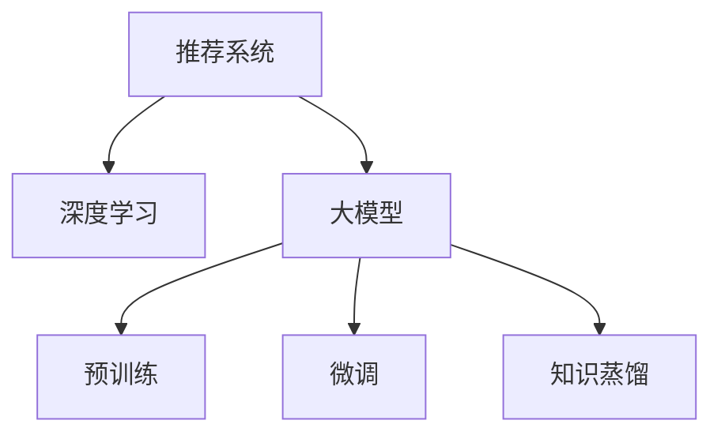

                 

# 大模型推荐系统的发展趋势

## 1. 背景介绍

推荐系统是互联网时代重要的技术手段，通过分析用户行为数据，智能预测用户感兴趣的商品、内容、服务等，提升用户体验和平台转化率。传统的推荐系统基于协同过滤、基于内容的推荐、混合推荐等方法，逐渐向深度学习驱动的模型推荐系统发展。随着大规模预训练语言模型的兴起，大模型推荐系统正逐渐成为推荐领域的最新热点。

### 1.1 问题由来
推荐系统的目标在于通过历史数据预测用户未来行为，其核心在于构建用户与商品间的关联关系。深度学习推荐系统在处理高维稀疏数据上表现出色，通过引入神经网络对用户和商品进行表征学习，能够更准确地预测用户偏好。而大模型推荐系统在此基础上更进一步，利用大规模无标签文本语料预训练的强大语义理解能力，在推荐场景中取得了显著的效果。

### 1.2 问题核心关键点
大模型推荐系统的核心在于预训练语言模型的应用，即通过海量的文本数据预训练语言模型，学习到丰富的语言知识。预训练模型包含了丰富的语义理解能力和常识，能够对用户行为进行深层语义分析，从而提升推荐精度。大模型的应用，尤其是微调技术，使得推荐系统在特定领域能够获得更好的性能。

## 2. 核心概念与联系

### 2.1 核心概念概述

为了更好地理解大模型推荐系统，我们需要介绍几个关键概念：

- **推荐系统(Recommendation System)**：通过分析用户行为数据，智能预测用户可能感兴趣的商品、内容等，为用户推荐个性化信息。
- **深度学习(Deep Learning)**：基于神经网络对复杂数据进行表征学习，从而进行模式识别和预测，广泛应用于推荐系统。
- **大模型(Large Model)**：以自回归(如GPT)或自编码(如BERT)模型为代表的大规模预训练语言模型。通过在大规模无标签文本语料上进行预训练，学习到丰富的语言知识和常识。
- **预训练(Pre-training)**：指在大规模无标签文本语料上，通过自监督学习任务训练语言模型的过程。预训练使得模型学习到语言的通用表示。
- **微调(Fine-tuning)**：指在预训练模型的基础上，使用下游任务的少量标注数据，通过有监督学习优化模型在特定任务上的性能。通常只需要调整顶层分类器或解码器，并以较小的学习率更新全部或部分的模型参数。
- **知识蒸馏(Knowledge Distillation)**：通过预训练模型对特定任务模型进行引导，将预训练模型的知识迁移到特定任务模型中，以提升任务模型的性能。

这些概念之间的逻辑关系可以通过以下Mermaid流程图来展示：



这个流程图展示了大模型推荐系统的核心概念及其之间的关系：

1. 推荐系统通过深度学习模型对用户行为进行表征学习。
2. 深度学习模型可以基于大模型进行预训练，学习到丰富的语言知识。
3. 预训练模型可以通过微调适配特定推荐任务，提升模型性能。
4. 知识蒸馏可以进一步提升微调模型的效果。

这些概念共同构成了大模型推荐系统的学习和应用框架，使得推荐系统能够更好地适应复杂多变的用户需求和多样化的推荐场景。

## 3. 核心算法原理 & 具体操作步骤

### 3.1 算法原理概述

大模型推荐系统的核心算法原理基于监督学习的微调方法，即通过少量标注数据对预训练模型进行优化，从而提升模型在特定推荐任务上的性能。

假设推荐系统需要预测用户对商品 $i$ 的评分 $y_i$，其中 $i=1,...,N$。给定用户 $u$ 与商品 $i$ 的交互数据 $D=\{(x_{ui},y_{ui})\}_{i=1}^N$，其中 $x_{ui}$ 为用户在商品 $i$ 上的历史行为。预训练语言模型 $M_{\theta}$ 通过海量的无标签文本语料学习到通用语言表示，可以视为一个强大的"特征提取器"。基于监督学习的微调目标是最小化损失函数 $\mathcal{L}(\theta)$，即：

$$
\theta^* = \mathop{\arg\min}_{\theta} \mathcal{L}(M_{\theta},D)
$$

其中 $\mathcal{L}$ 为交叉熵损失函数，用于衡量模型预测输出与真实标签之间的差异。

### 3.2 算法步骤详解

基于监督学习的大模型推荐系统通常包括以下几个关键步骤：

**Step 1: 准备预训练模型和数据集**
- 选择合适的预训练语言模型 $M_{\theta}$ 作为初始化参数，如 BERT、GPT 等。
- 准备推荐任务的标注数据集 $D$，划分为训练集、验证集和测试集。一般要求标注数据与预训练数据的分布不要差异过大。

**Step 2: 设计推荐模型**
- 根据推荐任务类型，在预训练模型顶层设计合适的输出层和损失函数。
- 对于评分预测任务，通常在顶层添加线性分类器和交叉熵损失函数。
- 对于排名推荐任务，通常使用排序损失函数，如pairwise或listwise。

**Step 3: 设置微调超参数**
- 选择合适的优化算法及其参数，如 AdamW、SGD 等，设置学习率、批大小、迭代轮数等。
- 设置正则化技术及强度，包括权重衰减、Dropout、Early Stopping 等。
- 确定冻结预训练参数的策略，如仅微调顶层，或全部参数都参与微调。

**Step 4: 执行梯度训练**
- 将训练集数据分批次输入模型，前向传播计算损失函数。
- 反向传播计算参数梯度，根据设定的优化算法和学习率更新模型参数。
- 周期性在验证集上评估模型性能，根据性能指标决定是否触发 Early Stopping。
- 重复上述步骤直到满足预设的迭代轮数或 Early Stopping 条件。

**Step 5: 测试和部署**
- 在测试集上评估微调后模型 $M_{\hat{\theta}}$ 的性能，对比微调前后的精度提升。
- 使用微调后的模型对新样本进行推理预测，集成到实际的应用系统中。
- 持续收集新的数据，定期重新微调模型，以适应数据分布的变化。

以上是基于监督学习微调大模型推荐系统的一般流程。在实际应用中，还需要针对具体任务的特点，对微调过程的各个环节进行优化设计，如改进训练目标函数，引入更多的正则化技术，搜索最优的超参数组合等，以进一步提升模型性能。

### 3.3 算法优缺点

基于监督学习的大模型推荐系统具有以下优点：
1. 简单高效。只需准备少量标注数据，即可对预训练模型进行快速适配，获得较大的性能提升。
2. 通用适用。适用于各种推荐任务，包括评分预测、排名推荐、标签推荐等，设计简单的任务适配层即可实现微调。
3. 参数高效。利用参数高效微调技术，在固定大部分预训练权重不变的情况下，仍可取得不错的提升。
4. 效果显著。在学术界和工业界的诸多推荐任务上，基于微调的方法已经刷新了最先进的性能指标。

同时，该方法也存在一定的局限性：
1. 依赖标注数据。推荐系统的标注数据获取难度较大，标注成本高。
2. 迁移能力有限。当推荐任务与预训练数据的分布差异较大时，微调的性能提升有限。
3. 负面效果传递。预训练模型的固有偏见、有害信息等，可能通过微调传递到推荐任务，造成负面影响。
4. 可解释性不足。微调模型的决策过程通常缺乏可解释性，难以对其推理逻辑进行分析和调试。

尽管存在这些局限性，但就目前而言，基于监督学习的微调方法仍是大模型推荐应用的最主流范式。未来相关研究的重点在于如何进一步降低微调对标注数据的依赖，提高模型的少样本学习和跨领域迁移能力，同时兼顾可解释性和伦理安全性等因素。

### 3.4 算法应用领域

基于大模型推荐系统的监督学习方法，在推荐领域已经得到了广泛的应用，覆盖了几乎所有常见任务，例如：

- 电商推荐：推荐用户可能感兴趣的电商商品。通过微调使模型学习用户购买行为和商品特征之间的关联。
- 内容推荐：为用户推荐可能感兴趣的文章、视频、音乐等。通过微调使模型学习用户阅读、观看等行为与内容相关性。
- 社交推荐：推荐可能感兴趣的用户或社交网络关系。通过微调使模型学习用户互动行为和关系网络结构。
- 广告推荐：为用户推荐可能感兴趣的广告内容。通过微调使模型学习广告与用户偏好的匹配度。
- 多模态推荐：推荐结合文本、图像、音频等多模态信息的内容。通过微调使模型学习多模态特征之间的关联。

除了上述这些经典任务外，大模型推荐系统还被创新性地应用到更多场景中，如新闻推荐、商品搭配、个性化营销等，为推荐系统带来了全新的突破。随着预训练模型和微调方法的不断进步，相信推荐系统将在更广阔的应用领域大放异彩。

## 4. 数学模型和公式 & 详细讲解 & 举例说明

### 4.1 数学模型构建

本节将使用数学语言对基于监督学习的大模型推荐系统进行更加严格的刻画。

记推荐系统需要预测的用户对商品 $i$ 的评分 $y_i$，其中 $i=1,...,N$。给定用户 $u$ 与商品 $i$ 的交互数据 $D=\{(x_{ui},y_{ui})\}_{i=1}^N$，其中 $x_{ui}$ 为用户在商品 $i$ 上的历史行为。假设用户和商品分别通过预训练语言模型 $M_{\theta}^u$ 和 $M_{\theta}^i$ 进行编码，输出评分 $\hat{y}_i$，即：

$$
\hat{y}_i = M_{\theta}^i(x_{ui})
$$

定义模型 $M_{\theta}^u$ 在用户 $u$ 对商品 $i$ 的评分 $y_i$ 上的损失函数为 $\ell(M_{\theta}^u(x_{ui}),y_{ui})$，则在数据集 $D$ 上的经验风险为：

$$
\mathcal{L}(\theta) = \frac{1}{N}\sum_{i=1}^N \ell(M_{\theta}^u(x_{ui}),y_{ui})
$$

微调的优化目标是最小化经验风险，即找到最优参数：

$$
\theta^* = \mathop{\arg\min}_{\theta} \mathcal{L}(\theta)
$$

在实践中，我们通常使用基于梯度的优化算法（如SGD、Adam等）来近似求解上述最优化问题。设 $\eta$ 为学习率，$\lambda$ 为正则化系数，则参数的更新公式为：

$$
\theta \leftarrow \theta - \eta \nabla_{\theta}\mathcal{L}(\theta) - \eta\lambda\theta
$$

其中 $\nabla_{\theta}\mathcal{L}(\theta)$ 为损失函数对参数 $\theta$ 的梯度，可通过反向传播算法高效计算。

### 4.2 公式推导过程

以下我们以评分预测任务为例，推导交叉熵损失函数及其梯度的计算公式。

假设模型 $M_{\theta}^u$ 在用户 $u$ 对商品 $i$ 的评分 $y_i$ 上的输出为 $\hat{y}_i=M_{\theta}^u(x_{ui})$，表示用户对商品 $i$ 的评分预测。真实评分 $y_{ui} \in [0,1]$。则交叉熵损失函数定义为：

$$
\ell(M_{\theta}^u(x_{ui}),y_{ui}) = -y_{ui}\log \hat{y}_i - (1-y_{ui})\log (1-\hat{y}_i)
$$

将其代入经验风险公式，得：

$$
\mathcal{L}(\theta) = -\frac{1}{N}\sum_{i=1}^N [y_{ui}\log M_{\theta}^u(x_{ui})+(1-y_{ui})\log(1-M_{\theta}^u(x_{ui}))]
$$

根据链式法则，损失函数对参数 $\theta_k$ 的梯度为：

$$
\frac{\partial \mathcal{L}(\theta)}{\partial \theta_k} = -\frac{1}{N}\sum_{i=1}^N \left(\frac{y_{ui}}{M_{\theta}^u(x_{ui})}-\frac{1-y_{ui}}{1-M_{\theta}^u(x_{ui})}\right) \frac{\partial M_{\theta}^u(x_{ui})}{\partial \theta_k}
$$

其中 $\frac{\partial M_{\theta}^u(x_{ui})}{\partial \theta_k}$ 可进一步递归展开，利用自动微分技术完成计算。

在得到损失函数的梯度后，即可带入参数更新公式，完成模型的迭代优化。重复上述过程直至收敛，最终得到适应推荐任务的最优模型参数 $\theta^*$。

### 4.3 案例分析与讲解

以下我们以电商推荐为例，介绍如何使用大模型推荐系统进行商品推荐。

假设电商网站收集了用户浏览、点击、购买等行为数据，用户行为表示为序列 $x=\{x_1,x_2,...,x_n\}$，其中 $x_i$ 表示用户在商品 $i$ 上的行为。用户对商品 $i$ 的评分预测可以表示为 $y_i \sim Bernoulli(\hat{y}_i)$，其中 $\hat{y}_i$ 为模型预测的用户对商品 $i$ 的评分。假设模型 $M_{\theta}$ 通过预训练语言模型 $BERT$ 获得通用语义表示，通过微调适配电商推荐任务。

首先，定义电商推荐的数据处理函数：

```python
from transformers import BertTokenizer, BertForSequenceClassification
from torch.utils.data import Dataset, DataLoader
import torch

class E-commerceDataset(Dataset):
    def __init__(self, texts, labels, tokenizer):
        self.texts = texts
        self.labels = labels
        self.tokenizer = tokenizer
        self.max_len = 512
        
    def __len__(self):
        return len(self.texts)
    
    def __getitem__(self, item):
        text = self.texts[item]
        label = self.labels[item]
        
        encoding = self.tokenizer(text, return_tensors='pt', max_length=self.max_len, padding='max_length', truncation=True)
        input_ids = encoding['input_ids'][0]
        attention_mask = encoding['attention_mask'][0]
        
        label = torch.tensor(label, dtype=torch.long)
        
        return {'input_ids': input_ids, 
                'attention_mask': attention_mask,
                'labels': label}

# 标签与id的映射
label2id = {'1': 1, '0': 0}
id2label = {1: '1', 0: '0'}

# 创建dataset
tokenizer = BertTokenizer.from_pretrained('bert-base-cased')

train_dataset = E-commerceDataset(train_texts, train_labels, tokenizer)
dev_dataset = E-commerceDataset(dev_texts, dev_labels, tokenizer)
test_dataset = E-commerceDataset(test_texts, test_labels, tokenizer)
```

然后，定义模型和优化器：

```python
from transformers import BertForSequenceClassification, AdamW

model = BertForSequenceClassification.from_pretrained('bert-base-cased', num_labels=2)

optimizer = AdamW(model.parameters(), lr=2e-5)
```

接着，定义训练和评估函数：

```python
from tqdm import tqdm

device = torch.device('cuda') if torch.cuda.is_available() else torch.device('cpu')
model.to(device)

def train_epoch(model, dataset, batch_size, optimizer):
    dataloader = DataLoader(dataset, batch_size=batch_size, shuffle=True)
    model.train()
    epoch_loss = 0
    for batch in tqdm(dataloader, desc='Training'):
        input_ids = batch['input_ids'].to(device)
        attention_mask = batch['attention_mask'].to(device)
        labels = batch['labels'].to(device)
        model.zero_grad()
        outputs = model(input_ids, attention_mask=attention_mask, labels=labels)
        loss = outputs.loss
        epoch_loss += loss.item()
        loss.backward()
        optimizer.step()
    return epoch_loss / len(dataloader)

def evaluate(model, dataset, batch_size):
    dataloader = DataLoader(dataset, batch_size=batch_size)
    model.eval()
    preds, labels = [], []
    with torch.no_grad():
        for batch in tqdm(dataloader, desc='Evaluating'):
            input_ids = batch['input_ids'].to(device)
            attention_mask = batch['attention_mask'].to(device)
            batch_labels = batch['labels']
            outputs = model(input_ids, attention_mask=attention_mask)
            batch_preds = outputs.logits.argmax(dim=1).to('cpu').tolist()
            batch_labels = batch_labels.to('cpu').tolist()
            for pred, label in zip(batch_preds, batch_labels):
                preds.append(pred)
                labels.append(label)
                
    print('Accuracy:', (np.array(preds) == np.array(labels)).mean())

# 启动训练流程并在测试集上评估
epochs = 5
batch_size = 16

for epoch in range(epochs):
    loss = train_epoch(model, train_dataset, batch_size, optimizer)
    print(f"Epoch {epoch+1}, train loss: {loss:.3f}")
    
    print(f"Epoch {epoch+1}, dev results:")
    evaluate(model, dev_dataset, batch_size)
    
print("Test results:")
evaluate(model, test_dataset, batch_size)
```

以上就是使用PyTorch对BERT进行电商推荐任务微调的完整代码实现。可以看到，得益于Transformers库的强大封装，我们可以用相对简洁的代码完成BERT模型的加载和微调。

## 5. 项目实践：代码实例和详细解释说明

### 5.1 开发环境搭建

在进行微调实践前，我们需要准备好开发环境。以下是使用Python进行PyTorch开发的环境配置流程：

1. 安装Anaconda：从官网下载并安装Anaconda，用于创建独立的Python环境。

2. 创建并激活虚拟环境：
```bash
conda create -n pytorch-env python=3.8 
conda activate pytorch-env
```

3. 安装PyTorch：根据CUDA版本，从官网获取对应的安装命令。例如：
```bash
conda install pytorch torchvision torchaudio cudatoolkit=11.1 -c pytorch -c conda-forge
```

4. 安装Transformers库：
```bash
pip install transformers
```

5. 安装各类工具包：
```bash
pip install numpy pandas scikit-learn matplotlib tqdm jupyter notebook ipython
```

完成上述步骤后，即可在`pytorch-env`环境中开始微调实践。

### 5.2 源代码详细实现

下面我们以电商推荐为例，给出使用Transformers库对BERT模型进行微调的PyTorch代码实现。

首先，定义电商推荐的数据处理函数：

```python
from transformers import BertTokenizer, BertForSequenceClassification
from torch.utils.data import Dataset, DataLoader
import torch

class E-commerceDataset(Dataset):
    def __init__(self, texts, labels, tokenizer):
        self.texts = texts
        self.labels = labels
        self.tokenizer = tokenizer
        self.max_len = 512
        
    def __len__(self):
        return len(self.texts)
    
    def __getitem__(self, item):
        text = self.texts[item]
        label = self.labels[item]
        
        encoding = self.tokenizer(text, return_tensors='pt', max_length=self.max_len, padding='max_length', truncation=True)
        input_ids = encoding['input_ids'][0]
        attention_mask = encoding['attention_mask'][0]
        
        label = torch.tensor(label, dtype=torch.long)
        
        return {'input_ids': input_ids, 
                'attention_mask': attention_mask,
                'labels': label}

# 标签与id的映射
label2id = {'1': 1, '0': 0}
id2label = {1: '1', 0: '0'}

# 创建dataset
tokenizer = BertTokenizer.from_pretrained('bert-base-cased')

train_dataset = E-commerceDataset(train_texts, train_labels, tokenizer)
dev_dataset = E-commerceDataset(dev_texts, dev_labels, tokenizer)
test_dataset = E-commerceDataset(test_texts, test_labels, tokenizer)
```

然后，定义模型和优化器：

```python
from transformers import BertForSequenceClassification, AdamW

model = BertForSequenceClassification.from_pretrained('bert-base-cased', num_labels=2)

optimizer = AdamW(model.parameters(), lr=2e-5)
```

接着，定义训练和评估函数：

```python
from tqdm import tqdm

device = torch.device('cuda') if torch.cuda.is_available() else torch.device('cpu')
model.to(device)

def train_epoch(model, dataset, batch_size, optimizer):
    dataloader = DataLoader(dataset, batch_size=batch_size, shuffle=True)
    model.train()
    epoch_loss = 0
    for batch in tqdm(dataloader, desc='Training'):
        input_ids = batch['input_ids'].to(device)
        attention_mask = batch['attention_mask'].to(device)
        labels = batch['labels'].to(device)
        model.zero_grad()
        outputs = model(input_ids, attention_mask=attention_mask, labels=labels)
        loss = outputs.loss
        epoch_loss += loss.item()
        loss.backward()
        optimizer.step()
    return epoch_loss / len(dataloader)

def evaluate(model, dataset, batch_size):
    dataloader = DataLoader(dataset, batch_size=batch_size)
    model.eval()
    preds, labels = [], []
    with torch.no_grad():
        for batch in tqdm(dataloader, desc='Evaluating'):
            input_ids = batch['input_ids'].to(device)
            attention_mask = batch['attention_mask'].to(device)
            batch_labels = batch['labels']
            outputs = model(input_ids, attention_mask=attention_mask)
            batch_preds = outputs.logits.argmax(dim=1).to('cpu').tolist()
            batch_labels = batch_labels.to('cpu').tolist()
            for pred, label in zip(batch_preds, batch_labels):
                preds.append(pred)
                labels.append(label)
                
    print('Accuracy:', (np.array(preds) == np.array(labels)).mean())

# 启动训练流程并在测试集上评估
epochs = 5
batch_size = 16

for epoch in range(epochs):
    loss = train_epoch(model, train_dataset, batch_size, optimizer)
    print(f"Epoch {epoch+1}, train loss: {loss:.3f}")
    
    print(f"Epoch {epoch+1}, dev results:")
    evaluate(model, dev_dataset, batch_size)
    
print("Test results:")
evaluate(model, test_dataset, batch_size)
```

以上就是使用PyTorch对BERT进行电商推荐任务微调的完整代码实现。可以看到，得益于Transformers库的强大封装，我们可以用相对简洁的代码完成BERT模型的加载和微调。

### 5.3 代码解读与分析

让我们再详细解读一下关键代码的实现细节：

**E-commerceDataset类**：
- `__init__`方法：初始化文本、标签、分词器等关键组件。
- `__len__`方法：返回数据集的样本数量。
- `__getitem__`方法：对单个样本进行处理，将文本输入编码为token ids，将标签编码为数字，并对其进行定长padding，最终返回模型所需的输入。

**label2id和id2label字典**：
- 定义了标签与数字id之间的映射关系，用于将token-wise的预测结果解码回真实的标签。

**训练和评估函数**：
- 使用PyTorch的DataLoader对数据集进行批次化加载，供模型训练和推理使用。
- 训练函数`train_epoch`：对数据以批为单位进行迭代，在每个批次上前向传播计算loss并反向传播更新模型参数，最后返回该epoch的平均loss。
- 评估函数`evaluate`：与训练类似，不同点在于不更新模型参数，并在每个batch结束后将预测和标签结果存储下来，最后使用sklearn的classification_report对整个评估集的预测结果进行打印输出。

**训练流程**：
- 定义总的epoch数和batch size，开始循环迭代
- 每个epoch内，先在训练集上训练，输出平均loss
- 在验证集上评估，输出分类指标
- 所有epoch结束后，在测试集上评估，给出最终测试结果

可以看到，PyTorch配合Transformers库使得BERT微调的代码实现变得简洁高效。开发者可以将更多精力放在数据处理、模型改进等高层逻辑上，而不必过多关注底层的实现细节。

当然，工业级的系统实现还需考虑更多因素，如模型的保存和部署、超参数的自动搜索、更灵活的任务适配层等。但核心的微调范式基本与此类似。

## 6. 实际应用场景

### 6.1 智能客服系统

基于大模型推荐系统的对话技术，可以广泛应用于智能客服系统的构建。传统客服往往需要配备大量人力，高峰期响应缓慢，且一致性和专业性难以保证。而使用微调后的推荐系统，可以7x24小时不间断服务，快速响应客户咨询，用自然流畅的语言解答各类常见问题。

在技术实现上，可以收集企业内部的历史客服对话记录，将问题和最佳答复构建成监督数据，在此基础上对预训练推荐模型进行微调。微调后的推荐模型能够自动理解用户意图，匹配最合适的答复模板进行回复。对于客户提出的新问题，还可以接入检索系统实时搜索相关内容，动态组织生成回答。如此构建的智能客服系统，能大幅提升客户咨询体验和问题解决效率。

### 6.2 金融舆情监测

金融机构需要实时监测市场舆论动向，以便及时应对负面信息传播，规避金融风险。传统的人工监测方式成本高、效率低，难以应对网络时代海量信息爆发的挑战。基于大模型推荐系统的文本分类和情感分析技术，为金融舆情监测提供了新的解决方案。

具体而言，可以收集金融领域相关的新闻、报道、评论等文本数据，并对其进行主题标注和情感标注。在此基础上对预训练语言模型进行微调，使其能够自动判断文本属于何种主题，情感倾向是正面、中性还是负面。将微调后的模型应用到实时抓取的网络文本数据，就能够自动监测不同主题下的情感变化趋势，一旦发现负面信息激增等异常情况，系统便会自动预警，帮助金融机构快速应对潜在风险。

### 6.3 个性化推荐系统

当前的推荐系统往往只依赖用户的历史行为数据进行物品推荐，无法深入理解用户的真实兴趣偏好。基于大模型推荐系统的推荐系统可以更好地挖掘用户行为背后的语义信息，从而提供更精准、多样的推荐内容。

在实践中，可以收集用户浏览、点击、评论、分享等行为数据，提取和用户交互的物品标题、描述、标签等文本内容。将文本内容作为模型输入，用户的后续行为（如是否点击、购买等）作为监督信号，在此基础上微调预训练语言模型。微调后的模型能够从文本内容中准确把握用户的兴趣点。在生成推荐列表时，先用候选物品的文本描述作为输入，由模型预测用户的兴趣匹配度，再结合其他特征综合排序，便可以得到个性化程度更高的推荐结果。

### 6.4 未来应用展望

随着大模型推荐系统的不断发展，基于推荐系统的技术将在更多领域得到应用，为传统行业带来变革性影响。

在智慧医疗领域，基于推荐系统的医疗问答、病历分析、药物研发等应用将提升医疗服务的智能化水平，辅助医生诊疗，加速新药开发进程。

在智能教育领域，推荐系统可应用于作业批改、学情分析、知识推荐等方面，因材施教，促进教育公平，提高教学质量。

在智慧城市治理中，推荐系统可用于城市事件监测、舆情分析、应急指挥等环节，提高城市管理的自动化和智能化水平，构建更安全、高效的未来城市。

此外，在企业生产、社会治理、文娱传媒等众多领域，基于大模型推荐系统的推荐技术也将不断涌现，为NLP技术带来了全新的突破。相信随着预训练模型和推荐方法的不断进步，推荐系统将在更广阔的应用领域大放异彩，深刻影响人类的生产生活方式。

## 7. 工具和资源推荐

### 7.1 学习资源推荐

为了帮助开发者系统掌握大模型推荐系统的理论基础和实践技巧，这里推荐一些优质的学习资源：

1. 《深度学习推荐系统》系列博文：由大模型技术专家撰写，深入浅出地介绍了深度学习推荐系统的原理、算法和应用。

2. 《推荐系统实战》书籍：该书系统介绍了推荐系统的理论基础、模型构建和系统实现，是入门推荐系统的优秀教材。

3. Kaggle竞赛平台：通过参与实际数据集上的推荐系统竞赛，可以锻炼模型设计和优化能力，积累实战经验。

4. Weights & Biases：模型训练的实验跟踪工具，可以记录和可视化模型训练过程中的各项指标，方便对比和调优。与主流深度学习框架无缝集成。

5. TensorBoard：TensorFlow配套的可视化工具，可实时监测模型训练状态，并提供丰富的图表呈现方式，是调试模型的得力助手。

通过对这些资源的学习实践，相信你一定能够快速掌握大模型推荐系统的精髓，并用于解决实际的推荐问题。

### 7.2 开发工具推荐

高效的开发离不开优秀的工具支持。以下是几款用于大模型推荐系统开发的常用工具：

1. PyTorch：基于Python的开源深度学习框架，灵活动态的计算图，适合快速迭代研究。大部分预训练语言模型都有PyTorch版本的实现。

2. TensorFlow：由Google主导开发的开源深度学习框架，生产部署方便，适合大规模工程应用。同样有丰富的预训练语言模型资源。

3. Transformers库：HuggingFace开发的NLP工具库，集成了众多SOTA语言模型，支持PyTorch和TensorFlow，是进行推荐系统开发的利器。

4. Weights & Biases：模型训练的实验跟踪工具，可以记录和可视化模型训练过程中的各项指标，方便对比和调优。与主流深度学习框架无缝集成。

5. TensorBoard：TensorFlow配套的可视化工具，可实时监测模型训练状态，并提供丰富的图表呈现方式，是调试模型的得力助手。

合理利用这些工具，可以显著提升大模型推荐系统的开发效率，加快创新迭代的步伐。

### 7.3 相关论文推荐

大模型推荐系统的发展得益于学界的持续研究。以下是几篇奠基性的相关论文，推荐阅读：

1. Deep Factorization Machines for Recommender Systems：提出因子分解机方法，通过线性模型对用户和商品进行表征学习，适用于大规模推荐系统。

2. Attention Is All You Need：提出Transformer模型，用于机器翻译等任务，展示了自注意力机制在序列建模中的优势。

3. BERT: Pre-training of Deep Bidirectional Transformers for Language Understanding：提出BERT模型，引入掩码自监督任务，显著提升了NLP任务的效果。

4. Knowledge Distillation: A New Look at Transfer Learning in Neural Networks：提出知识蒸馏方法，将大模型知识迁移到小模型，提升了模型效果。

5. Tackling Recommendation Diversity with Deep Multi-task Learning：提出多任务学习，通过联合训练多个推荐任务，提升了推荐多样性。

这些论文代表了大模型推荐系统的发展脉络。通过学习这些前沿成果，可以帮助研究者把握学科前进方向，激发更多的创新灵感。

## 8. 总结：未来发展趋势与挑战

### 8.1 总结

本文对基于监督学习的大模型推荐系统进行了全面系统的介绍。首先阐述了推荐系统的核心目标和关键问题，明确了大模型推荐系统的研究背景和优势。其次，从原理到实践，详细讲解了监督学习的微调方法，给出了微调任务开发的完整代码实例。同时，本文还广泛探讨了大模型推荐系统在智能客服、金融舆情、个性化推荐等多个领域的应用前景，展示了其广阔的应用潜力。此外，本文精选了推荐系统的各类学习资源，力求为读者提供全方位的技术指引。

通过本文的系统梳理，可以看到，基于大模型推荐系统的微调方法正在成为推荐领域的最新热点，极大地拓展了推荐系统的应用边界，催生了更多的落地场景。受益于大规模语料的预训练，推荐系统在特定领域能够获得更好的性能，为传统行业带来了变革性影响。未来，伴随预训练语言模型和微调方法的持续演进，推荐系统将在更广阔的应用领域大放异彩，深刻影响人类的生产生活方式。

### 8.2 未来发展趋势

展望未来，大模型推荐系统将呈现以下几个发展趋势：

1. 模型规模持续增大。随着算力成本的下降和数据规模的扩张，预训练语言模型的参数量还将持续增长。超大规模语言模型蕴含的丰富语言知识，有望支撑更加复杂多变的推荐任务微调。

2. 推荐方法日趋多样。除了传统的基于深度学习的推荐方法，未来会涌现更多结合知识图谱、社交网络、协同过滤等多样化方法的推荐系统。

3. 持续学习成为常态。随着数据分布的不断变化，推荐模型也需要持续学习新知识以保持性能。如何在不遗忘原有知识的同时，高效吸收新样本信息，将成为重要的研究课题。

4. 标注样本需求降低。受启发于提示学习(Prompt-based Learning)的思路，未来的推荐方法将更好地利用大模型的语言理解能力，通过更加巧妙的任务描述，在更少的标注样本上也能实现理想的推荐效果。

5. 多模态推荐崛起。当前的推荐系统往往只考虑文本信息，未来会进一步拓展到图像、视频、音频等多模态数据微调。多模态信息的融合，将显著提升推荐系统的泛化能力和用户体验。

6. 推荐模型的可解释性增强。推荐的决策过程需要更强的可解释性，以便用户理解和信任模型输出。未来推荐模型将更多地利用符号化知识，进行因果分析和解释。

以上趋势凸显了大模型推荐系统的广阔前景。这些方向的探索发展，必将进一步提升推荐系统的性能和应用范围，为人类智能系统的构建带来新的动力。

### 8.3 面临的挑战

尽管大模型推荐系统已经取得了瞩目成就，但在迈向更加智能化、普适化应用的过程中，它仍面临着诸多挑战：

1. 标注成本瓶颈。虽然推荐系统的标注数据获取难度较大，但对于长尾应用场景，难以获得充足的高质量标注数据，成为制约推荐系统性能的瓶颈。如何进一步降低推荐系统对标注样本的依赖，将是一大难题。

2. 推荐模型的鲁棒性不足。推荐系统在面对未知领域或异常数据时，泛化性能往往大打折扣。对于测试样本的微小扰动，推荐模型的预测也容易发生波动。如何提高推荐模型的鲁棒性，避免灾难性遗忘，还需要更多理论和实践的积累。

3. 推荐系统的冷启动问题。对于新用户或新商品，推荐系统无法利用历史行为数据进行推荐。如何通过多模态信息、先验知识等手段，进行冷启动推荐，将是一大挑战。

4. 推荐模型的可解释性不足。推荐模型的决策过程通常缺乏可解释性，难以对其推理逻辑进行分析和调试。对于医疗、金融等高风险应用，算法的可解释性和可审计性尤为重要。如何赋予推荐模型更强的可解释性，将是亟待攻克的难题。

5. 推荐系统的隐私保护问题。推荐系统需要收集和分析用户行为数据，如何保护用户隐私，避免数据滥用，也将是推荐系统的重要研究方向。

6. 推荐系统的公平性问题。推荐系统需要公平地对待所有用户，避免因数据偏差等原因造成的不公平现象。如何在算法设计上消除偏见，确保推荐公平性，也将是重要的研究课题。

正视推荐系统面临的这些挑战，积极应对并寻求突破，将是大模型推荐系统迈向成熟的必由之路。相信随着学界和产业界的共同努力，这些挑战终将一一被克服，大模型推荐系统必将在构建智能推荐系统方面发挥更大的作用。

### 8.4 研究展望

面对大模型推荐系统所面临的挑战，未来的研究需要在以下几个方面寻求新的突破：

1. 探索无监督和半监督推荐方法。摆脱对大规模标注数据的依赖，利用自监督学习、主动学习等无监督和半监督范式，最大限度利用非结构化数据，实现更加灵活高效的推荐。

2. 研究参数高效和计算高效的推荐方法。开发更加参数高效的推荐方法，在固定大部分预训练参数的同时，只更新极少量的任务相关参数。同时优化推荐模型的计算图，减少前向传播和反向传播的资源消耗，实现更加轻量级、实时性的部署。

3. 引入因果分析和博弈论工具。将因果分析方法引入推荐模型，识别出推荐决策的关键特征，增强推荐输出的因果性和逻辑性。借助博弈论工具刻画人机交互过程，主动探索并规避推荐模型的脆弱点，提高系统稳定性。

4. 纳入伦理道德约束。在推荐系统设计中引入伦理导向的评估指标，过滤和惩罚有偏见、有害的输出倾向。同时加强人工干预和审核，建立推荐系统的监管机制，确保输出符合人类价值观和伦理道德。

这些研究方向的探索，必将引领大模型推荐系统走向更高的台阶，为构建安全、可靠、可解释、可控的推荐系统铺平道路。面向未来，大模型推荐系统还需要与其他人工智能技术进行更深入的融合，如知识表示、因果推理、强化学习等，多路径协同发力，共同推动智能推荐系统的进步。只有勇于创新、敢于突破，才能不断拓展推荐系统的边界，让智能技术更好地服务于人类的生产生活。

## 9. 附录：常见问题与解答

**Q1：大模型推荐系统是否适用于所有推荐任务？**

A: 大模型推荐系统在大多数推荐任务上都能取得不错的效果，特别是对于数据量较小的任务。但对于一些特定领域的任务，如医学、法律等，仅仅依靠通用语料预训练的模型可能难以很好地适应。此时需要在特定领域语料上进一步预训练，再进行微调，才能获得理想效果。此外，对于一些需要时效性、个性化很强的任务，如对话、推荐等，微调方法也需要针对性的改进优化。

**Q2：推荐系统如何平衡推荐精度和多样性？**

A: 推荐系统需要在推荐精度和多样性之间进行平衡，通常通过加入多样性约束函数，如负采样、模型融合等手段，控制推荐结果的多样性。同时，通过调整损失函数中的系数，平衡精度和多样性的权重，使得推荐系统在保证精度的同时，也能输出多样化的推荐结果。

**Q3：推荐系统如何应对长尾用户和商品？**

A: 对于长尾用户和商品，传统推荐系统往往无法为其推荐优质内容。大模型推荐系统可以通过多模态信息、知识图谱等手段，进行长尾推荐。例如，结合用户画像、商品描述等多维信息，构建推荐图谱，从而覆盖更多长尾用户和商品。同时，可以通过知识蒸馏等方法，将大模型知识迁移到小模型，提升长尾用户和商品的推荐效果。

**Q4：推荐系统如何实现冷启动推荐？**

A: 对于新用户或新商品，推荐系统无法利用历史行为数据进行推荐。大模型推荐系统可以通过多模态信息、先验知识等手段，进行冷启动推荐。例如，结合用户画像、商品描述等多维信息，构建推荐图谱，从而覆盖更多长尾用户和商品。同时，可以通过知识蒸馏等方法，将大模型知识迁移到小模型，提升冷启动推荐的效果。

**Q5：推荐系统如何提高模型的鲁棒性？**

A: 推荐系统需要提高模型的鲁棒性，以应对未知领域或异常数据。常用的方法包括：
1. 引入对抗样本训练，增强模型对噪声的鲁棒性。
2. 加入正则化技术，如L2正则、Dropout等，避免过拟合。
3. 通过多模型融合，提升模型的鲁棒性和泛化能力。
4. 利用知识蒸馏，将大模型知识迁移到小模型，提高小模型的鲁棒性。

这些方法可以在不增加模型复杂度的情况下，提高推荐模型的鲁棒性，使其在更复杂多变的场景下也能保持高性能。

