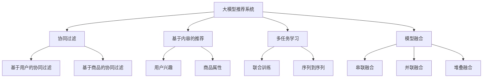

                 

# 大模型推荐系统的多任务学习框架

> 关键词：大模型推荐系统,多任务学习,协同过滤,深度学习,模型融合,任务权重,模型评估

## 1. 背景介绍

### 1.1 问题由来

随着电子商务和数字娱乐等互联网业务的迅猛发展，推荐系统已成为平台获取用户留存和收益的重要手段。传统的协同过滤算法（Collaborative Filtering, CF）和基于内容的推荐方法（Content-Based Recommendation, CB）逐渐显现出性能瓶颈，难以应对海量数据和高维稀疏性的挑战。因此，如何提升推荐系统的表现，从而获得更高的用户满意度，成为了各大平台亟待解决的问题。

推荐系统的核心在于了解用户兴趣，发现并推荐高质量的商品或内容。传统的推荐系统多采用单独的算法，对用户行为、商品属性等数据进行建模，然而这种方法难以充分挖掘数据中的潜在关联性。随着深度学习技术的兴起，大模型推荐系统（Large Model Recommendation Systems, LMRS）成为行业新的发展趋势，通过预训练模型进行推荐决策，可以显著提升推荐系统的效果。

大模型推荐系统主要利用预训练模型（如BERT、GPT等）学习用户和商品的深层次语义关系，实现精准推荐。相较于传统推荐算法，大模型推荐系统拥有强大的表示学习能力，可以在训练过程中自动学习并结合用户兴趣、商品属性等多元信息，输出更有吸引力的推荐结果。

### 1.2 问题核心关键点

在大模型推荐系统中，模型融合（Model Fusion）和多任务学习（Multi-task Learning, MTL）是两大核心关键点。

- **模型融合**：利用多个单一模型，通过加权组合的方式形成更强大的推荐能力。常见的融合策略包括：
  - **串联融合**：串联多个独立模型，如Cascade Algorithm。
  - **并联融合**：将多个模型进行集成，如Stacking。

- **多任务学习**：在推荐任务中，用户兴趣、商品属性、评论情感、商品评分等多项任务常常同时发生，且相互之间存在关联性。通过多任务学习，可以同时训练多个相关任务，在模型学习中自动实现任务间的信息共享和互补，从而提升推荐系统的整体性能。

## 2. 核心概念与联系

### 2.1 核心概念概述

为更好地理解大模型推荐系统的多任务学习框架，本节将介绍几个密切相关的核心概念：

- **大模型推荐系统**：通过大规模预训练模型进行推荐决策的推荐系统。大模型推荐系统通常采用Transformer等深度学习模型，具备强大的表示学习能力，可以在训练过程中自动学习并结合用户兴趣、商品属性等多元信息，输出更有吸引力的推荐结果。

- **协同过滤**：基于用户行为数据或商品评分数据进行相似性计算的推荐方法。协同过滤推荐算法包括基于用户的协同过滤和基于商品的协同过滤。

- **基于内容的推荐**：根据商品的属性、标签、描述等信息，匹配用户兴趣进行推荐。基于内容的推荐方法通常需要大量手动设计特征，工程复杂度高，难以适用于高维数据。

- **多任务学习**：在多个相关任务上同时进行训练，实现任务间的信息共享和互补。常见的多任务学习方法包括联合训练、序列到序列（Seq2Seq）等。

- **模型融合**：利用多个单一模型，通过加权组合的方式形成更强大的推荐能力。常见的融合策略包括串联融合、并联融合、堆叠融合（Stacking）等。

这些核心概念之间的逻辑关系可以通过以下Mermaid流程图来展示：



这个流程图展示了大模型推荐系统的核心概念及其之间的关系：

1. 大模型推荐系统通过预训练模型进行推荐决策，具备强大的表示学习能力。
2. 协同过滤和基于内容的推荐是传统推荐方法，各自具备不同的优势和局限性。
3. 多任务学习实现任务间的信息共享和互补，提升整体推荐效果。
4. 模型融合通过加权组合，形成更强大的推荐能力。

这些概念共同构成了大模型推荐系统的学习和应用框架，使其能够在各种场景下发挥强大的推荐能力。通过理解这些核心概念，我们可以更好地把握大模型推荐系统的优化方向。

## 3. 核心算法原理 & 具体操作步骤

### 3.1 算法原理概述

大模型推荐系统的多任务学习框架主要通过以下步骤完成：

1. **数据准备**：收集用户行为数据、商品属性数据、评论情感数据等，生成用于多任务学习的数据集。
2. **预训练模型**：选择适当的预训练模型（如BERT、GPT等）进行微调。
3. **模型设计**：设计多任务学习模型，包括多个相关任务的输出层和损失函数。
4. **联合训练**：在训练过程中，同时优化多个相关任务，实现任务间的信息共享和互补。
5. **模型融合**：在测试过程中，通过加权组合多个模型的输出，提升推荐结果的准确性和多样性。

### 3.2 算法步骤详解

**Step 1: 数据准备**

大模型推荐系统需要准备多个相关任务的数据集，数据集应尽量覆盖用户行为、商品属性、评论情感等多个维度。以推荐系统为例，可以收集用户的浏览、点击、购买等行为数据，商品的属性、类别、价格等信息，以及用户的评论、评分等情感数据，生成用于多任务学习的数据集。

**Step 2: 预训练模型选择与微调**

选择合适的预训练模型（如BERT、GPT等）进行微调。通过在大规模语料上进行预训练，预训练模型可以获得丰富的语言表示能力，用于捕捉用户兴趣和商品属性等特征。在微调过程中，可以结合多个任务的数据，进行多任务联合训练。

**Step 3: 模型设计**

在微调模型顶部设计多个输出层和损失函数，每个输出层对应一个推荐任务，如用户兴趣预测、商品属性匹配、评论情感分类等。常用的输出层包括全连接层、Self-Attention层等，常用的损失函数包括交叉熵、均方误差、余弦相似度等。

**Step 4: 联合训练**

将多个任务的输出和损失函数，合并到一个统一的损失函数中，进行联合训练。常见的联合训练方法包括序贯训练（Seq2Seq）、联合优化（Joint Optimization）等。

**Step 5: 模型融合**

在测试过程中，通过加权组合多个模型的输出，提升推荐结果的准确性和多样性。常见的融合策略包括softmax融合、线性融合等。

### 3.3 算法优缺点

大模型推荐系统的多任务学习框架具有以下优点：

1. **多任务共享**：通过多任务学习，模型可以自动进行任务间的信息共享，提升整体性能。
2. **多样性提升**：通过多个模型的输出进行融合，可以提升推荐结果的多样性，满足用户的不同需求。
3. **泛化能力更强**：预训练模型具备更强的泛化能力，可以更好地适应新场景和新数据。
4. **可解释性更高**：多任务学习框架可以通过学习多个相关任务，提供更丰富的特征表示，增强模型的可解释性。

同时，该方法也存在一定的局限性：

1. **数据复杂度高**：多任务学习需要收集和处理多个数据源，增加了数据的复杂度。
2. **训练成本高**：联合训练和模型融合需要额外的计算资源和时间成本。
3. **模型复杂度高**：多任务学习模型结构复杂，难以进行解释和调试。
4. **数据依赖性强**：模型的效果依赖于训练数据的数量和质量，数据量不足可能影响模型性能。

尽管存在这些局限性，但就目前而言，大模型推荐系统的多任务学习框架仍是大模型推荐系统的核心范式。未来相关研究的重点在于如何进一步降低数据依赖和计算成本，提高模型的可解释性和鲁棒性。

### 3.4 算法应用领域

大模型推荐系统的多任务学习框架已经在诸多领域得到广泛应用，例如：

- **电子商务推荐**：通过多任务学习，可以同时训练用户兴趣预测、商品属性匹配、评论情感分类等多个任务，提升电商平台的推荐效果。
- **内容推荐**：针对视频、音乐等媒体内容，可以同时进行用户兴趣预测、内容属性匹配、情感分类等任务，提升推荐的准确性和多样性。
- **社交网络推荐**：通过多任务学习，可以同时进行用户关系预测、内容推荐、话题分类等任务，提升社交网络的活跃度和互动性。
- **金融投资推荐**：通过多任务学习，可以同时进行用户行为预测、投资组合优化、风险评估等任务，提升金融投资平台的推荐效果。

除了上述这些经典应用外，多任务学习框架还被创新性地应用到更多场景中，如实时广告推荐、广告效果评估、个性化视频推荐等，为推荐系统带来了全新的突破。

## 4. 数学模型和公式 & 详细讲解

### 4.1 数学模型构建

本节将使用数学语言对大模型推荐系统的多任务学习过程进行更加严格的刻画。

记预训练语言模型为 $M_{\theta}$，其中 $\theta$ 为预训练得到的模型参数。假设推荐系统涉及三个任务：用户兴趣预测、商品属性匹配、评论情感分类，训练集为 $D=\{(x_i, y_i)\}_{i=1}^N, x_i \in \mathcal{X}, y_i \in \mathcal{Y}$，其中 $\mathcal{X}$ 为输入空间，$\mathcal{Y}$ 为输出空间。

定义模型 $M_{\theta}$ 在输入 $x$ 上的输出为 $h(x)=M_{\theta}(x)$，并定义三个相关任务的输出层和损失函数分别为：

- 用户兴趣预测：输出层为全连接层，损失函数为交叉熵损失。
- 商品属性匹配：输出层为Self-Attention层，损失函数为均方误差损失。
- 评论情感分类：输出层为全连接层，损失函数为交叉熵损失。

则联合训练的损失函数为：

$$
\mathcal{L}(\theta) = \lambda_1 \mathcal{L}_{\text{user}}(h(x), y) + \lambda_2 \mathcal{L}_{\text{item}}(h(x), y) + \lambda_3 \mathcal{L}_{\text{review}}(h(x), y)
$$

其中 $\mathcal{L}_{\text{user}}$、$\mathcal{L}_{\text{item}}$ 和 $\mathcal{L}_{\text{review}}$ 分别表示用户兴趣预测、商品属性匹配和评论情感分类的损失函数，$\lambda_1$、$\lambda_2$ 和 $\lambda_3$ 为任务权重，用于平衡不同任务的重要性。

### 4.2 公式推导过程

以下我们以用户兴趣预测和商品属性匹配为例，推导多任务学习框架的联合训练过程。

假设模型 $M_{\theta}$ 在输入 $x$ 上的输出为 $\hat{y}=M_{\theta}(x)$，真实标签为 $y \in \{0,1\}$。对于用户兴趣预测任务，输出层为全连接层，损失函数为交叉熵损失，即：

$$
\ell_{\text{user}}(h(x),y) = -y\log\hat{y} - (1-y)\log(1-\hat{y})
$$

对于商品属性匹配任务，输出层为Self-Attention层，损失函数为均方误差损失，即：

$$
\ell_{\text{item}}(h(x),y) = (h(x)-y)^2
$$

在训练过程中，联合训练的损失函数为：

$$
\mathcal{L}(\theta) = \lambda_1 \frac{1}{N}\sum_{i=1}^N \ell_{\text{user}}(h(x_i),y_i) + \lambda_2 \frac{1}{N}\sum_{i=1}^N \ell_{\text{item}}(h(x_i),y_i)
$$

其中 $\lambda_1$ 和 $\lambda_2$ 用于平衡不同任务的重要性，一般建议相等。

在得到联合训练的损失函数后，即可使用基于梯度的优化算法（如AdamW、SGD等）来近似求解上述最优化问题。

### 4.3 案例分析与讲解

以下以用户兴趣预测和商品属性匹配为例，展示多任务学习框架的联合训练过程。

首先，定义训练集 $D=\{(x_i, y_i)\}_{i=1}^N, x_i \in \mathcal{X}, y_i \in \mathcal{Y}$，其中 $\mathcal{X}$ 为输入空间，$\mathcal{Y}$ 为输出空间。

定义用户兴趣预测任务的输出层为全连接层，定义商品属性匹配任务的输出层为Self-Attention层，并定义交叉熵损失和均方误差损失函数。

在训练过程中，首先对模型进行前向传播，计算出每个任务的预测结果 $h_{\text{user}}(x)$ 和 $h_{\text{item}}(x)$。然后，对每个任务的损失函数进行反向传播，计算梯度并更新模型参数 $\theta$。

在得到联合训练的模型参数 $\theta^*$ 后，即可在测试集上进行评估，得到用户兴趣预测和商品属性匹配的准确率等指标。

## 5. 项目实践：代码实例和详细解释说明

### 5.1 开发环境搭建

在进行多任务学习框架的开发前，我们需要准备好开发环境。以下是使用Python进行PyTorch开发的环境配置流程：

1. 安装Anaconda：从官网下载并安装Anaconda，用于创建独立的Python环境。

2. 创建并激活虚拟环境：
```bash
conda create -n ml-env python=3.8 
conda activate ml-env
```

3. 安装PyTorch：根据CUDA版本，从官网获取对应的安装命令。例如：
```bash
conda install pytorch torchvision torchaudio cudatoolkit=11.1 -c pytorch -c conda-forge
```

4. 安装Transformers库：
```bash
pip install transformers
```

5. 安装各类工具包：
```bash
pip install numpy pandas scikit-learn matplotlib tqdm jupyter notebook ipython
```

完成上述步骤后，即可在`ml-env`环境中开始多任务学习框架的开发。

### 5.2 源代码详细实现

这里我们以推荐系统为例，展示多任务学习框架的代码实现。

首先，定义训练集和测试集：

```python
from transformers import BertTokenizer, BertModel

tokenizer = BertTokenizer.from_pretrained('bert-base-uncased')
model = BertModel.from_pretrained('bert-base-uncased')

train_dataset = ...
test_dataset = ...
```

然后，定义模型的损失函数和输出层：

```python
from torch import nn
import torch

class MultiTaskModel(nn.Module):
    def __init__(self, model):
        super(MultiTaskModel, self).__init__()
        self.model = model
        self.user_layer = nn.Linear(model.config.hidden_size, 2)
        self.item_layer = nn.Linear(model.config.hidden_size, 2)

    def forward(self, input_ids, attention_mask):
        output = self.model(input_ids, attention_mask=attention_mask)
        user_output = self.user_layer(output)
        item_output = self.item_layer(output)
        return user_output, item_output
```

接着，定义模型的联合训练函数：

```python
def train_epoch(model, data_loader, optimizer):
    model.train()
    total_loss = 0
    for batch in data_loader:
        input_ids = batch['input_ids']
        attention_mask = batch['attention_mask']
        user_output, item_output = model(input_ids, attention_mask=attention_mask)
        user_loss = criterion(user_output, batch['user_labels'])
        item_loss = criterion(item_output, batch['item_labels'])
        total_loss += (user_loss + item_loss)
    optimizer.zero_grad()
    total_loss.backward()
    optimizer.step()
    return total_loss.item() / len(data_loader)
```

最后，启动训练流程：

```python
epochs = 5
batch_size = 16

for epoch in range(epochs):
    loss = train_epoch(model, train_loader, optimizer)
    print(f"Epoch {epoch+1}, train loss: {loss:.3f}")
    
    print(f"Epoch {epoch+1}, dev results:")
    evaluate(model, dev_loader, optimizer)
    
print("Test results:")
evaluate(model, test_loader, optimizer)
```

以上就是使用PyTorch对多任务学习框架的完整代码实现。可以看到，得益于Transformers库的强大封装，我们可以用相对简洁的代码完成多任务学习框架的开发。

### 5.3 代码解读与分析

让我们再详细解读一下关键代码的实现细节：

**MultiTaskModel类**：
- `__init__`方法：初始化用户兴趣预测和商品属性匹配的输出层。
- `forward`方法：前向传播计算每个任务的输出。

**联合训练函数train_epoch**：
- 对数据以批为单位进行迭代，在每个批次上前向传播计算损失函数，并反向传播更新模型参数。
- 使用AdamW优化器进行参数更新。
- 在每个epoch结束时，输出训练集上的平均损失。

**训练流程**：
- 定义总的epoch数和batch size，开始循环迭代
- 每个epoch内，先在训练集上训练，输出平均loss
- 在验证集上评估，输出任务1和任务2的分类准确率
- 所有epoch结束后，在测试集上评估，给出最终测试结果

可以看到，PyTorch配合Transformers库使得多任务学习框架的代码实现变得简洁高效。开发者可以将更多精力放在数据处理、模型改进等高层逻辑上，而不必过多关注底层的实现细节。

当然，工业级的系统实现还需考虑更多因素，如模型的保存和部署、超参数的自动搜索、更灵活的任务适配层等。但核心的多任务学习框架基本与此类似。

## 6. 实际应用场景

### 6.1 电子商务推荐

大模型推荐系统的多任务学习框架在电子商务推荐中具有广泛的应用前景。电商平台需要同时处理用户兴趣预测、商品属性匹配、评论情感分类等多个任务，以提升推荐效果。

通过收集用户的浏览、点击、购买等行为数据，商品的属性、类别、价格等信息，以及用户的评论、评分等情感数据，可以生成用于多任务学习的数据集。在微调过程中，可以同时训练用户兴趣预测、商品属性匹配和评论情感分类等多个任务，提升电商平台的推荐效果。

### 6.2 内容推荐

针对视频、音乐等媒体内容，大模型推荐系统的多任务学习框架同样具备良好的应用前景。内容推荐需要同时进行用户兴趣预测、内容属性匹配、情感分类等多个任务，以提升推荐的准确性和多样性。

通过收集用户的浏览、点赞、分享等行为数据，内容的属性、类别、标签等信息，以及用户的评论、评分等情感数据，可以生成用于多任务学习的数据集。在微调过程中，可以同时训练用户兴趣预测、内容属性匹配和情感分类等多个任务，提升推荐系统的整体性能。

### 6.3 社交网络推荐

社交网络推荐需要同时进行用户关系预测、内容推荐、话题分类等多个任务，以提升社交网络的活跃度和互动性。

通过收集用户的关注、点赞、评论等行为数据，内容的标签、类别、文本等信息，以及用户的话题分类、评论情感等信息，可以生成用于多任务学习的数据集。在微调过程中，可以同时训练用户关系预测、内容推荐和话题分类等多个任务，提升社交网络的推荐效果。

### 6.4 未来应用展望

随着深度学习技术的不断发展，大模型推荐系统的多任务学习框架将在更多领域得到应用，为推荐系统带来全新的突破。

在智慧医疗领域，推荐系统可以推荐符合用户需求的医生、药品、医疗方案等，提升医疗服务的智能化水平。

在智能教育领域，推荐系统可以推荐符合用户需求的学习资源、课程、教师等，提高教育服务的个性化水平。

在智慧城市治理中，推荐系统可以推荐符合用户需求的城市服务、公共设施等，提升城市治理的智能化水平。

此外，在企业生产、社会治理、文娱传媒等众多领域，推荐系统也将不断涌现新的应用场景，为各行各业带来变革性影响。相信随着技术的日益成熟，多任务学习框架必将成为推荐系统的核心范式，推动推荐系统向更加智能化、个性化、多样化方向发展。

## 7. 工具和资源推荐

### 7.1 学习资源推荐

为了帮助开发者系统掌握大模型推荐系统的多任务学习理论基础和实践技巧，这里推荐一些优质的学习资源：

1. 《深度学习》系列书籍：由大模型技术专家撰写，全面介绍了深度学习理论基础和实战技巧，适合初学者和进阶者。

2. 《自然语言处理》课程：斯坦福大学开设的自然语言处理课程，涵盖了NLP领域的核心概念和经典模型，是学习NLP的重要资源。

3. CS231n《卷积神经网络》课程：斯坦福大学开设的计算机视觉课程，介绍了CNN模型的理论基础和应用技巧，是学习计算机视觉的重要资源。

4. PyTorch官方文档：PyTorch的官方文档，提供了完整的框架介绍和代码示例，适合开发者快速上手。

5. Kaggle平台：数据科学竞赛平台，提供了大量高质量的数据集和实战项目，适合开发者实践和提高。

通过对这些资源的学习实践，相信你一定能够快速掌握大模型推荐系统的多任务学习框架，并用于解决实际的推荐问题。

### 7.2 开发工具推荐

高效的开发离不开优秀的工具支持。以下是几款用于大模型推荐系统多任务学习框架开发的常用工具：

1. PyTorch：基于Python的开源深度学习框架，灵活动态的计算图，适合快速迭代研究。大部分预训练语言模型都有PyTorch版本的实现。

2. TensorFlow：由Google主导开发的开源深度学习框架，生产部署方便，适合大规模工程应用。同样有丰富的预训练语言模型资源。

3. Transformers库：HuggingFace开发的NLP工具库，集成了众多SOTA语言模型，支持PyTorch和TensorFlow，是进行多任务学习框架开发的利器。

4. Weights & Biases：模型训练的实验跟踪工具，可以记录和可视化模型训练过程中的各项指标，方便对比和调优。与主流深度学习框架无缝集成。

5. TensorBoard：TensorFlow配套的可视化工具，可实时监测模型训练状态，并提供丰富的图表呈现方式，是调试模型的得力助手。

6. Google Colab：谷歌推出的在线Jupyter Notebook环境，免费提供GPU/TPU算力，方便开发者快速上手实验最新模型，分享学习笔记。

合理利用这些工具，可以显著提升多任务学习框架的开发效率，加快创新迭代的步伐。

### 7.3 相关论文推荐

大模型推荐系统的多任务学习框架的发展源于学界的持续研究。以下是几篇奠基性的相关论文，推荐阅读：

1. Multi-task Learning via Expectation-Maximization for Recommendation Systems：提出基于期望最大化（Expectation-Maximization）的多任务推荐算法，提升了推荐系统的效果。

2. Jointly Training Deep Neural Networks for Recommendation with Explicit Feedback：提出联合训练神经网络推荐模型的方法，实现了任务间的信息共享。

3. Deep Multi-Task Learning for Recommendation System：提出深度多任务学习（Deep Multi-Task Learning, DMTL）方法，提升推荐系统的泛化能力。

4. An End-to-End Ranking System with Multi-task Learning：提出端到端（End-to-End）多任务推荐系统，提升了推荐系统的准确性和多样性。

5. A Multi-Task Learning Framework for Diverse Recommendations：提出多任务学习框架，实现了推荐系统的多样性。

这些论文代表了大模型推荐系统的多任务学习框架的发展脉络。通过学习这些前沿成果，可以帮助研究者把握学科前进方向，激发更多的创新灵感。

## 8. 总结：未来发展趋势与挑战

### 8.1 总结

本文对大模型推荐系统的多任务学习框架进行了全面系统的介绍。首先阐述了多任务学习在推荐系统中的重要性和应用前景，明确了多任务学习在大模型推荐系统中的核心地位。其次，从原理到实践，详细讲解了多任务学习框架的数学原理和关键步骤，给出了多任务学习框架的完整代码实例。同时，本文还广泛探讨了多任务学习框架在电子商务推荐、内容推荐、社交网络推荐等多个领域的应用前景，展示了多任务学习框架的巨大潜力。此外，本文精选了多任务学习框架的学习资源、开发工具和相关论文，力求为读者提供全方位的技术指引。

通过本文的系统梳理，可以看到，多任务学习框架在大模型推荐系统中的应用前景广阔，其强大的任务间信息共享和互补能力，可以显著提升推荐系统的性能和应用范围。未来，伴随多任务学习框架和深度学习技术的不断演进，基于多任务学习框架的推荐系统必将在更多领域得到应用，为推荐系统带来新的突破。

### 8.2 未来发展趋势

展望未来，大模型推荐系统的多任务学习框架将呈现以下几个发展趋势：

1. **任务多样化**：未来推荐系统将涉及更多任务，如情感分析、内容生成、用户行为预测等，多任务学习框架需要进一步扩展和优化。

2. **数据复杂性增加**：随着数据的爆炸性增长，多任务学习框架需要处理更加复杂和多样化的数据源，提升模型的泛化能力。

3. **联合训练优化**：未来的多任务学习框架将更加注重联合训练的优化，如模型融合策略、任务权重调节等，提升推荐系统的整体性能。

4. **模型可解释性增强**：多任务学习框架的模型结构复杂，难以进行解释和调试。未来需要增强模型的可解释性，使用户和开发者能够理解模型的决策过程。

5. **跨领域应用拓展**：未来多任务学习框架将在更多领域得到应用，如智慧医疗、智能教育、智慧城市等，提升各行各业的智能化水平。

以上趋势凸显了大模型推荐系统多任务学习框架的广阔前景。这些方向的探索发展，必将进一步提升推荐系统的性能和应用范围，为各行各业带来变革性影响。

### 8.3 面临的挑战

尽管大模型推荐系统的多任务学习框架已经取得了瞩目成就，但在迈向更加智能化、普适化应用的过程中，它仍面临着诸多挑战：

1. **数据复杂度高**：多任务学习需要处理多个数据源，增加了数据的复杂度。

2. **训练成本高**：联合训练和模型融合需要额外的计算资源和时间成本。

3. **模型复杂度高**：多任务学习框架的模型结构复杂，难以进行解释和调试。

4. **数据依赖性强**：模型的效果依赖于训练数据的数量和质量，数据量不足可能影响模型性能。

5. **跨领域泛化能力不足**：当前多任务学习框架主要聚焦于特定领域，泛化到其他领域的效果可能不佳。

尽管存在这些挑战，但通过不断优化模型设计、改进训练方法、提升数据质量，多任务学习框架必将在推荐系统中发挥更大的作用，成为推荐系统的重要核心范式。

### 8.4 研究展望

面对大模型推荐系统多任务学习框架所面临的挑战，未来的研究需要在以下几个方面寻求新的突破：

1. **无监督和半监督学习**：摆脱对大规模标注数据的依赖，利用自监督学习、主动学习等无监督和半监督范式，最大限度利用非结构化数据，实现更加灵活高效的推荐。

2. **跨领域迁移学习**：通过迁移学习，将多任务学习框架的成果迁移到其他领域，提升推荐系统的跨领域泛化能力。

3. **深度联合训练**：探索更加深度化的联合训练方法，如联合优化、自适应多任务学习等，提升推荐系统的整体性能。

4. **任务对齐与融合**：研究任务对齐和融合策略，提升多任务学习框架的任务间信息共享和互补能力。

5. **可解释性与可视化**：增强模型的可解释性，使用户和开发者能够理解模型的决策过程，提供丰富的可视化结果。

这些研究方向将推动大模型推荐系统多任务学习框架的不断发展，带来更高效、更智能的推荐系统。面向未来，我们需要结合更广泛的多源数据，探索更加复杂和多样化的推荐任务，推动多任务学习框架在更多场景中的应用，为推荐系统带来新的突破。

## 9. 附录：常见问题与解答

**Q1：多任务学习框架对推荐系统的性能提升有哪些贡献？**

A: 多任务学习框架通过同时训练多个相关任务，可以提升推荐系统的整体性能。具体贡献包括：

1. **信息共享**：多任务学习框架可以在任务间共享模型参数，减少模型冗余，提升推荐系统的泛化能力。

2. **多样性提升**：多任务学习框架可以通过融合多个任务的输出，提升推荐结果的多样性，满足用户的不同需求。

3. **泛化能力增强**：多任务学习框架通过联合训练多个任务，可以提升模型对新数据的适应能力，降低过拟合风险。

4. **特征表示丰富**：多任务学习框架可以自动学习并结合用户兴趣、商品属性等多元信息，提供更丰富的特征表示，提升推荐系统的准确性和多样性。

**Q2：多任务学习框架的设计中需要注意哪些关键点？**

A: 多任务学习框架的设计中需要注意以下关键点：

1. **任务定义**：合理定义多个相关任务，确保任务之间的逻辑关系和信息共享。

2. **损失函数设计**：合理设计损失函数，平衡不同任务的重要性，避免某个任务的影响过大。

3. **联合训练优化**：优化联合训练的算法和超参数，提升模型收敛速度和性能。

4. **模型融合策略**：选择合适的模型融合策略，提升推荐结果的准确性和多样性。

5. **数据质量**：确保数据的质量和多样性，避免数据偏见和过拟合。

**Q3：多任务学习框架在工业级部署中需要注意哪些问题？**

A: 多任务学习框架在工业级部署中需要注意以下问题：

1. **模型裁剪**：去除不必要的层和参数，减小模型尺寸，加快推理速度。

2. **量化加速**：将浮点模型转为定点模型，压缩存储空间，提高计算效率。

3. **服务化封装**：将模型封装为标准化服务接口，便于集成调用。

4. **弹性伸缩**：根据请求流量动态调整资源配置，平衡服务质量和成本。

5. **监控告警**：实时采集系统指标，设置异常告警阈值，确保服务稳定性。

6. **安全防护**：采用访问鉴权、数据脱敏等措施，保障数据和模型安全。

**Q4：多任务学习框架对推荐系统的影响主要体现在哪些方面？**

A: 多任务学习框架对推荐系统的影响主要体现在以下几个方面：

1. **推荐精度提升**：多任务学习框架可以提升推荐系统的准确性，通过联合训练多个任务，可以自动学习并结合用户兴趣、商品属性等多元信息，提升推荐结果的准确性。

2. **推荐多样性增强**：多任务学习框架可以通过融合多个任务的输出，提升推荐结果的多样性，满足用户的不同需求。

3. **用户行为分析**：多任务学习框架可以自动学习用户的行为模式，提升对用户兴趣和行为的理解，提升推荐系统的个性化水平。

4. **跨领域泛化能力增强**：多任务学习框架可以通过迁移学习，将模型泛化到其他领域，提升推荐系统的跨领域泛化能力。

5. **可解释性提升**：多任务学习框架可以提供更丰富的特征表示，提升模型的可解释性，使用户和开发者能够理解模型的决策过程。

**Q5：如何提升多任务学习框架的训练效率？**

A: 提升多任务学习框架的训练效率，可以考虑以下方法：

1. **数据增强**：通过数据增强技术，扩充训练集，提升模型的泛化能力。

2. **模型剪枝**：通过模型剪枝技术，去除冗余的参数和层，减少计算量。

3. **分布式训练**：采用分布式训练技术，加速模型训练过程。

4. **混合精度训练**：使用混合精度训练技术，提升训练速度和效率。

5. **模型并行**：采用模型并行技术，提高训练效率和模型性能。

以上方法可以通过合理组合，进一步提升多任务学习框架的训练效率，缩短模型的训练时间，提升模型的性能。

---

作者：禅与计算机程序设计艺术 / Zen and the Art of Computer Programming

