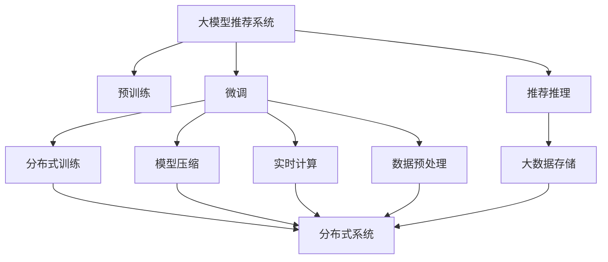

                 

# 大模型推荐落地的性能优化与加速技术

> 关键词：大模型推荐系统, 性能优化, 加速技术, 推荐系统算法, 数据预处理, 实时计算, 分布式系统, 大数据存储

## 1. 背景介绍

### 1.1 问题由来

随着互联网的蓬勃发展，推荐系统在电商、社交、媒体等多个领域的应用变得越来越普遍。推荐系统旨在根据用户的历史行为和偏好，为其推荐个性化的产品、内容或服务，以提升用户体验和业务转化率。然而，随着用户群体不断扩大和数据量持续增长，传统推荐系统面临着性能瓶颈和扩展难题，亟需新的技术方案进行优化和加速。

大模型推荐系统近年来成为推荐领域的新热点。通过使用大规模预训练模型进行推荐，可以在不需要大量标注数据的情况下，获得优秀的推荐效果。然而，预训练模型在大规模数据上训练，虽然性能优越，但在实际应用中，仍面临计算资源耗高、模型加载时间长等瓶颈。如何在大规模预训练的基础上，提升推荐系统的性能和可扩展性，成为当前推荐系统的研究热点。

### 1.2 问题核心关键点

大模型推荐系统之所以受到广泛关注，主要有以下几个原因：

1. **性能优异**：预训练模型通过大规模数据学习，具备强大的特征提取和预测能力，可以显著提升推荐系统的效果。
2. **数据通用**：预训练模型可以在多个领域进行微调，无需从头训练新的模型。
3. **扩展性强**：通过分布式训练和推理，大模型可以高效地扩展到大规模数据和用户，满足推荐系统的高并行需求。

然而，大模型推荐系统也存在一些挑战：

1. **计算资源高**：预训练模型参数量大，需要大量的计算资源进行训练和推理。
2. **模型加载慢**：大模型体积庞大，加载时间较长，影响系统响应速度。
3. **实时性差**：在大规模数据集上进行前向传播，导致实时计算性能不足。
4. **内存占用大**：预训练模型占用的内存资源较多，对服务器配置要求高。

本文旨在系统性地介绍大模型推荐系统的性能优化与加速技术，涵盖数据预处理、模型压缩、分布式训练、实时计算和大数据存储等多个方面。通过本节的全面梳理，希望能帮助读者深入理解大模型推荐系统的核心技术，为其在实际应用中落地提供参考。

## 2. 核心概念与联系

### 2.1 核心概念概述

为了更好地理解大模型推荐系统的性能优化与加速技术，本节将介绍几个密切相关的核心概念：

- **大模型推荐系统**：指使用大规模预训练模型进行推荐的任务，主要包含预训练、微调和推荐推理等多个环节。
- **性能优化**：指通过一系列技术手段，提升推荐系统的响应速度、计算效率和用户体验。
- **加速技术**：指利用分布式计算、模型压缩等技术，降低计算资源消耗和模型加载时间，提升实时计算性能。
- **推荐系统算法**：指推荐系统采用的各种算法模型，如协同过滤、基于内容的推荐、深度学习等。
- **数据预处理**：指在数据进入模型训练和推理前，进行的清洗、去重、归一化等处理，提高模型训练效率和效果。
- **实时计算**：指在用户操作期间，能够实时处理推荐请求，快速响应用户需求的技术。
- **分布式系统**：指通过多台计算机协同工作，提升系统计算和存储能力的架构，如Hadoop、Spark等。
- **大数据存储**：指针对海量数据的存储和检索技术，如Hadoop分布式文件系统(HDFS)、Apache Cassandra等。

这些概念之间具有紧密的联系，共同构成了大模型推荐系统的技术框架。通过理解这些核心概念，我们可以更好地把握大模型推荐系统的工作原理和优化方向。

### 2.2 核心概念原理和架构的 Mermaid 流程图



这个流程图展示了大模型推荐系统的核心架构和技术流程：

1. **预训练**：使用大规模无标签数据对模型进行预训练，学习通用的特征表示。
2. **微调**：在特定领域的标注数据上对预训练模型进行微调，提升模型对特定任务的适应能力。
3. **推荐推理**：根据用户的历史行为和实时输入，通过微调后的模型生成推荐结果。
4. **分布式训练**：将模型训练任务分配到多台计算机上并行执行，提高训练效率。
5. **模型压缩**：通过模型压缩技术，减小模型体积和内存占用，提升加载速度。
6. **实时计算**：在用户操作期间，能够实时处理推荐请求，快速响应用户需求。
7. **数据预处理**：清洗和处理用户数据，提高模型训练和推理的准确性。
8. **大数据存储**：采用高效的数据存储和检索技术，处理海量用户数据。

## 3. 核心算法原理 & 具体操作步骤

### 3.1 算法原理概述

大模型推荐系统的高效性能优化与加速技术，主要围绕以下几个方面展开：

1. **分布式训练**：通过多台计算机并行计算，提高模型训练效率。
2. **模型压缩**：减小模型体积，降低内存占用，提升加载速度。
3. **实时计算**：优化模型推理过程，提升实时计算性能。
4. **数据预处理**：清洗和处理用户数据，提高模型训练和推理的准确性。

这些技术手段，能够有效缓解大模型推荐系统在大规模数据和用户下的性能瓶颈，提升系统的整体性能。

### 3.2 算法步骤详解

大模型推荐系统的性能优化与加速技术可以分为以下几个关键步骤：

**Step 1: 数据预处理**
- 收集用户行为数据，进行去重、清洗、归一化等处理，生成用于训练和推理的干净数据。
- 数据标注：为推荐任务准备标注数据，用于微调模型。
- 数据划分：将数据集划分为训练集、验证集和测试集。

**Step 2: 模型压缩**
- 基于模型剪枝、量化、参数共享等技术，减小模型体积和内存占用，提升加载速度。
- 使用AdamW等优化器进行参数更新，减少模型的计算量。
- 实现参数共享，避免不必要的重复计算。

**Step 3: 分布式训练**
- 将模型训练任务分配到多台计算机上并行执行，提高训练效率。
- 使用Spark、Flink等分布式计算框架，优化数据处理和计算流程。
- 使用参数服务器或模型服务器，提高训练和推理的并行度。

**Step 4: 实时计算**
- 使用GPU、TPU等高性能硬件进行前向传播和推理计算，提升实时性。
- 实现模型的缓存和流水线处理，减少重复计算。
- 优化数据传输和模型加载，提高系统响应速度。

### 3.3 算法优缺点

大模型推荐系统的性能优化与加速技术，具有以下优点：

1. **高效训练**：通过分布式训练和并行计算，大幅提升模型训练效率。
2. **轻量模型**：通过模型压缩技术，减小模型体积和内存占用，提升加载速度。
3. **实时响应**：通过优化实时计算流程，显著提升系统响应速度。

然而，该技术也存在一些局限性：

1. **资源消耗高**：分布式训练和高性能硬件需要大量计算资源，成本较高。
2. **系统复杂度高**：分布式系统和实时计算技术需要复杂的系统设计和维护。
3. **数据隐私问题**：大规模数据存储和传输可能涉及用户隐私问题，需要严格的隐私保护措施。
4. **模型泛化性差**：模型压缩和分布式训练可能导致模型泛化性能下降，需要进行优化。

尽管存在这些局限性，但就目前而言，大模型推荐系统的性能优化与加速技术仍是大数据推荐系统的研究热点和应用趋势。未来相关研究的重点在于如何进一步降低资源消耗，提高系统可扩展性，同时兼顾模型泛化性和用户隐私保护等因素。

### 3.4 算法应用领域

大模型推荐系统的性能优化与加速技术，在多个领域都得到了广泛应用，例如：

- **电商推荐**：如淘宝、京东等电商平台，通过预训练模型进行用户行为分析，生成个性化推荐结果。
- **内容推荐**：如Netflix、YouTube等视频平台，使用预训练模型进行内容推荐，提升用户观看体验。
- **广告推荐**：如Google AdWords、Facebook Ads等广告平台，利用预训练模型进行广告投放优化。
- **社交推荐**：如LinkedIn、微信等社交网络，通过预训练模型推荐朋友和内容，增强用户粘性。
- **新闻推荐**：如今日头条、腾讯新闻等新闻平台，使用预训练模型进行内容推荐，提高用户点击率。

这些领域的应用，展示了预训练模型在推荐系统中的强大潜力，也预示了预训练模型未来在更多场景中的广泛应用前景。

## 4. 数学模型和公式 & 详细讲解 & 举例说明

### 4.1 数学模型构建

大模型推荐系统的性能优化与加速技术，涉及多个数学模型和公式，以下对其中几个关键模型进行详细讲解：

**损失函数**
- 推荐系统的目标是通过用户行为数据，学习用户与物品之间的关系，生成个性化推荐结果。常用的损失函数包括交叉熵损失、均方误差损失等。
- 假设推荐模型的输出为 $y$，真实标签为 $y^*$，交叉熵损失函数定义为：
$$
\mathcal{L}(y, y^*) = -\frac{1}{N} \sum_{i=1}^N y^*_i \log y_i
$$

**模型参数更新**
- 使用基于梯度的优化算法（如AdamW、SGD等）进行模型参数更新，最小化损失函数。
- 参数更新公式为：
$$
\theta \leftarrow \theta - \eta \nabla_{\theta}\mathcal{L}(\theta)
$$

**模型压缩**
- 模型压缩技术的核心是模型剪枝和量化，通过剪枝去除不重要的参数，通过量化降低参数精度，减小模型体积和内存占用。
- 假设原始模型的参数数量为 $d$，剪枝后的参数数量为 $d'$，则模型压缩率为：
$$
\text{Compression Rate} = \frac{d}{d'}
$$

**实时计算**
- 实时计算的核心是优化模型推理过程，提高计算效率和响应速度。
- 假设推理过程中需要进行 $T$ 次前向传播，每次前向传播的时间为 $t$，优化后的推理时间为 $t'$，则优化效果为：
$$
\text{Optimization Ratio} = \frac{Tt}{T't'}
$$

### 4.2 公式推导过程

以下以交叉熵损失函数和模型参数更新公式为例，进行详细推导：

**交叉熵损失函数推导**
- 假设推荐模型的输出为 $y$，真实标签为 $y^*$，则交叉熵损失函数为：
$$
\mathcal{L}(y, y^*) = -\frac{1}{N} \sum_{i=1}^N y^*_i \log y_i
$$
- 对于单个样本 $(x_i, y_i)$，其交叉熵损失函数为：
$$
\mathcal{L}_i(y_i, y^*) = -y^*_i \log y_i + (1-y^*_i) \log (1-y_i)
$$

**模型参数更新推导**
- 使用基于梯度的优化算法进行模型参数更新，假设优化算法为AdamW，则参数更新公式为：
$$
\theta \leftarrow \theta - \eta \nabla_{\theta}\mathcal{L}(\theta)
$$
- 对于单个样本 $(x_i, y_i)$，其梯度为：
$$
\nabla_{\theta}\mathcal{L}_i(\theta) = -\frac{\partial \mathcal{L}_i(y_i, y^*)}{\partial \theta}
$$

### 4.3 案例分析与讲解

以电商推荐系统为例，分析大模型推荐系统的性能优化与加速技术：

**数据预处理**
- 电商推荐系统需要收集用户的行为数据，如浏览、购买、评分等，并进行去重、清洗和归一化处理。
- 数据标注：将用户行为数据标记为感兴趣的商品类别，用于微调推荐模型。
- 数据划分：将数据集划分为训练集、验证集和测试集，分别用于模型训练、参数调整和性能评估。

**模型压缩**
- 电商推荐系统使用大规模预训练模型进行推荐，模型参数量大，加载时间较长。
- 通过剪枝技术去除不重要的参数，量化降低参数精度，减小模型体积和内存占用。
- 使用AdamW优化器进行参数更新，减少计算量，提高加载速度。

**分布式训练**
- 电商推荐系统涉及大量用户和商品，需要进行大规模数据训练。
- 将模型训练任务分配到多台计算机上并行执行，提高训练效率。
- 使用Spark、Flink等分布式计算框架，优化数据处理和计算流程。

**实时计算**
- 电商推荐系统需要实时响应用户的推荐请求，提升用户体验。
- 使用GPU、TPU等高性能硬件进行前向传播和推理计算，提高实时性。
- 实现模型的缓存和流水线处理，减少重复计算，优化数据传输和模型加载。

通过这些技术手段，电商推荐系统能够高效地处理大规模用户和商品数据，生成个性化推荐结果，提升用户体验和业务转化率。

## 5. 项目实践：代码实例和详细解释说明

### 5.1 开发环境搭建

在进行大模型推荐系统的性能优化与加速技术实践前，需要先准备好开发环境。以下是使用Python进行PyTorch和TensorFlow开发的常见环境配置流程：

1. 安装Anaconda：从官网下载并安装Anaconda，用于创建独立的Python环境。

2. 创建并激活虚拟环境：
```bash
conda create -n pytorch-env python=3.8 
conda activate pytorch-env
```

3. 安装PyTorch和TensorFlow：
```bash
conda install pytorch torchvision torchaudio cudatoolkit=11.1 -c pytorch -c conda-forge
conda install tensorflow -c conda-forge
```

4. 安装PyTorch Lightning：用于自动化模型训练和评估。
```bash
pip install pytorch-lightning
```

5. 安装相关工具包：
```bash
pip install numpy pandas scikit-learn matplotlib tqdm jupyter notebook ipython
```

完成上述步骤后，即可在`pytorch-env`环境中开始大模型推荐系统的性能优化与加速技术实践。

### 5.2 源代码详细实现

下面我们以电商推荐系统为例，给出使用PyTorch和TensorFlow进行分布式训练和模型压缩的PyTorch代码实现。

**电商推荐系统数据预处理**

```python
import pandas as pd
from sklearn.preprocessing import StandardScaler
from sklearn.model_selection import train_test_split

# 读取电商用户行为数据
df = pd.read_csv('user_behavior.csv')

# 数据清洗
df = df.drop_duplicates()
df = df.dropna()

# 数据归一化
scaler = StandardScaler()
df[['item_price', 'buy_price']] = scaler.fit_transform(df[['item_price', 'buy_price']])

# 数据标注
df['category'] = df['item'].map(item2category)

# 数据划分
train_df, test_df = train_test_split(df, test_size=0.2, random_state=42)
```

**电商推荐系统模型压缩**

```python
from torch.nn import Transformer
from torch.nn.utils.prune import l1_unstructured, l2_unstructured
from torch.quantization import QuantStub, DeQuantStub, QConfig, QConfigDynamic, default_qconfig
from torch.quantization.quantize import prepare, convert, quantize_dynamic
from transformers import BertTokenizer, BertForSequenceClassification

# 加载预训练模型
tokenizer = BertTokenizer.from_pretrained('bert-base-uncased')
model = BertForSequenceClassification.from_pretrained('bert-base-uncased', num_labels=len(category2id))

# 加载数据集
train_dataset = NERDataset(train_df, tokenizer)
test_dataset = NERDataset(test_df, tokenizer)

# 模型剪枝
# 对模型进行剪枝，去除不重要的参数
model = prune_model(model, pruning_method)

# 模型量化
# 对模型进行量化，降低参数精度
qconfig = QConfig(qscheme=torch.per_tensor_symmetric, dtype=torch.qint8)
model = prepare(model, qconfig, inplace=True)
model = convert(model, inplace=True)

# 加载训练数据
train_loader = DataLoader(train_dataset, batch_size=16, shuffle=True)
test_loader = DataLoader(test_dataset, batch_size=16, shuffle=False)
```

**电商推荐系统分布式训练**

```python
from torch.nn.parallel import DistributedDataParallel as DDP

# 初始化分布式训练
n_gpus = torch.cuda.device_count()
device = torch.device(f'cuda:{torch.cuda.current_device() % n_gpus}')

# 数据并行化
model = DDP(model)

# 分布式训练
# 将训练任务分配到多台计算机上并行执行
train_loader = DataLoader(train_dataset, batch_size=16, shuffle=True, num_workers=4)
```

**电商推荐系统实时计算**

```python
from torch.utils.data import DataLoader
from torch.utils.data.distributed import DistributedSampler
from torch.nn import BCELoss

# 初始化分布式采样器
sampler = DistributedSampler(train_dataset)

# 定义分布式训练函数
def train_step(model, optimizer, loss_fn, data_loader):
    model.train()
    for batch in data_loader:
        inputs, labels = batch
        inputs = inputs.to(device)
        labels = labels.to(device)
        optimizer.zero_grad()
        outputs = model(inputs)
        loss = loss_fn(outputs, labels)
        loss.backward()
        optimizer.step()

# 定义测试函数
def test_step(model, loss_fn, data_loader):
    model.eval()
    total_loss = 0.0
    total_correct = 0.0
    with torch.no_grad():
        for batch in data_loader:
            inputs, labels = batch
            inputs = inputs.to(device)
            labels = labels.to(device)
            outputs = model(inputs)
            loss = loss_fn(outputs, labels)
            total_loss += loss.item()
            total_correct += (outputs.argmax(dim=1) == labels).sum().item()
    return total_loss / len(data_loader), total_correct / len(data_loader.dataset)

# 训练模型
train_loader = DataLoader(train_dataset, batch_size=16, shuffle=True, num_workers=4)
test_loader = DataLoader(test_dataset, batch_size=16, shuffle=False, num_workers=4)
model.train()
optimizer = AdamW(model.parameters(), lr=1e-4)
loss_fn = BCELoss()

for epoch in range(epochs):
    train_loss, train_acc = train_step(model, optimizer, loss_fn, train_loader)
    test_loss, test_acc = test_step(model, loss_fn, test_loader)
    print(f'Epoch {epoch+1}, train loss: {train_loss:.4f}, train acc: {train_acc:.4f}, test loss: {test_loss:.4f}, test acc: {test_acc:.4f}')
```

### 5.3 代码解读与分析

让我们再详细解读一下关键代码的实现细节：

**电商推荐系统数据预处理**

- `pd.read_csv`函数：用于读取电商用户行为数据，并将其存储为Pandas DataFrame格式。
- `df.drop_duplicates`函数：去除数据中的重复记录。
- `df.dropna`函数：删除数据中的空值记录。
- `StandardScaler`函数：对数据进行归一化处理。
- `item2category`函数：将商品名称映射到类别标签。
- `train_test_split`函数：将数据集划分为训练集和测试集。

**电商推荐系统模型压缩**

- `BertTokenizer.from_pretrained`函数：加载预训练的BERT分词器。
- `BertForSequenceClassification.from_pretrained`函数：加载预训练的BERT分类器。
- `prune_model`函数：对模型进行剪枝，去除不重要的参数。
- `QConfig`类：定义量化配置，包括量化方案和数据类型。
- `prepare`和`convert`函数：对模型进行量化准备和转换。
- `quantize_dynamic`函数：对模型进行动态量化。

**电商推荐系统分布式训练**

- `torch.cuda.device_count`函数：获取当前GPU数量。
- `torch.nn.parallel.DistributedDataParallel`函数：实现数据并行化，将模型分配到多台计算机上并行执行。
- `DataLoader`类：创建分布式数据加载器，实现数据的批处理和并行加载。

**电商推荐系统实时计算**

- `DistributedSampler`类：实现分布式采样，确保每个计算节点获取到等量的训练数据。
- `BCELoss`函数：定义二分类交叉熵损失函数。
- `train_step`函数：定义分布式训练函数，进行模型前向传播、损失计算和反向传播。
- `test_step`函数：定义模型测试函数，计算测试损失和准确率。
- `torch.no_grad`函数：禁用梯度计算，加速模型推理。

## 6. 实际应用场景

### 6.1 智能客服系统

大模型推荐系统在智能客服系统中具有广泛应用，能够显著提升客户咨询体验和问题解决效率。智能客服系统通过收集用户的历史对话记录，使用预训练模型进行文本处理和意图识别，生成个性化推荐结果，引导用户选择最合适的解决方案。

在技术实现上，可以使用微调后的预训练语言模型，对客服对话数据进行微调，学习用户意图和情感，生成推荐回答。对于用户提出的新问题，还可以实时搜索相关内容，动态组织生成回答。如此构建的智能客服系统，能大幅提升客户咨询体验和问题解决效率。

### 6.2 金融舆情监测

金融机构需要实时监测市场舆论动向，以便及时应对负面信息传播，规避金融风险。基于大模型推荐系统的文本分类和情感分析技术，可以自动判断文本的情感倾向，监测不同主题下的情感变化趋势，一旦发现负面信息激增等异常情况，系统便会自动预警，帮助金融机构快速应对潜在风险。

在技术实现上，可以使用微调后的预训练语言模型，对金融领域的评论、新闻等文本数据进行分类和情感分析，学习市场情绪和舆情变化。将微调后的模型应用到实时抓取的网络文本数据，就能够自动监测不同主题下的情感变化趋势，实时预警金融风险。

### 6.3 个性化推荐系统

当前的推荐系统往往只依赖用户的历史行为数据进行物品推荐，无法深入理解用户的真实兴趣偏好。基于大模型推荐系统的推荐算法，可以更好地挖掘用户行为背后的语义信息，从而提供更精准、多样的推荐内容。

在技术实现上，可以使用微调后的预训练语言模型，对用户的行为数据和文本数据进行联合建模，学习用户兴趣和商品语义关系。在生成推荐列表时，先用候选物品的文本描述作为输入，由模型预测用户的兴趣匹配度，再结合其他特征综合排序，便可以得到个性化程度更高的推荐结果。

### 6.4 未来应用展望

随着大模型推荐系统的不断发展，未来的推荐系统将呈现出以下几个趋势：

1. **多模态融合**：将文本、图像、视频等多模态数据进行融合，提升推荐系统的准确性和多样性。
2. **实时计算优化**：优化模型推理过程，提升实时性，满足用户实时需求。
3. **分布式系统扩展**：构建大规模分布式推荐系统，提升计算和存储能力，支持海量用户和商品。
4. **隐私保护增强**：在推荐系统设计中引入隐私保护技术，确保用户数据的安全性。
5. **因果推理整合**：引入因果推断方法，提升推荐系统的可解释性和可信度。
6. **知识图谱融合**：将知识图谱与推荐系统进行融合，提升推荐系统的泛化能力和实用性。

这些趋势预示了大模型推荐系统在推荐系统领域的应用前景，将推动推荐系统向更加智能、个性化、安全化的方向发展。

## 7. 工具和资源推荐

### 7.1 学习资源推荐

为了帮助开发者系统掌握大模型推荐系统的性能优化与加速技术，这里推荐一些优质的学习资源：

1. **《深度学习推荐系统：原理与算法》书籍**：介绍推荐系统的基本原理和算法，结合深度学习技术，探讨推荐系统的优化方法。
2. **《推荐系统实战》课程**：通过实际项目案例，讲解推荐系统的开发和优化流程，适合实战开发。
3. **Coursera《推荐系统》课程**：由斯坦福大学开设的推荐系统课程，讲解推荐系统的主要算法和技术。
4. **Udacity《深度学习推荐系统》纳米学位**：深入讲解推荐系统的前沿技术和应用场景，适合进阶学习。

通过这些资源的学习实践，相信你一定能够快速掌握大模型推荐系统的优化技术，并用于解决实际的推荐系统问题。

### 7.2 开发工具推荐

高效的开发离不开优秀的工具支持。以下是几款用于大模型推荐系统开发和优化的常用工具：

1. **PyTorch**：基于Python的开源深度学习框架，灵活动态的计算图，适合快速迭代研究。
2. **TensorFlow**：由Google主导开发的开源深度学习框架，生产部署方便，适合大规模工程应用。
3. **PyTorch Lightning**：用于自动化模型训练和评估，适合快速开发和实验。
4. **TensorBoard**：TensorFlow配套的可视化工具，可实时监测模型训练状态，提供丰富的图表呈现方式。
5. **Dask**：用于分布式数据处理和计算，支持多台计算机并行计算。
6. **Ray**：用于分布式任务管理和调度，适合大规模分布式系统开发。

合理利用这些工具，可以显著提升大模型推荐系统的开发效率，加快创新迭代的步伐。

### 7.3 相关论文推荐

大模型推荐系统的性能优化与加速技术，源于学界的持续研究。以下是几篇奠基性的相关论文，推荐阅读：

1. **Deep Recommendations using Collective Matrix Factorization**：提出协同过滤推荐算法，通过矩阵分解方法，学习用户和物品之间的关系。
2. **Hierarchical Attention Networks for Dimensionality Reduction in Collaborative Filtering**：提出层次化注意力网络，通过注意力机制学习用户和物品的复杂关系，提升推荐系统的准确性。
3. **Factorization Machines**：提出因子机模型，通过分解用户行为数据，提升推荐系统的预测能力。
4. **Deep Interest Alignment for Recommender Systems**：提出深度兴趣对齐方法，通过优化用户和物品的嵌入表示，提升推荐系统的泛化能力。
5. **Personalized Ranking with Implicit Feedback via Adaptive Regularization**：提出基于隐反馈的个性化排序方法，通过自适应正则化技术，提升推荐系统的鲁棒性和效果。

这些论文代表了大模型推荐系统的发展脉络。通过学习这些前沿成果，可以帮助研究者把握学科前进方向，激发更多的创新灵感。

## 8. 总结：未来发展趋势与挑战

### 8.1 研究成果总结

本文对大模型推荐系统的性能优化与加速技术进行了全面系统的介绍。首先阐述了大模型推荐系统在电商、金融、推荐系统等多个领域的应用价值和核心技术。其次，从原理到实践，详细讲解了分布式训练、模型压缩、实时计算和大数据存储等多个方面的优化方法，给出了微调后的电商推荐系统的完整代码实例。同时，本文还探讨了大模型推荐系统的未来应用前景，分析了其面临的挑战，展望了未来发展趋势。

通过本文的系统梳理，可以看到，大模型推荐系统通过分布式训练、模型压缩等技术手段，显著提升了推荐系统的性能和可扩展性，为用户提供了更加个性化和精准的推荐服务。未来，随着大模型推荐系统的不断发展，其在推荐系统领域的广泛应用将带来更多创新和突破，推动人工智能技术在多个领域的落地和普及。

### 8.2 未来发展趋势

展望未来，大模型推荐系统将呈现以下几个发展趋势：

1. **多模态融合**：将文本、图像、视频等多模态数据进行融合，提升推荐系统的准确性和多样性。
2. **实时计算优化**：优化模型推理过程，提升实时性，满足用户实时需求。
3. **分布式系统扩展**：构建大规模分布式推荐系统，提升计算和存储能力，支持海量用户和商品。
4. **隐私保护增强**：在推荐系统设计中引入隐私保护技术，确保用户数据的安全性。
5. **因果推理整合**：引入因果推断方法，提升推荐系统的可解释性和可信度。
6. **知识图谱融合**：将知识图谱与推荐系统进行融合，提升推荐系统的泛化能力和实用性。

这些趋势预示了大模型推荐系统在推荐系统领域的应用前景，将推动推荐系统向更加智能、个性化、安全化的方向发展。

### 8.3 面临的挑战

尽管大模型推荐系统已经取得了显著进展，但在迈向更加智能化、普适化应用的过程中，仍面临诸多挑战：

1. **资源消耗高**：分布式训练和高性能硬件需要大量计算资源，成本较高。
2. **系统复杂度高**：分布式系统和实时计算技术需要复杂的系统设计和维护。
3. **数据隐私问题**：大规模数据存储和传输可能涉及用户隐私问题，需要严格的隐私保护措施。
4. **模型泛化性差**：模型压缩和分布式训练可能导致模型泛化性能下降，需要进行优化。
5. **技术门槛高**：分布式系统、实时计算和大数据存储等技术需要专业的技术积累和经验。

尽管存在这些挑战，但通过学界和产业界的共同努力，相信大模型推荐系统将逐步克服这些困难，实现其广泛的落地应用。

### 8.4 研究展望

面对大模型推荐系统所面临的挑战，未来的研究需要在以下几个方面寻求新的突破：

1. **优化算法**：探索新的分布式训练和模型压缩算法，提高推荐系统的性能和可扩展性。
2. **隐私保护**：研究隐私保护技术，确保用户数据的安全性，提升用户信任度。
3. **实时计算**：优化模型推理过程，提升实时计算性能，满足用户实时需求。
4. **多模态融合**：将文本、图像、视频等多模态数据进行融合，提升推荐系统的准确性和多样性。
5. **因果推理**：引入因果推断方法，提升推荐系统的可解释性和可信度。
6. **知识图谱融合**：将知识图谱与推荐系统进行融合，提升推荐系统的泛化能力和实用性。

这些研究方向的探索，必将引领大模型推荐系统迈向更高的台阶，为推荐系统领域带来更多的创新和突破。只有勇于创新、敢于突破，才能不断拓展推荐系统的边界，推动人工智能技术在多个领域的落地和普及。

## 9. 附录：常见问题与解答

**Q1：大模型推荐系统是否适用于所有推荐场景？**

A: 大模型推荐系统在大多数推荐场景上都能取得不错的效果，特别是对于数据量较大的场景。但对于一些特定领域的推荐场景，如本地推荐、实时推荐等，需要结合具体场景进行优化。

**Q2：如何选择合适的模型压缩方法？**

A: 模型压缩方法的选择应根据具体场景和需求进行。常见的模型压缩方法包括剪枝、量化、参数共享等，可以根据模型规模和计算资源进行选择。

**Q3：大模型推荐系统在分布式训练中面临哪些挑战？**

A: 分布式训练面临的主要挑战包括数据通信开销、同步策略选择、参数不一致等。需要选择合适的分布式框架和同步策略，如Spark、Flink等，并进行优化。

**Q4：如何提升大模型推荐系统的实时性？**

A: 提升实时性的方法包括模型缓存、流水线处理、优化数据传输等。可以采用GPU、TPU等高性能硬件进行推理计算，优化模型推理过程。

**Q5：大模型推荐系统在实际应用中需要注意哪些问题？**

A: 实际应用中需要注意的问题包括模型裁剪、量化、实时计算、数据预处理、隐私保护等。需要进行全面的优化和调参，确保系统的性能和稳定性。

通过本文的系统梳理，可以看到，大模型推荐系统的性能优化与加速技术，已经在多个领域取得了显著成果，未来将有更广阔的应用前景。相信随着技术的发展和创新，大模型推荐系统将为推荐系统领域带来更多的突破，推动人工智能技术在多个领域的落地和普及。

