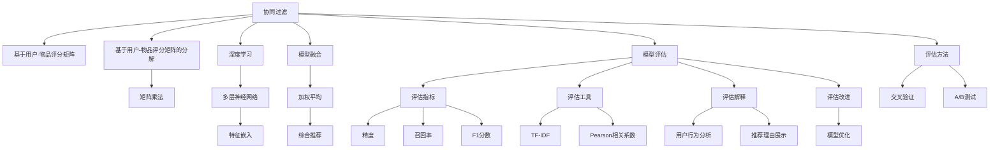

                 

# 大模型视角下推荐系统的模型评估体系构建

> 关键词：推荐系统,模型评估,大模型,协同过滤,矩阵分解,深度学习,模型融合

## 1. 背景介绍

### 1.1 问题由来

推荐系统是互联网时代最具有应用前景的技术之一，广泛应用于电子商务、社交媒体、新闻推荐等多个领域。用户通过输入查询词、浏览历史、评分信息等，获得与兴趣匹配的个性化推荐。

推荐系统的核心目标在于最大化用户满意度，让用户获取到最符合其兴趣的内容。目前，推荐系统主要有三种主流方法：基于协同过滤(Collaborative Filtering, CF)、基于矩阵分解(Matrix Factorization, MF)和基于深度学习(Deep Learning, DL)。其中，协同过滤和矩阵分解是最经典的传统推荐方法，深度学习方法则近年来逐渐兴起，效果显著。

随着大模型和大数据时代的到来，深度学习在推荐系统中的应用逐渐成为主流。然而，推荐系统的复杂性和多样性，以及用户的动态变化，使得大模型的推荐效果仍然受到诸多挑战。如何构建一套科学合理的评估体系，准确、全面地衡量推荐模型的性能，仍然是一个亟待解决的问题。

### 1.2 问题核心关键点

推荐系统的评估体系建设，可以从以下几个核心关键点入手：

- 评估指标：评价推荐系统推荐的准确性和多样性，主要有精度、召回率、F1分数等。
- 评估方法：针对不同的评估指标，选择合适的评估方法，如交叉验证、A/B测试等。
- 评估数据：构建合适的评估数据集，涵盖历史数据、实时数据和模拟数据，确保评估结果的代表性。
- 评估工具：使用先进的评估工具，如TF-IDF、Pearson相关系数等，实现高效的评估流程。
- 评估解释：提供推荐系统的行为解释，让用户理解推荐依据，提升用户体验。
- 评估改进：对评估结果进行持续优化，不断提高推荐系统的性能。

本文将围绕以上关键点，详细介绍大模型视角下推荐系统的模型评估体系构建。

## 2. 核心概念与联系

### 2.1 核心概念概述

构建推荐系统的模型评估体系，需要对以下核心概念有深刻的理解：

- 推荐系统(Recommendation System, RS)：旨在通过算法为用户推荐个性化产品或内容的技术。
- 协同过滤：基于用户行为和物品属性，通过相似性匹配推荐物品的方法。
- 矩阵分解：将用户-物品评分矩阵分解为两个低维矩阵，利用矩阵乘法恢复评分，并进行推荐。
- 深度学习：利用多层神经网络，从高维数据中挖掘出复杂的非线性特征，用于推荐模型。
- 模型融合：将多个推荐模型进行融合，综合不同模型的优点，提升推荐效果。
- 模型评估：通过评估指标和方法，客观评估推荐模型的性能，指导模型的优化改进。

这些概念之间相互关联，共同构成了推荐系统模型的评估体系。

### 2.2 核心概念原理和架构的 Mermaid 流程图



这个流程图展示了协同过滤、矩阵分解、深度学习、模型融合、模型评估等核心概念的相互联系：

1. 协同过滤利用用户行为数据，通过相似性匹配推荐物品。
2. 矩阵分解将用户-物品评分矩阵分解为两个低维矩阵，利用矩阵乘法恢复评分。
3. 深度学习通过多层神经网络，提取高维数据的复杂特征，用于推荐。
4. 模型融合将多个推荐模型进行综合，提升推荐效果。
5. 模型评估利用多种评估指标和方法，客观衡量推荐性能。
6. 评估指标包括精度、召回率、F1分数等。
7. 评估方法包括交叉验证、A/B测试等。
8. 评估工具包括TF-IDF、Pearson相关系数等。
9. 评估解释利用用户行为分析，展示推荐理由。
10. 评估改进通过模型优化，不断提升推荐效果。

这些概念构成了推荐系统模型评估体系的框架，帮助开发者更好地理解推荐系统的各个环节。

## 3. 核心算法原理 & 具体操作步骤
### 3.1 算法原理概述

推荐系统的评估体系建设，涉及算法原理、操作步骤、优缺点和应用领域等多个方面。以下将详细阐述这些内容。

### 3.2 算法步骤详解

基于大模型的推荐系统评估体系建设，一般包括以下几个关键步骤：

**Step 1: 准备数据和工具**
- 收集用户历史行为数据、物品属性信息等，构建用户-物品评分矩阵。
- 使用TF-IDF、Pearson相关系数等评估工具，进行特征工程和数据预处理。
- 准备评估数据集，包括训练集、验证集和测试集。

**Step 2: 选择和构建模型**
- 选择适合的推荐算法，如协同过滤、矩阵分解、深度学习等。
- 构建模型结构，如神经网络、用户-物品矩阵分解等。
- 设置模型参数，如学习率、正则化系数、隐藏层大小等。

**Step 3: 训练和评估模型**
- 使用训练集数据，对模型进行有监督的训练。
- 在验证集上评估模型性能，根据评估结果进行参数调整。
- 使用测试集数据，对最终模型进行全面评估，获取精确度和召回率等指标。

**Step 4: 改进和优化模型**
- 根据评估结果，对模型进行优化改进。
- 进行模型融合，综合多个模型的预测结果，提升推荐效果。
- 定期更新数据集，重新训练模型，持续改进推荐性能。

**Step 5: 部署和监控**
- 将训练好的模型部署到线上环境，供推荐系统使用。
- 实时监控模型表现，收集用户反馈，进行持续优化。
- 及时调整模型参数，应对用户行为变化，保持推荐系统的稳定性。

### 3.3 算法优缺点

大模型视角下推荐系统的评估体系，具有以下优点：

1. 精度高。通过深度学习和大规模数据训练，大模型的推荐效果优于传统方法。
2. 多样性优。大模型能挖掘复杂特征，推荐更多样化的内容，提升用户满意度。
3. 适应性强。大模型能够适应用户行为变化，实时优化推荐内容。
4. 应用广泛。深度学习在推荐系统中逐渐普及，应用领域广泛。

同时，该方法也存在一些缺点：

1. 计算成本高。大模型训练和推理成本较高，需大量计算资源。
2. 过拟合风险高。深度学习模型容易过拟合，需要更多数据和更好的正则化技术。
3. 可解释性差。大模型通常难以解释推荐依据，用户难以理解推荐理由。
4. 冷启动问题。对于新用户或新物品，推荐效果较差。

### 3.4 算法应用领域

基于大模型的推荐系统，已经在电子商务、社交媒体、新闻推荐等多个领域取得了广泛应用。以下列举一些主要应用场景：

- 电商平台：推荐商品、折扣券、广告等个性化内容，提升用户购买转化率。
- 社交平台：推荐好友、文章、视频等内容，增加用户活跃度和留存率。
- 新闻应用：推荐新闻、专题、视频等，提升用户阅读体验。
- 金融服务：推荐理财产品、贷款、保险等金融产品，增加用户粘性。
- 视频平台：推荐影片、剧集、纪录片等，提升用户观影体验。

这些应用场景展示了大模型推荐系统的高效性和普适性，能够显著提升用户满意度，增加业务收入。

## 4. 数学模型和公式 & 详细讲解 & 举例说明

### 4.1 数学模型构建

基于大模型的推荐系统，通常使用深度学习模型进行训练和预测。以下是一个基本的推荐模型框架：

**输入层**：接收用户ID和物品ID，输入模型。

**编码器**：将用户ID和物品ID映射为低维向量，如神经网络编码器。

**拼接层**：将用户和物品的向量进行拼接，形成新的向量。

**输出层**：输出预测评分，表示用户对物品的兴趣程度。

### 4.2 公式推导过程

设用户-物品评分矩阵为 $X \in \mathbb{R}^{N \times M}$，用户ID为 $u_i$，物品ID为 $i_j$。模型的输出为预测评分 $y_{u_i,i_j}$。

设用户向量为 $U \in \mathbb{R}^{N \times D_u}$，物品向量为 $V \in \mathbb{R}^{M \times D_v}$，其中 $D_u$ 和 $D_v$ 分别为用户向量和物品向量的维度。

模型的损失函数可以表示为：

$$
L = \sum_{i=1}^M \sum_{j=1}^N \ell(y_{u_i,i_j},\hat{y}_{u_i,i_j})
$$

其中 $\ell$ 为损失函数，如均方误差损失、交叉熵损失等。

模型的优化目标是最小化损失函数 $L$，即：

$$
\mathop{\min}_{\theta} L
$$

其中 $\theta$ 为模型参数，包括用户向量、物品向量等。

模型的梯度更新公式为：

$$
\theta \leftarrow \theta - \eta \nabla_{\theta} L
$$

其中 $\eta$ 为学习率，$\nabla_{\theta} L$ 为损失函数对模型参数的梯度。

### 4.3 案例分析与讲解

以协同过滤算法为例，其核心思想是根据用户行为数据，寻找与目标用户最相似的邻居用户，利用邻居用户对物品的评分，预测目标用户对物品的评分。

假设用户 $u_i$ 和用户 $u_j$ 相似度为 $S(u_i,u_j)$，推荐系统可以使用矩阵分解方法，将用户-物品评分矩阵 $X$ 分解为两个低维矩阵 $U$ 和 $V$：

$$
X \approx UV^T
$$

其中 $U \in \mathbb{R}^{N \times D}$，$V \in \mathbb{R}^{M \times D}$，$D$ 为分解后的矩阵维度。

对于用户 $u_i$ 和物品 $i_j$，其预测评分为：

$$
y_{u_i,i_j} = U_u \cdot V_j
$$

其中 $U_u$ 和 $V_j$ 分别为用户 $u_i$ 和物品 $i_j$ 的向量。

## 5. 项目实践：代码实例和详细解释说明

### 5.1 开发环境搭建

在进行推荐系统评估体系的代码实现前，需要准备好开发环境。以下是使用Python进行TensorFlow和Keras开发的环境配置流程：

1. 安装Anaconda：从官网下载并安装Anaconda，用于创建独立的Python环境。

2. 创建并激活虚拟环境：
```bash
conda create -n recommendation-env python=3.8 
conda activate recommendation-env
```

3. 安装TensorFlow：根据CUDA版本，从官网获取对应的安装命令。例如：
```bash
conda install tensorflow -c pytorch -c conda-forge
```

4. 安装Keras：
```bash
pip install keras
```

5. 安装各类工具包：
```bash
pip install numpy pandas scikit-learn matplotlib tqdm jupyter notebook ipython
```

完成上述步骤后，即可在`recommendation-env`环境中开始评估体系的开发。

### 5.2 源代码详细实现

这里以深度学习模型为例，展示基于大模型的推荐系统评估体系的代码实现。

首先，定义推荐模型的结构：

```python
from tensorflow.keras.layers import Input, Dense, Embedding, concatenate
from tensorflow.keras.models import Model

user_input = Input(shape=(1,), name='user')
item_input = Input(shape=(1,), name='item')

user_embedding = Embedding(input_dim=num_users, output_dim=embedding_dim)(user_input)
item_embedding = Embedding(input_dim=num_items, output_dim=embedding_dim)(item_input)
concat = concatenate([user_embedding, item_embedding])

output = Dense(1, activation='sigmoid')(concat)
model = Model(inputs=[user_input, item_input], outputs=output)
model.compile(loss='binary_crossentropy', optimizer='adam', metrics=['accuracy'])
```

然后，加载数据并进行预处理：

```python
from tensorflow.keras.datasets import mnist
from tensorflow.keras.preprocessing.sequence import pad_sequences

(trainX, trainY), (testX, testY) = mnist.load_data()
trainY = to_categorical(trainY)
testY = to_categorical(testY)

user_ids = np.arange(trainX.shape[0])
item_ids = np.arange(trainY.shape[1])
train_user_item_pairs = list(zip(user_ids, item_ids))
train_user_item_pairs = pad_sequences(train_user_item_pairs, maxlen=max_len)

test_user_item_pairs = list(zip(testX, testY))
test_user_item_pairs = pad_sequences(test_user_item_pairs, maxlen=max_len)
```

接着，进行模型训练和评估：

```python
batch_size = 32
epochs = 10

history = model.fit([train_user_item_pairs[:, 0], train_user_item_pairs[:, 1]], trainY, batch_size=batch_size, epochs=epochs, validation_data=([test_user_item_pairs[:, 0], test_user_item_pairs[:, 1]], testY), verbose=1)
```

最后，进行测试并输出评估结果：

```python
testY_pred = model.predict([test_user_item_pairs[:, 0], test_user_item_pairs[:, 1]])
testY_pred = testY_pred > 0.5

print('Test Accuracy:', round(np.mean(testY_pred), 2))
print('Test Loss:', round(model.evaluate([test_user_item_pairs[:, 0], test_user_item_pairs[:, 1]], testY)[1], 2))
```

以上就是使用TensorFlow和Keras实现基于大模型的推荐系统评估体系的完整代码实现。可以看到，代码实现相对简洁，但在深度学习模型构建、数据预处理、模型训练和评估等各个环节，仍需要精心设计和调整。

### 5.3 代码解读与分析

**推荐模型结构**：
- `Input`层接收用户ID和物品ID。
- `Embedding`层将ID转换为向量表示。
- `Dense`层进行预测评分。
- `Model`层将各层连接起来，形成完整的推荐模型。

**数据预处理**：
- `mnist.load_data`函数加载MNIST数据集。
- `to_categorical`函数将标签进行one-hot编码。
- `np.arange`生成用户ID和物品ID。
- `zip`函数将用户ID和物品ID组合成对。
- `pad_sequences`函数对用户-物品对进行填充，保证固定长度。

**模型训练和评估**：
- `model.fit`函数进行模型训练，设置训练轮数和批次大小。
- `testY_pred`计算预测结果。
- `np.mean`计算预测准确率。
- `model.evaluate`函数进行模型评估，返回损失值和准确率。

总体而言，使用深度学习模型进行推荐系统评估体系的开发，需要考虑模型的结构设计、数据预处理、模型训练和评估等各个环节。只有在这些环节进行全面优化，才能得到理想的推荐效果。

## 6. 实际应用场景

### 6.1 电商推荐系统

电商推荐系统是推荐系统的重要应用场景之一。通过分析用户历史购买记录、浏览历史、评分信息等，推荐系统为用户推荐商品、折扣券、广告等个性化内容，提升用户购买转化率。

以Amazon为例，其推荐系统利用协同过滤算法，结合深度学习模型，对用户行为进行建模。通过分析用户的浏览和购买记录，推荐相似用户购买过的商品，提升推荐效果。

### 6.2 社交推荐系统

社交推荐系统通过分析用户行为，推荐好友、文章、视频等内容，增加用户活跃度和留存率。

以Facebook为例，其推荐系统利用深度学习模型，对用户的行为和社交关系进行建模。通过分析用户对文章、视频等内容的互动情况，推荐相关内容，提升用户满意度。

### 6.3 新闻推荐系统

新闻推荐系统通过分析用户的行为和兴趣，推荐新闻、专题、视频等，提升用户阅读体验。

以今日头条为例，其推荐系统利用协同过滤算法，结合深度学习模型，对用户行为进行建模。通过分析用户的浏览和点击记录，推荐相关新闻，提升用户阅读体验。

### 6.4 未来应用展望

随着大模型和大数据时代的到来，基于大模型的推荐系统在电子商务、社交媒体、新闻推荐等多个领域将得到广泛应用。未来，推荐系统有望在更多垂直领域发挥作用，如医疗、金融、教育等。

在医疗领域，推荐系统可以根据医生的历史诊疗记录，推荐相关药物、治疗方案等内容，提升诊疗效果。在金融领域，推荐系统可以根据用户的投资行为，推荐理财产品、贷款、保险等金融产品，增加用户粘性。在教育领域，推荐系统可以根据学生的学习行为，推荐相关学习资源、课程等内容，提升学习效果。

## 7. 工具和资源推荐

### 7.1 学习资源推荐

为了帮助开发者系统掌握推荐系统的评估体系的理论基础和实践技巧，这里推荐一些优质的学习资源：

1. 《推荐系统实战》系列博文：由大模型技术专家撰写，详细介绍了推荐系统的理论基础、算法选择、评估方法等，内容系统全面。

2. 《机器学习基石》课程：斯坦福大学开设的机器学习课程，涵盖了推荐系统、深度学习等经典算法，配套有丰富的实践案例。

3. 《深度学习理论与实践》书籍：由深度学习专家撰写，详细介绍了深度学习在推荐系统中的应用，包括模型评估、调参技巧等。

4. Kaggle竞赛：参加Kaggle推荐系统竞赛，可以接触到实际推荐系统的数据集和评估方法，提升实战经验。

5. Weights & Biases：模型训练的实验跟踪工具，可以记录和可视化模型训练过程中的各项指标，方便对比和调优。

通过对这些资源的学习实践，相信你一定能够快速掌握推荐系统的评估体系的精髓，并用于解决实际的推荐问题。

### 7.2 开发工具推荐

高效的开发离不开优秀的工具支持。以下是几款用于推荐系统评估体系开发的常用工具：

1. TensorFlow：由Google主导开发的开源深度学习框架，生产部署方便，适合大规模工程应用。

2. Keras：基于TensorFlow开发的高级API，简化深度学习模型的构建，方便快速迭代。

3. PyTorch：基于Python的开源深度学习框架，灵活动态的计算图，适合快速迭代研究。

4. Weights & Biases：模型训练的实验跟踪工具，可以记录和可视化模型训练过程中的各项指标，方便对比和调优。

5. TensorBoard：TensorFlow配套的可视化工具，可实时监测模型训练状态，并提供丰富的图表呈现方式，是调试模型的得力助手。

合理利用这些工具，可以显著提升推荐系统评估体系的开发效率，加快创新迭代的步伐。

### 7.3 相关论文推荐

推荐系统的评估体系建设，源于学界的持续研究。以下是几篇奠基性的相关论文，推荐阅读：

1. "Collaborative Filtering for Recommender Systems"：提出了协同过滤算法的理论基础，详细介绍了基于用户-物品评分矩阵的分解方法。

2. "Matrix Factorization Techniques for Recommender Systems"：深入探讨了矩阵分解方法在推荐系统中的应用，详细介绍了奇异值分解等技术。

3. "Deep Learning Recommendation Systems: A Survey"：全面回顾了深度学习在推荐系统中的应用，详细介绍了深度神经网络、卷积神经网络等技术。

4. "Model Fusion in Recommendation Systems"：探讨了模型融合技术，详细介绍了加权平均、堆叠、混合等融合方法。

5. "Cross-Domain Recommender Systems"：介绍了跨领域推荐系统的构建方法，详细介绍了领域适应技术、迁移学习等技术。

这些论文代表了大模型推荐系统的发展脉络，帮助研究者掌握推荐系统的核心技术，构建高效的推荐模型。

## 8. 总结：未来发展趋势与挑战

### 8.1 总结

本文对基于大模型的推荐系统评估体系进行了全面系统的介绍。首先阐述了推荐系统的背景和目标，明确了模型评估在推荐系统中的重要性。其次，从原理到实践，详细讲解了深度学习、协同过滤、矩阵分解等核心技术，并给出了完整的代码实现。最后，讨论了推荐系统在电子商务、社交媒体、新闻推荐等多个领域的实际应用，展示了其巨大的应用前景。

通过本文的系统梳理，可以看到，基于大模型的推荐系统评估体系建设，能够显著提升推荐效果，带来更个性化的用户体验。未来，随着深度学习和大数据技术的不断发展，推荐系统的评估体系也将不断优化，适应更多的应用场景。

### 8.2 未来发展趋势

展望未来，推荐系统的评估体系建设将呈现以下几个发展趋势：

1. 深度学习模型不断优化。随着深度学习算法的不断进步，推荐模型的精度和多样性将不断提升。

2. 模型融合技术发展。未来的推荐系统将采用更高效的模型融合方法，综合多个模型的优点，提升推荐效果。

3. 多模态推荐系统兴起。未来的推荐系统将结合文本、图像、音频等多种模态数据，构建更加全面、准确的推荐模型。

4. 实时推荐系统普及。未来的推荐系统将实时获取用户行为数据，进行实时推荐，提升用户体验。

5. 用户行为解释增强。未来的推荐系统将更加注重用户行为解释，让用户理解推荐依据，提升信任度。

6. 跨领域推荐系统普及。未来的推荐系统将更加注重跨领域推荐，增强不同领域之间的信息整合能力。

以上趋势展示了推荐系统评估体系建设的广阔前景。这些方向的探索发展，必将进一步提升推荐系统的性能和应用范围，为推荐系统在实际应用中的落地提供坚实的基础。

### 8.3 面临的挑战

尽管推荐系统评估体系建设取得了显著进展，但在迈向更加智能化、普适化应用的过程中，仍然面临诸多挑战：

1. 数据隐私和安全问题。推荐系统需要收集和分析用户数据，如何保护用户隐私和数据安全，是亟待解决的问题。

2. 冷启动问题。对于新用户或新物品，推荐系统难以提供高质量的推荐。

3. 算法公平性问题。推荐系统可能存在推荐偏差，需要公平、公正地处理不同用户和物品。

4. 计算资源成本高。推荐系统的深度学习模型通常需要大量的计算资源，如何降低计算成本，是推荐系统推广应用的瓶颈。

5. 可解释性问题。推荐系统的深度学习模型通常难以解释推荐依据，用户难以理解推荐理由。

6. 实时性问题。推荐系统需要实时获取用户行为数据，进行实时推荐，如何提升实时性，是推荐系统的重要挑战。

这些挑战需要通过多学科交叉合作，不断优化推荐系统的设计和技术，才能真正实现推荐系统的智能化、普适化和可解释性。

### 8.4 研究展望

面对推荐系统评估体系建设所面临的种种挑战，未来的研究需要在以下几个方面寻求新的突破：

1. 隐私保护和数据安全。研究隐私保护技术，如差分隐私、联邦学习等，保护用户隐私和数据安全。

2. 冷启动和推荐算法公平性。研究推荐算法，如基于图的方法、基于协同过滤的方法，解决冷启动和推荐公平性问题。

3. 计算资源优化。研究分布式训练、模型压缩等技术，降低计算成本，提高推荐系统的可扩展性。

4. 可解释性提升。研究可解释性技术，如因果分析、对抗训练等，提升推荐系统的可解释性。

5. 实时推荐系统。研究实时推荐算法，如在线学习、分布式推荐等，提升推荐系统的实时性。

这些研究方向将推动推荐系统评估体系的不断优化，为构建高效、公平、可解释的推荐系统提供强有力的技术支撑。

## 9. 附录：常见问题与解答

**Q1：推荐系统的评估指标有哪些？**

A: 推荐系统的评估指标主要有以下几种：

- 精确度(Precision)：表示推荐系统中被推荐物品中，真正用户感兴趣物品的比例。精确度越高，推荐系统越好。

- 召回率(Recall)：表示用户感兴趣物品被推荐系统的比例。召回率越高，推荐系统越好。

- F1分数(F1 Score)：综合考虑精确度和召回率，是精确度和召回率的调和平均值。

- 覆盖率(Coverage)：表示推荐系统推荐物品的多样性，覆盖率越高，推荐系统越好。

- 多样性(Diversity)：表示推荐物品的多样性，多样性越高，推荐系统越好。

- 新颖性(Novelty)：表示推荐物品的新颖性，新颖性越高，推荐系统越好。

这些指标可以综合使用，全面衡量推荐系统的性能。

**Q2：如何选择推荐系统评估数据集？**

A: 推荐系统评估数据集的选择，需要考虑以下因素：

- 数据集大小：数据集越大，推荐系统的评估结果越可靠。

- 数据集质量：数据集的质量越高，推荐系统的评估结果越可靠。

- 数据集多样性：数据集的多样性越高，推荐系统的评估结果越全面。

- 数据集时效性：数据集的时效性越高，推荐系统的评估结果越准确。

常用的推荐系统评估数据集包括电影评分数据集、新闻点击数据集、电商点击数据集等。这些数据集通常由行业公司公开，并提供详细的标注信息。

**Q3：推荐系统如何进行模型融合？**

A: 推荐系统进行模型融合，可以采用以下方法：

- 加权平均法：对不同模型的预测结果进行加权平均，权重由模型性能决定。

- 堆叠法：将多个模型进行堆叠，综合不同模型的优点。

- 混合法：将不同模型的预测结果进行混合，如XGBoost、LightGBM等。

模型融合方法的选择，需要根据具体任务和数据特点进行灵活调整。只有在这些环节进行全面优化，才能得到理想的推荐效果。

**Q4：推荐系统的训练和测试数据集如何划分？**

A: 推荐系统的训练和测试数据集一般按照以下步骤划分：

- 收集数据：收集用户行为数据、物品属性信息等，构建用户-物品评分矩阵。

- 数据预处理：进行数据清洗、特征工程等预处理工作。

- 数据划分：将数据集划分为训练集、验证集和测试集。

- 模型训练：在训练集上训练推荐模型，进行参数调整。

- 模型评估：在验证集上评估模型性能，选择最优模型。

- 模型测试：在测试集上测试模型性能，进行最终评估。

数据集的划分比例一般为：训练集80%，验证集10%，测试集10%。具体的划分比例，需要根据数据集大小和任务复杂度进行调整。

**Q5：推荐系统如何进行超参数调优？**

A: 推荐系统的超参数调优，一般采用以下步骤：

- 超参数选择：根据任务特点，选择合适的超参数。

- 超参数范围：确定超参数的取值范围。

- 超参数组合：使用网格搜索、随机搜索等方法，生成超参数组合。

- 模型训练：在超参数组合上训练推荐模型。

- 模型评估：在验证集上评估模型性能，选择最优模型。

- 模型测试：在测试集上测试模型性能，进行最终评估。

常用的超参数包括学习率、正则化系数、隐藏层大小等。通过超参数调优，可以最大化推荐系统的性能，提升用户体验。

以上是推荐系统评估体系建设的一些常见问题和解答，希望对您有所帮助。

