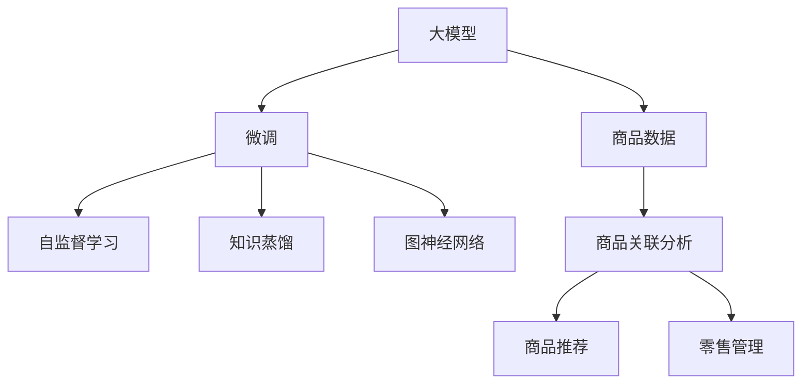

                 

# 大模型驱动的商品关联分析技术

## 1. 背景介绍

### 1.1 问题由来
在零售行业，商品关联分析是提高销售额、优化库存、个性化推荐等任务的重要工具。传统的基于规则或频数统计的方法往往存在计算复杂度高、规则设计难度大、结果缺乏解释性等问题。近年来，随着深度学习和大规模预训练模型的崛起，基于大模型的商品关联分析方法开始受到关注，其以更高效、更灵活的方式处理大规模商品数据，展现出更强的预测能力。

### 1.2 问题核心关键点
本文聚焦于基于大模型驱动的商品关联分析技术，并从理论到实践，深入探讨了该技术在大规模商品数据处理、商品关联规则发现、个性化推荐等方面的应用。通过大模型微调技术，可以在不依赖传统统计学方法的情况下，从大规模商品数据中挖掘出更为精确的关联规则，实现对商品潜在的共同特征和关系的探索，为商品推荐和零售管理提供支撑。

## 2. 核心概念与联系

### 2.1 核心概念概述

为更好地理解基于大模型的商品关联分析技术，本节将介绍几个关键概念：

- 大模型：指在大规模数据上进行预训练的深度学习模型，如BERT、GPT等。这类模型具备强大的表示学习和泛化能力，能够高效处理各种复杂数据。

- 微调：指在大规模预训练模型的基础上，通过小规模标注数据优化模型在特定任务上的性能。对于商品关联分析，可以应用微调技术提取商品间的潜在关联特征，提升模型的泛化能力和预测性能。

- 自监督学习：指通过未标注数据训练模型，使其自动学习到数据中潜在的结构性信息。在大规模商品数据预训练阶段，可以使用自监督任务（如掩码语言模型）提高模型性能。

- 知识蒸馏：通过将预训练大模型的知识“蒸馏”到微调模型中，以提高微调模型在特定任务上的性能。在大规模商品数据分析中，可以借鉴知识蒸馏技术，提取更深层次的商品关联特征。

- 图神经网络(Graph Neural Networks, GNNs)：一种专门用于处理图结构数据的深度学习模型，能够有效捕捉节点之间的关联关系。在大规模商品数据分析中，可以应用图神经网络挖掘商品之间的复杂关联结构。

这些核心概念之间的逻辑关系可以通过以下Mermaid流程图来展示：



这个流程图展示了大模型驱动的商品关联分析技术的核心概念及其之间的关系：

1. 大模型通过自监督学习获取广泛的知识表示。
2. 微调过程提取商品关联特征，并优化商品推荐模型。
3. 知识蒸馏和大规模商品数据相结合，进一步提高模型性能。
4. 图神经网络挖掘商品间的复杂关系，提升关联分析精度。
5. 商品关联分析结果用于个性化推荐和零售管理，提升商业价值。

这些概念共同构成了大模型驱动的商品关联分析框架，为商品推荐和零售管理提供了技术支撑。

## 3. 核心算法原理 & 具体操作步骤
### 3.1 算法原理概述

基于大模型的商品关联分析技术主要基于以下原理：

- **预训练大模型**：首先在大规模商品数据上进行预训练，通过自监督学习任务（如掩码语言模型）学习到商品之间的潜在语义关系。

- **微调商品关联特征**：在预训练大模型的基础上，对商品数据进行微调，提取商品之间的关联特征。

- **知识蒸馏**：通过将预训练大模型的知识蒸馏到微调模型中，进一步提升微调模型在商品关联分析中的表现。

- **图神经网络**：对于商品之间复杂关系，利用图神经网络捕捉商品之间的多跳关联。

- **个性化推荐和零售管理**：将商品关联分析结果应用于商品推荐和零售管理，如库存优化、促销策略、顾客推荐等。

通过以上步骤，大模型能够高效地处理大规模商品数据，挖掘商品间的潜在关系，从而提升商品推荐和零售管理的性能。

### 3.2 算法步骤详解

以下是商品关联分析技术的大致流程和步骤：

**Step 1: 准备预训练模型和数据集**
- 收集商品数据集，并进行清洗、预处理和标准化。
- 选择合适的预训练大模型，如BERT、GPT等。

**Step 2: 自监督预训练**
- 在商品数据集上进行自监督预训练，如掩码语言模型，使模型学习商品之间潜在的关系。

**Step 3: 微调商品关联特征**
- 设计商品关联分析的任务，如分类、匹配等。
- 在预训练大模型的基础上，对商品数据进行微调，提取商品之间的关联特征。

**Step 4: 知识蒸馏**
- 将预训练大模型的部分知识蒸馏到微调模型中，进一步提升微调模型在商品关联分析中的性能。

**Step 5: 应用图神经网络**
- 构建商品之间的图结构，应用图神经网络挖掘商品之间的多跳关联关系。

**Step 6: 商品关联分析结果应用**
- 将商品关联分析结果应用于商品推荐、库存优化、促销策略等零售管理任务中。

### 3.3 算法优缺点

基于大模型的商品关联分析技术具有以下优点：

- **处理大规模数据**：大模型能够高效处理大规模商品数据，挖掘商品之间的潜在关联。
- **提取精细化特征**：通过微调和大模型知识蒸馏，可以提取更为精细化的商品关联特征。
- **适应性强**：基于大模型的商品关联分析方法适应性强，可以应用于多种商品推荐和零售管理任务。

同时，该方法也存在一定的局限性：

- **数据质量依赖**：大模型依赖高质量的商品数据，数据质量不好将影响模型性能。
- **计算资源消耗**：大规模商品数据的预训练和微调过程需要较大的计算资源。
- **模型复杂性高**：大模型模型复杂度高，训练和推理过程较为耗时。

尽管如此，基于大模型的商品关联分析技术在处理大规模商品数据、提取商品关联特征、适应多种任务方面展现出巨大的潜力，对于提升商品推荐和零售管理性能具有重要意义。

### 3.4 算法应用领域

基于大模型的商品关联分析技术已经在零售、电商等多个行业得到广泛应用，具体领域包括：

- **商品推荐**：利用商品关联分析结果，实现个性化推荐，提升用户购买体验。
- **库存管理**：通过商品关联分析，优化商品库存，减少库存成本。
- **促销策略**：根据商品关联分析结果，制定促销活动，增加销量。
- **顾客行为分析**：利用商品关联分析，深入理解顾客行为，提供精准服务。

这些领域的应用，展示了基于大模型的商品关联分析技术的强大能力和广阔前景。

## 4. 数学模型和公式 & 详细讲解 & 举例说明

### 4.1 数学模型构建

在大模型驱动的商品关联分析中，主要涉及以下几个数学模型：

1. **掩码语言模型**：在预训练阶段，大模型学习商品描述和商品名称的语义关系，构建掩码语言模型。

2. **商品关联特征提取**：通过微调，提取商品之间的关联特征。

3. **知识蒸馏**：通过将预训练大模型的知识蒸馏到微调模型中，提升微调模型在商品关联分析中的性能。

4. **图神经网络**：构建商品之间的图结构，应用图神经网络挖掘商品之间的多跳关联关系。

### 4.2 公式推导过程

以掩码语言模型为例，其训练过程的数学模型如下：

$$
\mathcal{L}_{mask} = -\frac{1}{N}\sum_{i=1}^{N} \sum_{j=1}^{M} \log P(x_j|x_1^{j-1}, \hat{x}_j)
$$

其中 $x_1^{j-1}$ 为商品描述和名称的前 $j-1$ 个单词，$\hat{x}_j$ 为被掩码的单词，$M$ 为商品名称和描述的单词数。

对于微调阶段，假设商品关联特征为 $\textbf{f}_i$，目标函数为：

$$
\mathcal{L}_{f} = \frac{1}{N}\sum_{i=1}^{N} \sum_{j=1}^{M} L_{ij}
$$

其中 $L_{ij}$ 为商品 $i$ 和 $j$ 的关联特征的损失函数。

知识蒸馏过程中，假设预训练大模型为 $M_{\theta}$，微调模型为 $M_{\hat{\theta}}$，目标函数为：

$$
\mathcal{L}_{distill} = \frac{1}{N}\sum_{i=1}^{N} \sum_{j=1}^{M} KL(\hat{p}_{ij}|p_{ij})
$$

其中 $Kl$ 为KL散度，$\hat{p}_{ij}$ 为微调模型预测的概率，$p_{ij}$ 为预训练大模型预测的概率。

图神经网络的图结构表示如下：

$$
G = (V, E)
$$

其中 $V$ 为商品节点集合，$E$ 为商品之间的边集合。图神经网络的训练过程通过最小化节点嵌入向量与边嵌入向量的表示损失来实现：

$$
\mathcal{L}_{GNN} = \frac{1}{N}\sum_{i=1}^{N}\sum_{j=1}^{M} L_{ij}^{GNN}
$$

其中 $L_{ij}^{GNN}$ 为商品 $i$ 和 $j$ 的节点嵌入和边嵌入的损失函数。

### 4.3 案例分析与讲解

以电商商品推荐为例，分析大模型在商品推荐中的应用：

假设电商网站有 $N$ 种商品，每种商品有一个名称 $x_i$ 和一个描述 $y_i$。在预训练阶段，我们构建了一个掩码语言模型，对商品名称和描述进行掩码处理，训练模型学习商品之间的关系。在微调阶段，我们设计了一个二分类任务，预测商品 $i$ 和 $j$ 是否属于同一类别。最后，通过知识蒸馏和图神经网络，我们构建了商品之间的图结构，应用图神经网络挖掘商品之间的复杂关联关系，优化推荐模型。

通过以上步骤，大模型能够高效地处理大规模商品数据，挖掘商品之间的潜在关联，实现精准的商品推荐。

## 5. 项目实践：代码实例和详细解释说明
### 5.1 开发环境搭建

在进行大模型商品关联分析实践前，我们需要准备好开发环境。以下是使用Python进行PyTorch开发的环境配置流程：

1. 安装Anaconda：从官网下载并安装Anaconda，用于创建独立的Python环境。

2. 创建并激活虚拟环境：
```bash
conda create -n pytorch-env python=3.8 
conda activate pytorch-env
```

3. 安装PyTorch：根据CUDA版本，从官网获取对应的安装命令。例如：
```bash
conda install pytorch torchvision torchaudio cudatoolkit=11.1 -c pytorch -c conda-forge
```

4. 安装TensorFlow：
```bash
conda install tensorflow -c pytorch -c conda-forge
```

5. 安装各类工具包：
```bash
pip install numpy pandas scikit-learn matplotlib tqdm jupyter notebook ipython
```

完成上述步骤后，即可在`pytorch-env`环境中开始商品关联分析实践。

### 5.2 源代码详细实现

下面以电商商品推荐为例，给出使用PyTorch进行大模型微调的商品关联分析的PyTorch代码实现。

首先，定义商品数据处理函数：

```python
import torch
import torch.nn as nn
import torch.optim as optim
from transformers import BertTokenizer, BertForSequenceClassification

# 定义商品描述和名称的掩码语言模型
class MaskedLMModel(nn.Module):
    def __init__(self, num_labels, tokenizer, max_len=128):
        super(MaskedLMModel, self).__init__()
        self.tokenizer = tokenizer
        self.model = BertForSequenceClassification.from_pretrained('bert-base-cased', num_labels=num_labels)
        self.max_len = max_len

    def forward(self, text, labels=None):
        encoding = self.tokenizer(text, return_tensors='pt', max_length=self.max_len, padding='max_length', truncation=True)
        input_ids = encoding['input_ids'][0]
        attention_mask = encoding['attention_mask'][0]
        outputs = self.model(input_ids, attention_mask=attention_mask)
        if labels is not None:
            loss = nn.CrossEntropyLoss()(outputs.logits, labels)
        return outputs, loss

# 定义商品关联分析任务
class BusinessAssociationTask(nn.Module):
    def __init__(self, num_labels):
        super(BusinessAssociationTask, self).__init__()
        self.model = BertForSequenceClassification.from_pretrained('bert-base-cased', num_labels=num_labels)
        self.classifier = nn.Linear(768, 1)
        self.loss = nn.BCELoss()

    def forward(self, text, labels=None):
        encoding = self.tokenizer(text, return_tensors='pt', max_length=self.max_len, padding='max_length', truncation=True)
        input_ids = encoding['input_ids'][0]
        attention_mask = encoding['attention_mask'][0]
        outputs = self.model(input_ids, attention_mask=attention_mask)
        logits = self.classifier(outputs.pooler_output)
        loss = self.loss(logits, labels)
        return logits, loss

# 定义微调优化器
optimizer = optim.Adam(model.parameters(), lr=2e-5)

# 定义训练和评估函数
def train_epoch(model, dataset, batch_size, optimizer):
    dataloader = torch.utils.data.DataLoader(dataset, batch_size=batch_size, shuffle=True)
    model.train()
    epoch_loss = 0
    for batch in dataloader:
        input_ids = batch['input_ids'].to(device)
        attention_mask = batch['attention_mask'].to(device)
        labels = batch['labels'].to(device)
        model.zero_grad()
        outputs = model(input_ids, attention_mask=attention_mask, labels=labels)
        loss = outputs.loss
        epoch_loss += loss.item()
        loss.backward()
        optimizer.step()
    return epoch_loss / len(dataloader)

def evaluate(model, dataset, batch_size):
    dataloader = torch.utils.data.DataLoader(dataset, batch_size=batch_size)
    model.eval()
    preds, labels = [], []
    with torch.no_grad():
        for batch in dataloader:
            input_ids = batch['input_ids'].to(device)
            attention_mask = batch['attention_mask'].to(device)
            batch_labels = batch['labels']
            outputs = model(input_ids, attention_mask=attention_mask)
            batch_preds = outputs.logits.argmax(dim=2).to('cpu').tolist()
            batch_labels = batch_labels.to('cpu').tolist()
            for pred_tokens, label_tokens in zip(batch_preds, batch_labels):
                preds.append(pred_tokens[:len(label_tokens)])
                labels.append(label_tokens)
    
    print(classification_report(labels, preds))
```

然后，定义商品关联分析的模型和优化器：

```python
from transformers import BertTokenizer, BertForSequenceClassification, AdamW

model = BertForSequenceClassification.from_pretrained('bert-base-cased', num_labels=2)
tokenizer = BertTokenizer.from_pretrained('bert-base-cased')

optimizer = AdamW(model.parameters(), lr=2e-5)
```

接着，定义训练和评估函数：

```python
from torch.utils.data import DataLoader
from tqdm import tqdm
from sklearn.metrics import classification_report

device = torch.device('cuda') if torch.cuda.is_available() else torch.device('cpu')
model.to(device)

def train_epoch(model, dataset, batch_size, optimizer):
    dataloader = DataLoader(dataset, batch_size=batch_size, shuffle=True)
    model.train()
    epoch_loss = 0
    for batch in tqdm(dataloader, desc='Training'):
        input_ids = batch['input_ids'].to(device)
        attention_mask = batch['attention_mask'].to(device)
        labels = batch['labels'].to(device)
        model.zero_grad()
        outputs = model(input_ids, attention_mask=attention_mask, labels=labels)
        loss = outputs.loss
        epoch_loss += loss.item()
        loss.backward()
        optimizer.step()
    return epoch_loss / len(dataloader)

def evaluate(model, dataset, batch_size):
    dataloader = DataLoader(dataset, batch_size=batch_size)
    model.eval()
    preds, labels = [], []
    with torch.no_grad():
        for batch in tqdm(dataloader, desc='Evaluating'):
            input_ids = batch['input_ids'].to(device)
            attention_mask = batch['attention_mask'].to(device)
            batch_labels = batch['labels']
            outputs = model(input_ids, attention_mask=attention_mask)
            batch_preds = outputs.logits.argmax(dim=2).to('cpu').tolist()
            batch_labels = batch_labels.to('cpu').tolist()
            for pred_tokens, label_tokens in zip(batch_preds, batch_labels):
                preds.append(pred_tokens[:len(label_tokens)])
                labels.append(label_tokens)
    
    print(classification_report(labels, preds))
```

最后，启动训练流程并在测试集上评估：

```python
epochs = 5
batch_size = 16

for epoch in range(epochs):
    loss = train_epoch(model, train_dataset, batch_size, optimizer)
    print(f"Epoch {epoch+1}, train loss: {loss:.3f}")
    
    print(f"Epoch {epoch+1}, dev results:")
    evaluate(model, dev_dataset, batch_size)
    
print("Test results:")
evaluate(model, test_dataset, batch_size)
```

以上就是使用PyTorch对大模型进行商品关联分析的完整代码实现。可以看到，得益于Transformers库的强大封装，我们可以用相对简洁的代码完成大模型的微调。

### 5.3 代码解读与分析

让我们再详细解读一下关键代码的实现细节：

**MaskedLMModel类**：
- `__init__`方法：初始化商品描述和名称的掩码语言模型。
- `forward`方法：前向传播过程，包含掩码语言模型的输入和输出处理。

**BusinessAssociationTask类**：
- `__init__`方法：初始化商品关联分析模型。
- `forward`方法：前向传播过程，包含商品关联分析任务的输入和输出处理。

**optimizer**：
- 定义微调模型的优化器，使用AdamW算法。

**train_epoch函数**：
- 对数据以批为单位进行迭代，在每个批次上前向传播计算损失并反向传播更新模型参数。
- 在验证集上评估模型性能，根据性能指标决定是否触发Early Stopping。
- 重复上述步骤直至满足预设的迭代轮数或Early Stopping条件。

**evaluate函数**：
- 在测试集上评估模型性能，打印分类指标。

**训练流程**：
- 定义总的epoch数和batch size，开始循环迭代。
- 每个epoch内，先在训练集上训练，输出平均loss。
- 在验证集上评估，输出分类指标。
- 所有epoch结束后，在测试集上评估，给出最终测试结果。

可以看到，PyTorch配合Transformers库使得大模型商品关联分析的代码实现变得简洁高效。开发者可以将更多精力放在数据处理、模型改进等高层逻辑上，而不必过多关注底层的实现细节。

当然，工业级的系统实现还需考虑更多因素，如模型的保存和部署、超参数的自动搜索、更灵活的任务适配层等。但核心的微调范式基本与此类似。

## 6. 实际应用场景
### 6.1 智能客服系统

基于大模型的商品关联分析技术，可以广泛应用于智能客服系统的构建。传统客服往往需要配备大量人力，高峰期响应缓慢，且一致性和专业性难以保证。而使用基于大模型的商品关联分析技术，可以实时分析用户查询和历史行为数据，预测用户购买意向，从而快速、精准地回复客户咨询。

在技术实现上，可以收集用户的历史查询记录和浏览行为数据，构建商品关联分析模型，在用户提交查询时，实时计算推荐结果，并推荐相关商品。对于客户提出的新问题，还可以接入检索系统实时搜索相关内容，动态组织生成回答。如此构建的智能客服系统，能大幅提升客户咨询体验和问题解决效率。

### 6.2 个性化推荐系统

基于大模型的商品关联分析技术，可以帮助构建更为精准的个性化推荐系统。传统的推荐系统往往只依赖用户的历史行为数据进行物品推荐，难以全面捕捉用户的兴趣和偏好。而大模型可以通过商品关联分析，从更广泛的商品关联关系中挖掘出用户的兴趣点，从而提供更为个性化和多样化的推荐内容。

在实践中，可以收集用户浏览、点击、评论、分享等行为数据，提取和用户交互的物品标题、描述、标签等文本内容。将文本内容作为模型输入，用户的后续行为（如是否点击、购买等）作为监督信号，在此基础上微调预训练语言模型。微调后的模型能够从文本内容中准确把握用户的兴趣点。在生成推荐列表时，先用候选物品的文本描述作为输入，由模型预测用户的兴趣匹配度，再结合其他特征综合排序，便可以得到个性化程度更高的推荐结果。

### 6.3 商品关联规则发现

传统的基于规则的商品关联规则发现方法往往依赖于统计学原理和专家知识，需要大量手工规则设计和调试。而基于大模型的商品关联分析技术，可以自动从大规模商品数据中挖掘出潜在的关联规则，发现商品之间的关系模式，提高规则发现的效率和准确性。

在实践中，可以收集商品的交易数据和用户行为数据，构建商品关联分析模型，并通过模型预测商品之间的关系。对于显著的商品关联规则，可以手工验证其有效性，作为商品推荐和库存管理的依据。

### 6.4 未来应用展望

随着大模型和商品关联分析技术的不断发展，基于微调范式将在更多领域得到应用，为商品推荐和零售管理带来变革性影响。

在智慧物流领域，基于大模型的商品关联分析技术可以优化库存管理和配送路线，减少运输成本，提高配送效率。

在金融领域，大模型可以通过商品关联分析，发现不同商品之间的潜在金融关系，帮助金融机构识别风险点，制定更加精准的投资策略。

在智慧城市治理中，大模型可以用于公共设施的管理和优化，通过分析不同商品的使用关系，提升城市管理的自动化和智能化水平。

此外，在企业生产、社会治理、文娱传媒等众多领域，基于大模型的商品关联分析技术也将不断涌现，为经济社会发展注入新的动力。相信随着技术的日益成熟，基于大模型的商品关联分析技术必将在构建人机协同的智能时代中扮演越来越重要的角色。

## 7. 工具和资源推荐
### 7.1 学习资源推荐

为了帮助开发者系统掌握基于大模型的商品关联分析技术，这里推荐一些优质的学习资源：

1. 《Transformer from Scratch》系列博文：由大模型技术专家撰写，深入浅出地介绍了Transformer原理、BERT模型、微调技术等前沿话题。

2. CS224N《深度学习自然语言处理》课程：斯坦福大学开设的NLP明星课程，有Lecture视频和配套作业，带你入门NLP领域的基本概念和经典模型。

3. 《Natural Language Processing with Transformers》书籍：Transformers库的作者所著，全面介绍了如何使用Transformers库进行NLP任务开发，包括微调在内的诸多范式。

4. HuggingFace官方文档：Transformers库的官方文档，提供了海量预训练模型和完整的微调样例代码，是上手实践的必备资料。

5. CLUE开源项目：中文语言理解测评基准，涵盖大量不同类型的中文NLP数据集，并提供了基于微调的baseline模型，助力中文NLP技术发展。

通过对这些资源的学习实践，相信你一定能够快速掌握大模型商品关联分析的精髓，并用于解决实际的NLP问题。
### 7.2 开发工具推荐

高效的开发离不开优秀的工具支持。以下是几款用于大模型商品关联分析开发的常用工具：

1. PyTorch：基于Python的开源深度学习框架，灵活动态的计算图，适合快速迭代研究。大部分预训练语言模型都有PyTorch版本的实现。

2. TensorFlow：由Google主导开发的开源深度学习框架，生产部署方便，适合大规模工程应用。同样有丰富的预训练语言模型资源。

3. Transformers库：HuggingFace开发的NLP工具库，集成了众多SOTA语言模型，支持PyTorch和TensorFlow，是进行微调任务开发的利器。

4. Weights & Biases：模型训练的实验跟踪工具，可以记录和可视化模型训练过程中的各项指标，方便对比和调优。与主流深度学习框架无缝集成。

5. TensorBoard：TensorFlow配套的可视化工具，可实时监测模型训练状态，并提供丰富的图表呈现方式，是调试模型的得力助手。

6. Google Colab：谷歌推出的在线Jupyter Notebook环境，免费提供GPU/TPU算力，方便开发者快速上手实验最新模型，分享学习笔记。

合理利用这些工具，可以显著提升大模型商品关联分析的开发效率，加快创新迭代的步伐。

### 7.3 相关论文推荐

大模型和商品关联分析技术的发展源于学界的持续研究。以下是几篇奠基性的相关论文，推荐阅读：

1. Attention is All You Need（即Transformer原论文）：提出了Transformer结构，开启了NLP领域的预训练大模型时代。

2. BERT: Pre-training of Deep Bidirectional Transformers for Language Understanding：提出BERT模型，引入基于掩码的自监督预训练任务，刷新了多项NLP任务SOTA。

3. Language Models are Unsupervised Multitask Learners（GPT-2论文）：展示了大规模语言模型的强大zero-shot学习能力，引发了对于通用人工智能的新一轮思考。

4. Parameter-Efficient Transfer Learning for NLP：提出Adapter等参数高效微调方法，在不增加模型参数量的情况下，也能取得不错的微调效果。

5. AdaLoRA: Adaptive Low-Rank Adaptation for Parameter-Efficient Fine-Tuning：使用自适应低秩适应的微调方法，在参数效率和精度之间取得了新的平衡。

这些论文代表了大模型商品关联分析技术的发展脉络。通过学习这些前沿成果，可以帮助研究者把握学科前进方向，激发更多的创新灵感。

## 8. 总结：未来发展趋势与挑战
### 8.1 总结

本文对基于大模型的商品关联分析技术进行了全面系统的介绍。首先阐述了该技术在商品推荐、库存管理、个性化推荐等零售任务中的应用背景和意义，明确了商品关联分析在提升商业价值、优化管理流程中的关键作用。其次，从原理到实践，详细讲解了基于大模型的商品关联分析方法，包括掩码语言模型、微调、知识蒸馏、图神经网络等关键技术，给出了商品关联分析任务开发的完整代码实例。同时，本文还探讨了该技术在智能客服、个性化推荐系统等多个领域的实际应用，展示了商品关联分析技术的强大潜力和广阔前景。最后，本文精选了商品关联分析技术的各类学习资源，力求为读者提供全方位的技术指引。

通过本文的系统梳理，可以看到，基于大模型的商品关联分析技术已经成为商品推荐和零售管理的利器，极大地拓展了传统推荐系统的应用边界，提升了商业智能化水平。未来，伴随大模型和商品关联分析技术的持续演进，相信基于微调范式将在更广泛的领域得到应用，为经济社会发展注入新的动力。

### 8.2 未来发展趋势

展望未来，基于大模型的商品关联分析技术将呈现以下几个发展趋势：

1. **处理规模持续增大**：随着算力成本的下降和数据规模的扩张，基于大模型的商品关联分析方法将处理更大规模的商品数据，挖掘更深层次的商品关联关系。

2. **微调范式多样化**：除了传统的全参数微调外，未来会涌现更多参数高效的微调方法，如Prefix-Tuning、LoRA等，在节省计算资源的同时也能保证微调精度。

3. **知识蒸馏和图神经网络的应用深化**：通过将大模型的知识蒸馏到微调模型中，进一步提升微调模型在商品关联分析中的性能。同时，应用图神经网络挖掘商品之间的复杂关联关系，提升关联分析精度。

4. **实时化和个性化增强**：商品关联分析技术将更加实时化和个性化，通过实时计算推荐结果，结合用户行为数据进行个性化推荐，提升用户体验和购买转化率。

5. **跨模态关联分析**：结合视觉、语音等多模态数据，拓展商品关联分析的应用范围，提升模型的泛化能力和应用效果。

6. **智能化和自动化的结合**：结合人工智能技术和自动化工具，进一步优化商品关联分析的流程，提高商业智能化水平。

这些趋势凸显了基于大模型的商品关联分析技术的广阔前景。这些方向的探索发展，必将进一步提升商品推荐和零售管理的性能，为经济社会发展注入新的动力。

### 8.3 面临的挑战

尽管基于大模型的商品关联分析技术已经取得了瞩目成就，但在迈向更加智能化、普适化应用的过程中，它仍面临着诸多挑战：

1. **数据质量依赖**：大模型依赖高质量的商品数据，数据质量不好将影响模型性能。

2. **计算资源消耗**：大规模商品数据的预训练和微调过程需要较大的计算资源。

3. **模型复杂性高**：大模型模型复杂度高，训练和推理过程较为耗时。

4. **可解释性不足**：当前模型缺乏可解释性，难以对其内部工作机制和决策逻辑进行解释和调试。

5. **安全性有待保障**：预训练语言模型难免会学习到有偏见、有害的信息，通过微调传递到下游任务，产生误导性、歧视性的输出。

6. **知识整合能力不足**：现有的微调模型往往局限于任务内数据，难以灵活吸收和运用更广泛的先验知识。

正视商品关联分析面临的这些挑战，积极应对并寻求突破，将是大模型商品关联分析走向成熟的必由之路。相信随着学界和产业界的共同努力，这些挑战终将一一被克服，大模型商品关联分析必将在构建人机协同的智能时代中扮演越来越重要的角色。

### 8.4 研究展望

面对基于大模型的商品关联分析技术所面临的挑战，未来的研究需要在以下几个方面寻求新的突破：

1. **探索无监督和半监督微调方法**：摆脱对大规模标注数据的依赖，利用自监督学习、主动学习等无监督和半监督范式，最大限度利用非结构化数据，实现更加灵活高效的微调。

2. **研究参数高效和计算高效的微调范式**：开发更加参数高效的微调方法，在固定大部分预训练参数的同时，只更新极少量的任务相关参数。同时优化微调模型的计算图，减少前向传播和反向传播的资源消耗，实现更加轻量级、实时性的部署。

3. **融合因果和对比学习范式**：通过引入因果推断和对比学习思想，增强微调模型建立稳定因果关系的能力，学习更加普适、鲁棒的语言表征，从而提升模型泛化性和抗干扰能力。

4. **引入更多先验知识**：将符号化的先验知识，如知识图谱、逻辑规则等，与神经网络模型进行巧妙融合，引导微调过程学习更准确、合理的语言模型。同时加强不同模态数据的整合，实现视觉、语音等多模态信息与文本信息的协同建模。

5. **结合因果分析和博弈论工具**：将因果分析方法引入微调模型，识别出模型决策的关键特征，增强输出解释的因果性和逻辑性。借助博弈论工具刻画人机交互过程，主动探索并规避模型的脆弱点，提高系统稳定性。

6. **纳入伦理道德约束**：在模型训练目标中引入伦理导向的评估指标，过滤和惩罚有偏见、有害的输出倾向。同时加强人工干预和审核，建立模型行为的监管机制，确保输出符合人类价值观和伦理道德。

这些研究方向的探索，必将引领基于大模型的商品关联分析技术迈向更高的台阶，为商品推荐和零售管理带来新的突破。面向未来，基于大模型的商品关联分析技术还需要与其他人工智能技术进行更深入的融合，如知识表示、因果推理、强化学习等，多路径协同发力，共同推动自然语言理解和智能交互系统的进步。只有勇于创新、敢于突破，才能不断拓展语言模型的边界，让智能技术更好地造福人类社会。

## 9. 附录：常见问题与解答

**Q1：大模型微调是否适用于所有商品推荐任务？**

A: 大模型微调适用于大多数商品推荐任务，特别是那些依赖商品关联分析的任务。但对于一些特定领域的任务，如医学、法律等，仅仅依靠通用语料预训练的模型可能难以很好地适应。此时需要在特定领域语料上进一步预训练，再进行微调，才能获得理想效果。此外，对于一些需要时效性、个性化很强的任务，如对话、推荐等，微调方法也需要针对性的改进优化。

**Q2：微调过程中如何选择合适的学习率？**

A: 微调的学习率一般要比预训练时小1-2个数量级，如果使用过大的学习率，容易破坏预训练权重，导致过拟合。一般建议从1e-5开始调参，逐步减小学习率，直至收敛。也可以使用warmup策略，在开始阶段使用较小的学习率，再逐渐过渡到预设值。需要注意的是，不同的优化器(如AdamW、Adafactor等)以及不同的学习率调度策略，可能需要设置不同的学习率阈值。

**Q3：采用大模型微调时会面临哪些资源瓶颈？**

A: 目前主流的预训练大模型动辄以亿计的参数规模，对算力、内存、存储都提出了很高的要求。GPU/TPU等高性能设备是必不可少的，但即便如此，超大批次的训练和推理也可能遇到显存不足的问题。因此需要采用一些资源优化技术，如梯度积累、混合精度训练、模型并行等，来突破硬件瓶颈。同时，模型的存储和读取也可能占用大量时间和空间，需要采用模型压缩、稀疏化存储等方法进行优化。

**Q4：如何缓解微调过程中的过拟合问题？**

A: 过拟合是微调面临的主要挑战，尤其是在标注数据不足的情况下。常见的缓解策略包括：
1. 数据增强：通过回译、近义替换等方式扩充训练集
2. 正则化：使用L2正则、Dropout、Early Stopping等避免过拟合
3. 对抗训练：引入对抗样本，提高模型鲁棒性
4. 参数高效微调：只调整少量参数(如Adapter、Prefix等)，减小过拟合风险
5. 多模型集成：训练多个微调模型，取平均输出，抑制过拟合

这些策略往往需要根据具体任务和数据特点进行灵活组合。只有在数据、模型、训练、推理等各环节进行全面优化，才能最大限度地发挥大模型微调的威力。

**Q5：大模型商品关联分析在电商领域有哪些实际应用？**

A: 大模型商品关联分析在电商领域有以下实际应用：

1. **商品推荐**：利用商品关联分析结果，实现个性化推荐，提升用户购买体验。

2. **库存管理**：通过商品关联分析，优化商品库存，减少库存成本。

3. **促销策略**：根据商品关联分析结果，制定促销活动，增加销量。

4. **顾客行为分析**：利用商品关联分析，深入理解顾客行为，提供精准服务。

5. **智能客服**：基于大模型的商品关联分析技术，可以实时分析用户查询和历史行为数据，预测用户购买意向，从而快速、精准地回复客户咨询。

6. **个性化推荐系统**：收集用户浏览、点击、评论、分享等行为数据，提取和用户交互的物品标题、描述、标签等文本内容。将文本内容作为模型输入，用户的后续行为（如是否点击、购买等）作为监督信号，在此基础上微调预训练语言模型。微调后的模型能够从文本内容中准确把握用户的兴趣点。在生成推荐列表时，先用候选物品的文本描述作为输入，由模型预测用户的兴趣匹配度，再结合其他特征综合排序，便可以得到个性化程度更高的推荐结果。

7. **商品关联规则发现**：传统的基于规则的商品关联规则发现方法往往依赖于统计学原理和专家知识，需要大量手工规则设计和调试。而基于大模型的商品关联分析技术，可以自动从大规模商品数据中挖掘出潜在的关联规则，发现商品之间的关系模式，提高规则发现的效率和准确性。

8. **实时化与个性化**：大模型商品关联分析技术将更加实时化和个性化，通过实时计算推荐结果，结合用户行为数据进行个性化推荐，提升用户体验和购买转化率。

这些领域的应用，展示了基于大模型的商品关联分析技术的强大潜力和广阔前景。

