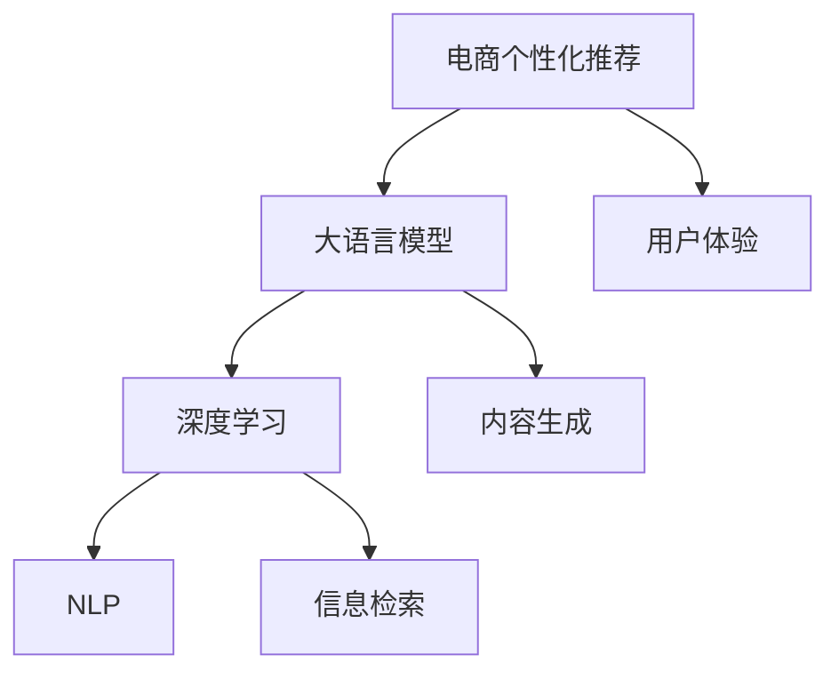

                 

# 大模型驱动的电商个性化内容推荐

> 关键词：电商个性化推荐, 大语言模型, 深度学习, 自然语言处理, 内容生成, 信息检索, 用户体验

## 1. 背景介绍

随着互联网和电子商务的迅猛发展，个性化推荐系统已成为电商企业吸引用户、提升转化率、增加销售额的关键技术之一。然而，传统的基于协同过滤和规则引擎的推荐系统面临着数据稀疏性、用户行为变化快等挑战。近年来，基于深度学习和自然语言处理的大模型推荐系统逐步崭露头角，大语言模型通过分析用户行为、商品描述、评论等文本数据，生成高质量、多样化的推荐内容，不断优化用户体验。

本篇文章将系统性地介绍基于大语言模型的电商个性化内容推荐技术，从原理、模型构建、项目实践、应用场景等多个维度展开，希望为从事电商领域技术研发和产品设计的从业者提供有价值的参考。

## 2. 核心概念与联系

### 2.1 核心概念概述

在大模型推荐系统中，核心概念包括以下几个方面：

- **电商个性化推荐系统**：通过分析用户行为、商品信息、评论等数据，为用户推荐符合其兴趣和需求的商品或内容，提升用户购物体验，增加电商平台的转化率。

- **大语言模型**：如GPT、BERT等，通过在大规模文本数据上进行自监督或监督学习，学习通用的语言表示，具备强大的文本理解和生成能力。

- **深度学习**：基于神经网络架构，通过对大量数据进行学习，使模型能够对输入数据进行高效映射和推理。

- **自然语言处理(NLP)**：使计算机能够理解、处理和生成自然语言，在大模型推荐系统中主要用于商品描述解析、评论情感分析等任务。

- **内容生成**：利用大语言模型生成商品标题、广告文案、用户评论等个性化内容，丰富推荐结果的多样性。

- **信息检索**：通过相似度计算和索引构建，实现快速匹配用户需求和商品信息，提高推荐系统响应速度。

- **用户体验(UX)**：通过个性化推荐系统，提升用户的满意度、购物效率和忠诚度。

这些概念之间的逻辑关系可以通过以下Mermaid流程图来展示：



这个流程图展示了大模型推荐系统的核心概念及其之间的关系：

1. 电商个性化推荐系统通过深度学习和大模型驱动，提升推荐精度和效果。
2. 大模型用于理解和生成文本，学习商品描述、用户评论等数据。
3. NLP技术用于解析商品信息、情感分析等任务。
4. 内容生成技术丰富推荐结果的多样性。
5. 信息检索技术提升推荐系统的响应速度。
6. 用户体验通过推荐系统的优化得以改善。

## 3. 核心算法原理 & 具体操作步骤

### 3.1 算法原理概述

基于大语言模型的电商个性化推荐系统，主要依赖于深度学习模型和大模型的预训练能力。其核心思想是通过大模型的语言理解能力，从用户的文本数据中提取特征，生成与用户兴趣和需求相匹配的商品推荐内容。

形式化地，假设用户文本数据为 $D_U=\{x_i\}_{i=1}^N$，商品信息为 $D_G=\{g_j\}_{j=1}^M$，其中 $x_i$ 为用户评论、浏览历史等文本，$g_j$ 为商品描述、类别等文本。目标是通过优化损失函数 $\mathcal{L}$，使得模型能够生成与用户文本 $x_i$ 最相关的商品描述 $g_j$：

$$
\hat{g_j} = \mathop{\arg\min}_{g_j} \mathcal{L}(g_j;D_G,D_U)
$$

其中 $\mathcal{L}$ 为指定的损失函数，如交叉熵、均方误差等。

### 3.2 算法步骤详解

基于大语言模型的电商个性化推荐系统一般包括以下关键步骤：

**Step 1: 数据预处理和预训练模型选择**

1. 收集用户数据和商品数据，进行清洗和标注，构建训练集和测试集。
2. 选择合适的预训练大语言模型，如GPT、BERT等。
3. 对商品信息进行预处理，包括去除噪声、统一格式等操作。

**Step 2: 任务适配与模型微调**

1. 设计适配任务，如商品描述生成、用户评论情感分类等。
2. 在预训练模型的基础上，对模型进行微调，学习商品描述生成等任务。
3. 应用微调后的模型进行推荐系统开发，设计评分预测模型等。

**Step 3: 用户特征提取**

1. 对用户文本数据进行特征提取，生成用户兴趣向量。
2. 利用预训练模型，从商品描述中提取特征，生成商品向量。

**Step 4: 相似度计算和推荐结果排序**

1. 计算用户向量与商品向量之间的相似度，如余弦相似度、点积相似度等。
2. 根据相似度排序，选择排名靠前的商品进行推荐。

**Step 5: 结果展示和反馈循环**

1. 展示推荐结果，让用户进行选择。
2. 收集用户的反馈数据，如点击率、购买率等，用于进一步优化推荐模型。

### 3.3 算法优缺点

基于大语言模型的电商个性化推荐系统具有以下优点：

1. **适应性强**：大模型能够适应多种自然语言处理任务，并从用户评论、商品描述等文本数据中提取丰富的特征。
2. **推荐多样化**：通过生成商品标题、描述等内容，丰富推荐结果的多样性。
3. **实时性**：利用大模型的快速推理能力，实现实时推荐，提升用户体验。
4. **可扩展性**：通过微调模型，可以不断适应新的用户数据和商品信息。

同时，该方法也存在以下局限性：

1. **计算资源要求高**：大模型的训练和推理需要大量的计算资源。
2. **数据隐私问题**：用户评论等文本数据可能包含隐私信息，需要进行脱敏处理。
3. **模型复杂性**：大模型的训练和微调需要复杂的算法和大量的时间。
4. **效果波动**：大模型的训练和微调需要大量数据，且效果可能受到训练数据分布的影响。

### 3.4 算法应用领域

基于大语言模型的电商个性化推荐系统已经在多个领域得到应用，例如：

- 电商平台：如Amazon、淘宝、京东等，通过推荐系统提升用户购物体验，增加销售额。
- 旅游平台：如携程、去哪儿等，推荐符合用户偏好的旅游商品，提升用户满意度。
- 金融领域：如支付宝、微信支付等，推荐符合用户需求的产品，提升金融服务质量。
- 社交媒体：如微博、抖音等，推荐符合用户兴趣的内容，增加用户粘性。

## 4. 数学模型和公式 & 详细讲解 & 举例说明

### 4.1 数学模型构建

在大模型推荐系统中，数学模型的构建主要涉及以下几个方面：

1. **用户模型**：通过用户文本数据 $D_U$ 生成用户兴趣向量 $\vec{u}$。
2. **商品模型**：通过商品信息 $D_G$ 生成商品向量 $\vec{g}$。
3. **相似度模型**：计算用户向量 $\vec{u}$ 与商品向量 $\vec{g}$ 之间的相似度 $sim(\vec{u},\vec{g})$。

假设用户文本数据 $D_U$ 和商品信息 $D_G$ 分别由 $N$ 个用户和 $M$ 个商品组成，每个文本和商品由 $d$ 维特征向量表示。用户模型和商品模型的构建公式如下：

$$
\vec{u} = \mathbf{U} \vec{u'} + \vec{b_u}
$$

$$
\vec{g} = \mathbf{V} \vec{g'} + \vec{b_g}
$$

其中 $\mathbf{U},\mathbf{V}$ 为权重矩阵，$\vec{u'},\vec{g'}$ 为输入特征向量，$\vec{b_u},\vec{b_g}$ 为偏置向量。

### 4.2 公式推导过程

在大模型推荐系统中，用户模型和商品模型的计算过程可以通过以下公式推导：

$$
\vec{u} = \mathbf{U} \vec{u'} + \vec{b_u}
$$

$$
\vec{g} = \mathbf{V} \vec{g'} + \vec{b_g}
$$

其中 $\mathbf{U},\mathbf{V}$ 为权重矩阵，$\vec{u'},\vec{g'}$ 为输入特征向量，$\vec{b_u},\vec{b_g}$ 为偏置向量。

相似度计算通常采用余弦相似度公式：

$$
sim(\vec{u},\vec{g}) = \frac{\vec{u} \cdot \vec{g}}{\Vert \vec{u} \Vert \Vert \vec{g} \Vert}
$$

其中 $\vec{u} \cdot \vec{g}$ 为向量点积，$\Vert \vec{u} \Vert,\Vert \vec{g} \Vert$ 为向量范数。

### 4.3 案例分析与讲解

以商品描述生成为例，分析大模型推荐系统的具体实现。假设商品描述数据 $D_G$ 为 $\{g_j\}_{j=1}^M$，用户文本数据 $D_U$ 为 $\{x_i\}_{i=1}^N$。通过预训练模型BERT，首先对商品描述 $g_j$ 进行编码，得到商品向量 $\vec{g_j}$：

$$
\vec{g_j} = \mathbf{V} \vec{g_j'} + \vec{b_g}
$$

然后，对用户文本 $x_i$ 进行编码，得到用户向量 $\vec{u_i}$：

$$
\vec{u_i} = \mathbf{U} \vec{u_i'} + \vec{b_u}
$$

最后，通过余弦相似度计算用户向量与商品向量的相似度 $sim(\vec{u_i},\vec{g_j})$，根据相似度排序推荐商品 $g_j$。

## 5. 项目实践：代码实例和详细解释说明

### 5.1 开发环境搭建

在进行大模型推荐系统开发前，我们需要准备好开发环境。以下是使用Python进行PyTorch开发的环境配置流程：

1. 安装Anaconda：从官网下载并安装Anaconda，用于创建独立的Python环境。

2. 创建并激活虚拟环境：
```bash
conda create -n pytorch-env python=3.8 
conda activate pytorch-env
```

3. 安装PyTorch：根据CUDA版本，从官网获取对应的安装命令。例如：
```bash
conda install pytorch torchvision torchaudio cudatoolkit=11.1 -c pytorch -c conda-forge
```

4. 安装Transformers库：
```bash
pip install transformers
```

5. 安装各类工具包：
```bash
pip install numpy pandas scikit-learn matplotlib tqdm jupyter notebook ipython
```

完成上述步骤后，即可在`pytorch-env`环境中开始推荐系统开发。

### 5.2 源代码详细实现

下面我们以商品描述生成为例，给出使用Transformers库对BERT模型进行商品推荐系统开发的PyTorch代码实现。

首先，定义商品描述生成任务的数据处理函数：

```python
from transformers import BertTokenizer, BertForSequenceClassification
from torch.utils.data import Dataset
import torch

class ProductDescriptionDataset(Dataset):
    def __init__(self, product_descriptions, tokenizer, max_len=128):
        self.product_descriptions = product_descriptions
        self.tokenizer = tokenizer
        self.max_len = max_len
        
    def __len__(self):
        return len(self.product_descriptions)
    
    def __getitem__(self, item):
        product_description = self.product_descriptions[item]
        
        encoding = self.tokenizer(product_description, return_tensors='pt', max_length=self.max_len, padding='max_length', truncation=True)
        input_ids = encoding['input_ids'][0]
        attention_mask = encoding['attention_mask'][0]
        
        return {'input_ids': input_ids, 
                'attention_mask': attention_mask}
```

然后，定义模型和优化器：

```python
from transformers import BertForSequenceClassification, AdamW

model = BertForSequenceClassification.from_pretrained('bert-base-cased', num_labels=2)
optimizer = AdamW(model.parameters(), lr=2e-5)
```

接着，定义训练和评估函数：

```python
from torch.utils.data import DataLoader
from tqdm import tqdm
from sklearn.metrics import classification_report

device = torch.device('cuda') if torch.cuda.is_available() else torch.device('cpu')
model.to(device)

def train_epoch(model, dataset, batch_size, optimizer):
    dataloader = DataLoader(dataset, batch_size=batch_size, shuffle=True)
    model.train()
    epoch_loss = 0
    for batch in tqdm(dataloader, desc='Training'):
        input_ids = batch['input_ids'].to(device)
        attention_mask = batch['attention_mask'].to(device)
        model.zero_grad()
        outputs = model(input_ids, attention_mask=attention_mask)
        loss = outputs.loss
        epoch_loss += loss.item()
        loss.backward()
        optimizer.step()
    return epoch_loss / len(dataloader)

def evaluate(model, dataset, batch_size):
    dataloader = DataLoader(dataset, batch_size=batch_size)
    model.eval()
    preds, labels = [], []
    with torch.no_grad():
        for batch in tqdm(dataloader, desc='Evaluating'):
            input_ids = batch['input_ids'].to(device)
            attention_mask = batch['attention_mask'].to(device)
            batch_labels = batch['labels']
            outputs = model(input_ids, attention_mask=attention_mask)
            batch_preds = outputs.logits.argmax(dim=2).to('cpu').tolist()
            batch_labels = batch_labels.to('cpu').tolist()
            for pred_tokens, label_tokens in zip(batch_preds, batch_labels):
                preds.append(pred_tokens[:len(label_tokens)])
                labels.append(label_tokens)
                
    print(classification_report(labels, preds))
```

最后，启动训练流程并在测试集上评估：

```python
epochs = 5
batch_size = 16

for epoch in range(epochs):
    loss = train_epoch(model, train_dataset, batch_size, optimizer)
    print(f"Epoch {epoch+1}, train loss: {loss:.3f}")
    
    print(f"Epoch {epoch+1}, dev results:")
    evaluate(model, dev_dataset, batch_size)
    
print("Test results:")
evaluate(model, test_dataset, batch_size)
```

以上就是使用PyTorch对BERT进行商品推荐系统开发的完整代码实现。可以看到，通过Transformers库的封装，代码实现变得简洁高效。

### 5.3 代码解读与分析

让我们再详细解读一下关键代码的实现细节：

**ProductDescriptionDataset类**：
- `__init__`方法：初始化商品描述数据、分词器等关键组件。
- `__len__`方法：返回数据集的样本数量。
- `__getitem__`方法：对单个样本进行处理，将商品描述输入编码为token ids，最终返回模型所需的输入。

**训练和评估函数**：
- 使用PyTorch的DataLoader对数据集进行批次化加载，供模型训练和推理使用。
- 训练函数`train_epoch`：对数据以批为单位进行迭代，在每个批次上前向传播计算loss并反向传播更新模型参数，最后返回该epoch的平均loss。
- 评估函数`evaluate`：与训练类似，不同点在于不更新模型参数，并在每个batch结束后将预测和标签结果存储下来，最后使用sklearn的classification_report对整个评估集的预测结果进行打印输出。

**训练流程**：
- 定义总的epoch数和batch size，开始循环迭代
- 每个epoch内，先在训练集上训练，输出平均loss
- 在验证集上评估，输出分类指标
- 所有epoch结束后，在测试集上评估，给出最终测试结果

可以看到，PyTorch配合Transformers库使得BERT推荐系统的代码实现变得简洁高效。开发者可以将更多精力放在数据处理、模型改进等高层逻辑上，而不必过多关注底层的实现细节。

当然，工业级的系统实现还需考虑更多因素，如模型的保存和部署、超参数的自动搜索、更灵活的任务适配层等。但核心的推荐范式基本与此类似。

## 6. 实际应用场景

### 6.1 电商搜索推荐

基于大语言模型的电商推荐系统，在电商搜索推荐中具有显著优势。用户输入搜索关键词后，推荐系统通过解析关键词，匹配商品描述、标签等文本信息，生成符合用户需求的商品推荐。这种推荐方式相比传统的基于商品属性的推荐方法，更加精准和个性化。

### 6.2 广告投放优化

广告主希望通过精准投放，提升广告的点击率和转化率。基于大语言模型的推荐系统能够根据用户评论、行为等数据，生成符合用户兴趣的广告文案。通过精准匹配用户兴趣，提高广告投放的精准度和效果。

### 6.3 个性化内容生成

内容生成技术在大语言模型的推荐系统中应用广泛。电商网站可以通过生成商品标题、描述等个性化内容，提升用户浏览体验。新闻平台可以根据用户阅读习惯，生成相关新闻摘要或评论。

### 6.4 商品评价推荐

电商平台可以基于用户评论生成推荐结果，帮助用户发现类似商品或高评分商品。通过分析评论内容，推荐系统能够识别出用户对商品的评价倾向，推荐符合用户喜好的商品。

### 6.5 跨平台推荐

大语言模型推荐系统可以实现跨平台推荐。用户在不同平台上的行为数据可以统一分析，生成个性化推荐结果。例如，用户在电商平台上浏览商品后，可以基于用户在社交平台上的行为数据，生成跨平台的个性化推荐。

## 7. 工具和资源推荐

### 7.1 学习资源推荐

为了帮助开发者系统掌握大语言模型推荐系统的理论基础和实践技巧，这里推荐一些优质的学习资源：

1. 《深度学习与自然语言处理》系列书籍：全面介绍了深度学习和大语言模型在NLP领域的应用，包括推荐系统。
2. 《自然语言处理入门与实践》在线课程：由知名学者授课，系统讲解大语言模型在推荐系统中的应用。
3. 《Transformers: A State-of-the-Art Text-to-Text Transformer for Natural Language Processing》论文：作者Jacob Devlin等提出BERT模型，并应用于推荐系统中，获得优异的性能。
4. 《A Survey on Machine Learning Approaches for Recommendation Systems》综述论文：总结了多种机器学习算法在推荐系统中的应用，包括深度学习和大语言模型。
5. Kaggle推荐系统竞赛：参与Kaggle上的推荐系统竞赛，实战练习推荐算法和大语言模型。

通过对这些资源的学习实践，相信你一定能够快速掌握大语言模型推荐系统的精髓，并用于解决实际的电商推荐问题。

### 7.2 开发工具推荐

高效的开发离不开优秀的工具支持。以下是几款用于大语言模型推荐系统开发的常用工具：

1. PyTorch：基于Python的开源深度学习框架，灵活动态的计算图，适合快速迭代研究。
2. TensorFlow：由Google主导开发的开源深度学习框架，生产部署方便，适合大规模工程应用。
3. Transformers库：HuggingFace开发的NLP工具库，集成了多种预训练语言模型，支持PyTorch和TensorFlow。
4. Jupyter Notebook：交互式编程环境，适合快速实验和调试。
5. Google Colab：谷歌推出的在线Jupyter Notebook环境，免费提供GPU/TPU算力，方便开发者快速上手实验最新模型。

合理利用这些工具，可以显著提升大语言模型推荐系统的开发效率，加快创新迭代的步伐。

### 7.3 相关论文推荐

大语言模型推荐系统的不断发展，离不开学界的持续研究。以下是几篇奠基性的相关论文，推荐阅读：

1. Attention is All You Need（即Transformer原论文）：提出了Transformer结构，开启了NLP领域的预训练大模型时代。
2. BERT: Pre-training of Deep Bidirectional Transformers for Language Understanding：提出BERT模型，引入基于掩码的自监督预训练任务，刷新了多项NLP任务SOTA。
3. A Survey on Machine Learning Approaches for Recommendation Systems：总结了多种机器学习算法在推荐系统中的应用，包括深度学习和大语言模型。
4. Pre-trained BERT Encoder as a Feature Extractor for Recommender Systems：提出使用预训练BERT模型进行推荐系统特征提取，提升推荐效果。
5. Deep Learning Recommendation System: A New Frontiers in Recommender Systems：介绍了深度学习在推荐系统中的应用，包括大语言模型。

这些论文代表了大语言模型推荐系统的发展脉络。通过学习这些前沿成果，可以帮助研究者把握学科前进方向，激发更多的创新灵感。

## 8. 总结：未来发展趋势与挑战

### 8.1 总结

本文对基于大语言模型的电商个性化内容推荐技术进行了全面系统的介绍。首先阐述了电商个性化推荐系统的背景和意义，明确了推荐系统在大规模电商应用中的独特价值。其次，从原理到实践，详细讲解了大语言模型在推荐系统中的应用，给出了推荐系统开发的完整代码实例。同时，本文还广泛探讨了推荐系统在电商、广告、内容生成等多个行业领域的应用前景，展示了推荐系统的巨大潜力。此外，本文精选了推荐系统的各类学习资源，力求为读者提供全方位的技术指引。

通过本文的系统梳理，可以看到，基于大语言模型的推荐系统正在成为电商领域的重要范式，极大地提升了用户体验和平台转化率。利用大模型的语言理解能力，推荐系统能够从用户的文本数据中提取丰富的特征，生成高质量的推荐内容。未来，伴随大语言模型和推荐算法的不断进步，推荐系统必将在更多领域得到应用，为人工智能技术落地提供新的方向。

### 8.2 未来发展趋势

展望未来，大语言模型推荐系统将呈现以下几个发展趋势：

1. **模型规模持续增大**：随着算力成本的下降和数据规模的扩张，预训练语言模型的参数量还将持续增长。超大规模语言模型蕴含的丰富语言知识，有望支撑更加复杂多变的推荐任务。

2. **推荐算法多样化**：除了传统的协同过滤和基于内容推荐外，深度学习算法和大语言模型推荐算法将得到广泛应用，如基于序列建模的推荐、基于因果推理的推荐等。

3. **实时性增强**：利用大模型的快速推理能力，推荐系统将实现实时推荐，提升用户体验。

4. **跨平台推荐**：通过跨平台数据整合和推荐系统，实现多设备、多场景的个性化推荐，提升用户粘性。

5. **个性化内容生成**：基于大语言模型的内容生成技术将进一步发展，丰富推荐系统的内容多样性。

6. **情感分析与推荐结合**：通过情感分析技术，优化推荐结果的情感色彩，提升用户体验。

7. **联邦学习**：利用联邦学习技术，保护用户隐私，同时提升推荐模型的泛化能力。

以上趋势凸显了大语言模型推荐系统的广阔前景。这些方向的探索发展，必将进一步提升推荐系统的精准性和用户满意度，推动电商领域的技术进步。

### 8.3 面临的挑战

尽管大语言模型推荐系统已经取得了瞩目成就，但在迈向更加智能化、普适化应用的过程中，它仍面临着诸多挑战：

1. **计算资源瓶颈**：大模型的训练和推理需要大量的计算资源，尤其是多轮微调和大规模数据集训练，对硬件设备和算法优化提出了较高要求。
2. **数据隐私保护**：用户评论、行为数据可能包含隐私信息，需要进行严格的脱敏处理和隐私保护。
3. **模型鲁棒性不足**：推荐系统容易受到数据噪声、对抗样本等干扰，导致推荐结果波动。
4. **实时性需求高**：电商领域对推荐系统的响应速度要求较高，需要优化算法和系统架构，提升实时推荐能力。
5. **冷启动问题**：新用户和新商品的推荐效果通常较差，需要设计更好的冷启动策略。
6. **多模态融合**：除了文本数据，推荐系统还需处理图像、音频等多模态数据，增加了系统复杂性。
7. **超参数调优**：推荐模型的超参数设置复杂，需要大量的实验和调参工作。

### 8.4 研究展望

面对推荐系统面临的挑战，未来的研究需要在以下几个方面寻求新的突破：

1. **模型优化与加速**：通过算法优化和硬件加速，提升大语言模型推荐系统的训练和推理速度。
2. **隐私保护与可解释性**：研究隐私保护和可解释性技术，确保推荐系统的公平性和可信度。
3. **跨平台推荐**：通过跨平台数据整合和推荐系统，提升多设备、多场景的个性化推荐效果。
4. **多模态融合**：研究多模态数据的融合方法，提升推荐系统的综合表现。
5. **冷启动策略**：研究有效的冷启动策略，提升新用户和新商品的推荐效果。
6. **联邦学习**：研究联邦学习技术，在保护用户隐私的同时，提升推荐模型的泛化能力。
7. **实时推荐**：通过优化算法和系统架构，提升推荐系统的实时响应能力。

这些研究方向将引领大语言模型推荐系统迈向更高的台阶，为电商和其他行业提供更加精准、个性化的推荐服务，推动人工智能技术的广泛应用。

## 9. 附录：常见问题与解答

**Q1：大语言模型推荐系统是否适用于所有电商场景？**

A: 大语言模型推荐系统适用于大多数电商场景，尤其是需要大量个性化推荐和精准推荐的应用。但对于一些特定场景，如高价值商品、特殊领域商品等，可能需要结合领域知识进行定制化开发。

**Q2：如何选择合适的预训练模型？**

A: 选择合适的预训练模型应考虑以下几个因素：
1. 领域相关性：选择与电商领域相关的预训练模型，如BERT、GPT等。
2. 参数规模：根据实际需求选择参数量适中的预训练模型，避免过小或过大的模型。
3. 性能表现：在相同数据集上测试不同预训练模型的效果，选择表现最佳的模型。

**Q3：推荐系统如何处理长尾商品？**

A: 长尾商品的处理是推荐系统中的一个挑战。通常可以采用以下方法：
1. 引入基于召回的推荐算法，增加长尾商品的曝光率。
2. 结合社交网络等外部信息，提升长尾商品的推荐效果。
3. 引入用户反馈机制，及时调整推荐策略。

**Q4：推荐系统的冷启动问题如何解决？**

A: 推荐系统的冷启动问题可以通过以下方法解决：
1. 基于用户行为数据进行初始推荐，收集反馈数据后再进行优化。
2. 结合多模态数据，提升冷启动效果。
3. 引入领域专家知识，增加推荐系统的可信度。

**Q5：推荐系统的数据隐私保护如何实现？**

A: 推荐系统的数据隐私保护可以通过以下方法实现：
1. 数据脱敏：对用户行为数据进行脱敏处理，保护用户隐私。
2. 联邦学习：通过分布式训练，保护数据隐私，同时提升模型性能。
3. 差分隐私：在模型训练过程中引入差分隐私技术，保护用户数据隐私。

这些方法可以帮助推荐系统在保障用户隐私的同时，提升推荐效果和可信度。

通过本文的系统梳理，可以看到，基于大语言模型的电商个性化内容推荐技术正在成为电商领域的重要范式，极大地提升了用户体验和平台转化率。利用大模型的语言理解能力，推荐系统能够从用户的文本数据中提取丰富的特征，生成高质量的推荐内容。未来，伴随大语言模型和推荐算法的不断进步，推荐系统必将在更多领域得到应用，为人工智能技术落地提供新的方向。

