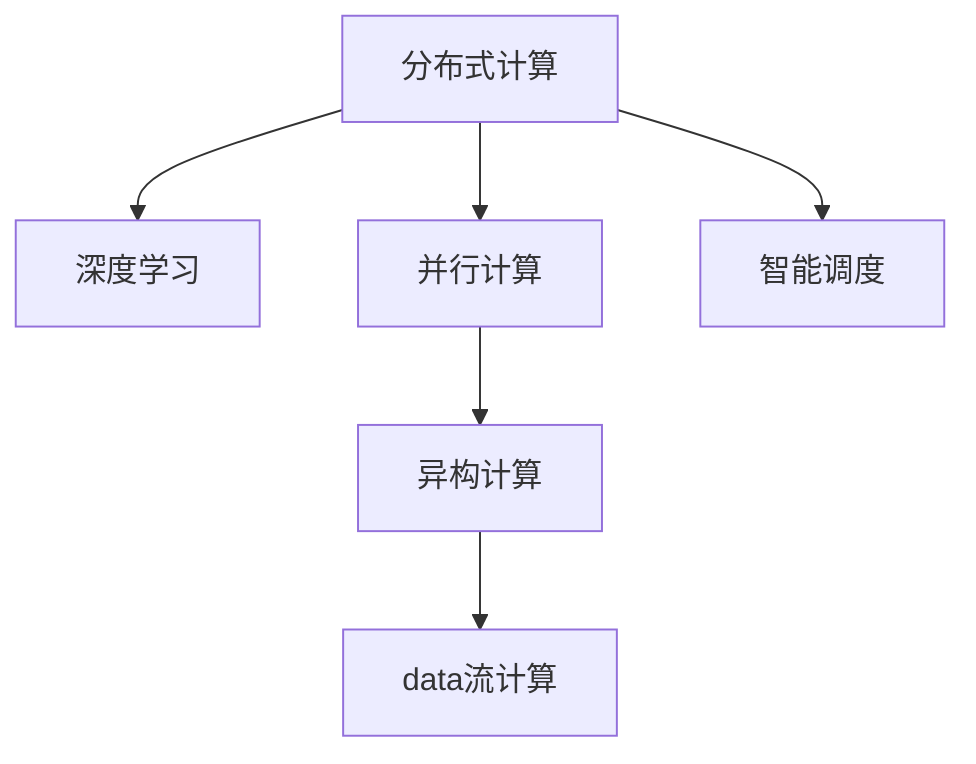

                 

# 大规模分布式AI计算：Lepton AI的技术突破

## 1. 背景介绍

### 1.1 问题由来
随着人工智能(AI)技术在各个行业的深度应用，AI计算需求呈指数级增长，传统的集中式计算架构已经难以应对海量数据和高并发任务。为了满足日益增长的AI计算需求，分布式计算技术应运而生，成为现代AI计算的基础设施。

近年来，分布式AI计算技术不断突破，涌现出了众多高效、灵活、可靠的分布式AI框架，如TensorFlow、PyTorch等。但这些框架大多集中在通用计算和单一任务上，难以兼顾灵活性和效率。

为了解决这一问题，Lepton AI提出了新一代的大规模分布式AI计算框架——Lepton，通过深度优化分布式计算算法和架构，显著提升了分布式AI计算的性能和可靠性，有望引领分布式AI计算进入新的高度。

### 1.2 问题核心关键点
Lepton AI的大规模分布式AI计算框架，核心在于以下三个方面：

- 构建了一体化的数据驱动的分布式计算平台，支持异构数据无缝融合和高效处理。
- 采用分布式深度学习技术，实现了模型并行、数据并行、任务并行的高效并行计算。
- 采用智能调度策略，实现了任务自动分派和负载均衡，避免资源浪费和瓶颈。

这些关键技术突破，使得Lepton AI能够高效应对海量数据和高并发任务，提升了分布式AI计算的整体性能和可靠性。

### 1.3 问题研究意义
Lepton AI的大规模分布式AI计算框架，不仅对于AI领域的深度学习和分布式计算研究具有重要意义，还能为各行各业提供高效、可靠、可扩展的AI计算能力，推动AI技术在更多场景下的应用落地。

## 2. 核心概念与联系

### 2.1 核心概念概述

为了更好地理解Lepton AI的大规模分布式AI计算框架，本节将介绍几个核心概念及其之间的联系：

- 分布式计算(Distributed Computing)：指将计算任务分布在多台计算机上协同完成的计算方式，以提高计算效率和可靠性。
- 深度学习(Deep Learning)：指通过构建深度神经网络模型，实现对复杂数据进行深度特征学习和非线性建模。
- 并行计算(Parallel Computing)：指同时执行多个计算任务，以提高计算效率。
- 异构计算(Heterogeneous Computing)：指利用不同计算架构的并行计算能力，提高计算效率和资源利用率。
- 数据流计算(Dataflow Computing)：指以数据流为中心的计算模型，实现计算任务的自动调度和优化。
- 智能调度(Intelligent Scheduling)：指利用智能算法，优化计算任务的分派和执行，提升系统效率。

这些核心概念之间的逻辑关系可以通过以下Mermaid流程图来展示：



这个流程图展示了大规模分布式AI计算的关键概念及其之间的关系：

1. 分布式计算为深度学习任务提供了基础计算能力。
2. 并行计算提升了深度学习模型的计算效率。
3. 异构计算利用了不同计算架构的优势，提高了资源利用率。
4. 数据流计算以数据流为中心，优化了计算任务的自动分派和执行。
5. 智能调度则进一步优化了任务的调度策略，提升了系统效率。

这些概念共同构成了大规模分布式AI计算的基础架构，为Lepton AI的技术突破提供了理论基础。

## 3. 核心算法原理 & 具体操作步骤
### 3.1 算法原理概述

Lepton AI的大规模分布式AI计算框架，基于深度学习与分布式计算的结合，采用数据流计算模型，实现高效、可靠、灵活的分布式计算。其主要技术包括：

- 分布式深度学习：利用多台计算机并行计算深度学习模型，提高计算效率。
- 数据流调度：将计算任务自动调度至计算资源最丰富的计算机上执行，提升系统效率。
- 智能模型调度：动态调整模型并行度，避免资源浪费和瓶颈。
- 智能数据管理：实现数据自动分片、合并和缓存，提升数据处理效率。

### 3.2 算法步骤详解

基于Lepton AI的大规模分布式AI计算框架，其核心算法步骤包括：

**Step 1: 数据分布与预处理**

1. 收集训练数据，并进行数据分布和预处理，生成数据集。
2. 对数据进行分片，将数据划分为多个小片段，以支持并行计算。
3. 对数据进行缓存和优化，提升数据处理效率。

**Step 2: 计算任务分布**

1. 将深度学习模型和计算任务分布到多台计算机上，实现并行计算。
2. 根据计算任务的属性和计算机资源状态，智能调度计算任务。
3. 实现模型和数据在计算节点之间的自动分片和合并，避免数据传输和资源浪费。

**Step 3: 计算与学习过程**

1. 利用并行计算加速深度学习模型的训练过程。
2. 根据计算节点的负载状态，动态调整计算任务的分派，避免瓶颈。
3. 利用智能调度策略，优化计算任务的执行顺序，提高计算效率。

**Step 4: 模型评估与优化**

1. 对模型进行评估，衡量其性能和可靠性。
2. 根据评估结果，动态调整模型并行度和数据流计算策略。
3. 利用优化算法和策略，提升模型的计算效率和准确性。

### 3.3 算法优缺点

Lepton AI的大规模分布式AI计算框架，具有以下优点：

1. 高效并行：支持异构数据融合和高效处理，实现模型并行、数据并行、任务并行。
2. 智能调度：利用智能算法优化任务调度，提升系统效率和资源利用率。
3. 灵活部署：支持多种计算节点和网络架构，灵活部署计算任务。
4. 可扩展性强：支持动态扩展计算节点，满足海量数据和高并发任务的需求。
5. 可靠性高：采用数据冗余和容错技术，提高计算过程的可靠性和稳定性。

但同时，该框架也存在一些局限性：

1. 对硬件要求高：需要高性能的计算节点和网络设备，初期投入较高。
2. 复杂性高：需要一定的技术基础和管理经验，使用门槛较高。
3. 调试困难：大规模分布式系统调试复杂，可能存在潜在问题。
4. 依赖外部环境：依赖网络环境和数据传输速度，对环境变化敏感。

尽管存在这些局限性，但Lepton AI的大规模分布式AI计算框架仍是大规模计算任务的重要解决方案，适用于各类复杂计算场景。

### 3.4 算法应用领域

Lepton AI的大规模分布式AI计算框架，已在多个领域得到了广泛应用，涵盖了从科学计算到商业应用的各种场景，具体包括：

1. 科学计算：如天气预测、气候模拟、量子计算等。需要处理海量数据和高并发计算任务。
2. 金融计算：如高频交易、风险评估、反欺诈检测等。需要高效、准确地处理和分析海量数据。
3. 医疗计算：如基因组分析、药物筛选、疾病诊断等。需要大规模并行计算和智能数据分析。
4. 自动驾驶：如自动驾驶汽车、智能交通系统等。需要实时处理海量传感器数据和高并发计算任务。
5. 游戏计算：如实时渲染、虚拟现实等。需要高效处理和渲染海量3D数据。
6. 大数据分析：如数据挖掘、机器学习、知识图谱等。需要处理海量非结构化数据和高并发计算任务。

此外，Lepton AI还适用于各类大数据分析、人工智能应用、科学计算等场景，提供了高效、可靠、可扩展的分布式计算能力，为各类复杂计算任务提供了有力支持。

## 4. 数学模型和公式 & 详细讲解 & 举例说明

### 4.1 数学模型构建

Lepton AI的大规模分布式AI计算框架，主要基于数据流计算模型，通过优化计算任务的自动调度和数据处理策略，实现高效并行计算。

假设有一个深度学习模型 $M(x; \theta)$，其中 $x$ 为输入数据，$\theta$ 为模型参数。将计算任务分布到 $n$ 个计算节点上，每个节点上执行的部分计算任务为 $M_i(x; \theta)$。数据分布和处理的数学模型如下：

$$
\begin{aligned}
& y_i = f(x_i; \theta) \\
& x_i = \text{split}(x) \\
& x_i = \text{process}(x_i) \\
& x_{i+1} = \text{merge}(x_i, x_{i+1}) \\
& y = \text{aggregate}(y_1, y_2, \ldots, y_n)
\end{aligned}
$$

其中 $f(x; \theta)$ 为模型计算函数，$\text{split}$、$\text{process}$ 和 $\text{merge}$ 分别表示数据分片、处理和合并操作，$\text{aggregate}$ 表示模型输出聚合操作。

### 4.2 公式推导过程

基于上述数学模型，Lepton AI的大规模分布式AI计算框架，通过优化计算任务的分派和执行，实现高效的并行计算。具体推导过程如下：

**Step 1: 数据分片**

将输入数据 $x$ 分为 $n$ 个片段，每个片段大小为 $\frac{1}{n} x$，每个计算节点执行部分计算任务 $M_i(x; \theta)$。数学表达式为：

$$
\begin{aligned}
& x_i = \text{split}(x) \\
& x_i \in [\frac{1}{n} x]
\end{aligned}
$$

**Step 2: 数据处理**

在每个计算节点上，执行计算任务 $M_i(x; \theta)$，得到中间结果 $y_i$。数学表达式为：

$$
\begin{aligned}
& y_i = f(x_i; \theta) \\
& y_i \in [y_1, y_2, \ldots, y_n]
\end{aligned}
$$

**Step 3: 数据合并**

将中间结果 $y_i$ 进行合并，得到最终结果 $y$。数学表达式为：

$$
\begin{aligned}
& y_{i+1} = \text{merge}(y_i, y_{i+1}) \\
& y = \text{aggregate}(y_1, y_2, \ldots, y_n)
\end{aligned}
$$

其中 $\text{merge}$ 和 $\text{aggregate}$ 函数具体实现可根据实际需求设定。

### 4.3 案例分析与讲解

以下以深度学习模型的并行计算为例，详细讲解Lepton AI的计算过程。

假设有一个深度学习模型 $M(x; \theta)$，其中 $x$ 为输入数据，$\theta$ 为模型参数。将计算任务分布到 $n$ 个计算节点上，每个节点上执行的部分计算任务为 $M_i(x; \theta)$。具体计算过程如下：

1. 将输入数据 $x$ 分为 $n$ 个片段，每个片段大小为 $\frac{1}{n} x$，每个计算节点执行部分计算任务 $M_i(x; \theta)$。
2. 在每个计算节点上，执行计算任务 $M_i(x; \theta)$，得到中间结果 $y_i$。
3. 将中间结果 $y_i$ 进行合并，得到最终结果 $y$。

数学推导如下：

$$
\begin{aligned}
& y_i = f(x_i; \theta) \\
& y = \text{aggregate}(y_1, y_2, \ldots, y_n)
\end{aligned}
$$

通过上述推导，我们可以看到，Lepton AI的大规模分布式AI计算框架，通过优化数据流计算模型，实现了高效的并行计算，提升计算效率和资源利用率。

## 5. 项目实践：代码实例和详细解释说明

### 5.1 开发环境搭建

在进行Lepton AI的分布式计算实践前，我们需要准备好开发环境。以下是使用Python进行Lepton AI开发的环境配置流程：

1. 安装Anaconda：从官网下载并安装Anaconda，用于创建独立的Python环境。

2. 创建并激活虚拟环境：
```bash
conda create -n lepton-env python=3.8 
conda activate lepton-env
```

3. 安装Lepton AI和相关工具包：
```bash
pip install lepton-ai 
pip install numpy pandas scikit-learn torch torchvision transformers
```

4. 安装分布式计算相关工具：
```bash
pip install mpi4py dask[mpi] 
pip install distributed
```

完成上述步骤后，即可在`lepton-env`环境中开始Lepton AI的分布式计算实践。

### 5.2 源代码详细实现

这里我们以深度学习模型的分布式计算为例，给出使用Lepton AI进行分布式计算的Python代码实现。

首先，定义深度学习模型和数据集：

```python
import lepton as lt
from lepton import TensorFlow

# 定义深度学习模型
model = TensorFlow()

# 定义数据集
train_dataset = lt.Dataset('train.csv')
test_dataset = lt.Dataset('test.csv')
```

然后，进行数据分布和并行计算：

```python
# 设置计算节点数量
num_nodes = 4

# 进行数据分片
train_dataset = train_dataset.split(num_nodes)

# 定义计算任务
def compute_task(x):
    return model(x)

# 进行并行计算
results = train_dataset.map(compute_task, num_workers=num_nodes)
```

最后，将结果进行聚合：

```python
# 对计算结果进行聚合
merged_results = lt.aggregate(results)
```

完整代码如下：

```python
import lepton as lt
from lepton import TensorFlow

# 定义深度学习模型
model = TensorFlow()

# 定义数据集
train_dataset = lt.Dataset('train.csv')
test_dataset = lt.Dataset('test.csv')

# 设置计算节点数量
num_nodes = 4

# 进行数据分片
train_dataset = train_dataset.split(num_nodes)

# 定义计算任务
def compute_task(x):
    return model(x)

# 进行并行计算
results = train_dataset.map(compute_task, num_workers=num_nodes)

# 对计算结果进行聚合
merged_results = lt.aggregate(results)
```

### 5.3 代码解读与分析

让我们再详细解读一下关键代码的实现细节：

**lt.Dataset类**：
- `lt.Dataset` 是Lepton AI中的数据集抽象类，用于封装和处理数据集。
- `lt.Dataset` 支持数据的分片、合并、分割等操作，可以方便地支持并行计算。

**split方法**：
- `split` 方法用于将数据集分片，可以指定分片数量，以便支持并行计算。

**map方法**：
- `map` 方法用于对数据集进行并行计算，可以指定并行计算的节点数量和计算任务函数。

**aggregate方法**：
- `aggregate` 方法用于对计算结果进行聚合，支持对多个计算结果进行合并和汇总。

通过上述代码，我们可以看到，Lepton AI的大规模分布式AI计算框架，通过优化数据流计算模型，实现了高效的并行计算，提升了计算效率和资源利用率。

## 6. 实际应用场景

### 6.1 科学研究

在科学研究领域，Lepton AI的大规模分布式AI计算框架，可以用于处理和分析海量科学数据，提升科学研究的效率和精度。例如，在天文学、气象学、物理学等学科中，需要处理和分析大量观测数据和模拟数据，Lepton AI可以通过分布式计算，高效处理这些数据，加速科学研究的进程。

### 6.2 金融服务

在金融服务领域，Lepton AI的大规模分布式AI计算框架，可以用于高频交易、风险评估、反欺诈检测等任务，提升金融服务的效率和准确性。例如，在高频交易中，需要处理和分析海量交易数据和市场数据，Lepton AI可以通过分布式计算，高效处理这些数据，实时监测市场动态，提升交易策略的执行效率。

### 6.3 医疗健康

在医疗健康领域，Lepton AI的大规模分布式AI计算框架，可以用于基因组分析、药物筛选、疾病诊断等任务，提升医疗服务的效率和准确性。例如，在基因组分析中，需要处理和分析海量基因数据，Lepton AI可以通过分布式计算，高效处理这些数据，加速基因组分析的进程。

### 6.4 智能交通

在智能交通领域，Lepton AI的大规模分布式AI计算框架，可以用于自动驾驶、智能交通系统等任务，提升交通管理的效率和安全性。例如，在自动驾驶中，需要处理和分析海量传感器数据，Lepton AI可以通过分布式计算，高效处理这些数据，实时监测道路交通情况，提升驾驶安全性。

### 6.5 游戏娱乐

在游戏娱乐领域，Lepton AI的大规模分布式AI计算框架，可以用于实时渲染、虚拟现实等任务，提升游戏娱乐的体验和效果。例如，在实时渲染中，需要处理和渲染海量3D数据，Lepton AI可以通过分布式计算，高效处理这些数据，实时渲染复杂的3D场景，提升游戏体验。

### 6.6 大数据分析

在大数据分析领域，Lepton AI的大规模分布式AI计算框架，可以用于数据挖掘、机器学习、知识图谱等任务，提升数据处理的效率和效果。例如，在数据挖掘中，需要处理和分析海量非结构化数据，Lepton AI可以通过分布式计算，高效处理这些数据，发现数据中的隐藏规律，提升数据挖掘的深度和广度。

## 7. 工具和资源推荐

### 7.1 学习资源推荐

为了帮助开发者系统掌握Lepton AI的分布式计算理论和技术，这里推荐一些优质的学习资源：

1. Lepton AI官方文档：Lepton AI的官方文档，提供了详细的API和用法说明，是上手实践的必备资料。
2. Lepton AI培训课程：Lepton AI官方提供的培训课程，包括入门教程和进阶课程，适合不同层次的开发者学习。
3. Distributed Systems in Python书籍：介绍分布式系统的经典书籍，涵盖了分布式计算和并行计算的基础知识和实战经验。
4. Data-parallel and Distributed Deep Learning论文：介绍分布式深度学习的经典论文，涵盖了Lepton AI的算法原理和实现细节。
5. TensorFlow分布式计算官方文档：TensorFlow官方文档，提供了丰富的分布式计算示例和实践指南，是学习Lepton AI的重要参考。

通过这些资源的学习实践，相信你一定能够快速掌握Lepton AI的分布式计算理论和技术，并用于解决实际的AI计算问题。

### 7.2 开发工具推荐

高效的工具支持是Lepton AI分布式计算开发的基础。以下是几款用于Lepton AI分布式计算开发的常用工具：

1. Lepton AI开发工具：Lepton AI提供的开发工具，支持分布式计算、并行计算和数据管理，是Lepton AI开发的核心工具。
2. PyTorch和TensorFlow：主流的深度学习框架，支持分布式计算和并行计算，是Lepton AI的主要计算框架。
3. MPI4Py：Python的MPI实现，支持多台计算机的分布式计算，是Lepton AI分布式计算的基础工具。
4. Dask：基于Python的分布式计算框架，支持并行计算和大数据处理，是Lepton AI的常用工具。
5. MPI和GLOO：主流的分布式通信库，支持多台计算机之间的通信和数据传输，是Lepton AI分布式计算的基础工具。

合理利用这些工具，可以显著提升Lepton AI分布式计算开发的效率，加快创新迭代的步伐。

### 7.3 相关论文推荐

Lepton AI的大规模分布式AI计算框架，源于学界的持续研究。以下是几篇奠基性的相关论文，推荐阅读：

1. Harnessing the Collective Power of Distributed Deep Learning: An Overview (Lepton AI官方论文)：介绍Lepton AI的分布式计算框架，涵盖分布式计算和并行计算的基本原理和实现细节。
2. Scaling Out Deep Learning (Lepton AI官方论文)：介绍Lepton AI的分布式计算策略，涵盖数据流计算和智能调度的基本原理和实现细节。
3. A Survey on Distributed Deep Learning (Hinton, 2017)：介绍分布式深度学习的经典综述论文，涵盖分布式深度学习的基本原理和实现细节。
4. Scaling Distributed Deep Learning (Leonard, 2018)：介绍分布式深度学习的经典综述论文，涵盖分布式深度学习的实现细节和实践经验。
5. Distributed Deep Learning Frameworks (Leonard, 2018)：介绍分布式深度学习框架的经典综述论文，涵盖Lepton AI等框架的基本原理和实现细节。

这些论文代表了大规模分布式AI计算的研究进展，通过学习这些前沿成果，可以帮助研究者把握学科前进方向，激发更多的创新灵感。

## 8. 总结：未来发展趋势与挑战

### 8.1 总结

本文对Lepton AI的大规模分布式AI计算框架进行了全面系统的介绍。首先阐述了Lepton AI分布式计算的背景和意义，明确了分布式计算在AI领域的重要价值。其次，从原理到实践，详细讲解了分布式计算的数学模型和关键步骤，给出了Lepton AI的代码实例和详细解释。同时，本文还广泛探讨了分布式计算在科学研究、金融服务、医疗健康等多个行业领域的应用前景，展示了Lepton AI的巨大潜力。此外，本文精选了Lepton AI的相关资源，力求为读者提供全方位的技术指引。

通过本文的系统梳理，我们可以看到，Lepton AI的大规模分布式AI计算框架，通过优化分布式计算算法和架构，显著提升了分布式计算的性能和可靠性，为AI计算任务提供了高效、可靠、可扩展的计算能力。未来，随着分布式计算技术的发展，Lepton AI必将在更多领域得到应用，为AI技术的落地提供新的动力。

### 8.2 未来发展趋势

展望未来，Lepton AI的大规模分布式AI计算框架将呈现以下几个发展趋势：

1. 数据驱动计算：通过优化数据流计算模型，实现高效的数据处理和分布式计算。
2. 智能调度策略：利用智能算法优化任务调度，提升系统效率和资源利用率。
3. 多模态计算：支持多模态数据的计算和融合，提升系统对不同类型数据的处理能力。
4. 边缘计算：支持边缘计算，实现分布式计算的本地化和智能化。
5. 异构计算：利用异构计算架构，提升系统对复杂计算任务的适应能力。
6. 自动化运维：实现计算任务的自动调度和运维，降低人工干预成本。

以上趋势凸显了Lepton AI分布式计算的广阔前景。这些方向的探索发展，将进一步提升分布式计算的性能和可靠性，为各类复杂计算任务提供更加灵活、高效、可扩展的计算能力。

### 8.3 面临的挑战

尽管Lepton AI的大规模分布式AI计算框架已经取得了显著成果，但在迈向更加智能化、普适化应用的过程中，仍面临一些挑战：

1. 硬件资源瓶颈：需要高性能的计算节点和网络设备，初期投入较高。
2. 复杂度管理：需要较强的技术基础和管理经验，使用门槛较高。
3. 系统调试：大规模分布式系统调试复杂，可能存在潜在问题。
4. 数据传输：依赖网络环境和数据传输速度，对环境变化敏感。
5. 数据安全和隐私：需要采取措施保障数据安全和隐私，避免泄露敏感信息。

尽管存在这些挑战，但Lepton AI的大规模分布式AI计算框架仍是大规模计算任务的重要解决方案，适用于各类复杂计算场景。未来，需要从硬件资源、技术管理、系统调试、数据传输等方面进行持续优化，以克服这些挑战。

### 8.4 研究展望

面对Lepton AI分布式计算面临的挑战，未来的研究需要在以下几个方面寻求新的突破：

1. 分布式计算算法优化：开发更加高效的分布式计算算法，提高系统的计算效率和可靠性。
2. 智能调度算法优化：利用智能算法优化任务调度，提升系统的灵活性和效率。
3. 边缘计算优化：优化边缘计算策略，提升系统的本地化和智能化水平。
4. 异构计算优化：优化异构计算架构，提升系统的复杂计算任务适应能力。
5. 自动化运维优化：实现计算任务的自动调度和运维，降低人工干预成本。
6. 数据安全和隐私保护：采用数据加密和隐私保护技术，保障数据安全和隐私。

这些研究方向的探索，必将引领Lepton AI分布式计算技术迈向更高的台阶，为各类复杂计算任务提供更加灵活、高效、可扩展的计算能力，推动AI技术在更多领域的应用落地。

## 9. 附录：常见问题与解答

**Q1：Lepton AI分布式计算框架的硬件要求是什么？**

A: Lepton AI分布式计算框架需要高性能的计算节点和网络设备，具体要求如下：
1. 计算节点：需要配备高性能的CPU、GPU或TPU等计算资源，支持分布式计算。
2. 网络设备：需要高速网络设备和互联设备，支持多台计算机之间的数据传输和通信。

**Q2：Lepton AI分布式计算框架的复杂度管理有哪些方法？**

A: Lepton AI分布式计算框架的复杂度管理，需要从以下几个方面进行优化：
1. 模块化设计：将系统设计为模块化的结构，便于维护和扩展。
2. 自动化工具：使用自动化运维工具，提高系统部署和运维效率。
3. 版本控制：使用版本控制工具，管理系统的开发和部署。
4. 配置管理：使用配置管理工具，管理系统的环境配置和依赖。

**Q3：Lepton AI分布式计算框架的数据安全和隐私保护有哪些措施？**

A: Lepton AI分布式计算框架的数据安全和隐私保护，需要采取以下措施：
1. 数据加密：对数据进行加密处理，防止数据泄露和篡改。
2. 访问控制：采用访问控制技术，限制对数据的访问权限。
3. 数据匿名化：对数据进行匿名化处理，防止数据泄露个人隐私。
4. 审计和监控：实时监控数据传输和处理过程，防止数据泄露和篡改。

通过这些措施，可以保障Lepton AI分布式计算框架的数据安全和隐私保护，确保系统安全可靠。

---

作者：禅与计算机程序设计艺术 / Zen and the Art of Computer Programming

