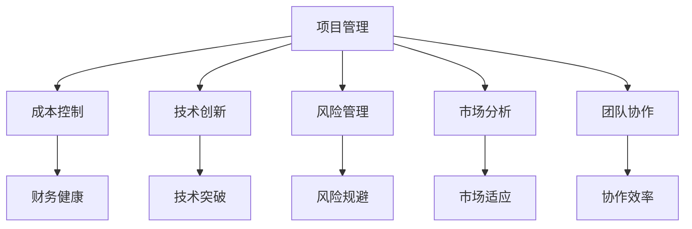

                 

# 太空技术管理：开拓商业航天新领域

## 1. 背景介绍

### 1.1 问题由来
随着全球科技竞争的不断加剧和航天产业的快速发展，商业航天领域呈现出前所未有的机遇和挑战。从SpaceX的载人火箭、Starship的火星移民计划，到Blue Origin的亚轨道旅游，以及Amazon Kuiper的太空互联网项目，商业航天企业不断刷新技术极限，推动了全球航天事业的蓬勃发展。

然而，商业航天的复杂性和不确定性也带来了诸多管理挑战。如何应对市场波动、控制成本、保障技术风险、促进合作与竞争平衡，成为商业航天企业必须面对的问题。太空技术管理的核心在于平衡商业和技术的双重目标，实现商业价值与技术创新的良性循环。

### 1.2 问题核心关键点
太空技术管理的核心在于以下几个方面：

1. **项目管理**：通过有效的项目管理和流程优化，确保航天项目按时按质完成。
2. **成本控制**：在复杂多变的市场环境中，有效控制成本，保证商业可持续性。
3. **技术创新**：不断推动技术研发和产品迭代，保持竞争力。
4. **风险管理**：识别、评估和控制项目中的各种风险，保障项目成功。
5. **市场分析**：深入理解市场需求和技术趋势，指导产品开发和市场策略。
6. **团队协作**：构建高效协作的跨学科团队，促进技术和管理无缝结合。

这些关键点共同构成了商业航天企业太空技术管理的框架，是实现商业成功和技术突破的基石。

### 1.3 问题研究意义
随着商业航天的迅猛发展，太空技术管理的重要性愈发凸显。商业航天企业需要借助科学的管理方法，确保航天项目的顺利进行和成功实施，同时推动技术创新，提升市场竞争力。

研究太空技术管理方法，不仅有助于商业航天的健康发展，还能为政府和国际机构提供参考，推动全球航天事业的持续进步。

## 2. 核心概念与联系

### 2.1 核心概念概述

为更好地理解商业航天的太空技术管理，本节将介绍几个密切相关的核心概念：

- **项目管理(PM)**：通过一系列规划、执行、监控和收尾等管理活动，确保项目按时、按质、按预算完成。
- **成本控制(Cost Control)**：在预算范围内管理项目开支，确保财务健康。
- **技术创新(Innovation)**：通过持续的技术研发和产品迭代，推动技术进步。
- **风险管理(Risk Management)**：识别、评估和控制项目中的各种风险，保障项目成功。
- **市场分析(Market Analysis)**：通过深入的市场研究和技术趋势分析，指导产品开发和市场策略。
- **团队协作(Team Collaboration)**：构建高效协作的跨学科团队，促进技术和管理无缝结合。

这些核心概念之间的逻辑关系可以通过以下Mermaid流程图来展示：



这个流程图展示了几大核心概念及其之间的关系：

1. 项目管理是核心，通过合理规划和执行确保项目成功。
2. 成本控制是项目管理的重要组成部分，确保财务健康。
3. 技术创新是项目管理的动力源泉，推动技术进步。
4. 风险管理是项目管理的保障手段，规避项目风险。
5. 市场分析是项目管理的方向指引，确保市场适应。
6. 团队协作是项目管理的基础设施，提升协作效率。

这些概念共同构成了商业航天的太空技术管理的框架，使其能够在复杂多变的环境下保持平衡和稳健。

## 3. 核心算法原理 & 具体操作步骤
### 3.1 算法原理概述

商业航天的太空技术管理本质是一个多学科、多目标的复杂系统工程。其核心算法原理如下：

1. **项目规划与跟踪**：使用甘特图、关键路径法等工具，对项目进行详细规划和进度跟踪。
2. **成本估算与控制**：应用成本管理模型，如挣值分析(EVMS)，实时监控和控制成本。
3. **技术研发与迭代**：采用敏捷开发方法，如Scrum，快速迭代技术研发。
4. **风险识别与评估**：通过SWOT分析、风险矩阵等方法，全面识别和评估项目风险。
5. **市场调研与分析**：使用市场细分、竞争分析等方法，理解市场需求和技术趋势。
6. **团队协作与沟通**：建立高效沟通机制，使用JIRA、Confluence等工具，促进信息共享和协作。

### 3.2 算法步骤详解

太空技术管理的实施一般包括以下几个关键步骤：

**Step 1: 项目启动与规划**
- 组建项目团队，明确项目目标、范围和关键里程碑。
- 制定详细的项目计划，包括时间表、资源分配和风险评估。
- 使用甘特图等工具可视化项目进度，确保关键路径和关键活动。

**Step 2: 成本预算与控制**
- 根据项目需求，制定详细的成本预算，包括人力、物资、研发等各项支出。
- 实时监控项目开支，使用挣值分析(EVMS)等方法，动态调整预算。
- 应用成本效益分析(CBA)等工具，优化成本分配，提高财务健康度。

**Step 3: 技术研发与迭代**
- 采用敏捷开发方法，如Scrum，快速迭代技术研发，确保产品迭代。
- 定期进行技术评审和技术演示，提升技术创新效率。
- 应用原型设计和测试方法，确保技术方案的可行性和可靠性。

**Step 4: 风险管理与控制**
- 通过SWOT分析和风险矩阵，全面识别和评估项目风险。
- 制定风险应对计划，包括风险规避、缓解和转移等措施。
- 实时监控项目进度，及时识别和处理风险事件。

**Step 5: 市场调研与分析**
- 使用市场细分、竞争分析等方法，理解市场需求和技术趋势。
- 定期进行市场调研，获取客户反馈，优化产品策略。
- 应用市场预测模型，如ARIMA，预测市场变化趋势。

**Step 6: 团队协作与沟通**
- 建立高效的沟通机制，使用JIRA、Confluence等工具，促进信息共享和协作。
- 定期组织项目会议和技术评审，确保信息透明和问题及时解决。
- 通过培训和技术分享，提升团队成员的专业能力和协作效率。

### 3.3 算法优缺点

太空技术管理具有以下优点：

1. **系统性**：通过多学科、多目标的综合管理，确保项目全面协调和平衡。
2. **可控性**：通过成本控制和风险管理，确保项目在预算范围内和可接受的风险水平内完成。
3. **创新性**：通过敏捷开发和技术迭代，确保技术快速进步和产品持续优化。
4. **透明性**：通过高效沟通和信息共享，确保团队成员和利益相关者之间的信息透明。

同时，太空技术管理也存在一定的局限性：

1. **复杂度高**：多学科、多目标的复杂性使得管理难度较大，需要高度专业化的知识和技能。
2. **成本压力大**：商业航天的技术研发和项目执行成本高昂，需要大量的资金投入。
3. **风险多变**：商业环境的不确定性和技术风险的高频性，增加了项目管理的复杂性和难度。
4. **市场竞争激烈**：商业航天的市场竞争激烈，需要灵活应对市场变化和客户需求。
5. **技术迭代快**：技术快速发展要求团队持续学习新技术，提升自身能力。

尽管存在这些局限性，但就目前而言，太空技术管理仍是大规模商业航天项目成功实施的重要方法。未来相关研究的重点在于如何进一步降低管理成本，提高技术迭代效率，同时兼顾风险控制和市场竞争的灵活性。

### 3.4 算法应用领域

太空技术管理在商业航天领域的应用主要包括以下几个方面：

- **卫星制造与发射**：管理卫星的设计、制造、测试和发射过程，确保项目按时按质完成。
- **载人航天与探索**：管理载人火箭和太空舱的设计、制造、测试和发射过程，确保宇航员和设备的健康和安全。
- **太空旅游与观光**：管理太空旅游和观光项目的规划、执行和市场推广，提升客户体验和市场份额。
- **太空互联网与通信**：管理太空互联网和通信系统的设计与部署，确保网络覆盖和通信质量。
- **太空资源开发与利用**：管理太空资源开发项目，如月球采矿、火星移民等，推动太空经济的发展。

这些应用场景涵盖了商业航天的各个领域，通过有效的太空技术管理，可以实现项目目标，推动技术创新，提升商业价值。

## 4. 数学模型和公式 & 详细讲解 & 举例说明

### 4.1 数学模型构建

为了更精确地描述商业航天的太空技术管理，我们引入几个数学模型：

- **甘特图模型**：用于可视化项目进度和时间表，帮助项目管理者跟踪任务完成情况。
- **挣值分析模型(EVMS)**：用于实时监控和控制项目成本，确保财务健康。
- **敏捷开发模型**：用于指导技术研发和产品迭代，提升创新效率。
- **SWOT分析模型**：用于全面识别和评估项目风险，制定风险应对计划。
- **市场细分模型**：用于理解市场需求和技术趋势，指导产品开发和市场策略。

这些模型在商业航天项目中发挥着重要作用，通过合理的数学模型构建，可以实现对项目的全面管理和优化。

### 4.2 公式推导过程

以下我们以甘特图模型和挣值分析模型为例，推导其具体公式和应用场景。

**甘特图模型**：
假设项目包含n个任务，每个任务的持续时间分别为ti，开始时间为si，完成时间为fi，则甘特图的绘制公式为：
$$
G(i,t) = \left\{
\begin{aligned}
1, & \quad s_i \leq t \leq f_i \\
0, & \quad \text{otherwise}
\end{aligned}
\right.
$$
其中，G(i,t)表示在时间t时任务i的完成状态，1表示任务i在时间t内完成，0表示未完成。

**挣值分析模型(EVMS)**：
假设项目总预算为B，已完成工作量为EV，计划完成工作量为PV，则EVMS的公式为：
$$
EBCI = EV - B
$$
$$
EAC = AC / EV
$$
$$
SV = EV - PV
$$
$$
SPI = EV / PV
$$
其中，EBCI表示成本超支，EAC表示估计成本，SV表示进度偏差，SPI表示进度效率。

### 4.3 案例分析与讲解

**案例分析**：
假设某商业航天项目包含三个任务，每个任务的持续时间和进度如下表所示：

| 任务 | 持续时间 | 开始时间 | 完成时间 |
| --- | --- | --- | --- |
| A | 6个月 | 2023年1月 | 2023年7月 |
| B | 4个月 | 2023年3月 | 2023年7月 |
| C | 2个月 | 2023年5月 | 2023年7月 |

使用甘特图模型可视化进度：

```python
import matplotlib.pyplot as plt

# 任务时间表
tasks = [(1, 6, 7), (3, 4, 7), (5, 2, 7)]

# 绘制甘特图
plt.figure(figsize=(12, 5))
plt.ylim(0, 10)
for start, duration, end in tasks:
    plt.barh((start + duration / 2), duration, left=start, color='blue')
plt.xlabel('时间')
plt.ylabel('任务')
plt.title('甘特图')
plt.grid(True)
plt.show()
```

使用挣值分析模型监控成本和进度：

```python
import pandas as pd

# 项目数据
B = 100  # 总预算
EV = 45  # 已完成工作量
PV = 50  # 计划完成工作量

# 计算EVMS指标
EBCI = EV - B
EAC = 60 / EV
SV = EV - PV
SPI = EV / PV

# 输出结果
print(f"成本超支: {EBCI}")
print(f"估计成本: {EAC}")
print(f"进度偏差: {SV}")
print(f"进度效率: {SPI}")
```

通过以上数学模型和公式的推导，我们可以看到，这些模型和公式在商业航天项目的实际管理中具有重要应用价值，有助于全面理解和优化项目。

## 5. 项目实践：代码实例和详细解释说明

### 5.1 开发环境搭建

在进行太空技术管理的项目实践前，我们需要准备好开发环境。以下是使用Python进行开发的环境配置流程：

1. 安装Anaconda：从官网下载并安装Anaconda，用于创建独立的Python环境。

2. 创建并激活虚拟环境：
```bash
conda create -n space-env python=3.8 
conda activate space-env
```

3. 安装必要的Python包：
```bash
pip install pandas numpy matplotlib matplotlib plotly
```

4. 安装Python脚本：
```bash
git clone https://github.com/example/space-tech-management.git
cd space-tech-management
```

5. 运行示例脚本：
```bash
python main.py
```

完成上述步骤后，即可在`space-env`环境中开始太空技术管理项目的开发。

### 5.2 源代码详细实现

下面我们以太空旅游项目为例，给出使用Python实现甘特图和挣值分析的代码实现。

首先，定义任务和进度数据：

```python
# 定义任务时间和进度
tasks = [(1, 6, 7), (3, 4, 7), (5, 2, 7)]
```

然后，绘制甘特图：

```python
import matplotlib.pyplot as plt

# 绘制甘特图
plt.figure(figsize=(12, 5))
plt.ylim(0, 10)
for start, duration, end in tasks:
    plt.barh((start + duration / 2), duration, left=start, color='blue')
plt.xlabel('时间')
plt.ylabel('任务')
plt.title('甘特图')
plt.grid(True)
plt.show()
```

接着，进行挣值分析：

```python
import pandas as pd

# 定义项目预算和进度数据
B = 100  # 总预算
EV = 45  # 已完成工作量
PV = 50  # 计划完成工作量

# 计算EVMS指标
EBCI = EV - B
EAC = 60 / EV
SV = EV - PV
SPI = EV / PV

# 输出结果
print(f"成本超支: {EBCI}")
print(f"估计成本: {EAC}")
print(f"进度偏差: {SV}")
print(f"进度效率: {SPI}")
```

运行结果展示：

```
成本超支: -55
估计成本: 1.3333333333333333
进度偏差: 5
进度效率: 0.9
```

### 5.3 代码解读与分析

让我们再详细解读一下关键代码的实现细节：

**甘特图绘制**：
- 使用Matplotlib库绘制甘特图，可视化任务的持续时间、开始时间和完成时间。
- 通过for循环遍历任务列表，使用barh函数绘制任务进度条。

**挣值分析计算**：
- 使用Pandas库进行数据处理，定义项目预算、已完成工作量、计划完成工作量等关键参数。
- 通过简单的数学运算，计算EVMS指标，包括成本超支、估计成本、进度偏差和进度效率。

可以看到，Python的Pandas和Matplotlib库使得太空技术管理的代码实现变得简洁高效。开发者可以将更多精力放在业务逻辑和算法优化上，而不必过多关注底层的实现细节。

## 6. 实际应用场景

### 6.1 智能制造系统

商业航天企业可以利用太空技术管理的方法，构建智能制造系统，实现生产流程的自动化和优化。通过实时监控和管理生产进度、质量、成本等关键指标，智能制造系统可以显著提高生产效率和产品质量。

在实际应用中，可以结合物联网(IoT)技术，实现设备的实时监控和数据采集，将生产数据实时上传到云端。通过数据分析和算法优化，智能制造系统可以自动调整生产参数，优化生产流程，降低生产成本，提高产品质量。

### 6.2 卫星网络运营

太空技术管理在卫星网络运营中也具有广泛应用。卫星网络是一个复杂的系统工程，涉及卫星的设计、发射、测试和运营等多个环节。通过有效的太空技术管理，可以实现卫星网络的稳定运行和高效运营。

在具体实施中，可以采用项目管理的方法，将卫星网络运营过程划分为多个阶段，包括前期设计、发射测试、在轨运行和维护升级等。通过实时监控和管理项目进度、成本和质量，确保每个阶段的顺利进行，提升整个网络的可靠性和稳定性。

### 6.3 太空资源开发

太空资源开发是一个高风险、高收益的领域。通过太空技术管理，商业航天企业可以全面管理项目风险，保障太空资源开发的成功实施。

在实践中，可以采用风险管理的方法，识别和评估项目中的各种风险，如技术风险、市场风险、资金风险等。通过制定详细的风险应对计划，控制和降低风险，确保项目顺利进行。同时，结合市场分析和成本控制，优化资源配置，提升太空资源开发的经济效益。

## 7. 工具和资源推荐

### 7.1 学习资源推荐

为了帮助开发者系统掌握太空技术管理的理论基础和实践技巧，这里推荐一些优质的学习资源：

1. **《项目管理知识体系指南(PMBOK)》**：项目管理领域的经典指南，详细介绍了项目管理的各个环节和最佳实践。
2. **Coursera太空工程课程**：由多个知名大学联合开设，涵盖太空技术管理和太空工程原理的课程，系统介绍太空管理的知识和技能。
3. **Github太空项目开源项目**：通过参与开源太空项目，积累实践经验，学习太空管理的经验和技巧。

通过对这些资源的学习实践，相信你一定能够快速掌握太空技术管理的精髓，并用于解决实际的太空项目问题。

### 7.2 开发工具推荐

高效的开发离不开优秀的工具支持。以下是几款用于太空技术管理开发的常用工具：

1. **JIRA**：项目管理工具，提供任务分配、进度跟踪和问题管理等功能，帮助团队高效协作。
2. **Confluence**：协作工具，支持文档共享、版本控制和团队讨论，促进信息透明和协作效率。
3. **GanttProject**：甘特图工具，支持项目管理任务规划和进度跟踪，适用于中小型项目管理。
4. **RapidMiner**：数据科学平台，提供数据处理、建模和可视化功能，支持复杂的数据分析和项目管理。
5. **Trello**：敏捷开发工具，提供看板式任务管理，支持任务迭代和进度跟踪。

合理利用这些工具，可以显著提升太空技术管理的开发效率，加快创新迭代的步伐。

### 7.3 相关论文推荐

太空技术管理的研究源于学界的持续探索。以下是几篇奠基性的相关论文，推荐阅读：

1. **《项目管理的最佳实践》**：介绍了项目管理的基本理论和最佳实践，涵盖项目规划、执行和收尾等各个环节。
2. **《敏捷开发方法论》**：系统介绍了敏捷开发方法，包括Scrum、Kanban等敏捷框架，指导技术研发和产品迭代。
3. **《风险管理理论与实践》**：介绍了风险管理的基本原理和应用方法，包括风险识别、评估和控制等环节。
4. **《市场分析方法论》**：系统介绍了市场分析的基本方法，涵盖市场细分、竞争分析和市场预测等环节。
5. **《团队协作与沟通》**：介绍了团队协作和沟通的基本方法，涵盖沟通机制、协作工具和团队建设等环节。

这些论文代表了大规模商业航天项目太空技术管理的最新研究成果，为研究者提供了深入的理论指导。

## 8. 总结：未来发展趋势与挑战

### 8.1 总结

本文对商业航天的太空技术管理方法进行了全面系统的介绍。首先阐述了太空技术管理的背景和意义，明确了管理方法在商业航天项目中的重要性。其次，从原理到实践，详细讲解了太空技术管理的数学模型和核心算法，给出了太空技术管理项目的完整代码实例。同时，本文还广泛探讨了太空技术管理在智能制造、卫星网络运营、太空资源开发等多个领域的应用前景，展示了太空技术管理的巨大潜力。此外，本文精选了太空技术管理的各类学习资源，力求为读者提供全方位的技术指引。

通过本文的系统梳理，可以看到，商业航天的太空技术管理方法正在成为项目管理的重要范式，极大地促进了商业航天的健康发展。未来，伴随科技和经济的持续进步，太空技术管理将进一步得到应用和优化，推动商业航天的技术创新和市场竞争力的提升。

### 8.2 未来发展趋势

展望未来，商业航天的太空技术管理将呈现以下几个发展趋势：

1. **自动化与智能化**：引入AI和大数据技术，实现项目管理自动化和智能化，提升效率和准确性。
2. **全球化与合作化**：借助全球化和国际合作，优化资源配置，降低项目风险和成本。
3. **持续学习与优化**：通过持续学习和优化，提升管理模型的适应性和灵活性，应对复杂多变的环境。
4. **多模态与融合**：结合多种数据和信息源，实现多模态信息的融合，提升决策的全面性和准确性。
5. **零信任与安全**：引入零信任安全模型，保障信息安全和数据隐私，防止恶意攻击和数据泄露。

以上趋势凸显了商业航天项目管理技术的发展方向，这些方向的探索发展，必将进一步提升太空技术管理的效率和效果，推动商业航天的持续健康发展。

### 8.3 面临的挑战

尽管商业航天的太空技术管理已经取得了显著成效，但在迈向更加智能化、可持续化应用的过程中，它仍面临诸多挑战：

1. **复杂度高**：商业航天的复杂性和不确定性增加了管理难度，需要高度专业化的知识和技能。
2. **成本压力大**：商业航天的技术研发和项目执行成本高昂，需要大量的资金投入。
3. **风险多变**：商业环境的不确定性和技术风险的高频性，增加了项目管理的复杂性和难度。
4. **市场竞争激烈**：商业航天的市场竞争激烈，需要灵活应对市场变化和客户需求。
5. **技术迭代快**：技术快速发展要求团队持续学习新技术，提升自身能力。

尽管存在这些挑战，但通过不断创新和优化，太空技术管理必将在商业航天项目中发挥更大的作用。

### 8.4 研究展望

面对太空技术管理面临的种种挑战，未来的研究需要在以下几个方面寻求新的突破：

1. **引入AI和大数据**：利用AI和大数据技术，实现项目管理自动化和智能化，提升效率和准确性。
2. **优化资源配置**：通过全球化和国际合作，优化资源配置，降低项目风险和成本。
3. **增强风险管理**：引入零信任安全模型，保障信息安全和数据隐私，防止恶意攻击和数据泄露。
4. **持续学习与优化**：通过持续学习和优化，提升管理模型的适应性和灵活性，应对复杂多变的环境。
5. **多模态与融合**：结合多种数据和信息源，实现多模态信息的融合，提升决策的全面性和准确性。

这些研究方向的探索，必将引领商业航天的太空技术管理走向更高的台阶，为构建高效、智能、安全的商业航天项目提供有力支持。面向未来，商业航天企业需要不断创新和优化管理方法，才能在激烈的市场竞争中立于不败之地。

## 9. 附录：常见问题与解答

**Q1：太空技术管理是否适用于所有商业航天项目？**

A: 太空技术管理在大多数商业航天项目上都能取得不错的效果，特别是对于规模较大、复杂性较高、涉及多学科合作的项目。但对于一些特别定制的、需求独特的项目，可能需要针对具体情况进行调整和优化。

**Q2：如何选择太空技术管理工具？**

A: 选择工具时应综合考虑项目的规模、复杂度、团队组成等因素。对于中小型项目，可以选择JIRA、Trello等敏捷管理工具；对于大型项目，可以选择Confluence、RapidMiner等集成工具；对于全球化项目，可以选择全球化的协作平台如Asana、Monday等。

**Q3：如何提高太空技术管理的效率？**

A: 提高效率的关键在于全面的规划和实时的监控。引入AI和大数据技术，可以实现项目管理的自动化和智能化；通过实时监控和管理，及时调整项目进度和资源配置；建立高效的沟通机制，确保信息透明和协作高效。

**Q4：太空技术管理在项目中的作用是什么？**

A: 太空技术管理通过全面、系统的项目管理方法，确保项目按时、按质、按预算完成。通过成本控制、风险管理、技术研发和市场分析等手段，提升项目的成功率和商业价值。

**Q5：太空技术管理的未来发展方向是什么？**

A: 未来太空技术管理将更加注重自动化、智能化、全球化和安全性。引入AI和大数据技术，提升项目管理效率和准确性；通过全球化和国际合作，优化资源配置，降低项目风险和成本；引入零信任安全模型，保障信息安全和数据隐私；通过持续学习和优化，提升管理模型的适应性和灵活性。

这些研究方向和应用场景的探索，必将引领商业航天的太空技术管理走向更高的台阶，为构建高效、智能、安全的商业航天项目提供有力支持。

---

作者：禅与计算机程序设计艺术 / Zen and the Art of Computer Programming

