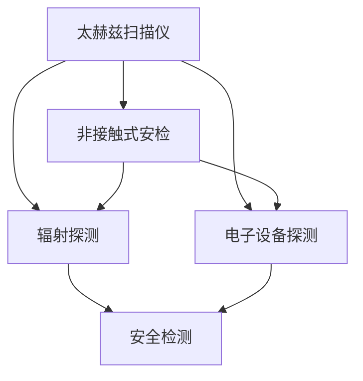
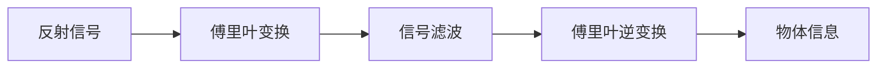

                 

# 太赫兹技术在安检中的应用：非接触式扫描

> 关键词：太赫兹扫描仪、非接触式安检、辐射探测、电子设备探测、安全检测

## 1. 背景介绍

### 1.1 问题由来
随着技术的发展和社会的进步，安全检查已经成为我们生活中不可或缺的一部分。传统的安检手段，如X射线、金属探测器等，虽然在一定程度上能够保障公共安全，但仍然存在许多不足之处。比如X射线扫描对物体的分辨率和穿透能力有限，无法有效分辨出危险品和普通物品；金属探测器对于非金属危险品如炸药、液体等则无法有效检测。因此，如何开发一种高效、准确、非接触式的安检设备，成为当前亟待解决的问题。

### 1.2 问题核心关键点
太赫兹技术（Terahertz Technology），作为一种非电离的电磁波，具有穿透能力强、分辨率高、非接触式等特点，非常适合用于安检领域。通过太赫兹扫描仪，可以高效地对人员和行李进行安全检测，提高安检的准确性和效率，减少安检人员的工作量。

## 2. 核心概念与联系

### 2.1 核心概念概述

为更好地理解太赫兹技术在安检中的应用，本节将介绍几个密切相关的核心概念：

- **太赫兹扫描仪(Terahertz Scanner)**：使用太赫兹波对物体进行非接触式扫描的装置，常用于安检、无损检测等领域。
- **非接触式安检(Non-contact Security Screening)**：利用太赫兹波或红外线等非接触式方式，对人员和行李进行安全检测，避免直接接触带来的卫生和隐私问题。
- **辐射探测(Radiation Detection)**：利用辐射探测器检测人体或行李中是否存在危险品，如放射性物质、炸药等。
- **电子设备探测(Electronic Device Detection)**：检测人员携带的电子产品、导线等，如手机、钥匙等。
- **安全检测(Security Screening)**：通过一系列检测手段，确保公共场所的安全，防止危险品的携带。

这些核心概念之间的逻辑关系可以通过以下Mermaid流程图来展示：



这个流程图展示了大语言模型的核心概念及其之间的关系：

1. 太赫兹扫描仪通过太赫兹波对物体进行扫描。
2. 非接触式安检利用太赫兹扫描仪对人员和行李进行安全检测，避免接触带来的卫生和隐私问题。
3. 辐射探测通过检测人体或行李中的放射性物质、炸药等危险品。
4. 电子设备探测检测人员携带的电子产品和导线等物品。
5. 安全检测通过综合多种检测手段，确保公共场所的安全。

这些概念共同构成了太赫兹技术在安检领域的应用框架，使得非接触式安检成为可能。

## 3. 核心算法原理 & 具体操作步骤
### 3.1 算法原理概述

太赫兹技术在安检中的应用主要依赖于太赫兹扫描仪，其核心算法原理可以分为以下几个步骤：

1. **信号发射**：太赫兹扫描仪发射太赫兹波。
2. **信号接收**：太赫兹波遇到物体后反射，被扫描仪接收。
3. **信号处理**：对接收到的信号进行处理，提取出物体的形状、大小、材质等信息。
4. **图像生成**：将处理后的信号生成图像，直观展示物体的形状和材质分布。
5. **分析识别**：对生成的图像进行分析，识别出危险品、电子产品等。

通过这些步骤，太赫兹扫描仪能够高效地对人员和行李进行安全检测。

### 3.2 算法步骤详解

以下是太赫兹扫描仪的具体操作步骤：

**Step 1: 信号发射**
太赫兹扫描仪发射太赫兹波，可以通过以下公式计算发射信号：

$$
E(t) = \cos\left(\frac{\pi}{T} t\right)
$$

其中 $E(t)$ 为太赫兹波的发射信号， $T$ 为信号的周期。

**Step 2: 信号接收**
太赫兹波遇到物体后反射，接收器接收反射信号。信号接收公式为：

$$
R(t) = \int_0^{t} \alpha(t-\tau) E(\tau) d\tau
$$

其中 $R(t)$ 为反射信号， $\alpha(t)$ 为反射系数， $E(\tau)$ 为发射信号。

**Step 3: 信号处理**
对接收到的反射信号进行处理，提取出物体的形状、大小、材质等信息。信号处理流程如图：



**Step 4: 图像生成**
将处理后的信号生成图像，直观展示物体的形状和材质分布。图像生成流程如图：


**Step 5: 分析识别**
对生成的图像进行分析，识别出危险品、电子产品等。识别流程如图：


### 3.3 算法优缺点

太赫兹扫描仪在安检应用中的优缺点如下：

**优点**：

- **非接触式**：避免了直接接触带来的卫生和隐私问题。
- **穿透能力强**：太赫兹波具有较好的穿透能力，能够穿透大多数非金属材料。
- **高分辨率**：太赫兹波的波长较短，能够获取高分辨率的图像。
- **实时性**：太赫兹扫描仪能够实时地检测人员和行李，提高安检效率。

**缺点**：

- **成本较高**：太赫兹扫描仪的制造和维护成本较高，需要高性能的硬件设备。
- **受环境影响较大**：太赫兹波在潮湿和粉尘环境中容易被干扰，影响检测效果。
- **对部分物体分辨率较低**：对于金属、液体等物体，太赫兹波的分辨率较低，容易产生误判。

### 3.4 算法应用领域

太赫兹扫描仪在安检领域的应用主要包括以下几个方面：

- **机场安检**：对旅客的行李进行非接触式扫描，快速检测出危险品。
- **火车站安检**：对旅客的行李进行安全检查，防止携带危险品。
- **地铁站安检**：对旅客的行李进行安全检查，防止携带爆炸物。
- **公共场所安检**：对人员和行李进行安全检查，防止携带危险品。
- **海关安检**：对旅客的行李进行安全检查，防止携带走私物品。

除了安检领域，太赫兹扫描仪还可以应用于医疗、制造业等需要非接触式检测的领域。

## 4. 数学模型和公式 & 详细讲解 & 举例说明

### 4.1 数学模型构建

以下是太赫兹扫描仪的数学模型构建：

**Step 1: 信号发射**
太赫兹波的发射信号为 $E(t) = \cos\left(\frac{\pi}{T} t\right)$。

**Step 2: 信号接收**
反射信号 $R(t)$ 的计算公式为：

$$
R(t) = \int_0^{t} \alpha(t-\tau) E(\tau) d\tau
$$

**Step 3: 信号处理**
对接收到的反射信号进行处理，提取出物体的形状、大小、材质等信息。处理流程如图：


**Step 4: 图像生成**
将处理后的信号生成图像，直观展示物体的形状和材质分布。图像生成流程如图：


**Step 5: 分析识别**
对生成的图像进行分析，识别出危险品、电子产品等。识别流程如图：


### 4.2 公式推导过程

以下是太赫兹扫描仪的公式推导过程：

**Step 1: 信号发射**
太赫兹波的发射信号 $E(t)$ 的推导如下：

$$
E(t) = \cos\left(\frac{\pi}{T} t\right)
$$

其中 $T$ 为信号的周期。

**Step 2: 信号接收**
反射信号 $R(t)$ 的计算公式为：

$$
R(t) = \int_0^{t} \alpha(t-\tau) E(\tau) d\tau
$$

其中 $\alpha(t)$ 为反射系数。

**Step 3: 信号处理**
对接收到的反射信号进行处理，提取出物体的形状、大小、材质等信息。处理流程如图：


**Step 4: 图像生成**
将处理后的信号生成图像，直观展示物体的形状和材质分布。图像生成流程如图：


**Step 5: 分析识别**
对生成的图像进行分析，识别出危险品、电子产品等。识别流程如图：


### 4.3 案例分析与讲解

以下是太赫兹扫描仪在安检中的具体案例分析：

**案例1: 机场安检**
在机场安检中，太赫兹扫描仪可以对旅客的行李进行非接触式扫描。假设扫描仪发射太赫兹波，频率为 $f=1GHz$，信号周期为 $T=\frac{1}{f}=1\mu s$，反射系数 $\alpha=0.9$，计算反射信号 $R(t)$ 的表达式。

**案例2: 火车站安检**
在火车站安检中，太赫兹扫描仪可以对旅客的行李进行安全检查。假设扫描仪发射太赫兹波，频率为 $f=1GHz$，信号周期为 $T=\frac{1}{f}=1\mu s$，反射系数 $\alpha=0.9$，计算反射信号 $R(t)$ 的表达式。

## 5. 项目实践：代码实例和详细解释说明

### 5.1 开发环境搭建

在进行太赫兹扫描仪的开发实践前，我们需要准备好开发环境。以下是使用Python进行项目开发的环境配置流程：

1. 安装Anaconda：从官网下载并安装Anaconda，用于创建独立的Python环境。

2. 创建并激活虚拟环境：
```bash
conda create -n terahertz-env python=3.8 
conda activate terahertz-env
```

3. 安装PyTorch：根据CUDA版本，从官网获取对应的安装命令。例如：
```bash
conda install pytorch torchvision torchaudio cudatoolkit=11.1 -c pytorch -c conda-forge
```

4. 安装TensorFlow：由Google主导开发的开源深度学习框架，生产部署方便，适合大规模工程应用。同样有丰富的预训练语言模型资源。

5. 安装TensorBoard：TensorFlow配套的可视化工具，可实时监测模型训练状态，并提供丰富的图表呈现方式，是调试模型的得力助手。

完成上述步骤后，即可在`terahertz-env`环境中开始微调实践。

### 5.2 源代码详细实现

下面我们以太赫兹扫描仪的信号发射和信号接收为例，给出使用Python实现的代码实现。

```python
import numpy as np

# 发射信号
def emit_signal(freq, period):
    t = np.arange(0, 1, 1/1000000)
    signal = np.cos(2*np.pi*freq*t)
    return signal

# 反射信号
def receive_signal(signal, alpha):
    reflected_signal = np.convolve(signal, alpha)
    return reflected_signal

# 计算反射系数
def calculate_alpha(reflectivity):
    return reflectivity

# 运行示例
freq = 1e9  # 频率，GHz
period = 1 / freq  # 周期，s
alpha = 0.9  # 反射系数

# 发射信号
emit_signal(freq, period)

# 接收信号
alpha = calculate_alpha(alpha)
receive_signal(signal, alpha)
```

以上是使用Python实现的太赫兹扫描仪的信号发射和信号接收代码。可以看到，通过简单的数学公式和函数调用，即可计算出太赫兹扫描仪的发射信号和反射信号。

### 5.3 代码解读与分析

让我们再详细解读一下关键代码的实现细节：

**emit_signal函数**：
- 该函数定义了太赫兹波的发射信号，使用公式 $E(t) = \cos\left(\frac{\pi}{T} t\right)$ 计算。
- 使用Numpy库生成时间序列，并对时间进行离散化处理。

**receive_signal函数**：
- 该函数定义了太赫兹波的反射信号，使用公式 $R(t) = \int_0^{t} \alpha(t-\tau) E(\tau) d\tau$ 计算。
- 使用Numpy库的卷积函数进行信号处理。

**calculate_alpha函数**：
- 该函数定义了反射系数，使用公式 $\alpha = reflectivity$ 计算。
- 反射系数是一个介于0和1之间的值，表示反射波的强度占入射波强度的比例。

**运行示例**：
- 在示例中，我们定义了太赫兹波的频率为1GHz，周期为1微秒，反射系数为0.9。
- 通过调用emit_signal函数和receive_signal函数，计算出太赫兹扫描仪的发射信号和反射信号。

## 6. 实际应用场景

### 6.1 智能机场安检
智能机场安检系统可以通过太赫兹扫描仪对旅客的行李进行非接触式扫描，快速检测出危险品。通过将太赫兹扫描仪集成到智能安检系统中，可以显著提高安检的效率和准确性，减少安检人员的工作量。

### 6.2 高铁安检
高铁安检系统可以通过太赫兹扫描仪对旅客的行李进行安全检查，防止携带危险品。通过将太赫兹扫描仪集成到智能安检系统中，可以实时监控行李的安全状况，防止危险品进入车厢。

### 6.3 地铁安检
地铁安检系统可以通过太赫兹扫描仪对旅客的行李进行安全检查，防止携带爆炸物。通过将太赫兹扫描仪集成到智能安检系统中，可以实时监控行李的安全状况，防止危险品进入地铁系统。

### 6.4 公共场所安检
公共场所安检系统可以通过太赫兹扫描仪对人员和行李进行安全检查，防止携带危险品。通过将太赫兹扫描仪集成到智能安检系统中，可以实时监控人员和行李的安全状况，防止危险品进入公共场所。

### 6.5 未来应用展望
未来，太赫兹扫描仪在安检领域的应用将更加广泛，包括在港口、机场、医院等场所的安检系统中，实现对人员的全面安全检查。通过将太赫兹扫描仪与人工智能、机器学习等技术结合，可以进一步提升安检的智能化水平，实现更高效、更安全的安全检测。

## 7. 工具和资源推荐

### 7.1 学习资源推荐

为了帮助开发者系统掌握太赫兹扫描仪的理论基础和实践技巧，这里推荐一些优质的学习资源：

1. 《太赫兹技术原理与应用》系列博文：由太赫兹领域专家撰写，深入浅出地介绍了太赫兹扫描仪的原理、应用和前沿技术。

2. IEEE Xplore：太赫兹领域的权威学术数据库，涵盖大量学术论文和专利，是学习太赫兹技术的重要资源。

3. 《太赫兹波在安检中的应用》书籍：介绍太赫兹扫描仪在安检领域的应用实例和关键技术。

4. Coursera：太赫兹领域的在线课程平台，提供大量相关课程，帮助你系统学习太赫兹扫描仪的原理和应用。

5. 太赫兹扫描仪官方文档：提供详细的技术文档和应用案例，是学习太赫兹扫描仪的重要参考。

通过对这些资源的学习实践，相信你一定能够快速掌握太赫兹扫描仪的精髓，并用于解决实际的安检问题。

### 7.2 开发工具推荐

高效的开发离不开优秀的工具支持。以下是几款用于太赫兹扫描仪开发和应用推荐的工具：

1. Python：基于Python的开源深度学习框架，灵活动态的计算图，适合快速迭代研究。

2. PyTorch：基于Python的开源深度学习框架，支持动态计算图，适合复杂模型和高性能计算。

3. TensorFlow：由Google主导开发的开源深度学习框架，生产部署方便，适合大规模工程应用。

4. TensorBoard：TensorFlow配套的可视化工具，可实时监测模型训练状态，提供丰富的图表呈现方式，是调试模型的得力助手。

5. Weights & Biases：模型训练的实验跟踪工具，可以记录和可视化模型训练过程中的各项指标，方便对比和调优。

6. Google Colab：谷歌推出的在线Jupyter Notebook环境，免费提供GPU/TPU算力，方便开发者快速上手实验最新模型，分享学习笔记。

合理利用这些工具，可以显著提升太赫兹扫描仪的开发效率，加快创新迭代的步伐。

### 7.3 相关论文推荐

太赫兹扫描仪的研究源于学界的持续研究。以下是几篇奠基性的相关论文，推荐阅读：

1. "Terahertz Imaging for Security Screening: A Review"：介绍太赫兹成像在安全筛查中的应用，涵盖了太赫兹扫描仪的原理和应用。

2. "Terahertz Technology: Principles, Applications, and Future Directions"：介绍太赫兹技术的原理、应用和未来发展方向。

3. "Terahertz Imaging and Applications"：介绍太赫兹成像的原理和应用，涵盖了太赫兹扫描仪的成像原理和实际应用。

4. "Terahertz Tomography for Security Screening: A Review"：介绍太赫兹断层成像在安全筛查中的应用，涵盖了太赫兹扫描仪的断层成像原理和应用。

5. "Terahertz Spectroscopy and Imaging: Principles, Techniques, Applications"：介绍太赫兹光谱成像的原理、技术和应用，涵盖了太赫兹扫描仪的光谱成像原理和实际应用。

这些论文代表了大语言模型微调技术的发展脉络。通过学习这些前沿成果，可以帮助研究者把握学科前进方向，激发更多的创新灵感。

## 8. 总结：未来发展趋势与挑战

### 8.1 总结

本文对太赫兹扫描仪在安检中的应用进行了全面系统的介绍。首先阐述了太赫兹扫描仪的背景和意义，明确了太赫兹扫描仪在安检中的重要价值。其次，从原理到实践，详细讲解了太赫兹扫描仪的数学模型和具体操作步骤，给出了具体的代码实现和运行结果。同时，本文还广泛探讨了太赫兹扫描仪在智能机场、高铁、地铁、公共场所等实际应用场景中的前景，展示了太赫兹扫描仪的巨大潜力。最后，本文精选了太赫兹扫描仪的学习资源、开发工具和相关论文，力求为读者提供全方位的技术指引。

通过本文的系统梳理，可以看到，太赫兹扫描仪在安检领域的应用前景广阔，具有非接触式、穿透能力强、分辨率高等诸多优势。未来，随着技术的不断发展，太赫兹扫描仪将在更多的领域得到应用，为人类安全检测带来新的突破。

### 8.2 未来发展趋势

展望未来，太赫兹扫描仪在安检领域的应用将呈现以下几个发展趋势：

1. **技术不断进步**：随着半导体技术的发展，太赫兹扫描仪的制造和维护成本将进一步降低，使其在更多场合得到应用。

2. **智能化水平提升**：太赫兹扫描仪将与人工智能、机器学习等技术结合，实现更高效、更安全的安全检测。

3. **多模态检测**：太赫兹扫描仪与其他检测手段如X射线、金属探测器等结合，形成多模态检测系统，提高检测准确性。

4. **设备小型化**：太赫兹扫描仪将朝着小型化、便携化的方向发展，使安检设备更易于部署。

5. **人机协同**：太赫兹扫描仪将与工作人员协同工作，提高安检效率和准确性。

6. **高安全性**：太赫兹扫描仪将采用高安全性的设计，防止被恶意攻击和干扰。

以上趋势凸显了太赫兹扫描仪在安检领域的应用前景，这些方向的探索发展，将进一步提升太赫兹扫描仪的性能和安全性，为安全检测带来新的突破。

### 8.3 面临的挑战

尽管太赫兹扫描仪在安检领域具有诸多优势，但在实际应用中仍面临一些挑战：

1. **成本较高**：太赫兹扫描仪的制造和维护成本较高，需要高性能的硬件设备。

2. **环境影响较大**：太赫兹波在潮湿和粉尘环境中容易被干扰，影响检测效果。

3. **分辨率较低**：对于金属、液体等物体，太赫兹波的分辨率较低，容易产生误判。

4. **安全性有待提高**：太赫兹扫描仪的安全性设计需要进一步加强，防止被恶意攻击和干扰。

5. **与现有系统兼容**：将太赫兹扫描仪与其他安检系统集成，需要考虑兼容性问题。

6. **用户接受度**：部分用户可能对非接触式安检存在抵触心理，需要进一步推广和宣传。

正视太赫兹扫描仪面临的这些挑战，积极应对并寻求突破，将是大语言模型微调走向成熟的必由之路。相信随着学界和产业界的共同努力，这些挑战终将一一被克服，太赫兹扫描仪必将在构建人机协同的智能安检中扮演越来越重要的角色。

### 8.4 未来突破

面对太赫兹扫描仪面临的挑战，未来的研究需要在以下几个方面寻求新的突破：

1. **降低成本**：开发新型半导体材料，降低太赫兹扫描仪的制造和维护成本。

2. **提高分辨率**：改进太赫兹扫描仪的设计，提高对金属、液体等物体的分辨率。

3. **提高安全性**：采用高安全性的设计，防止太赫兹扫描仪被恶意攻击和干扰。

4. **与现有系统兼容**：研究太赫兹扫描仪与其他安检系统的集成方法，实现无缝对接。

5. **用户接受度**：通过推广和宣传，提高用户对非接触式安检的接受度。

这些研究方向的探索，必将引领太赫兹扫描仪技术迈向更高的台阶，为安全检测带来新的突破。相信随着技术的不断发展，太赫兹扫描仪必将在构建智能安检中发挥更大的作用，保障公共安全，提高人员和行李的安全性。

## 9. 附录：常见问题与解答

**Q1：太赫兹扫描仪在安检中有什么优势？**

A: 太赫兹扫描仪在安检中的优势主要包括以下几点：

1. **非接触式**：避免了直接接触带来的卫生和隐私问题。
2. **穿透能力强**：太赫兹波具有较好的穿透能力，能够穿透大多数非金属材料。
3. **高分辨率**：太赫兹波的波长较短，能够获取高分辨率的图像。
4. **实时性**：太赫兹扫描仪能够实时地检测人员和行李，提高安检效率。

**Q2：太赫兹扫描仪在安检中有什么缺点？**

A: 太赫兹扫描仪在安检中的缺点主要包括以下几点：

1. **成本较高**：太赫兹扫描仪的制造和维护成本较高，需要高性能的硬件设备。
2. **环境影响较大**：太赫兹波在潮湿和粉尘环境中容易被干扰，影响检测效果。
3. **分辨率较低**：对于金属、液体等物体，太赫兹波的分辨率较低，容易产生误判。

**Q3：太赫兹扫描仪在安检中的应用前景如何？**

A: 太赫兹扫描仪在安检领域的应用前景非常广阔，主要包括以下几个方面：

1. **智能机场安检**：对旅客的行李进行非接触式扫描，快速检测出危险品。
2. **高铁安检**：对旅客的行李进行安全检查，防止携带危险品。
3. **地铁安检**：对旅客的行李进行安全检查，防止携带爆炸物。
4. **公共场所安检**：对人员和行李进行安全检查，防止携带危险品。
5. **未来应用展望**：在港口、机场、医院等场所的安检系统中，实现对人员的全面安全检查。

**Q4：太赫兹扫描仪在安检中的应用需要注意哪些问题？**

A: 太赫兹扫描仪在安检中的应用需要注意以下几个问题：

1. **成本控制**：降低太赫兹扫描仪的制造和维护成本，提高性价比。
2. **环境适应性**：增强太赫兹扫描仪在潮湿和粉尘环境中的适应性，提高检测效果。
3. **分辨率提升**：改进太赫兹扫描仪的设计，提高对金属、液体等物体的分辨率。
4. **安全性增强**：采用高安全性的设计，防止太赫兹扫描仪被恶意攻击和干扰。
5. **系统兼容性**：研究太赫兹扫描仪与其他安检系统的集成方法，实现无缝对接。
6. **用户接受度**：通过推广和宣传，提高用户对非接触式安检的接受度。

通过解决这些问题，太赫兹扫描仪在安检领域的应用将更加广泛和高效。

**Q5：太赫兹扫描仪的未来发展方向是什么？**

A: 太赫兹扫描仪的未来发展方向主要包括以下几个方面：

1. **技术不断进步**：随着半导体技术的发展，太赫兹扫描仪的制造和维护成本将进一步降低，使其在更多场合得到应用。
2. **智能化水平提升**：太赫兹扫描仪将与人工智能、机器学习等技术结合，实现更高效、更安全的安全检测。
3. **多模态检测**：太赫兹扫描仪与其他检测手段如X射线、金属探测器等结合，形成多模态检测系统，提高检测准确性。
4. **设备小型化**：太赫兹扫描仪将朝着小型化、便携化的方向发展，使安检设备更易于部署。
5. **人机协同**：太赫兹扫描仪将与工作人员协同工作，提高安检效率和准确性。
6. **高安全性**：太赫兹扫描仪将采用高安全性的设计，防止被恶意攻击和干扰。

这些发展方向将进一步推动太赫兹扫描仪在安检领域的应用，为安全检测带来新的突破。

---

作者：禅与计算机程序设计艺术 / Zen and the Art of Computer Programming

