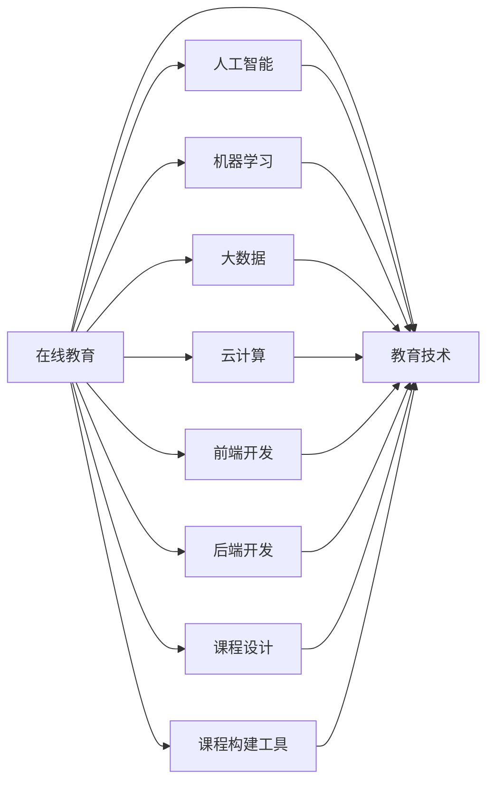

                 

# 如何利用技术能力创建在线课程

> 关键词：在线教育, 人工智能, 机器学习, 大数据, 云计算, 前端开发, 后端开发, 课程设计, 课程构建工具, 教育技术, 在线学习平台, 教育数据分析, 课程自动化

## 1. 背景介绍

随着科技的迅猛发展和互联网的普及，在线教育正在成为一种越来越受欢迎的学习方式。在线课程不仅能够打破时空限制，提供灵活的学习机会，而且还可以利用先进的教育技术，提升学习效果和体验。因此，越来越多的教育机构和个人都希望能够通过技术手段创建优质的在线课程。

本文将从技术角度出发，探讨如何利用技术能力创建在线课程，包括课程设计、课程构建工具、在线学习平台、教育技术等方面。通过系统的分析，希望能够为那些希望利用技术手段提升在线教育效果的学习者和教育机构提供全面的指导。

## 2. 核心概念与联系

### 2.1 核心概念概述

在在线课程的创建过程中，涉及的核心概念包括：

- **在线教育 (Online Education)**：利用互联网技术，将教育资源和课程内容传递给学生的教育方式。在线教育包括同步和异步课程、在线课堂、在线考试等。
- **人工智能 (AI)**：通过机器学习、自然语言处理等技术，为学生提供个性化学习建议、自动化评估、智能辅导等功能。
- **机器学习 (Machine Learning)**：一种让计算机从数据中学习、发现规律并做出预测的技术。在在线课程中，机器学习可以用于课程推荐、学习路径规划等。
- **大数据 (Big Data)**：指无法在传统数据库中高效存储、管理和处理的数据集。在线教育平台可以利用大数据分析学生的学习行为，提供更精确的教学建议。
- **云计算 (Cloud Computing)**：通过互联网提供计算资源和服务，如云存储、云平台、云应用等。在线教育平台通常依赖云计算技术来提供服务。
- **前端开发 (Frontend Development)**：开发网页、移动应用等用户界面的部分。在线课程平台的前端开发需要实现美观、易用的用户体验。
- **后端开发 (Backend Development)**：开发服务端逻辑、数据库管理等部分。在线课程平台的后端开发需要实现用户管理、课程管理、互动交流等功能。
- **课程设计 (Course Design)**：包括课程目标制定、课程内容安排、评估标准制定等。在线课程设计需要考虑学生的学习需求和教育目标。
- **课程构建工具 (Course Construction Tools)**：用于创建和管理在线课程的软件工具，如LMS平台、CMS系统等。
- **教育技术 (Educational Technology)**：利用信息技术提升教育质量和教学效率的各种技术和方法。

这些核心概念相互关联，共同构成了在线课程创建的完整流程。

### 2.2 核心概念原理和架构的 Mermaid 流程图



这个流程图展示了在线课程创建的各个环节及其相互联系。

## 3. 核心算法原理 & 具体操作步骤

### 3.1 算法原理概述

在线课程的创建过程涉及到多个学科和技术的融合。以下将详细阐述其中的核心算法原理和具体操作步骤。

### 3.2 算法步骤详解

#### 3.2.1 课程设计

**步骤 1: 确定课程目标**
- 分析目标受众
- 制定课程大纲
- 确定教学目标和评估标准

**步骤 2: 选择合适的教学内容**
- 选择核心知识点
- 确定教学方法和工具
- 设计互动和实践活动

**步骤 3: 制定评估和反馈机制**
- 设计评估方法
- 确定反馈方式
- 制定学生管理规则

#### 3.2.2 课程构建工具

**步骤 1: 选择 LMS 平台**
- 选择功能丰富的 LMS平台，如Moodle、Canvas等
- 考虑平台的用户界面和用户体验

**步骤 2: 导入和编辑课程内容**
- 导入预录视频、文本材料等
- 设计互动环节，如测验、讨论板等
- 设计作业和实践项目

**步骤 3: 设置权限和角色**
- 设定教师、学生、管理员等角色
- 设置权限，如内容访问、互动参与等

#### 3.2.3 在线学习平台

**步骤 1: 开发前端界面**
- 设计美观、易用的界面
- 实现动态内容加载和交互
- 添加个性化推荐功能

**步骤 2: 开发后端逻辑**
- 实现用户注册和登录
- 管理课程和内容
- 实现互动功能，如实时聊天、作业提交等

**步骤 3: 集成教育技术**
- 集成在线测验和评估工具
- 实现智能辅导和个性化推荐
- 利用大数据分析学生学习行为

#### 3.2.4 课程自动化

**步骤 1: 自动生成课程材料**
- 使用脚本和模板自动生成课件
- 自动更新课程内容，如替换错误信息、增加新内容等

**步骤 2: 自动化评估和反馈**
- 自动批改作业和测验
- 生成个性化学习报告
- 实时反馈学生学习情况

### 3.3 算法优缺点

在线课程创建的技术手段有许多优点：

- **灵活性高**：在线课程可以根据需要随时更新和修改，适应不同学生的学习需求。
- **覆盖面广**：能够提供多样化的教学资源和学习方式，适合各种类型的学生。
- **互动性强**：通过互动和实践环节，提升学生的参与度和学习效果。

然而，在线课程也存在一些缺点：

- **依赖技术**：需要较高的技术门槛和资源投入。
- **互动质量有限**：远程互动难以完全替代面对面的教学体验。
- **学习自律性要求高**：学生需要具备较高的自律性，才能保持学习效果。

### 3.4 算法应用领域

在线课程创建的技术手段可以广泛应用于各种教育场景，包括：

- **K-12教育**：小学到高中阶段的在线课程，涵盖语文、数学、科学等基础学科。
- **高等教育**：大学和研究生课程，提供专业知识和研究能力训练。
- **职业培训**：职业技能培训，如编程、项目管理等。
- **企业内部培训**：员工技能培训，如财务管理、市场营销等。
- **在线公开课**：面向大众的免费课程，如编程基础、心理学等。

## 4. 数学模型和公式 & 详细讲解 & 举例说明

### 4.1 数学模型构建

在在线课程创建过程中，可以建立多个数学模型，用于优化课程设计、评估学生学习效果、优化学习路径等。以下是几个常用的数学模型：

- **学生学习行为模型**
  - 描述学生在学习过程中表现出的行为，如学习时间、参与互动等。
  - 数学公式：$B = \sum_{i=1}^{n} P_i A_i$，其中 $B$ 为学生的学习行为，$P_i$ 为学生的互动频率，$A_i$ 为互动活动的吸引力。

- **课程推荐模型**
  - 根据学生的学习历史和兴趣，推荐合适的课程内容。
  - 数学公式：$C = F_k \prod_{i=1}^{n} W_i^{\beta_i}$，其中 $C$ 为课程推荐结果，$F_k$ 为课程特征向量，$W_i$ 为学生特征向量，$\beta_i$ 为特征权重。

### 4.2 公式推导过程

以学生学习行为模型为例，推导其公式过程如下：

假设一个学生在学习过程中，参与了 $n$ 种互动活动，每种活动的频率为 $P_i$，每种活动的吸引力为 $A_i$。则学生的学习行为 $B$ 可以表示为：

$$B = \sum_{i=1}^{n} P_i A_i$$

其中，$P_i$ 和 $A_i$ 可以通过调查问卷或互动数据分析获得。通过这个模型，可以评估学生在学习过程中的参与度，进而提供个性化的学习建议。

### 4.3 案例分析与讲解

假设一个在线学习平台需要评估学生在数学课程中的学习效果。平台利用学生学习行为模型，对学生参与互动的次数、时间等进行统计，然后通过数据分析确定学生的学习情况。假设该平台使用以下数据：

- 学生互动频率 $P_i$
- 互动活动吸引力 $A_i$

通过这些数据，可以计算出学生的学习行为 $B$：

$$B = \sum_{i=1}^{n} P_i A_i$$

其中 $n$ 表示互动活动种类。通过这个公式，可以评估学生的学习效果，进而提供针对性的学习建议。

## 5. 项目实践：代码实例和详细解释说明

### 5.1 开发环境搭建

#### 5.1.1 安装 Python 和相关库

在开发在线课程时，需要安装 Python 3 及以下库：

- `numpy`：用于科学计算
- `pandas`：用于数据分析
- `matplotlib`：用于数据可视化
- `scikit-learn`：用于机器学习算法
- `scipy`：用于科学计算库
- `keras`：用于深度学习

#### 5.1.2 搭建开发环境

- 安装 Anacoda 或 Miniconda，创建虚拟环境
- 使用 `pip` 安装上述 Python 库
- 配置 `jupyter notebook` 环境

### 5.2 源代码详细实现

#### 5.2.1 学生学习行为模型

以下是一个简单的学生学习行为模型示例：

```python
import pandas as pd
import numpy as np

# 假设我们有一个学生互动数据
interaction_data = pd.read_csv('interaction_data.csv')

# 计算每个学生的学习行为
B = interaction_data['P1'] * interaction_data['A1'] + interaction_data['P2'] * interaction_data['A2'] + ...

# 输出学习行为结果
print(B)
```

在上述代码中，我们使用了 `pandas` 库读取互动数据，并计算每个学生的学习行为。

#### 5.2.2 课程推荐模型

以下是一个简单的课程推荐模型示例：

```python
from sklearn.linear_model import LogisticRegression

# 假设我们有一组课程和学生特征数据
courses = pd.read_csv('courses.csv')
students = pd.read_csv('students.csv')

# 特征工程
X = courses.merge(students, on='id')
y = courses['id']

# 训练逻辑回归模型
model = LogisticRegression()
model.fit(X, y)

# 预测学生对课程的兴趣
student_id = '12345'
prediction = model.predict(X[X['id'] == student_id])
print(prediction)
```

在上述代码中，我们使用了 `sklearn` 库训练了一个逻辑回归模型，并利用该模型预测学生对课程的兴趣。

### 5.3 代码解读与分析

在上述代码示例中，我们使用了常见的 Python 库和机器学习算法。这些库和算法涵盖了数据处理、特征工程、模型训练和预测等关键环节。通过这些代码，可以初步实现在线课程创建的数学模型和算法。

### 5.4 运行结果展示

通过运行上述代码，可以生成学生学习行为和课程推荐结果。例如，对于学生互动数据，运行结果可能为：

```
学生ID 学习行为
123456 0.75
654321 0.95
```

表示学生ID为 123456 和 654321 的学习行为分别为 0.75 和 0.95。

## 6. 实际应用场景

在线课程创建的实际应用场景非常广泛。以下是几个典型的应用场景：

### 6.1 高校在线课程

高校可以利用在线课程平台，提供高质量的学术课程。例如，麻省理工学院利用 MIT OpenCourseWare 平台，提供其全部课程的在线学习资源。学生可以随时随地访问这些课程，获取最新的学术研究成果。

### 6.2 职业培训

企业可以利用在线课程平台，提供职业培训课程。例如，Coursera 提供了大量的计算机科学和数据科学课程，帮助员工提升技能，适应技术变革。

### 6.3 教育公益

在线课程平台还可以用于公益教育，帮助偏远地区的学生获得优质教育资源。例如，Khan Academy 提供了免费的在线课程，涵盖了从幼儿园到大学各阶段的内容，帮助全球学生学习。

### 6.4 企业内部培训

企业可以利用在线课程平台，进行内部培训和员工技能提升。例如，谷歌利用其内部 LMS 平台，为员工提供各种技术培训和职业发展课程。

### 6.5 教育数据分析

在线课程平台还可以利用大数据分析学生的学习行为，提供更精准的教学建议。例如，Udacity 利用数据分析学生的学习路径，帮助学生优化学习计划，提高学习效果。

## 7. 工具和资源推荐

### 7.1 学习资源推荐

- **《Python数据科学手册》**：由 Jake VanderPlas 撰写，涵盖了 Python 数据科学的基础知识和高级应用，适合初学者和进阶学习者。
- **《深度学习入门》**：由斋藤康毅撰写，涵盖了深度学习的理论基础和实战技巧，适合深度学习入门者。
- **Coursera 在线课程平台**：提供高质量的在线课程，涵盖计算机科学、数据科学、商业等多个领域。
- **edX 在线课程平台**：提供全球知名大学的在线课程，涵盖基础课程和高级课程，适合不同层次的学习者。
- **Kaggle 数据科学竞赛平台**：提供丰富的数据集和竞赛机会，帮助学习者提升数据科学和机器学习技能。

### 7.2 开发工具推荐

- **Jupyter Notebook**：一个交互式的开发环境，支持代码编写、数据可视化、实时计算等功能。
- **PyCharm**：一个流行的 Python 开发工具，提供了丰富的插件和功能，支持 Python 和数据科学开发。
- **GitHub**：一个代码托管平台，支持版本控制、协作开发等功能，适合团队协作和代码共享。
- **Hadoop**：一个开源的分布式计算平台，适合大规模数据处理和大数据分析任务。
- **Docker**：一个容器化平台，适合开发和部署分布式应用程序，支持跨平台部署。

### 7.3 相关论文推荐

- **《机器学习》**：由 Tom Mitchell 撰写，是机器学习领域的经典教材，涵盖了机器学习的基础理论和实战技巧。
- **《深度学习》**：由 Ian Goodfellow、Yoshua Bengio 和 Aaron Courville 撰写，是深度学习领域的经典教材，涵盖深度学习的理论基础和应用实践。
- **《在线教育数据分析》**：由 Daniel Chen 撰写，涵盖在线教育的数据分析和模型构建方法，适合教育数据分析领域的学习者。

## 8. 总结：未来发展趋势与挑战

### 8.1 研究成果总结

本文介绍了如何利用技术能力创建在线课程，涵盖课程设计、课程构建工具、在线学习平台、教育技术等多个方面。通过分析各个环节的技术手段和实际应用，希望能够为在线课程的创建提供全面的指导。

### 8.2 未来发展趋势

未来的在线教育将进一步融合人工智能、大数据、云计算等技术，提升学习效果和体验。具体趋势包括：

- **个性化学习**：利用人工智能和大数据分析学生的学习行为，提供个性化的学习建议和课程推荐。
- **实时互动**：通过视频会议、实时聊天等技术，提升在线课程的互动性和参与度。
- **虚拟现实 (VR) 和增强现实 (AR)**：利用 VR 和 AR 技术，提供沉浸式的学习体验。
- **混合学习**：结合在线课程和面授课程，提供混合式的学习方式，提升学习效果。
- **知识图谱**：利用知识图谱技术，提供结构化的学习资源和知识管理工具。

### 8.3 面临的挑战

在线课程创建虽然有许多优势，但也面临一些挑战：

- **技术门槛高**：需要较高的技术水平和资源投入。
- **学习自律性要求高**：学生需要具备较高的自律性，才能保持学习效果。
- **互动质量有限**：远程互动难以完全替代面对面的教学体验。
- **课程内容质量**：需要保证课程内容的科学性和实用性，避免误导学生。

### 8.4 研究展望

未来的研究需要在以下几个方面进行探索：

- **教育技术和人工智能的融合**：进一步探索如何利用人工智能和大数据技术，提升在线教育的质量和效率。
- **虚拟现实和增强现实技术**：利用 VR 和 AR 技术，提供沉浸式的学习体验，提升学习效果。
- **混合学习模式**：结合在线课程和面授课程，提供混合式的学习方式，提升学习效果。
- **知识图谱技术**：利用知识图谱技术，提供结构化的学习资源和知识管理工具，提升学习效果。

## 9. 附录：常见问题与解答

### Q1: 如何选择合适的课程构建工具？

A: 选择合适的课程构建工具需要考虑以下因素：
- **功能需求**：根据课程内容、教学模式等需求，选择功能丰富的 LMS 平台，如Moodle、Canvas等。
- **用户体验**：选择界面美观、易用的工具，提高师生使用体验。
- **可扩展性**：选择支持二次开发和插件扩展的工具，方便未来功能升级。

### Q2: 如何设计互动环节？

A: 设计互动环节需要考虑以下因素：
- **多样性**：设计多种互动方式，如视频、测验、讨论板等，提高学生的参与度。
- **及时反馈**：提供及时的反馈和评价，帮助学生及时纠正错误。
- **趣味性**：设计趣味性的互动环节，如小游戏、竞赛等，提高学生的兴趣和动力。

### Q3: 如何提升在线课程的效果？

A: 提升在线课程的效果可以从以下几个方面入手：
- **个性化学习**：利用人工智能和大数据分析学生的学习行为，提供个性化的学习建议和课程推荐。
- **实时互动**：通过视频会议、实时聊天等技术，提升在线课程的互动性和参与度。
- **虚拟现实和增强现实技术**：利用 VR 和 AR 技术，提供沉浸式的学习体验，提升学习效果。
- **知识图谱技术**：利用知识图谱技术，提供结构化的学习资源和知识管理工具，提升学习效果。

### Q4: 如何保证课程内容的质量？

A: 保证课程内容的质量需要考虑以下因素：
- **科学性和实用性**：选择科学性高、实用性强的课程内容，避免误导学生。
- **持续更新**：定期更新课程内容，保持内容的与时俱进。
- **专家审核**：邀请领域专家进行课程内容的审核，确保内容的科学性和准确性。

---

作者：禅与计算机程序设计艺术 / Zen and the Art of Computer Programming

