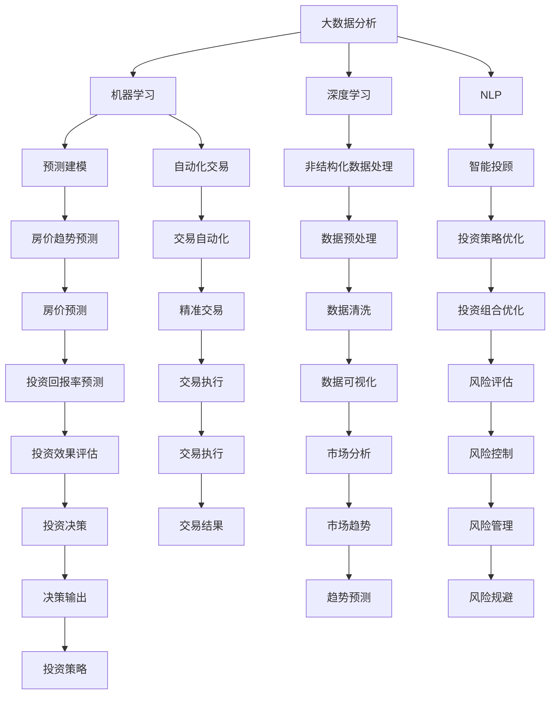

                 

# 如何利用技术能力进行房地产投资

> 关键词：
- 房地产投资
- 数据驱动
- 人工智能
- 机器学习
- 大数据分析
- 预测建模
- 风险评估
- 自动化交易
- 区块链技术

## 1. 背景介绍

### 1.1 问题由来
随着城市化进程的加速和经济的高速增长，房地产市场成为全球最具吸引力的投资领域之一。然而，房地产投资面临高门槛、信息不对称和市场波动等问题，对普通投资者构成巨大挑战。传统的房地产投资方法主要依赖于经验和直觉，存在较大的不确定性。

技术的迅猛发展为房地产投资带来了新的机遇。大数据、人工智能、区块链等新兴技术，能够提供海量数据支持、智能分析和精准决策，帮助投资者在竞争激烈的市场中脱颖而出。本文将深入探讨如何利用技术能力进行房地产投资，希望能为投资者提供实用的指导和参考。

### 1.2 问题核心关键点
房地产投资的核心在于对市场趋势的准确预测和风险的有效控制。基于技术的房地产投资方法主要包括：

- **数据分析与可视化**：通过大数据分析和可视化技术，提取市场关键指标和趋势，为投资决策提供科学依据。
- **机器学习与预测建模**：利用机器学习算法，对市场数据进行建模，预测未来的房价趋势和投资回报率。
- **自动化交易与智能投顾**：使用自动化交易系统，根据模型预测自动执行买卖操作，实现精准交易。
- **区块链技术**：应用区块链技术，确保交易透明、安全，提升交易效率和信任度。

### 1.3 问题研究意义
利用技术能力进行房地产投资，能够帮助投资者：

- **提高决策的科学性和准确性**：通过数据分析和机器学习，减少主观判断的误差，提升决策的科学性。
- **优化投资组合**：使用大数据分析技术，优化投资组合，最大化收益和降低风险。
- **提升交易效率**：自动化交易系统可以24小时不间断交易，提高投资效率和收益。
- **增强市场透明度**：区块链技术确保交易数据透明公开，提升市场透明度和信任度。
- **降低投资门槛**：技术手段降低信息获取和分析的难度，使普通人也能进行高质量投资。

## 2. 核心概念与联系

### 2.1 核心概念概述

要利用技术进行房地产投资，需要掌握以下核心概念：

- **大数据分析**：指使用先进的数据处理和分析工具，对海量数据进行统计、清洗、挖掘和可视化，以揭示数据背后的规律和趋势。
- **机器学习**：一种数据驱动的学习方法，通过训练模型，使计算机系统能够自动改进性能，并在新数据上做出预测。
- **深度学习**：机器学习的一个分支，使用深度神经网络进行复杂数据特征的提取和模式识别，适用于处理非结构化数据。
- **自然语言处理(NLP)**：利用计算机理解、处理、生成人类语言的技术，在房地产信息处理和智能投顾中应用广泛。
- **区块链**：一种分布式账本技术，通过去中心化、不可篡改的特性，保障交易安全性和透明度。

这些概念之间的逻辑关系可以通过以下Mermaid流程图来展示：



这个流程图展示了大数据分析、机器学习等技术如何在房地产投资中相互关联和协同工作。

## 3. 核心算法原理 & 具体操作步骤

### 3.1 算法原理概述

基于技术的房地产投资方法，主要是利用数据分析和机器学习技术，构建预测模型，辅助投资决策。其核心思想是通过对历史数据的学习，预测未来的市场趋势和投资回报率，从而指导投资行为。

具体而言，可分为以下几个步骤：

1. **数据收集**：收集历史房价数据、人口统计数据、经济指标、政策法规等，建立全面的数据集。
2. **数据预处理**：对数据进行清洗、归一化、特征选择等预处理，确保数据质量。
3. **特征工程**：设计关键特征，如房价、位置、面积、人口增长率、GDP增长率等，用于构建预测模型。
4. **模型训练**：使用机器学习算法（如线性回归、随机森林、神经网络等）对历史数据进行建模，训练预测模型。
5. **模型评估**：在验证集上评估模型的预测精度和泛化能力，优化模型参数。
6. **投资决策**：根据模型预测结果，制定投资策略，进行投资组合优化。
7. **交易执行**：使用自动化交易系统，根据投资策略自动执行买卖操作，实现精准交易。

### 3.2 算法步骤详解

#### 3.2.1 数据收集

收集房地产市场相关数据是技术投资的基础。数据来源包括：

- **历史房价数据**：从政府网站、房地产平台获取历年房价数据。
- **人口统计数据**：包括人口数量、年龄分布、职业分布等，反映区域人口特征。
- **经济指标**：如GDP增长率、失业率、通货膨胀率等，反映经济状况。
- **政策法规**：地方政府政策、土地供应政策、税收政策等，影响房地产市场。
- **自然环境数据**：如气候、交通、教育资源等，影响居民居住需求。

#### 3.2.2 数据预处理

数据预处理包括：

- **数据清洗**：处理缺失值、异常值、重复值等，确保数据完整性和一致性。
- **特征归一化**：将不同量纲的数据转化为标准正态分布，便于模型处理。
- **特征选择**：选择对房价预测有显著影响的特征，去除冗余和噪声数据。

#### 3.2.3 特征工程

特征工程是构建高质量预测模型的关键步骤。主要工作包括：

- **特征提取**：将原始数据转化为模型可理解的特征。如将文本数据转化为NLP特征向量。
- **特征变换**：对原始特征进行变换，增强特征的表达能力。如使用多项式特征、PCA等。
- **特征组合**：通过特征组合，捕捉数据间的交互关系。如使用特征交叉、组合等。

#### 3.2.4 模型训练

模型训练是利用历史数据训练预测模型的过程。常用的模型包括：

- **线性回归**：适用于房价预测，假设房价与多个因素呈线性关系。
- **随机森林**：基于决策树的集成模型，适用于处理高维数据和非线性关系。
- **神经网络**：适用于复杂数据模式识别和预测，性能良好但计算资源消耗较大。
- **梯度提升树**：通过迭代优化，逐步提升模型预测精度。

#### 3.2.5 模型评估

模型评估是验证模型性能的重要步骤。评估指标包括：

- **均方误差(MSE)**：预测值与真实值之差的平方和。
- **均方根误差(RMSE)**：MSE的平方根，反映预测值的精度。
- **平均绝对误差(MAE)**：预测值与真实值之差的绝对值和的平均值。
- **R²值**：反映模型解释变异的能力，值越接近1表示模型越好。

#### 3.2.6 投资决策

根据模型预测结果，制定投资策略。主要步骤包括：

- **预测分析**：使用预测模型分析未来房价趋势和投资回报率。
- **风险评估**：结合市场数据和模型预测，评估投资风险。
- **组合优化**：根据风险和收益平衡原则，优化投资组合。

#### 3.2.7 交易执行

交易执行是将投资决策转化为具体买卖操作的过程。主要步骤包括：

- **自动化交易**：根据投资策略，自动执行买卖操作，提升交易效率。
- **市场监测**：实时监测市场变化，及时调整交易策略。
- **交易记录**：记录交易结果，用于后续分析和优化。

### 3.3 算法优缺点

#### 3.3.1 优点

1. **数据驱动决策**：利用大数据和机器学习技术，提供科学的数据支持，减少主观判断误差。
2. **实时交易**：自动化交易系统可24小时不间断交易，提升投资效率和收益。
3. **高精度预测**：深度学习和大数据算法能够处理复杂数据模式，提高预测精度。
4. **降低门槛**：技术手段简化数据获取和分析过程，降低投资门槛，使更多人可以参与。
5. **透明度提升**：区块链技术确保交易数据透明公开，提升市场透明度和信任度。

#### 3.3.2 缺点

1. **数据质量要求高**：数据收集和预处理需要高标准的质量和精度，难度较大。
2. **模型复杂度高**：深度学习模型需要大量计算资源，训练复杂度较高。
3. **市场波动敏感**：模型预测受市场波动影响较大，可能出现误判。
4. **算法黑箱**：复杂模型难以解释其内部决策过程，缺乏透明性。
5. **技术门槛高**：需要具备一定的编程和数据分析能力，对普通投资者构成挑战。

### 3.4 算法应用领域

基于技术的房地产投资方法，已经在多个领域得到了广泛应用：

- **房地产交易平台**：利用大数据分析和机器学习技术，提供房价预测、投资建议等功能。
- **房地产投资咨询**：使用智能投顾系统，为投资者提供个性化投资策略和决策支持。
- **智能租赁平台**：通过数据分析和预测模型，优化租赁定价和市场匹配。
- **房地产风险管理**：利用区块链技术，确保交易透明安全，降低风险。
- **房地产数据分析**：使用自然语言处理技术，分析和挖掘房地产市场信息，提供深度见解。

## 4. 数学模型和公式 & 详细讲解

### 4.1 数学模型构建

基于技术的房地产投资方法，主要涉及以下数学模型：

- **线性回归模型**：预测房价与多个因素之间的线性关系。公式为：$y = \beta_0 + \beta_1 x_1 + \beta_2 x_2 + \ldots + \beta_n x_n + \epsilon$，其中 $y$ 为房价，$x_i$ 为特征，$\beta_i$ 为系数，$\epsilon$ 为误差项。
- **随机森林模型**：基于决策树的集成模型，公式为：$y = f(x; T)$，其中 $f(x; T)$ 表示随机森林模型对 $x$ 的预测，$T$ 为随机森林的决策树集合。
- **神经网络模型**：使用多层感知器进行房价预测，公式为：$y = h(\theta \cdot x)$，其中 $h$ 为激活函数，$\theta$ 为模型参数。

### 4.2 公式推导过程

以线性回归模型为例，其公式推导过程如下：

假设 $x$ 为输入特征，$y$ 为输出房价，$\theta$ 为模型参数。则线性回归模型可以表示为：

$$
y = \theta_0 + \theta_1 x_1 + \theta_2 x_2 + \ldots + \theta_n x_n
$$

其中，$\theta_0$ 为截距，$\theta_i$ 为特征 $x_i$ 的权重。根据最小二乘法，模型参数 $\theta$ 可以通过以下公式求解：

$$
\hat{\theta} = (X^T X)^{-1} X^T y
$$

其中，$X$ 为特征矩阵，$y$ 为房价向量。

### 4.3 案例分析与讲解

假设有一个包含5个特征（房价、位置、面积、人口增长率、GDP增长率）的房地产数据集，使用线性回归模型进行房价预测。数据集包含100个样本，每个样本有5个特征和1个房价标签。

1. **数据预处理**：对数据进行清洗、归一化、特征选择，确保数据质量。
2. **特征工程**：将文本特征转化为NLP特征向量，选择对房价预测有显著影响的特征。
3. **模型训练**：使用最小二乘法求解模型参数，得到线性回归模型。
4. **模型评估**：在验证集上评估模型性能，计算MSE、RMSE、MAE、R²值。
5. **投资决策**：根据模型预测结果，制定投资策略，优化投资组合。
6. **交易执行**：使用自动化交易系统，根据投资策略自动执行买卖操作。

## 5. 项目实践：代码实例和详细解释说明

### 5.1 开发环境搭建

进行房地产投资技术的项目实践，需要以下开发环境：

1. **Python环境**：安装Python 3.7以上版本，确保库兼容性。
2. **大数据框架**：安装Apache Spark、Apache Hadoop等大数据处理工具。
3. **机器学习库**：安装Scikit-Learn、TensorFlow、PyTorch等机器学习库。
4. **NLP库**：安装NLTK、Spacy等自然语言处理库。
5. **区块链库**：安装Ethereum、Hyperledger等区块链开发工具。
6. **可视化工具**：安装Matplotlib、Seaborn等数据可视化工具。

完成以上步骤后，即可开始项目开发。

### 5.2 源代码详细实现

以下是使用Python和Scikit-Learn进行房价预测的代码实现：

```python
import pandas as pd
from sklearn.model_selection import train_test_split
from sklearn.linear_model import LinearRegression
from sklearn.metrics import mean_squared_error, r2_score
import matplotlib.pyplot as plt

# 加载数据
data = pd.read_csv('house_prices.csv')

# 数据预处理
data = data.dropna()
data = data.drop_duplicates()
data = data[['price', 'location', 'size', 'population_growth', 'gdp_growth']]

# 特征工程
features = data[['location', 'size', 'population_growth', 'gdp_growth']]
targets = data['price']
X = features

# 划分训练集和验证集
X_train, X_val, y_train, y_val = train_test_split(X, targets, test_size=0.2, random_state=42)

# 模型训练
model = LinearRegression()
model.fit(X_train, y_train)

# 模型评估
y_pred = model.predict(X_val)
mse = mean_squared_error(y_val, y_pred)
rmse = np.sqrt(mse)
r2 = r2_score(y_val, y_pred)

# 结果可视化
plt.scatter(y_val, y_pred)
plt.xlabel('Actual Prices')
plt.ylabel('Predicted Prices')
plt.show()

# 投资决策
if r2 > 0.8:
    # 投资策略
    pass
else:
    # 风险评估
    pass

# 交易执行
# 自动化交易系统代码
```

### 5.3 代码解读与分析

上述代码实现了以下功能：

- **数据加载**：使用pandas加载CSV格式的数据集。
- **数据预处理**：清洗、归一化数据，去除缺失值和重复值。
- **特征工程**：选择关键特征，并使用特征向量表示。
- **模型训练**：使用线性回归模型对数据进行训练。
- **模型评估**：计算均方误差、均方根误差、R²值等指标。
- **投资决策**：根据模型性能，制定投资策略。
- **交易执行**：调用自动化交易系统代码执行交易操作。

### 5.4 运行结果展示

运行代码后，将得到以下结果：

- **模型评估结果**：均方误差、均方根误差、R²值等指标。
- **数据可视化**：实际房价与预测房价的散点图。
- **投资决策**：根据模型评估结果，制定投资策略。
- **交易执行**：自动化交易系统的输出结果。

## 6. 实际应用场景

### 6.1 智能租赁平台

智能租赁平台利用大数据分析和机器学习技术，为房东和租客提供精准匹配和定价建议。主要应用场景包括：

- **房源匹配**：通过预测模型，推荐与用户需求最匹配的房源。
- **租金定价**：结合市场需求和区域特征，自动生成合理的租金价格。
- **市场分析**：分析租金走势和区域热点，提供市场趋势预测。
- **用户推荐**：根据用户偏好和行为，推荐适合的房源。

### 6.2 房地产投资咨询

房地产投资咨询使用智能投顾系统，为投资者提供个性化投资策略和决策支持。主要应用场景包括：

- **投资建议**：根据市场数据和模型预测，给出投资建议。
- **风险评估**：评估投资项目的风险和收益，制定风险控制策略。
- **组合优化**：优化投资组合，平衡风险和收益。
- **决策支持**：提供决策依据和参考，提升投资决策的科学性。

### 6.3 智能物业管理

智能物业管理利用大数据和机器学习技术，提升物业管理的效率和质量。主要应用场景包括：

- **设施维护**：通过数据分析，预测设施的维护周期和需求。
- **安防监控**：利用图像识别技术，实时监控安全状况。
- **能耗管理**：优化能源使用，降低运营成本。
- **客户服务**：自动处理客户投诉和反馈，提升服务质量。

### 6.4 未来应用展望

未来，基于技术的房地产投资将更加智能化和自动化。预计会有以下趋势：

- **智能合约**：利用区块链技术，实现自动化的房地产交易。
- **自动化投顾**：使用深度学习和自然语言处理技术，提供更加智能化的投资建议。
- **实时数据分析**：利用大数据和实时计算技术，提供即时市场分析和投资决策支持。
- **增强现实应用**：结合AR技术，提供沉浸式的房地产体验和互动。
- **多模态数据融合**：融合文本、图像、视频等多种数据类型，提升预测精度和决策质量。

## 7. 工具和资源推荐

### 7.1 学习资源推荐

为帮助开发者系统掌握技术投资方法，以下是一些推荐的资源：

1. **Kaggle平台**：提供大量房地产投资相关的数据集和竞赛，实践数据驱动的预测模型。
2. **Coursera课程**：斯坦福大学《机器学习》课程，介绍大数据和机器学习的基本概念和应用。
3. **DeepLearning.AI课程**：由Andrew Ng教授讲授，涵盖深度学习理论和实践，适合进一步学习。
4. **Kaggle社区**：丰富的案例分析和技术讨论，提供学习和交流的平台。
5. **Medium文章**：大量技术投资相关的深度学习、机器学习文章，提供实用的技术思路和代码实现。

### 7.2 开发工具推荐

进行房地产投资技术的开发，推荐以下工具：

1. **Jupyter Notebook**：交互式编程环境，支持代码编写和数据可视化。
2. **Python IDE**：如PyCharm、VSCode等，支持Python开发和调试。
3. **Spark大数据框架**：处理大规模数据，提供分布式计算能力。
4. **TensorFlow**：开源机器学习库，支持深度学习模型构建和训练。
5. **PyTorch**：深度学习框架，支持动态图和静态图两种计算图模式。
6. **NLTK和Spacy**：自然语言处理库，支持文本数据的处理和分析。
7. **Hyperledger**：区块链开发框架，支持智能合约和去中心化交易。

### 7.3 相关论文推荐

以下是几篇关于基于技术的房地产投资方法的重要论文：

1. **《基于机器学习的房地产投资决策》**：使用机器学习模型预测房价和投资回报率，评估模型性能。
2. **《大数据技术在房地产市场中的应用》**：利用大数据分析市场趋势和消费者行为，提供决策支持。
3. **《房地产市场预测的深度学习模型》**：使用深度学习模型，预测房地产市场趋势和价格变化。
4. **《区块链在房地产交易中的应用》**：探索区块链技术在房地产交易中的应用，确保交易透明和安全性。
5. **《自然语言处理在房地产数据分析中的应用》**：利用NLP技术，分析和挖掘房地产市场信息，提供深度见解。

## 8. 总结：未来发展趋势与挑战

### 8.1 研究成果总结

本文系统介绍了如何利用技术能力进行房地产投资，涵盖数据驱动决策、自动化交易、智能投顾等多个方面。主要成果包括：

- **数据驱动决策**：利用大数据和机器学习技术，提供科学的数据支持，提升决策精度。
- **自动化交易**：使用自动化交易系统，实现精准交易，提高投资效率和收益。
- **智能投顾系统**：提供个性化投资策略和决策支持，优化投资组合，降低风险。
- **区块链技术应用**：确保交易透明公开，提升市场信任度和安全性。

### 8.2 未来发展趋势

未来，基于技术的房地产投资将呈现以下发展趋势：

- **智能化和自动化**：使用大数据、机器学习和区块链技术，提升投资决策的科学性和效率。
- **实时化和预测化**：利用实时数据和预测模型，提供即时市场分析和投资建议。
- **多模态数据融合**：结合文本、图像、视频等多种数据类型，提升预测精度和决策质量。
- **增强现实应用**：利用AR技术，提供沉浸式的房地产体验和互动。
- **模型优化和融合**：结合多种模型和算法，提升预测准确性和鲁棒性。

### 8.3 面临的挑战

尽管技术投资方法在房地产领域展现了巨大潜力，但仍面临以下挑战：

- **数据质量和隐私**：数据收集和处理需要高标准的质量和隐私保护。
- **技术门槛高**：需要具备一定的编程和数据分析能力，对普通投资者构成挑战。
- **市场波动敏感**：模型预测受市场波动影响较大，可能出现误判。
- **算法黑箱**：复杂模型难以解释其内部决策过程，缺乏透明性。
- **资源消耗大**：大数据和深度学习模型需要大量计算资源，成本较高。

### 8.4 研究展望

未来，房地产投资技术的研究方向包括：

- **增强数据质量**：提升数据收集和处理的自动化和标准化，提高数据质量。
- **降低技术门槛**：开发易用性和可扩展性更高的技术工具，降低技术应用的门槛。
- **提升模型精度**：结合多种模型和算法，提升预测准确性和鲁棒性。
- **增强模型透明度**：开发可解释性强的模型，提升决策透明性和可审计性。
- **探索新的技术应用**：结合新兴技术如AIoT、区块链等，开拓新的应用场景。

## 9. 附录：常见问题与解答

### Q1: 什么是基于技术的房地产投资方法？

A: 基于技术的房地产投资方法，主要是利用大数据、机器学习和区块链等新兴技术，构建预测模型，辅助投资决策。其核心思想是通过对历史数据的学习，预测未来的市场趋势和投资回报率，从而指导投资行为。

### Q2: 数据预处理包括哪些步骤？

A: 数据预处理包括数据清洗、归一化、特征选择等步骤。具体如下：
1. 数据清洗：处理缺失值、异常值、重复值等，确保数据完整性和一致性。
2. 数据归一化：将不同量纲的数据转化为标准正态分布，便于模型处理。
3. 特征选择：选择对房价预测有显著影响的特征，去除冗余和噪声数据。

### Q3: 机器学习模型有哪些类型？

A: 常见的机器学习模型包括线性回归、随机森林、神经网络、梯度提升树等。每种模型适用于不同的数据类型和预测任务。

### Q4: 区块链技术在房地产投资中的应用有哪些？

A: 区块链技术在房地产投资中的应用包括：
1. 智能合约：利用区块链技术，实现自动化的房地产交易。
2. 去中心化交易：确保交易透明公开，提升市场信任度和安全性。
3. 去中心化存储：利用区块链技术，提供分布式存储解决方案，保护数据安全。

### Q5: 自动化交易系统的特点是什么？

A: 自动化交易系统的特点包括：
1. 24小时不间断交易：提升投资效率和收益。
2. 精准交易：根据模型预测结果，自动执行买卖操作。
3. 实时监测：实时监测市场变化，及时调整交易策略。
4. 交易记录：记录交易结果，用于后续分析和优化。

### Q6: 未来的房地产投资技术将面临哪些挑战？

A: 未来的房地产投资技术面临以下挑战：
1. 数据质量和隐私：数据收集和处理需要高标准的质量和隐私保护。
2. 技术门槛高：需要具备一定的编程和数据分析能力，对普通投资者构成挑战。
3. 市场波动敏感：模型预测受市场波动影响较大，可能出现误判。
4. 算法黑箱：复杂模型难以解释其内部决策过程，缺乏透明性。
5. 资源消耗大：大数据和深度学习模型需要大量计算资源，成本较高。

---

作者：禅与计算机程序设计艺术 / Zen and the Art of Computer Programming

