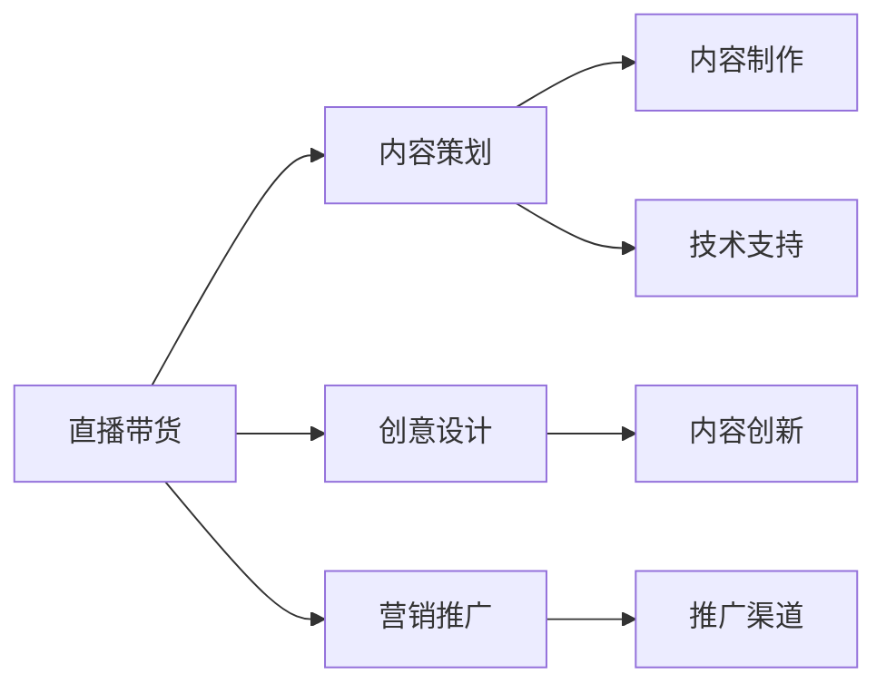

                 

## 1. 背景介绍

随着互联网的快速发展和直播电商的兴起，直播带货已成为一种高效的在线销售方式。不仅商家能够借助直播带货快速提升销售额，个人也能通过直播带货实现知识变现，将专业技能转化为经济收益。直播带货不仅可以提升个人品牌知名度，还能直接与观众互动，提供即时反馈，增加用户粘性。本文将详细探讨如何利用直播带货实现知识变现，包括直播平台的选择、内容策划与创意设计、营销推广策略等关键环节。

## 2. 核心概念与联系

### 2.1 核心概念概述

- **直播带货**：通过直播形式推荐和销售商品，主播利用其影响力和专业知识引导观众购买。
- **知识变现**：将个人专业知识或技能通过直播带货的形式转化为实际的商业收入。
- **内容策划**：直播过程中直播内容和流程的规划与设计，决定直播的吸引力和效果。
- **创意设计**：利用创意和独特视角，吸引观众注意力，提升直播观看率。
- **营销推广**：通过社交媒体、搜索引擎优化等方式，将直播内容推广给更广泛的受众。

### 2.2 核心概念原理和架构的 Mermaid 流程图



这个流程图展示了直播带货实现知识变现的基本流程：内容策划和创意设计是核心，技术支持保障流程顺利进行，营销推广将内容传播给更多受众，最终实现知识变现。

## 3. 核心算法原理 & 具体操作步骤

### 3.1 算法原理概述

直播带货的核心算法原理包括以下几个方面：

1. **用户行为分析**：通过分析观众的行为数据（如观看时长、互动频率等），优化直播内容。
2. **推荐系统**：根据用户的历史数据和偏好，实时推荐商品。
3. **互动管理**：通过实时互动（如问答、投票等），提升观众参与度。
4. **效果评估**：通过观众反馈和销售数据，评估直播效果，优化策略。

### 3.2 算法步骤详解

#### 3.2.1 用户行为分析

用户行为分析是直播带货的重要环节，通过分析观众的行为数据，可以优化直播内容，提高观看率和转化率。

1. **数据收集**：通过直播平台提供的数据接口，收集观众的行为数据，如观看时长、互动频率、停留位置等。
2. **数据处理**：对收集到的数据进行清洗和预处理，确保数据的准确性和完整性。
3. **数据分析**：使用统计分析方法，如聚类分析、回归分析等，分析观众的行为模式和偏好。
4. **内容优化**：根据分析结果，调整直播内容和互动形式，吸引更多观众。

#### 3.2.2 推荐系统

推荐系统是直播带货的核心技术之一，通过推荐系统，主播可以根据观众的偏好实时推荐商品。

1. **数据准备**：准备观众的历史行为数据和商品信息数据。
2. **模型训练**：选择合适的推荐算法（如协同过滤、基于内容的推荐等），对数据进行训练。
3. **实时推荐**：在直播过程中，根据观众的行为实时推荐商品。
4. **效果评估**：通过观众的点击率、购买率等指标，评估推荐系统的效果。

#### 3.2.3 互动管理

互动管理是提升观众参与度的重要手段。通过实时互动，主播可以与观众进行双向沟通，增加用户粘性。

1. **互动形式设计**：设计多种互动形式，如问答、投票、抽奖等，提高观众参与度。
2. **实时互动**：在直播过程中，及时响应观众的提问和评论，增加互动性。
3. **反馈收集**：通过问卷调查、评论反馈等方式，收集观众的意见和建议，持续改进。

#### 3.2.4 效果评估

效果评估是优化直播带货策略的关键环节，通过评估直播效果，可以不断优化内容和策略。

1. **关键指标定义**：定义关键指标，如观看率、互动率、转化率等。
2. **数据采集**：通过直播平台和第三方工具，采集关键指标数据。
3. **效果分析**：对采集到的数据进行分析，评估直播效果。
4. **策略优化**：根据分析结果，优化直播内容和互动形式，提升效果。

### 3.3 算法优缺点

直播带货的优点包括：

1. **即时互动**：主播可以与观众实时互动，增加观众参与度。
2. **高转化率**：通过主播的推荐和互动，观众更容易接受商品，转化率高。
3. **广泛传播**：通过社交媒体、搜索引擎优化等推广手段，直播内容可以迅速传播。

直播带货的缺点包括：

1. **技术门槛高**：需要掌握一定的技术知识，如流媒体技术、数据处理等。
2. **内容创意不足**：直播内容容易陷入同质化，缺乏创意。
3. **效果评估复杂**：直播效果的评估需要大量数据，分析过程复杂。

### 3.4 算法应用领域

直播带货可以应用于多种领域，如美妆、美食、家居、教育等，能够快速提升商品销售额，实现知识变现。

- **美妆领域**：主播通过展示化妆品的使用效果和心得，吸引观众购买。
- **美食领域**：主播介绍美食制作过程，展示食材选择和烹饪技巧，增加观众兴趣。
- **家居领域**：主播展示家居产品使用效果，介绍家居布置技巧。
- **教育领域**：主播教授专业知识，提供学习资源，吸引学生。

## 4. 数学模型和公式 & 详细讲解 & 举例说明

### 4.1 数学模型构建

直播带货的数学模型包括用户行为分析、推荐系统、互动管理和效果评估等多个方面。以下以推荐系统为例，介绍数学模型的构建。

假设主播向N个观众推荐M个商品，每个观众的偏好用向量$x \in R^M$表示，每个商品的特征用向量$y \in R^N$表示。则推荐系统的目标是最小化预测误差，优化公式为：

$$
\min_{\theta} \frac{1}{N} \sum_{i=1}^N \sum_{j=1}^M (x_i^j y_j - \theta^T(x_i))^2
$$

其中，$\theta$为模型的参数，$x_i^j$为观众对商品j的偏好程度。

### 4.2 公式推导过程

基于上述数学模型，推荐系统的优化过程包括数据准备、模型训练和实时推荐三个步骤。

1. **数据准备**：将观众的偏好数据和商品特征数据作为训练样本，构建训练集$D=\{(x_i,y_i)\}_{i=1}^N$。
2. **模型训练**：使用梯度下降等优化算法，对模型参数$\theta$进行优化，使得预测误差最小。
3. **实时推荐**：在直播过程中，根据观众的行为实时计算推荐概率，选择推荐商品。

### 4.3 案例分析与讲解

以美妆直播带货为例，介绍推荐系统的应用。

假设主播向观众推荐两款口红，观众的偏好向量为$x=[0.8, 0.5]$，商品的特征向量为$y=[0.9, 0.3]$。则推荐系统的预测概率为：

$$
\hat{y} = \theta^T(x) = [0.6, 0.4]
$$

基于预测概率，主播可以选择推荐两款口红，增加观众选择的多样性。

## 5. 项目实践：代码实例和详细解释说明

### 5.1 开发环境搭建

在直播带货的开发环境中，需要搭建直播平台、推荐系统和互动管理系统的开发环境。以下是开发环境搭建的详细步骤：

1. **直播平台选择**：选择适合的直播平台，如抖音、快手、淘宝直播等，注册账号，创建直播间。
2. **推荐系统开发**：使用Python和Scikit-learn等工具，搭建推荐系统，训练推荐模型。
3. **互动管理系统开发**：使用Python和Flask等工具，搭建互动管理系统，实现互动功能。
4. **环境测试**：在开发环境中进行全面测试，确保各项功能的正常运行。

### 5.2 源代码详细实现

以下是一个简单的直播带货推荐系统的源代码实现：

```python
import numpy as np
from sklearn.linear_model import SGDRegressor

class RecommendationSystem:
    def __init__(self):
        self.model = SGDRegressor()

    def train(self, X, Y):
        self.model.fit(X, Y)

    def predict(self, X):
        return self.model.predict(X)

    def recommend(self, user, items):
        user_preferences = np.array([user])
        item_features = np.array(items)
        predictions = self.predict(user_preferences.dot(item_features.T))
        top_items = np.argsort(predictions)[-5:]
        return top_items.tolist()

# 使用示例
recommendation_system = RecommendationSystem()
X = np.array([[0.8, 0.5], [0.5, 0.7]])
Y = np.array([0.9, 0.3])
recommendation_system.train(X, Y)
top_items = recommendation_system.recommend([0.8, 0.5], [0.9, 0.3])
print(top_items)
```

### 5.3 代码解读与分析

上述代码实现了一个简单的推荐系统，包括训练模型和推荐商品两个功能。在实际应用中，需要根据具体需求进行优化和扩展。

- **数据准备**：使用NumPy库准备数据，构建训练集和测试集。
- **模型训练**：使用SGDRegressor模型训练推荐系统。
- **推荐商品**：根据观众的偏好和商品特征，计算推荐概率，选择推荐商品。

## 6. 实际应用场景

### 6.1 智能家居

智能家居通过直播带货可以实现知识变现，主播可以展示智能家居产品的使用效果，介绍家居布置技巧。观众通过直播互动，了解产品特点，从而购买智能家居产品。

### 6.2 教育培训

教育培训领域可以通过直播带货进行知识变现，主播教授专业知识，提供学习资源，吸引学生。观众通过互动环节，提出学习问题，与主播进行实时沟通。

### 6.3 时尚穿搭

时尚穿搭领域也可以通过直播带货实现知识变现，主播介绍时尚穿搭技巧，展示穿搭效果，吸引观众购买时尚产品。观众通过直播互动，获取穿搭建议，提升穿搭水平。

### 6.4 未来应用展望

直播带货技术将不断发展和完善，未来可能出现以下趋势：

1. **虚拟现实技术**：结合虚拟现实技术，主播可以在虚拟环境中展示产品，增加观众沉浸感。
2. **人工智能技术**：通过人工智能技术，推荐系统将更加精准，互动管理将更加智能化。
3. **社交媒体优化**：通过社交媒体优化，直播内容将更容易传播，吸引更多观众。

## 7. 工具和资源推荐

### 7.1 学习资源推荐

直播带货的学习资源推荐如下：

1. **直播带货课程**：通过在线平台（如Coursera、Udemy等）学习直播带货相关课程，了解直播带货的基本原理和操作技巧。
2. **数据分析课程**：学习数据分析相关课程，掌握数据处理和分析方法，提高数据驱动决策的能力。
3. **推荐系统书籍**：阅读推荐系统相关的书籍，如《推荐系统实践》《推荐算法》等，了解推荐系统的原理和应用。
4. **社交媒体优化工具**：使用社交媒体优化工具，如Google Analytics、Hootsuite等，优化直播内容的传播效果。

### 7.2 开发工具推荐

直播带货的开发工具推荐如下：

1. **直播平台**：选择适合的直播平台，如抖音、快手、淘宝直播等，注册账号，创建直播间。
2. **推荐系统工具**：使用Python和Scikit-learn等工具，搭建推荐系统，训练推荐模型。
3. **互动管理工具**：使用Python和Flask等工具，搭建互动管理系统，实现互动功能。
4. **环境测试工具**：使用Jenkins、Docker等工具，进行环境测试，确保各项功能的正常运行。

### 7.3 相关论文推荐

直播带货的相关论文推荐如下：

1. **用户行为分析**：《A Survey on User Behavior Modeling in E-Commerce》
2. **推荐系统**：《Recommender Systems Handbook》
3. **互动管理**：《Interactive Learning in Recommendation Systems》
4. **效果评估**：《Evaluating Recommendation Algorithms in Online Environments》

## 8. 总结：未来发展趋势与挑战

### 8.1 研究成果总结

本文探讨了直播带货实现知识变现的基本原理和操作步骤，通过详细分析用户行为分析、推荐系统、互动管理和效果评估等关键环节，提出了直播带货的数学模型和算法实现方法。通过实践案例和代码示例，展示了直播带货的实际应用场景和技术工具。

### 8.2 未来发展趋势

直播带货的未来发展趋势如下：

1. **技术融合**：直播带货将与人工智能、虚拟现实等技术进一步融合，提升用户体验。
2. **内容创新**：直播内容将更加多样化，满足不同观众的需求。
3. **平台多元化**：直播带货将覆盖更多平台，实现多平台联动。

### 8.3 面临的挑战

直播带货面临的挑战如下：

1. **技术门槛高**：需要掌握一定的技术知识，如流媒体技术、数据处理等。
2. **内容创意不足**：直播内容容易陷入同质化，缺乏创意。
3. **效果评估复杂**：直播效果的评估需要大量数据，分析过程复杂。

### 8.4 研究展望

直播带货的未来研究展望如下：

1. **数据驱动决策**：通过数据驱动决策，优化直播内容和互动形式，提升效果。
2. **社交媒体优化**：通过社交媒体优化，直播内容将更容易传播，吸引更多观众。
3. **用户行为分析**：通过用户行为分析，优化直播策略，提高观众参与度。

## 9. 附录：常见问题与解答

### 9.1 常见问题

#### Q1: 如何选择适合的直播平台？

A: 选择适合的直播平台需要考虑平台的受众群体、直播功能、技术支持等因素。通过调研和测试，选择最适合自己内容的平台。

#### Q2: 如何设计互动形式？

A: 设计互动形式需要考虑观众的兴趣和参与度。可以通过问答、投票、抽奖等方式，增加观众的参与感。

#### Q3: 如何评估直播效果？

A: 评估直播效果需要定义关键指标，如观看率、互动率、转化率等。通过采集和分析数据，评估直播效果，优化策略。

### 9.2 解答

通过以上分析和解答，相信读者对直播带货实现知识变现有了更深入的理解和认识。直播带货不仅能够提升商品销售额，还能通过知识变现实现个人品牌价值提升。在实际应用中，需要结合具体需求，不断优化直播内容和策略，提升直播效果。

