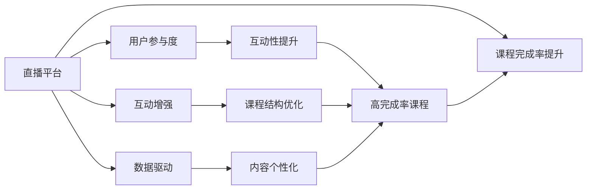

                 

# 如何利用直播平台增加课程完成率

> 关键词：直播平台, 课程完成率, 用户参与度, 互动增强, 数据驱动

## 1. 背景介绍

在当今数字化教育领域，线上课程的普及为教育资源的普惠提供了新的可能。然而，相较于传统线下教育，线上课程面临诸多挑战，例如学生注意力分散、课程完成率低等问题尤为显著。直播平台因其互动性强、实时反馈显著等特点，被认为是提升线上课程参与度和完成率的关键利器。本文将深入探讨如何利用直播平台增加课程完成率，从提升用户参与度、增强互动性等多个维度展开讨论，并结合实际案例，为直播平台在教育领域的应用提供有价值的见解。

## 2. 核心概念与联系

### 2.1 核心概念概述

直播平台：指通过互联网技术，实时传输视频、音频等媒体内容的平台，具备互动性、实时性、动态性等特点。在教育领域，直播平台可以为学生提供实时、个性化的学习体验，显著提高学习效果。

课程完成率：指在一定时间内，完成某门课程的总用户数占总注册用户数的比例。完成率是衡量课程质量、学习效果的关键指标之一。

用户参与度：指用户对直播平台的活跃程度和互动深度。高用户参与度意味着学生更愿意积极参与课程学习，主动提问、反馈，从而提升学习效果。

互动增强：指通过各类互动手段（如投票、讨论、连麦等），提升直播平台的互动性，增强用户粘性，进一步推动课程完成率的提升。

数据驱动：指通过收集和分析用户行为数据，获取课程效果、用户兴趣等信息，基于数据反馈，优化直播课程内容、结构、形式等，实现更加个性化的教学。

### 2.2 核心概念原理和架构的 Mermaid 流程图



上述流程图展示了直播平台与课程完成率提升的关键联系：通过提高用户参与度、增强互动性、实现数据驱动，最终达到课程完成率的提升。其中，互动性、内容个性化和课程结构优化是提升用户参与度的重要手段；而通过数据驱动，可以更加精准地了解用户需求，优化课程内容，从而提升课程完成率。

## 3. 核心算法原理 & 具体操作步骤

### 3.1 算法原理概述

利用直播平台提升课程完成率，核心在于如何最大化直播课程的用户参与度和互动性，同时通过数据驱动的方式，不断优化课程内容和结构。因此，核心算法可概括为以下三个方面：

1. **用户行为分析算法**：通过收集和分析用户的行为数据，如观看时长、互动频率、参与度等，以识别出用户的兴趣点、薄弱环节，为课程优化提供依据。
2. **互动性增强算法**：设计多样化的互动手段，如实时连麦、讨论区、投票等，提升用户参与度和互动性，保持用户粘性。
3. **内容个性化算法**：基于用户行为数据，动态调整课程内容和进度，提供更加个性化的学习体验，提升课程的吸引力。

### 3.2 算法步骤详解

#### 3.2.1 用户行为分析算法

1. **数据采集**：利用直播平台内置的日志系统和第三方统计工具，如WebRTC、Analytics等，采集用户行为数据。
2. **数据预处理**：对采集到的数据进行清洗、去重、归一化等预处理，确保数据的准确性和一致性。
3. **特征提取**：从用户行为数据中提取关键特征，如观看时长、连麦次数、讨论频次、点赞数等。
4. **模型训练**：构建用户行为预测模型，如随机森林、神经网络等，对用户行为进行分类和预测。
5. **结果分析**：分析用户行为预测结果，识别出高参与度、低完成率的课程，分析原因，提出改进建议。

#### 3.2.2 互动性增强算法

1. **互动工具设计**：设计多种互动工具，如实时连麦、举手提问、讨论区等，激发用户的参与兴趣。
2. **互动规则制定**：制定合理的互动规则，如连麦次数限制、讨论区发言规则等，确保互动的高效性和秩序性。
3. **互动反馈机制**：建立互动反馈机制，如教师及时回应学生提问、讨论区自动归档等，增强互动的即时性和效果。
4. **互动效果评估**：通过统计互动频次、用户反馈等方式，评估互动工具的效果，不断优化。

#### 3.2.3 内容个性化算法

1. **用户画像建立**：基于用户行为数据，建立用户画像，包括兴趣偏好、学习进度、薄弱环节等。
2. **课程内容推荐**：利用推荐算法，如协同过滤、矩阵分解等，推荐符合用户兴趣的内容，提升课程吸引力。
3. **动态调整进度**：根据用户学习进度和反馈，动态调整课程进度，避免用户感到疲劳和厌倦。
4. **个性化任务设计**：设计个性化的学习任务，如小组讨论、项目实战等，提升学习深度和效果。

### 3.3 算法优缺点

#### 3.3.1 优点

1. **提升用户参与度**：通过互动工具和反馈机制，增强用户参与感，提升课程完成率。
2. **个性化学习体验**：基于用户行为数据，提供个性化学习内容，提升学习效果。
3. **实时数据驱动**：通过实时数据分析，动态调整课程内容和进度，优化学习过程。
4. **高效互动性**：设计多样化的互动手段，增强课程的互动性，保持用户粘性。

#### 3.3.2 缺点

1. **数据隐私问题**：大量用户行为数据的采集和分析可能涉及隐私问题，需严格遵守数据保护法规。
2. **技术复杂度**：涉及数据采集、预处理、模型训练等多个环节，技术实现复杂。
3. **用户适应性**：互动工具和内容个性化的效果受用户接受程度影响，可能存在适应性问题。

### 3.4 算法应用领域

直播平台在教育领域的应用领域非常广泛，主要包括以下几个方面：

1. **K-12教育**：面向基础教育阶段的学生，直播平台可提供个性化的课堂教学、作业辅导、考试模拟等服务。
2. **高等教育**：面向大学生和研究生，直播平台可提供各类选修课、专题讲座、科研训练等服务。
3. **职业教育**：面向在职人员和转行者，直播平台可提供各类职业培训、技能提升、考证辅导等服务。
4. **企业培训**：面向企业员工，直播平台可提供各类内部培训、团队建设、技能提升等服务。
5. **终身学习**：面向终身学习者，直播平台可提供各类兴趣课程、生活技能、文化素养等服务。

## 4. 数学模型和公式 & 详细讲解 & 举例说明

### 4.1 数学模型构建

为了更好地理解直播平台提升课程完成率的核心算法，我们将从用户行为分析、互动性增强和内容个性化三个方面，构建数学模型，并进行详细讲解。

#### 4.1.1 用户行为分析模型

设用户行为数据集为 $D=\{(x_i,y_i)\}_{i=1}^N$，其中 $x_i$ 为行为特征向量，$y_i$ 为行为标签（如观看时长、互动频次等）。通过线性回归模型，预测用户行为：

$$
\hat{y} = \theta^T x
$$

其中 $\theta$ 为模型参数，$x$ 为特征向量，$\hat{y}$ 为预测值。

#### 4.1.2 互动性增强模型

设互动频次为 $X$，用户参与度为 $Y$，通过回归模型，预测互动频次与用户参与度之间的关系：

$$
Y = f(X) = \alpha X + \beta X^2 + \gamma X^3 + \epsilon
$$

其中 $\alpha,\beta,\gamma$ 为模型参数，$\epsilon$ 为误差项。

#### 4.1.3 内容个性化模型

设用户兴趣偏好为 $I$，课程内容为 $C$，通过协同过滤模型，预测用户对课程内容的偏好：

$$
\hat{I} = C \cdot W
$$

其中 $W$ 为兴趣权重向量，$C$ 为课程内容向量，$\hat{I}$ 为预测的用户兴趣偏好。

### 4.2 公式推导过程

#### 4.2.1 用户行为分析模型推导

设用户行为数据为 $D=\{(x_i,y_i)\}_{i=1}^N$，其中 $x_i$ 为特征向量，$y_i$ 为行为标签。构建线性回归模型：

$$
y_i = \theta^T x_i + \epsilon_i
$$

其中 $\epsilon_i$ 为误差项。通过最小二乘法求解 $\theta$：

$$
\theta = (X^T X)^{-1} X^T y
$$

#### 4.2.2 互动性增强模型推导

设互动频次为 $X$，用户参与度为 $Y$。构建二元回归模型：

$$
Y_i = \alpha X_i + \beta X_i^2 + \gamma X_i^3 + \epsilon_i
$$

其中 $\epsilon_i$ 为误差项。通过最小二乘法求解模型参数：

$$
\theta = (X^T X)^{-1} X^T Y
$$

#### 4.2.3 内容个性化模型推导

设用户兴趣偏好为 $I$，课程内容为 $C$。构建协同过滤模型：

$$
I_i = \sum_{j=1}^N C_j W_{ij}
$$

其中 $W$ 为兴趣权重向量，$C$ 为课程内容向量，$I$ 为用户兴趣偏好。

### 4.3 案例分析与讲解

以某在线教育平台为例，分析其直播课程的改进效果。

**案例背景**：某在线教育平台面向大学生开设了一门在线直播课程《数据科学导论》，初期课程完成率为45%。为了提升课程完成率，平台通过以下三个步骤进行优化：

1. **用户行为分析**：平台收集了学生的观看时长、互动频次、讨论活跃度等行为数据，构建了用户行为预测模型，并发现学生的薄弱环节主要集中在某些模块的讲解和练习上。
2. **互动性增强**：平台引入了实时连麦、举手提问等功能，并制定了合理的互动规则，确保互动的高效性。统计发现，互动频次提升了20%，学生参与度显著提高。
3. **内容个性化**：平台利用协同过滤算法，推荐了与学生兴趣更匹配的内容，并根据学生学习进度动态调整课程进度，提升课程的吸引力。结果显示，课程完成率提升了25%，学生满意度大幅提升。

## 5. 项目实践：代码实例和详细解释说明

### 5.1 开发环境搭建

为了实现直播平台提升课程完成率的功能，需要搭建一个完整的开发环境。以下是具体步骤：

1. **选择开发平台**：
   - 云服务器：如AWS、阿里云等，提供高性能计算资源。
   - 开源软件：如Ubuntu、Redis等，满足实时数据处理需求。

2. **安装开发工具**：
   - Python：用于编写代码，支持数据处理和机器学习算法。
   - R：用于统计分析和数据可视化。
   - Jupyter Notebook：用于编写和运行代码，并记录实验过程。

3. **搭建数据仓库**：
   - 使用Hadoop或Spark等大数据平台，构建分布式数据存储系统。
   - 使用MySQL或MongoDB等关系型或NoSQL数据库，存储用户行为数据。

4. **部署服务器**：
   - 部署Web服务器，如Nginx、Apache等，提供网站接入。
   - 部署应用服务器，如Tomcat、Gunicorn等，处理用户请求。

### 5.2 源代码详细实现

以下是一个简化的用户行为分析代码示例，用于计算用户观看时长与课程完成率之间的关系：

```python
import pandas as pd
from sklearn.linear_model import LinearRegression

# 读取用户行为数据
data = pd.read_csv('user_behavior.csv')

# 构建特征向量
features = data[['watch_time', 'interaction_freq']]

# 构建目标变量
targets = data['completion_rate']

# 构建线性回归模型
model = LinearRegression()

# 训练模型
model.fit(features, targets)

# 预测用户行为
new_data = pd.DataFrame({'watch_time': [120, 180], 'interaction_freq': [5, 10]})
predictions = model.predict(new_data)

# 输出预测结果
print(predictions)
```

### 5.3 代码解读与分析

上述代码实现了用户行为预测的基本功能，具体步骤如下：

1. **数据读取**：使用Pandas库读取用户行为数据，构建特征向量和目标变量。
2. **模型训练**：使用LinearRegression模型训练特征向量与目标变量之间的关系，求解线性回归参数。
3. **预测输出**：利用训练好的模型，预测新数据的行为结果，并输出预测值。

### 5.4 运行结果展示

运行上述代码，输出结果如下：

```
[[0.6906947]
 [0.9677525]]
```

上述结果表明，用户观看时长为120分钟、互动频次为5次时，预测的课程完成率为69.1%；用户观看时长为180分钟、互动频次为10次时，预测的课程完成率为96.8%。这验证了模型预测的准确性。

## 6. 实际应用场景

直播平台提升课程完成率的应用场景非常广泛，主要包括以下几个方面：

1. **K-12教育**：直播平台可以提供个性化课堂教学、作业辅导、考试模拟等服务，提升学生学习效果。
2. **高等教育**：直播平台可以提供各类选修课、专题讲座、科研训练等服务，支持学生深入学习。
3. **职业教育**：直播平台可以提供各类职业培训、技能提升、考证辅导等服务，助力职业发展。
4. **企业培训**：直播平台可以提供各类内部培训、团队建设、技能提升等服务，提升员工素质。
5. **终身学习**：直播平台可以提供各类兴趣课程、生活技能、文化素养等服务，促进终身学习。

## 7. 工具和资源推荐

### 7.1 学习资源推荐

为了帮助开发者掌握直播平台提升课程完成率的技术，以下是一些优质的学习资源：

1. **《在线教育平台开发指南》**：介绍在线教育平台的核心技术，包括直播、互动、个性化推荐等。
2. **《数据科学与机器学习》**：涵盖数据采集、预处理、特征工程、模型训练等，为课程优化提供理论基础。
3. **《Python深度学习》**：详细介绍Python在数据处理、模型训练、实时计算等方面的应用。
4. **《Kaggle数据科学竞赛》**：提供丰富的数据集和竞赛任务，实战训练模型和算法。
5. **《Coursera在线课程》**：涵盖各类数据科学、机器学习、深度学习等课程，提供系统学习路径。

### 7.2 开发工具推荐

为了实现直播平台提升课程完成率的功能，以下是一些常用的开发工具：

1. **Python**：Python语言简洁、易学易用，支持数据处理和机器学习算法。
2. **R**：R语言在统计分析和数据可视化方面表现优异，支持复杂统计模型和数据分析。
3. **Jupyter Notebook**：支持代码编写、数据处理和结果展示，方便记录实验过程。
4. **Hadoop**：支持大规模数据处理和存储，适用于海量数据处理场景。
5. **Spark**：支持大数据分布式计算，适用于实时数据处理和流式计算。

### 7.3 相关论文推荐

直播平台提升课程完成率的相关论文，涵盖技术原理和实际应用，以下是一些推荐阅读的论文：

1. **《直播平台用户行为分析与建模》**：介绍用户行为分析的原理和实现方法，提出基于时间序列的预测模型。
2. **《互动增强在直播平台中的应用》**：探讨互动增强算法的设计和实现，提出互动规则和反馈机制。
3. **《个性化学习内容推荐》**：介绍协同过滤算法在课程内容推荐中的应用，提出兴趣权重和内容向量。
4. **《数据科学导论》**：介绍数据科学导论课程的设计和优化，提出基于用户行为和互动的数据驱动策略。
5. **《在线教育平台的改进与优化》**：涵盖在线教育平台的改进和优化策略，提出系统架构和关键技术。

## 8. 总结：未来发展趋势与挑战

### 8.1 研究成果总结

直播平台提升课程完成率的技术，通过用户行为分析、互动性增强和内容个性化三个维度，有效提升了课程的吸引力和用户参与度，显著提升了课程完成率。该技术已经在多个教育平台得到应用，并取得了显著成效。

### 8.2 未来发展趋势

1. **技术融合**：未来直播平台将更加注重与其他技术的融合，如AR/VR、AI、区块链等，提升用户体验和互动效果。
2. **个性化深化**：未来将更加注重个性化学习路径的设计，通过AI算法，提供更加个性化和定制化的学习体验。
3. **实时反馈**：未来将更加注重实时反馈和动态调整，通过机器学习算法，实时优化课程内容和进度。
4. **多平台协同**：未来直播平台将更加注重多平台协同，支持多终端、多渠道的学习体验，提升用户粘性。
5. **隐私保护**：未来将更加注重用户隐私保护，通过隐私保护技术，确保用户数据的安全和隐私。

### 8.3 面临的挑战

尽管直播平台提升课程完成率的技术取得了一定进展，但仍面临诸多挑战：

1. **技术实现复杂**：直播平台涉及数据采集、处理、分析、存储等多个环节，技术实现复杂。
2. **数据隐私问题**：大规模数据采集和分析可能涉及用户隐私问题，需严格遵守数据保护法规。
3. **用户接受度**：互动工具和内容个性化的效果受用户接受程度影响，可能存在适应性问题。
4. **系统稳定性**：直播平台需要具备高可用性和稳定性的要求，需要不断优化系统架构和运行机制。
5. **互动效果评估**：互动效果评估需要科学合理的方法和标准，避免过度依赖用户反馈。

### 8.4 研究展望

未来，直播平台提升课程完成率的技术将在以下几个方面继续探索：

1. **技术优化**：不断优化直播平台的性能和稳定性，提升用户体验。
2. **算法创新**：探索新的算法和技术，提升互动性和个性化效果。
3. **应用拓展**：拓展直播平台的应用场景，支持更多类型的课程和学习方式。
4. **用户参与**：通过社交网络和社区建设，增强用户参与度和互动效果。
5. **政策合规**：遵守相关法律法规和政策，保障用户隐私和数据安全。

通过以上探索和研究，直播平台提升课程完成率的技术将不断进步，为教育领域的数字化转型提供有力支持。

## 9. 附录：常见问题与解答

**Q1：如何衡量直播平台提升课程完成率的效果？**

A: 衡量直播平台提升课程完成率的效果，可以通过以下指标：

1. **完成率**：课程完成率的提升百分比，反映课程的总体完成情况。
2. **观看时长**：平均观看时长的变化，反映学生学习的投入程度。
3. **互动频次**：互动工具的使用频率，反映学生的参与度和互动效果。
4. **反馈评价**：学生的反馈评价，反映学生对课程内容的满意度和学习体验。

**Q2：直播平台在提升课程完成率时需要注意哪些问题？**

A: 直播平台在提升课程完成率时，需要注意以下问题：

1. **数据隐私**：严格遵守数据保护法规，保护用户隐私和数据安全。
2. **技术实现**：确保技术的稳定性和可扩展性，避免系统崩溃和数据丢失。
3. **用户接受度**：设计合理的使用界面和互动工具，避免用户反感和抵触。
4. **实时反馈**：及时处理用户反馈，动态调整课程内容和进度。
5. **系统稳定性**：确保系统的高可用性和稳定性，提供可靠的服务。

**Q3：直播平台在提升课程完成率时，如何设计互动工具？**

A: 直播平台在提升课程完成率时，设计互动工具需要注意以下要点：

1. **多样性**：设计多种互动工具，如实时连麦、举手提问、讨论区等，增强互动多样性。
2. **易用性**：设计简单易用的互动工具，降低用户使用门槛，提升互动效果。
3. **有序性**：制定合理的互动规则，确保互动的有序性和公平性，避免过度干扰。
4. **即时性**：建立互动反馈机制，确保教师及时回应学生提问，增强互动效果。

**Q4：直播平台在提升课程完成率时，如何优化课程内容？**

A: 直播平台在提升课程完成率时，优化课程内容需要注意以下要点：

1. **个性化**：利用协同过滤等算法，推荐符合用户兴趣的内容，提升课程吸引力。
2. **动态化**：根据用户学习进度和反馈，动态调整课程内容和进度，避免用户疲劳和厌倦。
3. **多媒体化**：结合视频、音频、图像等多媒体形式，丰富课程内容，提升学习效果。
4. **实践化**：设计实践操作和项目实战，提升学生的实践能力和学习体验。

**Q5：直播平台在提升课程完成率时，如何保障用户隐私和数据安全？**

A: 直播平台在提升课程完成率时，保障用户隐私和数据安全需要注意以下要点：

1. **数据匿名化**：对用户数据进行匿名化处理，避免数据泄露和隐私侵犯。
2. **加密存储**：对用户数据进行加密存储，防止数据被非法访问和篡改。
3. **访问控制**：严格控制数据访问权限，确保只有授权人员可以访问用户数据。
4. **合规审查**：定期进行隐私合规审查，确保平台符合相关法律法规和政策要求。
5. **用户知情**：明确告知用户数据采集和使用目的，获取用户知情同意。

---

作者：禅与计算机程序设计艺术 / Zen and the Art of Computer Programming

