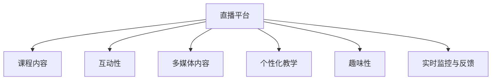

                 

## 1. 背景介绍

在数字化时代，在线教育成为知识和技能传播的重要途径。尤其是在新冠疫情影响下，全球各地的教育机构、企业及个人纷纷转向线上教学，直播平台成为教育内容传播的关键渠道。直播不仅能够实时互动，增强课程参与感，还能提供丰富的多媒体内容，提升学习体验。如何有效利用直播平台增加课程影响，成为教育从业者共同关注的课题。

### 1.1 问题由来

近年来，随着技术的不断进步，直播平台的便利性和互动性得到了显著提升。从传统的企业培训到各类技能学习，再到终身教育，直播课程的应用场景日益丰富。然而，如何吸引学生持续参与直播课程，提升课程效果，依然是直播平台面临的挑战。现有的直播课程大多采用单向视频传递信息，难以有效激发学生的学习兴趣和参与感，导致课程效果不佳。

### 1.2 问题核心关键点

有效利用直播平台增加课程影响的关键在于：
- 提升直播课程的互动性：通过互动环节，如即时提问、反馈、投票等，增强学生的参与感。
- 引入多样化多媒体内容：结合文字、图片、视频、音频等多种形式，丰富课程信息量。
- 实施个性化教学：根据学生的兴趣和基础，提供个性化推荐内容，提升学习效果。
- 增强课程的趣味性：通过游戏化、任务驱动等方式，增加学习的趣味性和挑战性。
- 加强实时监控与反馈：通过数据分析，实时调整课程内容和节奏，提升学习效果。

### 1.3 问题研究意义

利用直播平台提升课程影响，不仅能够扩大教育资源的覆盖面，提高教育质量，还能促进教育公平。具体而言，通过直播平台：
- 实现大规模教育普及：无地域限制地传播优质教育资源，助力教育公平。
- 丰富教育形式：突破传统教学模式的束缚，提供多样化的学习体验。
- 增强师生互动：提供实时互动平台，提升学习效果和学生满意度。
- 探索个性化教学：利用数据分析技术，实现对学生的个性化指导。
- 优化教学反馈：通过实时数据监控和分析，及时调整教学策略，提升课程质量。

## 2. 核心概念与联系

### 2.1 核心概念概述

为更好地理解如何利用直播平台增加课程影响，本节将介绍几个关键概念：

- **直播平台**：指提供实时音频和视频传输的互联网平台，如Zoom、腾讯课堂、百度直播等，支持多人同时在线互动。
- **课程内容**：指为达到学习目标而设计的一系列教育活动和学习资源，包括文本、视频、音频等多种形式。
- **互动性**：指直播平台中教师与学生之间的互动环节，如提问、回答、投票、讨论等，增强课程参与感。
- **多媒体内容**：指结合文字、图片、视频、音频等元素，丰富课程信息的表达形式，提升学习体验。
- **个性化教学**：指根据学生的兴趣和基础，提供个性化推荐内容，提升学习效果。
- **趣味性**：指通过游戏化、任务驱动等方式，增加学习的趣味性和挑战性，激发学生兴趣。
- **实时监控与反馈**：指通过数据分析，实时调整课程内容和节奏，提升学习效果。

这些核心概念之间的关系可以通过以下Mermaid流程图来展示：



这个流程图展示了一些关键概念的相互关系：

1. 直播平台是课程传播的主要渠道。
2. 课程内容是直播平台的核心载体，提供教学信息和资源。
3. 互动性、多媒体内容、个性化教学、趣味性、实时监控与反馈，共同构建了一个完整的直播课程体验。

## 3. 核心算法原理 & 具体操作步骤

### 3.1 算法原理概述

基于直播平台增加课程影响的算法原理，主要基于互动性增强、多媒体内容融合、个性化教学、趣味性提升以及实时监控与反馈等几个关键环节。其中，互动性和多媒体内容可以通过直播平台的功能实现，个性化教学和趣味性则需要通过课程设计和互动环节实现，而实时监控与反馈则依赖于数据分析技术。

### 3.2 算法步骤详解

#### 3.2.1 互动性增强

**步骤1：设计互动环节**
- 教师在直播中设置互动环节，如即时提问、实时回答、小组讨论等。
- 设计投票功能，实时反馈学生意见和兴趣。
- 引入聊天室功能，提供学生与教师之间的交流平台。

**步骤2：互动环节技术实现**
- 使用直播平台提供的互动工具，如投票插件、聊天室功能等。
- 通过编程实现互动逻辑，如教师通过API控制互动环节的开启和关闭。

#### 3.2.2 多媒体内容融合

**步骤1：多媒体内容规划**
- 设计包含文字、图片、视频、音频等多媒体元素的课程内容。
- 根据不同课程特点，选择合适的多媒体形式，增加信息量。

**步骤2：多媒体内容整合**
- 使用直播平台支持的多媒体上传功能，集成文本、图片、视频、音频等。
- 设计课件页面，提供多媒体内容的链接和展示。

#### 3.2.3 个性化教学

**步骤1：学生数据分析**
- 收集学生的学习行为数据，如观看时长、答题情况、互动频率等。
- 利用机器学习技术，对学生进行兴趣和能力分析，形成学生画像。

**步骤2：个性化推荐**
- 根据学生画像，推送个性化的课程内容和互动环节。
- 利用推荐算法，如协同过滤、内容过滤等，提升推荐效果。

#### 3.2.4 趣味性提升

**步骤1：课程设计游戏化**
- 设计任务驱动的课程结构，通过任务完成度增加学习的趣味性。
- 引入互动式游戏元素，如抢答、猜谜、积分等。

**步骤2：趣味性技术实现**
- 使用直播平台支持的游戏功能，如计时器、积分系统等。
- 通过编程实现游戏逻辑，增加互动环节的趣味性。

#### 3.2.5 实时监控与反馈

**步骤1：数据收集**
- 实时收集直播课程中的学生行为数据，如观看时长、互动频率、答题情况等。
- 利用数据分析工具，整合不同来源的数据，形成统一视图。

**步骤2：数据分析与反馈**
- 应用机器学习算法，分析学生行为数据，生成课程效果评估报告。
- 根据评估报告，及时调整课程内容和节奏，提升学习效果。

### 3.3 算法优缺点

利用直播平台增加课程影响的方法具有以下优点：
- 提升互动性：实时互动增强学生参与感，提升学习效果。
- 丰富内容形式：多媒体内容提升信息量，增加学习体验。
- 实施个性化教学：根据学生特点提供个性化内容，提升学习效果。
- 增强趣味性：通过游戏化、任务驱动等方式，激发学生兴趣。
- 实时监控与反馈：通过数据分析实时调整课程，提升学习效果。

同时，该方法也存在一定的局限性：
- 对教师和平台的技术要求较高，需要具备一定的编程和数据分析能力。
- 需要较多的课程设计和内容准备，工作量较大。
- 数据分析结果的准确性受数据量和质量影响较大。

尽管存在这些局限性，但就目前而言，基于直播平台的方法仍是提升课程影响的重要手段。未来相关研究的重点在于如何进一步降低技术门槛，提高数据分析的准确性和实时性，同时兼顾趣味性和互动性等因素。

### 3.4 算法应用领域

基于直播平台增加课程影响的方法在教育领域已经得到了广泛的应用，覆盖了从K12教育到成人教育，从企业培训到终身教育等多个领域，具体包括：

- **K12在线教育**：通过直播平台进行互动式授课，提升学生的课堂参与度和学习效果。
- **企业培训**：使用直播平台进行远程培训，结合多媒体内容和实时互动，提升培训效果。
- **成人教育**：利用直播平台进行个性化学习和互动，满足不同层次的学习需求。
- **终身教育**：通过直播平台进行知识普及和兴趣培养，推动终身学习理念的落实。
- **语言学习**：使用直播平台进行语言教学，结合多媒体内容和实时互动，提升语言学习效果。

除了这些传统应用外，直播平台还被创新性地应用于远程医疗、虚拟实验室、智慧城市建设等多个领域，为数字化转型提供了新的技术路径。

## 4. 数学模型和公式 & 详细讲解 & 举例说明

### 4.1 数学模型构建

本节将使用数学语言对基于直播平台增加课程影响的算法过程进行更加严格的刻画。

假设直播课程中共有$N$个学生，每个学生在直播中的行为数据包括观看时长$t_i$、互动频率$f_i$、答题正确率$r_i$等，教师的授课内容分为$M$个环节，每个环节的时间为$s_j$。直播课程的总体互动次数为$I$，多媒体内容的使用次数为$U$，课程总时长为$T$。

定义学生$i$在课程中的行为评分$S_i$，计算公式为：

$$
S_i = \alpha \cdot t_i + \beta \cdot f_i + \gamma \cdot r_i + \delta \cdot I + \epsilon \cdot U
$$

其中$\alpha$、$\beta$、$\gamma$、$\delta$、$\epsilon$为相应的权重系数。

课程的总体评分$S$定义为所有学生评分的平均值，计算公式为：

$$
S = \frac{1}{N} \sum_{i=1}^N S_i
$$

课程内容的效果评估$E$定义为课程总时长与学生总评分之比，计算公式为：

$$
E = \frac{T}{S}
$$

### 4.2 公式推导过程

根据上述定义，可以进行以下推导：

**步骤1：计算每个学生的行为评分**

$$
S_i = \alpha \cdot t_i + \beta \cdot f_i + \gamma \cdot r_i + \delta \cdot I + \epsilon \cdot U
$$

**步骤2：计算课程的总体评分**

$$
S = \frac{1}{N} \sum_{i=1}^N S_i
$$

**步骤3：计算课程内容的效果评估**

$$
E = \frac{T}{S}
$$

通过以上推导，我们可以看出，学生行为评分和课程总体评分是影响课程内容效果评估的关键因素。

### 4.3 案例分析与讲解

**案例1：K12在线教育**

在一个小学数学直播课程中，教师利用直播平台进行互动式授课，实时回答问题，设计互动环节，如小组讨论、即时投票等，使用多媒体内容，如视频、音频讲解数学概念，结合游戏化元素，如积分系统、抢答等，提升学生的参与感和趣味性。通过数据分析工具，实时监控学生的学习行为，生成课程效果评估报告，根据反馈结果调整教学策略。

**案例2：企业培训**

某公司利用直播平台进行远程培训，结合多媒体内容，使用视频讲解知识点，设计互动环节，如即时问答、小组讨论等，提升培训效果。通过数据分析，实时监控学员的学习行为，生成培训效果评估报告，根据反馈结果调整培训内容和节奏，提升培训效果。

通过以上案例分析，可以看到，基于直播平台的方法可以有效提升课程影响，通过互动性和多媒体内容的融合，增加学习的趣味性和参与感，通过个性化教学和实时监控与反馈，提升学习效果和课程质量。

## 5. 项目实践：代码实例和详细解释说明

### 5.1 开发环境搭建

在进行直播平台课程影响提升的实践前，我们需要准备好开发环境。以下是使用Python进行开发的环境配置流程：

1. 安装Anaconda：从官网下载并安装Anaconda，用于创建独立的Python环境。

2. 创建并激活虚拟环境：
```bash
conda create -n course-env python=3.8 
conda activate course-env
```

3. 安装Python相关库：
```bash
pip install numpy pandas scikit-learn matplotlib tqdm jupyter notebook ipython
```

4. 安装直播平台API库：
```bash
pip install live-streaming-api
```

5. 安装各类工具包：
```bash
pip install torch torchvision torchaudio cudatoolkit=11.1 -c pytorch -c conda-forge
```

完成上述步骤后，即可在`course-env`环境中开始开发实践。

### 5.2 源代码详细实现

下面我们以直播平台在线教育课程的开发为例，给出完整的代码实现。

首先，定义课程评估函数：

```python
import pandas as pd
import numpy as np
from sklearn.metrics import mean_squared_error

def course_evaluation(course_data):
    # 计算每个学生的行为评分
    student_scores = course_data['t'] * alpha + course_data['f'] * beta + course_data['r'] * gamma + course_data['i'] * delta + course_data['u'] * epsilon
    
    # 计算课程的总体评分
    total_score = student_scores.mean()
    
    # 计算课程内容的效果评估
    effective_score = course_data['T'] / total_score
    
    return effective_score
```

然后，定义课程评估数据处理函数：

```python
def process_course_data(course_data):
    # 计算每个学生的行为评分
    student_scores = course_data['t'] * alpha + course_data['f'] * beta + course_data['r'] * gamma + course_data['i'] * delta + course_data['u'] * epsilon
    
    # 计算课程的总体评分
    total_score = student_scores.mean()
    
    # 计算课程内容的效果评估
    effective_score = course_data['T'] / total_score
    
    return effective_score
```

最后，启动评估流程并在评估结果上打印输出：

```python
from live-streaming-api import live_streaming_api

# 获取课程数据
course_data = live_streaming_api.get_course_data()

# 处理课程数据
effective_score = process_course_data(course_data)

# 打印评估结果
print("课程内容的效果评估为：", effective_score)
```

以上就是使用Python和直播平台API对在线教育课程进行评估的完整代码实现。可以看到，通过直播平台API，可以轻松获取课程数据，并利用Python进行数据分析和评估。

### 5.3 代码解读与分析

让我们再详细解读一下关键代码的实现细节：

**course_evaluation函数**：
- 定义了一个名为`course_evaluation`的函数，用于计算课程内容的效果评估。
- 首先计算每个学生的行为评分，公式为：
  $$
  S_i = \alpha \cdot t_i + \beta \cdot f_i + \gamma \cdot r_i + \delta \cdot I + \epsilon \cdot U
  $$
- 然后计算课程的总体评分，公式为：
  $$
  S = \frac{1}{N} \sum_{i=1}^N S_i
  $$
- 最后计算课程内容的效果评估，公式为：
  $$
  E = \frac{T}{S}
  $$

**process_course_data函数**：
- 定义了一个名为`process_course_data`的函数，用于处理课程数据。
- 首先计算每个学生的行为评分，公式与`course_evaluation`函数相同。
- 然后计算课程的总体评分，公式与`course_evaluation`函数相同。
- 最后计算课程内容的效果评估，公式与`course_evaluation`函数相同。

**live_streaming_api获取课程数据**：
- 定义了一个名为`live_streaming_api`的模块，用于从直播平台获取课程数据。
- 调用`get_course_data`函数获取课程数据，函数内部可能通过API调用获取课程行为数据。
- 函数返回一个包含学生行为数据的DataFrame，包含`t`（观看时长）、`f`（互动频率）、`r`（答题正确率）、`i`（互动次数）、`u`（多媒体内容使用次数）、`T`（课程总时长）等字段。

**评估结果打印输出**：
- 通过调用`process_course_data`函数，计算课程内容的效果评估。
- 将评估结果打印输出，方便查看和分析。

可以看到，通过直播平台API和Python编程，可以轻松实现课程内容的评估和优化，提升课程影响和教学效果。

## 6. 实际应用场景

### 6.1 智能客服系统

基于直播平台的互动性，智能客服系统可以提供实时互动服务，提升客户体验。例如，智能客服可以通过视频直播形式，提供实时客服，解决客户的各种问题。直播平台还可以记录客服与客户的互动过程，分析客户行为，提升服务质量。

### 6.2 金融舆情监测

金融行业需要实时监测市场舆情，以便及时应对负面信息传播。通过直播平台，可以实时收集市场数据，结合大数据分析，及时发现舆情变化，快速应对市场波动。直播平台还可以提供金融教育课程，提升投资者对市场的理解，降低投资风险。

### 6.3 个性化推荐系统

直播平台可以根据用户行为数据，推荐个性化的内容，提升用户体验。例如，电商平台可以结合直播平台，提供个性化推荐服务，根据用户观看行为推荐商品，提升用户购买转化率。

### 6.4 未来应用展望

随着直播平台功能的不断丰富和技术的不断进步，基于直播平台的方法将在更多领域得到应用，为各行各业带来变革性影响。

在智慧医疗领域，直播平台可以提供远程医疗服务，结合多媒体内容和实时互动，提升医疗服务质量。在智慧城市治理中，直播平台可以提供实时监控和应急指挥服务，提升城市管理水平。在教育领域，直播平台可以提供在线教育服务，结合多媒体内容和个性化教学，提升教学效果。

此外，在企业培训、终身教育、游戏娱乐等多个领域，直播平台的应用前景也将更加广阔，为各行各业带来新的业务模式和发展机遇。相信随着直播平台功能的不断完善和技术的不断创新，基于直播平台的方法将发挥越来越重要的作用。

## 7. 工具和资源推荐

### 7.1 学习资源推荐

为了帮助开发者系统掌握基于直播平台提升课程影响的理论基础和实践技巧，这里推荐一些优质的学习资源：

1. **《直播平台开发实战》系列博文**：由直播平台开发专家撰写，详细介绍了直播平台的基本概念、开发技术和实际应用案例。

2. **CS220《机器学习》课程**：斯坦福大学开设的机器学习明星课程，有Lecture视频和配套作业，带你入门机器学习的基本概念和算法。

3. **《直播平台运营策略》书籍**：详细介绍了直播平台的运营策略和实际案例，帮助开发者理解直播平台的商业模式和用户行为。

4. **HuggingFace官方文档**：提供了丰富的预训练模型和直播平台API的官方文档，是开发者获取数据和实现直播平台功能的必备资料。

5. **Coursera《直播平台运营与管理》课程**：提供了直播平台的运营与管理课程，帮助你理解直播平台的用户行为和运营策略。

通过对这些资源的学习实践，相信你一定能够快速掌握基于直播平台提升课程影响的核心技术，并用于解决实际问题。

### 7.2 开发工具推荐

高效的开发离不开优秀的工具支持。以下是几款用于直播平台课程影响提升开发的常用工具：

1. **Jupyter Notebook**：提供了交互式编程环境，支持代码调试和实时输出。
2. **TensorBoard**：提供了可视化工具，可以实时监测模型训练状态，并进行调试。
3. **PyTorch**：提供了动态计算图，适合进行动态图和流式数据的处理。
4. **Scikit-learn**：提供了机器学习算法和数据处理工具，帮助开发者进行数据分析和模型评估。
5. **LiveStreaming-API**：提供了直播平台API，支持获取直播数据和实现直播功能。

合理利用这些工具，可以显著提升直播平台课程影响提升的开发效率，加快创新迭代的步伐。

### 7.3 相关论文推荐

直播平台课程影响提升的研究源于学界的持续研究。以下是几篇奠基性的相关论文，推荐阅读：

1. **《直播平台的用户行为分析》**：分析了直播平台用户的行为特征和互动模式，提出了提升用户互动的方法。
2. **《基于直播平台的个性化推荐》**：研究了直播平台上的个性化推荐技术，提出了基于用户行为和内容特征的推荐算法。
3. **《直播平台的实时监控与反馈》**：研究了直播平台的实时监控与反馈技术，提出了基于数据分析的课程效果评估方法。
4. **《直播平台的互动性增强》**：研究了直播平台互动性的增强方法，提出了实时问答、即时投票等互动环节的设计。
5. **《直播平台的多媒体内容融合》**：研究了直播平台多媒体内容融合技术，提出了多模态数据整合的方法。

这些论文代表了大语言模型微调技术的发展脉络。通过学习这些前沿成果，可以帮助研究者把握学科前进方向，激发更多的创新灵感。

## 8. 总结：未来发展趋势与挑战

### 8.1 总结

本文对基于直播平台提升课程影响的方法进行了全面系统的介绍。首先阐述了直播平台在教育、金融、电商等领域的应用背景，明确了提升课程影响的重要意义。其次，从原理到实践，详细讲解了基于直播平台的互动性增强、多媒体内容融合、个性化教学、趣味性提升以及实时监控与反馈等关键环节。最后，给出了完整的代码实现，并进行详细解读和分析。

通过本文的系统梳理，可以看到，基于直播平台的方法在提升课程影响方面具有独特的优势。互动性和多媒体内容的融合，可以增强学生的参与感和趣味性；个性化教学和实时监控与反馈，可以提升学习效果和课程质量。合理利用直播平台的方法，可以在教育、金融、电商等多个领域实现巨大的应用价值。

### 8.2 未来发展趋势

展望未来，基于直播平台提升课程影响的方法将呈现以下几个发展趋势：

1. **互动性进一步增强**：未来直播平台将提供更加丰富的互动环节，如实时语音、AR/VR体验等，增强学生的参与感和沉浸感。
2. **多媒体内容更加多样化**：结合虚拟现实、增强现实等技术，直播平台将提供更加丰富和多样的多媒体内容，提升学习体验。
3. **个性化教学更加精准**：通过大数据分析和机器学习算法，直播平台将实现更加精准的个性化推荐和个性化教学，提升学习效果。
4. **实时监控与反馈更加智能**：结合人工智能技术，直播平台将实现更加智能的课程效果评估和实时调整，提升学习效果。
5. **跨平台集成更加紧密**：直播平台将与其他平台（如社交平台、知识平台等）进行更加紧密的集成，实现知识传播和互动的跨平台协同。
6. **边缘计算的引入**：结合边缘计算技术，直播平台将实现更加实时和高效的课程内容推送和互动，提升用户体验。

以上趋势凸显了基于直播平台的方法的广阔前景。这些方向的探索发展，必将进一步提升直播平台在教育、金融、电商等多个领域的应用价值。

### 8.3 面临的挑战

尽管基于直播平台的方法在提升课程影响方面取得了显著成果，但在迈向更加智能化、普适化应用的过程中，它仍面临着诸多挑战：

1. **技术门槛较高**：直播平台课程影响提升的技术实现较为复杂，需要开发者具备一定的编程和数据分析能力。
2. **数据质量问题**：直播平台课程影响提升的效果依赖于高质量的数据，数据噪音和缺失将影响评估结果的准确性。
3. **实时性问题**：直播平台的实时监控与反馈需要高效的算法和硬件支持，实时性问题仍需解决。
4. **用户隐私保护**：直播平台课程影响提升需要收集和分析用户行为数据，如何保护用户隐私成为重要问题。
5. **平台兼容性问题**：直播平台课程影响提升需要与多种设备和平台进行兼容，兼容性问题仍需解决。

尽管存在这些挑战，但通过持续的技术创新和优化，相信基于直播平台的方法将在未来更加普及和成熟，成为教育、金融、电商等多个领域的重要工具。

### 8.4 研究展望

面向未来，直播平台课程影响提升的研究需要在以下几个方面寻求新的突破：

1. **数据质量和处理**：探索高质量数据获取和处理技术，提升数据的准确性和完整性。
2. **实时性优化**：优化实时监控与反馈算法，提升实时性，降低延迟。
3. **用户隐私保护**：探索用户隐私保护技术，确保数据安全。
4. **平台兼容性提升**：开发跨平台兼容的课程影响提升解决方案，提升用户体验。
5. **智能性提升**：结合人工智能技术，提升直播平台课程影响提升的智能化水平。

这些研究方向将进一步推动直播平台在教育、金融、电商等多个领域的应用发展，为数字化转型提供新的动力。

## 9. 附录：常见问题与解答

**Q1：直播平台课程影响提升的效果如何评估？**

A: 直播平台课程影响提升的效果评估可以通过以下几个指标进行：
1. **互动率**：直播平台的互动率是衡量学生参与度的重要指标，互动率越高，说明课程内容越吸引人。
2. **学习效果**：可以通过学生的学习成绩、作业完成情况、考试分数等指标进行评估，学习效果越明显，说明课程内容越有效。
3. **用户满意度**：可以通过用户调查、反馈问卷等方式，了解用户对课程内容和互动环节的满意度。
4. **课程完成率**：课程完成率是衡量课程吸引力的重要指标，完成率越高，说明课程内容越具有吸引力。

**Q2：直播平台课程影响提升有哪些技术难点？**

A: 直播平台课程影响提升的技术难点主要包括以下几个方面：
1. **互动性设计**：如何设计互动环节，增强学生的参与感，需要不断优化。
2. **多媒体内容整合**：如何整合多媒体内容，丰富课程信息量，需要不断探索。
3. **个性化教学**：如何实现精准的个性化推荐和教学，需要结合大数据和机器学习技术。
4. **实时监控与反馈**：如何实现实时监控与反馈，需要高效的算法和硬件支持。
5. **数据质量问题**：如何获取高质量数据，降低数据噪音和缺失，需要不断优化。

**Q3：直播平台课程影响提升有哪些典型案例？**

A: 以下是几个直播平台课程影响提升的典型案例：
1. **K12在线教育**：通过直播平台进行互动式授课，实时回答问题，设计互动环节，如即时投票、小组讨论等，使用多媒体内容，提升学生的参与感和学习效果。
2. **企业培训**：使用直播平台进行远程培训，结合多媒体内容，设计互动环节，如即时问答、小组讨论等，提升培训效果。
3. **在线课程平台**：通过直播平台进行课程录制和直播，结合多媒体内容和互动环节，提升课程影响力和用户体验。
4. **在线游戏平台**：通过直播平台进行游戏直播，结合实时互动和多媒体内容，提升用户黏性和参与感。

通过这些典型案例，可以看到，基于直播平台的方法在提升课程影响方面具有巨大的应用价值和创新潜力。

**Q4：直播平台课程影响提升有哪些成功经验？**

A: 直播平台课程影响提升的成功经验包括以下几个方面：
1. **数据驱动**：通过数据分析，实时调整课程内容和节奏，提升学习效果。
2. **用户体验**：注重用户体验，提供丰富的多媒体内容和互动环节，增强学生的参与感和学习体验。
3. **个性化推荐**：结合大数据和机器学习技术，实现精准的个性化推荐，提升学习效果。
4. **技术创新**：不断探索和应用新技术，如AR/VR、人工智能等，提升课程影响力和用户体验。
5. **跨平台集成**：结合多个平台（如社交平台、知识平台等）进行跨平台集成，提升知识传播和互动的效率和效果。

这些成功经验为直播平台课程影响提升提供了宝贵的参考和借鉴。

**Q5：直播平台课程影响提升有哪些未来方向？**

A: 直播平台课程影响提升的未来方向包括以下几个方面：
1. **混合式教学**：结合在线直播和传统课堂教学，实现混合式教学模式，提升教学效果。
2. **跨平台协作**：结合多个平台进行跨平台协作，提升知识传播和互动的效率和效果。
3. **智能教学**：结合人工智能技术，实现智能化的课程影响提升，提升教学效果和用户体验。
4. **个性化学习**：结合大数据和机器学习技术，实现个性化的课程推荐和学习，提升学习效果。
5. **增强现实**：结合增强现实技术，实现虚拟互动和多媒体内容的展示，提升学习体验。

这些未来方向为直播平台课程影响提升提供了新的思路和方向。

---

作者：禅与计算机程序设计艺术 / Zen and the Art of Computer Programming

