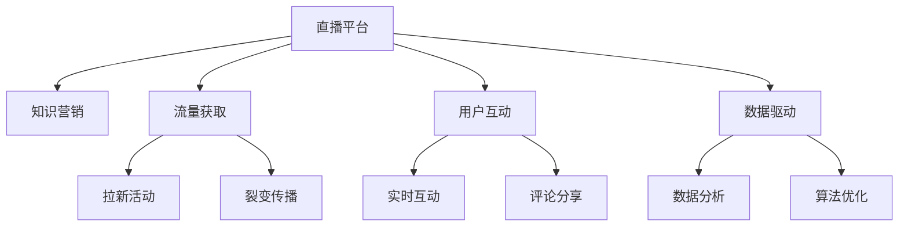

                 

# 如何利用直播平台进行知识营销

> 关键词：直播平台,知识营销,流量获取,用户互动,数据驱动

## 1. 背景介绍

### 1.1 问题由来
随着互联网技术的不断进步和社交媒体的兴起，直播平台逐渐成为用户获取信息和进行社交互动的新宠。尤其在疫情大流行背景下，人们的线上活动增加，直播平台的用户规模和活跃度显著上升。据统计，2021年全球直播用户已超过20亿，占互联网用户总量的近30%。

直播平台的繁荣也催生了知识营销的新模式。知识营销是指通过提供有价值的信息、知识和见解，吸引用户关注，进而建立品牌信任，促进产品销售或服务的推广。相比传统广告，知识营销更能满足用户的知识需求，提升用户参与度，从而达到更好的市场效果。

### 1.2 问题核心关键点
直播平台以其互动性强、传播速度快、覆盖面广等优势，成为知识营销的新舞台。直播平台上的知识营销具有以下几个关键点：

- 实时互动：直播的实时性使得观众和主播能够即时互动，增强了信息传递的即时性和互动性。
- 视频化展示：相较于文字和图片，视频形式更直观、生动，能够更好地吸引和保持用户注意力。
- 高用户粘性：直播平台往往提供丰富的社交功能，用户可以在直播间内进行点赞、评论、分享等操作，提升用户粘性。
- 数据驱动：直播平台能够实时收集用户行为数据，通过数据分析优化营销策略。

利用直播平台进行知识营销，不仅能提升品牌知名度，还能促进用户忠诚度，增加销售转化。以下将详细阐述直播平台知识营销的原理和实践方法。

## 2. 核心概念与联系

### 2.1 核心概念概述

为更好地理解直播平台知识营销的核心原理，本节将介绍几个相关核心概念：

- 直播平台(Live Streaming Platform)：基于WebRTC等技术提供实时视频传输服务的平台。例如，Bilibili、Twitch、YouTube Live等。
- 知识营销(Knowledge Marketing)：通过提供有价值的信息和知识，吸引用户关注并建立品牌信任，从而促进产品销售或服务推广的营销策略。
- 流量获取(Traffic Acquisition)：吸引更多的用户访问和参与直播活动，以提升平台和品牌曝光度。
- 用户互动(User Engagement)：通过直播间的互动功能，提升用户的参与度和粘性。
- 数据驱动(Data-Driven)：利用数据分析和算法优化，持续提升直播营销效果。

这些核心概念之间存在密切联系，共同构成了直播平台知识营销的基础框架。

### 2.2 核心概念原理和架构的 Mermaid 流程图(Mermaid 流程节点中不要有括号、逗号等特殊字符)


## 3. 核心算法原理 & 具体操作步骤
### 3.1 算法原理概述

直播平台知识营销的原理可以归纳为三个核心步骤：流量获取、用户互动和数据驱动。

#### 3.1.1 流量获取
流量获取是知识营销的基础。主播通过创意的内容、有奖互动等方式吸引用户进入直播间，并通过多种推广手段提升直播曝光度，以吸引更多用户参与。具体算法包括：

- 创意内容：主播需根据受众兴趣和平台特色，设计有吸引力的直播内容，如趣味实验、教程讲解、互动游戏等。
- 有奖互动：通过设置奖品或抽奖活动，提升用户参与度，如直播抽奖、点赞排名奖励等。
- 推广手段：利用直播平台的广告位、推荐算法、社交媒体等渠道，扩大直播传播范围。

#### 3.1.2 用户互动
用户互动是知识营销的关键。主播通过实时互动，增强用户粘性和参与度。具体算法包括：

- 实时互动：主播通过问答、评论、投票等功能，即时回应用户问题，增强用户参与感。
- 社交功能：利用直播间的点赞、评论、分享等社交功能，提升用户粘性。
- 礼物互动：通过礼物赠送、点赞排名等方式，增加用户互动频率。

#### 3.1.3 数据驱动
数据驱动是知识营销的保障。通过收集和分析用户行为数据，不断优化直播内容与互动策略，提升营销效果。具体算法包括：

- 行为分析：通过用户观看时长、互动频率、礼物消费等行为数据，分析用户兴趣和偏好。
- 内容优化：根据用户反馈，调整直播内容和互动方式，提升用户满意度。
- 算法优化：利用机器学习算法，优化直播推荐和活动设计，提升平台曝光度。

### 3.2 算法步骤详解

#### 3.2.1 流量获取步骤详解
1. 创意内容设计
   - 分析受众兴趣：通过调研和数据分析，了解目标受众的兴趣点。
   - 设计直播内容：根据受众兴趣，设计有趣的直播内容，如趣味实验、教程讲解、互动游戏等。
   - 内容创新：不断创新内容形式，保持直播新鲜感，提升用户参与度。

2. 有奖互动活动
   - 设计奖励机制：设定吸引用户参与的奖品或奖励，如现金红包、实物礼品、虚拟道具等。
   - 设置互动规则：明确互动规则和参与方式，如点赞排名、评论数量等。
   - 执行抽奖活动：实时执行抽奖活动，提升用户参与热情。

3. 推广手段应用
   - 利用直播平台广告位：购买直播广告，提升直播曝光度。
   - 利用推荐算法：通过直播平台推荐算法，将直播推送给目标用户。
   - 利用社交媒体：通过社交媒体分享直播链接，扩大直播传播范围。

#### 3.2.2 用户互动步骤详解
1. 实时互动
   - 开启互动功能：开启直播间的问答、评论、投票等功能。
   - 实时回应用户：主播实时回应用户评论和提问，增强用户参与感。
   - 互动形式创新：利用弹幕、连麦、语音互动等多种形式，增加用户互动频率。

2. 社交功能应用
   - 点赞互动：鼓励用户点赞，提升直播热度。
   - 评论分享：鼓励用户在评论中分享观点，增加互动。
   - 礼物互动：鼓励用户赠送礼物，增加互动频率。

#### 3.2.3 数据驱动步骤详解
1. 行为数据分析
   - 收集数据：收集用户观看时长、互动频率、礼物消费等行为数据。
   - 分析用户兴趣：通过数据分析，了解用户兴趣和偏好。
   - 优化直播内容：根据用户兴趣，调整直播内容和互动方式，提升用户满意度。

2. 内容优化策略
   - 调整直播内容：根据用户反馈，调整直播内容和互动方式。
   - 创新互动形式：不断创新互动形式，保持用户新鲜感。

3. 算法优化
   - 利用机器学习：利用机器学习算法，优化直播推荐和活动设计。
   - 优化算法模型：根据用户反馈，不断优化算法模型，提升平台曝光度。

### 3.3 算法优缺点

直播平台知识营销具有以下优点：
1. 实时互动：通过实时互动，提升用户参与度和粘性。
2. 视频化展示：视频形式更直观、生动，吸引用户注意力。
3. 高用户粘性：利用社交功能，提升用户粘性。
4. 数据驱动：通过数据分析和算法优化，持续提升营销效果。

但同时也存在一些局限性：
1. 流量获取成本高：直播平台流量竞争激烈，需要投入大量资源进行推广。
2. 内容制作难度大：高质量内容的创作需要时间和创意，难以保证持续性。
3. 数据隐私问题：直播平台需处理大量用户数据，数据隐私和安全需重点考虑。

尽管存在这些局限性，直播平台知识营销仍是大数据时代的一种重要营销手段。未来相关研究的重点在于如何进一步降低流量获取成本，提高内容创作效率，同时兼顾数据隐私和用户安全。

### 3.4 算法应用领域

直播平台知识营销在多个领域均有广泛应用，例如：

- 教育培训：通过直播教授课程，吸引用户参与，提升用户粘性。
- 产品推广：通过直播展示产品功能，吸引用户关注，促进产品销售。
- 品牌营销：通过直播提升品牌知名度，建立品牌信任。
- 企业宣传：通过直播展示企业文化和产品，提升企业形象。

除了上述这些经典应用外，直播平台知识营销还被创新性地应用到更多场景中，如直播带货、直播健身、直播旅游等，为品牌和产品推广提供了新的渠道和方式。随着直播技术的不断进步和用户需求的不断变化，直播平台知识营销的应用领域将进一步拓展，为品牌和用户带来更多价值。

## 4. 数学模型和公式 & 详细讲解 & 举例说明

### 4.1 数学模型构建

本节将使用数学语言对直播平台知识营销进行更加严格的刻画。

假设直播平台上有 $N$ 个主播，每个主播在单位时间内的观众数为 $P_i$，观众留存率为 $\eta_i$。观众在直播间的平均停留时间为 $T$。设 $C$ 为每次直播的成本，$R$ 为每次直播的收益。则总收益 $R_{total}$ 可以表示为：

$$
R_{total} = \sum_{i=1}^N P_i \eta_i T - C
$$

其中 $P_i$ 和 $\eta_i$ 是主播和直播间的相关参数，$T$ 为观众平均停留时间，$C$ 为每次直播成本，$R_{total}$ 为总收益。

### 4.2 公式推导过程

以下我们以教育培训直播为例，推导观众留存率和停留时间的计算公式。

假设每个主播每天直播一次，观众留存率为 $\eta_i$，观众在直播间的平均停留时间为 $T$。则总收益 $R_{total}$ 可以表示为：

$$
R_{total} = P_i \eta_i T - C
$$

由于观众留存率和停留时间受多种因素影响，如主播内容、观众兴趣、直播互动等，因此需要通过实验和数据分析来估算 $\eta_i$ 和 $T$。

在实际直播中，通常通过实时监测用户行为数据，计算观众留存率和平均停留时间。例如，在直播间内记录用户进入时间、离开时间、互动次数等数据，通过统计计算得出 $\eta_i$ 和 $T$。

### 4.3 案例分析与讲解

以下是某在线教育平台直播课程的用户行为数据分析示例：

假设某教育平台有 10 名主播，每天直播 1 次，每次直播 1 小时。根据历史数据，每次直播的观众数为 1000 人，观众留存率为 0.8，观众在直播间的平均停留时间为 20 分钟。则总收益 $R_{total}$ 可以计算如下：

$$
R_{total} = 1000 \times 0.8 \times 0.333 - 100 = 600 - 100 = 500
$$

其中 $0.333$ 为 1 小时对应的分钟数。

通过数据分析，平台可以发现观众留存率和停留时间与主播内容和互动密切相关。例如，通过调整直播内容，提升互动效果，观众留存率和停留时间可分别提升至 0.9 和 30 分钟，则总收益 $R_{total}$ 可进一步提升至：

$$
R_{total} = 1000 \times 0.9 \times 0.5 - 100 = 450 - 100 = 350
$$

其中 $0.5$ 为 30 分钟对应的分钟数。

## 5. 项目实践：代码实例和详细解释说明
### 5.1 开发环境搭建

在进行直播平台知识营销的开发实践前，我们需要准备好开发环境。以下是使用Python进行Flask开发的环境配置流程：

1. 安装Anaconda：从官网下载并安装Anaconda，用于创建独立的Python环境。

2. 创建并激活虚拟环境：
```bash
conda create -n flask-env python=3.8 
conda activate flask-env
```

3. 安装Flask：
```bash
pip install flask
```

4. 安装必要的依赖：
```bash
pip install flask-socketio flask-tensorflow flask-cors
```

5. 安装流媒体库：
```bash
pip install opencv-python
```

完成上述步骤后，即可在`flask-env`环境中开始直播平台知识营销的开发实践。

### 5.2 源代码详细实现

这里我们以一个简单的直播教学平台为例，实现直播互动、数据分析和优化策略。

首先，定义直播互动函数：

```python
from flask import Flask, render_template, request
from flask_socketio import SocketIO, emit

app = Flask(__name__)
socketio = SocketIO(app)

@socketio.on('message')
def handle_message(message):
    emit('response', message)

if __name__ == '__main__':
    socketio.run(app, host='0.0.0.0', port=5000)
```

接着，实现用户行为数据分析函数：

```python
from datetime import datetime
from flask_socketio import SocketIO

socketio = SocketIO(app)

@app.route('/analytics')
def analytics():
    user_data = []
    for user in users:
        user_data.append({
            'id': user.id,
            'watch_time': user.watch_time,
            'interaction_count': user.interaction_count
        })
    return render_template('analytics.html', data=user_data)
```

最后，实现直播内容优化函数：

```python
from flask import Flask, render_template
from flask_socketio import SocketIO

app = Flask(__name__)
socketio = SocketIO(app)

@app.route('/optimization')
def optimization():
    # 根据用户行为数据，调整直播内容和互动方式
    if user_data[0]['interaction_count'] > 100:
        return '优化策略：增加互动形式，提升用户粘性'
    else:
        return '优化策略：调整直播内容，提升用户兴趣'
```

在实际开发中，可以结合Flask、SocketIO等技术，搭建完整的直播平台知识营销系统，实现直播互动、数据分析和优化策略的自动化处理。通过实时监测用户行为数据，不断优化直播内容和互动方式，提升直播营销效果。

### 5.3 代码解读与分析

让我们再详细解读一下关键代码的实现细节：

**Flask和SocketIO的交互**：
- `socketio.on('message')`：处理用户发送的消息，实时响应用户评论。
- `emit('response', message)`：将用户的消息实时广播给直播间所有观众，提升互动效果。

**用户行为数据分析**：
- `user_data`：记录每个用户的行为数据，包括观看时长和互动次数。
- `render_template('analytics.html', data=user_data)`：将用户行为数据渲染至页面，供管理员分析优化。

**直播内容优化**：
- `user_data[0]['interaction_count']`：记录每个用户的互动次数，用于判断互动效果。
- `'优化策略：增加互动形式，提升用户粘性'`：根据用户互动数据，调整直播内容和互动方式。

## 6. 实际应用场景
### 6.1 智能客服系统

利用直播平台进行知识营销，可以广泛应用于智能客服系统的构建。传统客服往往需要配备大量人力，高峰期响应缓慢，且一致性和专业性难以保证。而使用直播营销吸引用户关注，构建智能客服系统，可以显著提高客户咨询体验和问题解决效率。

在技术实现上，可以收集企业内部的历史客服对话记录，将问题和最佳答复构建成监督数据，在此基础上对直播平台进行知识营销，吸引用户关注。用户可以通过直播间的咨询入口，提交问题，客服主播实时回答，并提供相关资源链接。对于用户提出的新问题，还可以接入检索系统实时搜索相关内容，动态组织生成回答。如此构建的智能客服系统，能大幅提升客户咨询体验和问题解决效率。

### 6.2 金融舆情监测

金融机构需要实时监测市场舆论动向，以便及时应对负面信息传播，规避金融风险。传统的人工监测方式成本高、效率低，难以应对网络时代海量信息爆发的挑战。利用直播平台进行知识营销，可以有效提升金融舆情监测的效率和效果。

具体而言，可以收集金融领域相关的新闻、报道、评论等文本数据，并对其进行主题标注和情感标注。在此基础上，通过直播平台进行知识营销，吸引用户关注，提升金融舆情监测的覆盖面。在直播间内，金融分析师实时解读市场信息，分析金融舆情，回答用户疑问。对于实时舆情变化，直播平台可以自动推送相关内容，提供实时金融资讯和市场分析。

### 6.3 个性化推荐系统

当前的推荐系统往往只依赖用户的历史行为数据进行物品推荐，无法深入理解用户的真实兴趣偏好。利用直播平台进行知识营销，可以更好地挖掘用户行为背后的语义信息，从而提供更精准、多样的推荐内容。

在实践中，可以收集用户浏览、点击、评论、分享等行为数据，提取和用户交互的物品标题、描述、标签等文本内容。将文本内容作为模型输入，用户的后续行为（如是否点击、购买等）作为监督信号，在此基础上对直播平台进行知识营销，吸引用户关注。在推荐列表中，直播平台可以实时展示相关直播内容，提供更多元、更个性化的推荐。

### 6.4 未来应用展望

随着直播技术的不断进步和用户需求的不断变化，直播平台知识营销的应用场景将进一步拓展，为品牌和用户带来更多价值。

在智慧医疗领域，利用直播平台进行知识营销，可以提升医生诊疗水平，增加患者对医疗知识的理解，促进医疗健康知识的传播。在智能教育领域，通过直播平台进行知识营销，可以提升学生的学习效果，增加家长对教育内容的关注。在智慧城市治理中，直播平台知识营销可以用于城市事件监测、舆情分析、应急指挥等环节，提高城市管理的自动化和智能化水平。

## 7. 工具和资源推荐
### 7.1 学习资源推荐

为了帮助开发者系统掌握直播平台知识营销的理论基础和实践技巧，这里推荐一些优质的学习资源：

1. 《流媒体技术》系列博文：由流媒体技术专家撰写，深入浅出地介绍了流媒体技术的原理、编码方式、传输协议等内容，是流媒体开发的基础。

2. 《直播平台知识营销》课程：由知名直播平台和营销专家合作开设的课程，涵盖直播平台运营、内容创作、数据分析等多个方面。

3. 《流媒体开发实战》书籍：详细介绍了流媒体开发的工具、技术和最佳实践，适合有一定编程基础的开发者。

4. 《数据科学实战》系列博文：涵盖数据分析、机器学习、数据可视化等多个主题，适合数据科学领域的学习者。

5. 《Flask和SocketIO实战》书籍：详细介绍了使用Flask和SocketIO开发实时应用的技术和案例，适合Web开发者。

通过对这些资源的学习实践，相信你一定能够快速掌握直播平台知识营销的精髓，并用于解决实际的营销问题。
###  7.2 开发工具推荐

高效的开发离不开优秀的工具支持。以下是几款用于直播平台知识营销开发的常用工具：

1. Flask：基于Python的开源Web框架，简单易用，适合快速迭代研究。

2. SocketIO：基于WebSocket的实时通信库，适用于Web应用的实时数据交互。

3. OpenCV：开源计算机视觉库，适用于视频处理和图像识别。

4. TensorFlow：由Google主导开发的深度学习框架，支持高效的数值计算和模型训练。

5. PyTorch：由Facebook主导开发的深度学习框架，易于使用，支持动态图和静态图。

6. NumPy：基于Python的数值计算库，支持高效的矩阵运算和科学计算。

合理利用这些工具，可以显著提升直播平台知识营销的开发效率，加快创新迭代的步伐。

### 7.3 相关论文推荐

直播平台知识营销的发展得益于学界的持续研究。以下是几篇奠基性的相关论文，推荐阅读：

1. 《流媒体技术原理与应用》：详细介绍了流媒体技术的原理、应用场景和关键技术，是流媒体开发的重要参考资料。

2. 《实时数据处理与分析》：介绍了实时数据处理和分析的原理、技术和算法，适合数据科学领域的开发者。

3. 《Web应用实时通信技术》：介绍了WebSocket、SocketIO等实时通信技术的原理和实现方式，适合Web开发者。

4. 《机器学习与深度学习》：详细介绍了机器学习、深度学习的原理、算法和应用场景，适合数据科学和人工智能领域的开发者。

这些论文代表了大数据时代流媒体技术和知识营销的发展脉络。通过学习这些前沿成果，可以帮助研究者把握学科前进方向，激发更多的创新灵感。

## 8. 总结：未来发展趋势与挑战
### 8.1 总结

本文对直播平台知识营销进行了全面系统的介绍。首先阐述了直播平台和知识营销的研究背景和意义，明确了知识营销在提升用户粘性、增强用户互动等方面的独特价值。其次，从原理到实践，详细讲解了知识营销的数学原理和关键步骤，给出了知识营销任务开发的完整代码实例。同时，本文还广泛探讨了知识营销在智能客服、金融舆情、个性化推荐等多个行业领域的应用前景，展示了知识营销范式的巨大潜力。此外，本文精选了知识营销技术的各类学习资源，力求为读者提供全方位的技术指引。

通过本文的系统梳理，可以看到，利用直播平台进行知识营销是大数据时代的一种重要营销手段。直播平台的实时互动、视频化展示、高用户粘性等优势，使得知识营销更加生动、直观、高效。未来，伴随直播技术和知识营销技术的不断进步，直播平台知识营销将迎来更广阔的应用场景，为品牌和用户带来更多价值。

### 8.2 未来发展趋势

展望未来，直播平台知识营销将呈现以下几个发展趋势：

1. 视频化展示：随着视频技术和直播设备的不断进步，视频内容将成为知识营销的主流形式。高质量的视频内容不仅能吸引用户注意力，还能增强用户互动。

2. 多样化互动：除了实时互动，直播平台还可以引入更多互动形式，如投票、连麦、直播带货等，增强用户参与感。

3. 数据驱动优化：利用大数据和人工智能技术，通过实时监测用户行为数据，不断优化直播内容和互动方式，提升营销效果。

4. 跨平台融合：直播平台知识营销将与其他社交媒体、电商平台等平台融合，形成更加完整的营销生态系统。

5. 个性化推荐：通过分析用户行为数据，提供更加个性化、精准的推荐，提升用户满意度和转化率。

6. 用户体验优化：利用用户体验设计理论，提升直播平台的整体用户体验，增强用户粘性和忠诚度。

以上趋势凸显了直播平台知识营销的广阔前景。这些方向的探索发展，必将进一步提升直播平台知识营销的效果，为品牌和用户带来更多价值。

### 8.3 面临的挑战

尽管直播平台知识营销已经取得了显著成效，但在迈向更加智能化、普适化应用的过程中，仍面临诸多挑战：

1. 内容制作成本高：高质量内容的创作需要大量人力、物力和财力投入，难以保证持续性。

2. 用户管理困难：直播平台用户规模庞大，如何有效管理用户行为数据，提升用户互动率，仍需深入研究。

3. 数据隐私问题：直播平台需处理大量用户数据，数据隐私和安全需重点考虑。

4. 流量获取难度大：直播平台竞争激烈，如何高效获取流量，提升平台曝光度，仍需创新思路。

5. 技术复杂度高：直播平台知识营销涉及多种技术和工具，技术实现难度高。

尽管存在这些挑战，直播平台知识营销仍是大数据时代的一种重要营销手段。未来相关研究的重点在于如何进一步降低内容制作成本，提高用户管理效率，同时兼顾数据隐私和技术实现。

### 8.4 研究展望

面对直播平台知识营销所面临的种种挑战，未来的研究需要在以下几个方面寻求新的突破：

1. 探索自动化内容创作技术：利用自然语言生成、图像生成等技术，自动创作高质量的内容，降低内容制作成本。

2. 引入更多互动形式：引入更多互动形式，如投票、连麦、直播带货等，增强用户参与感。

3. 优化用户管理策略：利用用户行为数据，优化用户管理策略，提升用户粘性和忠诚度。

4. 加强数据隐私保护：采用数据脱敏、加密等技术，保护用户数据隐私和安全。

5. 提升流量获取效率：利用流量获取工具，优化广告投放策略，提高流量获取效率。

6. 降低技术实现难度：采用简单易用的技术工具，降低技术实现难度，提升开发效率。

这些研究方向将引领直播平台知识营销技术迈向更高的台阶，为构建智能、普适、高效的直播平台知识营销系统提供有力支撑。面向未来，直播平台知识营销还需与其他营销技术进行更深入的融合，如社交媒体营销、搜索引擎优化等，共同推动品牌和用户价值的最大化。总之，直播平台知识营销需要从内容创作、用户管理、数据隐私、流量获取等多个维度协同发力，才能真正实现智能化、普适化的知识营销目标。

## 9. 附录：常见问题与解答

**Q1：直播平台知识营销是否适用于所有品牌？**

A: 直播平台知识营销适用于多种类型的品牌，尤其是具有较强内容生产能力和互动需求的品牌。例如，教育培训、金融理财、电商零售、医疗健康等品牌，通过直播平台进行知识营销，可以显著提升品牌知名度和用户粘性。但对于一些产品属性单一、用户互动需求较低的品牌，直播平台知识营销的效果可能有限。

**Q2：直播平台知识营销的流量获取成本如何控制？**

A: 直播平台知识营销的流量获取成本主要取决于主播的创意内容、互动方式和推广策略。通过优化直播内容和互动形式，可以提升用户留存率和互动频率，从而降低流量获取成本。具体措施包括：

1. 创意内容设计：主播需根据受众兴趣和平台特色，设计有吸引力的直播内容，如趣味实验、教程讲解、互动游戏等。

2. 有奖互动活动：通过设置奖品或抽奖活动，提升用户参与度，如直播抽奖、点赞排名奖励等。

3. 推广手段应用：利用直播平台的广告位、推荐算法、社交媒体等渠道，扩大直播传播范围。

通过这些措施，可以降低流量获取成本，提高直播营销效果。

**Q3：直播平台知识营销如何提升用户互动率？**

A: 直播平台知识营销提升用户互动率的策略包括：

1. 实时互动：主播通过问答、评论、投票等功能，即时回应用户问题，增强用户参与感。

2. 社交功能应用：利用直播间的点赞、评论、分享等社交功能，提升用户粘性。

3. 礼物互动：通过礼物赠送、点赞排名等方式，增加用户互动频率。

4. 优化用户界面：提升直播平台的用户界面设计，增强用户体验，提高用户互动率。

通过这些策略，可以显著提升用户互动率，增强用户粘性，提升直播营销效果。

**Q4：直播平台知识营销的数据隐私和安全问题如何处理？**

A: 直播平台知识营销涉及大量用户数据，数据隐私和安全需重点考虑。具体措施包括：

1. 数据脱敏：对用户数据进行匿名化处理，保护用户隐私。

2. 数据加密：采用数据加密技术，保护数据在传输和存储过程中的安全性。

3. 访问控制：设置严格的访问控制策略，确保只有授权人员能够访问和处理用户数据。

4. 安全审计：定期进行安全审计，发现和修复潜在的安全漏洞。

5. 合规性检查：遵守相关法律法规，确保数据处理符合隐私保护标准。

通过这些措施，可以有效保护用户数据隐私和安全，提升直播平台知识营销的可信度和用户信任度。

---

作者：禅与计算机程序设计艺术 / Zen and the Art of Computer Programming

