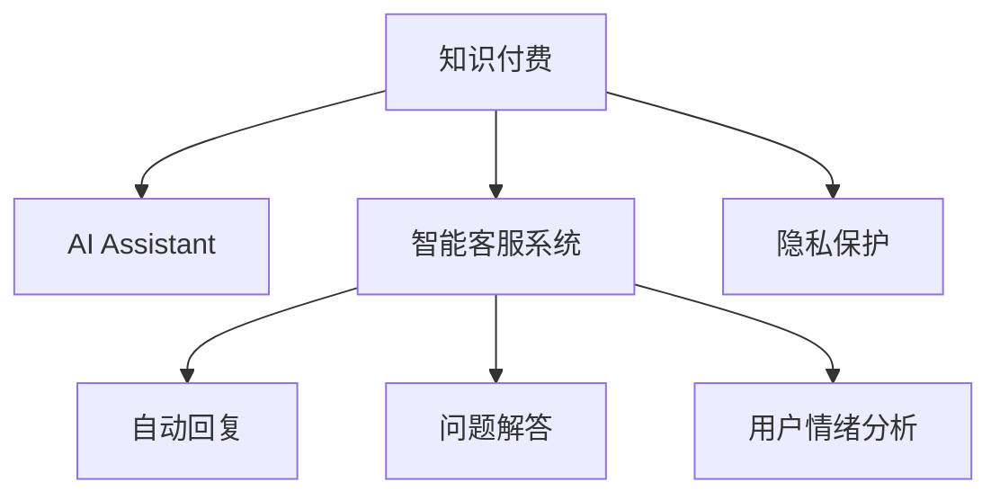

                 

# 如何利用知识付费实现人工智能助理与智能客服？

## 1. 背景介绍

### 1.1 问题由来

随着人工智能技术的快速发展，自然语言处理（NLP）和大语言模型（LLM）在各种应用场景中表现出色。尤其是在客户服务领域，智能客服和人工智能助理的应用，极大地提高了效率，改善了客户体验。然而，这些技术的广泛应用也面临一些挑战：

- **资源投入**：开发和维护智能客服和人工智能助理系统需要大量的人力和财力投入。
- **数据隐私**：在智能客服系统中，客户数据的安全和隐私保护至关重要。
- **个性化需求**：不同客户的个性化需求和偏好难以完全预测和满足。
- **技术更新**：随着技术的不断进步，需要持续更新和优化系统，以保持其竞争力。

### 1.2 问题核心关键点

针对上述问题，知识付费提供了一个有潜力的解决方案。通过知识付费，客户能够获取定制化的服务，同时保护自身隐私。人工智能助理和智能客服系统可以通过知识付费模式，提供更加个性化、专业化的服务，同时减少对数据隐私的依赖。

## 2. 核心概念与联系

### 2.1 核心概念概述

为更好地理解如何利用知识付费实现人工智能助理与智能客服，本节将介绍几个关键概念：

- **知识付费**：客户通过付费获取特定知识或服务，提升个人或企业效率的技术模式。
- **人工智能助理（AI Assistant）**：基于自然语言处理和大语言模型的智能助手，能够回答用户问题、提供信息、执行任务等。
- **智能客服系统**：利用人工智能技术自动处理客户服务请求的系统，包括自动回复、问题解答、用户情绪分析等。
- **隐私保护**：确保客户数据在传输和使用过程中不被泄露，采取技术和管理措施保障用户隐私。

这些概念之间的逻辑关系可以通过以下Mermaid流程图来展示：



这个流程图展示了一系列关键概念及其之间的逻辑关系：

1. 客户通过知识付费获取定制化服务，提升效率。
2. AI助理和智能客服系统通过知识付费模式，提供个性化、专业化的服务。
3. 系统能够自动回复客户问题，解答疑惑，并提供情绪分析。
4. 隐私保护措施保障客户数据安全，避免数据泄露。

## 3. 核心算法原理 & 具体操作步骤

### 3.1 算法原理概述

基于知识付费的人工智能助理和智能客服系统，本质上是一个有监督的迁移学习过程。其核心思想是：通过收集特定领域的知识库，使用大语言模型进行预训练，并在实际应用场景中进行微调，以适应特定任务需求。

形式化地，假设预训练模型为 $M_{\theta}$，其中 $\theta$ 为预训练得到的模型参数。给定客户服务任务 $T$ 的标注数据集 $D=\{(x_i, y_i)\}_{i=1}^N$，微调的目标是找到新的模型参数 $\hat{\theta}$，使得：

$$
\hat{\theta}=\mathop{\arg\min}_{\theta} \mathcal{L}(M_{\theta},D)
$$

其中 $\mathcal{L}$ 为针对任务 $T$ 设计的损失函数，用于衡量模型预测输出与真实标签之间的差异。常见的损失函数包括交叉熵损失、均方误差损失等。

通过梯度下降等优化算法，微调过程不断更新模型参数 $\theta$，最小化损失函数 $\mathcal{L}$，使得模型输出逼近真实标签。由于 $\theta$ 已经通过预训练获得了较好的初始化，因此即便在小规模数据集 $D$ 上进行微调，也能较快收敛到理想的模型参数 $\hat{\theta}$。

### 3.2 算法步骤详解

基于知识付费的人工智能助理和智能客服系统的微调流程一般包括以下几个关键步骤：

**Step 1: 准备预训练模型和数据集**
- 选择合适的预训练语言模型 $M_{\theta}$ 作为初始化参数，如 BERT、GPT 等。
- 准备客户服务任务 $T$ 的标注数据集 $D$，划分为训练集、验证集和测试集。一般要求标注数据与预训练数据的分布不要差异过大。

**Step 2: 添加任务适配层**
- 根据任务类型，在预训练模型顶层设计合适的输出层和损失函数。
- 对于分类任务，通常在顶层添加线性分类器和交叉熵损失函数。
- 对于生成任务，通常使用语言模型的解码器输出概率分布，并以负对数似然为损失函数。

**Step 3: 设置微调超参数**
- 选择合适的优化算法及其参数，如 AdamW、SGD 等，设置学习率、批大小、迭代轮数等。
- 设置正则化技术及强度，包括权重衰减、Dropout、Early Stopping等。
- 确定冻结预训练参数的策略，如仅微调顶层，或全部参数都参与微调。

**Step 4: 执行梯度训练**
- 将训练集数据分批次输入模型，前向传播计算损失函数。
- 反向传播计算参数梯度，根据设定的优化算法和学习率更新模型参数。
- 周期性在验证集上评估模型性能，根据性能指标决定是否触发 Early Stopping。
- 重复上述步骤直到满足预设的迭代轮数或 Early Stopping 条件。

**Step 5: 测试和部署**
- 在测试集上评估微调后模型 $M_{\hat{\theta}}$ 的性能，对比微调前后的精度提升。
- 使用微调后的模型对新样本进行推理预测，集成到实际的应用系统中。
- 持续收集新的数据，定期重新微调模型，以适应数据分布的变化。

以上是基于知识付费的人工智能助理和智能客服系统的一般流程。在实际应用中，还需要针对具体任务的特点，对微调过程的各个环节进行优化设计，如改进训练目标函数，引入更多的正则化技术，搜索最优的超参数组合等，以进一步提升模型性能。

### 3.3 算法优缺点

基于知识付费的人工智能助理和智能客服系统具有以下优点：
1. 降低应用开发成本。通过知识付费获取服务，可以显著减少从头开发所需的数据、计算和人力等成本投入。
2. 提升模型效果。微调使得通用大模型更好地适应特定任务，在应用场景中取得更优表现。
3. 减少对数据隐私的依赖。通过知识付费模式，客户数据不再集中存储，有效保护用户隐私。
4. 灵活适应客户需求。客户可以根据自己的需求，定制化服务内容，提升服务质量。
5. 促进技术创新。知识付费模式激发了对预训练-微调的深入研究，催生了提示学习、少样本学习等新的研究方向。

同时，该方法也存在一定的局限性：
1. 服务成本问题。知识付费模式可能使得部分客户因费用较高而无法持续使用服务。
2. 服务质量不一致。不同客户的服务质量可能因知识付费水平不同而有所差异。
3. 服务内容更新滞后。知识库的更新需要时间，可能无法及时反映最新的知识变化。

尽管存在这些局限性，但就目前而言，基于知识付费的AI助理和智能客服系统仍是一种高效、安全的服务方式。未来相关研究的重点在于如何进一步降低服务成本，提高服务质量，增强服务内容的及时性和丰富性，同时兼顾隐私保护和用户体验。

### 3.4 算法应用领域

基于知识付费的人工智能助理和智能客服系统，已在多个领域得到了应用，例如：

- **金融客服**：提供财务咨询、投资建议、投诉处理等服务，通过知识付费模式，确保客户隐私。
- **医疗咨询**：提供健康咨询、预约挂号、药物咨询等服务，通过知识付费模式，保障客户数据安全。
- **教育辅导**：提供在线教育、个性化学习、作业批改等服务，通过知识付费模式，提升教学质量。
- **法律咨询**：提供法律咨询、合同审核、知识产权保护等服务，通过知识付费模式，保护客户隐私。
- **旅游服务**：提供旅游攻略、行程规划、景点推荐等服务，通过知识付费模式，提供个性化的旅行建议。

除了上述这些经典应用外，基于知识付费的AI助理和智能客服系统还被创新性地应用到更多场景中，如智能家居、智能办公、智能制造等，为各行各业带来智能化变革。

## 4. 数学模型和公式 & 详细讲解 & 举例说明

### 4.1 数学模型构建

本节将使用数学语言对基于知识付费的AI助理和智能客服系统进行更加严格的刻画。

记预训练语言模型为 $M_{\theta}$，其中 $\theta$ 为预训练得到的模型参数。假设客户服务任务 $T$ 的训练集为 $D=\{(x_i, y_i)\}_{i=1}^N, x_i \in \mathcal{X}, y_i \in \mathcal{Y}$。

定义模型 $M_{\theta}$ 在数据样本 $(x,y)$ 上的损失函数为 $\ell(M_{\theta}(x),y)$，则在数据集 $D$ 上的经验风险为：

$$
\mathcal{L}(\theta) = \frac{1}{N} \sum_{i=1}^N \ell(M_{\theta}(x_i),y_i)
$$

微调的优化目标是最小化经验风险，即找到最优参数：

$$
\theta^* = \mathop{\arg\min}_{\theta} \mathcal{L}(\theta)
$$

在实践中，我们通常使用基于梯度的优化算法（如SGD、Adam等）来近似求解上述最优化问题。设 $\eta$ 为学习率，$\lambda$ 为正则化系数，则参数的更新公式为：

$$
\theta \leftarrow \theta - \eta \nabla_{\theta}\mathcal{L}(\theta) - \eta\lambda\theta
$$

其中 $\nabla_{\theta}\mathcal{L}(\theta)$ 为损失函数对参数 $\theta$ 的梯度，可通过反向传播算法高效计算。

### 4.2 公式推导过程

以下我们以二分类任务为例，推导交叉熵损失函数及其梯度的计算公式。

假设模型 $M_{\theta}$ 在输入 $x$ 上的输出为 $\hat{y}=M_{\theta}(x) \in [0,1]$，表示样本属于正类的概率。真实标签 $y \in \{0,1\}$。则二分类交叉熵损失函数定义为：

$$
\ell(M_{\theta}(x),y) = -[y\log \hat{y} + (1-y)\log (1-\hat{y})]
$$

将其代入经验风险公式，得：

$$
\mathcal{L}(\theta) = -\frac{1}{N}\sum_{i=1}^N [y_i\log M_{\theta}(x_i)+(1-y_i)\log(1-M_{\theta}(x_i))]
$$

根据链式法则，损失函数对参数 $\theta_k$ 的梯度为：

$$
\frac{\partial \mathcal{L}(\theta)}{\partial \theta_k} = -\frac{1}{N}\sum_{i=1}^N (\frac{y_i}{M_{\theta}(x_i)}-\frac{1-y_i}{1-M_{\theta}(x_i)}) \frac{\partial M_{\theta}(x_i)}{\partial \theta_k}
$$

其中 $\frac{\partial M_{\theta}(x_i)}{\partial \theta_k}$ 可进一步递归展开，利用自动微分技术完成计算。

## 5. 项目实践：代码实例和详细解释说明

### 5.1 开发环境搭建

在进行知识付费的AI助理和智能客服系统开发前，我们需要准备好开发环境。以下是使用Python进行PyTorch开发的环境配置流程：

1. 安装Anaconda：从官网下载并安装Anaconda，用于创建独立的Python环境。

2. 创建并激活虚拟环境：
```bash
conda create -n pytorch-env python=3.8 
conda activate pytorch-env
```

3. 安装PyTorch：根据CUDA版本，从官网获取对应的安装命令。例如：
```bash
conda install pytorch torchvision torchaudio cudatoolkit=11.1 -c pytorch -c conda-forge
```

4. 安装Transformers库：
```bash
pip install transformers
```

5. 安装各类工具包：
```bash
pip install numpy pandas scikit-learn matplotlib tqdm jupyter notebook ipython
```

完成上述步骤后，即可在`pytorch-env`环境中开始知识付费的AI助理和智能客服系统开发。

### 5.2 源代码详细实现

这里我们以金融客服系统为例，给出使用Transformers库对BERT模型进行微调的PyTorch代码实现。

首先，定义金融客服任务的数据处理函数：

```python
from transformers import BertTokenizer
from torch.utils.data import Dataset
import torch

class FinancialDataset(Dataset):
    def __init__(self, texts, tags, tokenizer, max_len=128):
        self.texts = texts
        self.tags = tags
        self.tokenizer = tokenizer
        self.max_len = max_len
        
    def __len__(self):
        return len(self.texts)
    
    def __getitem__(self, item):
        text = self.texts[item]
        tags = self.tags[item]
        
        encoding = self.tokenizer(text, return_tensors='pt', max_length=self.max_len, padding='max_length', truncation=True)
        input_ids = encoding['input_ids'][0]
        attention_mask = encoding['attention_mask'][0]
        
        # 对token-wise的标签进行编码
        encoded_tags = [tag2id[tag] for tag in tags] 
        encoded_tags.extend([tag2id['O']] * (self.max_len - len(encoded_tags)))
        labels = torch.tensor(encoded_tags, dtype=torch.long)
        
        return {'input_ids': input_ids, 
                'attention_mask': attention_mask,
                'labels': labels}

# 标签与id的映射
tag2id = {'O': 0, 'Buy': 1, 'Sell': 2, 'Hold': 3}
id2tag = {v: k for k, v in tag2id.items()}

# 创建dataset
tokenizer = BertTokenizer.from_pretrained('bert-base-cased')

train_dataset = FinancialDataset(train_texts, train_tags, tokenizer)
dev_dataset = FinancialDataset(dev_texts, dev_tags, tokenizer)
test_dataset = FinancialDataset(test_texts, test_tags, tokenizer)
```

然后，定义模型和优化器：

```python
from transformers import BertForTokenClassification, AdamW

model = BertForTokenClassification.from_pretrained('bert-base-cased', num_labels=len(tag2id))

optimizer = AdamW(model.parameters(), lr=2e-5)
```

接着，定义训练和评估函数：

```python
from torch.utils.data import DataLoader
from tqdm import tqdm
from sklearn.metrics import classification_report

device = torch.device('cuda') if torch.cuda.is_available() else torch.device('cpu')
model.to(device)

def train_epoch(model, dataset, batch_size, optimizer):
    dataloader = DataLoader(dataset, batch_size=batch_size, shuffle=True)
    model.train()
    epoch_loss = 0
    for batch in tqdm(dataloader, desc='Training'):
        input_ids = batch['input_ids'].to(device)
        attention_mask = batch['attention_mask'].to(device)
        labels = batch['labels'].to(device)
        model.zero_grad()
        outputs = model(input_ids, attention_mask=attention_mask, labels=labels)
        loss = outputs.loss
        epoch_loss += loss.item()
        loss.backward()
        optimizer.step()
    return epoch_loss / len(dataloader)

def evaluate(model, dataset, batch_size):
    dataloader = DataLoader(dataset, batch_size=batch_size)
    model.eval()
    preds, labels = [], []
    with torch.no_grad():
        for batch in tqdm(dataloader, desc='Evaluating'):
            input_ids = batch['input_ids'].to(device)
            attention_mask = batch['attention_mask'].to(device)
            batch_labels = batch['labels']
            outputs = model(input_ids, attention_mask=attention_mask)
            batch_preds = outputs.logits.argmax(dim=2).to('cpu').tolist()
            batch_labels = batch_labels.to('cpu').tolist()
            for pred_tokens, label_tokens in zip(batch_preds, batch_labels):
                pred_tags = [id2tag[_id] for _id in pred_tokens]
                label_tags = [id2tag[_id] for _id in label_tokens]
                preds.append(pred_tags[:len(label_tokens)])
                labels.append(label_tags)
                
    print(classification_report(labels, preds))
```

最后，启动训练流程并在测试集上评估：

```python
epochs = 5
batch_size = 16

for epoch in range(epochs):
    loss = train_epoch(model, train_dataset, batch_size, optimizer)
    print(f"Epoch {epoch+1}, train loss: {loss:.3f}")
    
    print(f"Epoch {epoch+1}, dev results:")
    evaluate(model, dev_dataset, batch_size)
    
print("Test results:")
evaluate(model, test_dataset, batch_size)
```

以上就是使用PyTorch对BERT进行金融客服任务微调的完整代码实现。可以看到，得益于Transformers库的强大封装，我们可以用相对简洁的代码完成BERT模型的加载和微调。

### 5.3 代码解读与分析

让我们再详细解读一下关键代码的实现细节：

**FinancialDataset类**：
- `__init__`方法：初始化文本、标签、分词器等关键组件。
- `__len__`方法：返回数据集的样本数量。
- `__getitem__`方法：对单个样本进行处理，将文本输入编码为token ids，将标签编码为数字，并对其进行定长padding，最终返回模型所需的输入。

**tag2id和id2tag字典**：
- 定义了标签与数字id之间的映射关系，用于将token-wise的预测结果解码回真实的标签。

**训练和评估函数**：
- 使用PyTorch的DataLoader对数据集进行批次化加载，供模型训练和推理使用。
- 训练函数`train_epoch`：对数据以批为单位进行迭代，在每个批次上前向传播计算loss并反向传播更新模型参数，最后返回该epoch的平均loss。
- 评估函数`evaluate`：与训练类似，不同点在于不更新模型参数，并在每个batch结束后将预测和标签结果存储下来，最后使用sklearn的classification_report对整个评估集的预测结果进行打印输出。

**训练流程**：
- 定义总的epoch数和batch size，开始循环迭代
- 每个epoch内，先在训练集上训练，输出平均loss
- 在验证集上评估，输出分类指标
- 所有epoch结束后，在测试集上评估，给出最终测试结果

可以看到，PyTorch配合Transformers库使得BERT微调的代码实现变得简洁高效。开发者可以将更多精力放在数据处理、模型改进等高层逻辑上，而不必过多关注底层的实现细节。

当然，工业级的系统实现还需考虑更多因素，如模型的保存和部署、超参数的自动搜索、更灵活的任务适配层等。但核心的微调范式基本与此类似。

## 6. 实际应用场景

### 6.1 智能客服系统

基于知识付费的智能客服系统，可以通过微调后的模型，实现更加精准、高效的服务响应。客户可以选择付费获取高质量的客服服务，系统则利用微调模型自动处理客户请求，提供个性化、专业化的服务。

在技术实现上，可以收集企业内部的历史客服对话记录，将问题和最佳答复构建成监督数据，在此基础上对预训练模型进行微调。微调后的模型能够自动理解用户意图，匹配最合适的答案模板进行回复。对于客户提出的新问题，还可以接入检索系统实时搜索相关内容，动态组织生成回答。如此构建的智能客服系统，能大幅提升客户咨询体验和问题解决效率。

### 6.2 金融舆情监测

金融机构需要实时监测市场舆论动向，以便及时应对负面信息传播，规避金融风险。基于知识付费的文本分类和情感分析技术，为金融舆情监测提供了新的解决方案。

具体而言，可以收集金融领域相关的新闻、报道、评论等文本数据，并对其进行主题标注和情感标注。在此基础上对预训练语言模型进行微调，使其能够自动判断文本属于何种主题，情感倾向是正面、中性还是负面。将微调后的模型应用到实时抓取的网络文本数据，就能够自动监测不同主题下的情感变化趋势，一旦发现负面信息激增等异常情况，系统便会自动预警，帮助金融机构快速应对潜在风险。

### 6.3 个性化推荐系统

当前的推荐系统往往只依赖用户的历史行为数据进行物品推荐，无法深入理解用户的真实兴趣偏好。基于知识付费的个性化推荐系统，可以通过微调后的模型，更好地挖掘用户行为背后的语义信息，从而提供更精准、多样的推荐内容。

在实践中，可以收集用户浏览、点击、评论、分享等行为数据，提取和用户交互的物品标题、描述、标签等文本内容。将文本内容作为模型输入，用户的后续行为（如是否点击、购买等）作为监督信号，在此基础上微调预训练语言模型。微调后的模型能够从文本内容中准确把握用户的兴趣点。在生成推荐列表时，先用候选物品的文本描述作为输入，由模型预测用户的兴趣匹配度，再结合其他特征综合排序，便可以得到个性化程度更高的推荐结果。

### 6.4 未来应用展望

随着大语言模型微调技术的发展，基于知识付费的AI助理和智能客服系统将在更多领域得到应用，为传统行业带来变革性影响。

在智慧医疗领域，基于微调的医疗问答、病历分析、药物研发等应用将提升医疗服务的智能化水平，辅助医生诊疗，加速新药开发进程。

在智能教育领域，知识付费模式可应用于作业批改、学情分析、知识推荐等方面，因材施教，促进教育公平，提高教学质量。

在智慧城市治理中，基于微调的知识付费系统可应用于城市事件监测、舆情分析、应急指挥等环节，提高城市管理的自动化和智能化水平，构建更安全、高效的未来城市。

此外，在企业生产、社会治理、文娱传媒等众多领域，基于知识付费的AI助理和智能客服系统也将不断涌现，为各行各业带来智能化变革。相信随着技术的日益成熟，知识付费模式将成为AI助理和智能客服系统的重要范式，推动人工智能技术在垂直行业的规模化落地。

## 7. 工具和资源推荐

### 7.1 学习资源推荐

为了帮助开发者系统掌握基于知识付费的AI助理和智能客服系统的理论基础和实践技巧，这里推荐一些优质的学习资源：

1. 《Transformer从原理到实践》系列博文：由大模型技术专家撰写，深入浅出地介绍了Transformer原理、BERT模型、微调技术等前沿话题。

2. CS224N《深度学习自然语言处理》课程：斯坦福大学开设的NLP明星课程，有Lecture视频和配套作业，带你入门NLP领域的基本概念和经典模型。

3. 《Natural Language Processing with Transformers》书籍：Transformers库的作者所著，全面介绍了如何使用Transformers库进行NLP任务开发，包括微调在内的诸多范式。

4. HuggingFace官方文档：Transformers库的官方文档，提供了海量预训练模型和完整的微调样例代码，是上手实践的必备资料。

5. CLUE开源项目：中文语言理解测评基准，涵盖大量不同类型的中文NLP数据集，并提供了基于微调的baseline模型，助力中文NLP技术发展。

通过对这些资源的学习实践，相信你一定能够快速掌握基于知识付费的AI助理和智能客服系统的精髓，并用于解决实际的NLP问题。
###  7.2 开发工具推荐

高效的开发离不开优秀的工具支持。以下是几款用于基于知识付费的AI助理和智能客服系统开发的常用工具：

1. PyTorch：基于Python的开源深度学习框架，灵活动态的计算图，适合快速迭代研究。大部分预训练语言模型都有PyTorch版本的实现。

2. TensorFlow：由Google主导开发的开源深度学习框架，生产部署方便，适合大规模工程应用。同样有丰富的预训练语言模型资源。

3. Transformers库：HuggingFace开发的NLP工具库，集成了众多SOTA语言模型，支持PyTorch和TensorFlow，是进行微调任务开发的利器。

4. Weights & Biases：模型训练的实验跟踪工具，可以记录和可视化模型训练过程中的各项指标，方便对比和调优。与主流深度学习框架无缝集成。

5. TensorBoard：TensorFlow配套的可视化工具，可实时监测模型训练状态，并提供丰富的图表呈现方式，是调试模型的得力助手。

6. Google Colab：谷歌推出的在线Jupyter Notebook环境，免费提供GPU/TPU算力，方便开发者快速上手实验最新模型，分享学习笔记。

合理利用这些工具，可以显著提升基于知识付费的AI助理和智能客服系统的开发效率，加快创新迭代的步伐。

### 7.3 相关论文推荐

基于知识付费的AI助理和智能客服系统的发展源于学界的持续研究。以下是几篇奠基性的相关论文，推荐阅读：

1. Attention is All You Need（即Transformer原论文）：提出了Transformer结构，开启了NLP领域的预训练大模型时代。

2. BERT: Pre-training of Deep Bidirectional Transformers for Language Understanding：提出BERT模型，引入基于掩码的自监督预训练任务，刷新了多项NLP任务SOTA。

3. Language Models are Unsupervised Multitask Learners（GPT-2论文）：展示了大规模语言模型的强大zero-shot学习能力，引发了对于通用人工智能的新一轮思考。

4. Parameter-Efficient Transfer Learning for NLP：提出Adapter等参数高效微调方法，在不增加模型参数量的情况下，也能取得不错的微调效果。

5. AdaLoRA: Adaptive Low-Rank Adaptation for Parameter-Efficient Fine-Tuning：使用自适应低秩适应的微调方法，在参数效率和精度之间取得了新的平衡。

这些论文代表了大语言模型微调技术的发展脉络。通过学习这些前沿成果，可以帮助研究者把握学科前进方向，激发更多的创新灵感。

## 8. 总结：未来发展趋势与挑战

### 8.1 总结

本文对基于知识付费的AI助理和智能客服系统进行了全面系统的介绍。首先阐述了知识付费在AI助理和智能客服系统中的应用背景和意义，明确了其在降低应用开发成本、保护客户隐私、提升服务质量等方面的独特价值。其次，从原理到实践，详细讲解了基于知识付费的AI助理和智能客服系统的数学原理和关键步骤，给出了微调任务开发的完整代码实例。同时，本文还广泛探讨了系统在智能客服、金融舆情、个性化推荐等多个行业领域的应用前景，展示了知识付费模式的高效性、安全性和广泛适应性。

通过本文的系统梳理，可以看到，基于知识付费的AI助理和智能客服系统已经成为智能客服领域的重要应用范式，极大地提升了客服系统的服务质量和用户满意度。未来，伴随知识付费技术的不断演进，基于AI助理和智能客服系统的应用将更加广泛，为各行各业带来更多的智能化解决方案。

### 8.2 未来发展趋势

展望未来，基于知识付费的AI助理和智能客服系统将呈现以下几个发展趋势：

1. **服务模式多样化**：除了传统的知识付费模式，未来可能还会出现订阅制、按需服务等多种形式，满足不同客户的需求。
2. **服务内容个性化**：随着用户数据的积累，系统能够更好地理解用户偏好，提供更加个性化的服务内容，提升用户体验。
3. **服务流程自动化**：通过引入自然语言处理技术，系统能够自动处理客户请求，减少人工干预，提高服务效率。
4. **跨领域应用扩展**：基于知识付费的AI助理和智能客服系统不仅限于客服领域，还能应用于医疗、教育、金融等多个领域，提供全面、高效的智能服务。
5. **持续学习与迭代优化**：系统能够通过持续学习，及时更新知识库，优化服务内容，保持服务质量的稳定性和先进性。
6. **数据隐私保护升级**：随着数据隐私法规的完善，知识付费系统将更加注重客户数据的保护，采用匿名化、加密等技术手段，确保数据安全。

这些趋势凸显了基于知识付费的AI助理和智能客服系统的高效性和安全性，必将进一步推动其在各行业的应用，提升服务的智能化水平。

### 8.3 面临的挑战

尽管基于知识付费的AI助理和智能客服系统已经取得了显著成效，但在迈向更加智能化、普适化应用的过程中，它仍面临着诸多挑战：

1. **服务成本问题**：知识付费模式可能使得部分客户因费用较高而无法持续使用服务，影响服务普及率。
2. **服务质量一致性**：不同客户的服务质量可能因知识付费水平不同而有所差异，影响客户满意度。
3. **服务内容更新**：知识库的更新需要时间，可能无法及时反映最新的知识变化，影响服务的时效性。
4. **数据隐私保护**：知识付费系统涉及客户数据的存储和使用，如何在保护客户隐私的同时提供优质服务，是一个重要的难题。
5. **技术迭代速度**：随着技术的不断进步，需要持续更新和优化系统，以保持竞争力，增加技术维护成本。

尽管存在这些挑战，但通过不断优化技术架构和服务模式，基于知识付费的AI助理和智能客服系统仍具有良好的发展前景。

### 8.4 研究展望

面对基于知识付费的AI助理和智能客服系统所面临的挑战，未来的研究需要在以下几个方面寻求新的突破：

1. **服务成本优化**：探索新的付费模式和服务定价策略，降低服务成本，提高服务普及率。
2. **服务质量控制**：建立服务质量评价体系，引入客户反馈机制，不断提升服务质量，确保服务一致性。
3. **知识库更新机制**：建立自动化的知识库更新机制，确保知识库的实时性和有效性，提高服务的时效性。
4. **隐私保护技术**：采用先进的隐私保护技术，如差分隐私、联邦学习等，保护客户数据安全，确保客户隐私。
5. **技术快速迭代**：引入持续学习和模型压缩技术，提高系统的迭代优化速度，降低技术维护成本。

这些研究方向的探索，必将引领基于知识付费的AI助理和智能客服系统走向成熟，为各行各业带来更加智能化、高效化的服务体验。

## 9. 附录：常见问题与解答

**Q1：基于知识付费的AI助理和智能客服系统与传统客服系统的区别是什么？**

A: 基于知识付费的AI助理和智能客服系统通过微调后的预训练模型，能够提供更加精准、高效的服务，减少对人工客服的依赖。客户通过知识付费模式，获取高质量的客服服务，提升客户体验。与传统客服系统相比，基于知识付费的系统具有更高的服务质量和响应速度，且能够实现个性化服务，满足不同客户的需求。

**Q2：知识付费模式在AI助理和智能客服系统中如何保护客户隐私？**

A: 知识付费模式通过微调后的预训练模型，能够自动处理客户请求，提供高质量的客服服务，同时无需集中存储客户数据。系统采用匿名化、加密等技术手段，保护客户数据安全，确保数据隐私。客户的数据仅在处理请求时使用，处理完毕后即删除，确保数据不被滥用。

**Q3：基于知识付费的AI助理和智能客服系统如何应对大规模用户请求？**

A: 系统通过分布式架构和负载均衡技术，能够高效处理大规模用户请求。服务器集群能够实现并行计算，提高服务响应速度，确保系统的高可用性和稳定性。同时，系统采用缓存和限流策略，优化资源利用，减少系统负载，确保系统性能。

**Q4：知识付费模式是否适用于所有客户群体？**

A: 知识付费模式适用于需要高质量客服服务的企业和客户，如金融机构、医疗服务、教育机构等。对于一些对服务成本敏感的客户群体，如中小型企业、个人用户，传统客服系统可能更加经济实惠。因此，企业可以根据自身需求和客户群体特点，选择适合的客服系统和服务模式。

**Q5：知识付费模式是否会影响客户体验？**

A: 知识付费模式能够提供高质量、个性化的服务，提升客户体验。客户通过知识付费模式，能够获得更加精准、专业的服务，减少等待时间和误解。同时，系统通过持续学习和优化，能够不断提升服务质量，满足不同客户的需求。因此，知识付费模式不会影响客户体验，反而能够提升客户满意度和忠诚度。

---

作者：禅与计算机程序设计艺术 / Zen and the Art of Computer Programming

