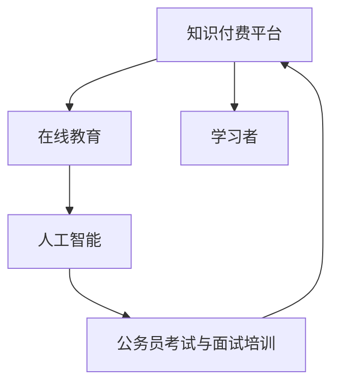

                 

# 如何利用知识付费实现在线公务员考试与面试培训？

## 1. 背景介绍

在当前信息爆炸的时代，知识付费已成为一种快速、高效的学习方式。特别是在公务员考试与面试等公共职业资格选拔考试中，考生需要通过高效的培训来提升自身竞争力，实现职业梦想。然而，传统的线下培训往往受时间、地点、成本等多方面限制，难以满足日益增长的考生需求。如何利用知识付费平台，实现在线公务员考试与面试培训，成为教育领域的一个热门话题。

本文将深入探讨如何利用知识付费，结合在线教育和人工智能技术，为考生提供定制化的公务员考试与面试培训服务。通过分析核心概念与联系、算法原理与具体操作步骤，以及实际应用场景与未来展望，我们将展示一种全新的培训模式，为教育市场带来革命性的变化。

## 2. 核心概念与联系

### 2.1 核心概念概述

为更好地理解利用知识付费平台实现在线公务员考试与面试培训的原理与方法，本节将介绍几个关键概念：

- **知识付费平台**：以订阅制、付费购买等方式，提供高质量在线教育资源的平台，如Coursera、Udemy、腾讯课堂等。这些平台通常汇集了全球顶级教育资源和专家，为学习者提供灵活、个性化的学习体验。
- **在线教育**：通过互联网技术，打破传统教室的限制，为学习者提供灵活的在线学习模式。在线教育不仅限于视频课程，还包括互动讨论、作业提交、在线答疑等多种形式。
- **人工智能**：以机器学习、深度学习等技术为基础，通过算法模型自动分析、处理数据，实现智能推荐、智能评估等功能。
- **公务员考试与面试培训**：针对公务员考试（如国考、省考等）和面试（结构化面试、无领导小组讨论等）进行的专业化培训，旨在帮助考生掌握答题技巧、提升综合素质。

这些概念之间的联系可以通过以下Mermaid流程图来展示：



这个流程图展示了知识付费平台、在线教育、人工智能和公务员考试与面试培训之间的逻辑关系：

1. 学习者通过知识付费平台获取在线教育资源。
2. 在线教育平台利用人工智能技术，提供个性化学习推荐和智能评估。
3. 人工智能技术通过分析和处理学习者的反馈数据，不断优化个性化学习体验。
4. 学习者通过在线教育平台获得公务员考试与面试培训服务，提升答题技巧和面试能力。

## 3. 核心算法原理 & 具体操作步骤
### 3.1 算法原理概述

利用知识付费平台实现在线公务员考试与面试培训，本质上是一种基于人工智能的个性化在线教育。其核心思想是：通过知识付费平台收集学习者的学习行为数据，利用人工智能算法，为每个学习者生成个性化的培训课程和学习路径，最大化提升学习效果。

形式化地，假设学习者的行为数据为 $D=\{(x_i,y_i)\}_{i=1}^N$，其中 $x_i$ 表示学习者在平台上的行为记录（如浏览课程、观看视频、完成作业等），$y_i$ 表示学习者对这些行为的评价（如满意度、完成度等）。平台的目标是找到最优的学习路径 $\pi$，使得总的学习效果最大化：

$$
\pi^* = \mathop{\arg\min}_{\pi} \mathcal{L}(\pi,D)
$$

其中 $\mathcal{L}$ 为损失函数，衡量学习路径 $\pi$ 在数据 $D$ 上的性能。

### 3.2 算法步骤详解

基于上述原理，我们可以将操作过程分解为以下几个步骤：

**Step 1: 收集行为数据**
- 学习者在知识付费平台上浏览、学习、反馈等行为将被记录下来，形成行为数据集 $D$。

**Step 2: 数据分析与特征提取**
- 对行为数据进行分析，提取关键特征，如课程观看时长、作业提交频率、讨论活跃度等。

**Step 3: 设计个性化学习路径**
- 使用机器学习算法（如协同过滤、深度学习等），根据学习者的历史行为和偏好，设计个性化的学习路径。
- 学习路径可以包括推荐课程、制定学习计划、安排评估测试等。

**Step 4: 学习路径的执行与优化**
- 将学习路径提供给学习者，根据学习者的反馈和评估结果，不断优化学习路径。
- 利用在线评估工具（如在线测试、作业提交等），实时评估学习效果。

**Step 5: 实时调整与个性化推荐**
- 根据实时评估结果，动态调整学习路径，提升学习效率。
- 利用人工智能算法，实时推荐学习者感兴趣的新课程和资料。

### 3.3 算法优缺点

利用知识付费平台实现在线公务员考试与面试培训，具有以下优点：

- **灵活性高**：学习者可以根据自己的时间安排，灵活选择学习时间和内容。
- **个性化强**：通过分析学习者的行为数据，可以提供高度个性化的培训方案，提升学习效果。
- **覆盖广**：知识付费平台汇集了全球顶级教育资源，为学习者提供广泛的学习选择。
- **成本低**：相比于线下培训，知识付费平台的课程费用相对较低，减轻了学习者的经济负担。

同时，该方法也存在一定的局限性：

- **依赖平台**：学习者对平台的依赖性强，平台稳定性问题可能影响学习效果。
- **互动不足**：在线教育模式缺乏面对面的互动，可能影响学习者的学习兴趣和效果。
- **内容质量参差不齐**：平台上的课程质量参差不齐，需要学习者自行筛选和判断。

尽管存在这些局限性，但知识付费平台仍是大规模推广在线公务员考试与面试培训的重要手段。未来相关研究的重点在于如何进一步提升平台内容质量，增强互动性，优化个性化推荐算法，从而提升整体培训效果。

### 3.4 算法应用领域

基于知识付费平台的大规模在线公务员考试与面试培训，已经广泛应用于各种学习场景，例如：

- **公务员考试**：为考生提供国考、省考等各类公务员考试的专业化培训，包括行测、申论、面试等课程。
- **事业单位招聘**：为应聘者提供事业单位招聘考试的专业化培训，包括公共基础知识、专业知识等课程。
- **行政执法**：为拟从事行政执法工作的人员提供相关考试和面试的培训，提升执法能力和综合素质。
- **军队文职**：为拟应聘军队文职的考生提供专业考试和面试的培训，帮助其顺利通过选拔。
- **教育考试**：为教师资格证、特岗教师等教育考试提供培训服务，提升教育专业知识和面试技巧。

除了这些经典应用外，平台还可以拓展到其他职业资格选拔考试的培训领域，如金融分析师、注册会计师等，为更多人群提供优质的教育服务。

## 4. 数学模型和公式 & 详细讲解 & 举例说明
### 4.1 数学模型构建

在本节中，我们将使用数学语言对基于知识付费平台的大规模在线公务员考试与面试培训进行更加严格的刻画。

假设学习者 $u$ 在平台上的行为数据为 $x=(o_1,o_2,\dots,o_n)$，其中 $o_i \in \{0,1\}$ 表示学习者是否进行了某项行为（0表示未进行，1表示进行了）。行为数据的权重为 $w=(\omega_1,\omega_2,\dots,\omega_n)$，表示不同行为的相对重要性。学习者的偏好向量为 $p=(p_1,p_2,\dots,p_n)$，表示学习者对不同行为的偏好程度。

平台的学习路径为 $\pi=(\pi_1,\pi_2,\dots,\pi_n)$，其中 $\pi_i \in \{0,1\}$ 表示学习者是否参与了某项培训活动（0表示未参与，1表示参与了）。学习路径的权重为 $q=(q_1,q_2,\dots,q_n)$，表示不同培训活动的相对重要性。

平台的损失函数 $\mathcal{L}$ 可以表示为：

$$
\mathcal{L}(\pi,p,w)=\sum_{i=1}^n w_i \omega_i (p_i - \pi_i)^2
$$

其中 $p_i$ 为学习者对行为 $o_i$ 的偏好程度，$\pi_i$ 为平台推荐的学习路径。

### 4.2 公式推导过程

在上述模型构建的基础上，我们可以进一步推导出损失函数的优化公式。

首先，我们可以将损失函数 $\mathcal{L}$ 表示为：

$$
\mathcal{L}(\pi,p,w) = \sum_{i=1}^n w_i \omega_i (p_i - \pi_i)^2 = \frac{1}{2} \sum_{i=1}^n w_i \omega_i (\pi_i - p_i)^2
$$

将其对 $\pi_i$ 求导，得到：

$$
\frac{\partial \mathcal{L}}{\partial \pi_i} = w_i \omega_i (\pi_i - p_i)
$$

根据梯度下降法，更新学习路径 $\pi$ 的公式为：

$$
\pi_i \leftarrow \pi_i - \eta \frac{\partial \mathcal{L}}{\partial \pi_i}
$$

其中 $\eta$ 为学习率。

### 4.3 案例分析与讲解

以一个具体的案例来分析上述模型和算法的应用。假设学习者 $u$ 在平台上的行为数据为 $x=(o_1,o_2,\dots,o_n)$，其中 $o_1=1$ 表示观看了一门课程，$o_2=0$ 表示未观看，$o_3=1$ 表示完成了作业。行为数据的权重为 $w=(\omega_1=0.3,\omega_2=0.2,\omega_3=0.5)$，表示观看课程的权重最高。学习者的偏好向量为 $p=(p_1=0.8,p_2=0.2,p_3=0.5)$，表示学习者更偏好观看课程和完成作业。平台的学习路径为 $\pi=(\pi_1=0,\pi_2=1,\pi_3=1)$，表示平台推荐学习者观看课程并完成作业。学习路径的权重为 $q=(q_1=0.2,q_2=0.6,q_3=0.2)$，表示观看课程的权重最高。

根据上述模型，计算平台的损失函数 $\mathcal{L}$：

$$
\mathcal{L}(\pi,p,w)=\sum_{i=1}^n w_i \omega_i (p_i - \pi_i)^2 = 0.3 \times 0.2 \times (0.8 - 0)^2 + 0.2 \times 0.6 \times (0.2 - 1)^2 + 0.5 \times 0.2 \times (0.5 - 1)^2 = 0.164
$$

根据梯度下降公式，更新学习路径 $\pi$：

$$
\pi_1 \leftarrow \pi_1 - \eta \frac{\partial \mathcal{L}}{\partial \pi_1} = 0 - \eta \times 0.3 \times 0.2 \times (0.8 - 0) = -0.12\eta
$$

$$
\pi_2 \leftarrow \pi_2 - \eta \frac{\partial \mathcal{L}}{\partial \pi_2} = 1 - \eta \times 0.2 \times 0.6 \times (0.2 - 1) = 1 + 0.12\eta
$$

$$
\pi_3 \leftarrow \pi_3 - \eta \frac{\partial \mathcal{L}}{\partial \pi_3} = 1 - \eta \times 0.2 \times 0.2 \times (0.5 - 1) = 1 - 0.04\eta
$$

通过上述分析，可以看出平台如何根据学习者的行为数据和偏好向量，动态调整推荐的学习路径，提升学习效果。

## 5. 项目实践：代码实例和详细解释说明
### 5.1 开发环境搭建

在进行项目实践前，我们需要准备好开发环境。以下是使用Python进行Keras开发的环境配置流程：

1. 安装Anaconda：从官网下载并安装Anaconda，用于创建独立的Python环境。

2. 创建并激活虚拟环境：
```bash
conda create -n ml-env python=3.8 
conda activate ml-env
```

3. 安装相关库：
```bash
pip install numpy pandas scikit-learn scikit-optimize matplotlib tqdm jupyter notebook ipython
```

4. 安装Keras：
```bash
pip install keras tensorflow
```

5. 安装TensorBoard：
```bash
pip install tensorboard
```

完成上述步骤后，即可在`ml-env`环境中开始项目实践。

### 5.2 源代码详细实现

这里我们以一个简单的推荐系统为例，展示如何使用Keras实现基于知识付费平台的个性化学习路径推荐。

首先，定义数据处理函数：

```python
import pandas as pd

def load_data(file_path):
    data = pd.read_csv(file_path)
    return data

def preprocess_data(data):
    # 数据预处理，如填充缺失值、转换数据类型等
    return data

data = load_data('path/to/data.csv')
data = preprocess_data(data)
```

然后，定义模型：

```python
from keras.layers import Input, Dense, Embedding, Flatten, Dropout
from keras.models import Model

def build_model(input_shape, hidden_units):
    input = Input(shape=input_shape)
    x = Embedding(input_dim=vocab_size, output_dim=embedding_dim)(input)
    x = Flatten()(x)
    x = Dense(hidden_units, activation='relu')(x)
    x = Dropout(dropout_rate)(x)
    output = Dense(1, activation='sigmoid')(x)
    
    model = Model(inputs=input, outputs=output)
    return model

input_shape = (sequence_length,)
hidden_units = 64
dropout_rate = 0.5

model = build_model(input_shape, hidden_units)
```

接着，定义损失函数和优化器：

```python
from keras.losses import binary_crossentropy
from keras.optimizers import Adam

loss = binary_crossentropy
optimizer = Adam(lr=learning_rate)
```

最后，定义训练函数：

```python
from keras.callbacks import EarlyStopping

early_stopping = EarlyStopping(patience=10, restore_best_weights=True)

def train_model(model, data, optimizer, loss, epochs):
    model.compile(optimizer=optimizer, loss=loss, metrics=['accuracy'])
    history = model.fit(data['train'], epochs=epochs, validation_data=(data['valid'], None), callbacks=[early_stopping])
    
    return history

history = train_model(model, data, optimizer, loss, epochs)
```

在训练过程中，可以通过绘制学习曲线来观察模型的训练效果：

```python
import matplotlib.pyplot as plt

def plot_learning_curve(history):
    plt.plot(history.history['loss'], label='Train Loss')
    plt.plot(history.history['val_loss'], label='Validation Loss')
    plt.plot(history.history['accuracy'], label='Train Accuracy')
    plt.plot(history.history['val_accuracy'], label='Validation Accuracy')
    plt.legend()
    plt.show()

plot_learning_curve(history)
```

以上就是使用Keras实现基于知识付费平台的个性化学习路径推荐的完整代码实现。可以看到，Keras提供了高效便捷的深度学习框架，可以快速搭建和训练推荐模型。

### 5.3 代码解读与分析

让我们再详细解读一下关键代码的实现细节：

**数据处理函数**：
- `load_data`函数：加载数据集，并进行预处理，如缺失值填充、数据类型转换等。
- `preprocess_data`函数：对加载的数据进行进一步的预处理，如归一化、标准化等。

**模型定义函数**：
- `build_model`函数：定义推荐模型的结构，包括嵌入层、全连接层、Dropout层和输出层。
- 嵌入层将输入的序列数据转换为密集向量，捕捉语义信息。
- 全连接层和Dropout层用于特征提取和正则化，防止过拟合。
- 输出层为单节点sigmoid层，用于二分类问题。

**损失函数和优化器定义**：
- 使用二元交叉熵损失函数和Adam优化器，适应推荐系统的二分类问题。

**训练函数**：
- `train_model`函数：编译模型，指定优化器和损失函数，并进行训练。
- 使用EarlyStopping回调函数，防止过拟合。

**学习曲线绘制函数**：
- `plot_learning_curve`函数：绘制训练和验证损失、准确率的学习曲线，观察模型训练效果。

通过上述代码实现，可以构建一个简单的推荐系统，为学习者提供个性化的学习路径。未来，随着模型的不断优化和扩展，可以进一步提升推荐系统的效果，实现更加精准的在线公务员考试与面试培训。

## 6. 实际应用场景
### 6.1 智能学习助手

利用知识付费平台的大规模在线公务员考试与面试培训，可以开发智能学习助手，为学习者提供24/7的个性化辅导。智能学习助手通过分析学习者的行为数据，实时推荐学习路径和资源，解答学习者的问题，提供即时反馈和指导。这种智能学习助手可以覆盖从基础入门到高级提升的各个层次，为学习者提供全方位的学习支持。

### 6.2 个性化课程推荐

通过平台收集的数据，可以设计个性化课程推荐系统，为学习者推荐最符合其学习风格和需求的视频课程、阅读材料等资源。推荐系统可以根据学习者的历史行为数据，结合实时反馈，动态调整推荐策略，提升学习效果。例如，可以基于学习者的观看时长、答题正确率等数据，推荐与其学习进度和能力相匹配的课程和资料。

### 6.3 在线测试与评估

平台可以提供在线测试与评估功能，实时检测学习者的学习效果。测试系统可以涵盖各类题型，如选择题、填空题、论述题等，全面评估学习者的知识掌握程度。评估结果可以与学习路径推荐系统相结合，动态调整学习路径，帮助学习者查漏补缺，提升学习效果。

### 6.4 未来应用展望

随着人工智能技术的不断发展，基于知识付费平台的大规模在线公务员考试与面试培训将展现出更大的潜力。未来，平台可以进一步引入自然语言处理、计算机视觉等技术，实现更加全面和智能的培训服务。例如，可以开发智能答疑系统，自动解答学习者的问题，提供个性化反馈。同时，平台可以引入虚拟现实技术，构建沉浸式学习环境，提升学习体验。

此外，平台还可以与其他机构合作，引入优质的教育资源和专家，提升课程质量。通过开源社区的协作，不断优化算法和模型，实现更好的推荐效果。未来，平台有望成为在线教育的重要枢纽，为学习者提供高质量、个性化的学习服务。

## 7. 工具和资源推荐
### 7.1 学习资源推荐

为了帮助开发者系统掌握知识付费平台的大规模在线公务员考试与面试培训技术，这里推荐一些优质的学习资源：

1. **Coursera官方文档**：提供详细的课程设计和开发指南，涵盖数据处理、模型构建、训练优化等方面。

2. **Keras官方文档**：Keras深度学习框架的官方文档，提供全面的API参考和示例代码，帮助开发者快速上手。

3. **TensorBoard官方文档**：TensorBoard的官方文档，提供可视化的工具和功能，帮助开发者监控模型训练状态，优化模型性能。

4. **深度学习入门教程**：如《深度学习入门——基于Python的理论与实现》，帮助初学者理解深度学习的基本原理和应用。

5. **在线课程平台**：如Udacity、edX等，提供丰富的深度学习课程和实战项目，帮助开发者系统掌握技术。

通过学习这些资源，相信你一定能够快速掌握知识付费平台的大规模在线公务员考试与面试培训技术，并应用于实际项目中。

### 7.2 开发工具推荐

高效的开发离不开优秀的工具支持。以下是几款用于知识付费平台开发和推荐系统构建的常用工具：

1. **Jupyter Notebook**：Python编程的常用工具，支持交互式编程和数据分析，方便开发者调试和展示代码。

2. **Git**：版本控制工具，帮助开发者管理代码和项目，方便团队协作。

3. **Docker**：容器化技术，帮助开发者构建、部署和管理应用，确保环境一致性。

4. **Jenkins**：自动化工具，帮助开发者持续集成和部署代码，提高开发效率。

5. **Dask**：分布式计算框架，帮助开发者在大规模数据上高效进行计算和分析。

合理利用这些工具，可以显著提升知识付费平台的开发效率，加速创新迭代的步伐。

### 7.3 相关论文推荐

知识付费平台和推荐系统的发展源于学界的持续研究。以下是几篇奠基性的相关论文，推荐阅读：

1. **《A Neural Probabilistic Logic Model》**：提出神经概率逻辑模型，实现对自然语言逻辑推理的自动化处理。

2. **《Knowledge Graph Embeddings》**：介绍知识图嵌入技术，通过模型学习实体和关系之间的语义相似性，提升推荐系统的性能。

3. **《Deep Recommendation Models for Personalized Learning》**：探讨深度学习在个性化推荐中的应用，包括协同过滤、深度学习等方法。

4. **《Deep Learning in Recommendation Systems》**：全面介绍深度学习在推荐系统中的应用，涵盖自编码、卷积神经网络等技术。

5. **《Adaptive Online Learning》**：提出在线学习算法，根据学习者的实时反馈，动态调整推荐策略，提升学习效果。

这些论文代表了大规模在线公务员考试与面试培训技术的发展脉络。通过学习这些前沿成果，可以帮助研究者把握学科前进方向，激发更多的创新灵感。

## 8. 总结：未来发展趋势与挑战

### 8.1 总结

本文对利用知识付费平台实现在线公务员考试与面试培训进行了全面系统的介绍。首先阐述了知识付费平台、在线教育、人工智能等核心概念及其之间的联系，明确了培训服务的基础逻辑。其次，从算法原理到具体操作步骤，详细讲解了基于知识付费平台的大规模在线公务员考试与面试培训的实现方法，并给出了具体的代码实现。同时，本文还广泛探讨了培训服务在智能学习助手、个性化课程推荐、在线测试与评估等多个实际应用场景中的前景，展示了技术的巨大潜力。

通过本文的系统梳理，可以看到，基于知识付费平台的大规模在线公务员考试与面试培训技术已经初具规模，具备较高的实用价值。未来，随着技术的不断发展和完善，知识付费平台必将在教育领域发挥更大的作用，为学习者提供更加个性化、智能化的培训服务。

### 8.2 未来发展趋势

展望未来，知识付费平台的大规模在线公务员考试与面试培训将呈现以下几个发展趋势：

1. **智能化水平提升**：通过引入自然语言处理、计算机视觉等技术，实现更加全面和智能的培训服务。例如，可以开发智能答疑系统，自动解答学习者的问题，提供个性化反馈。

2. **跨领域应用拓展**：基于知识付费平台的大规模在线培训，将逐步拓展到其他职业资格选拔考试，如金融分析师、注册会计师等，为更多人群提供优质的教育服务。

3. **个性化推荐优化**：开发更加参数高效的微调方法，在固定大部分预训练参数的同时，只更新极少量的任务相关参数。同时优化推荐系统的计算图，减少前向传播和反向传播的资源消耗，实现更加轻量级、实时性的部署。

4. **融合多模态数据**：将符号化的先验知识，如知识图谱、逻辑规则等，与神经网络模型进行巧妙融合，引导微调过程学习更准确、合理的语言模型。同时加强不同模态数据的整合，实现视觉、语音等多模态信息与文本信息的协同建模。

5. **引入伦理道德约束**：在模型训练目标中引入伦理导向的评估指标，过滤和惩罚有偏见、有害的输出倾向。同时加强人工干预和审核，建立模型行为的监管机制，确保输出符合人类价值观和伦理道德。

这些趋势凸显了知识付费平台的大规模在线公务员考试与面试培训技术的广阔前景。这些方向的探索发展，必将进一步提升培训服务的效果，为教育市场带来革命性的变化。

### 8.3 面临的挑战

尽管知识付费平台的大规模在线公务员考试与面试培训技术已经取得了显著成果，但在迈向更加智能化、普适化应用的过程中，它仍面临着诸多挑战：

1. **数据隐私问题**：平台需要收集和分析学习者的行为数据，可能涉及隐私和数据安全问题。如何保护学习者的隐私，确保数据安全，将是一大难题。

2. **技术复杂性**：平台需要融合多种先进技术，如深度学习、自然语言处理等，对技术要求较高。如何简化技术门槛，提高开发效率，将是重要的优化方向。

3. **内容质量控制**：平台上的课程质量参差不齐，需要平台方和课程提供者共同努力，提升课程质量，确保学习者的学习效果。

4. **用户体验优化**：在线教育模式缺乏面对面的互动，可能影响学习者的学习兴趣和效果。如何优化用户体验，提升学习者的参与度和满意度，将是一个关键问题。

5. **市场竞争压力**：知识付费平台市场竞争激烈，如何突出自身优势，吸引更多用户，是平台长期发展的关键。

6. **政策法规监管**：平台需要遵守国家法律法规，确保服务的合法性和合规性。如何建立完善的监管机制，规避法律风险，将是重要的挑战。

正视知识付费平台面临的这些挑战，积极应对并寻求突破，将是大规模在线公务员考试与面试培训技术走向成熟的必由之路。相信随着学界和产业界的共同努力，这些挑战终将一一被克服，知识付费平台必将在教育领域发挥更大的作用。

### 8.4 研究展望

面向未来，知识付费平台的大规模在线公务员考试与面试培训技术需要在以下几个方面寻求新的突破：

1. **引入因果分析**：将因果分析方法引入培训服务，识别出模型决策的关键特征，增强输出解释的因果性和逻辑性。

2. **引入博弈论工具**：借助博弈论工具刻画人机交互过程，主动探索并规避模型的脆弱点，提高系统稳定性。

3. **纳入伦理道德约束**：在模型训练目标中引入伦理导向的评估指标，过滤和惩罚有偏见、有害的输出倾向。同时加强人工干预和审核，建立模型行为的监管机制，确保输出符合人类价值观和伦理道德。

4. **知识整合与协同**：将符号化的先验知识，如知识图谱、逻辑规则等，与神经网络模型进行巧妙融合，引导微调过程学习更准确、合理的语言模型。同时加强不同模态数据的整合，实现视觉、语音等多模态信息与文本信息的协同建模。

5. **结合因果分析和博弈论工具**：将因果分析方法引入微调模型，识别出模型决策的关键特征，增强输出解释的因果性和逻辑性。借助博弈论工具刻画人机交互过程，主动探索并规避模型的脆弱点，提高系统稳定性。

6. **知识整合与协同**：将符号化的先验知识，如知识图谱、逻辑规则等，与神经网络模型进行巧妙融合，引导微调过程学习更准确、合理的语言模型。同时加强不同模态数据的整合，实现视觉、语音等多模态信息与文本信息的协同建模。

这些研究方向的探索，必将引领知识付费平台的大规模在线公务员考试与面试培训技术迈向更高的台阶，为教育市场带来更深远的变革。面向未来，平台需要不断创新，积极引入先进技术和方法，提升服务质量和用户体验，实现个性化、智能化的教育培训目标。

## 9. 附录：常见问题与解答

**Q1: 如何设计个性化学习路径？**

A: 个性化学习路径的设计需要综合考虑学习者的行为数据、偏好向量和学习目标。具体步骤如下：
1. 收集学习者的行为数据，如观看视频时长、完成作业情况等。
2. 使用机器学习算法（如协同过滤、深度学习等），分析学习者的行为数据，提取关键特征。
3. 根据学习者的历史行为和偏好向量，设计个性化的学习路径。例如，根据学习者对某课程的评分和观看时长，推荐相似课程或相关资料。
4. 学习路径可以包括推荐课程、制定学习计划、安排评估测试等。

**Q2: 如何选择学习模型？**

A: 学习模型的选择取决于培训服务的类型和需求。常见的学习模型包括线性回归、逻辑回归、决策树、随机森林、神经网络等。例如，对于简单的公务员考试选择题，可以使用逻辑回归或决策树模型进行训练。对于复杂的多维数据分析，可以使用深度学习模型，如神经网络、卷积神经网络等。同时，考虑模型的计算效率和可解释性，选择合适的模型进行训练。

**Q3: 如何进行模型评估？**

A: 模型评估可以通过多种指标进行，如准确率、召回率、F1值、AUC等。具体步骤如下：
1. 将学习者分成训练集和测试集。
2. 在训练集上训练模型，在测试集上进行评估。
3. 计算模型在测试集上的各项指标，如准确率、召回率、F1值、AUC等。
4. 根据评估结果，调整模型参数和训练策略，优化模型性能。

**Q4: 如何保护学习者隐私？**

A: 保护学习者隐私是平台开发中必须重视的问题。具体措施包括：
1. 数据匿名化：对学习者的行为数据进行匿名化处理，确保数据无法与个人身份关联。
2. 数据加密：对学习者的行为数据进行加密处理，防止数据泄露。
3. 权限控制：对数据访问进行严格权限控制，确保只有授权人员可以访问数据。
4. 数据最小化：仅收集和存储必要的数据，避免过度收集。

**Q5: 如何优化用户体验？**

A: 优化用户体验需要从多个方面入手，包括界面设计、交互体验、内容质量等。具体措施包括：
1. 界面设计：设计简洁、易用的界面，提升用户体验。
2. 交互体验：优化交互界面，增加互动性，提升用户参与度。
3. 内容质量：不断优化课程内容，提升学习效果。
4. 个性化推荐：根据学习者的历史行为和偏好，提供个性化的学习路径和资源推荐。
5. 即时反馈：提供实时反馈和答疑，帮助学习者快速解决问题。

通过以上问题与解答，相信你能够更好地理解知识付费平台的大规模在线公务员考试与面试培训技术，并应用于实际项目中。

