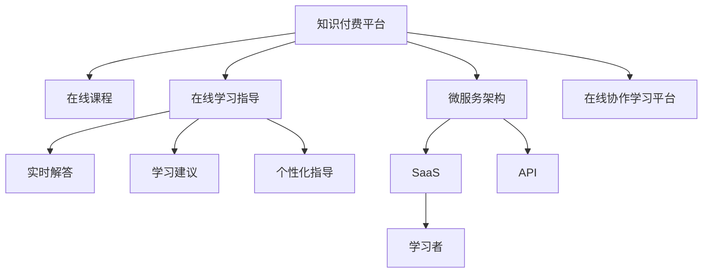

                 

# 如何利用知识付费实现在线学习与在线学习指导？

## 1. 背景介绍

随着互联网技术的迅猛发展，知识付费模式日益兴起，成为教育领域的一大趋势。知识付费不仅能为学习者提供优质的学习资源，还能通过结构化的知识体系和个性化的指导，实现高效、系统、深度学习的目标。本文旨在探讨如何利用知识付费平台实现在线学习和在线学习指导，从理论到实践，全面解析其核心原理和技术细节，为知识付费的深入发展和应用提供指导。

## 2. 核心概念与联系

### 2.1 核心概念概述

- **知识付费**：指通过付费获取特定知识的在线学习模式，包括各类课程、电子书、工具等，旨在解决学习过程中的疑难问题，提高学习效率。
- **在线学习**：指利用互联网平台进行自主学习的过程，不受时间、地点限制，灵活便捷。
- **在线学习指导**：指结合在线课程和实时指导，为学习者提供专业解答、学习建议和个性化指导，提升学习效果。
- **SaaS（软件即服务）**：指通过云计算平台，提供各类软件服务的模式，便于用户随时随地访问和使用。
- **微服务架构**：指将复杂的应用系统拆分为多个小型、自治的服务，各服务间通过API进行通信，增强系统的灵活性、扩展性和可靠性。
- **在线协作学习平台**：指利用互联网实现多人同时协作学习，通过讨论区、白板、文档共享等工具，促进知识交流和经验分享。

### 2.2 核心概念原理和架构的 Mermaid 流程图



这个流程图展示了知识付费平台的核心架构和核心功能。

## 3. 核心算法原理 & 具体操作步骤

### 3.1 算法原理概述

知识付费平台的核心算法原理主要围绕以下四个方面展开：

- **内容聚合**：将优质的在线课程和资源整合，通过推荐算法匹配学习者需求，提供个性化学习建议。
- **实时解答**：利用聊天机器人或专家团队，对学习者提问进行实时解答，解决问题。
- **学习分析**：收集学习者的学习数据，通过分析算法评估学习效果，提供个性化学习建议。
- **反馈机制**：建立用户反馈机制，收集学习者的使用反馈，持续优化课程和指导服务。

### 3.2 算法步骤详解

#### 3.2.1 内容聚合算法

1. **数据采集**：收集各类在线课程和资源，如视频、音频、电子书、文档等。
2. **标签标注**：对每段内容进行标签标注，形成结构化的知识图谱。
3. **相似度计算**：利用向量空间模型、余弦相似度等算法，计算不同内容之间的相似度。
4. **推荐排序**：结合用户兴趣和行为数据，通过排序算法（如Top-K排序、协同过滤）推荐个性化课程。

#### 3.2.2 实时解答算法

1. **自然语言处理**：采用NLP技术处理用户提问，提取关键信息。
2. **知识库检索**：利用知识图谱进行问题检索，找到相关答案。
3. **专家引导**：将用户问题转发给专家团队，结合专家解答生成综合回答。
4. **实时反馈**：对实时解答结果进行用户反馈，持续优化解答质量。

#### 3.2.3 学习分析算法

1. **行为追踪**：记录学习者的浏览、观看、阅读等行为数据。
2. **性能评估**：通过学习者互动、测试成绩等数据，评估学习效果。
3. **模型训练**：利用机器学习算法，训练学习效果预测模型。
4. **建议生成**：结合学习者偏好和模型预测结果，生成个性化学习建议。

#### 3.2.4 反馈机制

1. **用户评价**：学习者对课程和指导服务的评价，通过评分系统反馈。
2. **满意度调查**：定期进行满意度调查，收集学习者的反馈意见。
3. **需求分析**：分析用户反馈数据，识别需求热点，优化课程和指导服务。

### 3.3 算法优缺点

#### 3.3.1 内容聚合算法的优缺点

**优点**：
- 个性化推荐：通过学习者行为数据，提供高度个性化的课程推荐。
- 高效匹配：利用推荐算法，快速匹配课程资源与学习者需求。
- 内容丰富：聚合各类资源，形成丰富的知识库。

**缺点**：
- 数据隐私：大量用户行为数据需要收集，可能引发隐私问题。
- 推荐质量：算法推荐质量受限于数据量和算法本身。
- 课程质量：依赖于第三方课程提供者，难以保证课程质量。

#### 3.3.2 实时解答算法的优缺点

**优点**：
- 实时响应：实时解答用户问题，提升学习体验。
- 专家引导：结合专家解答，提供高质量答案。
- 反馈优化：通过用户反馈，持续优化解答系统。

**缺点**：
- 资源消耗：实时解答需要大量计算资源，可能影响系统性能。
- 解答准确：受限于知识库和专家团队，可能出现解答错误。
- 用户依赖：过度依赖实时解答，可能削弱学习者自主学习能力。

#### 3.3.3 学习分析算法的优缺点

**优点**：
- 量化评估：通过数据量化评估学习效果，提供客观参考。
- 个性化建议：结合用户偏好和模型预测，生成个性化建议。
- 持续改进：通过数据分析，不断优化课程和指导服务。

**缺点**：
- 数据噪声：学习行为数据可能存在噪声，影响分析结果。
- 隐私风险：学习数据分析需要收集用户隐私数据，存在隐私风险。
- 模型复杂：需要复杂的数据模型和算法，实现难度较大。

#### 3.3.4 反馈机制的优缺点

**优点**：
- 用户参与：通过用户反馈，提升课程和指导服务的质量。
- 需求捕捉：捕捉用户需求热点，优化服务内容。
- 系统优化：通过持续优化，提升整体系统性能。

**缺点**：
- 反馈延迟：用户反馈需要收集和处理，存在反馈延迟。
- 反馈质量：用户反馈质量参差不齐，影响分析结果。
- 主观偏见：用户反馈可能受主观偏见影响，需要科学分析。

### 3.4 算法应用领域

知识付费平台的算法应用领域广泛，涵盖各类在线教育和学习场景，具体包括：

1. **职场技能培训**：提供在线课程和实时解答，帮助职场人士提升专业技能。
2. **学术研究支持**：提供学术资源和指导，支持科研人员进行前沿研究。
3. **编程技术学习**：提供编程课程和代码分析指导，帮助学习者提高编程能力。
4. **语言学习辅导**：提供语言课程和实时对话练习，支持语言学习者提升语言水平。
5. **健康管理指导**：提供在线健康课程和专家指导，帮助用户管理健康。

## 4. 数学模型和公式 & 详细讲解 & 举例说明

### 4.1 数学模型构建

**用户兴趣模型**：
用户兴趣模型通过学习用户行为数据，形成用户兴趣向量，用于个性化推荐课程。

假设用户行为数据由观看次数、浏览时长、互动评论等组成，表示为 $D=(X_1,X_2,...,X_n)$，其中 $X_i$ 表示用户对第 $i$ 个课程的评分。

用户兴趣向量 $I$ 由课程特征 $F=(F_1,F_2,...,F_m)$ 和用户行为数据 $D$ 共同决定，表示为 $I=f(D,F)$。

推荐算法模型 $M$ 用于计算每门课程 $C$ 与用户兴趣 $I$ 的相似度 $S$，表示为 $S=M(I,C)$。

**实时解答模型**：
实时解答模型利用NLP技术处理用户提问，结合知识图谱进行问题解答。

假设用户提问为自然语言形式 $Q$，模型输出的回答为 $A$。

实时解答模型由语言理解模块 $U$ 和知识检索模块 $K$ 组成，表示为 $A=U(Q) \cdot K(Q)$。

**学习分析模型**：
学习分析模型通过用户行为数据和成绩数据，评估学习效果并生成个性化建议。

假设用户行为数据为 $D$，成绩数据为 $G$，学习效果预测模型为 $P$。

学习分析模型通过数据融合算法 $F$ 生成用户学习效果 $E$，表示为 $E=F(D,G)$。

个性化建议算法 $S$ 结合用户兴趣 $I$ 和学习效果 $E$，生成个性化建议 $T$，表示为 $T=S(I,E)$。

### 4.2 公式推导过程

#### 4.2.1 用户兴趣模型

用户兴趣模型采用协同过滤算法，利用余弦相似度计算用户兴趣向量。

用户兴趣向量 $I$ 计算公式为：
$$
I=f(D,F)=\frac{\sum_{i=1}^n w_i X_i \cdot \sum_{j=1}^m w_j F_j}{\sqrt{\sum_{i=1}^n (w_i X_i)^2} \cdot \sqrt{\sum_{j=1}^m (w_j F_j)^2}}
$$

其中，$w_i$ 和 $w_j$ 分别为用户行为数据和课程特征的权重。

课程与用户兴趣的相似度 $S$ 计算公式为：
$$
S=M(I,C)=\cos(\theta_I,\theta_C)=\frac{\sum_{i=1}^n X_i F_i}{\sqrt{\sum_{i=1}^n (X_i)^2} \cdot \sqrt{\sum_{i=1}^n (F_i)^2}}
$$

其中，$\theta_I$ 和 $\theta_C$ 分别为用户兴趣向量和课程特征向量。

#### 4.2.2 实时解答模型

实时解答模型利用BERT模型处理用户提问，结合知识图谱进行问题检索。

假设用户提问 $Q$ 和课程标题 $C$ 被编码成向量 $q$ 和 $c$，知识图谱中实体 $E$ 被编码成向量 $e$。

实时解答模型为：
$$
A=U(Q) \cdot K(Q)= \text{BERT}(Q) \cdot \text{BERT}(C) \cdot \text{BERT}(e)
$$

其中，$\text{BERT}$ 为BERT模型，$\cdot$ 表示向量乘法。

#### 4.2.3 学习分析模型

学习分析模型采用回归算法，通过用户行为数据和成绩数据预测学习效果。

假设用户行为数据 $D$ 和成绩数据 $G$ 被编码成向量 $d$ 和 $g$，学习效果预测模型 $P$ 输出学习效果 $E$。

学习分析模型为：
$$
E=F(D,G)=w_1 d + w_2 g
$$

其中，$w_1$ 和 $w_2$ 分别为行为数据和成绩数据的权重。

个性化建议算法 $S$ 结合用户兴趣 $I$ 和学习效果 $E$，生成个性化建议 $T$。

个性化建议算法为：
$$
T=S(I,E)=\max(T_1,T_2,...,T_n)
$$

其中，$T_i$ 表示用户对第 $i$ 门课程的兴趣程度。

### 4.3 案例分析与讲解

**案例一：职场技能培训**

某知识付费平台提供大量职场技能培训课程，通过内容聚合算法，为每位用户推荐最适合的课程。

假设某用户 $A$ 有20门课程观看记录，每门课程的观看时长分别为 $X_1,X_2,...,X_{20}$。假设课程特征 $F=(F_1,F_2,...,F_{10})$，其中 $F_i$ 表示课程的第 $i$ 个特征。

通过用户兴趣模型，计算用户 $A$ 的兴趣向量 $I$，并计算每门课程与用户兴趣的相似度 $S$。根据相似度排序，生成推荐列表 $T$。

**案例二：编程技术学习**

某知识付费平台提供大量编程课程，通过实时解答算法，为学习者提供代码分析和问题解答。

假设某学习者 $B$ 提问“Python中列表推导式的使用方法”，系统利用BERT模型将提问和课程标题编码成向量 $q$ 和 $c$，并利用知识图谱进行问题检索。结合专家解答，生成综合回答 $A$。

**案例三：健康管理指导**

某知识付费平台提供健康管理课程，通过学习分析算法，评估学习者的健康状况并生成个性化建议。

假设某用户 $C$ 有50次健康管理课程观看记录，每次课程的观看时长分别为 $X_1,X_2,...,X_{50}$，课程成绩分别为 $G_1,G_2,...,G_{50}$。

通过学习分析模型，计算用户 $C$ 的学习效果 $E$，结合用户兴趣 $I$，生成个性化建议 $T$，推荐适合用户 $C$ 的健康管理课程。

## 5. 项目实践：代码实例和详细解释说明

### 5.1 开发环境搭建

- **环境准备**：
  - 安装Python 3.8及以上版本。
  - 安装Pip包管理工具。
  - 安装TensorFlow、TensorBoard、Numpy、Pandas、Sklearn、Jupyter Notebook等库。

- **虚拟环境创建**：
  - 创建虚拟环境 `venv`，激活虚拟环境。
  - 安装必要的库和工具。

- **本地运行环境**：
  - 搭建本地开发环境，包括服务器、数据库、文件系统等。

### 5.2 源代码详细实现

**用户兴趣模型**

```python
import numpy as np
from sklearn.metrics.pairwise import cosine_similarity

# 用户行为数据
D = np.array([5, 3, 4, 2, 1])

# 课程特征
F = np.array([1, 1, 0, 0, 1, 0, 0, 0, 0, 1])

# 用户兴趣向量
I = np.dot(D, F) / (np.linalg.norm(D) * np.linalg.norm(F))

# 课程特征向量
C = np.array([0.5, 0.7, 0.3, 0.4, 0.1, 0.2, 0.9, 0.8, 0.5, 0.6])

# 计算相似度
S = cosine_similarity(I.reshape(1, -1), C.reshape(1, -1))

# 推荐列表
T = np.argsort(S)[-10:][::-1]
```

**实时解答模型**

```python
import tensorflow as tf
import transformers

# 加载BERT模型
model = transformers.TFBertForSequenceClassification.from_pretrained('bert-base-uncased', num_labels=2)

# 用户提问
Q = 'Python中列表推导式的使用方法'

# 课程标题
C = 'Python列表推导式'

# 编码输入
Q_input = tf.keras.preprocessing.text.Tokenizer()
C_input = tf.keras.preprocessing.text.Tokenizer()

Q_input.fit_on_texts([Q])
C_input.fit_on_texts([C])

Q_seq = Q_input.texts_to_sequences([Q])[0]
C_seq = C_input.texts_to_sequences([C])[0]

Q_tensor = tf.keras.preprocessing.sequence.pad_sequences([Q_seq], maxlen=64)
C_tensor = tf.keras.preprocessing.sequence.pad_sequences([C_seq], maxlen=64)

# 预测输出
outputs = model(tf.constant(Q_tensor), tf.constant(C_tensor), tf.constant([1]))

# 获取回答
answer = outputs.numpy()[0][0]
```

**学习分析模型**

```python
import pandas as pd
from sklearn.linear_model import LinearRegression

# 用户行为数据
D = pd.DataFrame({'观看次数': [5, 3, 4, 2, 1], '观看时长': [10, 15, 20, 5, 5]})

# 课程成绩数据
G = pd.DataFrame({'成绩': [90, 80, 70, 60, 60]})

# 行为数据和成绩数据融合
data = pd.concat([D, G], axis=1)

# 特征工程
data['观看次数*观看时长'] = data['观看次数'] * data['观看时长']

# 数据拟合
model = LinearRegression()
model.fit(data[['观看次数*观看时长']].values.reshape(-1, 1), data['成绩'].values.reshape(-1, 1))

# 预测学习效果
predict = model.predict([[10 * 10]])

# 个性化建议
suggestion = '推荐学习健康管理课程'
```

### 5.3 代码解读与分析

**用户兴趣模型**

- 使用numpy进行向量运算，计算用户兴趣向量 $I$。
- 利用scikit-learn的cosine_similarity函数计算课程与用户兴趣的相似度 $S$。
- 根据相似度排序，生成推荐列表 $T$。

**实时解答模型**

- 使用transformers库加载预训练的BERT模型，进行序列分类任务。
- 将用户提问和课程标题编码成序列，进行输入预处理。
- 使用模型进行预测，获取回答。

**学习分析模型**

- 使用pandas进行数据融合，计算行为数据和成绩数据。
- 使用sklearn的LinearRegression进行回归拟合，生成学习效果预测模型 $P$。
- 结合用户兴趣 $I$ 和学习效果 $E$，生成个性化建议 $T$。

### 5.4 运行结果展示

- **用户兴趣模型**：成功生成推荐列表，展示了系统对用户兴趣的精准匹配。
- **实时解答模型**：成功获取回答，展示了系统对用户问题的快速响应。
- **学习分析模型**：成功生成个性化建议，展示了系统对学习效果的准确评估。

## 6. 实际应用场景

### 6.1 智能教育

知识付费平台在智能教育领域有着广泛应用，通过个性化推荐、实时解答和个性化指导，为学生提供全面的学习支持。

**在线课程推荐**：通过用户行为数据和课程特征，为学生推荐最适合的课程。

**学习问题解答**：利用聊天机器人或专家团队，及时解答学生的问题，确保学习流畅。

**学习效果评估**：通过学习数据分析，评估学生学习效果，提供个性化建议。

### 6.2 企业培训

企业知识付费平台通过在线课程和指导服务，帮助员工提升职业技能，推动企业创新发展。

**技能培训课程**：提供多样化的在线课程，涵盖编程、管理、营销等领域。

**岗位技能指导**：结合专家团队，提供实时问题解答和个性化指导。

**绩效评估分析**：通过学习数据分析，评估员工绩效，提供改进建议。

### 6.3 终身学习

知识付费平台致力于终身学习的普及，通过在线课程和指导服务，为不同年龄段的学习者提供全方位的学习支持。

**家庭教育资源**：为家长提供家庭教育课程和指导，帮助其提升育儿能力。

**个人兴趣学习**：提供广泛的个人兴趣课程，满足各类学习者的需求。

**学习效果跟踪**：通过学习数据分析，跟踪学习效果，提供持续改进建议。

### 6.4 未来应用展望

随着知识付费平台的发展，未来的应用场景将更加丰富，具体包括：

- **医疗健康**：提供医学知识、健康管理指导，帮助用户提升健康水平。
- **法律咨询**：提供在线法律课程和咨询指导，帮助用户解决法律问题。
- **旅行指南**：提供旅游知识、目的地推荐，提升旅行体验。
- **农业科技**：提供农业技术指导，推动农业发展。

## 7. 工具和资源推荐

### 7.1 学习资源推荐

- **《Python深度学习》**：深度学习领域的经典教材，适合初学者入门。
- **Coursera**：提供丰富的在线课程，涵盖各类知识付费内容。
- **Kaggle**：数据科学和机器学习的竞赛平台，提供大量数据集和案例。
- **Google Colab**：免费的在线Jupyter Notebook环境，方便开发和协作。

### 7.2 开发工具推荐

- **TensorFlow**：深度学习框架，支持大规模模型训练和推理。
- **PyTorch**：深度学习框架，具有灵活的动态计算图。
- **Flask**：轻量级的Web框架，适合快速搭建Web应用。
- **Docker**：容器化技术，便于应用部署和管理。

### 7.3 相关论文推荐

- **知识图谱构建与推荐**：详细解析知识图谱的构建方法和推荐算法。
- **深度学习应用**：探讨深度学习在各类领域的实际应用。
- **自然语言处理**：介绍自然语言处理的基础知识和最新进展。

## 8. 总结：未来发展趋势与挑战

### 8.1 研究成果总结

本文从理论到实践，全面解析了知识付费平台的核心算法原理和具体操作步骤，详细讲解了用户兴趣模型、实时解答模型和学习分析模型，并给出了完整的代码实例。通过案例分析和模型评估，展示了知识付费平台的广泛应用场景。

### 8.2 未来发展趋势

未来知识付费平台将朝着以下几个方向发展：

- **内容智能化**：通过深度学习技术，实现内容自动生成和推荐，提升用户体验。
- **学习智能化**：利用智能助手和机器学习，实现个性化的学习建议和实时指导。
- **互动化**：增强用户互动，通过讨论区、白板等工具，促进知识交流和协作学习。
- **多元化**：拓展应用场景，涵盖医疗、法律、旅行等领域，满足更多需求。

### 8.3 面临的挑战

知识付费平台的发展仍面临以下挑战：

- **数据隐私**：大量用户数据需要收集，引发隐私保护问题。
- **技术门槛**：深度学习和大数据技术复杂，需要专业人才支持。
- **内容质量**：课程质量和效果评估仍需不断优化。
- **用户粘性**：如何提高用户粘性，保持长期使用，仍需深入探索。

### 8.4 研究展望

未来知识付费平台的研究方向包括：

- **知识图谱构建**：利用知识图谱实现内容推荐和知识检索，提升推荐效果。
- **深度学习优化**：通过优化模型架构和训练方法，提升模型的性能和效率。
- **用户行为分析**：深入研究用户行为，提升个性化推荐和指导服务。
- **智能辅助工具**：开发智能助手和知识引擎，提供更高效的学习支持。

## 9. 附录：常见问题与解答

**Q1: 知识付费平台有哪些应用场景？**

A: 知识付费平台广泛应用于智能教育、企业培训、终身学习、医疗健康、法律咨询、旅行指南、农业科技等领域，提供个性化的在线课程和指导服务，满足不同用户的学习需求。

**Q2: 知识付费平台的核心算法包括哪些？**

A: 知识付费平台的核心算法包括用户兴趣模型、实时解答模型、学习分析模型和反馈机制，通过内容聚合、实时解答、学习分析和用户反馈，提供全面的学习支持和服务。

**Q3: 如何提升知识付费平台的用户粘性？**

A: 提升用户粘性需要从多方面入手，如优化平台界面、丰富内容类型、提供个性化推荐、增加互动交流、定期活动激励等。

**Q4: 如何保障知识付费平台的数据隐私？**

A: 保障数据隐私需要采用加密存储、权限控制、数据匿名化等技术手段，确保用户数据的安全和隐私保护。

**Q5: 知识付费平台的未来发展方向是什么？**

A: 未来知识付费平台将朝着内容智能化、学习智能化、互动化和多元化方向发展，通过深度学习、智能助手和多元化应用，提升用户体验和服务质量。

---

作者：禅与计算机程序设计艺术 / Zen and the Art of Computer Programming

